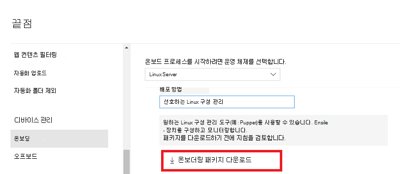

# <a name="deploy-microsoft-defender-for-endpoint-on-linux-with-ansible"></a>Ansible을 통해 Linux에서 끝점용 Microsoft Defender 배포

[!INCLUDE [Microsoft 365 Defender rebranding](../../includes/microsoft-defender.md)]


**적용 대상:**
- [엔드포인트용 Microsoft Defender](https://go.microsoft.com/fwlink/p/?linkid=2154037)
- [Microsoft 365 Defender](https://go.microsoft.com/fwlink/?linkid=2118804)

> Endpoint용 Defender를 경험하고 싶나요? [무료 평가판을 신청하세요.](https://signup.microsoft.com/create-account/signup?products=7f379fee-c4f9-4278-b0a1-e4c8c2fcdf7e&ru=https://aka.ms/MDEp2OpenTrial?ocid=docs-wdatp-investigateip-abovefoldlink)

이 문서에서는 Ansible을 사용하여 Linux에서 Endpoint용 Defender를 배포하는 방법을 설명합니다. 배포를 성공적으로 수행하려면 다음 작업을 모두 완료해야 합니다.

- [온보더링 패키지 다운로드](#download-the-onboarding-package)
- [Ansible YAML 파일 만들기](#create-ansible-yaml-files)
- [배포](#deployment)
- [참조](#references)

## <a name="prerequisites-and-system-requirements"></a>선행 조건 및 시스템 요구 사항

시작하기 전에 Linux의 끝점용 기본 [Defender](microsoft-defender-endpoint-linux.md) 페이지에서 현재 소프트웨어 버전에 대한 선행 조건 및 시스템 요구 사항에 대한 설명을 참조하세요.

또한 Ansible 배포의 경우 Ansible 관리 작업에 익숙하고, Ansible을 구성하고, 플레이북 및 작업을 배포하는 방법을 알아야 합니다. Ansible에는 동일한 작업을 완료하는 여러 가지 방법이 있습니다. 이러한 지침에서는 패키지 배포에 도움이 되는 *apt* 및 *unarchive와* 같은 지원되는 Ansible 모듈의 가용성을 가정합니다. 조직에서 다른 워크플로를 사용할 수 있습니다. 자세한 내용은 [Ansible 설명서를](https://docs.ansible.com/) 참조하십시오.

- Ansible은 하나 이상의 컴퓨터에 설치해야 합니다(Ansible은 이 컨트롤 노드를 호출합니다).
- 제어 노드와 모든 관리 노드(끝점에 Defender를 설치할 장치) 사이의 관리자 계정에 대해 SSH를 구성해야 합니다. 공개 키 인증을 사용하여 구성하는 것이 좋습니다.
- 모든 관리 노드에 다음 소프트웨어를 설치해야 합니다.
  - curl
  - python-apt

- 모든 관리되는 노드는 해당 또는 관련 파일에 다음 형식으로 `/etc/ansible/hosts` 나열되어야 합니다.

    ```bash
    [servers]
    host1 ansible_ssh_host=10.171.134.39
    host2 ansible_ssh_host=51.143.50.51
    ```

- Ping 테스트:

    ```bash
    ansible -m ping all
    ```

## <a name="download-the-onboarding-package"></a>온보더링 패키지 다운로드

다음 포털에서 온보 Microsoft 365 Defender 다운로드합니다.

1. Microsoft 365 Defender 포털에서 장치 관리 설정 > 끝점 > 온보 > **로 이동하세요.**
2. 첫 번째 드롭다운 메뉴에서 **운영 체제로 Linux Server를** 선택합니다. 두 번째 드롭다운 메뉴에서 배포 **방법으로** 기본 Linux 구성 관리 도구를 선택합니다.
3. **온보더링 패키지 다운로드를 선택합니다.** 파일을 다른 파일로 WindowsDefenderATPOnboardingPackage.zip.

    

4. 명령 프롬프트에서 파일이 있는지 확인 보관함의 내용을 추출합니다.

    ```bash
    ls -l
    ```
    ```Output
    total 8
    -rw-r--r-- 1 test  staff  4984 Feb 18 11:22 WindowsDefenderATPOnboardingPackage.zip
    ```
    ```bash
    unzip WindowsDefenderATPOnboardingPackage.zip
    ```
    ```Output
    Archive:  WindowsDefenderATPOnboardingPackage.zip
    inflating: mdatp_onboard.json
    ```

## <a name="create-ansible-yaml-files"></a>Ansible YAML 파일 만들기

재생 문서 또는 작업에 기여하는 하위 작업 또는 역할 파일을 생성합니다.

- 온보더링 작업 만들기: `onboarding_setup.yml`

    ```bash
    - name: Create MDATP directories
      file:
        path: /etc/opt/microsoft/mdatp/
        recurse: true
        state: directory
        mode: 0755
        owner: root
        group: root

    - name: Register mdatp_onboard.json
      stat:
        path: /etc/opt/microsoft/mdatp/mdatp_onboard.json
      register: mdatp_onboard

    - name: Extract WindowsDefenderATPOnboardingPackage.zip into /etc/opt/microsoft/mdatp
      unarchive:
        src: WindowsDefenderATPOnboardingPackage.zip
        dest: /etc/opt/microsoft/mdatp
        mode: 0600
        owner: root
        group: root
      when: not mdatp_onboard.stat.exists
    ```

- Endpoint 리포지토리용 Defender 및 키를 추가합니다. `add_apt_repo.yml` :

    Linux의 끝점용 Defender는 다음 채널(아래 *[채널]으로* 표시됨) 중 하나에서 배포할 수 있습니다. *insiders-fast,* *insiders-slow* 또는 *prod*. 이러한 각 채널은 Linux 소프트웨어 리포지토리에 해당합니다.

    채널 선택에 따라 장치에 제공되는 업데이트의 유형과 빈도가 결정됩니다. *insiders-fast의* 장치는 업데이트 및 새 기능을 수신하는 첫 번째  장치로, 그 다음에는 이후의 내부자 속도가 느려지며 마지막으로 *prod가 됩니다.*

    새 기능을 미리 보고 초기 피드백을 제공하도록 엔터프라이즈의 일부 장치는 *insiders-fast* 또는 *insiders-slow를* 사용하도록 구성하는 것이 좋습니다.

    > [!WARNING]
    > 초기 설치 후 채널을 전환하려면 제품을 다시 설치해야 합니다. 제품 채널을 전환하려면 기존 패키지를 제거하고 새 채널을 사용하도록 장치를 다시 구성하고 이 문서의 단계에 따라 새 위치에서 패키지를 설치합니다.

    배포 및 버전을 확인하고 에서 가장 가까운 항목을 `https://packages.microsoft.com/config/[distro]/` 식별합니다.

    다음 명령에서 *[distro]* 및 *[version]을* 식별한 정보로 바 대체합니다.

    > [!NOTE]
    > Oracle Linux 및 Amazon Linux 2의 경우 *[distro]를* "rhel"으로 대체합니다.

  ```bash
  - name: Add Microsoft APT key
    apt_key:
      url: https://packages.microsoft.com/keys/microsoft.asc
      state: present
    when: ansible_os_family == "Debian"

  - name: Add Microsoft apt repository for MDATP
    apt_repository:
      repo: deb [arch=arm64,armhf,amd64] https://packages.microsoft.com/config/[distro]/[version]/prod [channel] main
      update_cache: yes
      state: present
      filename: microsoft-[channel]
    when: ansible_os_family == "Debian"

  - name: Add Microsoft DNF/YUM key
    rpm_key:
      state: present
      key: https://packages.microsoft.com/keys/microsoft.asc
    when: ansible_os_family == "RedHat"

  - name: Add  Microsoft yum repository for MDATP
    yum_repository:
      name: packages-microsoft-[channel]
      description: Microsoft Defender for Endpoint
      file: microsoft-[channel]
      baseurl: https://packages.microsoft.com/[distro]/[version]/[channel]/ 
      gpgcheck: yes
      enabled: Yes
    when: ansible_os_family == "RedHat"
  ```

- Ansible 설치를 만들고 YAML 파일을 제거합니다.

    - apt 기반 배포의 경우 다음 YAML 파일을 사용 합니다.

        ```bash
        cat install_mdatp.yml
        ```
        ```Output
        - hosts: servers
          tasks:
            - include: ../roles/onboarding_setup.yml
            - include: ../roles/add_apt_repo.yml
            - name: Install MDATP
              apt:
                name: mdatp
                state: latest
                update_cache: yes
        ```

        ```bash
        cat uninstall_mdatp.yml
        ```
        ```Output
        - hosts: servers
          tasks:
            - name: Uninstall MDATP
              apt:
                name: mdatp
                state: absent
        ```

    - dnf 기반 배포의 경우 다음 YAML 파일을 사용 합니다.

        ```bash
        cat install_mdatp_dnf.yml
        ```
        ```Output
        - hosts: servers
          tasks:
            - include: ../roles/onboarding_setup.yml
            - include: ../roles/add_yum_repo.yml
            - name: Install MDATP
              dnf:
                name: mdatp
                state: latest
                enablerepo: packages-microsoft-com-prod-[channel]
        ```

        ```bash
        cat uninstall_mdatp_dnf.yml
        ```
        ```Output
        - hosts: servers
          tasks:
            - name: Uninstall MDATP
              dnf:
                name: mdatp
                state: absent
        ```

## <a name="deployment"></a>배포

이제 작업 파일을 또는 관련 `/etc/ansible/playbooks/` 디렉터리에서 실행합니다.

- 설치:

    ```bash
    ansible-playbook /etc/ansible/playbooks/install_mdatp.yml -i /etc/ansible/hosts
    ```

> [!IMPORTANT]
> 제품이 처음 시작되면 최신 맬웨어 방지 정의를 다운로드합니다. 인터넷 연결에 따라 이 시간이 몇 분 정도 걸릴 수 있습니다.

- 유효성 검사/구성:

    ```bash
    ansible -m shell -a 'mdatp connectivity test' all
    ```
    ```bash
    ansible -m shell -a 'mdatp health' all
    ```

- 제거:

    ```bash
    ansible-playbook /etc/ansible/playbooks/uninstall_mdatp.yml -i /etc/ansible/hosts
    ```

## <a name="log-installation-issues"></a>로그 설치 문제

오류가 [발생할 때](linux-resources.md#log-installation-issues) 설치 관리자에서 자동으로 생성된 로그를 찾는 방법에 대한 자세한 내용은 설치 문제 로그를 참조하세요.

## <a name="operating-system-upgrades"></a>운영 체제 업그레이드

운영 체제를 새 주 버전으로 업그레이드할 때 먼저 Linux에서 Endpoint용 Defender를 제거하고 업그레이드를 설치한 다음, 디바이스에서 Linux용 Endpoint용 Defender를 다시 구성해야 합니다.

## <a name="references"></a>참조

- [YUM 리포지토리 추가 또는 제거](https://docs.ansible.com/ansible/latest/collections/ansible/builtin/yum_repository_module.html)

- [dnf 패키지 관리자를 사용하여 패키지 관리](https://docs.ansible.com/ansible/latest/collections/ansible/builtin/dnf_module.html)

- [APT 리포지토리 추가 및 제거](https://docs.ansible.com/ansible/latest/collections/ansible/builtin/apt_repository_module.html)

- [apt-packages 관리](https://docs.ansible.com/ansible/latest/collections/ansible/builtin/apt_module.html)

## <a name="see-also"></a>참고 항목
- [에이전트 상태 문제 조사](health-status.md)
