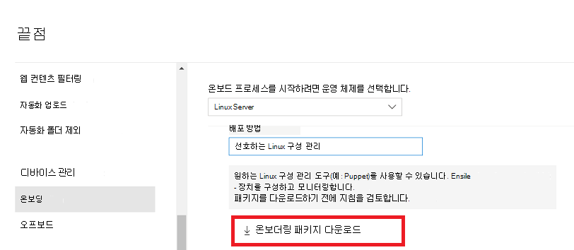

# <a name="deploy-microsoft-defender-for-endpoint-on-linux-with-puppet"></a>Puppet을 통해 Linux에서 끝점용 Microsoft Defender 배포

[!INCLUDE [Microsoft 365 Defender rebranding](../../includes/microsoft-defender.md)]


**적용 대상:**
- [엔드포인트용 Microsoft Defender](https://go.microsoft.com/fwlink/p/?linkid=2154037)
- [Microsoft 365 Defender](https://go.microsoft.com/fwlink/?linkid=2118804)

> Endpoint용 Defender를 경험하고 싶나요? [무료 평가판을 신청하세요.](https://signup.microsoft.com/create-account/signup?products=7f379fee-c4f9-4278-b0a1-e4c8c2fcdf7e&ru=https://aka.ms/MDEp2OpenTrial?ocid=docs-wdatp-investigateip-abovefoldlink)

이 문서에서는 Puppet을 사용하여 Linux에서 Endpoint용 Defender를 배포하는 방법을 설명합니다. 배포를 성공적으로 수행하려면 다음 작업을 모두 완료해야 합니다.

- [온보더링 패키지 다운로드](#download-the-onboarding-package)
- [Puppet 매니페스트 만들기](#create-a-puppet-manifest)
- [배포](#deployment)
- [온보더링 상태 확인](#check-onboarding-status)

## <a name="prerequisites-and-system-requirements"></a>선행 조건 및 시스템 요구 사항

 현재 소프트웨어 버전에 대한 선행 조건 및 시스템 요구 사항에 대한 설명은 Linux의 끝점에 대한 기본 [Defender 페이지를 참조하세요.](microsoft-defender-endpoint-linux.md)

또한 Puppet 배포의 경우 Puppet 관리 작업에 익숙하고, Puppet을 구성하고, 패키지를 배포하는 방법을 알아야 합니다. Puppet에는 동일한 작업을 여러 가지 방법으로 완료할 수 있습니다. 이러한 지침에서는 패키지 배포에 도움이 되는 *apt와* 같은 지원되는 Puppet 모듈의 가용성을 가정합니다. 조직에서 다른 워크플로를 사용할 수 있습니다. 자세한 내용은 [Puppet 설명서를](https://puppet.com/docs) 참조하십시오.

## <a name="download-the-onboarding-package"></a>온보더링 패키지 다운로드

다음 포털에서 온보 Microsoft 365 Defender 다운로드합니다.

1. Microsoft 365 Defender 포털에서 장치 관리 설정 > 끝점 > 온보 > **로 이동하세요.**
2. 첫 번째 드롭다운 메뉴에서 **운영 체제로 Linux Server를** 선택합니다. 두 번째 드롭다운 메뉴에서 배포 **방법으로** 기본 Linux 구성 관리 도구를 선택합니다.
3. **온보더링 패키지 다운로드를 선택합니다.** 파일을 다른 파일로 WindowsDefenderATPOnboardingPackage.zip.

    

4. 명령 프롬프트에서 파일이 있는지 확인 

    ```bash
    ls -l
    ```
    ```Output
    total 8
    -rw-r--r-- 1 test  staff  4984 Feb 18 11:22 WindowsDefenderATPOnboardingPackage.zip
    ```
5. 보관함의 내용을 추출합니다.
    ```bash
    unzip WindowsDefenderATPOnboardingPackage.zip
    ```
    ```Output
    Archive:  WindowsDefenderATPOnboardingPackage.zip
    inflating: mdatp_onboard.json
    ```

## <a name="create-a-puppet-manifest"></a>Puppet 매니페스트 만들기

Puppet 서버에서 관리하는 장치에 Linux의 Endpoint용 Defender를 배포하기 위한 Puppet 매니페스트를 만들어야 합니다. 이 예제에서는 puppetlabs에서 사용할 수 있는 *apt* 및 *yumrepo* 모듈을 사용하며, 모듈이 Puppet 서버에 설치되어 있는 것으로 가정합니다.

Puppet 설치의 *모듈 install_mdatp/파일* 및 install_mdatp/매니페스트에 대한 폴더를 만들 수 있습니다.  이 폴더는 일반적으로 Puppet 서버의 */etc/puppetlabs/code/environments/production/modules에* 있습니다. 위에서 만든 mdatp_onboard.json 파일을 install_mdatp *폴더에 복사합니다.* *init.pp 만들기* 배포 지침이 포함된 파일:

```bash
pwd
```
```Output
/etc/puppetlabs/code/environments/production/modules
```

```bash
tree install_mdatp
```
```Output
install_mdatp
├── files
│   └── mdatp_onboard.json
└── manifests
    └── init.pp
```

### <a name="contents-of-install_mdatpmanifestsinitpp"></a>의 내용 `install_mdatp/manifests/init.pp`

Linux의 끝점용 Defender는 다음 채널(아래 *[채널]으로* 표시됨) 중 하나에서 배포할 수 있습니다. *insiders-fast,* *insiders-slow* 또는 *prod*. 이러한 각 채널은 Linux 소프트웨어 리포지토리에 해당합니다.

채널 선택에 따라 장치에 제공되는 업데이트의 유형과 빈도가 결정됩니다. *insiders-fast의* 장치는 업데이트 및 새 기능을 수신하는 첫 번째  장치로, 그 다음에는 이후의 내부자 속도가 느려지며 마지막으로 *prod가 됩니다.*

새 기능을 미리 보고 초기 피드백을 제공하도록 엔터프라이즈의 일부 장치는 *insiders-fast* 또는 *insiders-slow를* 사용하도록 구성하는 것이 좋습니다.

> [!WARNING]
> 초기 설치 후 채널을 전환하려면 제품을 다시 설치해야 합니다. 제품 채널을 전환하려면 기존 패키지를 제거하고 새 채널을 사용하도록 장치를 다시 구성하고 이 문서의 단계에 따라 새 위치에서 패키지를 설치합니다.

배포 및 버전을 확인하고 에서 가장 가까운 항목을 `https://packages.microsoft.com/config/[distro]/` 식별합니다.

아래 명령에서 *[distro]* 및 *[version]을* 식별한 정보로 바 대체합니다.

> [!NOTE]
> RedHat, Oracle Linux, Amazon Linux 2 및 CentOS 8의 경우 *[distro]를* 'rhel'으로 대체합니다.

```puppet
# Puppet manifest to install Microsoft Defender for Endpoint on Linux.
# @param channel The release channel based on your environment, insider-fast or prod.
# @param distro The Linux distribution in lowercase. In case of RedHat, Oracle Linux, Amazon Linux 2, and CentOS 8, the distro variable should be 'rhel'.
# @param version The Linux distribution release number, e.g. 7.4.

class install_mdatp (
$channel = 'insiders-fast',
$distro = undef,
$version = undef
){
    case $::osfamily {
        'Debian' : {
            apt::source { 'microsoftpackages' :
                location => "https://packages.microsoft.com/config/${distro}/${version}/prod",
                release  => $channel,
                repos    => 'main',
                key      => {
                    'id'     => 'BC528686B50D79E339D3721CEB3E94ADBE1229CF',
                    'server' => 'keyserver.ubuntu.com',
                },
            }
        }
        'RedHat' : {
            yumrepo { 'microsoftpackages' :
                baseurl  => "https://packages.microsoft.com/config/${distro}/${version}/${channel}",
                descr    => "packages-microsoft-com-prod-${channel}",
                enabled  => 1,
                gpgcheck => 1,
                gpgkey   => 'https://packages.microsoft.com/keys/microsoft.asc'
            }
        }
        default : { fail("${::osfamily} is currently not supported.") }
    }

    case $::osfamily {
        /(Debian|RedHat)/: {
            file { ['/etc/opt', '/etc/opt/microsoft', '/etc/opt/microsoft/mdatp']:
                ensure => directory,
                owner  => root,
                group  => root,
                mode   => '0755'
            }

            file { '/etc/opt/microsoft/mdatp/mdatp_onboard.json':
                source  => 'puppet:///modules/install_mdatp/mdatp_onboard.json',
                owner   => root,
                group   => root,
                mode    => '0600',
                require => File['/etc/opt/microsoft/mdatp']
            }

            package { 'mdatp':
                ensure  => 'installed',
                require => File['/etc/opt/microsoft/mdatp/mdatp_onboard.json']
            }
        }
        default : { fail("${::osfamily} is currently not supported.") }
    }
}
```

## <a name="deployment"></a>배포

site.pp에 위의 매니페스트 포함 파일:

```bash
cat /etc/puppetlabs/code/environments/production/manifests/site.pp
```
```Output
node "default" {
    include install_mdatp
}
```

등록된 에이전트 장치는 정기적으로 Puppet 서버를 폴링하고 새 구성 프로필 및 정책이 검색되는 즉시 설치합니다.

## <a name="monitor-puppet-deployment"></a>Puppet 배포 모니터링

에이전트 장치에서 다음을 실행하여 온보더링 상태를 확인할 수 있습니다.

```bash
mdatp health
```
```Output
...
licensed                                : true
org_id                                  : "[your organization identifier]"
...
```

- **licensed:** 이 경우 장치가 조직에 연결됩니다.

- **orgId**: 끝점 조직 식별자에 대한 Defender입니다.

## <a name="check-onboarding-status"></a>온보더링 상태 확인

스크립트를 만들어 장치가 올바르게 온보딩된지 확인할 수 있습니다. 예를 들어 다음 스크립트는 등록된 디바이스에서 등록 상태를 검사합니다.

```bash
mdatp health --field healthy
```

위의 명령은 제품이 온보드되어 예상대로 작동하면 `1` 인쇄합니다.

> [!IMPORTANT]
> 제품이 처음 시작되면 최신 맬웨어 방지 정의를 다운로드합니다. 인터넷 연결에 따라 이 시간이 몇 분 정도 걸릴 수 있습니다. 이 시간 동안 위의 명령은 의 값을 `0` 반환합니다.

제품이 정상이 아닌 경우 종료 코드(를 통해 확인할 수 있습니다.)는 `echo $?` 문제를 나타냅니다.

- 1 장치가 아직 온보드되지 않은 경우 1입니다.
- 3 데몬에 대한 연결을 설정하지 못하면 3.

## <a name="log-installation-issues"></a>로그 설치 문제

 오류가 발생할 때 설치 관리자에서 자동으로 생성된 로그를 찾는 방법에 대한 자세한 내용은 로그 설치 [문제 를 참조하세요.](linux-resources.md#log-installation-issues)

## <a name="operating-system-upgrades"></a>운영 체제 업그레이드

운영 체제를 새 주 버전으로 업그레이드할 때 먼저 Linux에서 Endpoint용 Defender를 제거하고 업그레이드를 설치한 다음, 디바이스에서 Linux용 Endpoint용 Defender를 다시 구성해야 합니다.

## <a name="uninstallation"></a>제거

*init.pp에서* *remove_mdatp*  있는 install_mdatp 모듈 만들기 파일:

```bash
class remove_mdatp {
    package { 'mdatp':
        ensure => 'purged',
    }
}
```
