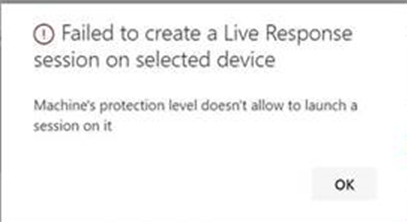

# <a name="investigate-entities-on-devices-using-live-response"></a>라이브 응답을 사용하여 디바이스에서 엔터티 조사

[!INCLUDE [Microsoft 365 Defender rebranding](../../includes/microsoft-defender.md)]

**적용 대상:**
- [엔드포인트용 Microsoft Defender](https://go.microsoft.com/fwlink/p/?linkid=2154037)
- [Microsoft 365 Defender](https://go.microsoft.com/fwlink/?linkid=2118804)


> Endpoint용 Defender를 경험하고 싶나요? [무료 평가판을 신청하세요.](https://signup.microsoft.com/create-account/signup?products=7f379fee-c4f9-4278-b0a1-e4c8c2fcdf7e&ru=https://aka.ms/MDEp2OpenTrial?ocid=docs-wdatp-investigateip-abovefoldlink)

실시간 응답은 보안 운영 팀이 원격 셸 연결을 사용하여 장치(컴퓨터라고도도 지칭)에 즉시 액세스할 수 있도록 합니다. 이를 통해 심층 조사 작업을 수행하고 즉각적인 대응 조치를 취하여 식별된 위협을 실시간으로 즉시 포함할 수 있습니다.

실시간 대응은 보안 운영 팀이 법의적 데이터를 수집하고, 스크립트를 실행하고, 분석을 위해 의심스러운 엔터티를 보내고, 위협을 수정하고, 새로운 위협을 사전 대응할 수 있도록 하여 조사를 향상시킵니다.

> [!VIDEO https://www.microsoft.com/videoplayer/embed/RE4qLUW]

실시간 응답을 통해 분석가가 다음 작업을 모두 수행할 수 있습니다.

- 기본 및 고급 명령을 실행하여 장치에서 조사 작업을 실행합니다.
- PowerShell 스크립트의 맬웨어 샘플 및 결과와 같은 파일을 다운로드합니다.
- 백그라운드에서 파일을 다운로드합니다(new!).
- 업로드 PowerShell 스크립트 또는 실행을 라이브러리에 추가하고 테넌트 수준에서 디바이스에서 실행합니다.
- 수정 작업을 수행하거나 취소합니다.

## <a name="before-you-begin"></a>시작하기 전에

장치에서 세션을 시작하려면 먼저 다음 요구 사항을 충족해야 합니다.

- 지원되는 버전의 를 실행 **중인지 Windows.**

  장치에서 다음 버전의 디바이스 중 하나를 실행해야 Windows

  - **Windows 10 & 11**
    - [버전 1909](/windows/whats-new/whats-new-windows-10-version-1909) 이상
    - [버전 1903(KB4515384)](https://support.microsoft.com/help/4515384/windows-10-update-kb4515384) [](/windows/whats-new/whats-new-windows-10-version-1903)
    - [KB4537818이](https://support.microsoft.com/help/4537818/windows-10-update-kb4537818) 있는 버전 [1809(RS 5)](/windows/whats-new/whats-new-windows-10-version-1809)
    - [KB4537795가](https://support.microsoft.com/help/4537795/windows-10-update-kb4537795) 있는 버전 [1803(RS 4)](/windows/whats-new/whats-new-windows-10-version-1803)
    - [KB4537816이](https://support.microsoft.com/help/4537816/windows-10-update-kb4537816) 있는 버전 [1709(RS 3)](/windows/whats-new/whats-new-windows-10-version-1709)

  - **macOS** - 공개 미리 보기에만 해당, 최소 필수 버전: 101.43.84 
  
  - **Linux** - 공개 미리 보기에만 해당, 최소 필수 버전: 101.45.13 
    
  - **Windows Server 2012 R2** - [KB5005292](https://support.microsoft.com/topic/microsoft-defender-for-endpoint-update-for-edr-sensor-f8f69773-f17f-420f-91f4-a8e5167284ac)
  
  - **Windows Server 2016** - [KB5005292](https://support.microsoft.com/topic/microsoft-defender-for-endpoint-update-for-edr-sensor-f8f69773-f17f-420f-91f4-a8e5167284ac)

  - **Windows Server 2019**
    - 버전 1903 또는 이후 [버전(KB4515384](https://support.microsoft.com/help/4515384/windows-10-update-kb4515384)사용)
    - 버전 [1809(KB4537818)](https://support.microsoft.com/help/4537818/windows-10-update-kb4537818)
    
  - **Windows Server 2022**

       

- **고급 설정 페이지에서 라이브 응답을 사용하도록 설정합니다.**

  고급 기능 설정 페이지에서 라이브 응답 기능을 [사용하도록 설정해야](advanced-features.md) 합니다.

  > [!NOTE]
  > 보안 또는 전역 관리자 역할이 있는 사용자만 이러한 설정을 편집할 수 있습니다.

- 고급 설정 페이지에서 서버에 대한 **실시간 응답을 사용하도록** 설정하세요(권장).

  > [!NOTE]
  > 보안 또는 전역 관리자 역할이 있는 사용자만 이러한 설정을 편집할 수 있습니다.

- 디바이스에 자동화 수정 수준이 **할당되어 있는지 확인합니다.**

  적어도 특정 디바이스 그룹에 대해 최소 재구성 수준을 사용하도록 설정해야 합니다. 그렇지 않으면 해당 그룹의 구성원에게 라이브 응답 세션을 설정할 수 없습니다.

  다음 오류가 표시됩니다.

  

- **라이브 응답 부호 없는** 스크립트 실행을 사용하도록 설정(선택 사항).

  >[!IMPORTANT]
  >서명 확인은 PowerShell 스크립트에만 적용됩니다. 

  > [!WARNING]
  > 부호 없는 스크립트를 사용할 수 있도록 허용하면 위협에 대한 노출이 증가할 수 있습니다.

  위협에 대한 노출을 늘리기 위해 부호 없는 스크립트를 실행하는 것은 권장되지 않습니다. 그러나 이 설정을 사용하려면 고급 기능 설정 페이지에서 설정을 [사용하도록 설정해야](advanced-features.md) 합니다.

- **적절한 사용 권한이 있는지 확인**

  적절한 사용 권한으로 프로비전된 사용자만 세션을 시작할 수 있습니다. 역할 할당에 대한 자세한 내용은 역할 만들기 [및 관리를 참조하세요.](user-roles.md)

  > [!IMPORTANT]
  > 라이브러리에 파일을 업로드하는 옵션은 "보안 관리" 권한이 있는 설정 사용할 수 있습니다.
  > 이 단추는 위임된 사용 권한만 있는 사용자에 대해 회색으로 표시되어 있습니다.

  부여된 역할에 따라 기본 또는 고급 라이브 응답 명령을 실행할 수 있습니다. 사용자 권한은 RBAC 사용자 지정 역할에 의해 제어됩니다.

## <a name="live-response-dashboard-overview"></a>실시간 응답 대시보드 개요

디바이스에서 라이브 응답 세션을 시작하면 대시보드가 열립니다. 대시보드에서는 다음과 같은 세션에 대한 정보를 제공합니다.

- Who 세션을 만들지 않습니다.
- 세션이 시작된 시간
- 세션 기간

대시보드를 통해 다음에 액세스할 수 있습니다.

- 세션 연결 끊기
- 업로드 파일을 라이브러리에 저장
- 명령 콘솔
- 명령 로그

## <a name="initiate-a-live-response-session-on-a-device"></a>장치에서 라이브 응답 세션 시작

1. 포털에 Microsoft 365 Defender 로그인합니다.

2. 장치 **인벤토리의 > 끝점으로 이동하고** 조사할 장치를 선택합니다. 장치 페이지가 열립니다.

3. 라이브 응답 세션 시작을 선택하여 **라이브 응답 세션을 실행합니다.** 명령 콘솔이 표시됩니다. 세션이 장치에 연결되는 동안 기다릴 수 있습니다.

4. 기본 제공 명령을 사용하여 조사 작업을 실행합니다. 자세한 내용은 라이브 응답 [명령을 참조하세요.](#live-response-commands)

5. 조사를 완료한 후 세션 연결 **끊기를** 선택한 다음 확인 을 **선택합니다.**

## <a name="live-response-commands"></a>라이브 응답 명령

부여된 역할에 따라 기본 또는 고급 라이브 응답 명령을 실행할 수 있습니다. 사용자 권한은 RBAC 사용자 지정 역할에 의해 제어됩니다. 역할 할당에 대한 자세한 내용은 역할 만들기 [및 관리를 참조하세요.](user-roles.md)

> [!NOTE]
> 라이브 응답은 클라우드 기반 대화형 셸로, 최종 사용자와 대상 장치 간의 시스템 부하 및 네트워크 품질에 따라 응답 시간이 달라질 수 있습니다.

### <a name="basic-commands"></a>기본 명령

기본 라이브 응답 명령을 실행할 수 있는 권한이 부여된  사용자 역할에 대해 다음 명령을 사용할 수 있습니다. 역할 할당에 대한 자세한 내용은 역할 만들기 [및 관리를 참조하세요.](user-roles.md)

<br>

****
| 명령  | 설명  | Windows 및 Windows Server  | macOS  | Linux  |
|---|---|---|---|---|
| cd  | 현재 디렉터리를 변경합니다.  | Y  | Y | Y |
| cls  | 콘솔 화면을 지우습니다.  | Y  | Y  | Y  |
| connect  | 디바이스에 대한 라이브 응답 세션을 초기화합니다.  | Y  | Y  | Y  |
| connections  | 모든 활성 연결을 보여 주며,  | Y  | N | N |
| dir  | 디렉터리의 파일 및 하위 디렉터리 목록을 보여줍니다.  | Y  | Y  |Y  |
| drivers  | 장치에 설치된 모든 드라이버를 보여줍니다.  | Y |  N | N  |
| fg `<command ID>`  | 지정한 작업을 포그라운드의 포그라운드에 두어 현재 작업으로 지정합니다.  참고: fg는 PID가 아니라 작업에서 사용할 수 있는 '명령 ID'를 취합니다.  | Y  | Y  | Y  |
| fileinfo  | 파일에 대한 정보를 얻습니다.  |Y  | Y  | Y  |
| findfile  | 디바이스에서 지정한 이름으로 파일을 찾습니다.  | Y | Y  | Y  |
| getfile <file_path>  | 파일을 다운로드합니다.  | Y  | Y  | Y  |
| 도움말  | 라이브 응답 명령에 대한 도움말 정보를 제공합니다.  |Y  | Y | Y  |
| jobs  | 현재 실행 중인 작업, ID 및 상태를 보여줍니다.  | Y  | Y | Y |
| persistence  | 디바이스에서 알려진 모든 지속성 메서드를 보여 주며,  | Y  | N | N |
| 프로세스  | 디바이스에서 실행 중인 모든 프로세스를 보여 줍니다.  | Y  | Y  | Y  |
| registry  | 레지스트리 값을 나타냅니다.  | Y  | N | N |
| scheduledtasks  | 디바이스의 모든 예약된 작업을 보여줍니다.  | Y | N | N |
| 서비스  | 디바이스의 모든 서비스를 보여줍니다.  | Y  | N | N |
| trace  | 터미널의 로깅 모드를 디버그로 설정  | Y  | Y  |Y  |

### <a name="advanced-commands"></a>고급 명령

고급 라이브 응답 명령을 실행할 수 있는 권한이 부여된 사용자 역할에 대해 다음 **명령을** 사용할 수 있습니다. 역할 할당에 대한 자세한 내용은 역할 만들기 [및 관리를 참조하세요.](user-roles.md)

<br>

****

| 명령  | 설명  | Windows 및 Windows Server  | macOS  | Linux  |
|---|---|---|---|---|
| analyze  | 다양한 판별 엔진을 통해 엔터티를 분석하여 판정에 도달합니다.  | Y  | N  | N  |
| collect  | 컴퓨터의 포렌식 패키지 수집  | N  | Y  | Y  |
| 격리  | 끝점용 Defender 서비스에 대한 연결을 유지하면서 네트워크에서 장치 연결을 끊습니다.  | N  | Y  | N  |
| release  | 네트워크에서 장치 해제  | N  | Y  | N  |
| run  | 장치의 라이브러리에서 PowerShell 스크립트를 실행합니다.  | Y  | Y  | Y  |
| library  | 라이브 응답 라이브러리에 업로드된 파일을 나열합니다.  | Y  | Y  | Y  |
| putfile  | 라이브러리에서 장치로 파일을 넣습니다. 파일은 작업 폴더에 저장되고 장치가 기본적으로 다시 시작될 때 삭제됩니다.  | Y  | Y  | Y  |
| 재구성  | 장치에서 엔터티를 수정합니다. 수정 작업은 엔터티 유형에 따라 달라집니다. 파일: 프로세스 삭제: 삭제, 이미지 파일 삭제: 중지, 이미지 파일 삭제 레지스트리 항목: 예약된 작업 삭제: 시작 폴더 항목 제거: 파일 삭제: 이 명령에는 선행 조건 명령이 있습니다. 재구성과 함께 -auto 명령을 사용하여 자동으로 선행 명령을 실행할 수 있습니다.  | Y  | Y  | Y  |
| scan  | 끝점용 Defender 서비스에 대한 연결을 유지하면서 네트워크에서 장치 연결을 끊습니다.  | N  | Y  | Y  |
| 취소  | 수정된 엔터티를 복원합니다.  | Y  | Y  | Y  |


## <a name="use-live-response-commands"></a>라이브 응답 명령 사용

콘솔에서 사용할 수 있는 명령은 명령과 [Windows 합니다.](/windows-server/administration/windows-commands/windows-commands#BKMK_c)

고급 명령은 파일 다운로드 및 업로드, 장치에서 스크립트 실행, 엔터티에 대한 수정 작업 등의 보다 강력한 작업을 수행할 수 있는 보다 강력한 작업 집합을 제공합니다.

### <a name="get-a-file-from-the-device"></a>장치에서 파일 다운로드

조사하고 있는 장치에서 파일을 다운로드하는 시나리오의 경우 명령을 사용할 수 `getfile` 있습니다. 이렇게 하면 추가 조사를 위해 장치에서 파일을 저장할 수 있습니다.

> [!NOTE]
> 다음 파일 크기 제한이 적용됩니다.
>
> - `getfile` 제한: 3GB
> - `fileinfo` 제한: 10GB
> - `library` 제한: 250MB

### <a name="download-a-file-in-the-background"></a>백그라운드에서 파일 다운로드

보안 운영 팀이 영향을 미치는 장치 조사를 계속할 수 있도록 파일을 백그라운드에서 다운로드할 수 있습니다.

- 백그라운드에서 파일을 다운로드하려면 라이브 응답 명령 콘솔에 를 `download <file_path> &` 입력합니다.
- 파일이 다운로드될 때까지 기다리는 경우 Ctrl + Z를 사용하여 백그라운드로 이동할 수 있습니다.
- 파일 다운로드를 포그라운드로 가져오기 위해 라이브 응답 명령 콘솔에 를 `fg <command_id>` 입력합니다.

다음은 몇 가지 예입니다.

<br>

****

|명령|속성 기능|
|---|---|
|`getfile "C:\windows\some_file.exe" &`|백그라운드에서 이름이some_file.exe *다운로드를* 시작합니다.|
|`fg 1234`|명령 ID가 *1234인* 다운로드를 포그라운드로 반환합니다.|
|

### <a name="put-a-file-in-the-library"></a>라이브러리에 파일 저장

라이브 응답에는 파일을 넣을 수 있는 라이브러리가 있습니다. 라이브러리에는 테넌트 수준에서 라이브 응답 세션에서 실행할 수 있는 파일(예: 스크립트)이 저장됩니다.

실시간 응답을 통해 PowerShell 스크립트를 실행할 수 있습니다. 그러나 먼저 파일을 라이브러리에 저장해야 실행할 수 있습니다.

라이브 응답 세션을 시작하는 디바이스에서 실행할 수 있는 PowerShell 스크립트 컬렉션을 사용할 수 있습니다.

#### <a name="to-upload-a-file-in-the-library"></a>라이브러리에서 파일을 업로드하려면

1. 라이브러리에 **업로드 파일을 클릭합니다.**

2. **찾아보기를** 클릭하고 파일을 선택합니다.

3. 간단한 설명을 입력합니다.

4. 같은 이름의 파일을 덮어 사용할지 지정합니다.

5. 원하는 경우 스크립트에 필요한 매개 변수를 알고자 하는 경우 스크립트 매개 변수 확인란을 선택합니다. 텍스트 필드에 예제와 설명을 입력합니다.

6. 확인을 **클릭합니다.**

7. (선택 사항) 파일이 라이브러리에 업로드 됐는지 확인하려면 명령을 `library` 실행합니다.

### <a name="cancel-a-command"></a>명령 취소

세션 중에 언제든지 Ctrl + C를 눌러 명령을 취소할 수 있습니다.

> [!WARNING]
> 이 바로 가기를 사용하면 에이전트 쪽의 명령이 중지되지 않습니다. 포털에서 명령만 취소합니다. 따라서 명령이 취소된 동안 "재구성" 등의 변경 작업이 계속될 수 있습니다.

## <a name="run-a-script"></a>스크립트 실행

PowerShell/Bash 스크립트를 실행하려면 먼저 라이브러리에 업로드해야 합니다.

스크립트를 라이브러리에 업로드한 후 명령을 사용하여 `run` 스크립트를 실행합니다.

세션에서 부호 없는 PowerShell 스크립트를 사용하려면 고급 기능 설정 페이지에서 설정을 사용하도록 [설정해야](advanced-features.md) 합니다.

> [!WARNING]
> 부호 없는 스크립트를 사용할 수 있도록 허용하면 위협에 대한 노출이 증가할 수 있습니다.

## <a name="apply-command-parameters"></a>명령 매개 변수 적용

- 콘솔 도움말을 보고 명령 매개 변수에 대해 알아봅니다. 개별 명령에 대해 알아보고 다음을 실행합니다.

  ```powershell
  help <command name>
  ```

- 명령에 매개 변수를 적용할 때 매개 변수는 고정된 순서에 따라 처리됩니다.

  ```powershell
  <command name> param1 param2
  ```

- 고정 순서 외부에 매개 변수를 지정할 때 값을 제공하기 전에 하이픈으로 매개 변수의 이름을 지정합니다.

  ```powershell
  <command name> -param2_name param2
  ```

- 선행 명령이 있는 명령을 사용하는 경우 플래그를 사용할 수 있습니다.

  ```powershell
  <command name> -type file -id <file path> - auto
  ```

  또는

  ```powershell
  remediate file <file path> - auto`
  ```

## <a name="supported-output-types"></a>지원되는 출력 형식

라이브 응답은 테이블 및 JSON 형식 출력 형식을 지원합니다. 각 명령에 대해 기본 출력 동작이 있습니다. 다음 명령을 사용하여 원하는 출력 형식의 출력을 수정할 수 있습니다.

- `-output json`
- `-output table`

> [!NOTE]
> 제한된 공간으로 인해 테이블 형식으로 표시되는 필드 수가 적습니다. 출력에서 더 많은 세부 정보를 표시하기 위해 JSON 출력 명령을 사용하여 더 많은 세부 정보를 표시하면 됩니다.

## <a name="supported-output-pipes"></a>지원되는 출력 파이프

실시간 응답은 CLI 및 파일에 대한 출력 파이핑을 지원합니다. CLI는 기본 출력 동작입니다. [command] > [filename]을 사용하여 출력을 파일에 파이프할 수 .txt.

예제:

```console
processes > output.txt
```

## <a name="view-the-command-log"></a>명령 로그 보기

세션 **중에** 디바이스에서 사용되는 명령을 확인하려면 명령 로그 탭을 선택합니다. 각 명령은 전체 세부 정보(예: )를 사용하여 추적됩니다.

- ID
- 명령줄
- 기간
- 상태 및 입력 또는 출력 사이드바

## <a name="limitations"></a>제한 사항

- 라이브 응답 세션은 한 때 25개 라이브 응답 세션으로 제한됩니다.
- 라이브 응답 세션 비활성 시간 제한 값은 30분입니다.
- 사용자는 최대 10개까지 동시 세션을 시작할 수 있습니다.
- 디바이스는 한 번의 세션에만 있을 수 있습니다.
- 다음 파일 크기 제한이 적용됩니다.
  - `getfile` 제한: 3GB
  - `fileinfo` 제한: 10GB
  - `library` 제한: 250MB

## <a name="related-article"></a>관련 문서

- [실시간 대응 명령 예제](live-response-command-examples.md)
