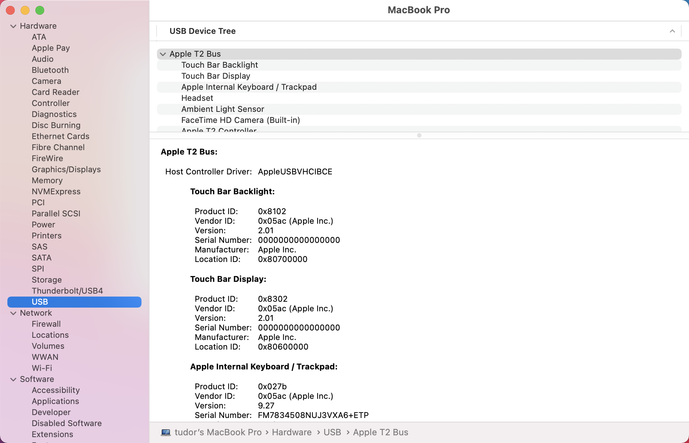

# <a name="device-control-for-macos"></a>macOS용 장치 제어

[!INCLUDE [Microsoft 365 Defender rebranding](../../includes/microsoft-defender.md)]

**적용 대상:**
- [엔드포인트용 Microsoft Defender](https://go.microsoft.com/fwlink/p/?linkid=2154037)
- [Microsoft 365 Defender](https://go.microsoft.com/fwlink/?linkid=2118804)

> 엔드포인트용 Microsoft Defender를 경험하고 싶으신가요? [무료 평가판을 신청하세요.](https://signup.microsoft.com/create-account/signup?products=7f379fee-c4f9-4278-b0a1-e4c8c2fcdf7e&ru=https://aka.ms/MDEp2OpenTrial?ocid=docs-wdatp-exposedapis-abovefoldlink)

## <a name="requirements"></a>요구 사항

macOS용 장치 제어에는 다음과 같은 전제가 있습니다.

> [!div class="checklist"]
>
> - 끝점 권리에 대한 Microsoft Defender 권리(평가판일 수 있습니다)
> - 최소 OS 버전: macOS 11 이상
> - 최소 제품 버전: 101.34.20

## <a name="device-control-policy"></a>장치 제어 정책

macOS용 장치 제어를 구성하려면 조직 내에 적용하려는 제한을 설명하는 정책을 만들어야 합니다.

장치 제어 정책은 다른 모든 제품 설정을 구성하는 데 사용되는 구성 프로필에 포함되어 있습니다. 자세한 내용은 구성 프로필 [구조 를 참조하세요.](mac-preferences.md#configuration-profile-structure)

구성 프로필 내에서 장치 제어 정책은 다음 섹션에 정의되어 있습니다.

<br>

****

|섹션|값|
|---|---|
|**도메인**|`com.microsoft.wdav`|
|**키**|deviceControl|
|**Data type**|사전(중첩된 기본 설정)|
|**Comments**|사전 콘텐츠에 대한 설명은 다음 섹션을 참조하세요.|
|

장치 제어 정책을 사용하여 다음을 할 수 있습니다.

- [장치 제어에서 발생된 알림에 대한 URL 대상 사용자 지정](#customize-url-target-for-notifications-raised-by-device-control)
- [이동식 장치 허용 또는 차단](#allow-or-block-removable-devices)

### <a name="customize-url-target-for-notifications-raised-by-device-control"></a>장치 제어에서 발생된 알림에 대한 URL 대상 사용자 지정

적용한 장치 제어 정책이 장치에 적용될 때(예: 이동식 미디어 장치에 대한 액세스가 제한되는 경우) 사용자에게 알림이 표시됩니다.


최종 사용자가 이 알림을 클릭하면 웹 페이지가 기본 브라우저에서 열립니다. 최종 사용자가 알림을 클릭할 때 열 수 있는 URL을 구성할 수 있습니다.

<br>

****

|섹션|값|
|---|---|
|**도메인**|`com.microsoft.wdav`|
|**키**|navigationTarget|
|**Data type**|문자열|
|**Comments**|정의되지 않은 경우 제품이 수행한 작업을 설명하는 일반 페이지를 표시하는 기본 URL을 사용합니다.|
|

### <a name="allow-or-block-removable-devices"></a>이동식 장치 허용 또는 차단

장치 제어 정책의 이동식 미디어 섹션은 이동식 미디어에 대한 액세스를 제한하는 데 사용됩니다.

> [!NOTE]
> 이동식 미디어 유형은 현재 지원됩니다. USB 저장 장치 정책에 포함될 수 있습니다.

<br>

****

|섹션|값|
|---|---|
|**도메인**|`com.microsoft.wdav`|
|**키**|removableMediaPolicy|
|**Data type**|사전(중첩된 기본 설정)|
|**Comments**|사전 콘텐츠에 대한 설명은 다음 섹션을 참조하세요.|
|

정책의 이 섹션은 계층적이기 때문에 유연성을 최대화하고 광범위한 사용 사례를 다루고 있습니다. 최상위 수준에는 공급업체 ID로 식별되는 공급업체가 있습니다. 각 공급업체에 대해 제품 ID로 식별되는 제품이 있습니다. 마지막으로 각 제품에 대해 특정 장치를 나타는 일련 번호가 있습니다.

```text
|-- policy top level
    |-- vendor 1
        |-- product 1
            |-- serial number 1
            ...
            |-- serial number N
        ...
        |-- product N
    ...
    |-- vendor N
```

장치 식별자를 찾는 방법에 대한 자세한 내용은 장치 식별자 [찾기를 참조하세요.](#look-up-device-identifiers)

정책은 가장 구체적인 항목에서 가장 일반적인 항목으로 평가됩니다. 즉, 장치가 연결되어 있는 경우 제품은 각 이동식 미디어 장치에 대한 정책에서 가장 구체적인 일치를 찾아 해당 수준에서 사용 권한을 적용합니다. 일치하는 항목이 없는 경우 장치가 정책의 다른 항목과 일치하지 않는 경우 기본값인 최상위 수준에서 지정된 권한까지 다음 최상의 일치가 적용됩니다.

#### <a name="policy-enforcement-level"></a>정책 적용 수준

이동식 미디어 섹션에는 적용 수준을 설정하는 옵션이 있습니다. 이 옵션은 다음 값 중 하나를 사용할 수 있습니다.

- `audit` - 이 적용 수준에서 장치에 대한 액세스가 제한되면 사용자에게 알림이 표시되지만 디바이스를 계속 사용할 수 있습니다. 이 적용 수준은 정책의 효과를 평가하는 데 유용할 수 있습니다.
- `block` - 이 적용 수준에서는 사용자가 장치에서 수행할 수 있는 작업이 정책에 정의된 작업으로 제한됩니다. 또한 사용자에게 알림이 표시됩니다.

> [!NOTE]
> 기본적으로 적용 수준은 로 `audit` 설정됩니다.

<br>

****

|섹션|값|
|---|---|
|**도메인**|`com.microsoft.wdav`|
|**키**|enforcementLevel|
|**Data type**|String|
|**사용 가능한 값:**|감사(기본값) <p> block|
|

#### <a name="default-permission-level"></a>기본 권한 수준

이동식 미디어 섹션의 최상위 수준에서 정책의 다른 부분과 일치하지 않는 장치에 대한 기본 사용 권한 수준을 구성할 수 있습니다.

이 설정은 다음으로 설정할 수 있습니다.

- `none` - 장치에서 작업을 수행할 수 없음
- 다음 값의 조합입니다.
  - `read` - 장치에서 읽기 작업이 허용됩니다.
  - `write` - 장치에서 쓰기 작업이 허용됩니다.
  - `execute` - 장치에서 실행 작업이 허용됩니다.

> [!NOTE]
> 사용 권한 수준에 있는 경우 다른 사용 `none` 권한( `read` , 또는 `write` `execute` )은 무시됩니다.
>
> 이 `execute` 사용 권한은 Mach-O 이진의 실행만 참조합니다. 스크립트 또는 다른 유형의 페이로드 실행은 포함하지 않습니다.

<br>

****

|섹션|값|
|---|---|
|**도메인**|`com.microsoft.wdav`|
|**키**|사용 권한|
|**Data type**|문자열 배열|
|**사용 가능한 값:**|없음 <p> 읽기 <p> write <p> execute|
|

#### <a name="restrict-removable-media-by-vendor-product-and-serial-number"></a>공급업체, 제품 및 일련 번호에 따라 이동식 미디어 제한

이동식 [장치](#allow-or-block-removable-devices)허용 또는 차단에 설명된 바와 같이 USB 장치와 같은 이동식 미디어는 공급업체 ID, 제품 ID 및 일련 번호로 식별할 수 있습니다.

이동식 미디어 정책의 최상위 수준에서 원하는 경우 공급업체 수준에서 보다 세부적인 제한을 정의할 수 있습니다.

사전에는 하나 이상의 항목이 포함되고 각 항목이 공급업체 `vendors` ID로 식별됩니다.

<br>

****

|섹션|값|
|---|---|
|**도메인**|`com.microsoft.wdav`|
|**키**|공급업체|
|**Data type**|사전(중첩된 기본 설정)|
|

각 공급업체에 대해 해당 공급업체의 장치에 대해 원하는 사용 권한 수준을 지정할 수 있습니다.

<br>

****

|섹션|값|
|---|---|
|**도메인**|`com.microsoft.wdav`|
|**키**|사용 권한|
|**Data type**|문자열 배열|
|**사용 가능한 값:**|기본 권한 [수준과 동일](#default-permission-level)|
|

또한 필요한 경우 해당 공급업체에 속하는 제품 집합을 보다 세부적인 사용 권한이 정의되어 있는 제품 집합을 지정할 수 있습니다. 사전에는 하나 이상의 항목이 포함되고 각 항목이 제품 `products` ID로 식별됩니다.

<br>

****

|섹션|값|
|---|---|
|**도메인**|`com.microsoft.wdav`|
|**키**|products|
|**Data type**|사전(중첩된 기본 설정)|
|

각 제품에 대해 해당 제품에 대해 원하는 사용 권한 수준을 지정할 수 있습니다.

<br>

****

|섹션|값|
|---|---|
|**도메인**|`com.microsoft.wdav`|
|**키**|사용 권한|
|**Data type**|문자열 배열|
|**사용 가능한 값:**|기본 권한 [수준과 동일](#default-permission-level)|
|

또한 보다 세부적인 사용 권한이 정의되는 선택적 일련 번호 집합을 지정할 수 있습니다.

사전에는 하나 이상의 항목이 포함되고 각 항목이 일련 번호로 `serialNumbers` 식별됩니다.

<br>

****

|섹션|값|
|---|---|
|**도메인**|`com.microsoft.wdav`|
|**키**|serialNumbers|
|**Data type**|사전(중첩된 기본 설정)|
|

각 일련 번호에 대해 원하는 사용 권한 수준을 지정할 수 있습니다.

<br>

****

|섹션|값|
|---|---|
|**도메인**|`com.microsoft.wdav`|
|**키**|사용 권한|
|**Data type**|문자열 배열|
|**사용 가능한 값:**|기본 권한 [수준과 동일](#default-permission-level)|
|

#### <a name="example-device-control-policy"></a>장치 제어 정책 예

다음 예제에서는 위의 모든 개념을 장치 제어 정책에 결합할 수 있는 방법을 보여줍니다. 다음 예제에서는 이동식 미디어 정책의 계층적 특성을 유의합니다.

```xml
<?xml version="1.0" encoding="UTF-8"?>
<!DOCTYPE plist PUBLIC "-//Apple//DTD PLIST 1.0//EN" "http://www.apple.com/DTDs/PropertyList-1.0.dtd">
<plist version="1.0">
<dict>
    <key>deviceControl</key>
    <dict>
        <key>navigationTarget</key>
        <string>[custom URL for notifications]</string>
        <key>removableMediaPolicy</key>
        <dict>
            <key>enforcementLevel</key>
            <string>[enforcement level]</string> <!-- audit / block -->
            <key>permission</key>
            <array>
                <string>[permission]</string> <!-- none / read / write / execute -->
                <!-- other permissions -->
            </array>
            <key>vendors</key>
            <dict>
                <key>[vendor id]</key>
                <dict>
                    <key>permission</key>
                    <array>
                        <string>[permission]</string> <!-- none / read / write / execute -->
                        <!-- other permissions -->
                    </array>
                    <key>products</key>
                    <dict>
                        <key>[product id]</key>
                        <dict>
                            <key>permission</key>
                            <array>
                                <string>[permission]</string> <!-- none / read / write / execute -->
                                <!-- other permissions -->
                            </array>
                            <key>serialNumbers</key>
                            <dict>
                                <key>[serial-number]</key>
                                <array>
                                    <string>[permission]</string> <!-- none / read / write / execute -->
                                    <!-- other permissions -->
                                </array>
                                <!-- other serial numbers -->
                            </dict>
                        </dict>
                        <!-- other products -->
                    </dict>
                </dict>
                <!-- other vendors -->
            </dict>
        </dict>
    </dict>
</dict>
</plist>
```

다음 문서에는 장치 제어 정책의 더 많은 예제가 포함되어 있습니다.

- [Intune에 대한 장치 제어 정책의 예](mac-device-control-intune.md)
- [JAMF에 대한 장치 제어 정책의 예](mac-device-control-jamf.md)

#### <a name="look-up-device-identifiers"></a>장치 식별자 보기

USB 장치의 공급업체 ID, 제품 ID 및 일련 번호를 찾으시다:

1. Mac 장치에 로그인합니다.
1. 식별자를 찾아보는 USB 장치를 연결합니다.
1. MacOS의 최상위 메뉴에서 이 Mac **정보를 선택합니다.**

    

1. 시스템 **보고서를 선택합니다.**

    

1. 왼쪽 열에서 USB 를 **선택합니다.**

    

1. **USB 장치 트리에서** 연결한 USB 장치로 이동합니다.

    

1. 공급업체 ID, 제품 ID 및 일련 번호가 표시됩니다. 이동식 미디어 정책에 공급업체 ID 및 제품 ID를 추가할 때 다음에 부분만 추가해야 `0x` 합니다. 예를 들어 아래 이미지에서 공급업체 ID는 입니다. `1000` 제품 ID는 입니다. `090c`

#### <a name="discover-usb-devices-in-your-organization"></a>조직에서 USB 장치 검색

끝점 고급 헌팅을 위한 Microsoft Defender의 USB 장치에서 시작된 탑재, 언모트 및 볼륨 변경 이벤트를 볼 수 있습니다. 이러한 이벤트는 의심스러운 사용 활동을 식별하거나 내부 조사를 수행하는 데 도움이 될 수 있습니다.

```bash
DeviceEvents
    | where ActionType == "UsbDriveMounted" or ActionType == "UsbDriveUnmounted" or ActionType == "UsbDriveDriveLetterChanged"
    | where DeviceId == "<device ID>"
```

## <a name="device-control-policy-deployment"></a>장치 제어 정책 배포

[MacOS의 끝점용 Microsoft Defender에](mac-preferences.md)대한 기본 설정 설정에 설명된 바와 같이 장치 제어 정책은 다른 제품 설정 옆에 포함되어야 합니다.

이 프로필은 구성 프로필 배포 에 나열된 지침을 [사용하여 배포할 수 있습니다.](mac-preferences.md#configuration-profile-deployment)

## <a name="troubleshooting-tips"></a>문제 해결 팁

Intune 또는 JAMF를 통해 구성 프로필을 푸시한 후 터미널에서 다음 명령을 실행하여 제품에서 성공적으로 선택된지 확인할 수 있습니다.

```bash
mdatp device-control removable-media policy list
```

이 명령은 제품이 사용하는 장치 제어 정책을 표준 출력으로 인쇄합니다. 이 인쇄할 경우 (a) 구성 프로필이 관리 콘솔에서 장치에 실제로 푸시되어 있는지, (b) 이 문서에 설명된 유효한 장치 제어 정책인지 `Policy is empty` 확인합니다.

정책이 성공적으로 전달되고 하나 이상의 장치가 연결되어 있는 장치에서 다음 명령을 실행하여 모든 장치 및 적용된 유효 권한을 나열할 수 있습니다.

```bash
mdatp device-control removable-media devices list
```

출력 예:

```Output
.Device(s)
|-o Name: Untitled 1, Permission ["read", "execute"]
| |-o Vendor: General "fff0"
| |-o Product: USB Flash Disk "1000"
| |-o Serial number: "04ZSSMHI2O7WBVOA"
| |-o Mount point: "/Volumes/TESTUSB"
```

위의 예에서는 장치로 전달된 장치 제어 정책에 따라 이동식 미디어 장치가 하나만 연결되어 있으며 사용 권한이 `read` `execute` 있습니다.

## <a name="related-topics"></a>관련 항목

- [Intune에 대한 장치 제어 정책의 예](mac-device-control-intune.md)
- [JAMF에 대한 장치 제어 정책의 예](mac-device-control-jamf.md)
