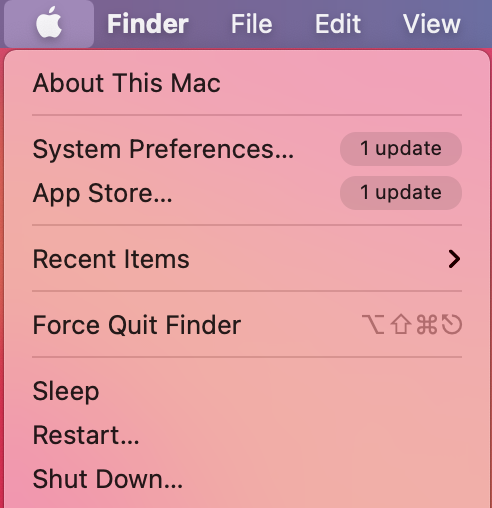

# <a name="device-control-for-macos"></a><span data-ttu-id="61eaf-104">macOS용 장치 제어</span><span class="sxs-lookup"><span data-stu-id="61eaf-104">Device control for macOS</span></span>

[!INCLUDE [Microsoft 365 Defender rebranding](../../includes/microsoft-defender.md)]

<span data-ttu-id="61eaf-105">**적용 대상:**</span><span class="sxs-lookup"><span data-stu-id="61eaf-105">**Applies to:**</span></span>
- [<span data-ttu-id="61eaf-106">엔드포인트용 Microsoft Defender</span><span class="sxs-lookup"><span data-stu-id="61eaf-106">Microsoft Defender for Endpoint</span></span>](https://go.microsoft.com/fwlink/p/?linkid=2154037)
- [<span data-ttu-id="61eaf-107">Microsoft 365 Defender</span><span class="sxs-lookup"><span data-stu-id="61eaf-107">Microsoft 365 Defender</span></span>](https://go.microsoft.com/fwlink/?linkid=2118804)

> <span data-ttu-id="61eaf-108">끝점용 Microsoft Defender를 경험하고 싶나요?</span><span class="sxs-lookup"><span data-stu-id="61eaf-108">Want to experience Microsoft Defender for Endpoint?</span></span> [<span data-ttu-id="61eaf-109">무료 평가판에 등록합니다.</span><span class="sxs-lookup"><span data-stu-id="61eaf-109">Sign up for a free trial.</span></span>](https://www.microsoft.com/microsoft-365/windows/microsoft-defender-atp?ocid=docs-wdatp-exposedapis-abovefoldlink)

## <a name="requirements"></a><span data-ttu-id="61eaf-110">요구 사항</span><span class="sxs-lookup"><span data-stu-id="61eaf-110">Requirements</span></span>

<span data-ttu-id="61eaf-111">macOS용 장치 제어에는 다음과 같은 전제가 있습니다.</span><span class="sxs-lookup"><span data-stu-id="61eaf-111">Device control for macOS has the following prerequisites:</span></span>

>[!div class="checklist"]
> - <span data-ttu-id="61eaf-112">끝점 권리에 대한 Microsoft Defender 권리(평가판일 수 있습니다)</span><span class="sxs-lookup"><span data-stu-id="61eaf-112">Microsoft Defender for Endpoint entitlement (can be trial)</span></span>
> - <span data-ttu-id="61eaf-113">최소 OS 버전: macOS 11 이상</span><span class="sxs-lookup"><span data-stu-id="61eaf-113">Minimum OS version: macOS 11 or higher</span></span>
> - <span data-ttu-id="61eaf-114">최소 제품 버전: 101.34.20</span><span class="sxs-lookup"><span data-stu-id="61eaf-114">Minimum product version: 101.34.20</span></span>

## <a name="device-control-policy"></a><span data-ttu-id="61eaf-115">장치 제어 정책</span><span class="sxs-lookup"><span data-stu-id="61eaf-115">Device control policy</span></span>

<span data-ttu-id="61eaf-116">macOS용 장치 제어를 구성하려면 조직 내에 적용하려는 제한을 설명하는 정책을 만들어야 합니다.</span><span class="sxs-lookup"><span data-stu-id="61eaf-116">To configure device control for macOS, you must create a policy that describes the restrictions you want to put in place within your organization.</span></span>

<span data-ttu-id="61eaf-117">장치 제어 정책은 다른 모든 제품 설정을 구성하는 데 사용되는 구성 프로필에 포함되어 있습니다.</span><span class="sxs-lookup"><span data-stu-id="61eaf-117">The device control policy is included in the configuration profile used to configure all other product settings.</span></span> <span data-ttu-id="61eaf-118">자세한 내용은 구성 프로필 [구조 를 참조하세요.](mac-preferences.md#configuration-profile-structure)</span><span class="sxs-lookup"><span data-stu-id="61eaf-118">For more information, see [Configuration profile structure](mac-preferences.md#configuration-profile-structure).</span></span>

<span data-ttu-id="61eaf-119">구성 프로필 내에서 장치 제어 정책은 다음 섹션에 정의되어 있습니다.</span><span class="sxs-lookup"><span data-stu-id="61eaf-119">Within the configuration profile, the device control policy is defined in the following section:</span></span>

|<span data-ttu-id="61eaf-120">섹션</span><span class="sxs-lookup"><span data-stu-id="61eaf-120">Section</span></span>|<span data-ttu-id="61eaf-121">값</span><span class="sxs-lookup"><span data-stu-id="61eaf-121">Value</span></span>|
|:---|:---|
| <span data-ttu-id="61eaf-122">**도메인**</span><span class="sxs-lookup"><span data-stu-id="61eaf-122">**Domain**</span></span> | `com.microsoft.wdav` |
| <span data-ttu-id="61eaf-123">**키**</span><span class="sxs-lookup"><span data-stu-id="61eaf-123">**Key**</span></span> | <span data-ttu-id="61eaf-124">deviceControl</span><span class="sxs-lookup"><span data-stu-id="61eaf-124">deviceControl</span></span> |
| <span data-ttu-id="61eaf-125">**Data type**</span><span class="sxs-lookup"><span data-stu-id="61eaf-125">**Data type**</span></span> | <span data-ttu-id="61eaf-126">사전(중첩된 기본 설정)</span><span class="sxs-lookup"><span data-stu-id="61eaf-126">Dictionary (nested preference)</span></span> |
| <span data-ttu-id="61eaf-127">**Comments**</span><span class="sxs-lookup"><span data-stu-id="61eaf-127">**Comments**</span></span> | <span data-ttu-id="61eaf-128">사전 콘텐츠에 대한 설명은 다음 섹션을 참조하세요.</span><span class="sxs-lookup"><span data-stu-id="61eaf-128">See the following sections for a description of the dictionary contents.</span></span> |

<span data-ttu-id="61eaf-129">장치 제어 정책을 사용하여 다음을 할 수 있습니다.</span><span class="sxs-lookup"><span data-stu-id="61eaf-129">The device control policy can be used to:</span></span>

- [<span data-ttu-id="61eaf-130">장치 제어에서 발생된 알림에 대한 URL 대상 사용자 지정</span><span class="sxs-lookup"><span data-stu-id="61eaf-130">Customize the URL target for notifications raised by device control</span></span>](#customize-url-target-for-notifications-raised-by-device-control)
- [<span data-ttu-id="61eaf-131">이동식 장치 허용 또는 차단</span><span class="sxs-lookup"><span data-stu-id="61eaf-131">Allow or block removable devices</span></span>](#allow-or-block-removable-devices)

### <a name="customize-url-target-for-notifications-raised-by-device-control"></a><span data-ttu-id="61eaf-132">장치 제어에서 발생된 알림에 대한 URL 대상 사용자 지정</span><span class="sxs-lookup"><span data-stu-id="61eaf-132">Customize URL target for notifications raised by device control</span></span>

<span data-ttu-id="61eaf-133">적용한 장치 제어 정책이 장치에 적용될 때(예: 이동식 미디어 장치에 대한 액세스가 제한되는 경우) 사용자에게 알림이 표시됩니다.</span><span class="sxs-lookup"><span data-stu-id="61eaf-133">When the device control policy that you have put in place is enforced on a device (for example, access to a removable media device is restricted), a notification is displayed to the user.</span></span>


<span data-ttu-id="61eaf-135">최종 사용자가 이 알림을 클릭하면 웹 페이지가 기본 브라우저에서 열립니다.</span><span class="sxs-lookup"><span data-stu-id="61eaf-135">When end users click this notification, a web page is opened in the default browser.</span></span> <span data-ttu-id="61eaf-136">최종 사용자가 알림을 클릭할 때 열 수 있는 URL을 구성할 수 있습니다.</span><span class="sxs-lookup"><span data-stu-id="61eaf-136">You can configure the URL that is opened when end users click the notification.</span></span>

|<span data-ttu-id="61eaf-137">섹션</span><span class="sxs-lookup"><span data-stu-id="61eaf-137">Section</span></span>|<span data-ttu-id="61eaf-138">값</span><span class="sxs-lookup"><span data-stu-id="61eaf-138">Value</span></span>|
|:---|:---|
| <span data-ttu-id="61eaf-139">**도메인**</span><span class="sxs-lookup"><span data-stu-id="61eaf-139">**Domain**</span></span> | `com.microsoft.wdav` |
| <span data-ttu-id="61eaf-140">**키**</span><span class="sxs-lookup"><span data-stu-id="61eaf-140">**Key**</span></span> | <span data-ttu-id="61eaf-141">navigationTarget</span><span class="sxs-lookup"><span data-stu-id="61eaf-141">navigationTarget</span></span> |
| <span data-ttu-id="61eaf-142">**Data type**</span><span class="sxs-lookup"><span data-stu-id="61eaf-142">**Data type**</span></span> | <span data-ttu-id="61eaf-143">문자열</span><span class="sxs-lookup"><span data-stu-id="61eaf-143">String</span></span> |
| <span data-ttu-id="61eaf-144">**Comments**</span><span class="sxs-lookup"><span data-stu-id="61eaf-144">**Comments**</span></span> | <span data-ttu-id="61eaf-145">정의되지 않은 경우 제품이 수행한 작업을 설명하는 일반 페이지를 표시하는 기본 URL을 사용합니다.</span><span class="sxs-lookup"><span data-stu-id="61eaf-145">If not defined, the product uses a default URL pointing to a generic page explaining the action taken by the product.</span></span> |

### <a name="allow-or-block-removable-devices"></a><span data-ttu-id="61eaf-146">이동식 장치 허용 또는 차단</span><span class="sxs-lookup"><span data-stu-id="61eaf-146">Allow or block removable devices</span></span>

<span data-ttu-id="61eaf-147">장치 제어 정책의 이동식 미디어 섹션은 이동식 미디어에 대한 액세스를 제한하는 데 사용됩니다.</span><span class="sxs-lookup"><span data-stu-id="61eaf-147">The removable media section of the device control policy is used to restrict access to removable media.</span></span> 

> [!NOTE]
> <span data-ttu-id="61eaf-148">이동식 미디어 유형은 현재 지원됩니다. USB 저장 장치 정책에 포함될 수 있습니다.</span><span class="sxs-lookup"><span data-stu-id="61eaf-148">The following types of removable media are currently supported and can be included in the policy: USB storage devices.</span></span>

|<span data-ttu-id="61eaf-149">섹션</span><span class="sxs-lookup"><span data-stu-id="61eaf-149">Section</span></span>|<span data-ttu-id="61eaf-150">값</span><span class="sxs-lookup"><span data-stu-id="61eaf-150">Value</span></span>|
|:---|:---|
| <span data-ttu-id="61eaf-151">**도메인**</span><span class="sxs-lookup"><span data-stu-id="61eaf-151">**Domain**</span></span> | `com.microsoft.wdav` |
| <span data-ttu-id="61eaf-152">**키**</span><span class="sxs-lookup"><span data-stu-id="61eaf-152">**Key**</span></span> | <span data-ttu-id="61eaf-153">removableMediaPolicy</span><span class="sxs-lookup"><span data-stu-id="61eaf-153">removableMediaPolicy</span></span> |
| <span data-ttu-id="61eaf-154">**Data type**</span><span class="sxs-lookup"><span data-stu-id="61eaf-154">**Data type**</span></span> | <span data-ttu-id="61eaf-155">사전(중첩된 기본 설정)</span><span class="sxs-lookup"><span data-stu-id="61eaf-155">Dictionary (nested preference)</span></span> |
| <span data-ttu-id="61eaf-156">**Comments**</span><span class="sxs-lookup"><span data-stu-id="61eaf-156">**Comments**</span></span> | <span data-ttu-id="61eaf-157">사전 콘텐츠에 대한 설명은 다음 섹션을 참조하세요.</span><span class="sxs-lookup"><span data-stu-id="61eaf-157">See the following sections for a description of the dictionary contents.</span></span> |

<span data-ttu-id="61eaf-158">정책의 이 섹션은 계층적이기 때문에 유연성을 최대화하고 광범위한 사용 사례를 다루고 있습니다.</span><span class="sxs-lookup"><span data-stu-id="61eaf-158">This section of the policy is hierarchical, allowing for maximum flexibility and covering a wide range of use cases.</span></span> <span data-ttu-id="61eaf-159">최상위 수준에는 공급업체 ID로 식별되는 공급업체가 있습니다.</span><span class="sxs-lookup"><span data-stu-id="61eaf-159">At the top level are vendors, identified by a vendor ID.</span></span> <span data-ttu-id="61eaf-160">각 공급업체에 대해 제품 ID로 식별되는 제품이 있습니다.</span><span class="sxs-lookup"><span data-stu-id="61eaf-160">For each vendor, there are products, identified by a product ID.</span></span> <span data-ttu-id="61eaf-161">마지막으로 각 제품에 대해 특정 장치를 나타는 일련 번호가 있습니다.</span><span class="sxs-lookup"><span data-stu-id="61eaf-161">Finally, for each product there are serial numbers denoting specific devices.</span></span>

```
|-- policy top level 
    |-- vendor 1 
        |-- product 1 
            |-- serial number 1 
            ...
            |-- serial number N 
        ...
        |-- product N 
    ...
    |-- vendor N
```

<span data-ttu-id="61eaf-162">장치 식별자를 찾는 방법에 대한 자세한 내용은 장치 식별자 [찾기를 참조하세요.](#look-up-device-identifiers)</span><span class="sxs-lookup"><span data-stu-id="61eaf-162">For information on how to find the device identifiers, see [Look up device identifiers](#look-up-device-identifiers).</span></span>

<span data-ttu-id="61eaf-163">정책은 가장 구체적인 항목에서 가장 일반적인 항목으로 평가됩니다.</span><span class="sxs-lookup"><span data-stu-id="61eaf-163">The policy is evaluated from the most specific entry to the most general one.</span></span> <span data-ttu-id="61eaf-164">즉, 장치가 연결되어 있는 경우 제품은 각 이동식 미디어 장치에 대한 정책에서 가장 구체적인 일치를 찾아 해당 수준에서 사용 권한을 적용합니다.</span><span class="sxs-lookup"><span data-stu-id="61eaf-164">Meaning, when a device is plugged in, the product tries to find the most specific match in the policy for each removable media device and apply the permissions at that level.</span></span> <span data-ttu-id="61eaf-165">일치하는 항목이 없는 경우 장치가 정책의 다른 항목과 일치하지 않는 경우 기본값인 최상위 수준에서 지정된 권한까지 다음 최상의 일치가 적용됩니다.</span><span class="sxs-lookup"><span data-stu-id="61eaf-165">If there is no match, then the next best match is applied, all the way to the permission specified at the top level, which is the default when a device does not match any other entry in the policy.</span></span>

#### <a name="policy-enforcement-level"></a><span data-ttu-id="61eaf-166">정책 적용 수준</span><span class="sxs-lookup"><span data-stu-id="61eaf-166">Policy enforcement level</span></span>

<span data-ttu-id="61eaf-167">이동식 미디어 섹션에는 적용 수준을 설정하는 옵션이 있습니다. 이 옵션은 다음 값 중 하나를 사용할 수 있습니다.</span><span class="sxs-lookup"><span data-stu-id="61eaf-167">Under the removable media section, there is an option to set the enforcement level, which can take one of the following values:</span></span>

- <span data-ttu-id="61eaf-168">`audit` - 이 적용 수준에서 장치에 대한 액세스가 제한되면 사용자에게 알림이 표시되지만 디바이스를 계속 사용할 수 있습니다.</span><span class="sxs-lookup"><span data-stu-id="61eaf-168">`audit` - Under this enforcement level, if access to a device is restricted, a notification is displayed to the user, however the device can still be used.</span></span> <span data-ttu-id="61eaf-169">이 적용 수준은 정책의 효과를 평가하는 데 유용할 수 있습니다.</span><span class="sxs-lookup"><span data-stu-id="61eaf-169">This enforcement level can be useful to evaluate the effectiveness of a policy.</span></span>
- <span data-ttu-id="61eaf-170">`block` - 이 적용 수준에서는 사용자가 장치에서 수행할 수 있는 작업이 정책에 정의된 작업으로 제한됩니다.</span><span class="sxs-lookup"><span data-stu-id="61eaf-170">`block` - Under this enforcement level, the operations that the user can perform on the device are limited to what is defined in the policy.</span></span> <span data-ttu-id="61eaf-171">또한 사용자에게 알림이 표시됩니다.</span><span class="sxs-lookup"><span data-stu-id="61eaf-171">Furthermore, a notification is raised to the user.</span></span> 

> [!NOTE] 
> <span data-ttu-id="61eaf-172">기본적으로 적용 수준은 로 `audit` 설정됩니다.</span><span class="sxs-lookup"><span data-stu-id="61eaf-172">By default, the enforcement level is set to `audit`.</span></span> 

|<span data-ttu-id="61eaf-173">섹션</span><span class="sxs-lookup"><span data-stu-id="61eaf-173">Section</span></span>|<span data-ttu-id="61eaf-174">값</span><span class="sxs-lookup"><span data-stu-id="61eaf-174">Value</span></span>|
|:---|:---|
| <span data-ttu-id="61eaf-175">**도메인**</span><span class="sxs-lookup"><span data-stu-id="61eaf-175">**Domain**</span></span> | `com.microsoft.wdav` |
| <span data-ttu-id="61eaf-176">**키**</span><span class="sxs-lookup"><span data-stu-id="61eaf-176">**Key**</span></span> | <span data-ttu-id="61eaf-177">enforcementLevel</span><span class="sxs-lookup"><span data-stu-id="61eaf-177">enforcementLevel</span></span> |
| <span data-ttu-id="61eaf-178">**Data type**</span><span class="sxs-lookup"><span data-stu-id="61eaf-178">**Data type**</span></span> | <span data-ttu-id="61eaf-179">String</span><span class="sxs-lookup"><span data-stu-id="61eaf-179">String</span></span> |
| <span data-ttu-id="61eaf-180">**사용 가능한 값:**</span><span class="sxs-lookup"><span data-stu-id="61eaf-180">**Possible values**</span></span> | <span data-ttu-id="61eaf-181">감사(기본값)</span><span class="sxs-lookup"><span data-stu-id="61eaf-181">audit (default)</span></span> <br/> <span data-ttu-id="61eaf-182">block</span><span class="sxs-lookup"><span data-stu-id="61eaf-182">block</span></span> |

#### <a name="default-permission-level"></a><span data-ttu-id="61eaf-183">기본 권한 수준</span><span class="sxs-lookup"><span data-stu-id="61eaf-183">Default permission level</span></span>

<span data-ttu-id="61eaf-184">이동식 미디어 섹션의 최상위 수준에서 정책의 다른 부분과 일치하지 않는 장치에 대한 기본 사용 권한 수준을 구성할 수 있습니다.</span><span class="sxs-lookup"><span data-stu-id="61eaf-184">At the top level of the removable media section, you can configure the default permission level for devices that do not match anything else in the policy.</span></span>

<span data-ttu-id="61eaf-185">이 설정은 다음으로 설정할 수 있습니다.</span><span class="sxs-lookup"><span data-stu-id="61eaf-185">This setting can be set to:</span></span>

- <span data-ttu-id="61eaf-186">`none` - 장치에서 작업을 수행할 수 없음</span><span class="sxs-lookup"><span data-stu-id="61eaf-186">`none` - No operations can be performed on the device</span></span>
- <span data-ttu-id="61eaf-187">다음 값의 조합입니다.</span><span class="sxs-lookup"><span data-stu-id="61eaf-187">A combination of the following values:</span></span>
    - <span data-ttu-id="61eaf-188">`read` - 장치에서 읽기 작업이 허용됩니다.</span><span class="sxs-lookup"><span data-stu-id="61eaf-188">`read` - Read operations are permitted on the device</span></span>
    - <span data-ttu-id="61eaf-189">`write` - 장치에서 쓰기 작업이 허용됩니다.</span><span class="sxs-lookup"><span data-stu-id="61eaf-189">`write` - Write operations are permitted on the device</span></span>
    - <span data-ttu-id="61eaf-190">`execute` - 장치에서 실행 작업이 허용됩니다.</span><span class="sxs-lookup"><span data-stu-id="61eaf-190">`execute` - Execute operations are permitted on the device</span></span>

> [!NOTE]
> <span data-ttu-id="61eaf-191">사용 권한 수준에 있는 경우 다른 사용 `none` 권한( `read` , 또는 `write` `execute` )은 무시됩니다.</span><span class="sxs-lookup"><span data-stu-id="61eaf-191">If `none` is present in the permission level, any other permissions (`read`, `write`, or `execute`) will be ignored.</span></span>

> [!NOTE]
> <span data-ttu-id="61eaf-192">이 `execute` 사용 권한은 Mach-O 이진의 실행만 참조합니다.</span><span class="sxs-lookup"><span data-stu-id="61eaf-192">The `execute` permission only refers to execution of Mach-O binaries.</span></span> <span data-ttu-id="61eaf-193">스크립트 또는 다른 유형의 페이로드 실행은 포함하지 않습니다.</span><span class="sxs-lookup"><span data-stu-id="61eaf-193">It does not include execution of scripts or other types of payloads.</span></span>

|<span data-ttu-id="61eaf-194">섹션</span><span class="sxs-lookup"><span data-stu-id="61eaf-194">Section</span></span>|<span data-ttu-id="61eaf-195">값</span><span class="sxs-lookup"><span data-stu-id="61eaf-195">Value</span></span>|
|:---|:---|
| <span data-ttu-id="61eaf-196">**도메인**</span><span class="sxs-lookup"><span data-stu-id="61eaf-196">**Domain**</span></span> | `com.microsoft.wdav` |
| <span data-ttu-id="61eaf-197">**키**</span><span class="sxs-lookup"><span data-stu-id="61eaf-197">**Key**</span></span> | <span data-ttu-id="61eaf-198">사용 권한</span><span class="sxs-lookup"><span data-stu-id="61eaf-198">permission</span></span> |
| <span data-ttu-id="61eaf-199">**Data type**</span><span class="sxs-lookup"><span data-stu-id="61eaf-199">**Data type**</span></span> | <span data-ttu-id="61eaf-200">문자열 배열</span><span class="sxs-lookup"><span data-stu-id="61eaf-200">Array of strings</span></span> |
| <span data-ttu-id="61eaf-201">**사용 가능한 값:**</span><span class="sxs-lookup"><span data-stu-id="61eaf-201">**Possible values**</span></span> | <span data-ttu-id="61eaf-202">없음</span><span class="sxs-lookup"><span data-stu-id="61eaf-202">none</span></span> <br/> <span data-ttu-id="61eaf-203">읽기</span><span class="sxs-lookup"><span data-stu-id="61eaf-203">read</span></span> <br/> <span data-ttu-id="61eaf-204">write</span><span class="sxs-lookup"><span data-stu-id="61eaf-204">write</span></span> <br/> <span data-ttu-id="61eaf-205">execute</span><span class="sxs-lookup"><span data-stu-id="61eaf-205">execute</span></span> |

#### <a name="restrict-removable-media-by-vendor-product-and-serial-number"></a><span data-ttu-id="61eaf-206">공급업체, 제품 및 일련 번호에 따라 이동식 미디어 제한</span><span class="sxs-lookup"><span data-stu-id="61eaf-206">Restrict removable media by vendor, product, and serial number</span></span>

<span data-ttu-id="61eaf-207">이동식 [장치](#allow-or-block-removable-devices)허용 또는 차단에 설명된 바와 같이 USB 장치와 같은 이동식 미디어는 공급업체 ID, 제품 ID 및 일련 번호로 식별할 수 있습니다.</span><span class="sxs-lookup"><span data-stu-id="61eaf-207">As described in [Allow or block removable devices](#allow-or-block-removable-devices), removable media such as USB devices can be identified by the vendor ID, product ID, and serial number.</span></span>

<span data-ttu-id="61eaf-208">이동식 미디어 정책의 최상위 수준에서 원하는 경우 공급업체 수준에서 보다 세부적인 제한을 정의할 수 있습니다.</span><span class="sxs-lookup"><span data-stu-id="61eaf-208">At the top level of the removable media policy, you can optionally define more granular restrictions at the vendor level.</span></span> 

<span data-ttu-id="61eaf-209">사전에는 하나 이상의 항목이 포함되고 각 항목이 공급업체 `vendors` ID로 식별됩니다.</span><span class="sxs-lookup"><span data-stu-id="61eaf-209">The `vendors` dictionary contains one or more entries, with each entry being identified by the vendor ID.</span></span>

|<span data-ttu-id="61eaf-210">섹션</span><span class="sxs-lookup"><span data-stu-id="61eaf-210">Section</span></span>|<span data-ttu-id="61eaf-211">값</span><span class="sxs-lookup"><span data-stu-id="61eaf-211">Value</span></span>|
|:---|:---|
| <span data-ttu-id="61eaf-212">**도메인**</span><span class="sxs-lookup"><span data-stu-id="61eaf-212">**Domain**</span></span> | `com.microsoft.wdav` |
| <span data-ttu-id="61eaf-213">**키**</span><span class="sxs-lookup"><span data-stu-id="61eaf-213">**Key**</span></span> | <span data-ttu-id="61eaf-214">공급업체</span><span class="sxs-lookup"><span data-stu-id="61eaf-214">vendors</span></span> |
| <span data-ttu-id="61eaf-215">**Data type**</span><span class="sxs-lookup"><span data-stu-id="61eaf-215">**Data type**</span></span> | <span data-ttu-id="61eaf-216">사전(중첩된 기본 설정)</span><span class="sxs-lookup"><span data-stu-id="61eaf-216">Dictionary (nested preference)</span></span> |

<span data-ttu-id="61eaf-217">각 공급업체에 대해 해당 공급업체의 장치에 대해 원하는 사용 권한 수준을 지정할 수 있습니다.</span><span class="sxs-lookup"><span data-stu-id="61eaf-217">For each vendor, you can specify the desired permission level for devices from that vendor.</span></span>

|<span data-ttu-id="61eaf-218">섹션</span><span class="sxs-lookup"><span data-stu-id="61eaf-218">Section</span></span>|<span data-ttu-id="61eaf-219">값</span><span class="sxs-lookup"><span data-stu-id="61eaf-219">Value</span></span>|
|:---|:---|
| <span data-ttu-id="61eaf-220">**도메인**</span><span class="sxs-lookup"><span data-stu-id="61eaf-220">**Domain**</span></span> | `com.microsoft.wdav` |
| <span data-ttu-id="61eaf-221">**키**</span><span class="sxs-lookup"><span data-stu-id="61eaf-221">**Key**</span></span> | <span data-ttu-id="61eaf-222">사용 권한</span><span class="sxs-lookup"><span data-stu-id="61eaf-222">permission</span></span> |
| <span data-ttu-id="61eaf-223">**Data type**</span><span class="sxs-lookup"><span data-stu-id="61eaf-223">**Data type**</span></span> | <span data-ttu-id="61eaf-224">문자열 배열</span><span class="sxs-lookup"><span data-stu-id="61eaf-224">Array of strings</span></span> |
| <span data-ttu-id="61eaf-225">**사용 가능한 값:**</span><span class="sxs-lookup"><span data-stu-id="61eaf-225">**Possible values**</span></span> | <span data-ttu-id="61eaf-226">기본 권한 [수준과 동일](#default-permission-level)</span><span class="sxs-lookup"><span data-stu-id="61eaf-226">Same as [Default permission level](#default-permission-level)</span></span> |

<span data-ttu-id="61eaf-227">또한 필요한 경우 해당 공급업체에 속하는 제품 집합을 보다 세부적인 사용 권한이 정의되어 있는 제품 집합을 지정할 수 있습니다.</span><span class="sxs-lookup"><span data-stu-id="61eaf-227">Furthermore, you can optionally specify the set of products belonging to that vendor for which more granular permissions are defined.</span></span> <span data-ttu-id="61eaf-228">사전에는 하나 이상의 항목이 포함되고 각 항목이 제품 `products` ID로 식별됩니다.</span><span class="sxs-lookup"><span data-stu-id="61eaf-228">The `products` dictionary contains one or more entries, with each entry being identified by the product ID.</span></span> 

|<span data-ttu-id="61eaf-229">섹션</span><span class="sxs-lookup"><span data-stu-id="61eaf-229">Section</span></span>|<span data-ttu-id="61eaf-230">값</span><span class="sxs-lookup"><span data-stu-id="61eaf-230">Value</span></span>|
|:---|:---|
| <span data-ttu-id="61eaf-231">**도메인**</span><span class="sxs-lookup"><span data-stu-id="61eaf-231">**Domain**</span></span> | `com.microsoft.wdav` |
| <span data-ttu-id="61eaf-232">**키**</span><span class="sxs-lookup"><span data-stu-id="61eaf-232">**Key**</span></span> | <span data-ttu-id="61eaf-233">products</span><span class="sxs-lookup"><span data-stu-id="61eaf-233">products</span></span> |
| <span data-ttu-id="61eaf-234">**Data type**</span><span class="sxs-lookup"><span data-stu-id="61eaf-234">**Data type**</span></span> | <span data-ttu-id="61eaf-235">사전(중첩된 기본 설정)</span><span class="sxs-lookup"><span data-stu-id="61eaf-235">Dictionary (nested preference)</span></span> |

<span data-ttu-id="61eaf-236">각 제품에 대해 해당 제품에 대해 원하는 사용 권한 수준을 지정할 수 있습니다.</span><span class="sxs-lookup"><span data-stu-id="61eaf-236">For each product, you can specify the desired permission level for that product.</span></span>

|<span data-ttu-id="61eaf-237">섹션</span><span class="sxs-lookup"><span data-stu-id="61eaf-237">Section</span></span>|<span data-ttu-id="61eaf-238">값</span><span class="sxs-lookup"><span data-stu-id="61eaf-238">Value</span></span>|
|:---|:---|
| <span data-ttu-id="61eaf-239">**도메인**</span><span class="sxs-lookup"><span data-stu-id="61eaf-239">**Domain**</span></span> | `com.microsoft.wdav` |
| <span data-ttu-id="61eaf-240">**키**</span><span class="sxs-lookup"><span data-stu-id="61eaf-240">**Key**</span></span> | <span data-ttu-id="61eaf-241">사용 권한</span><span class="sxs-lookup"><span data-stu-id="61eaf-241">permission</span></span> |
| <span data-ttu-id="61eaf-242">**Data type**</span><span class="sxs-lookup"><span data-stu-id="61eaf-242">**Data type**</span></span> | <span data-ttu-id="61eaf-243">문자열 배열</span><span class="sxs-lookup"><span data-stu-id="61eaf-243">Array of strings</span></span> |
| <span data-ttu-id="61eaf-244">**사용 가능한 값:**</span><span class="sxs-lookup"><span data-stu-id="61eaf-244">**Possible values**</span></span> | <span data-ttu-id="61eaf-245">기본 권한 [수준과 동일](#default-permission-level)</span><span class="sxs-lookup"><span data-stu-id="61eaf-245">Same as [Default permission level](#default-permission-level)</span></span> |

<span data-ttu-id="61eaf-246">또한 보다 세부적인 사용 권한이 정의되는 선택적 일련 번호 집합을 지정할 수 있습니다.</span><span class="sxs-lookup"><span data-stu-id="61eaf-246">Furthermore, you can specify an optional set of serial numbers for which more granular permissions are defined.</span></span>

<span data-ttu-id="61eaf-247">사전에는 하나 이상의 항목이 포함되고 각 항목이 일련 번호로 `serialNumbers` 식별됩니다.</span><span class="sxs-lookup"><span data-stu-id="61eaf-247">The `serialNumbers` dictionary contains one or more entries, with each entry being identified by the serial number.</span></span>

|<span data-ttu-id="61eaf-248">섹션</span><span class="sxs-lookup"><span data-stu-id="61eaf-248">Section</span></span>|<span data-ttu-id="61eaf-249">값</span><span class="sxs-lookup"><span data-stu-id="61eaf-249">Value</span></span>|
|:---|:---|
| <span data-ttu-id="61eaf-250">**도메인**</span><span class="sxs-lookup"><span data-stu-id="61eaf-250">**Domain**</span></span> | `com.microsoft.wdav` |
| <span data-ttu-id="61eaf-251">**키**</span><span class="sxs-lookup"><span data-stu-id="61eaf-251">**Key**</span></span> | <span data-ttu-id="61eaf-252">serialNumbers</span><span class="sxs-lookup"><span data-stu-id="61eaf-252">serialNumbers</span></span> |
| <span data-ttu-id="61eaf-253">**Data type**</span><span class="sxs-lookup"><span data-stu-id="61eaf-253">**Data type**</span></span> | <span data-ttu-id="61eaf-254">사전(중첩된 기본 설정)</span><span class="sxs-lookup"><span data-stu-id="61eaf-254">Dictionary (nested preference)</span></span> |

<span data-ttu-id="61eaf-255">각 일련 번호에 대해 원하는 사용 권한 수준을 지정할 수 있습니다.</span><span class="sxs-lookup"><span data-stu-id="61eaf-255">For each serial number, you can specify the desired permission level.</span></span>

|<span data-ttu-id="61eaf-256">섹션</span><span class="sxs-lookup"><span data-stu-id="61eaf-256">Section</span></span>|<span data-ttu-id="61eaf-257">값</span><span class="sxs-lookup"><span data-stu-id="61eaf-257">Value</span></span>|
|:---|:---|
| <span data-ttu-id="61eaf-258">**도메인**</span><span class="sxs-lookup"><span data-stu-id="61eaf-258">**Domain**</span></span> | `com.microsoft.wdav` |
| <span data-ttu-id="61eaf-259">**키**</span><span class="sxs-lookup"><span data-stu-id="61eaf-259">**Key**</span></span> | <span data-ttu-id="61eaf-260">사용 권한</span><span class="sxs-lookup"><span data-stu-id="61eaf-260">permission</span></span> |
| <span data-ttu-id="61eaf-261">**Data type**</span><span class="sxs-lookup"><span data-stu-id="61eaf-261">**Data type**</span></span> | <span data-ttu-id="61eaf-262">문자열 배열</span><span class="sxs-lookup"><span data-stu-id="61eaf-262">Array of strings</span></span> |
| <span data-ttu-id="61eaf-263">**사용 가능한 값:**</span><span class="sxs-lookup"><span data-stu-id="61eaf-263">**Possible values**</span></span> | <span data-ttu-id="61eaf-264">기본 권한 [수준과 동일](#default-permission-level)</span><span class="sxs-lookup"><span data-stu-id="61eaf-264">Same as [Default permission level](#default-permission-level)</span></span> |

#### <a name="example-device-control-policy"></a><span data-ttu-id="61eaf-265">장치 제어 정책 예</span><span class="sxs-lookup"><span data-stu-id="61eaf-265">Example device control policy</span></span>

<span data-ttu-id="61eaf-266">다음 예제에서는 위의 모든 개념을 장치 제어 정책에 결합할 수 있는 방법을 보여줍니다.</span><span class="sxs-lookup"><span data-stu-id="61eaf-266">The following example shows how all of the above concepts can be combined into a device control policy.</span></span> <span data-ttu-id="61eaf-267">다음 예제에서는 이동식 미디어 정책의 계층적 특성을 유의합니다.</span><span class="sxs-lookup"><span data-stu-id="61eaf-267">In the following example, note the hierarchical nature of the removable media policy.</span></span>

```xml
<?xml version="1.0" encoding="UTF-8"?> 
<!DOCTYPE plist PUBLIC "-//Apple//DTD PLIST 1.0//EN" "http://www.apple.com/DTDs/PropertyList-1.0.dtd"> 
<plist version="1.0"> 
<dict> 
    <key>deviceControl</key> 
    <dict> 
        <key>navigationTarget</key> 
        <string>[custom URL for notifications]</string> 
        <key>removableMediaPolicy</key> 
        <dict> 
            <key>enforcementLevel</key> 
            <string>[enforcement level]</string> <!-- audit / block --> 
            <key>permission</key> 
            <array> 
                <string>[permission]</string> <!-- none / read / write / execute --> 
                <!-- other permissions -->
            </array> 
            <key>vendors</key> 
            <dict> 
                <key>[vendor id]</key> 
                <dict>
                    <key>permission</key> 
                    <array> 
                        <string>[permission]</string> <!-- none / read / write / execute --> 
                        <!-- other permissions -->
                    </array> 
                    <key>products</key> 
                    <dict> 
                        <key>[product id]</key> 
                        <dict> 
                            <key>permission</key> 
                            <array> 
                                <string>[permission]</string> <!-- none / read / write / execute --> 
                                <!-- other permissions -->
                            </array> 
                            <key>serialNumbers</key> 
                            <dict> 
                                <key>[serial-number]</key> 
                                <array> 
                                    <string>[permission]</string> <!-- none / read / write / execute --> 
                                    <!-- other permissions -->
                                </array> 
                                <!-- other serial numbers --> 
                            </dict> 
                        </dict> 
                        <!-- other products --> 
                    </dict> 
                </dict> 
                <!-- other vendors --> 
            </dict> 
        </dict> 
    </dict> 
</dict> 
</plist> 
```

<span data-ttu-id="61eaf-268">다음 문서에는 장치 제어 정책의 더 많은 예제가 포함되어 있습니다.</span><span class="sxs-lookup"><span data-stu-id="61eaf-268">We have included more examples of device control policies in the following documents:</span></span>

- [<span data-ttu-id="61eaf-269">Intune에 대한 장치 제어 정책의 예</span><span class="sxs-lookup"><span data-stu-id="61eaf-269">Examples of device control policies for Intune</span></span>](mac-device-control-intune.md)
- [<span data-ttu-id="61eaf-270">JAMF에 대한 장치 제어 정책의 예</span><span class="sxs-lookup"><span data-stu-id="61eaf-270">Examples of device control policies for JAMF</span></span>](mac-device-control-jamf.md)

#### <a name="look-up-device-identifiers"></a><span data-ttu-id="61eaf-271">장치 식별자 보기</span><span class="sxs-lookup"><span data-stu-id="61eaf-271">Look up device identifiers</span></span>

<span data-ttu-id="61eaf-272">USB 장치의 공급업체 ID, 제품 ID 및 일련 번호를 찾으시다:</span><span class="sxs-lookup"><span data-stu-id="61eaf-272">To find the vendor ID, product ID, and serial number of a USB device:</span></span>

1. <span data-ttu-id="61eaf-273">Mac 장치에 로그인합니다.</span><span class="sxs-lookup"><span data-stu-id="61eaf-273">Log into a Mac device.</span></span>
1. <span data-ttu-id="61eaf-274">식별자를 찾아보는 USB 장치를 연결합니다.</span><span class="sxs-lookup"><span data-stu-id="61eaf-274">Plug in the USB device for which you want to look up the identifiers.</span></span>
1. <span data-ttu-id="61eaf-275">MacOS의 최상위 메뉴에서 이 Mac **정보를 선택합니다.**</span><span class="sxs-lookup"><span data-stu-id="61eaf-275">In the top-level menu of macOS, select **About This Mac**.</span></span>

    

1. <span data-ttu-id="61eaf-277">시스템 **보고서를 선택합니다.**</span><span class="sxs-lookup"><span data-stu-id="61eaf-277">Select **System Report**.</span></span>

    

1. <span data-ttu-id="61eaf-279">왼쪽 열에서 USB 를 **선택합니다.**</span><span class="sxs-lookup"><span data-stu-id="61eaf-279">From the left column, select **USB**.</span></span>

    

1. <span data-ttu-id="61eaf-281">**USB 장치 트리에서** 연결한 USB 장치로 이동합니다.</span><span class="sxs-lookup"><span data-stu-id="61eaf-281">Under **USB Device Tree**, navigate to the USB device that you plugged in.</span></span>

    

1. <span data-ttu-id="61eaf-283">공급업체 ID, 제품 ID 및 일련 번호가 표시됩니다.</span><span class="sxs-lookup"><span data-stu-id="61eaf-283">The vendor ID, product ID, and serial number are displayed.</span></span> <span data-ttu-id="61eaf-284">이동식 미디어 정책에 공급업체 ID 및 제품 ID를 추가할 때 다음에 부분만 추가해야 `0x` 합니다.</span><span class="sxs-lookup"><span data-stu-id="61eaf-284">When adding the vendor ID and product ID to the removable media policy, you must only add the part after `0x`.</span></span> <span data-ttu-id="61eaf-285">예를 들어 아래 이미지에서 공급업체 ID는 입니다. `1000` 제품 ID는 입니다. `090c`</span><span class="sxs-lookup"><span data-stu-id="61eaf-285">For example, in the below image, vendor ID is `1000` and product ID is `090c`.</span></span>

#### <a name="discover-usb-devices-in-your-organization"></a><span data-ttu-id="61eaf-286">조직에서 USB 장치 검색</span><span class="sxs-lookup"><span data-stu-id="61eaf-286">Discover USB devices in your organization</span></span>

<span data-ttu-id="61eaf-287">끝점 고급 헌팅을 위한 Microsoft Defender의 USB 장치에서 시작된 탑재, 언모트 및 볼륨 변경 이벤트를 볼 수 있습니다.</span><span class="sxs-lookup"><span data-stu-id="61eaf-287">You can view mount, unmount, and volume change events originating from USB devices in Microsoft Defender for Endpoint advanced hunting.</span></span> <span data-ttu-id="61eaf-288">이러한 이벤트는 의심스러운 사용 활동을 식별하거나 내부 조사를 수행하는 데 도움이 될 수 있습니다.</span><span class="sxs-lookup"><span data-stu-id="61eaf-288">These events can be helpful to identify suspicious usage activity or perform internal investigations.</span></span>

```
DeviceEvents 
    | where ActionType == "UsbDriveMounted" or ActionType == "UsbDriveUnmounted" or ActionType == "UsbDriveDriveLetterChanged"
    | where DeviceId == "<device ID>"
```

## <a name="device-control-policy-deployment"></a><span data-ttu-id="61eaf-289">장치 제어 정책 배포</span><span class="sxs-lookup"><span data-stu-id="61eaf-289">Device control policy deployment</span></span>

<span data-ttu-id="61eaf-290">[MacOS의 끝점용 Microsoft Defender에](mac-preferences.md)대한 기본 설정 설정에 설명된 바와 같이 장치 제어 정책은 다른 제품 설정 옆에 포함되어야 합니다.</span><span class="sxs-lookup"><span data-stu-id="61eaf-290">The device control policy must be included next to the other product settings, as described in [Set preferences for Microsoft Defender for Endpoint on macOS](mac-preferences.md).</span></span>

<span data-ttu-id="61eaf-291">이 프로필은 구성 프로필 배포 에 나열된 지침을 [사용하여 배포할 수 있습니다.](mac-preferences.md#configuration-profile-deployment)</span><span class="sxs-lookup"><span data-stu-id="61eaf-291">This profile can be deployed using the instructions listed in [Configuration profile deployment](mac-preferences.md#configuration-profile-deployment).</span></span>

## <a name="troubleshooting-tips"></a><span data-ttu-id="61eaf-292">문제 해결 팁</span><span class="sxs-lookup"><span data-stu-id="61eaf-292">Troubleshooting tips</span></span>

<span data-ttu-id="61eaf-293">Intune 또는 JAMF를 통해 구성 프로필을 푸시한 후 터미널에서 다음 명령을 실행하여 제품에서 성공적으로 선택된지 확인할 수 있습니다.</span><span class="sxs-lookup"><span data-stu-id="61eaf-293">After pushing the configuration profile through Intune or JAMF, you can check if it was successfully picked up by the product by running the following command from the Terminal:</span></span>

```bash
mdatp device-control removable-media policy list
```

<span data-ttu-id="61eaf-294">이 명령은 제품이 사용하는 장치 제어 정책을 표준 출력으로 인쇄합니다.</span><span class="sxs-lookup"><span data-stu-id="61eaf-294">This command will print to standard output the device control policy that the product is using.</span></span> <span data-ttu-id="61eaf-295">이 인쇄할 경우 (a) 구성 프로필이 관리 콘솔에서 장치에 실제로 푸시되어 있는지, (b) 이 문서에 설명된 유효한 장치 제어 정책인지 `Policy is empty` 확인합니다.</span><span class="sxs-lookup"><span data-stu-id="61eaf-295">In case this prints `Policy is empty`, make sure that (a) the configuration profile has indeed been pushed to your device from the management console, and (b) it is a valid device control policy, as described in this document.</span></span>

<span data-ttu-id="61eaf-296">정책이 성공적으로 전달되고 하나 이상의 장치가 연결되어 있는 장치에서 다음 명령을 실행하여 모든 장치 및 적용된 유효 권한을 나열할 수 있습니다.</span><span class="sxs-lookup"><span data-stu-id="61eaf-296">On a device where the policy has been delivered successfully and where there are one or more devices plugged in, you can run the following command to list all devices and the effective permissions applied to them.</span></span>

```bash
mdatp device-control removable-media devices list
```

<span data-ttu-id="61eaf-297">출력 예:</span><span class="sxs-lookup"><span data-stu-id="61eaf-297">Example of output:</span></span>

```Output
.Device(s)
|-o Name: Untitled 1, Permission ["read", "execute"]
| |-o Vendor: General "fff0"
| |-o Product: USB Flash Disk "1000"
| |-o Serial number: "04ZSSMHI2O7WBVOA"
| |-o Mount point: "/Volumes/TESTUSB"
```

<span data-ttu-id="61eaf-298">위의 예에서는 장치로 전달된 장치 제어 정책에 따라 이동식 미디어 장치가 하나만 연결되어 있으며 사용 권한이 `read` `execute` 있습니다.</span><span class="sxs-lookup"><span data-stu-id="61eaf-298">In the above example, there is only one removable media device plugged in and it has `read` and `execute` permissions, according to the device control policy that was delivered to the device.</span></span>

## <a name="related-topics"></a><span data-ttu-id="61eaf-299">관련 항목</span><span class="sxs-lookup"><span data-stu-id="61eaf-299">Related topics</span></span>

- [<span data-ttu-id="61eaf-300">Intune에 대한 장치 제어 정책의 예</span><span class="sxs-lookup"><span data-stu-id="61eaf-300">Examples of device control policies for Intune</span></span>](mac-device-control-intune.md)
- [<span data-ttu-id="61eaf-301">JAMF에 대한 장치 제어 정책의 예</span><span class="sxs-lookup"><span data-stu-id="61eaf-301">Examples of device control policies for JAMF</span></span>](mac-device-control-jamf.md)
