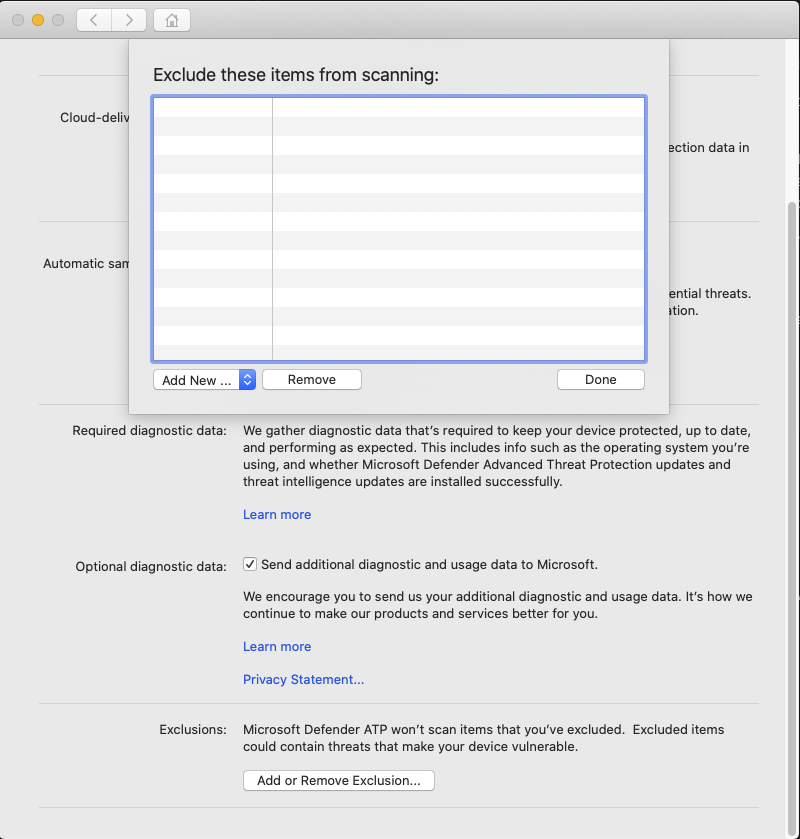

# <a name="configure-and-validate-exclusions-for-microsoft-defender-for-endpoint-on-macos"></a>MacOS의 끝점에 대한 Microsoft Defender 제외 구성 및 유효성 검사

[!INCLUDE [Microsoft 365 Defender rebranding](../../includes/microsoft-defender.md)]


**적용 대상:**
- [엔드포인트용 Microsoft Defender](https://go.microsoft.com/fwlink/p/?linkid=2154037)
- [Microsoft 365 Defender](https://go.microsoft.com/fwlink/?linkid=2118804)

> Endpoint용 Defender를 경험하고 싶나요? [무료 평가판을 신청하세요.](https://signup.microsoft.com/create-account/signup?products=7f379fee-c4f9-4278-b0a1-e4c8c2fcdf7e&ru=https://aka.ms/MDEp2OpenTrial?ocid=docs-wdatp-investigateip-abovefoldlink)

이 문서에서는 요구 시 검사에 적용되는 제외를 정의하는 방법과 실시간 보호 및 모니터링에 대한 정보를 제공합니다.

> [!IMPORTANT]
> 이 문서에 설명된 제외는 끝점 감지 및 응답(EDR)을 포함하여 Mac의 끝점용 다른 Defender에 적용되지 EDR. 이 문서에 설명된 방법을 사용하여 제외하는 파일은 경고 및 기타 EDR 트리거할 수 있습니다.

Mac 검사의 끝점용 Defender에서 특정 파일, 폴더, 프로세스 및 프로세스 열기 파일을 제외할 수 있습니다.

제외는 조직에서 고유하거나 사용자 지정된 파일 또는 소프트웨어에서 잘못된 검색을 방지하는 데 유용할 수 있습니다. Mac의 끝점용 Defender로 인한 성능 문제를 완화하는 데도 유용할 수 있습니다.

> [!WARNING]
> 제외를 정의할 경우 Mac의 끝점용 Defender에서 제공하는 보호가 낮아질 수 있습니다. 제외 구현과 관련된 위험을 항상 평가해야 합니다. 또한 악의적이지 않다고 확신하는 파일만 제외해야 합니다.

## <a name="supported-exclusion-types"></a>지원되는 제외 유형

다음 표에는 Mac의 끝점용 Defender에서 지원하는 제외 유형이 표시됩니다.

제외|정의|예제
---|---|---
파일 확장명|컴퓨터의 아무 곳이나 확장명을 통해 모든 파일|`.test`
파일|전체 경로로 식별된 특정 파일|`/var/log/test.log` <p> `/var/log/*.log` <p> `/var/log/install.?.log`
폴더|지정된 폴더에 있는 모든 파일(재발성)|`/var/log/` <p> `/var/*/`
프로세스|전체 경로 또는 파일 이름으로 지정된 특정 프로세스 및 이 프로세스에서 연 모든 파일|`/bin/cat` <p> `cat` <p> `c?t`

파일, 폴더 및 프로세스 제외는 다음 와일드카드를 지원합니다.

와일드카드|설명|예제|일치|일치하지 않습니다.
---|---|---|---|---
\*|none을 포함한 모든 문자와 일치합니다(경로 내에서 이 와일드카드를 사용하는 경우 폴더 하나만 대체).|`/var/*/*.log`|`/var/log/system.log`|`/var/log/nested/system.log`
?|단일 문자와 일치|`file?.log`|`file1.log` <p> `file2.log`|`file123.log`

> [!NOTE]
> 제품은 제외를 평가할 때 firmlinks 문제를 해결하려고 합니다. 제외에 와일드카드가 포함되거나 대상 파일(볼륨)이 없는 경우 Firmlink 확인이 `Data` 작동하지 않습니다.

## <a name="how-to-configure-the-list-of-exclusions"></a>제외 목록을 구성하는 방법

### <a name="from-the-management-console"></a>관리 콘솔에서

JAMF, Intune 또는 다른 관리 콘솔에서 제외를 구성하는 방법에 대한 자세한 내용은 Mac에서 [끝점용 Defender에](mac-preferences.md)대한 기본 설정 설정을 참조하세요.

### <a name="from-the-user-interface"></a>사용자 인터페이스에서

Endpoint용 Defender 응용 프로그램을  열고 다음 스크린샷과 같이 설정 추가 또는 제거... 관리로 \> 이동합니다.



추가하고 프롬프트를 따르는 제외 유형을 선택합니다.

## <a name="validate-exclusions-lists-with-the-eicar-test-file"></a>EICAR 테스트 파일을 사용하여 제외 목록 유효성 검사

테스트 파일을 다운로드하는 데 사용하여 제외 목록이 작동하고 있는지 확인할 `curl` 수 있습니다.

다음 Bash 코드 코드에서는 제외 규칙을 준수하는 파일로 `test.txt` 대체합니다. 예를 들어 확장을 제외한 `.testing` 경우 를 로 `test.txt` 바) `test.testing` 합니다. 경로를 테스트하는 경우 해당 경로 내에서 명령을 실행해야 합니다.

```bash
curl -o test.txt https://www.eicar.org/download/eicar.com.txt
```

Mac의 끝점용 Defender가 맬웨어를 보고하는 경우 규칙이 작동하지 않습니다. 맬웨어에 대한 보고서가 없는 경우 다운로드한 파일이 있는 경우 제외가 작동하고 있습니다. 파일을 열어 [EICAR](http://2016.eicar.org/86-0-Intended-use.html)테스트 파일 웹 사이트에 설명된 내용과 동일한지 확인할 수 있습니다.

인터넷에 액세스할 수 없는 경우 자체 EICAR 테스트 파일을 만들 수 있습니다. 다음 Bash 명령을 사용하여 새 텍스트 파일에 EICAR 문자열을 작성합니다.

```bash
echo 'X5O!P%@AP[4\PZX54(P^)7CC)7}$EICAR-STANDARD-ANTIVIRUS-TEST-FILE!$H+H*' > test.txt
```

또한 문자열을 빈 텍스트 파일에 복사하여 파일 이름이나 제외하려는 폴더에 저장할 수도 있습니다.

## <a name="allow-threats"></a>위협 허용

특정 콘텐츠를 검사하지 못하도록 제외하는 것 외에도 일부 위협 클래스(위협 이름로 식별)를 검색하지 못하도록 제품을 구성할 수도 있습니다. 이 기능을 사용할 때는 장치가 보호되지 않은 것으로 남을 수 있는 경우 주의해야 합니다.

허용 목록에 위협 이름을 추가하기 위해 다음 명령을 실행합니다.

```bash
mdatp threat allowed add --name [threat-name]
```

장치의 검색과 관련된 위협 이름은 다음 명령을 사용하여 얻을 수 있습니다.

```bash
mdatp threat list
```

예를 들어 허용 목록에 추가(EICAR 검색과 연결된 위협 이름)를 추가하기 위해 `EICAR-Test-File (not a virus)` 다음 명령을 실행합니다.

```bash
mdatp threat allowed add --name "EICAR-Test-File (not a virus)"
```
