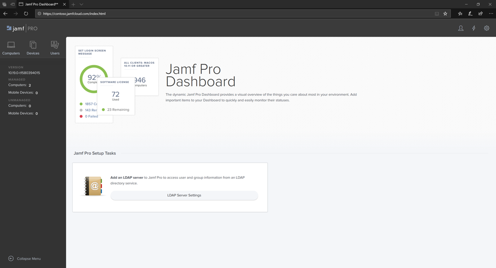

# Jamf Pro에 로그인

[!INCLUDE [Microsoft 365 Defender rebranding](../../includes/microsoft-defender.md)]

**적용 대상:**
- [엔드포인트용 Microsoft Defender](https://go.microsoft.com/fwlink/p/?linkid=2154037)
- [Microsoft 365 Defender](https://go.microsoft.com/fwlink/?linkid=2118804)

> Endpoint용 Defender를 경험하고 싶나요? [무료 평가판에 등록합니다.](https://www.microsoft.com/microsoft-365/windows/microsoft-defender-atp?ocid=docs-wdatp-investigateip-abovefoldlink)

1. 자격 증명을 입력합니다.

    

2. 컴퓨터를 **선택합니다.**

    

3. 사용 가능한 설정이 표시됩니다.

     

## 다음 단계
[Jamf Pro에서 장치 그룹 설정](mac-jamfpro-device-groups.md)

