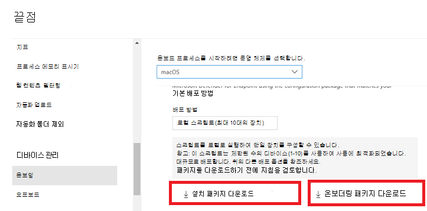
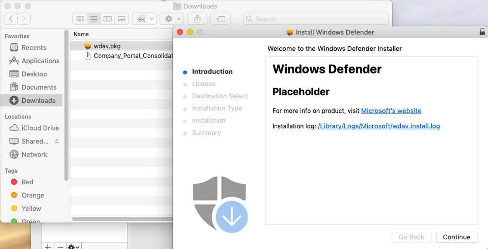
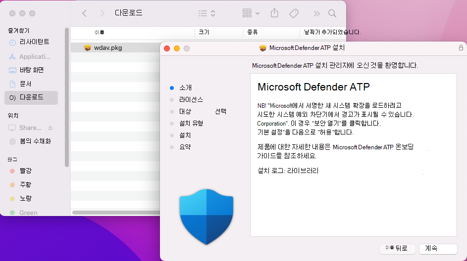
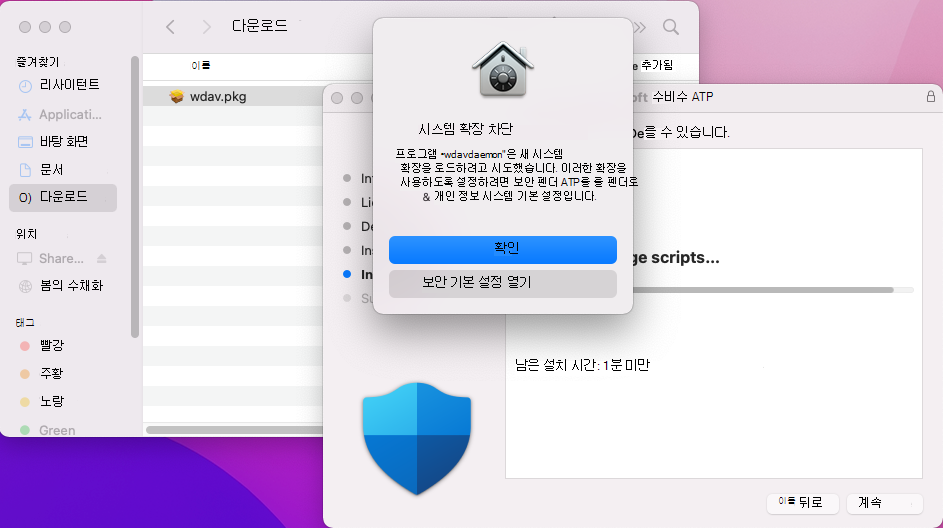
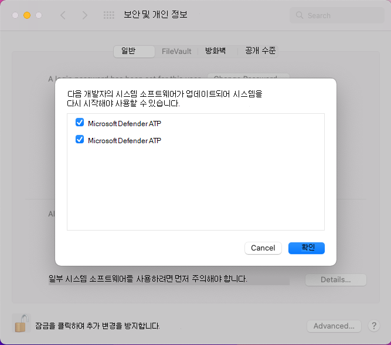
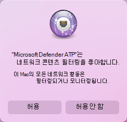
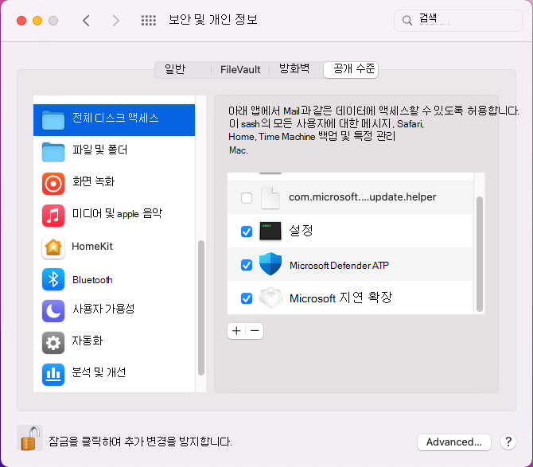

# <a name="manual-deployment-for-microsoft-defender-for-endpoint-on-macos"></a>macOS의 끝점용 Microsoft Defender 수동 배포

[!INCLUDE [Microsoft 365 Defender rebranding](../../includes/microsoft-defender.md)]

**적용 대상:**
- [엔드포인트용 Microsoft Defender](https://go.microsoft.com/fwlink/p/?linkid=2154037)
- [Microsoft 365 Defender](https://go.microsoft.com/fwlink/?linkid=2118804)

> Endpoint용 Defender를 경험하고 싶나요? [무료 평가판에 등록합니다.](https://signup.microsoft.com/create-account/signup?products=7f379fee-c4f9-4278-b0a1-e4c8c2fcdf7e&ru=https://aka.ms/MDEp2OpenTrial?ocid=docs-wdatp-investigateip-abovefoldlink)

이 항목에서는 macOS에서 수동으로 끝점용 Microsoft Defender를 배포하는 방법을 설명합니다. 배포를 성공적으로 수행하려면 다음 단계를 모두 완료해야 합니다.

- [설치 및 온보더링 패키지 다운로드](#download-installation-and-onboarding-packages)
- [응용 프로그램 설치(macOS 10.15 및 이전 버전)](#application-installation-macos-1015-and-older-versions)
- [응용 프로그램 설치(macOS 11 이상 버전)](#application-installation-macos-11-and-newer-versions)
- [클라이언트 구성](#client-configuration)

## <a name="prerequisites-and-system-requirements"></a>선행 조건 및 시스템 요구 사항

시작하기 전에 [MacOS의 주 Microsoft Defender for Endpoint](microsoft-defender-endpoint-mac.md) 페이지에서 현재 소프트웨어 버전에 대한 선행 조건 및 시스템 요구 사항에 대한 설명을 참조하세요.

## <a name="download-installation-and-onboarding-packages"></a>설치 및 온보더링 패키지 다운로드

다음 포털에서 설치 및 온보 Microsoft 365 Defender 다운로드합니다.

1. Microsoft 365 Defender 포털에서 장치 관리 설정 > 끝점 > 온보 > **로 이동하세요.**
2. 페이지의 섹션 1에서 운영 체제를 **macOS로** 설정하고 배포 방법을 **로컬 스크립트로 설정합니다.**
3. 페이지의 섹션 2에서 설치 패키지 **다운로드를 선택합니다.** 로컬 디렉터리에 wdav.pkg로 저장합니다.
4. 페이지의 섹션 2에서 **온보더링 패키지 다운로드를 선택합니다.** 동일한 디렉터리에 WindowsDefenderATPOnboardingPackage.zip 저장합니다.

    

5. 명령 프롬프트에서 두 개의 파일이 있는지 확인해야 합니다.

## <a name="application-installation-macos-1015-and-older-versions"></a>응용 프로그램 설치(macOS 10.15 및 이전 버전)

이 프로세스를 완료하려면 디바이스에 관리자 권한이 있어야 합니다.

1. Finder에서 다운로드한 wdav.pkg로 이동한 다음 을 열어 립니다.

    

2. 계속을 **선택하고** 사용 조건에 동의하고 메시지가 표시될 때 암호를 입력합니다.

    

   > [!IMPORTANT]
   > Microsoft에서 드라이버를 설치할 수 있도록 허용하라는 메시지가 표시됩니다("시스템 확장 차단" 또는 "설치가 보류 중입니다." 또는 둘 다). 드라이버를 설치할 수 있어야 합니다.

   

3. 보안 **기본 설정 열기** 또는 보안 및 개인 > 시스템 기본 & **를 선택합니다.** 허용을 **선택합니다.**

    

   설치가 진행됩니다.

   > [!CAUTION]
   > 허용을 **선택하지** 않은 경우 5분 후에 설치가 진행됩니다. 끝점용 Microsoft Defender가 로드되지만 실시간 보호와 같은 일부 기능은 사용하지 않도록 설정됩니다. 이 [문제를 해결하는 방법에](mac-support-kext.md) 대한 자세한 내용은 커널 확장 문제 해결을 참조하세요.

> [!NOTE]
> macOS는 끝점용 Microsoft Defender를 처음 설치할 때 디바이스 재부팅을 요청할 수 있습니다. 실시간 보호는 장치를 다시부팅해야 사용할 수 있습니다.

## <a name="application-installation-macos-11-and-newer-versions"></a>응용 프로그램 설치(macOS 11 이상 버전)

이 프로세스를 완료하려면 디바이스에 관리자 권한이 있어야 합니다.

1. Finder에서 다운로드한 wdav.pkg로 이동한 다음 을 열어 립니다.

    

2. 계속을 **선택하고** 사용 조건에 동의하고 메시지가 표시될 때 암호를 입력합니다.

3. 설치 프로세스가 끝나면 제품에서 사용하는 시스템 확장을 승인하기 위해 승격됩니다. 보안 **기본 설정 열기 를 선택합니다.**

    

4. 보안 및 **개인 & 창에서** 허용을 **선택합니다.**

    

5. Mac의 끝점용 Microsoft Defender와 함께 배포된 모든 시스템 확장에 대해 & 4단계를 반복합니다.

6. 끝점 검색 및 응답 기능의 일부로 Mac의 끝점용 Microsoft Defender는 소켓 트래픽을 검사하고 이 정보를 Microsoft 365 Defender 포털에 보고합니다. 네트워크 트래픽을 필터링할 수 있는 끝점에 대한 Microsoft Defender 사용 권한을 부여하라는 메시지가 표시될 때 허용을 **선택합니다.**

    

7. 시스템 **기본 설정** 보안 & 개인 정보 보호 탭으로 \>  이동합니다. Microsoft Defender ATP 및 **Microsoft Defender ATP**  끝점 보안 확장에 모든 디스크 액세스 권한을 **부여합니다.** 

    

## <a name="client-configuration"></a>클라이언트 구성

1. macOS에서 끝점용 Microsoft Defender를 MicrosoftDefenderATPOnboardingMacOs.py 디바이스에 wdav.pkg 및 파일을 복사합니다.

    클라이언트 장치가 클라이언트 장치와 연결되지 org_id. org_id *특성이* 비어 있습니다.

    ```bash
    mdatp health --field org_id
    ```

2. Python 스크립트를 실행하여 구성 파일을 설치합니다.

    ```bash
    /usr/bin/python MicrosoftDefenderATPOnboardingMacOs.py
    ```

3. 이제 장치가 조직과 연결되어 있는지 확인하고 유효한 조직 ID를 보고합니다.

    ```bash
    mdatp health --field org_id
    ```

    설치 후 오른쪽 위 모서리의 macOS 상태 표시줄에 Microsoft Defender 아이콘이 표시됩니다.

    > [!div class="mx-imgBorder"]
    > 

## <a name="how-to-allow-full-disk-access"></a>전체 디스크 액세스를 허용하는 방법

> [!CAUTION]
> macOS 10.15(카탈로니아)에는 새로운 보안 및 개인 정보 보호 향상 기능이 포함되어 있습니다. 이 버전부터 응용 프로그램은 기본적으로 명시적 동의 없이 디스크의 특정 위치(예: 문서, 다운로드, 데스크톱 등)에 액세스할 수 없습니다. 이 동의가 없는 경우 끝점용 Microsoft Defender는 장치를 완전히 보호할 수 없습니다.

1. 동의를 부여하기 위해 시스템 **기본** 설정 보안 & 개인 정보 \> **보호** 전체 디스크 \>  \> **액세스 를 를 열 수 있습니다.** 대화 상자 아래쪽에서 잠금 아이콘을 클릭하여 변경합니다. 끝점용 Microsoft Defender를 선택합니다.

2. AV 검색 테스트를 실행하여 장치가 제대로 온보드되었는지 확인하고 서비스에 보고합니다. 새로 온보드된 디바이스에서 다음 단계를 수행합니다.

    1. 실시간 보호가 사용하도록 설정되어 있는지 확인합니다(다음 명령을 실행하면 1로 표시됨).

        ```bash
        mdatp health --field real_time_protection_enabled
        ```

    1. 터미널 창을 니다. 다음 명령을 복사하여 실행합니다.

        ```bash
        curl -o ~/Downloads/eicar.com.txt https://www.eicar.org/download/eicar.com.txt
        ```

    1. 파일이 Mac의 끝점에 대한 Defender에 의해서만 검사된 것입니다. 다음 명령을 사용하여 검색된 모든 위협을 나열합니다.

        ```bash
        mdatp threat list
        ```

3. EDR 검색 테스트를 실행하여 장치가 제대로 온보드되어 서비스에 보고되었는지 확인합니다. 새로 온보드된 디바이스에서 다음 단계를 수행합니다.

   1. In your browser such as Microsoft Edge for Mac or Safari.

   1. MDATP MacOS 다운로드 DIY.zip https://aka.ms/mdatpmacosdiy 추출합니다.

      다음 메시지가 표시될 수 있습니다.

      > "앱"에서 다운로드를 허용하고 mdatpclientanalyzer.blob.core.windows.net?<br/>
      > 웹 사이트 기본 설정에서 파일을 다운로드할 수 있는 웹 사이트를 변경할 수 있습니다.

4. 허용을 **클릭합니다.**

5. 다운로드 **열기.**

6. **MDATP MacOS DIY가 표시 됩니다.**

   > [!TIP]
   > 두 번 클릭하면 다음 메시지가 표시됩니다.
   >
   > > **개발자가 검증자일 수 없는 "MDATP MacOS DIY"를 열 수 없습니다.**<br/>
   > > macOS는 이 앱이 맬웨어에서 무료인지 확인할 수 없습니다.<br/>
   > > **\[ 휴지통 \] 취소로** **\[ 이동 \]**

7. 따라서 **취소** 를 클릭합니다.

8. **MDATP MacOS DIY를 마우스** 오른쪽 단추로 클릭한 다음 **열기 를 클릭합니다.**

    시스템에 다음 메시지가 표시됩니다.

    > **macOS는 MDATP MacOS DIY의 개발자를 확인할 수 없습니다. 열려고 하나요?**<br/>
    > 이 앱을 열면 컴퓨터 및 개인 정보를 Mac에 손상을 주거나 개인 정보를 손상시킬 수 있는 맬웨어에 노출될 수 있는 시스템 보안을 다시 정합니다.

9. **열기** 를 클릭합니다. 

    시스템에 다음 메시지가 표시됩니다.

    > 끝점용 Microsoft Defender - macOS EDR DIY 테스트 파일<br/>
    > 해당 경고는 MDATP 포털에서 사용할 수 있습니다.

10. **열기** 를 클릭합니다. 

    몇 분 후에 "macOS EDR 경고"라는 경고가 발생해야 합니다.

11. Microsoft 365 Defender 포털(로 https://security.microsoft.com/) 이동).

12. 경고 큐로 이동합니다.

    :::image type="content" source="images/b8db76c2-c368-49ad-970f-dcb87534d9be.png" alt-text="심각도, EDR, 검색 원본 및 축소된 작업 메뉴를 표시하는 macOS 테스트 경고의 예입니다.":::

    경고 세부 정보 및 장치 타임라인을 보고 정기적인 조사 단계를 수행합니다.

## <a name="logging-installation-issues"></a>로깅 설치 문제

오류가 [발생할](mac-resources.md#logging-installation-issues) 때 설치 관리자에 의해 생성된 자동으로 생성된 로그를 찾는 방법에 대한 자세한 내용은 설치 문제 로깅을 참조하세요.

## <a name="uninstallation"></a>제거

클라이언트 [장치에서](mac-resources.md#uninstalling) macOS에서 끝점용 Microsoft Defender를 제거하는 방법에 대한 자세한 내용은 제거를 참조합니다.
