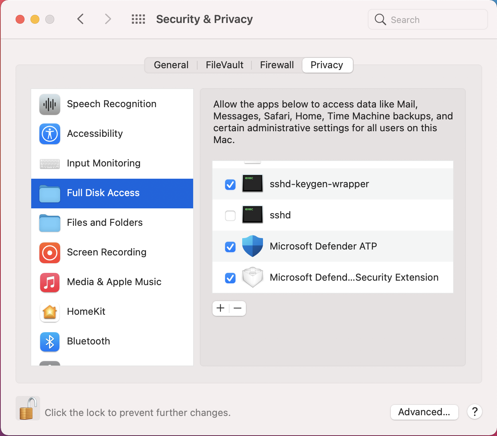

# <a name="manual-deployment-for-microsoft-defender-for-endpoint-on-macos"></a><span data-ttu-id="3f1c0-104">macOS의 끝점용 Microsoft Defender 수동 배포</span><span class="sxs-lookup"><span data-stu-id="3f1c0-104">Manual deployment for Microsoft Defender for Endpoint on macOS</span></span>

[!INCLUDE [Microsoft 365 Defender rebranding](../../includes/microsoft-defender.md)]

<span data-ttu-id="3f1c0-105">**적용 대상:**</span><span class="sxs-lookup"><span data-stu-id="3f1c0-105">**Applies to:**</span></span>
- [<span data-ttu-id="3f1c0-106">엔드포인트용 Microsoft Defender</span><span class="sxs-lookup"><span data-stu-id="3f1c0-106">Microsoft Defender for Endpoint</span></span>](https://go.microsoft.com/fwlink/p/?linkid=2154037)
- [<span data-ttu-id="3f1c0-107">Microsoft 365 Defender</span><span class="sxs-lookup"><span data-stu-id="3f1c0-107">Microsoft 365 Defender</span></span>](https://go.microsoft.com/fwlink/?linkid=2118804)

> <span data-ttu-id="3f1c0-108">Endpoint용 Defender를 경험하고 싶나요?</span><span class="sxs-lookup"><span data-stu-id="3f1c0-108">Want to experience Defender for Endpoint?</span></span> [<span data-ttu-id="3f1c0-109">무료 평가판에 등록합니다.</span><span class="sxs-lookup"><span data-stu-id="3f1c0-109">Sign up for a free trial.</span></span>](https://www.microsoft.com/microsoft-365/windows/microsoft-defender-atp?ocid=docs-wdatp-investigateip-abovefoldlink)

<span data-ttu-id="3f1c0-110">이 항목에서는 macOS에서 수동으로 끝점용 Microsoft Defender를 배포하는 방법을 설명합니다.</span><span class="sxs-lookup"><span data-stu-id="3f1c0-110">This topic describes how to deploy Microsoft Defender for Endpoint on macOS manually.</span></span> <span data-ttu-id="3f1c0-111">배포를 성공적으로 수행하려면 다음 단계를 모두 완료해야 합니다.</span><span class="sxs-lookup"><span data-stu-id="3f1c0-111">A successful deployment requires the completion of all of the following steps:</span></span>
- [<span data-ttu-id="3f1c0-112">설치 및 온보더링 패키지 다운로드</span><span class="sxs-lookup"><span data-stu-id="3f1c0-112">Download installation and onboarding packages</span></span>](#download-installation-and-onboarding-packages)
- [<span data-ttu-id="3f1c0-113">응용 프로그램 설치(macOS 10.15 및 이전 버전)</span><span class="sxs-lookup"><span data-stu-id="3f1c0-113">Application installation (macOS 10.15 and older versions)</span></span>](#application-installation-macos-1015-and-older-versions)
- [<span data-ttu-id="3f1c0-114">응용 프로그램 설치(macOS 11 이상 버전)</span><span class="sxs-lookup"><span data-stu-id="3f1c0-114">Application installation (macOS 11 and newer versions)</span></span>](#application-installation-macos-11-and-newer-versions)
- [<span data-ttu-id="3f1c0-115">클라이언트 구성</span><span class="sxs-lookup"><span data-stu-id="3f1c0-115">Client configuration</span></span>](#client-configuration)

## <a name="prerequisites-and-system-requirements"></a><span data-ttu-id="3f1c0-116">선행 조건 및 시스템 요구 사항</span><span class="sxs-lookup"><span data-stu-id="3f1c0-116">Prerequisites and system requirements</span></span>

<span data-ttu-id="3f1c0-117">시작하기 전에 [MacOS의 주 Microsoft Defender for Endpoint](microsoft-defender-endpoint-mac.md) 페이지에서 현재 소프트웨어 버전에 대한 선행 조건 및 시스템 요구 사항에 대한 설명을 참조하세요.</span><span class="sxs-lookup"><span data-stu-id="3f1c0-117">Before you get started, see [the main Microsoft Defender for Endpoint on macOS page](microsoft-defender-endpoint-mac.md) for a description of prerequisites and system requirements for the current software version.</span></span>

## <a name="download-installation-and-onboarding-packages"></a><span data-ttu-id="3f1c0-118">설치 및 온보더링 패키지 다운로드</span><span class="sxs-lookup"><span data-stu-id="3f1c0-118">Download installation and onboarding packages</span></span>

<span data-ttu-id="3f1c0-119">Microsoft Defender 보안 센터에서 설치 및 온보딩 패키지를 다운로드합니다.</span><span class="sxs-lookup"><span data-stu-id="3f1c0-119">Download the installation and onboarding packages from Microsoft Defender Security Center:</span></span>

1. <span data-ttu-id="3f1c0-120">Microsoft Defender 보안 센터에서 설정 > 장치 관리 > **로 이동합니다.**</span><span class="sxs-lookup"><span data-stu-id="3f1c0-120">In Microsoft Defender Security Center, go to **Settings > Device Management > Onboarding**.</span></span>
2. <span data-ttu-id="3f1c0-121">페이지의 섹션 1에서 운영 체제를 **macOS로** 설정하고 배포 방법을 **로컬 스크립트로 설정합니다.**</span><span class="sxs-lookup"><span data-stu-id="3f1c0-121">In Section 1 of the page, set operating system to **macOS** and Deployment method to **Local script**.</span></span>
3. <span data-ttu-id="3f1c0-122">페이지의 섹션 2에서 설치 패키지 **다운로드를 선택합니다.**</span><span class="sxs-lookup"><span data-stu-id="3f1c0-122">In Section 2 of the page, select **Download installation package**.</span></span> <span data-ttu-id="3f1c0-123">로컬 디렉터리에 wdav.pkg로 저장합니다.</span><span class="sxs-lookup"><span data-stu-id="3f1c0-123">Save it as wdav.pkg to a local directory.</span></span>
4. <span data-ttu-id="3f1c0-124">페이지의 섹션 2에서 **온보더링 패키지 다운로드를 선택합니다.**</span><span class="sxs-lookup"><span data-stu-id="3f1c0-124">In Section 2 of the page, select **Download onboarding package**.</span></span> <span data-ttu-id="3f1c0-125">동일한 디렉터리에 WindowsDefenderATPOnboardingPackage.zip 저장합니다.</span><span class="sxs-lookup"><span data-stu-id="3f1c0-125">Save it as WindowsDefenderATPOnboardingPackage.zip to the same directory.</span></span>

    

5. <span data-ttu-id="3f1c0-127">명령 프롬프트에서 두 개의 파일이 있는지 확인해야 합니다.</span><span class="sxs-lookup"><span data-stu-id="3f1c0-127">From a command prompt, verify that you have the two files.</span></span>
    
## <a name="application-installation-macos-1015-and-older-versions"></a><span data-ttu-id="3f1c0-128">응용 프로그램 설치(macOS 10.15 및 이전 버전)</span><span class="sxs-lookup"><span data-stu-id="3f1c0-128">Application installation (macOS 10.15 and older versions)</span></span>

<span data-ttu-id="3f1c0-129">이 프로세스를 완료하려면 디바이스에 관리자 권한이 있어야 합니다.</span><span class="sxs-lookup"><span data-stu-id="3f1c0-129">To complete this process, you must have admin privileges on the device.</span></span>

1. <span data-ttu-id="3f1c0-130">Finder에서 다운로드한 wdav.pkg로 이동한 다음 을 열어 립니다.</span><span class="sxs-lookup"><span data-stu-id="3f1c0-130">Navigate to the downloaded wdav.pkg in Finder and open it.</span></span>

    

2. <span data-ttu-id="3f1c0-132">계속을 **선택하고** 사용 조건에 동의하고 메시지가 표시될 때 암호를 입력합니다.</span><span class="sxs-lookup"><span data-stu-id="3f1c0-132">Select **Continue**, agree with the License terms, and enter the password when prompted.</span></span>

    

   > [!IMPORTANT]
   > <span data-ttu-id="3f1c0-134">Microsoft에서 드라이버를 설치할 수 있도록 허용하라는 메시지가 표시됩니다("시스템 확장 차단" 또는 "설치가 보류 중입니다." 또는 둘 다).</span><span class="sxs-lookup"><span data-stu-id="3f1c0-134">You will be prompted to allow a driver from Microsoft to be installed (either "System Extension Blocked" or "Installation is on hold" or both.</span></span> <span data-ttu-id="3f1c0-135">드라이버를 설치할 수 있어야 합니다.</span><span class="sxs-lookup"><span data-stu-id="3f1c0-135">The driver must be allowed to be installed.</span></span>

   

3. <span data-ttu-id="3f1c0-137">보안 **기본 설정 열기** 또는 보안 및 개인 > 시스템 기본 & **를 선택합니다.**</span><span class="sxs-lookup"><span data-stu-id="3f1c0-137">Select **Open Security Preferences** or **Open System Preferences > Security & Privacy**.</span></span> <span data-ttu-id="3f1c0-138">허용을 **선택합니다.**</span><span class="sxs-lookup"><span data-stu-id="3f1c0-138">Select **Allow**:</span></span>

    

   <span data-ttu-id="3f1c0-140">설치가 진행됩니다.</span><span class="sxs-lookup"><span data-stu-id="3f1c0-140">The installation proceeds.</span></span>

   > [!CAUTION]
   > <span data-ttu-id="3f1c0-141">허용을 **선택하지** 않은 경우 5분 후에 설치가 진행됩니다.</span><span class="sxs-lookup"><span data-stu-id="3f1c0-141">If you don't select **Allow**, the installation will proceed after 5 minutes.</span></span> <span data-ttu-id="3f1c0-142">끝점용 Microsoft Defender가 로드되지만 실시간 보호와 같은 일부 기능은 사용하지 않도록 설정됩니다.</span><span class="sxs-lookup"><span data-stu-id="3f1c0-142">Microsoft Defender for Endpoint will be loaded, but some features, such as real-time protection, will be disabled.</span></span> <span data-ttu-id="3f1c0-143">이 [문제를 해결하는 방법에](mac-support-kext.md) 대한 자세한 내용은 커널 확장 문제 해결을 참조하세요.</span><span class="sxs-lookup"><span data-stu-id="3f1c0-143">See [Troubleshoot kernel extension issues](mac-support-kext.md) for information on how to resolve this.</span></span>

> [!NOTE]
> <span data-ttu-id="3f1c0-144">macOS는 끝점용 Microsoft Defender를 처음 설치할 때 디바이스 재부팅을 요청할 수 있습니다.</span><span class="sxs-lookup"><span data-stu-id="3f1c0-144">macOS may request to reboot the device upon the first installation of Microsoft Defender for Endpoint.</span></span> <span data-ttu-id="3f1c0-145">실시간 보호는 장치를 다시부팅해야 사용할 수 있습니다.</span><span class="sxs-lookup"><span data-stu-id="3f1c0-145">Real-time protection will not be available until the device is rebooted.</span></span>

## <a name="application-installation-macos-11-and-newer-versions"></a><span data-ttu-id="3f1c0-146">응용 프로그램 설치(macOS 11 이상 버전)</span><span class="sxs-lookup"><span data-stu-id="3f1c0-146">Application installation (macOS 11 and newer versions)</span></span>

<span data-ttu-id="3f1c0-147">이 프로세스를 완료하려면 디바이스에 관리자 권한이 있어야 합니다.</span><span class="sxs-lookup"><span data-stu-id="3f1c0-147">To complete this process, you must have admin privileges on the device.</span></span>

1. <span data-ttu-id="3f1c0-148">Finder에서 다운로드한 wdav.pkg로 이동한 다음 을 열어 립니다.</span><span class="sxs-lookup"><span data-stu-id="3f1c0-148">Navigate to the downloaded wdav.pkg in Finder and open it.</span></span>

    

2. <span data-ttu-id="3f1c0-150">계속을 **선택하고** 사용 조건에 동의하고 메시지가 표시될 때 암호를 입력합니다.</span><span class="sxs-lookup"><span data-stu-id="3f1c0-150">Select **Continue**, agree with the License terms, and enter the password when prompted.</span></span>

3. <span data-ttu-id="3f1c0-151">설치 프로세스가 끝나면 제품에서 사용하는 시스템 확장을 승인하기 위해 승격됩니다.</span><span class="sxs-lookup"><span data-stu-id="3f1c0-151">At the end of the installation process, you'll be promoted to approve the system extensions used by the product.</span></span> <span data-ttu-id="3f1c0-152">보안 **기본 설정 열기 를 선택합니다.**</span><span class="sxs-lookup"><span data-stu-id="3f1c0-152">Select **Open Security Preferences**.</span></span>

    

4. <span data-ttu-id="3f1c0-154">보안 및 **개인 & 창에서** 허용을 **선택합니다.**</span><span class="sxs-lookup"><span data-stu-id="3f1c0-154">From the **Security & Privacy** window, select **Allow**.</span></span>

    

5. <span data-ttu-id="3f1c0-156">Mac의 끝점용 Microsoft Defender와 함께 배포된 모든 시스템 확장에 대해 & 4단계를 반복합니다.</span><span class="sxs-lookup"><span data-stu-id="3f1c0-156">Repeat steps 3 & 4 for all system extensions distributed with Microsoft Defender for Endpoint on Mac.</span></span>

6. <span data-ttu-id="3f1c0-157">끝점 감지 및 응답 기능의 일부로 Mac의 끝점용 Microsoft Defender는 소켓 트래픽을 검사하고 이 정보를 Microsoft Defender 보안 센터 포털에 보고합니다.</span><span class="sxs-lookup"><span data-stu-id="3f1c0-157">As part of the Endpoint Detection and Response capabilities, Microsoft Defender for Endpoint on Mac inspects socket traffic and reports this information to the Microsoft Defender Security Center portal.</span></span> <span data-ttu-id="3f1c0-158">네트워크 트래픽을 필터링할 수 있는 끝점에 대한 Microsoft Defender 사용 권한을 부여하라는 메시지가 표시될 때 허용을 **선택합니다.**</span><span class="sxs-lookup"><span data-stu-id="3f1c0-158">When prompted to grant Microsoft Defender for Endpoint permissions to filter network traffic, select **Allow**.</span></span>

    

7. <span data-ttu-id="3f1c0-160">시스템 **기본 설정** 보안 & 개인 정보 보호 탭으로  >   이동합니다. Microsoft Defender ATP 및 **Microsoft Defender ATP**  끝점 보안 확장에 모든 디스크 액세스 권한을 **부여합니다.** </span><span class="sxs-lookup"><span data-stu-id="3f1c0-160">Open **System Preferences** > **Security & Privacy** and navigate to the **Privacy** tab. Grant **Full Disk Access** permission to **Microsoft Defender ATP** and **Microsoft Defender ATP Endpoint Security Extension**.</span></span>

    

## <a name="client-configuration"></a><span data-ttu-id="3f1c0-162">클라이언트 구성</span><span class="sxs-lookup"><span data-stu-id="3f1c0-162">Client configuration</span></span>

1. <span data-ttu-id="3f1c0-163">macOS에서 끝점용 Microsoft Defender를 MicrosoftDefenderATPOnboardingMacOs.py 디바이스에 wdav.pkg 및 파일을 복사합니다.</span><span class="sxs-lookup"><span data-stu-id="3f1c0-163">Copy wdav.pkg and MicrosoftDefenderATPOnboardingMacOs.py to the device where you deploy Microsoft Defender for Endpoint on macOS.</span></span>

    <span data-ttu-id="3f1c0-164">클라이언트 장치가 클라이언트 장치와 연결되지 org_id.</span><span class="sxs-lookup"><span data-stu-id="3f1c0-164">The client device isn't associated with org_id.</span></span> <span data-ttu-id="3f1c0-165">org_id *특성이* 비어 있습니다.</span><span class="sxs-lookup"><span data-stu-id="3f1c0-165">Note that the *org_id* attribute is blank.</span></span>

    ```bash
    mdatp health --field org_id
    ```

2. <span data-ttu-id="3f1c0-166">Python 스크립트를 실행하여 구성 파일을 설치합니다.</span><span class="sxs-lookup"><span data-stu-id="3f1c0-166">Run the Python script to install the configuration file:</span></span>

    ```bash
    /usr/bin/python MicrosoftDefenderATPOnboardingMacOs.py
    ```

3. <span data-ttu-id="3f1c0-167">이제 장치가 조직과 연결되어 있는지 확인하고 유효한 조직 ID를 보고합니다.</span><span class="sxs-lookup"><span data-stu-id="3f1c0-167">Verify that the device is now associated with your organization and reports a valid org ID:</span></span>

    ```bash
    mdatp health --field org_id
    ```

    <span data-ttu-id="3f1c0-168">설치 후 오른쪽 위 모서리의 macOS 상태 표시줄에 Microsoft Defender 아이콘이 표시됩니다.</span><span class="sxs-lookup"><span data-stu-id="3f1c0-168">After installation, you'll see the Microsoft Defender icon in the macOS status bar in the top-right corner.</span></span>
    
    > [!div class="mx-imgBorder"]
    > <span data-ttu-id="3f1c0-169"></span><span class="sxs-lookup"><span data-stu-id="3f1c0-169"></span></span>


## <a name="how-to-allow-full-disk-access"></a><span data-ttu-id="3f1c0-170">전체 디스크 액세스를 허용하는 방법</span><span class="sxs-lookup"><span data-stu-id="3f1c0-170">How to Allow Full Disk Access</span></span>

> [!CAUTION]
> <span data-ttu-id="3f1c0-171">macOS 10.15(카탈로니아)에는 새로운 보안 및 개인 정보 보호 향상 기능이 포함되어 있습니다.</span><span class="sxs-lookup"><span data-stu-id="3f1c0-171">macOS 10.15 (Catalina) contains new security and privacy enhancements.</span></span> <span data-ttu-id="3f1c0-172">이 버전부터 응용 프로그램은 기본적으로 명시적 동의 없이 디스크의 특정 위치(예: 문서, 다운로드, 데스크톱 등)에 액세스할 수 없습니다.</span><span class="sxs-lookup"><span data-stu-id="3f1c0-172">Beginning with this version, by default, applications are not able to access certain locations on disk (such as Documents, Downloads, Desktop, etc.) without explicit consent.</span></span> <span data-ttu-id="3f1c0-173">이 동의가 없는 경우 끝점용 Microsoft Defender는 장치를 완전히 보호할 수 없습니다.</span><span class="sxs-lookup"><span data-stu-id="3f1c0-173">In the absence of this consent, Microsoft Defender for Endpoint is not able to fully protect your device.</span></span>

1. <span data-ttu-id="3f1c0-174">동의를 부여하기 위해 시스템 **기본** 설정 보안 & 개인 정보  >  **보호** 전체 디스크  >    >  **액세스 를 를 열 수 있습니다.**</span><span class="sxs-lookup"><span data-stu-id="3f1c0-174">To grant consent, open **System Preferences** > **Security & Privacy** > **Privacy** > **Full Disk Access**.</span></span> <span data-ttu-id="3f1c0-175">대화 상자 아래쪽에서 잠금 아이콘을 클릭하여 변경합니다.</span><span class="sxs-lookup"><span data-stu-id="3f1c0-175">Click the lock icon to make changes (bottom of the dialog box).</span></span> <span data-ttu-id="3f1c0-176">끝점용 Microsoft Defender를 선택합니다.</span><span class="sxs-lookup"><span data-stu-id="3f1c0-176">Select Microsoft Defender for Endpoint.</span></span>

2. <span data-ttu-id="3f1c0-177">AV 검색 테스트를 실행하여 장치가 제대로 온보드되었는지 확인하고 서비스에 보고합니다.</span><span class="sxs-lookup"><span data-stu-id="3f1c0-177">Run an AV detection test to verify that the device is properly onboarded and reporting to the service.</span></span> <span data-ttu-id="3f1c0-178">새로 온보드된 디바이스에서 다음 단계를 수행합니다.</span><span class="sxs-lookup"><span data-stu-id="3f1c0-178">Perform the following steps on the newly onboarded device:</span></span>

    1. <span data-ttu-id="3f1c0-179">실시간 보호가 사용하도록 설정되어 있는지 확인합니다(다음 명령을 실행하면 1로 표시됨).</span><span class="sxs-lookup"><span data-stu-id="3f1c0-179">Ensure that real-time protection is enabled (denoted by a result of 1 from running the following command):</span></span>

        ```bash
        mdatp health --field real_time_protection_enabled
        ```

    1. <span data-ttu-id="3f1c0-180">터미널 창을 니다.</span><span class="sxs-lookup"><span data-stu-id="3f1c0-180">Open a Terminal window.</span></span> <span data-ttu-id="3f1c0-181">다음 명령을 복사하여 실행합니다.</span><span class="sxs-lookup"><span data-stu-id="3f1c0-181">Copy and execute the following command:</span></span>

        ```bash
        curl -o ~/Downloads/eicar.com.txt https://www.eicar.org/download/eicar.com.txt
        ```

    1. <span data-ttu-id="3f1c0-182">파일이 Mac의 끝점에 대한 Defender에 의해서만 검사된 것입니다.</span><span class="sxs-lookup"><span data-stu-id="3f1c0-182">The file should have been quarantined by Defender for Endpoint on Mac.</span></span> <span data-ttu-id="3f1c0-183">다음 명령을 사용하여 검색된 모든 위협을 나열합니다.</span><span class="sxs-lookup"><span data-stu-id="3f1c0-183">Use the following command to list all the detected threats:</span></span>

        ```bash
        mdatp threat list
        ```

3. <span data-ttu-id="3f1c0-184">EDR 검색 테스트를 실행하여 장치가 제대로 온보드되었는지 확인하고 서비스에 보고합니다.</span><span class="sxs-lookup"><span data-stu-id="3f1c0-184">Run an EDR detection test to verify that the device is properly onboarded and reporting to the service.</span></span> <span data-ttu-id="3f1c0-185">새로 온보드된 디바이스에서 다음 단계를 수행합니다.</span><span class="sxs-lookup"><span data-stu-id="3f1c0-185">Perform the following steps on the newly onboarded device:</span></span>

   1. <span data-ttu-id="3f1c0-186">Mac용 Microsoft Edge 또는 Safari와 같은 브라우저에서.</span><span class="sxs-lookup"><span data-stu-id="3f1c0-186">In your browser such as Microsoft Edge for Mac or Safari.</span></span>

   1. <span data-ttu-id="3f1c0-187">MDATP MacOS 다운로드 DIY.zip https://aka.ms/mdatpmacosdiy 추출합니다.</span><span class="sxs-lookup"><span data-stu-id="3f1c0-187">Download MDATP MacOS DIY.zip from https://aka.ms/mdatpmacosdiy and extract.</span></span>

      <span data-ttu-id="3f1c0-188">다음 메시지가 표시될 수 있습니다.</span><span class="sxs-lookup"><span data-stu-id="3f1c0-188">You may be prompted:</span></span>

      > <span data-ttu-id="3f1c0-189">"앱"에서 다운로드를 허용하고 mdatpclientanalyzer.blob.core.windows.net?</span><span class="sxs-lookup"><span data-stu-id="3f1c0-189">Do you want to allow downloads on "mdatpclientanalyzer.blob.core.windows.net"?</span></span><br/>
      > <span data-ttu-id="3f1c0-190">웹 사이트 기본 설정에서 파일을 다운로드할 수 있는 웹 사이트를 변경할 수 있습니다.</span><span class="sxs-lookup"><span data-stu-id="3f1c0-190">You can change which websites can download files in Websites Preferences.</span></span>

4. <span data-ttu-id="3f1c0-191">허용을 **클릭합니다.**</span><span class="sxs-lookup"><span data-stu-id="3f1c0-191">Click **Allow**.</span></span>

5. <span data-ttu-id="3f1c0-192">다운로드 **열기.**</span><span class="sxs-lookup"><span data-stu-id="3f1c0-192">Open **Downloads**.</span></span>

6. <span data-ttu-id="3f1c0-193">**MDATP MacOS DIY가 표시 됩니다.**</span><span class="sxs-lookup"><span data-stu-id="3f1c0-193">You should see **MDATP MacOS DIY**.</span></span>

   > [!TIP]
   > <span data-ttu-id="3f1c0-194">두 번 클릭하면 다음 메시지가 표시됩니다.</span><span class="sxs-lookup"><span data-stu-id="3f1c0-194">If you double-click, you will get the following message:</span></span>
   > 
   > > <span data-ttu-id="3f1c0-195">**개발자가 검증자일 수 없는 "MDATP MacOS DIY"를 열 수 없습니다.**</span><span class="sxs-lookup"><span data-stu-id="3f1c0-195">**"MDATP MacOS DIY" cannot be opened because the developer cannot be verifier.**</span></span><br/>
   > > <span data-ttu-id="3f1c0-196">macOS는 이 앱이 맬웨어에서 무료인지 확인할 수 없습니다.</span><span class="sxs-lookup"><span data-stu-id="3f1c0-196">macOS cannot verify that this app is free from malware.</span></span><br/>
   > > <span data-ttu-id="3f1c0-197">**\[ 휴지통 \] 취소로** **\[ 이동 \]**</span><span class="sxs-lookup"><span data-stu-id="3f1c0-197">**\[Move to Trash\]** **\[Cancel\]**</span></span> 
  
7. <span data-ttu-id="3f1c0-198">따라서 **취소** 를 클릭합니다.</span><span class="sxs-lookup"><span data-stu-id="3f1c0-198">Click **Cancel**.</span></span>

8. <span data-ttu-id="3f1c0-199">**MDATP MacOS DIY를 마우스** 오른쪽 단추로 클릭한 다음 **열기 를 클릭합니다.**</span><span class="sxs-lookup"><span data-stu-id="3f1c0-199">Right-click **MDATP MacOS DIY**, and then click **Open**.</span></span> 

    <span data-ttu-id="3f1c0-200">시스템에 다음 메시지가 표시됩니다.</span><span class="sxs-lookup"><span data-stu-id="3f1c0-200">The system should display the following message:</span></span>

    > <span data-ttu-id="3f1c0-201">**macOS는 **MDATP MacOS DIY의 개발자를 확인할 수 없습니다.** 열려고 하나요?**</span><span class="sxs-lookup"><span data-stu-id="3f1c0-201">**macOS cannot verify the developer of **MDATP MacOS DIY**. Are you sure you want to open it?**</span></span><br/>
    > <span data-ttu-id="3f1c0-202">이 앱을 열면 컴퓨터 및 개인 정보를 Mac에 손상을 주거나 개인 정보를 손상시킬 수 있는 맬웨어에 노출될 수 있는 시스템 보안을 다시 정합니다.</span><span class="sxs-lookup"><span data-stu-id="3f1c0-202">By opening this app, you will be overriding system security which can expose your computer and personal information to malware that may harm your Mac or compromise your privacy.</span></span>

10. <span data-ttu-id="3f1c0-203">**열기** 를 클릭합니다. </span><span class="sxs-lookup"><span data-stu-id="3f1c0-203">Click **Open**.</span></span>

    <span data-ttu-id="3f1c0-204">시스템에 다음 메시지가 표시됩니다.</span><span class="sxs-lookup"><span data-stu-id="3f1c0-204">The system should display the following message:</span></span>

    > <span data-ttu-id="3f1c0-205">끝점용 Microsoft Defender - macOS EDR DIY 테스트 파일</span><span class="sxs-lookup"><span data-stu-id="3f1c0-205">Microsoft Defender for Endpoint - macOS EDR DIY test file</span></span><br/>
    > <span data-ttu-id="3f1c0-206">해당 경고는 MDATP 포털에서 사용할 수 있습니다.</span><span class="sxs-lookup"><span data-stu-id="3f1c0-206">Corresponding alert will be available in the MDATP portal.</span></span>

11. <span data-ttu-id="3f1c0-207">**열기** 를 클릭합니다. </span><span class="sxs-lookup"><span data-stu-id="3f1c0-207">Click **Open**.</span></span>

    <span data-ttu-id="3f1c0-208">몇 분 후에 "macOS EDR 테스트 경고"라는 경고가 발생해야 합니다.</span><span class="sxs-lookup"><span data-stu-id="3f1c0-208">In a few minutes an alert named "macOS EDR Test Alert" should be raised.</span></span>

12. <span data-ttu-id="3f1c0-209">Microsoft Defender 보안 센터(로 https://SecurityCenter.microsoft.com) 이동).</span><span class="sxs-lookup"><span data-stu-id="3f1c0-209">Go to Microsoft Defender Security Center (https://SecurityCenter.microsoft.com).</span></span>

13. <span data-ttu-id="3f1c0-210">경고 큐로 이동합니다.</span><span class="sxs-lookup"><span data-stu-id="3f1c0-210">Go to the Alert Queue.</span></span>

    :::image type="content" source="images/b8db76c2-c368-49ad-970f-dcb87534d9be.png" alt-text="심각도, 범주, 검색 원본 및 축소된 작업 메뉴를 표시하는 macOS EDR 테스트 경고의 예입니다.":::
    
    <span data-ttu-id="3f1c0-212">경고 세부 정보 및 장치 타임라인을 보고 정기적인 조사 단계를 수행합니다.</span><span class="sxs-lookup"><span data-stu-id="3f1c0-212">Look at the alert details and the device timeline, and perform the regular investigation steps.</span></span>

## <a name="logging-installation-issues"></a><span data-ttu-id="3f1c0-213">로깅 설치 문제</span><span class="sxs-lookup"><span data-stu-id="3f1c0-213">Logging installation issues</span></span>

<span data-ttu-id="3f1c0-214">오류가 [발생할](mac-resources.md#logging-installation-issues) 때 설치 관리자에 의해 생성된 자동으로 생성된 로그를 찾는 방법에 대한 자세한 내용은 설치 문제 로깅을 참조하세요.</span><span class="sxs-lookup"><span data-stu-id="3f1c0-214">See [Logging installation issues](mac-resources.md#logging-installation-issues) for more information on how to find the automatically generated log that is created by the installer when an error occurs.</span></span>

## <a name="uninstallation"></a><span data-ttu-id="3f1c0-215">제거</span><span class="sxs-lookup"><span data-stu-id="3f1c0-215">Uninstallation</span></span>

<span data-ttu-id="3f1c0-216">클라이언트 [장치에서](mac-resources.md#uninstalling) macOS에서 끝점용 Microsoft Defender를 제거하는 방법에 대한 자세한 내용은 제거를 참조합니다.</span><span class="sxs-lookup"><span data-stu-id="3f1c0-216">See [Uninstalling](mac-resources.md#uninstalling) for details on how to remove Microsoft Defender for Endpoint on macOS from client devices.</span></span>
