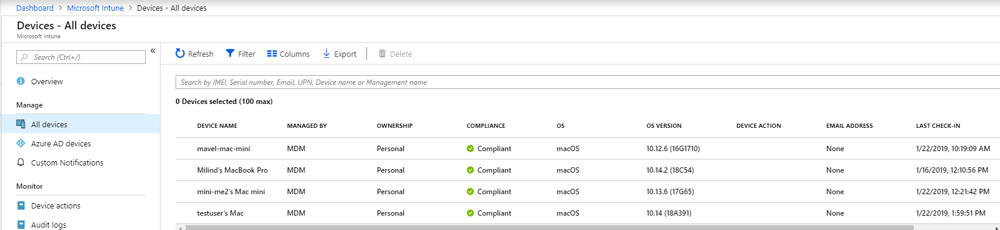

# <a name="intune-based-deployment-for-microsoft-defender-for-endpoint-on-macos"></a><span data-ttu-id="74d27-104">MacOS의 끝점용 Microsoft Defender용 Intune 기반 배포</span><span class="sxs-lookup"><span data-stu-id="74d27-104">Intune-based deployment for Microsoft Defender for Endpoint on macOS</span></span>


[!INCLUDE [Microsoft 365 Defender rebranding](../../includes/microsoft-defender.md)]


> [!NOTE]
> <span data-ttu-id="74d27-105">이 설명서에서는 macOS 장치에서 끝점용 Microsoft Defender를 배포하고 구성하는 레거시 방법에 대해 설명하고 있습니다.</span><span class="sxs-lookup"><span data-stu-id="74d27-105">This documentation explains the legacy method for deploying and configuring Microsoft Defender for Endpoint on macOS devices.</span></span> <span data-ttu-id="74d27-106">이제 MEM 콘솔에서 기본 환경을 사용할 수 있습니다.</span><span class="sxs-lookup"><span data-stu-id="74d27-106">The native experience is now available in the MEM console.</span></span> <span data-ttu-id="74d27-107">MEM 콘솔의 기본 UI 릴리스는 관리자에게 응용 프로그램을 구성 및 배포하고 macOS 장치로 보내는 훨씬 간단한 방법을 제공합니다.</span><span class="sxs-lookup"><span data-stu-id="74d27-107">The release of the native UI in the MEM console provide admins with a much simpler way to configure and deploy the application and send it down to macOS devices.</span></span> <br> <br>
><span data-ttu-id="74d27-108">블로그 게시물 [MEM은 MacOS용 끝점용 Microsoft Defender](https://techcommunity.microsoft.com/t5/microsoft-endpoint-manager-blog/microsoft-endpoint-manager-simplifies-deployment-of-microsoft/ba-p/1322995) 배포를 간소화합니다.</span><span class="sxs-lookup"><span data-stu-id="74d27-108">The blog post [MEM simplifies deployment of Microsoft Defender for Endpoint for macOS](https://techcommunity.microsoft.com/t5/microsoft-endpoint-manager-blog/microsoft-endpoint-manager-simplifies-deployment-of-microsoft/ba-p/1322995) explains the new features.</span></span> <span data-ttu-id="74d27-109">앱을 구성하려면 Microsoft [InTune에서 macOS의 끝점용 Microsoft Defender 설정으로 이동합니다.](https://docs.microsoft.com/mem/intune/protect/antivirus-microsoft-defender-settings-macos)</span><span class="sxs-lookup"><span data-stu-id="74d27-109">To configure the app, go to [Settings for Microsoft Defender for Endpoint on macOS in Microsoft InTune](https://docs.microsoft.com/mem/intune/protect/antivirus-microsoft-defender-settings-macos).</span></span> <span data-ttu-id="74d27-110">앱을 배포하기 위해 [Microsoft Intune을 사용하여 MacOS 장치에 끝점용 Microsoft Defender 추가로 이동하세요.](https://docs.microsoft.com/mem/intune/apps/apps-advanced-threat-protection-macos)</span><span class="sxs-lookup"><span data-stu-id="74d27-110">To deploy the app, go to [Add Microsoft Defender for Endpoint to macOS devices using Microsoft Intune](https://docs.microsoft.com/mem/intune/apps/apps-advanced-threat-protection-macos).</span></span>

<span data-ttu-id="74d27-111">**적용 대상:**</span><span class="sxs-lookup"><span data-stu-id="74d27-111">**Applies to:**</span></span>

- [<span data-ttu-id="74d27-112">MacOS의 끝점용 Microsoft Defender</span><span class="sxs-lookup"><span data-stu-id="74d27-112">Microsoft Defender for Endpoint on macOS</span></span>](microsoft-defender-endpoint-mac.md)

<span data-ttu-id="74d27-113">이 항목에서는 Intune을 통해 macOS에서 끝점용 Microsoft Defender를 배포하는 방법을 설명합니다.</span><span class="sxs-lookup"><span data-stu-id="74d27-113">This topic describes how to deploy Microsoft Defender for Endpoint on macOS through Intune.</span></span> <span data-ttu-id="74d27-114">배포를 성공적으로 수행하려면 다음 단계를 모두 완료해야 합니다.</span><span class="sxs-lookup"><span data-stu-id="74d27-114">A successful deployment requires the completion of all of the following steps:</span></span>

1. [<span data-ttu-id="74d27-115">설치 및 온보더링 패키지 다운로드</span><span class="sxs-lookup"><span data-stu-id="74d27-115">Download installation and onboarding packages</span></span>](#download-installation-and-onboarding-packages)
1. [<span data-ttu-id="74d27-116">클라이언트 장치 설정</span><span class="sxs-lookup"><span data-stu-id="74d27-116">Client device setup</span></span>](#client-device-setup)
1. [<span data-ttu-id="74d27-117">시스템 확장 승인</span><span class="sxs-lookup"><span data-stu-id="74d27-117">Approve system extensions</span></span>](#approve-system-extensions)
1. [<span data-ttu-id="74d27-118">시스템 구성 프로필 만들기</span><span class="sxs-lookup"><span data-stu-id="74d27-118">Create System Configuration profiles</span></span>](#create-system-configuration-profiles)
1. [<span data-ttu-id="74d27-119">응용 프로그램 게시</span><span class="sxs-lookup"><span data-stu-id="74d27-119">Publish application</span></span>](#publish-application)

## <a name="prerequisites-and-system-requirements"></a><span data-ttu-id="74d27-120">선행 조건 및 시스템 요구 사항</span><span class="sxs-lookup"><span data-stu-id="74d27-120">Prerequisites and system requirements</span></span>

<span data-ttu-id="74d27-121">시작하기 전에 [MacOS의 주 Microsoft Defender for Endpoint](microsoft-defender-endpoint-mac.md) 페이지에서 현재 소프트웨어 버전에 대한 선행 조건 및 시스템 요구 사항에 대한 설명을 참조하세요.</span><span class="sxs-lookup"><span data-stu-id="74d27-121">Before you get started, see [the main Microsoft Defender for Endpoint on macOS page](microsoft-defender-endpoint-mac.md) for a description of prerequisites and system requirements for the current software version.</span></span>


## <a name="overview"></a><span data-ttu-id="74d27-122">개요</span><span class="sxs-lookup"><span data-stu-id="74d27-122">Overview</span></span>

<span data-ttu-id="74d27-123">다음 표에는 Intune을 통해 Mac에서 끝점용 Microsoft Defender를 배포하고 관리하는 데 필요한 단계가 요약됩니다.</span><span class="sxs-lookup"><span data-stu-id="74d27-123">The following table summarizes the steps you would need to take to deploy and manage Microsoft Defender for Endpoint on Macs, via Intune.</span></span> <span data-ttu-id="74d27-124">자세한 단계는 아래에서 사용할 수 있습니다.</span><span class="sxs-lookup"><span data-stu-id="74d27-124">More detailed steps are available below.</span></span>

| <span data-ttu-id="74d27-125">단계</span><span class="sxs-lookup"><span data-stu-id="74d27-125">Step</span></span> | <span data-ttu-id="74d27-126">예제 파일 이름</span><span class="sxs-lookup"><span data-stu-id="74d27-126">Sample file names</span></span> | <span data-ttu-id="74d27-127">BundleIdentifier</span><span class="sxs-lookup"><span data-stu-id="74d27-127">BundleIdentifier</span></span> |
|-|-|-|
| [<span data-ttu-id="74d27-128">설치 및 온보더링 패키지 다운로드</span><span class="sxs-lookup"><span data-stu-id="74d27-128">Download installation and onboarding packages</span></span>](#download-installation-and-onboarding-packages) | <span data-ttu-id="74d27-129">WindowsDefenderATPOnboarding__MDATP_wdav.atp.xml</span><span class="sxs-lookup"><span data-stu-id="74d27-129">WindowsDefenderATPOnboarding__MDATP_wdav.atp.xml</span></span> | <span data-ttu-id="74d27-130">com.microsoft.wdav.atp</span><span class="sxs-lookup"><span data-stu-id="74d27-130">com.microsoft.wdav.atp</span></span> |
| [<span data-ttu-id="74d27-131">끝점에 대한 Microsoft Defender에 대한 시스템 확장 승인</span><span class="sxs-lookup"><span data-stu-id="74d27-131">Approve System Extension for Microsoft Defender for Endpoint</span></span>](#approve-system-extensions) | <span data-ttu-id="74d27-132">MDATP_SysExt.xml</span><span class="sxs-lookup"><span data-stu-id="74d27-132">MDATP_SysExt.xml</span></span> | <span data-ttu-id="74d27-133">해당 없음</span><span class="sxs-lookup"><span data-stu-id="74d27-133">N/A</span></span> |
| [<span data-ttu-id="74d27-134">끝점용 Microsoft Defender에 대한 커널 확장 승인</span><span class="sxs-lookup"><span data-stu-id="74d27-134">Approve Kernel Extension for Microsoft Defender for Endpoint</span></span>](#download-installation-and-onboarding-packages) | <span data-ttu-id="74d27-135">MDATP_KExt.xml</span><span class="sxs-lookup"><span data-stu-id="74d27-135">MDATP_KExt.xml</span></span> | <span data-ttu-id="74d27-136">해당 없음</span><span class="sxs-lookup"><span data-stu-id="74d27-136">N/A</span></span> |
| [<span data-ttu-id="74d27-137">끝점용 Microsoft Defender에 대한 전체 디스크 액세스 권한 부여</span><span class="sxs-lookup"><span data-stu-id="74d27-137">Grant full disk access to Microsoft Defender for Endpoint</span></span>](#create-system-configuration-profiles-step-8) | <span data-ttu-id="74d27-138">MDATP_tcc_Catalina_or_newer.xml</span><span class="sxs-lookup"><span data-stu-id="74d27-138">MDATP_tcc_Catalina_or_newer.xml</span></span> | <span data-ttu-id="74d27-139">com.microsoft.wdav.tcc</span><span class="sxs-lookup"><span data-stu-id="74d27-139">com.microsoft.wdav.tcc</span></span> |
| [<span data-ttu-id="74d27-140">네트워크 확장 정책</span><span class="sxs-lookup"><span data-stu-id="74d27-140">Network Extension policy</span></span>](#create-system-configuration-profiles-step-9) | <span data-ttu-id="74d27-141">MDATP_NetExt.xml</span><span class="sxs-lookup"><span data-stu-id="74d27-141">MDATP_NetExt.xml</span></span> | <span data-ttu-id="74d27-142">해당 없음</span><span class="sxs-lookup"><span data-stu-id="74d27-142">N/A</span></span> |
| [<span data-ttu-id="74d27-143">MAU(Microsoft 자동 업데이트) 구성</span><span class="sxs-lookup"><span data-stu-id="74d27-143">Configure Microsoft AutoUpdate (MAU)</span></span>](https://docs.microsoft.com/microsoft-365/security/defender-endpoint/mac-updates#intune) | <span data-ttu-id="74d27-144">MDATP_Microsoft_AutoUpdate.xml</span><span class="sxs-lookup"><span data-stu-id="74d27-144">MDATP_Microsoft_AutoUpdate.xml</span></span> | <span data-ttu-id="74d27-145">com.microsoft.autoupdate2</span><span class="sxs-lookup"><span data-stu-id="74d27-145">com.microsoft.autoupdate2</span></span> |
| [<span data-ttu-id="74d27-146">끝점 구성 설정용 Microsoft Defender</span><span class="sxs-lookup"><span data-stu-id="74d27-146">Microsoft Defender for Endpoint configuration settings</span></span>](https://docs.microsoft.com/microsoft-365/security/defender-endpoint/mac-preferences#intune-profile-1)<br/><br/> <span data-ttu-id="74d27-147">**참고:** macOS용 타사 AV를 실행하고자 하는 경우 로 `passiveMode` `true` 설정됩니다.</span><span class="sxs-lookup"><span data-stu-id="74d27-147">**Note:** If you're planning to run a third-party AV for macOS, set `passiveMode` to `true`.</span></span> | <span data-ttu-id="74d27-148">MDATP_WDAV_and_exclusion_settings_Preferences.xml</span><span class="sxs-lookup"><span data-stu-id="74d27-148">MDATP_WDAV_and_exclusion_settings_Preferences.xml</span></span> | <span data-ttu-id="74d27-149">com.microsoft.wdav</span><span class="sxs-lookup"><span data-stu-id="74d27-149">com.microsoft.wdav</span></span> |
| [<span data-ttu-id="74d27-150">끝점 및 MS 자동 업데이트(MAU) 알림에 대해 Microsoft Defender 구성</span><span class="sxs-lookup"><span data-stu-id="74d27-150">Configure Microsoft Defender for Endpoint and MS AutoUpdate (MAU) notifications</span></span>](#create-system-configuration-profiles-step-10) | <span data-ttu-id="74d27-151">MDATP_MDAV_Tray_and_AutoUpdate2.mobileconfig</span><span class="sxs-lookup"><span data-stu-id="74d27-151">MDATP_MDAV_Tray_and_AutoUpdate2.mobileconfig</span></span> | <span data-ttu-id="74d27-152">com.microsoft.autoupdate2 또는 com.microsoft.wdav.tray</span><span class="sxs-lookup"><span data-stu-id="74d27-152">com.microsoft.autoupdate2 or com.microsoft.wdav.tray</span></span> |

## <a name="download-installation-and-onboarding-packages"></a><span data-ttu-id="74d27-153">설치 및 온보더링 패키지 다운로드</span><span class="sxs-lookup"><span data-stu-id="74d27-153">Download installation and onboarding packages</span></span>

<span data-ttu-id="74d27-154">Microsoft Defender 보안 센터에서 설치 및 온보딩 패키지를 다운로드합니다.</span><span class="sxs-lookup"><span data-stu-id="74d27-154">Download the installation and onboarding packages from Microsoft Defender Security Center:</span></span>

1. <span data-ttu-id="74d27-155">Microsoft Defender 보안 센터에서 설정 **장치** 관리  >    >  **온보딩으로 이동합니다.**</span><span class="sxs-lookup"><span data-stu-id="74d27-155">In Microsoft Defender Security Center, go to **Settings** > **Device Management** > **Onboarding**.</span></span>

2. <span data-ttu-id="74d27-156">운영 체제를 **macOS로** 설정하고 배포 방법을 모바일 장치 **관리/Microsoft Intune으로 설정**</span><span class="sxs-lookup"><span data-stu-id="74d27-156">Set the operating system to **macOS** and the deployment method to **Mobile Device Management / Microsoft Intune**.</span></span>

    

3. <span data-ttu-id="74d27-158">설치 **패키지 다운로드를 선택합니다.**</span><span class="sxs-lookup"><span data-stu-id="74d27-158">Select **Download installation package**.</span></span> <span data-ttu-id="74d27-159">로컬 디렉터리에 _wdav.pkg로_ 저장합니다.</span><span class="sxs-lookup"><span data-stu-id="74d27-159">Save it as _wdav.pkg_ to a local directory.</span></span>

4. <span data-ttu-id="74d27-160">**온보더링 패키지 다운로드를 선택합니다.**</span><span class="sxs-lookup"><span data-stu-id="74d27-160">Select **Download onboarding package**.</span></span> <span data-ttu-id="74d27-161">동일한 _디렉터리에_ WindowsDefenderATPOnboardingPackage.zip저장합니다.</span><span class="sxs-lookup"><span data-stu-id="74d27-161">Save it as _WindowsDefenderATPOnboardingPackage.zip_ to the same directory.</span></span>

5. <span data-ttu-id="74d27-162">에서 **IntuneAppUtil을** 다운로드합니다. [https://docs.microsoft.com/intune/lob-apps-macos](https://docs.microsoft.com/intune/lob-apps-macos)</span><span class="sxs-lookup"><span data-stu-id="74d27-162">Download **IntuneAppUtil** from [https://docs.microsoft.com/intune/lob-apps-macos](https://docs.microsoft.com/intune/lob-apps-macos).</span></span>

6. <span data-ttu-id="74d27-163">명령 프롬프트에서 세 개의 파일이 있는지 확인해야 합니다.</span><span class="sxs-lookup"><span data-stu-id="74d27-163">From a command prompt, verify that you have the three files.</span></span>
  

    ```bash
    ls -l
    ```

    ```Output
    total 721688
    -rw-r--r--  1 test  staff     269280 Mar 15 11:25 IntuneAppUtil
    -rw-r--r--  1 test  staff      11821 Mar 15 09:23 WindowsDefenderATPOnboardingPackage.zip
    -rw-r--r--  1 test  staff  354531845 Mar 13 08:57 wdav.pkg
    ```
7. <span data-ttu-id="74d27-164">.zip 파일의 내용을 추출합니다.</span><span class="sxs-lookup"><span data-stu-id="74d27-164">Extract the contents of the .zip files:</span></span>

    ```bash
    unzip WindowsDefenderATPOnboardingPackage.zip
    ```
    ```Output
    Archive:  WindowsDefenderATPOnboardingPackage.zip
    warning:  WindowsDefenderATPOnboardingPackage.zip appears to use backslashes as path separators
      inflating: intune/kext.xml
      inflating: intune/WindowsDefenderATPOnboarding.xml
      inflating: jamf/WindowsDefenderATPOnboarding.plist
    ```

8. <span data-ttu-id="74d27-165">IntuneAppUtil을 실행 가능으로 만들 수 있습니다.</span><span class="sxs-lookup"><span data-stu-id="74d27-165">Make IntuneAppUtil an executable:</span></span>

    ```bash
    chmod +x IntuneAppUtil
    ```

9. <span data-ttu-id="74d27-166">wdav.pkg에서 wdav.pkg.intunemac 패키지를 만들 수 있습니다.</span><span class="sxs-lookup"><span data-stu-id="74d27-166">Create the wdav.pkg.intunemac package from wdav.pkg:</span></span>

    ```bash
    ./IntuneAppUtil -c wdav.pkg -o . -i "com.microsoft.wdav" -n "1.0.0"
    ```
    ```Output
    Microsoft Intune Application Utility for Mac OS X
    Version: 1.0.0.0
    Copyright 2018 Microsoft Corporation

    Creating intunemac file for /Users/test/Downloads/wdav.pkg
    Composing the intunemac file output
    Output written to ./wdav.pkg.intunemac.

    IntuneAppUtil successfully processed "wdav.pkg",
    to deploy refer to the product documentation.
    ```

## <a name="client-device-setup"></a><span data-ttu-id="74d27-167">클라이언트 장치 설정</span><span class="sxs-lookup"><span data-stu-id="74d27-167">Client device setup</span></span>

<span data-ttu-id="74d27-168">표준 회사 포털 설치 이상으로 Mac 장치에 대한 특별한 프로비저닝이 [필요하지 않습니다.](https://docs.microsoft.com/intune-user-help/enroll-your-device-in-intune-macos-cp)</span><span class="sxs-lookup"><span data-stu-id="74d27-168">You don't need any special provisioning for a Mac device beyond a standard [Company Portal installation](https://docs.microsoft.com/intune-user-help/enroll-your-device-in-intune-macos-cp).</span></span>

1. <span data-ttu-id="74d27-169">장치 관리를 확인합니다.</span><span class="sxs-lookup"><span data-stu-id="74d27-169">Confirm device management.</span></span>

   

    <span data-ttu-id="74d27-171">시스템 **기본 설정 열기** 를 선택하고 목록에서 **관리** 프로필을 찾은 다음 **승인... 을 선택합니다.** 관리 프로필이 확인된 **것으로 표시됩니다.**</span><span class="sxs-lookup"><span data-stu-id="74d27-171">Select **Open System Preferences**, locate **Management Profile** on the list, and select **Approve...**. Your Management Profile would be displayed as **Verified**:</span></span>

    

2. <span data-ttu-id="74d27-173">**계속을** 선택하고 등록을 완료합니다.</span><span class="sxs-lookup"><span data-stu-id="74d27-173">Select **Continue** and complete the enrollment.</span></span>

   <span data-ttu-id="74d27-174">이제 더 많은 장치를 등록할 수 있습니다.</span><span class="sxs-lookup"><span data-stu-id="74d27-174">You may now enroll more devices.</span></span> <span data-ttu-id="74d27-175">시스템 구성 및 응용 프로그램 패키지 프로비전을 완료한 후 나중에 등록할 수도 있습니다.</span><span class="sxs-lookup"><span data-stu-id="74d27-175">You can also enroll them later, after you have finished provisioning system configuration and application packages.</span></span>

3. <span data-ttu-id="74d27-176">Intune에서 장치 모든  >  **장치 관리를** 열 수  >  **있습니다.**</span><span class="sxs-lookup"><span data-stu-id="74d27-176">In Intune, open **Manage** > **Devices** > **All devices**.</span></span> <span data-ttu-id="74d27-177">여기에 나열된 장치 중 디바이스를 볼 수 있습니다.</span><span class="sxs-lookup"><span data-stu-id="74d27-177">Here you can see your device among those listed:</span></span>

   > [!div class="mx-imgBorder"]
   > <span data-ttu-id="74d27-178"></span><span class="sxs-lookup"><span data-stu-id="74d27-178"></span></span>

## <a name="approve-system-extensions"></a><span data-ttu-id="74d27-179">시스템 확장 승인</span><span class="sxs-lookup"><span data-stu-id="74d27-179">Approve System Extensions</span></span>

<span data-ttu-id="74d27-180">시스템 확장을 승인합니다.</span><span class="sxs-lookup"><span data-stu-id="74d27-180">To approve the system extensions:</span></span>

1. <span data-ttu-id="74d27-181">Intune에서 장치 구성  >  **관리를 열고**</span><span class="sxs-lookup"><span data-stu-id="74d27-181">In Intune, open **Manage** > **Device configuration**.</span></span> <span data-ttu-id="74d27-182">프로필 **만들기**  >  **를**  >  **선택합니다.**</span><span class="sxs-lookup"><span data-stu-id="74d27-182">Select **Manage** > **Profiles** > **Create Profile**.</span></span>

2. <span data-ttu-id="74d27-183">프로필 이름을 선택하세요.</span><span class="sxs-lookup"><span data-stu-id="74d27-183">Choose a name for the profile.</span></span> <span data-ttu-id="74d27-184">**Platform=macOS를** **프로필 유형=확장으로 변경합니다.**</span><span class="sxs-lookup"><span data-stu-id="74d27-184">Change **Platform=macOS** to **Profile type=Extensions**.</span></span> <span data-ttu-id="74d27-185">**만들기** 를 선택합니다.</span><span class="sxs-lookup"><span data-stu-id="74d27-185">Select **Create**.</span></span>

3. <span data-ttu-id="74d27-186">기본 **탭에서** 이 새 프로필에 이름을 지정합니다.</span><span class="sxs-lookup"><span data-stu-id="74d27-186">In the **Basics** tab, give a name to this new profile.</span></span>

4. <span data-ttu-id="74d27-187">구성 **설정 탭의** 허용되는 시스템 확장 섹션에 다음 **항목을 추가합니다.**</span><span class="sxs-lookup"><span data-stu-id="74d27-187">In the **Configuration settings** tab, add the following entries in the **Allowed system extensions** section:</span></span>

    <span data-ttu-id="74d27-188">번들 식별자</span><span class="sxs-lookup"><span data-stu-id="74d27-188">Bundle identifier</span></span>         | <span data-ttu-id="74d27-189">팀 식별자</span><span class="sxs-lookup"><span data-stu-id="74d27-189">Team identifier</span></span>
    --------------------------|----------------
    <span data-ttu-id="74d27-190">com.microsoft.wdav.epsext</span><span class="sxs-lookup"><span data-stu-id="74d27-190">com.microsoft.wdav.epsext</span></span> | <span data-ttu-id="74d27-191">UBF8T346G9</span><span class="sxs-lookup"><span data-stu-id="74d27-191">UBF8T346G9</span></span>
    <span data-ttu-id="74d27-192">com.microsoft.wdav.netext</span><span class="sxs-lookup"><span data-stu-id="74d27-192">com.microsoft.wdav.netext</span></span> | <span data-ttu-id="74d27-193">UBF8T346G9</span><span class="sxs-lookup"><span data-stu-id="74d27-193">UBF8T346G9</span></span>

    > [!div class="mx-imgBorder"]
    > <span data-ttu-id="74d27-194"></span><span class="sxs-lookup"><span data-stu-id="74d27-194"></span></span>

5. <span data-ttu-id="74d27-195">할당 **탭에서** 이 프로필을 모든 사용자 및 모든 & **할당합니다.**</span><span class="sxs-lookup"><span data-stu-id="74d27-195">In the **Assignments** tab, assign this profile to **All Users & All devices**.</span></span>

6. <span data-ttu-id="74d27-196">이 구성 프로필을 검토하고 만들 수 있습니다.</span><span class="sxs-lookup"><span data-stu-id="74d27-196">Review and create this configuration profile.</span></span>

## <a name="create-system-configuration-profiles"></a><span data-ttu-id="74d27-197">시스템 구성 프로필 만들기</span><span class="sxs-lookup"><span data-stu-id="74d27-197">Create System Configuration profiles</span></span>

1. <span data-ttu-id="74d27-198">Intune에서 장치 구성  >  **관리를 열고**</span><span class="sxs-lookup"><span data-stu-id="74d27-198">In Intune, open **Manage** > **Device configuration**.</span></span> <span data-ttu-id="74d27-199">프로필 **만들기**  >  **를**  >  **선택합니다.**</span><span class="sxs-lookup"><span data-stu-id="74d27-199">Select **Manage** > **Profiles** > **Create Profile**.</span></span>

2. <span data-ttu-id="74d27-200">프로필 이름을 선택하세요.</span><span class="sxs-lookup"><span data-stu-id="74d27-200">Choose a name for the profile.</span></span> <span data-ttu-id="74d27-201">**Platform=macOS를** **프로필 유형=사용자 지정으로 변경합니다.**</span><span class="sxs-lookup"><span data-stu-id="74d27-201">Change **Platform=macOS** to **Profile type=Custom**.</span></span> <span data-ttu-id="74d27-202">구성을 **선택합니다.**</span><span class="sxs-lookup"><span data-stu-id="74d27-202">Select **Configure**.</span></span>

3. <span data-ttu-id="74d27-203">구성 프로필을 열고 intune/kext.xml.</span><span class="sxs-lookup"><span data-stu-id="74d27-203">Open the configuration profile and upload intune/kext.xml.</span></span> <span data-ttu-id="74d27-204">이 파일은 이전 섹션 중 하나에서 만들어졌습니다.</span><span class="sxs-lookup"><span data-stu-id="74d27-204">This file was created in one of the preceding sections.</span></span>

4. <span data-ttu-id="74d27-205">**확인** 을 선택합니다.</span><span class="sxs-lookup"><span data-stu-id="74d27-205">Select **OK**.</span></span>

    

5. <span data-ttu-id="74d27-207">배정   >  **관리를 선택합니다.**</span><span class="sxs-lookup"><span data-stu-id="74d27-207">Select **Manage** > **Assignments**.</span></span> <span data-ttu-id="74d27-208">포함 **탭에서** 모든 사용자 및 모든 & **할당을 선택합니다.**</span><span class="sxs-lookup"><span data-stu-id="74d27-208">In the **Include** tab, select **Assign to All Users & All devices**.</span></span>

6. <span data-ttu-id="74d27-209">프로필을 더 추가하려면 1-5단계를 반복합니다.</span><span class="sxs-lookup"><span data-stu-id="74d27-209">Repeat steps 1 through 5 for more profiles.</span></span>

7. <span data-ttu-id="74d27-210">다른 프로필을 만들고 이름을 지정한 다음 intune/WindowsDefenderATPOnboarding.xml 업로드합니다.</span><span class="sxs-lookup"><span data-stu-id="74d27-210">Create another profile, give it a name, and upload the intune/WindowsDefenderATPOnboarding.xml file.</span></span>

8. <span data-ttu-id="74d27-211">[GitHub](https://raw.githubusercontent.com/microsoft/mdatp-xplat/master/macos/mobileconfig/profiles/fulldisk.mobileconfig) 리포지토리에서 **fulldisk.mobileconfig를** 다운로드하고 에서 으로 **tcc.xml.**</span><span class="sxs-lookup"><span data-stu-id="74d27-211">Download **fulldisk.mobileconfig** from [our GitHub repository](https://raw.githubusercontent.com/microsoft/mdatp-xplat/master/macos/mobileconfig/profiles/fulldisk.mobileconfig) and save it as **tcc.xml**.</span></span> <span data-ttu-id="74d27-212">다른 프로필을 만들고 이름을 지정하고 이 파일을 해당 프로필에 업로드합니다.<a name="create-system-configuration-profiles-step-8" id = "create-system-configuration-profiles-step-8"></a></span><span class="sxs-lookup"><span data-stu-id="74d27-212">Create another profile, give it any name and upload this file to it.<a name="create-system-configuration-profiles-step-8" id = "create-system-configuration-profiles-step-8"></a></span></span>

   > [!CAUTION]
   > <span data-ttu-id="74d27-213">macOS 10.15(카탈로니아)에는 새로운 보안 및 개인 정보 보호 향상 기능이 포함되어 있습니다.</span><span class="sxs-lookup"><span data-stu-id="74d27-213">macOS 10.15 (Catalina) contains new security and privacy enhancements.</span></span> <span data-ttu-id="74d27-214">이 버전부터 응용 프로그램은 기본적으로 명시적 동의 없이 디스크의 특정 위치(예: 문서, 다운로드, 데스크톱 등)에 액세스할 수 없습니다.</span><span class="sxs-lookup"><span data-stu-id="74d27-214">Beginning with this version, by default, applications are not able to access certain locations on disk (such as Documents, Downloads, Desktop, etc.) without explicit consent.</span></span> <span data-ttu-id="74d27-215">이 동의가 없는 경우 끝점용 Microsoft Defender는 장치를 완전히 보호할 수 없습니다.</span><span class="sxs-lookup"><span data-stu-id="74d27-215">In the absence of this consent, Microsoft Defender for Endpoint is not able to fully protect your device.</span></span>
   >
   > <span data-ttu-id="74d27-216">이 구성 프로필은 끝점용 Microsoft Defender에 대한 모든 디스크 액세스 권한을 부여합니다.</span><span class="sxs-lookup"><span data-stu-id="74d27-216">This configuration profile grants Full Disk Access to Microsoft Defender for Endpoint.</span></span> <span data-ttu-id="74d27-217">Intune을 통해 이전에 Endpoint용 Microsoft Defender를 구성한 경우 이 구성 프로필을 사용하여 배포를 업데이트하는 것이 좋습니다.</span><span class="sxs-lookup"><span data-stu-id="74d27-217">If you previously configured Microsoft Defender for Endpoint through Intune, we recommend you update the deployment with this configuration profile.</span></span>

9. <span data-ttu-id="74d27-218">끝점 감지 및 응답 기능의 일부로 macOS의 끝점용 Microsoft Defender는 소켓 트래픽을 검사하고 이 정보를 Microsoft Defender 보안 센터 포털에 보고합니다.</span><span class="sxs-lookup"><span data-stu-id="74d27-218">As part of the Endpoint Detection and Response capabilities, Microsoft Defender for Endpoint on macOS inspects socket traffic and reports this information to the Microsoft Defender Security Center portal.</span></span> <span data-ttu-id="74d27-219">다음 정책은 네트워크 확장에서 이 기능을 수행할 수 있습니다.</span><span class="sxs-lookup"><span data-stu-id="74d27-219">The following policy allows the network extension to perform this functionality.</span></span> <span data-ttu-id="74d27-220">[GitHub](https://raw.githubusercontent.com/microsoft/mdatp-xplat/master/macos/mobileconfig/profiles/netfilter.mobileconfig)리포지토리에서 **netfilter.mobileconfig를** 다운로드하여 netext.xml 저장하고 이전 섹션과 동일한 단계를 사용하여 배포합니다.</span><span class="sxs-lookup"><span data-stu-id="74d27-220">Download **netfilter.mobileconfig** from [our GitHub repository](https://raw.githubusercontent.com/microsoft/mdatp-xplat/master/macos/mobileconfig/profiles/netfilter.mobileconfig), save it as netext.xml and deploy it using the same steps as in the previous sections.</span></span> <a name = "create-system-configuration-profiles-step-9" id = "create-system-configuration-profiles-step-9"></a>

10. <span data-ttu-id="74d27-221">MacOS 및 Microsoft 자동 업데이트에서 MacOS 10.15(카탈로니아)의 UI에 알림을 표시하도록 Microsoft Defender를 허용하려면 GitHub 리포지토리에서 다운로드하여 사용자 지정 페이로드로 `notif.mobileconfig` 가져와야 [](https://raw.githubusercontent.com/microsoft/mdatp-xplat/master/macos/mobileconfig/profiles/notif.mobileconfig) 합니다.</span><span class="sxs-lookup"><span data-stu-id="74d27-221">To allow Microsoft Defender for Endpoint on macOS and Microsoft Auto Update to display notifications in UI on macOS 10.15 (Catalina), download `notif.mobileconfig` from [our GitHub repository](https://raw.githubusercontent.com/microsoft/mdatp-xplat/master/macos/mobileconfig/profiles/notif.mobileconfig) and import it as a custom payload.</span></span> <a name = "create-system-configuration-profiles-step-10" id = "create-system-configuration-profiles-step-10"></a>

11. <span data-ttu-id="74d27-222">배정 **관리 > 선택합니다.**</span><span class="sxs-lookup"><span data-stu-id="74d27-222">Select **Manage > Assignments**.</span></span>  <span data-ttu-id="74d27-223">포함 **탭에서** 모든 사용자 및 모든 & **할당을 선택합니다.**</span><span class="sxs-lookup"><span data-stu-id="74d27-223">In the **Include** tab, select **Assign to All Users & All devices**.</span></span>

<span data-ttu-id="74d27-224">Intune 변경 내용이 등록된 장치로 전파된 후 장치 상태 모니터링에 나열된 내용을 볼  >  **수 있습니다.**</span><span class="sxs-lookup"><span data-stu-id="74d27-224">Once the Intune changes are propagated to the enrolled devices, you can see them listed under **Monitor** > **Device status**:</span></span>

> [!div class="mx-imgBorder"]
> <span data-ttu-id="74d27-225"></span><span class="sxs-lookup"><span data-stu-id="74d27-225"></span></span>

## <a name="publish-application"></a><span data-ttu-id="74d27-226">응용 프로그램 게시</span><span class="sxs-lookup"><span data-stu-id="74d27-226">Publish application</span></span>

1. <span data-ttu-id="74d27-227">Intune에서 Manage **> Client apps 블레이드를 열고**</span><span class="sxs-lookup"><span data-stu-id="74d27-227">In Intune, open the **Manage > Client apps** blade.</span></span> <span data-ttu-id="74d27-228">추가를 **> 앱을 선택합니다.**</span><span class="sxs-lookup"><span data-stu-id="74d27-228">Select **Apps > Add**.</span></span>

2. <span data-ttu-id="74d27-229">**앱 유형=기타/업무 앱 을 선택합니다.**</span><span class="sxs-lookup"><span data-stu-id="74d27-229">Select **App type=Other/Line-of-business app**.</span></span>

3. <span data-ttu-id="74d27-230">**file=wdav.pkg.intunemac를 선택합니다.**</span><span class="sxs-lookup"><span data-stu-id="74d27-230">Select **file=wdav.pkg.intunemac**.</span></span> <span data-ttu-id="74d27-231">확인을 **선택하여** 업로드합니다.</span><span class="sxs-lookup"><span data-stu-id="74d27-231">Select **OK** to upload.</span></span>

4. <span data-ttu-id="74d27-232">**구성을** 선택하고 필요한 정보를 추가합니다.</span><span class="sxs-lookup"><span data-stu-id="74d27-232">Select **Configure** and add the required information.</span></span>

5. <span data-ttu-id="74d27-233">macOS **High Sierra 10.14를** 최소 OS로 사용</span><span class="sxs-lookup"><span data-stu-id="74d27-233">Use **macOS High Sierra 10.14** as the minimum OS.</span></span>

6. <span data-ttu-id="74d27-234">앱 *버전 무시를* **예로 설정하세요.**</span><span class="sxs-lookup"><span data-stu-id="74d27-234">Set *Ignore app version* to **Yes**.</span></span> <span data-ttu-id="74d27-235">다른 설정은 임의의 값일 수 있습니다.</span><span class="sxs-lookup"><span data-stu-id="74d27-235">Other settings can be any arbitrary value.</span></span>

    > [!CAUTION]
    > <span data-ttu-id="74d27-236">앱 *버전 무시를* **아니요로** 설정하면 응용 프로그램이 Microsoft 자동 업데이트를 통해 업데이트를 받을 수 있는 능력이 영향을 받지 않습니다.</span><span class="sxs-lookup"><span data-stu-id="74d27-236">Setting *Ignore app version* to **No** impacts the ability of the application to receive updates through Microsoft AutoUpdate.</span></span> <span data-ttu-id="74d27-237">제품 업데이트 방법에 대한 자세한 내용은 [MacOS에서 끝점용 Microsoft Defender](mac-updates.md) 업데이트 배포를 참조하세요.</span><span class="sxs-lookup"><span data-stu-id="74d27-237">See [Deploy updates for Microsoft Defender for Endpoint on macOS](mac-updates.md) for additional information about how the product is updated.</span></span>
    >
    > <span data-ttu-id="74d27-238">Intune에서 업로드한 버전이 디바이스의 버전보다 낮을 경우 더 낮은 버전이 설치됩니다. 그러면 끝점용 Microsoft Defender가 다운그레이딩됩니다.</span><span class="sxs-lookup"><span data-stu-id="74d27-238">If the version uploaded by Intune is lower than the version on the device, then the lower version will be installed, effectively downgrading Microsoft Defender for Endpoint.</span></span> <span data-ttu-id="74d27-239">이로 인해 응용 프로그램이 작동하지 않는 것일 수 있습니다.</span><span class="sxs-lookup"><span data-stu-id="74d27-239">This could result in a non-functioning application.</span></span> <span data-ttu-id="74d27-240">제품 업데이트 방법에 대한 자세한 내용은 [MacOS에서 끝점용 Microsoft Defender](mac-updates.md) 업데이트 배포를 참조하세요.</span><span class="sxs-lookup"><span data-stu-id="74d27-240">See [Deploy updates for Microsoft Defender for Endpoint on macOS](mac-updates.md) for additional information about how the product is updated.</span></span> <span data-ttu-id="74d27-241">앱 버전 무시를 아니요로  설정하여 끝점용 Microsoft Defender를 배포한 경우 **를** 예로 **변경하세요.**</span><span class="sxs-lookup"><span data-stu-id="74d27-241">If you deployed Microsoft Defender for Endpoint with *Ignore app version* set to **No**, please change it to **Yes**.</span></span> <span data-ttu-id="74d27-242">끝점용 Microsoft Defender를 클라이언트 장치에 설치할 수 없는 경우 끝점용 Microsoft Defender를 제거하고 업데이트된 정책을 적용합니다.</span><span class="sxs-lookup"><span data-stu-id="74d27-242">If Microsoft Defender for Endpoint still cannot be installed on a client device, then uninstall Microsoft Defender for Endpoint and push the updated policy.</span></span>
     
    > [!div class="mx-imgBorder"]
    > <span data-ttu-id="74d27-243"></span><span class="sxs-lookup"><span data-stu-id="74d27-243"></span></span>

7. <span data-ttu-id="74d27-244">확인을 **선택하고** **추가를 선택합니다.**</span><span class="sxs-lookup"><span data-stu-id="74d27-244">Select **OK** and **Add**.</span></span>

    > [!div class="mx-imgBorder"]
    > <span data-ttu-id="74d27-245"></span><span class="sxs-lookup"><span data-stu-id="74d27-245"></span></span>

8. <span data-ttu-id="74d27-246">패키지를 업로드하는 데 몇 분 정도 걸릴 수 있습니다.</span><span class="sxs-lookup"><span data-stu-id="74d27-246">It may take a few moments to upload the package.</span></span> <span data-ttu-id="74d27-247">완료된 후 목록에서 패키지를 선택하고 **과제** 및 그룹 **추가 로 이동하세요.**</span><span class="sxs-lookup"><span data-stu-id="74d27-247">After it's done, select the package from the list and go to **Assignments** and **Add group**.</span></span>

    > [!div class="mx-imgBorder"]
    > <span data-ttu-id="74d27-248"></span><span class="sxs-lookup"><span data-stu-id="74d27-248"></span></span>

9. <span data-ttu-id="74d27-249">배정 **유형을 필수로** **변경합니다.**</span><span class="sxs-lookup"><span data-stu-id="74d27-249">Change **Assignment type** to **Required**.</span></span>

10. <span data-ttu-id="74d27-250">포함된 **그룹을 선택합니다.**</span><span class="sxs-lookup"><span data-stu-id="74d27-250">Select **Included Groups**.</span></span> <span data-ttu-id="74d27-251">모든 **디바이스에 이 앱을 필수로 만들기=예 를 선택합니다.**</span><span class="sxs-lookup"><span data-stu-id="74d27-251">Select **Make this app required for all devices=Yes**.</span></span> <span data-ttu-id="74d27-252">그룹 **선택을 선택하여** 대상을 지정하려는 사용자가 포함된 그룹을 포함하고 추가합니다.</span><span class="sxs-lookup"><span data-stu-id="74d27-252">Select **Select group to include** and add a group that contains the users you want to target.</span></span> <span data-ttu-id="74d27-253">확인 **및** **저장을 선택합니다.**</span><span class="sxs-lookup"><span data-stu-id="74d27-253">Select **OK** and **Save**.</span></span>

    > [!div class="mx-imgBorder"]
    > <span data-ttu-id="74d27-254"></span><span class="sxs-lookup"><span data-stu-id="74d27-254"></span></span>

11. <span data-ttu-id="74d27-255">시간이 지난 후 응용 프로그램이 등록된 모든 장치에 게시됩니다.</span><span class="sxs-lookup"><span data-stu-id="74d27-255">After some time the application will be published to all enrolled devices.</span></span> <span data-ttu-id="74d27-256">장치 모니터링 에 나열된  >  **장치** 설치 **상태 아래에서 볼 수 있습니다.**</span><span class="sxs-lookup"><span data-stu-id="74d27-256">You can see it listed in **Monitor** > **Device**, under **Device install status**:</span></span>

    > [!div class="mx-imgBorder"]
    > <span data-ttu-id="74d27-257"></span><span class="sxs-lookup"><span data-stu-id="74d27-257"></span></span>

## <a name="verify-client-device-state"></a><span data-ttu-id="74d27-258">클라이언트 장치 상태 확인</span><span class="sxs-lookup"><span data-stu-id="74d27-258">Verify client device state</span></span>

1. <span data-ttu-id="74d27-259">구성 프로필을 장치에 배포한 후 Mac 장치에서 **시스템** 기본 설정  >   프로필을 여는 방법을 확인합니다.</span><span class="sxs-lookup"><span data-stu-id="74d27-259">After the configuration profiles are deployed to your devices, open **System Preferences** > **Profiles** on your Mac device.</span></span>

    <span data-ttu-id="74d27-260"></span><span class="sxs-lookup"><span data-stu-id="74d27-260"></span></span><br/>
    <span data-ttu-id="74d27-261"></span><span class="sxs-lookup"><span data-stu-id="74d27-261"></span></span>

2. <span data-ttu-id="74d27-262">다음 구성 프로필이 존재하고 설치되어 있는지 확인합니다.</span><span class="sxs-lookup"><span data-stu-id="74d27-262">Verify that the following configuration profiles are present and installed.</span></span> <span data-ttu-id="74d27-263">관리 **프로필은** Intune 시스템 프로필입니다.</span><span class="sxs-lookup"><span data-stu-id="74d27-263">The **Management Profile** should be the Intune system profile.</span></span> <span data-ttu-id="74d27-264">_Wdav-config_ 및 _wdav-kext는_ Intune: 프로필 스크린샷에 추가된 시스템 구성 </span><span class="sxs-lookup"><span data-stu-id="74d27-264">_Wdav-config_ and _wdav-kext_ are system configuration profiles that were added in Intune: </span></span>

3. <span data-ttu-id="74d27-265">오른쪽 위에 Microsoft Defender 아이콘도 표시됩니다.</span><span class="sxs-lookup"><span data-stu-id="74d27-265">You should also see the Microsoft Defender icon in the top-right corner:</span></span>

    > [!div class="mx-imgBorder"]
    > <span data-ttu-id="74d27-266"></span><span class="sxs-lookup"><span data-stu-id="74d27-266"></span></span>

## <a name="troubleshooting"></a><span data-ttu-id="74d27-267">문제 해결</span><span class="sxs-lookup"><span data-stu-id="74d27-267">Troubleshooting</span></span>

<span data-ttu-id="74d27-268">문제: 라이선스를 찾을 수 없음</span><span class="sxs-lookup"><span data-stu-id="74d27-268">Issue: No license found</span></span>

<span data-ttu-id="74d27-269">해결 방법: 위의 단계에 따라 장치를 사용하여 장치 프로필을 WindowsDefenderATPOnboarding.xml</span><span class="sxs-lookup"><span data-stu-id="74d27-269">Solution: Follow the steps above to create a device profile using WindowsDefenderATPOnboarding.xml</span></span>

## <a name="logging-installation-issues"></a><span data-ttu-id="74d27-270">로깅 설치 문제</span><span class="sxs-lookup"><span data-stu-id="74d27-270">Logging installation issues</span></span>

<span data-ttu-id="74d27-271">오류가 발생할 때 설치 관리자에서 자동으로 생성된 로그를 찾는 방법에 대한 자세한 내용은 로깅 설치 [문제 를 참조하세요.](mac-resources.md#logging-installation-issues)</span><span class="sxs-lookup"><span data-stu-id="74d27-271">For more information on how to find the automatically generated log that is created by the installer when an error occurs, see [Logging installation issues](mac-resources.md#logging-installation-issues).</span></span>

## <a name="uninstallation"></a><span data-ttu-id="74d27-272">제거</span><span class="sxs-lookup"><span data-stu-id="74d27-272">Uninstallation</span></span>

<span data-ttu-id="74d27-273">클라이언트 [장치에서](mac-resources.md#uninstalling) macOS에서 끝점용 Microsoft Defender를 제거하는 방법에 대한 자세한 내용은 제거를 참조합니다.</span><span class="sxs-lookup"><span data-stu-id="74d27-273">See [Uninstalling](mac-resources.md#uninstalling) for details on how to remove Microsoft Defender for Endpoint on macOS from client devices.</span></span>
