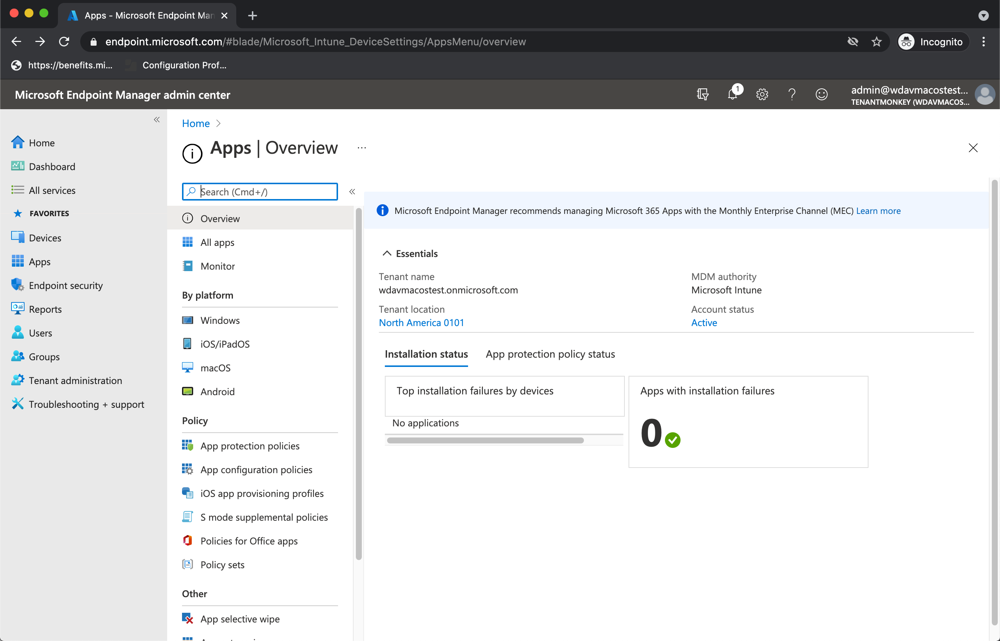

# <a name="intune-based-deployment-for-microsoft-defender-for-endpoint-on-macos"></a>MacOS의 끝점용 Microsoft Defender용 Intune 기반 배포

[!INCLUDE [Microsoft 365 Defender rebranding](../../includes/microsoft-defender.md)]

**적용 대상:**

- [Microsoft Defender for Endpoint(macOS용)](microsoft-defender-endpoint-mac.md)

이 항목에서는 Intune을 통해 macOS에서 끝점용 Microsoft Defender를 배포하는 방법을 설명합니다. 배포를 성공적으로 수행하려면 다음 단계를 모두 완료해야 합니다.

1. [온보더링 패키지 다운로드](#download-the-onboarding-package)
1. [클라이언트 장치 설정](#client-device-setup)
1. [시스템 확장 승인](#approve-system-extensions)
1. [시스템 구성 프로필 만들기](#create-system-configuration-profiles)
1. [응용 프로그램 게시](#publish-application)

## <a name="prerequisites-and-system-requirements"></a>선행 조건 및 시스템 요구 사항

시작하기 전에 [MacOS의 주 Microsoft Defender for Endpoint](microsoft-defender-endpoint-mac.md) 페이지에서 현재 소프트웨어 버전에 대한 선행 조건 및 시스템 요구 사항에 대한 설명을 참조하세요.

## <a name="overview"></a>개요

다음 표에는 Intune을 통해 Mac에서 끝점용 Microsoft Defender를 배포하고 관리하는 데 필요한 단계가 요약됩니다. 자세한 단계는 아래에서 사용할 수 있습니다.

<br>

****

|단계|예제 파일 이름|BundleIdentifier|
|---|---|---|
|[온보더링 패키지 다운로드](#download-the-onboarding-package)|WindowsDefenderATPOnboarding__MDATP_wdav.atp.xml|com.microsoft.wdav.atp|
|[끝점에 대한 Microsoft Defender에 대한 시스템 확장 승인](#approve-system-extensions)|MDATP_SysExt.xml|해당 없음|
|[끝점용 Microsoft Defender에 대한 커널 확장 승인](#download-the-onboarding-package)|MDATP_KExt.xml|해당 없음|
|[끝점용 Microsoft Defender에 대한 전체 디스크 액세스 권한 부여](#full-disk-access)|MDATP_tcc_Catalina_or_newer.xml|com.microsoft.wdav.tcc|
|[네트워크 확장 정책](#network-filter)|MDATP_NetExt.xml|해당 없음|
|[MAU(Microsoft 자동 업데이트) 구성](mac-updates.md#intune)|MDATP_Microsoft_AutoUpdate.xml|com.microsoft.autoupdate2|
|[끝점 구성 설정용 Microsoft Defender](mac-preferences.md#intune-full-profile) <p> **참고:** macOS용 타사 AV를 실행하고자 하는 경우 로 `passiveMode` `true` 설정됩니다.|MDATP_WDAV_and_exclusion_settings_Preferences.xml|com.microsoft.wdav|
|[끝점 및 MS 자동 업데이트(MAU) 알림에 대해 Microsoft Defender 구성](mac-updates.md)|MDATP_MDAV_Tray_and_AutoUpdate2.mobileconfig|com.microsoft.autoupdate2 또는 com.microsoft.wdav.tray|
|

## <a name="download-the-onboarding-package"></a>온보더링 패키지 다운로드

다음 포털에서 온보 Microsoft 365 Defender 다운로드합니다.

1. Microsoft 365 Defender 포털에서 **끝점 설정** 관리 온보더링으로 \>  \>  \> **이동하세요.**

2. 운영 체제를 **macOS로** 설정하고 배포 방법을 모바일 장치 관리 **/Microsoft Intune.**

    

3. **온보더링 패키지 다운로드를 선택합니다.** 동일한 _디렉터리에_ WindowsDefenderATPOnboardingPackage.zip저장합니다.

4. 파일 콘텐츠의 .zip 추출합니다.

    ```bash
    unzip WindowsDefenderATPOnboardingPackage.zip
    ```

    ```Output
    Archive:  WindowsDefenderATPOnboardingPackage.zip
    warning:  WindowsDefenderATPOnboardingPackage.zip appears to use backslashes as path separators
      inflating: intune/kext.xml
      inflating: intune/WindowsDefenderATPOnboarding.xml
      inflating: jamf/WindowsDefenderATPOnboarding.plist
    ```

## <a name="create-system-configuration-profiles"></a>시스템 구성 프로필 만들기

다음 단계는 끝점용 Microsoft Defender에 필요한 시스템 구성 프로필을 만드는 것입니다.
Microsoft Endpoint Manager [관리 센터에서](https://endpoint.microsoft.com/)장치 구성  \> **프로필 을 열 수 있습니다.**

### <a name="onboarding-blob"></a>온보더링 Blob

이 프로필에는 사용이 허가되지 않았다고 보고하지 않고 끝점용 Microsoft Defender에 대한 라이선스 정보가 포함되어 있습니다.

1. 구성 **프로필에서** **프로필 만들기를 선택합니다.**
1. 플랫폼  = **macOS,** **프로필 유형** = **템플릿을 선택합니다.** **서식 파일 이름** = **사용자 지정**. **만들기** 를 클릭합니다.

    > [!div class="mx-imgBorder"]
    > 

1. 프로필의 이름(예: "Defender 또는 MacOS용 끝점 온보딩")을 선택하세요. **다음** 을 클릭합니다.

    > [!div class="mx-imgBorder"]
    > 

1. 구성 프로필 이름(예: "MacOS용 끝점용 Defender 온보딩용 Defender")을 선택하세요.
1. 위 온보드 패키지에서 추출한 intune/WindowsDefenderATPOnboarding.xml 프로필 파일로 선택합니다.

    > [!div class="mx-imgBorder"]
    > 

1. **다음** 을 클릭합니다.
1. 할당 탭에서 **디바이스를 할당합니다.** 다음 을 **클릭합니다.**

    > [!div class="mx-imgBorder"]
    > 

1. 검토 및 **만들기.**
1. 장치 **구성** 프로필을 \> **열면** 생성된 프로필을 볼 수 있습니다.

    > [!div class="mx-imgBorder"]
    > 

### <a name="approve-system-extensions"></a>시스템 확장 승인

이 프로필은 macOS 10.15(카탈리나) 이상에 필요합니다. 이전 macOS에서는 무시됩니다.

1. 구성 **프로필에서** **프로필 만들기를 선택합니다.**
1. 플랫폼  = **macOS,** **프로필 유형** = **템플릿을 선택합니다.** **서식 파일 이름** = **확장.** **만들기** 를 클릭합니다.
1. 기본 **탭에서** 이 새 프로필에 이름을 지정합니다.
1. 구성 **설정 탭에서** 시스템 확장을 **확장하고** 허용되는 시스템 확장 섹션에 다음 **항목을 추가합니다.**

    |번들 식별자|팀 식별자|
    |---|---|
    |com.microsoft.wdav.epsext|UBF8T346G9|
    |com.microsoft.wdav.netext|UBF8T346G9|

    > [!div class="mx-imgBorder"]
    > 

1. 할당 **탭에서** 이 프로필을 모든 사용자 및 모든 & **할당합니다.**
1. 이 구성 프로필을 검토하고 만들 수 있습니다.

### <a name="kernel-extensions"></a>커널 확장

이 프로필은 macOS 10.15(카탈로니아) 이상에 필요합니다. 새로운 macOS에서는 무시됩니다.

> [!CAUTION]
> Apple 실리콘(M1) 장치는 KEXT를 지원하지 않습니다. 이러한 장치에서는 KEXT 정책으로 구성된 구성 프로필을 설치하지 못합니다.

1. 구성 **프로필에서** **프로필 만들기를 선택합니다.**
1. 플랫폼  = **macOS,** **프로필 유형** = **템플릿을 선택합니다.** **서식 파일 이름** = **확장.** **만들기** 를 클릭합니다.
1. 기본 **탭에서** 이 새 프로필에 이름을 지정합니다.
1. 구성 **설정 탭에서** 커널 **확장을 확장합니다.**
1. 팀 **식별자를** **UBF8T346G9로** 설정하고 다음 을 **클릭합니다.**

    > [!div class="mx-imgBorder"]
    > 

1. 할당 **탭에서** 이 프로필을 모든 사용자 및 모든 & **할당합니다.**
1. 이 구성 프로필을 검토하고 만들 수 있습니다.

### <a name="full-disk-access"></a>전체 디스크 액세스

   > [!CAUTION]
   > macOS 10.15(카탈로니아)에는 새로운 보안 및 개인 정보 보호 향상 기능이 포함되어 있습니다. 이 버전부터 응용 프로그램은 기본적으로 명시적 동의 없이 디스크의 특정 위치(예: 문서, 다운로드, 데스크톱 등)에 액세스할 수 없습니다. 이 동의가 없는 경우 끝점용 Microsoft Defender는 장치를 완전히 보호할 수 없습니다.
   >
   > 이 구성 프로필은 끝점용 Microsoft Defender에 대한 모든 디스크 액세스 권한을 부여합니다. Intune을 통해 이전에 Endpoint용 Microsoft Defender를 구성한 경우 이 구성 프로필을 사용하여 배포를 업데이트하는 것이 좋습니다.

GitHub 리포지토리에서 [**fulldisk.mobileconfig를**](https://raw.githubusercontent.com/microsoft/mdatp-xplat/master/macos/mobileconfig/profiles/fulldisk.mobileconfig) [다운로드합니다.](https://github.com/microsoft/mdatp-xplat/tree/master/macos/mobileconfig/profiles)

"Endpoint Full Disk Access용 Defender"를 프로필 이름으로 사용하고 구성 프로필 이름으로 **fulldisk.mobileconfig를** 다운로드하여 위의 [Blob을](#onboarding-blob) 온보딩하기 위한 지침을 따릅니다.

### <a name="network-filter"></a>네트워크 필터

끝점 검색 및 응답 기능의 일부로 macOS의 끝점용 Microsoft Defender는 소켓 트래픽을 검사하고 이 정보를 Microsoft 365 Defender 포털에 보고합니다. 다음 정책은 네트워크 확장에서 이 기능을 수행할 수 있습니다.

GitHub 저장소에서 [**netfilter.mobileconfig를**](https://raw.githubusercontent.com/microsoft/mdatp-xplat/master/macos/mobileconfig/profiles/netfilter.mobileconfig) [다운로드합니다.](https://github.com/microsoft/mdatp-xplat/tree/master/macos/mobileconfig/profiles)

"Endpoint 네트워크 필터용 Defender"를 프로필 이름으로 사용하고 구성 프로필 이름으로 **netfilter.mobileconfig를** 다운로드하여 위의 [Blob을](#onboarding-blob) 온보딩하기 위한 지침을 따릅니다.

### <a name="notifications"></a>알림

이 프로필은 MacOS의 끝점용 Microsoft Defender 및 Microsoft 자동 업데이트에서 macOS 10.15(카탈로니아) 이상에서 UI에 알림을 표시할 수 있도록 하는 데 사용됩니다.

GitHub 리포지토리에서 [notif.mobileconfig를 다운로드합니다.](https://github.com/microsoft/mdatp-xplat/tree/master/macos/mobileconfig/profiles) [](https://raw.githubusercontent.com/microsoft/mdatp-xplat/master/macos/mobileconfig/profiles/notif.mobileconfig)

"Endpoint 알림용 Defender"를 프로필 이름으로 사용하고 구성 프로필 이름으로 **notif.mobileconfig를** 다운로드하여 위의 온보딩 [Blob에](#onboarding-blob) 대한 지침을 따릅니다.

### <a name="view-status"></a>상태 보기

Intune 변경 내용이 등록된 장치로 전파된 후 장치 상태  모니터링에 나열된 내용을 볼 \> **수 있습니다.**

> [!div class="mx-imgBorder"]
> 

## <a name="publish-application"></a>응용 프로그램 게시

이 단계를 통해 등록된 컴퓨터로 끝점용 Microsoft Defender를 배포할 수 있습니다.

1. Microsoft Endpoint Manager [관리 센터에서](https://endpoint.microsoft.com/)앱을 **열 수 있습니다.**

    > [!div class="mx-imgBorder"]
    > 

1. 플랫폼에서 macOS > 추가를 > 선택합니다.
1. 앱 **유형** = **macOS를 선택하고** 선택을 **클릭합니다.**

    > [!div class="mx-imgBorder"]
    > 

1. 기본값을 유지하고 다음 을 **클릭합니다.**

    > [!div class="mx-imgBorder"]
    > 

1. 배정을 추가하고 다음 을 **클릭합니다.**

    > [!div class="mx-imgBorder"]
    > 

1. 검토 및 **만들기.**
1. 플랫폼  \>  \> **macOS에서** 앱을 방문하여 모든 응용 프로그램 목록에서 볼 수 있습니다.

    > [!div class="mx-imgBorder"]
    > 

(Defender 배포에 대한 [Intune의](/mem/intune/apps/apps-advanced-threat-protection-macos)페이지에서 자세한 정보를 찾을 수 있습니다.)

   > [!CAUTION]
   > 위에서 설명한 대로 필요한 구성 프로필을 모두 만들어 모든 컴퓨터로 푸시해야 합니다.

## <a name="client-device-setup"></a>클라이언트 장치 설정

표준 장치 설치 이상으로 Mac 디바이스에 대한 특별한 [프로비저닝이 회사 포털 없습니다.](/intune-user-help/enroll-your-device-in-intune-macos-cp)

1. 장치 관리를 확인합니다.

    > [!div class="mx-imgBorder"]
    > 

    시스템 **기본 설정 열기** 를 선택하고 목록에서 **관리** 프로필을 찾은 다음 **승인... 을 선택합니다.** 관리 프로필이 확인된 **것으로 표시됩니다.**

    

2. **계속을** 선택하고 등록을 완료합니다.

   이제 더 많은 장치를 등록할 수 있습니다. 시스템 구성 및 응용 프로그램 패키지 프로비전을 완료한 후 나중에 등록할 수도 있습니다.

3. Intune에서 장치  모든 \> **장치 관리를** 열 수 \> **있습니다.** 여기에 나열된 장치 중 디바이스를 볼 수 있습니다.

   > [!div class="mx-imgBorder"]
   > 

## <a name="verify-client-device-state"></a>클라이언트 장치 상태 확인

1. 구성 프로필을 장치에 배포한 후 Mac 장치에서 **시스템** 기본 설정 \>  프로필을 여는 방법을 확인합니다.

    > [!div class="mx-imgBorder"]
    > 

    

2. 다음 구성 프로필이 존재하고 설치되어 있는지 확인합니다. 관리 **프로필은** Intune 시스템 프로필입니다. _Wdav-config_ 및 _wdav-kext는_ Intune에 추가된 시스템 구성 프로필입니다.

    

3. 오른쪽 위 모서리에 끝점용 Microsoft Defender 아이콘도 표시됩니다.

    > [!div class="mx-imgBorder"]
    > 

## <a name="troubleshooting"></a>문제 해결

문제: 라이선스를 찾을 수 없습니다.

해결 방법: 위의 단계에 따라 사용자 계정을 사용하여 장치 프로필을 WindowsDefenderATPOnboarding.xml.

## <a name="logging-installation-issues"></a>로깅 설치 문제

오류가 발생할 때 설치 관리자에서 자동으로 생성된 로그를 찾는 방법에 대한 자세한 내용은 로깅 설치 [문제 를 참조하세요.](mac-resources.md#logging-installation-issues)

## <a name="uninstallation"></a>제거

클라이언트 [장치에서](mac-resources.md#uninstalling) macOS에서 끝점용 Microsoft Defender를 제거하는 방법에 대한 자세한 내용은 제거를 참조합니다.
