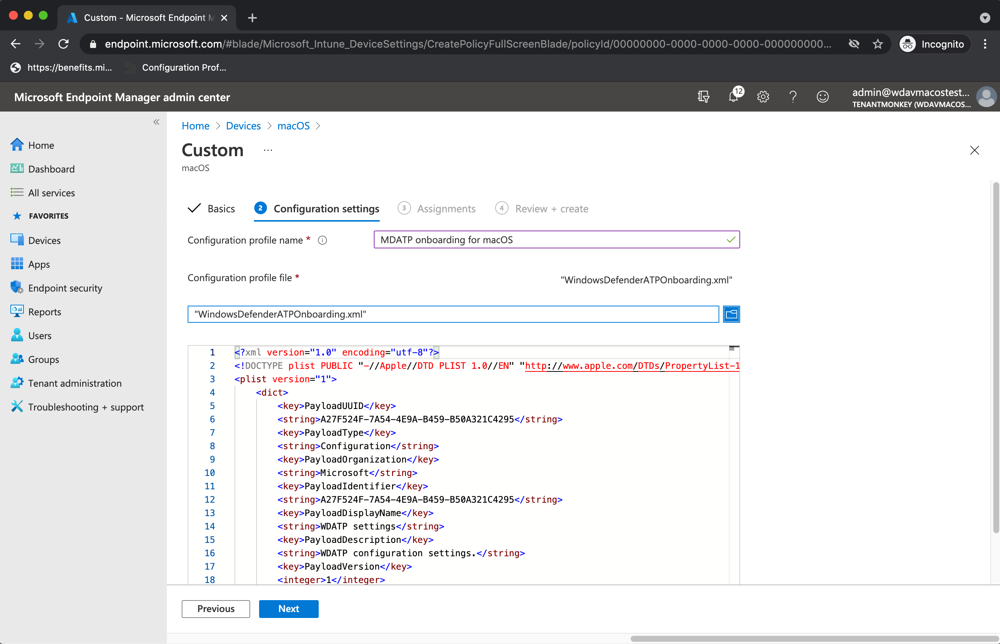

# <a name="intune-based-deployment-for-microsoft-defender-for-endpoint-on-macos"></a>MacOS의 끝점용 Microsoft Defender용 Intune 기반 배포


[!INCLUDE [Microsoft 365 Defender rebranding](../../includes/microsoft-defender.md)]


> [!NOTE]
> 이 설명서에서는 macOS 장치에서 끝점용 Microsoft Defender를 배포하고 구성하는 레거시 방법에 대해 설명하고 있습니다. 이제 MEM 콘솔에서 기본 환경을 사용할 수 있습니다. MEM 콘솔의 기본 UI 릴리스는 관리자에게 응용 프로그램을 구성 및 배포하고 macOS 장치로 보내는 훨씬 간단한 방법을 제공합니다. <br> <br>
>블로그 게시물 [MEM은 MacOS용 끝점용 Microsoft Defender](https://techcommunity.microsoft.com/t5/microsoft-endpoint-manager-blog/microsoft-endpoint-manager-simplifies-deployment-of-microsoft/ba-p/1322995) 배포를 간소화합니다. 앱을 구성하려면 Microsoft [InTune에서 macOS의 끝점용 Microsoft Defender 설정으로 이동합니다.](https://docs.microsoft.com/mem/intune/protect/antivirus-microsoft-defender-settings-macos) 앱을 배포하기 위해 [Microsoft Intune을 사용하여 MacOS 장치에 끝점용 Microsoft Defender 추가로 이동하세요.](https://docs.microsoft.com/mem/intune/apps/apps-advanced-threat-protection-macos)

**적용 대상:**

- [Microsoft Defender for Endpoint(macOS용)](microsoft-defender-endpoint-mac.md)

이 항목에서는 Intune을 통해 macOS에서 끝점용 Microsoft Defender를 배포하는 방법을 설명합니다. 배포를 성공적으로 수행하려면 다음 단계를 모두 완료해야 합니다.

1. [설치 및 온보더링 패키지 다운로드](#download-installation-and-onboarding-packages)
1. [클라이언트 장치 설정](#client-device-setup)
1. [시스템 확장 승인](#approve-system-extensions)
1. [시스템 구성 프로필 만들기](#create-system-configuration-profiles)
1. [응용 프로그램 게시](#publish-application)

## <a name="prerequisites-and-system-requirements"></a>선행 조건 및 시스템 요구 사항

시작하기 전에 [MacOS의 주 Microsoft Defender for Endpoint](microsoft-defender-endpoint-mac.md) 페이지에서 현재 소프트웨어 버전에 대한 선행 조건 및 시스템 요구 사항에 대한 설명을 참조하세요.


## <a name="overview"></a>개요

다음 표에는 Intune을 통해 Mac에서 끝점용 Microsoft Defender를 배포하고 관리하는 데 필요한 단계가 요약됩니다. 자세한 단계는 아래에서 사용할 수 있습니다.

| 단계 | 예제 파일 이름 | BundleIdentifier |
|-|-|-|
| [설치 및 온보더링 패키지 다운로드](#download-installation-and-onboarding-packages) | WindowsDefenderATPOnboarding__MDATP_wdav.atp.xml | com.microsoft.wdav.atp |
| [끝점에 대한 Microsoft Defender에 대한 시스템 확장 승인](#approve-system-extensions) | MDATP_SysExt.xml | 해당 없음 |
| [끝점용 Microsoft Defender에 대한 커널 확장 승인](#download-installation-and-onboarding-packages) | MDATP_KExt.xml | 해당 없음 |
| [끝점용 Microsoft Defender에 대한 전체 디스크 액세스 권한 부여](#create-system-configuration-profiles-step-8) | MDATP_tcc_Catalina_or_newer.xml | com.microsoft.wdav.tcc |
| [네트워크 확장 정책](#create-system-configuration-profiles-step-9) | MDATP_NetExt.xml | 해당 없음 |
| [MAU(Microsoft 자동 업데이트) 구성](https://docs.microsoft.com/microsoft-365/security/defender-endpoint/mac-updates#intune) | MDATP_Microsoft_AutoUpdate.xml | com.microsoft.autoupdate2 |
| [끝점 구성 설정용 Microsoft Defender](https://docs.microsoft.com/microsoft-365/security/defender-endpoint/mac-preferences#intune-profile-1)<br/><br/> **참고:** macOS용 타사 AV를 실행하고자 하는 경우 로 `passiveMode` `true` 설정됩니다. | MDATP_WDAV_and_exclusion_settings_Preferences.xml | com.microsoft.wdav |
| [끝점 및 MS 자동 업데이트(MAU) 알림에 대해 Microsoft Defender 구성](#create-system-configuration-profiles-step-10) | MDATP_MDAV_Tray_and_AutoUpdate2.mobileconfig | com.microsoft.autoupdate2 또는 com.microsoft.wdav.tray |

## <a name="download-installation-and-onboarding-packages"></a>설치 및 온보더링 패키지 다운로드

Microsoft Defender 보안 센터에서 설치 및 온보딩 패키지를 다운로드합니다.

1. Microsoft Defender 보안 센터에서 설정 **장치** 관리  >    >  **온보딩으로 이동합니다.**

2. 운영 체제를 **macOS로** 설정하고 배포 방법을 모바일 장치 **관리/Microsoft Intune으로 설정**

    

3. 설치 **패키지 다운로드를 선택합니다.** 로컬 디렉터리에 _wdav.pkg로_ 저장합니다.

4. **온보더링 패키지 다운로드를 선택합니다.** 동일한 _디렉터리에_ WindowsDefenderATPOnboardingPackage.zip저장합니다.

5. 에서 **IntuneAppUtil을** 다운로드합니다. [https://docs.microsoft.com/intune/lob-apps-macos](https://docs.microsoft.com/intune/lob-apps-macos)

6. 명령 프롬프트에서 세 개의 파일이 있는지 확인해야 합니다.
  

    ```bash
    ls -l
    ```

    ```Output
    total 721688
    -rw-r--r--  1 test  staff     269280 Mar 15 11:25 IntuneAppUtil
    -rw-r--r--  1 test  staff      11821 Mar 15 09:23 WindowsDefenderATPOnboardingPackage.zip
    -rw-r--r--  1 test  staff  354531845 Mar 13 08:57 wdav.pkg
    ```
7. .zip 파일의 내용을 추출합니다.

    ```bash
    unzip WindowsDefenderATPOnboardingPackage.zip
    ```
    ```Output
    Archive:  WindowsDefenderATPOnboardingPackage.zip
    warning:  WindowsDefenderATPOnboardingPackage.zip appears to use backslashes as path separators
      inflating: intune/kext.xml
      inflating: intune/WindowsDefenderATPOnboarding.xml
      inflating: jamf/WindowsDefenderATPOnboarding.plist
    ```

8. IntuneAppUtil을 실행 가능으로 만들 수 있습니다.

    ```bash
    chmod +x IntuneAppUtil
    ```

9. wdav.pkg에서 wdav.pkg.intunemac 패키지를 만들 수 있습니다.

    ```bash
    ./IntuneAppUtil -c wdav.pkg -o . -i "com.microsoft.wdav" -n "1.0.0"
    ```
    ```Output
    Microsoft Intune Application Utility for Mac OS X
    Version: 1.0.0.0
    Copyright 2018 Microsoft Corporation

    Creating intunemac file for /Users/test/Downloads/wdav.pkg
    Composing the intunemac file output
    Output written to ./wdav.pkg.intunemac.

    IntuneAppUtil successfully processed "wdav.pkg",
    to deploy refer to the product documentation.
    ```

## <a name="client-device-setup"></a>클라이언트 장치 설정

표준 회사 포털 설치 이상으로 Mac 장치에 대한 특별한 프로비저닝이 [필요하지 않습니다.](https://docs.microsoft.com/intune-user-help/enroll-your-device-in-intune-macos-cp)

1. 장치 관리를 확인합니다.

   

    시스템 **기본 설정 열기** 를 선택하고 목록에서 **관리** 프로필을 찾은 다음 **승인... 을 선택합니다.** 관리 프로필이 확인된 **것으로 표시됩니다.**

    

2. **계속을** 선택하고 등록을 완료합니다.

   이제 더 많은 장치를 등록할 수 있습니다. 시스템 구성 및 응용 프로그램 패키지 프로비전을 완료한 후 나중에 등록할 수도 있습니다.

3. Intune에서 장치 모든  >  **장치 관리를** 열 수  >  **있습니다.** 여기에 나열된 장치 중 디바이스를 볼 수 있습니다.

   > [!div class="mx-imgBorder"]
   > 

## <a name="approve-system-extensions"></a>시스템 확장 승인

시스템 확장을 승인합니다.

1. Intune에서 장치 구성  >  **관리를 열고** 프로필 **만들기**  >  **를**  >  **선택합니다.**

2. 프로필 이름을 선택하세요. **Platform=macOS를** **프로필 유형=확장으로 변경합니다.** **만들기** 를 선택합니다.

3. 기본 **탭에서** 이 새 프로필에 이름을 지정합니다.

4. 구성 **설정 탭의** 허용되는 시스템 확장 섹션에 다음 **항목을 추가합니다.**

    번들 식별자         | 팀 식별자
    --------------------------|----------------
    com.microsoft.wdav.epsext | UBF8T346G9
    com.microsoft.wdav.netext | UBF8T346G9

    > [!div class="mx-imgBorder"]
    > 

5. 할당 **탭에서** 이 프로필을 모든 사용자 및 모든 & **할당합니다.**

6. 이 구성 프로필을 검토하고 만들 수 있습니다.

## <a name="create-system-configuration-profiles"></a>시스템 구성 프로필 만들기

1. Intune에서 장치 구성  >  **관리를 열고** 프로필 **만들기**  >  **를**  >  **선택합니다.**

2. 프로필 이름을 선택하세요. **Platform=macOS를** **프로필 유형=사용자 지정으로 변경합니다.** 구성을 **선택합니다.**

3. 구성 프로필을 열고 intune/kext.xml. 이 파일은 이전 섹션 중 하나에서 만들어졌습니다.

4. **확인** 을 선택합니다.

    

5. 배정   >  **관리를 선택합니다.** 포함 **탭에서** 모든 사용자 및 모든 & **할당을 선택합니다.**

6. 프로필을 더 추가하려면 1-5단계를 반복합니다.

7. 다른 프로필을 만들고 이름을 지정한 다음 intune/WindowsDefenderATPOnboarding.xml 업로드합니다.

8. [GitHub](https://raw.githubusercontent.com/microsoft/mdatp-xplat/master/macos/mobileconfig/profiles/fulldisk.mobileconfig) 리포지토리에서 **fulldisk.mobileconfig를** 다운로드하고 에서 으로 **tcc.xml.** 다른 프로필을 만들고 이름을 지정하고 이 파일을 해당 프로필에 업로드합니다.<a name="create-system-configuration-profiles-step-8" id = "create-system-configuration-profiles-step-8"></a>

   > [!CAUTION]
   > macOS 10.15(카탈로니아)에는 새로운 보안 및 개인 정보 보호 향상 기능이 포함되어 있습니다. 이 버전부터 응용 프로그램은 기본적으로 명시적 동의 없이 디스크의 특정 위치(예: 문서, 다운로드, 데스크톱 등)에 액세스할 수 없습니다. 이 동의가 없는 경우 끝점용 Microsoft Defender는 장치를 완전히 보호할 수 없습니다.
   >
   > 이 구성 프로필은 끝점용 Microsoft Defender에 대한 모든 디스크 액세스 권한을 부여합니다. Intune을 통해 이전에 Endpoint용 Microsoft Defender를 구성한 경우 이 구성 프로필을 사용하여 배포를 업데이트하는 것이 좋습니다.

9. 끝점 감지 및 응답 기능의 일부로 macOS의 끝점용 Microsoft Defender는 소켓 트래픽을 검사하고 이 정보를 Microsoft Defender 보안 센터 포털에 보고합니다. 다음 정책은 네트워크 확장에서 이 기능을 수행할 수 있습니다. [GitHub](https://raw.githubusercontent.com/microsoft/mdatp-xplat/master/macos/mobileconfig/profiles/netfilter.mobileconfig)리포지토리에서 **netfilter.mobileconfig를** 다운로드하여 netext.xml 저장하고 이전 섹션과 동일한 단계를 사용하여 배포합니다. <a name = "create-system-configuration-profiles-step-9" id = "create-system-configuration-profiles-step-9"></a>

10. MacOS 및 Microsoft 자동 업데이트에서 MacOS 10.15(카탈로니아)의 UI에 알림을 표시하도록 Microsoft Defender를 허용하려면 GitHub 리포지토리에서 다운로드하여 사용자 지정 페이로드로 `notif.mobileconfig` 가져와야 [](https://raw.githubusercontent.com/microsoft/mdatp-xplat/master/macos/mobileconfig/profiles/notif.mobileconfig) 합니다. <a name = "create-system-configuration-profiles-step-10" id = "create-system-configuration-profiles-step-10"></a>

11. 배정 **관리 > 선택합니다.**  포함 **탭에서** 모든 사용자 및 모든 & **할당을 선택합니다.**

Intune 변경 내용이 등록된 장치로 전파된 후 장치 상태 모니터링에 나열된 내용을 볼  >  **수 있습니다.**

> [!div class="mx-imgBorder"]
> 

## <a name="publish-application"></a>응용 프로그램 게시

1. Intune에서 Manage **> Client apps 블레이드를 열고** 추가를 **> 앱을 선택합니다.**

2. **앱 유형=기타/업무 앱 을 선택합니다.**

3. **file=wdav.pkg.intunemac를 선택합니다.** 확인을 **선택하여** 업로드합니다.

4. **구성을** 선택하고 필요한 정보를 추가합니다.

5. macOS **High Sierra 10.14를** 최소 OS로 사용

6. 앱 *버전 무시를* **예로 설정하세요.** 다른 설정은 임의의 값일 수 있습니다.

    > [!CAUTION]
    > 앱 *버전 무시를* **아니요로** 설정하면 응용 프로그램이 Microsoft 자동 업데이트를 통해 업데이트를 받을 수 있는 능력이 영향을 받지 않습니다. 제품 업데이트 방법에 대한 자세한 내용은 [MacOS에서 끝점용 Microsoft Defender](mac-updates.md) 업데이트 배포를 참조하세요.
    >
    > Intune에서 업로드한 버전이 디바이스의 버전보다 낮을 경우 더 낮은 버전이 설치됩니다. 그러면 끝점용 Microsoft Defender가 다운그레이딩됩니다. 이로 인해 응용 프로그램이 작동하지 않는 것일 수 있습니다. 제품 업데이트 방법에 대한 자세한 내용은 [MacOS에서 끝점용 Microsoft Defender](mac-updates.md) 업데이트 배포를 참조하세요. 앱 버전 무시를 아니요로  설정하여 끝점용 Microsoft Defender를 배포한 경우 **를** 예로 **변경하세요.** 끝점용 Microsoft Defender를 클라이언트 장치에 설치할 수 없는 경우 끝점용 Microsoft Defender를 제거하고 업데이트된 정책을 적용합니다.
     
    > [!div class="mx-imgBorder"]
    > 

7. 확인을 **선택하고** **추가를 선택합니다.**

    > [!div class="mx-imgBorder"]
    > 

8. 패키지를 업로드하는 데 몇 분 정도 걸릴 수 있습니다. 완료된 후 목록에서 패키지를 선택하고 **과제** 및 그룹 **추가 로 이동하세요.**

    > [!div class="mx-imgBorder"]
    > 

9. 배정 **유형을 필수로** **변경합니다.**

10. 포함된 **그룹을 선택합니다.** 모든 **디바이스에 이 앱을 필수로 만들기=예 를 선택합니다.** 그룹 **선택을 선택하여** 대상을 지정하려는 사용자가 포함된 그룹을 포함하고 추가합니다. 확인 **및** **저장을 선택합니다.**

    > [!div class="mx-imgBorder"]
    > 

11. 시간이 지난 후 응용 프로그램이 등록된 모든 장치에 게시됩니다. 장치 모니터링 에 나열된  >  **장치** 설치 **상태 아래에서 볼 수 있습니다.**

    > [!div class="mx-imgBorder"]
    > 

## <a name="verify-client-device-state"></a>클라이언트 장치 상태 확인

1. 구성 프로필을 장치에 배포한 후 Mac 장치에서 **시스템** 기본 설정  >   프로필을 여는 방법을 확인합니다.

    <br/>
    

2. 다음 구성 프로필이 존재하고 설치되어 있는지 확인합니다. 관리 **프로필은** Intune 시스템 프로필입니다. _Wdav-config_ 및 _wdav-kext는_ Intune: 프로필 스크린샷에 추가된 시스템 구성 

3. 오른쪽 위에 Microsoft Defender 아이콘도 표시됩니다.

    > [!div class="mx-imgBorder"]
    > 

## <a name="troubleshooting"></a>문제 해결

문제: 라이선스를 찾을 수 없음

해결 방법: 위의 단계에 따라 장치를 사용하여 장치 프로필을 WindowsDefenderATPOnboarding.xml

## <a name="logging-installation-issues"></a>로깅 설치 문제

오류가 발생할 때 설치 관리자에서 자동으로 생성된 로그를 찾는 방법에 대한 자세한 내용은 로깅 설치 [문제 를 참조하세요.](mac-resources.md#logging-installation-issues)

## <a name="uninstallation"></a>제거

클라이언트 [장치에서](mac-resources.md#uninstalling) macOS에서 끝점용 Microsoft Defender를 제거하는 방법에 대한 자세한 내용은 제거를 참조합니다.
