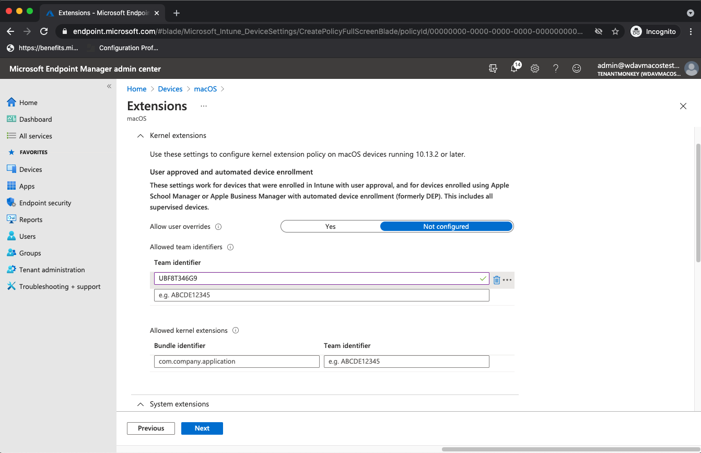

# <a name="intune-based-deployment-for-microsoft-defender-for-endpoint-on-macos"></a><span data-ttu-id="6b79e-104">MacOS의 끝점용 Microsoft Defender용 Intune 기반 배포</span><span class="sxs-lookup"><span data-stu-id="6b79e-104">Intune-based deployment for Microsoft Defender for Endpoint on macOS</span></span>

[!INCLUDE [Microsoft 365 Defender rebranding](../../includes/microsoft-defender.md)]

<span data-ttu-id="6b79e-105">**적용 대상:**</span><span class="sxs-lookup"><span data-stu-id="6b79e-105">**Applies to:**</span></span>

- [<span data-ttu-id="6b79e-106">Microsoft Defender for Endpoint(macOS용)</span><span class="sxs-lookup"><span data-stu-id="6b79e-106">Microsoft Defender for Endpoint on macOS</span></span>](microsoft-defender-endpoint-mac.md)

<span data-ttu-id="6b79e-107">이 항목에서는 Intune을 통해 macOS에서 끝점용 Microsoft Defender를 배포하는 방법을 설명합니다.</span><span class="sxs-lookup"><span data-stu-id="6b79e-107">This topic describes how to deploy Microsoft Defender for Endpoint on macOS through Intune.</span></span> <span data-ttu-id="6b79e-108">배포를 성공적으로 수행하려면 다음 단계를 모두 완료해야 합니다.</span><span class="sxs-lookup"><span data-stu-id="6b79e-108">A successful deployment requires the completion of all of the following steps:</span></span>

1. [<span data-ttu-id="6b79e-109">온보더링 패키지 다운로드</span><span class="sxs-lookup"><span data-stu-id="6b79e-109">Download the onboarding package</span></span>](#download-the-onboarding-package)
1. [<span data-ttu-id="6b79e-110">클라이언트 장치 설정</span><span class="sxs-lookup"><span data-stu-id="6b79e-110">Client device setup</span></span>](#client-device-setup)
1. [<span data-ttu-id="6b79e-111">시스템 확장 승인</span><span class="sxs-lookup"><span data-stu-id="6b79e-111">Approve system extensions</span></span>](#approve-system-extensions)
1. [<span data-ttu-id="6b79e-112">시스템 구성 프로필 만들기</span><span class="sxs-lookup"><span data-stu-id="6b79e-112">Create System Configuration profiles</span></span>](#create-system-configuration-profiles)
1. [<span data-ttu-id="6b79e-113">응용 프로그램 게시</span><span class="sxs-lookup"><span data-stu-id="6b79e-113">Publish application</span></span>](#publish-application)

## <a name="prerequisites-and-system-requirements"></a><span data-ttu-id="6b79e-114">선행 조건 및 시스템 요구 사항</span><span class="sxs-lookup"><span data-stu-id="6b79e-114">Prerequisites and system requirements</span></span>

<span data-ttu-id="6b79e-115">시작하기 전에 [MacOS의 주 Microsoft Defender for Endpoint](microsoft-defender-endpoint-mac.md) 페이지에서 현재 소프트웨어 버전에 대한 선행 조건 및 시스템 요구 사항에 대한 설명을 참조하세요.</span><span class="sxs-lookup"><span data-stu-id="6b79e-115">Before you get started, see [the main Microsoft Defender for Endpoint on macOS page](microsoft-defender-endpoint-mac.md) for a description of prerequisites and system requirements for the current software version.</span></span>

## <a name="overview"></a><span data-ttu-id="6b79e-116">개요</span><span class="sxs-lookup"><span data-stu-id="6b79e-116">Overview</span></span>

<span data-ttu-id="6b79e-117">다음 표에는 Intune을 통해 Mac에서 끝점용 Microsoft Defender를 배포하고 관리하는 데 필요한 단계가 요약됩니다.</span><span class="sxs-lookup"><span data-stu-id="6b79e-117">The following table summarizes the steps you would need to take to deploy and manage Microsoft Defender for Endpoint on Macs, via Intune.</span></span> <span data-ttu-id="6b79e-118">자세한 단계는 아래에서 사용할 수 있습니다.</span><span class="sxs-lookup"><span data-stu-id="6b79e-118">More detailed steps are available below.</span></span>

| <span data-ttu-id="6b79e-119">단계</span><span class="sxs-lookup"><span data-stu-id="6b79e-119">Step</span></span> | <span data-ttu-id="6b79e-120">예제 파일 이름</span><span class="sxs-lookup"><span data-stu-id="6b79e-120">Sample file names</span></span> | <span data-ttu-id="6b79e-121">BundleIdentifier</span><span class="sxs-lookup"><span data-stu-id="6b79e-121">BundleIdentifier</span></span> |
|-|-|-|
| [<span data-ttu-id="6b79e-122">온보더링 패키지 다운로드</span><span class="sxs-lookup"><span data-stu-id="6b79e-122">Download the onboarding package</span></span>](#download-the-onboarding-package) | <span data-ttu-id="6b79e-123">WindowsDefenderATPOnboarding__MDATP_wdav.atp.xml</span><span class="sxs-lookup"><span data-stu-id="6b79e-123">WindowsDefenderATPOnboarding__MDATP_wdav.atp.xml</span></span> | <span data-ttu-id="6b79e-124">com.microsoft.wdav.atp</span><span class="sxs-lookup"><span data-stu-id="6b79e-124">com.microsoft.wdav.atp</span></span> |
| [<span data-ttu-id="6b79e-125">끝점에 대한 Microsoft Defender에 대한 시스템 확장 승인</span><span class="sxs-lookup"><span data-stu-id="6b79e-125">Approve System Extension for Microsoft Defender for Endpoint</span></span>](#approve-system-extensions) | <span data-ttu-id="6b79e-126">MDATP_SysExt.xml</span><span class="sxs-lookup"><span data-stu-id="6b79e-126">MDATP_SysExt.xml</span></span> | <span data-ttu-id="6b79e-127">해당 없음</span><span class="sxs-lookup"><span data-stu-id="6b79e-127">N/A</span></span> |
| [<span data-ttu-id="6b79e-128">끝점용 Microsoft Defender에 대한 커널 확장 승인</span><span class="sxs-lookup"><span data-stu-id="6b79e-128">Approve Kernel Extension for Microsoft Defender for Endpoint</span></span>](#download-the-onboarding-package) | <span data-ttu-id="6b79e-129">MDATP_KExt.xml</span><span class="sxs-lookup"><span data-stu-id="6b79e-129">MDATP_KExt.xml</span></span> | <span data-ttu-id="6b79e-130">해당 없음</span><span class="sxs-lookup"><span data-stu-id="6b79e-130">N/A</span></span> |
| [<span data-ttu-id="6b79e-131">끝점용 Microsoft Defender에 대한 전체 디스크 액세스 권한 부여</span><span class="sxs-lookup"><span data-stu-id="6b79e-131">Grant full disk access to Microsoft Defender for Endpoint</span></span>](#full-disk-access) | <span data-ttu-id="6b79e-132">MDATP_tcc_Catalina_or_newer.xml</span><span class="sxs-lookup"><span data-stu-id="6b79e-132">MDATP_tcc_Catalina_or_newer.xml</span></span> | <span data-ttu-id="6b79e-133">com.microsoft.wdav.tcc</span><span class="sxs-lookup"><span data-stu-id="6b79e-133">com.microsoft.wdav.tcc</span></span> |
| [<span data-ttu-id="6b79e-134">네트워크 확장 정책</span><span class="sxs-lookup"><span data-stu-id="6b79e-134">Network Extension policy</span></span>](#network-filter) | <span data-ttu-id="6b79e-135">MDATP_NetExt.xml</span><span class="sxs-lookup"><span data-stu-id="6b79e-135">MDATP_NetExt.xml</span></span> | <span data-ttu-id="6b79e-136">해당 없음</span><span class="sxs-lookup"><span data-stu-id="6b79e-136">N/A</span></span> |
| [<span data-ttu-id="6b79e-137">MAU(Microsoft 자동 업데이트) 구성</span><span class="sxs-lookup"><span data-stu-id="6b79e-137">Configure Microsoft AutoUpdate (MAU)</span></span>](mac-updates.md#intune) | <span data-ttu-id="6b79e-138">MDATP_Microsoft_AutoUpdate.xml</span><span class="sxs-lookup"><span data-stu-id="6b79e-138">MDATP_Microsoft_AutoUpdate.xml</span></span> | <span data-ttu-id="6b79e-139">com.microsoft.autoupdate2</span><span class="sxs-lookup"><span data-stu-id="6b79e-139">com.microsoft.autoupdate2</span></span> |
| [<span data-ttu-id="6b79e-140">끝점 구성 설정용 Microsoft Defender</span><span class="sxs-lookup"><span data-stu-id="6b79e-140">Microsoft Defender for Endpoint configuration settings</span></span>](mac-preferences.md#intune-profile-1)<br/><br/> <span data-ttu-id="6b79e-141">**참고:** macOS용 타사 AV를 실행하고자 하는 경우 로 `passiveMode` `true` 설정됩니다.</span><span class="sxs-lookup"><span data-stu-id="6b79e-141">**Note:** If you're planning to run a third-party AV for macOS, set `passiveMode` to `true`.</span></span> | <span data-ttu-id="6b79e-142">MDATP_WDAV_and_exclusion_settings_Preferences.xml</span><span class="sxs-lookup"><span data-stu-id="6b79e-142">MDATP_WDAV_and_exclusion_settings_Preferences.xml</span></span> | <span data-ttu-id="6b79e-143">com.microsoft.wdav</span><span class="sxs-lookup"><span data-stu-id="6b79e-143">com.microsoft.wdav</span></span> |
| [<span data-ttu-id="6b79e-144">끝점 및 MS 자동 업데이트(MAU) 알림에 대해 Microsoft Defender 구성</span><span class="sxs-lookup"><span data-stu-id="6b79e-144">Configure Microsoft Defender for Endpoint and MS AutoUpdate (MAU) notifications</span></span>](mac-updates.md) | <span data-ttu-id="6b79e-145">MDATP_MDAV_Tray_and_AutoUpdate2.mobileconfig</span><span class="sxs-lookup"><span data-stu-id="6b79e-145">MDATP_MDAV_Tray_and_AutoUpdate2.mobileconfig</span></span> | <span data-ttu-id="6b79e-146">com.microsoft.autoupdate2 또는 com.microsoft.wdav.tray</span><span class="sxs-lookup"><span data-stu-id="6b79e-146">com.microsoft.autoupdate2 or com.microsoft.wdav.tray</span></span> |


## <a name="download-the-onboarding-package"></a><span data-ttu-id="6b79e-147">온보더링 패키지 다운로드</span><span class="sxs-lookup"><span data-stu-id="6b79e-147">Download the onboarding package</span></span>

<span data-ttu-id="6b79e-148">다음 사이트에서 온보더링 패키지를 Microsoft Defender 보안 센터.</span><span class="sxs-lookup"><span data-stu-id="6b79e-148">Download the onboarding packages from Microsoft Defender Security Center:</span></span>

1. <span data-ttu-id="6b79e-149">다음 Microsoft Defender 보안 센터 장치 관리 **온보** 설정  >  **로**  >  **이동하세요.**</span><span class="sxs-lookup"><span data-stu-id="6b79e-149">In Microsoft Defender Security Center, go to **Settings** > **Device Management** > **Onboarding**.</span></span>

2. <span data-ttu-id="6b79e-150">운영 체제를 **macOS로** 설정하고 배포 방법을 모바일 장치 관리 **/Microsoft Intune.**</span><span class="sxs-lookup"><span data-stu-id="6b79e-150">Set the operating system to **macOS** and the deployment method to **Mobile Device Management / Microsoft Intune**.</span></span>

    

3. <span data-ttu-id="6b79e-152">**온보더링 패키지 다운로드를 선택합니다.**</span><span class="sxs-lookup"><span data-stu-id="6b79e-152">Select **Download onboarding package**.</span></span> <span data-ttu-id="6b79e-153">동일한 _디렉터리에_ WindowsDefenderATPOnboardingPackage.zip저장합니다.</span><span class="sxs-lookup"><span data-stu-id="6b79e-153">Save it as _WindowsDefenderATPOnboardingPackage.zip_ to the same directory.</span></span>

4. <span data-ttu-id="6b79e-154">파일 콘텐츠의 .zip 추출합니다.</span><span class="sxs-lookup"><span data-stu-id="6b79e-154">Extract the contents of the .zip file:</span></span>

    ```bash
    unzip WindowsDefenderATPOnboardingPackage.zip
    ```
    ```Output
    Archive:  WindowsDefenderATPOnboardingPackage.zip
    warning:  WindowsDefenderATPOnboardingPackage.zip appears to use backslashes as path separators
      inflating: intune/kext.xml
      inflating: intune/WindowsDefenderATPOnboarding.xml
      inflating: jamf/WindowsDefenderATPOnboarding.plist
    ```

## <a name="create-system-configuration-profiles"></a><span data-ttu-id="6b79e-155">시스템 구성 프로필 만들기</span><span class="sxs-lookup"><span data-stu-id="6b79e-155">Create System Configuration profiles</span></span>

<span data-ttu-id="6b79e-156">다음 단계는 끝점용 Microsoft Defender에 필요한 시스템 구성 프로필을 만드는 것입니다.</span><span class="sxs-lookup"><span data-stu-id="6b79e-156">The next step is to create system configuration profiles that Microsoft Defender for Endpoint needs.</span></span>
<span data-ttu-id="6b79e-157">Microsoft Endpoint Manager [관리 센터에서](https://endpoint.microsoft.com/)장치 구성   >  **프로필 을 열 수 있습니다.**</span><span class="sxs-lookup"><span data-stu-id="6b79e-157">In the [Microsoft Endpoint Manager admin center](https://endpoint.microsoft.com/), open **Devices** > **Configuration profiles**.</span></span>

### <a name="onboarding-blob"></a><span data-ttu-id="6b79e-158">온보더링 Blob</span><span class="sxs-lookup"><span data-stu-id="6b79e-158">Onboarding blob</span></span>

<span data-ttu-id="6b79e-159">이 프로필에는 사용이 허가되지 않았다고 보고하지 않고 끝점용 Microsoft Defender에 대한 라이선스 정보가 포함되어 있습니다.</span><span class="sxs-lookup"><span data-stu-id="6b79e-159">This profile contains a license information for Microsoft Defender for Endpoint, without it it will report that it is not licensed.</span></span>

1. <span data-ttu-id="6b79e-160">구성 **프로필에서** **프로필 만들기를 선택합니다.**</span><span class="sxs-lookup"><span data-stu-id="6b79e-160">Select **Create Profile** under **Configuration Profiles**.</span></span>
1. <span data-ttu-id="6b79e-161">플랫폼  = **macOS,** **프로필 유형** = **템플릿을 선택합니다.**</span><span class="sxs-lookup"><span data-stu-id="6b79e-161">Select **Platform**=**macOS**, **Profile type**=**Templates**.</span></span> <span data-ttu-id="6b79e-162">**서식 파일 이름** = **사용자 지정**.</span><span class="sxs-lookup"><span data-stu-id="6b79e-162">**Template name**=**Custom**.</span></span> <span data-ttu-id="6b79e-163">**만들기** 를 클릭합니다.</span><span class="sxs-lookup"><span data-stu-id="6b79e-163">Click **Create**.</span></span>

    > [!div class="mx-imgBorder"]
    > <span data-ttu-id="6b79e-164"></span><span class="sxs-lookup"><span data-stu-id="6b79e-164"></span></span>

1. <span data-ttu-id="6b79e-165&quot;>프로필의 이름(예: &quot;macOS용 MDE 온보드")을 선택하세요.</span><span class="sxs-lookup"><span data-stu-id="6b79e-165">Choose a name for the profile, e.g., "MDE onboarding for macOS".</span></span> <span data-ttu-id="6b79e-166">**다음** 을 클릭합니다.</span><span class="sxs-lookup"><span data-stu-id="6b79e-166">Click **Next**.</span></span>

    > [!div class="mx-imgBorder"]
    > <span data-ttu-id="6b79e-167"></span><span class="sxs-lookup"><span data-stu-id="6b79e-167"></span></span>

1. <span data-ttu-id="6b79e-168&quot;>구성 프로필 이름(예: &quot;macOS용 MDE 온보드")을 선택하세요.</span><span class="sxs-lookup"><span data-stu-id="6b79e-168">Choose a name for the configuration profile name, e.g., "MDE onboarding for macOS".</span></span>
1. <span data-ttu-id="6b79e-169">위 온보드 패키지에서 추출한 intune/WindowsDefenderATPOnboarding.xml 프로필 파일로 선택합니다.</span><span class="sxs-lookup"><span data-stu-id="6b79e-169">Select intune/WindowsDefenderATPOnboarding.xml that you extracted from the onboarding package above as configuration profile file.</span></span>

    > [!div class="mx-imgBorder"]
    > <span data-ttu-id="6b79e-170"></span><span class="sxs-lookup"><span data-stu-id="6b79e-170"></span></span>

1. <span data-ttu-id="6b79e-171">**다음** 을 클릭합니다.</span><span class="sxs-lookup"><span data-stu-id="6b79e-171">Click **Next**.</span></span>
1. <span data-ttu-id="6b79e-172">할당 탭에서 **디바이스를 할당합니다.** 다음 을 **클릭합니다.**</span><span class="sxs-lookup"><span data-stu-id="6b79e-172">Assign devices on the **Assignment** tab. Click **Next**.</span></span>

    > [!div class="mx-imgBorder"]
    > <span data-ttu-id="6b79e-173"></span><span class="sxs-lookup"><span data-stu-id="6b79e-173"></span></span>

1. <span data-ttu-id="6b79e-174">검토 및 **만들기.**</span><span class="sxs-lookup"><span data-stu-id="6b79e-174">Review and **Create**.</span></span>
1. <span data-ttu-id="6b79e-175">장치 **구성** 프로필을  >  **열면** 생성된 프로필을 볼 수 있습니다.</span><span class="sxs-lookup"><span data-stu-id="6b79e-175">Open **Devices** > **Configuration profiles**, you can see your created profile there.</span></span>

    > [!div class="mx-imgBorder"]
    > <span data-ttu-id="6b79e-176"></span><span class="sxs-lookup"><span data-stu-id="6b79e-176"></span></span>

### <a name="approve-system-extensions"></a><span data-ttu-id="6b79e-177">시스템 확장 승인</span><span class="sxs-lookup"><span data-stu-id="6b79e-177">Approve System Extensions</span></span>

<span data-ttu-id="6b79e-178">이 프로필은 macOS 10.15(카탈리나) 이상에 필요합니다.</span><span class="sxs-lookup"><span data-stu-id="6b79e-178">This profile is needed for macOS 10.15 (Catalina) or newer.</span></span> <span data-ttu-id="6b79e-179">이전 macOS에서는 무시됩니다.</span><span class="sxs-lookup"><span data-stu-id="6b79e-179">It will be ignored on older macOS.</span></span>

1. <span data-ttu-id="6b79e-180">구성 **프로필에서** **프로필 만들기를 선택합니다.**</span><span class="sxs-lookup"><span data-stu-id="6b79e-180">Select **Create Profile** under **Configuration Profiles**.</span></span>
1. <span data-ttu-id="6b79e-181">플랫폼  = **macOS,** **프로필 유형** = **템플릿을 선택합니다.**</span><span class="sxs-lookup"><span data-stu-id="6b79e-181">Select **Platform**=**macOS**, **Profile type**=**Templates**.</span></span> <span data-ttu-id="6b79e-182">**서식 파일 이름** = **확장.**</span><span class="sxs-lookup"><span data-stu-id="6b79e-182">**Template name**=**Extensions**.</span></span> <span data-ttu-id="6b79e-183">**만들기** 를 클릭합니다.</span><span class="sxs-lookup"><span data-stu-id="6b79e-183">Click **Create**.</span></span>
1. <span data-ttu-id="6b79e-184">기본 **탭에서** 이 새 프로필에 이름을 지정합니다.</span><span class="sxs-lookup"><span data-stu-id="6b79e-184">In the **Basics** tab, give a name to this new profile.</span></span>
1. <span data-ttu-id="6b79e-185">구성 **설정 탭에서** 시스템 확장을 **확장하고** 허용되는 시스템 확장 섹션에 다음 **항목을 추가합니다.**</span><span class="sxs-lookup"><span data-stu-id="6b79e-185">In the **Configuration settings** tab, expand **System Extensions** add the following entries in the **Allowed system extensions** section:</span></span>

    <span data-ttu-id="6b79e-186">번들 식별자</span><span class="sxs-lookup"><span data-stu-id="6b79e-186">Bundle identifier</span></span>         | <span data-ttu-id="6b79e-187">팀 식별자</span><span class="sxs-lookup"><span data-stu-id="6b79e-187">Team identifier</span></span>
    --------------------------|----------------
    <span data-ttu-id="6b79e-188">com.microsoft.wdav.epsext</span><span class="sxs-lookup"><span data-stu-id="6b79e-188">com.microsoft.wdav.epsext</span></span> | <span data-ttu-id="6b79e-189">UBF8T346G9</span><span class="sxs-lookup"><span data-stu-id="6b79e-189">UBF8T346G9</span></span>
    <span data-ttu-id="6b79e-190">com.microsoft.wdav.netext</span><span class="sxs-lookup"><span data-stu-id="6b79e-190">com.microsoft.wdav.netext</span></span> | <span data-ttu-id="6b79e-191">UBF8T346G9</span><span class="sxs-lookup"><span data-stu-id="6b79e-191">UBF8T346G9</span></span>

    > [!div class="mx-imgBorder"]
    > <span data-ttu-id="6b79e-192"></span><span class="sxs-lookup"><span data-stu-id="6b79e-192"></span></span>

1. <span data-ttu-id="6b79e-193">할당 **탭에서** 이 프로필을 모든 사용자 및 모든 & **할당합니다.**</span><span class="sxs-lookup"><span data-stu-id="6b79e-193">In the **Assignments** tab, assign this profile to **All Users & All devices**.</span></span>
1. <span data-ttu-id="6b79e-194">이 구성 프로필을 검토하고 만들 수 있습니다.</span><span class="sxs-lookup"><span data-stu-id="6b79e-194">Review and create this configuration profile.</span></span>

### <a name="kernel-extensions"></a><span data-ttu-id="6b79e-195">커널 확장</span><span class="sxs-lookup"><span data-stu-id="6b79e-195">Kernel Extensions</span></span>

<span data-ttu-id="6b79e-196">이 프로필은 macOS 10.15(카탈로니아) 이상에 필요합니다.</span><span class="sxs-lookup"><span data-stu-id="6b79e-196">This profile is needed for macOS 10.15 (Catalina) or older.</span></span> <span data-ttu-id="6b79e-197">새로운 macOS에서는 무시됩니다.</span><span class="sxs-lookup"><span data-stu-id="6b79e-197">It will be ignored on newer macOS.</span></span>

> [!CAUTION]
> <span data-ttu-id="6b79e-198">Apple 실리콘(M1) 장치는 KEXT를 지원하지 않습니다.</span><span class="sxs-lookup"><span data-stu-id="6b79e-198">Apple Silicon (M1) devices do not support KEXT.</span></span> <span data-ttu-id="6b79e-199">이러한 장치에서는 KEXT 정책으로 구성된 구성 프로필을 설치하지 못합니다.</span><span class="sxs-lookup"><span data-stu-id="6b79e-199">Installation of a configuration profile consisting KEXT policies will fail on these devices.</span></span>

1. <span data-ttu-id="6b79e-200">구성 **프로필에서** **프로필 만들기를 선택합니다.**</span><span class="sxs-lookup"><span data-stu-id="6b79e-200">Select **Create Profile** under **Configuration Profiles**.</span></span>
1. <span data-ttu-id="6b79e-201">플랫폼  = **macOS,** **프로필 유형** = **템플릿을 선택합니다.**</span><span class="sxs-lookup"><span data-stu-id="6b79e-201">Select **Platform**=**macOS**, **Profile type**=**Templates**.</span></span> <span data-ttu-id="6b79e-202">**서식 파일 이름** = **확장.**</span><span class="sxs-lookup"><span data-stu-id="6b79e-202">**Template name**=**Extensions**.</span></span> <span data-ttu-id="6b79e-203">**만들기** 를 클릭합니다.</span><span class="sxs-lookup"><span data-stu-id="6b79e-203">Click **Create**.</span></span>
1. <span data-ttu-id="6b79e-204">기본 **탭에서** 이 새 프로필에 이름을 지정합니다.</span><span class="sxs-lookup"><span data-stu-id="6b79e-204">In the **Basics** tab, give a name to this new profile.</span></span>
1. <span data-ttu-id="6b79e-205">구성 **설정 탭에서** 커널 **확장을 확장합니다.**</span><span class="sxs-lookup"><span data-stu-id="6b79e-205">In the **Configuration settings** tab, expand **Kernel Extensions**.</span></span>
1. <span data-ttu-id="6b79e-206">팀 **식별자를** **UBF8T346G9로** 설정하고 다음 을 **클릭합니다.**</span><span class="sxs-lookup"><span data-stu-id="6b79e-206">Set **Team identifier** to **UBF8T346G9** and click **Next**.</span></span>

    > [!div class="mx-imgBorder"]
    > <span data-ttu-id="6b79e-207"></span><span class="sxs-lookup"><span data-stu-id="6b79e-207"></span></span>

1. <span data-ttu-id="6b79e-208">할당 **탭에서** 이 프로필을 모든 사용자 및 모든 & **할당합니다.**</span><span class="sxs-lookup"><span data-stu-id="6b79e-208">In the **Assignments** tab, assign this profile to **All Users & All devices**.</span></span>
1. <span data-ttu-id="6b79e-209">이 구성 프로필을 검토하고 만들 수 있습니다.</span><span class="sxs-lookup"><span data-stu-id="6b79e-209">Review and create this configuration profile.</span></span>

### <a name="full-disk-access"></a><span data-ttu-id="6b79e-210">전체 디스크 액세스</span><span class="sxs-lookup"><span data-stu-id="6b79e-210">Full Disk Access</span></span>

   > [!CAUTION]
   > <span data-ttu-id="6b79e-211">macOS 10.15(카탈로니아)에는 새로운 보안 및 개인 정보 보호 향상 기능이 포함되어 있습니다.</span><span class="sxs-lookup"><span data-stu-id="6b79e-211">macOS 10.15 (Catalina) contains new security and privacy enhancements.</span></span> <span data-ttu-id="6b79e-212">이 버전부터 응용 프로그램은 기본적으로 명시적 동의 없이 디스크의 특정 위치(예: 문서, 다운로드, 데스크톱 등)에 액세스할 수 없습니다.</span><span class="sxs-lookup"><span data-stu-id="6b79e-212">Beginning with this version, by default, applications are not able to access certain locations on disk (such as Documents, Downloads, Desktop, etc.) without explicit consent.</span></span> <span data-ttu-id="6b79e-213">이 동의가 없는 경우 끝점용 Microsoft Defender는 장치를 완전히 보호할 수 없습니다.</span><span class="sxs-lookup"><span data-stu-id="6b79e-213">In the absence of this consent, Microsoft Defender for Endpoint is not able to fully protect your device.</span></span>
   >
   > <span data-ttu-id="6b79e-214">이 구성 프로필은 끝점용 Microsoft Defender에 대한 모든 디스크 액세스 권한을 부여합니다.</span><span class="sxs-lookup"><span data-stu-id="6b79e-214">This configuration profile grants Full Disk Access to Microsoft Defender for Endpoint.</span></span> <span data-ttu-id="6b79e-215">Intune을 통해 이전에 Endpoint용 Microsoft Defender를 구성한 경우 이 구성 프로필을 사용하여 배포를 업데이트하는 것이 좋습니다.</span><span class="sxs-lookup"><span data-stu-id="6b79e-215">If you previously configured Microsoft Defender for Endpoint through Intune, we recommend you update the deployment with this configuration profile.</span></span>

<span data-ttu-id="6b79e-216">GitHub 리포지토리에서 [**fulldisk.mobileconfig를**](https://raw.githubusercontent.com/microsoft/mdatp-xplat/master/macos/mobileconfig/profiles/fulldisk.mobileconfig) [다운로드합니다.](https://github.com/microsoft/mdatp-xplat/tree/master/macos/mobileconfig/profiles)</span><span class="sxs-lookup"><span data-stu-id="6b79e-216">Download [**fulldisk.mobileconfig**](https://raw.githubusercontent.com/microsoft/mdatp-xplat/master/macos/mobileconfig/profiles/fulldisk.mobileconfig) from [our GitHub repository](https://github.com/microsoft/mdatp-xplat/tree/master/macos/mobileconfig/profiles).</span></span>

<span data-ttu-id="6b79e-217">"MDE Full Disk Access"를 프로필 이름으로 사용하고 configuration profile name(구성 프로필 이름으로 **fulldisk.mobileconfig)을** 다운로드하여 위의 [Blob을](#onboarding-blob) 온보더링하기 위한 지침을 따릅니다.</span><span class="sxs-lookup"><span data-stu-id="6b79e-217">Follow the instructions for [Onboarding blob](#onboarding-blob) from above, using "MDE Full Disk Access" as profile name, and downloaded **fulldisk.mobileconfig** as Configuration profile name.</span></span>

### <a name="network-filter"></a><span data-ttu-id="6b79e-218">네트워크 필터</span><span class="sxs-lookup"><span data-stu-id="6b79e-218">Network Filter</span></span>

<span data-ttu-id="6b79e-219">끝점 검색 및 응답 기능의 일부로 macOS의 끝점용 Microsoft Defender는 소켓 트래픽을 검사하고 이 정보를 Microsoft Defender 보안 센터 포털에 보고합니다.</span><span class="sxs-lookup"><span data-stu-id="6b79e-219">As part of the Endpoint Detection and Response capabilities, Microsoft Defender for Endpoint on macOS inspects socket traffic and reports this information to the Microsoft Defender Security Center portal.</span></span> <span data-ttu-id="6b79e-220">다음 정책은 네트워크 확장에서 이 기능을 수행할 수 있습니다.</span><span class="sxs-lookup"><span data-stu-id="6b79e-220">The following policy allows the network extension to perform this functionality.</span></span>

<span data-ttu-id="6b79e-221">GitHub 저장소에서 [**netfilter.mobileconfig를**](https://raw.githubusercontent.com/microsoft/mdatp-xplat/master/macos/mobileconfig/profiles/netfilter.mobileconfig) [다운로드합니다.](https://github.com/microsoft/mdatp-xplat/tree/master/macos/mobileconfig/profiles)</span><span class="sxs-lookup"><span data-stu-id="6b79e-221">Download [**netfilter.mobileconfig**](https://raw.githubusercontent.com/microsoft/mdatp-xplat/master/macos/mobileconfig/profiles/netfilter.mobileconfig) from [our GitHub repository](https://github.com/microsoft/mdatp-xplat/tree/master/macos/mobileconfig/profiles).</span></span>

<span data-ttu-id="6b79e-222">"MDE 네트워크 필터"를 프로필 이름으로 사용하고, 구성 프로필 이름으로 **netfilter.mobileconfig를** 다운로드하여 위의 [Blob](#onboarding-blob) 온보드에 대한 지침을 따릅니다.</span><span class="sxs-lookup"><span data-stu-id="6b79e-222">Follow the instructions for [Onboarding blob](#onboarding-blob) from above, using "MDE Network Filter" as profile name, and downloaded **netfilter.mobileconfig** as Configuration profile name.</span></span>

### <a name="notifications"></a><span data-ttu-id="6b79e-223">알림</span><span class="sxs-lookup"><span data-stu-id="6b79e-223">Notifications</span></span>

<span data-ttu-id="6b79e-224">이 프로필은 MacOS의 끝점용 Microsoft Defender 및 Microsoft 자동 업데이트에서 macOS 10.15(카탈로니아) 이상에서 UI에 알림을 표시할 수 있도록 하는 데 사용됩니다.</span><span class="sxs-lookup"><span data-stu-id="6b79e-224">This profile is used to allow Microsoft Defender for Endpoint on macOS and Microsoft Auto Update to display notifications in UI on macOS 10.15 (Catalina) or newer.</span></span>

<span data-ttu-id="6b79e-225">GitHub 리포지토리에서 [notif.mobileconfig를 다운로드합니다.](https://github.com/microsoft/mdatp-xplat/tree/master/macos/mobileconfig/profiles) [](https://raw.githubusercontent.com/microsoft/mdatp-xplat/master/macos/mobileconfig/profiles/notif.mobileconfig)</span><span class="sxs-lookup"><span data-stu-id="6b79e-225">Download [**notif.mobileconfig**](https://raw.githubusercontent.com/microsoft/mdatp-xplat/master/macos/mobileconfig/profiles/notif.mobileconfig) from [our GitHub repository](https://github.com/microsoft/mdatp-xplat/tree/master/macos/mobileconfig/profiles).</span></span>

<span data-ttu-id="6b79e-226">위의 [Blob](#onboarding-blob) 등록 지침에 따라 "MDE 알림"을 프로필 이름으로 사용하고 구성 프로필 이름으로 **notif.mobileconfig를** 다운로드합니다.</span><span class="sxs-lookup"><span data-stu-id="6b79e-226">Follow the instructions for [Onboarding blob](#onboarding-blob) from above, using "MDE Notifications" as profile name, and downloaded **notif.mobileconfig** as Configuration profile name.</span></span>

### <a name="view-status"></a><span data-ttu-id="6b79e-227">상태 보기</span><span class="sxs-lookup"><span data-stu-id="6b79e-227">View Status</span></span>

<span data-ttu-id="6b79e-228">Intune 변경 내용이 등록된 장치로 전파된 후 장치 상태 모니터링에 나열된 내용을 볼  >  **수 있습니다.**</span><span class="sxs-lookup"><span data-stu-id="6b79e-228">Once the Intune changes are propagated to the enrolled devices, you can see them listed under **Monitor** > **Device status**:</span></span>

> [!div class="mx-imgBorder"]
> <span data-ttu-id="6b79e-229"></span><span class="sxs-lookup"><span data-stu-id="6b79e-229"></span></span>

## <a name="publish-application"></a><span data-ttu-id="6b79e-230">응용 프로그램 게시</span><span class="sxs-lookup"><span data-stu-id="6b79e-230">Publish application</span></span>

<span data-ttu-id="6b79e-231">이 단계를 통해 등록된 컴퓨터로 끝점용 Microsoft Defender를 배포할 수 있습니다.</span><span class="sxs-lookup"><span data-stu-id="6b79e-231">This step enables deploying Microsoft Defender for Endpoint to enrolled machines.</span></span>

1. <span data-ttu-id="6b79e-232">Microsoft Endpoint Manager [관리 센터에서](https://endpoint.microsoft.com/)앱을 **열 수 있습니다.**</span><span class="sxs-lookup"><span data-stu-id="6b79e-232">In the [Microsoft Endpoint Manager admin center](https://endpoint.microsoft.com/), open **Apps**.</span></span>

    > [!div class="mx-imgBorder"]
    > <span data-ttu-id="6b79e-233"></span><span class="sxs-lookup"><span data-stu-id="6b79e-233"></span></span>

1. <span data-ttu-id="6b79e-234">플랫폼에서 macOS > 추가를 > 선택합니다.</span><span class="sxs-lookup"><span data-stu-id="6b79e-234">Select By platform > macOS > Add.</span></span>
1. <span data-ttu-id="6b79e-235">앱 **유형** = **macOS를 선택하고** 선택을 **클릭합니다.**</span><span class="sxs-lookup"><span data-stu-id="6b79e-235">Choose **App type**=**macOS**, click **Select**.</span></span>

    > [!div class="mx-imgBorder"]
    > <span data-ttu-id="6b79e-236"></span><span class="sxs-lookup"><span data-stu-id="6b79e-236"></span></span>

1. <span data-ttu-id="6b79e-237">기본값을 유지하고 다음 을 **클릭합니다.**</span><span class="sxs-lookup"><span data-stu-id="6b79e-237">Keep default values, click **Next**.</span></span>

    > [!div class="mx-imgBorder"]
    > <span data-ttu-id="6b79e-238"></span><span class="sxs-lookup"><span data-stu-id="6b79e-238"></span></span>

1. <span data-ttu-id="6b79e-239">배정을 추가하고 다음 을 **클릭합니다.**</span><span class="sxs-lookup"><span data-stu-id="6b79e-239">Add assignments, click **Next**.</span></span>

    > [!div class="mx-imgBorder"]
    > <span data-ttu-id="6b79e-240"></span><span class="sxs-lookup"><span data-stu-id="6b79e-240"></span></span>

1. <span data-ttu-id="6b79e-241">검토 및 **만들기.**</span><span class="sxs-lookup"><span data-stu-id="6b79e-241">Review and **Create**.</span></span>
1. <span data-ttu-id="6b79e-242">플랫폼   >    >  **macOS에서** 앱을 방문하여 모든 응용 프로그램 목록에서 볼 수 있습니다.</span><span class="sxs-lookup"><span data-stu-id="6b79e-242">You can visit **Apps** > **By platform** > **macOS** to see it on the list of all applications.</span></span>

    > [!div class="mx-imgBorder"]
    > <span data-ttu-id="6b79e-243"></span><span class="sxs-lookup"><span data-stu-id="6b79e-243"></span></span>

<span data-ttu-id="6b79e-244">(Defender 배포에 대한 [Intune의](/mem/intune/apps/apps-advanced-threat-protection-macos)페이지에서 자세한 정보를 찾을 수 있습니다.)</span><span class="sxs-lookup"><span data-stu-id="6b79e-244">(You can find detailed information on the [Intune's page for Defender deployment](/mem/intune/apps/apps-advanced-threat-protection-macos).)</span></span>

   > [!CAUTION]
   > <span data-ttu-id="6b79e-245">위에서 설명한 대로 필요한 구성 프로필을 모두 만들어 모든 컴퓨터로 푸시해야 합니다.</span><span class="sxs-lookup"><span data-stu-id="6b79e-245">You have to create all required configuration profiles and push them to all machines, as explained above.</span></span>

## <a name="client-device-setup"></a><span data-ttu-id="6b79e-246">클라이언트 장치 설정</span><span class="sxs-lookup"><span data-stu-id="6b79e-246">Client device setup</span></span>

<span data-ttu-id="6b79e-247">표준 장치 설치 이상으로 Mac 디바이스에 대한 특별한 [프로비저닝이 회사 포털 없습니다.](/intune-user-help/enroll-your-device-in-intune-macos-cp)</span><span class="sxs-lookup"><span data-stu-id="6b79e-247">You don't need any special provisioning for a Mac device beyond a standard [Company Portal installation](/intune-user-help/enroll-your-device-in-intune-macos-cp).</span></span>

1. <span data-ttu-id="6b79e-248">장치 관리를 확인합니다.</span><span class="sxs-lookup"><span data-stu-id="6b79e-248">Confirm device management.</span></span>

    > [!div class="mx-imgBorder"]
    > <span data-ttu-id="6b79e-249"></span><span class="sxs-lookup"><span data-stu-id="6b79e-249"></span></span>

    <span data-ttu-id="6b79e-250">시스템 **기본 설정 열기** 를 선택하고 목록에서 **관리** 프로필을 찾은 다음 **승인... 을 선택합니다.** 관리 프로필이 확인된 **것으로 표시됩니다.**</span><span class="sxs-lookup"><span data-stu-id="6b79e-250">Select **Open System Preferences**, locate **Management Profile** on the list, and select **Approve...**. Your Management Profile would be displayed as **Verified**:</span></span>

    

2. <span data-ttu-id="6b79e-252">**계속을** 선택하고 등록을 완료합니다.</span><span class="sxs-lookup"><span data-stu-id="6b79e-252">Select **Continue** and complete the enrollment.</span></span>

   <span data-ttu-id="6b79e-253">이제 더 많은 장치를 등록할 수 있습니다.</span><span class="sxs-lookup"><span data-stu-id="6b79e-253">You may now enroll more devices.</span></span> <span data-ttu-id="6b79e-254">시스템 구성 및 응용 프로그램 패키지 프로비전을 완료한 후 나중에 등록할 수도 있습니다.</span><span class="sxs-lookup"><span data-stu-id="6b79e-254">You can also enroll them later, after you have finished provisioning system configuration and application packages.</span></span>

3. <span data-ttu-id="6b79e-255">Intune에서 장치 모든  >  **장치 관리를** 열 수  >  **있습니다.**</span><span class="sxs-lookup"><span data-stu-id="6b79e-255">In Intune, open **Manage** > **Devices** > **All devices**.</span></span> <span data-ttu-id="6b79e-256">여기에 나열된 장치 중 디바이스를 볼 수 있습니다.</span><span class="sxs-lookup"><span data-stu-id="6b79e-256">Here you can see your device among those listed:</span></span>

   > [!div class="mx-imgBorder"]
   > <span data-ttu-id="6b79e-257"></span><span class="sxs-lookup"><span data-stu-id="6b79e-257"></span></span>

## <a name="verify-client-device-state"></a><span data-ttu-id="6b79e-258">클라이언트 장치 상태 확인</span><span class="sxs-lookup"><span data-stu-id="6b79e-258">Verify client device state</span></span>

1. <span data-ttu-id="6b79e-259">구성 프로필을 장치에 배포한 후 Mac 장치에서 **시스템** 기본 설정  >   프로필을 여는 방법을 확인합니다.</span><span class="sxs-lookup"><span data-stu-id="6b79e-259">After the configuration profiles are deployed to your devices, open **System Preferences** > **Profiles** on your Mac device.</span></span>

    > [!div class="mx-imgBorder"]
    > <span data-ttu-id="6b79e-260"></span><span class="sxs-lookup"><span data-stu-id="6b79e-260"></span></span>

    

2. <span data-ttu-id="6b79e-262">다음 구성 프로필이 존재하고 설치되어 있는지 확인합니다.</span><span class="sxs-lookup"><span data-stu-id="6b79e-262">Verify that the following configuration profiles are present and installed.</span></span> <span data-ttu-id="6b79e-263">관리 **프로필은** Intune 시스템 프로필입니다.</span><span class="sxs-lookup"><span data-stu-id="6b79e-263">The **Management Profile** should be the Intune system profile.</span></span> <span data-ttu-id="6b79e-264">_Wdav-config_ 및 _wdav-kext는_ Intune에 추가된 시스템 구성 프로필입니다.</span><span class="sxs-lookup"><span data-stu-id="6b79e-264">_Wdav-config_ and _wdav-kext_ are system configuration profiles that were added in Intune:</span></span>

    

3. <span data-ttu-id="6b79e-266">오른쪽 위 모서리에 끝점용 Microsoft Defender 아이콘도 표시됩니다.</span><span class="sxs-lookup"><span data-stu-id="6b79e-266">You should also see the Microsoft Defender for Endpoint icon in the top-right corner:</span></span>

    > [!div class="mx-imgBorder"]
    > <span data-ttu-id="6b79e-267"></span><span class="sxs-lookup"><span data-stu-id="6b79e-267"></span></span>

## <a name="troubleshooting"></a><span data-ttu-id="6b79e-268">문제 해결</span><span class="sxs-lookup"><span data-stu-id="6b79e-268">Troubleshooting</span></span>

<span data-ttu-id="6b79e-269">문제: 라이선스를 찾을 수 없습니다.</span><span class="sxs-lookup"><span data-stu-id="6b79e-269">Issue: No license found.</span></span>

<span data-ttu-id="6b79e-270">해결 방법: 위의 단계에 따라 사용자 계정을 사용하여 장치 프로필을 WindowsDefenderATPOnboarding.xml.</span><span class="sxs-lookup"><span data-stu-id="6b79e-270">Solution: Follow the steps above to create a device profile using WindowsDefenderATPOnboarding.xml.</span></span>

## <a name="logging-installation-issues"></a><span data-ttu-id="6b79e-271">로깅 설치 문제</span><span class="sxs-lookup"><span data-stu-id="6b79e-271">Logging installation issues</span></span>

<span data-ttu-id="6b79e-272">오류가 발생할 때 설치 관리자에서 자동으로 생성된 로그를 찾는 방법에 대한 자세한 내용은 로깅 설치 [문제 를 참조하세요.](mac-resources.md#logging-installation-issues)</span><span class="sxs-lookup"><span data-stu-id="6b79e-272">For more information on how to find the automatically generated log that is created by the installer when an error occurs, see [Logging installation issues](mac-resources.md#logging-installation-issues).</span></span>

## <a name="uninstallation"></a><span data-ttu-id="6b79e-273">제거</span><span class="sxs-lookup"><span data-stu-id="6b79e-273">Uninstallation</span></span>

<span data-ttu-id="6b79e-274">클라이언트 [장치에서](mac-resources.md#uninstalling) macOS에서 끝점용 Microsoft Defender를 제거하는 방법에 대한 자세한 내용은 제거를 참조합니다.</span><span class="sxs-lookup"><span data-stu-id="6b79e-274">See [Uninstalling](mac-resources.md#uninstalling) for details on how to remove Microsoft Defender for Endpoint on macOS from client devices.</span></span>
