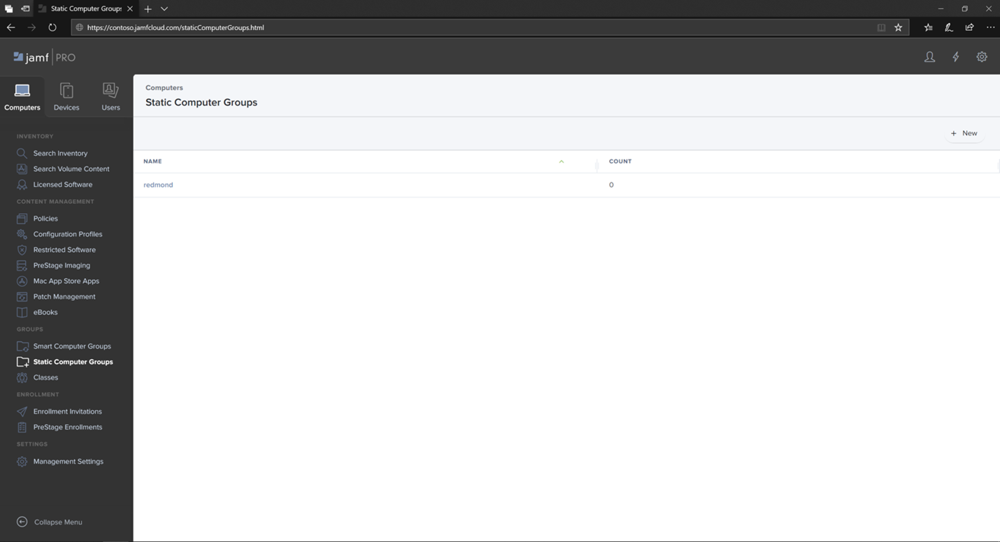

# Jamf 2013에서 macOS 장치 그룹에서 끝점에 대한 Microsoft Defender Pro

[!INCLUDE [Microsoft 365 Defender rebranding](../../includes/microsoft-defender.md)]

**적용 대상:**
- [엔드포인트용 Microsoft Defender](https://go.microsoft.com/fwlink/p/?linkid=2154037)
- [Microsoft 365 Defender](https://go.microsoft.com/fwlink/?linkid=2118804)

> Endpoint용 Defender를 경험하고 싶나요? [무료 평가판을 신청하세요.](https://signup.microsoft.com/create-account/signup?products=7f379fee-c4f9-4278-b0a1-e4c8c2fcdf7e&ru=https://aka.ms/MDEp2OpenTrial?ocid=docs-wdatp-investigateip-abovefoldlink)

그룹 정책 US(조직 구성 단위), Microsoft Endpoint Configuration Manager 및 Intune의 장치 그룹과 유사한 장치 그룹을 설정합니다.

1. 정적 **컴퓨터 그룹으로 이동합니다.**

2. 새로 **고치기 를 선택합니다.** 

    

3. 표시 이름을 제공하고 저장을 **선택합니다.**

    

4. 이제 정적 컴퓨터 그룹 아래에 **Contoso의** **컴퓨터 그룹이 표시될 것입니다.**

    

## 다음 단계
- [Jamf 2013에서 macOS 정책에 대한 끝점에 대한 Microsoft Defender Pro](mac-jamfpro-policies.md)
