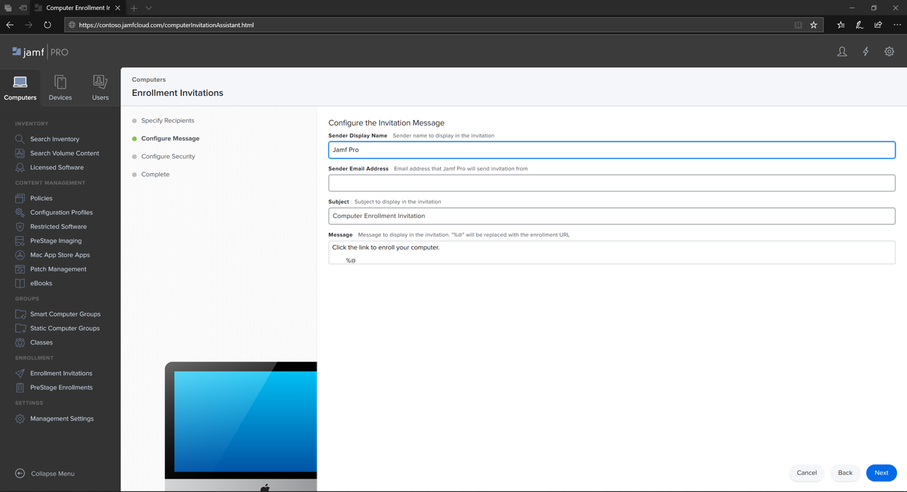
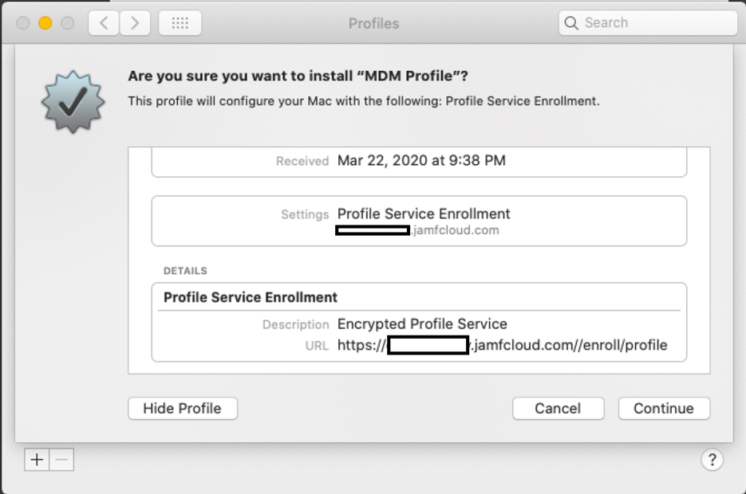

# MacOS 장치에서 Endpoint용 Microsoft Defender를 Jamf 2013에 Pro

[!INCLUDE [Microsoft 365 Defender rebranding](../../includes/microsoft-defender.md)]

**적용 대상:**
- [엔드포인트용 Microsoft Defender](https://go.microsoft.com/fwlink/p/?linkid=2154037)
- [Microsoft 365 Defender](https://go.microsoft.com/fwlink/?linkid=2118804)

> Endpoint용 Defender를 경험하고 싶나요? [무료 평가판을 신청하세요.](https://signup.microsoft.com/create-account/signup?products=7f379fee-c4f9-4278-b0a1-e4c8c2fcdf7e&ru=https://aka.ms/MDEp2OpenTrial?ocid=docs-wdatp-investigateip-abovefoldlink)

## macOS 장치 등록

JamF에 등록하는 방법에는 여러 가지가 있습니다.

이 문서에서는 다음 두 가지 방법을 안내합니다.

- [방법 1: 등록 초대](#enrollment-method-1-enrollment-invitations)
- [방법 2: 사전 등록](#enrollment-method-2-prestage-enrollments)

전체 목록은 컴퓨터 등록 [정보를 참조하세요.](https://docs.jamf.com/9.9/casper-suite/administrator-guide/About_Computer_Enrollment.html)

## 등록 방법 1: 등록 초대

1. Jamf Pro 대시보드에서 등록 **초대로 이동합니다.**

    

2. **+ 새로 고치기 를 선택합니다.**

    

3. 전자 **메일 주소에서** 초대 > 받는  사람 지정에 받는 사람의 전자 메일 주소를 입력합니다.

    

    

    예: janedoe@contoso.com

    

4. 초대에 대한 메시지를 구성합니다.

    

    

    

    

## 등록 방법 2: 사전 등록

1. Jamf Pro 대시보드에서 **사전 등록으로 이동합니다.**

    

2. 컴퓨터 사전 [등록의 지침을 따릅니다.](https://docs.jamf.com/9.9/casper-suite/administrator-guide/Computer_PreStage_Enrollments.html)

## macOS 장치 등록

1. **계속을** 선택하고 시스템 기본 설정 창에서 CA **인증서를 설치합니다.**

    

2. CA 인증서가 설치되면 브라우저 창으로 돌아가 **계속을** 선택하고 MDM 프로필을 설치합니다.

    

3. **JAMF에서** 다운로드 허용을 선택합니다.

    

4. **계속을** 선택하여 MDM 프로필 설치를 진행합니다.

    

5. **계속을** 선택하여 MDM 프로필을 설치합니다.

    

6. **계속을** 선택하여 구성을 완료합니다.

    
