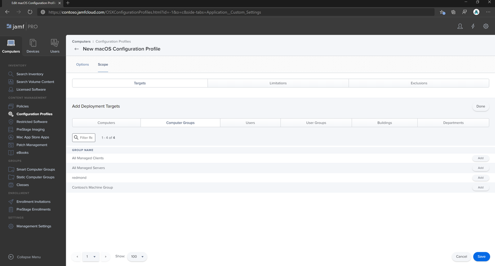
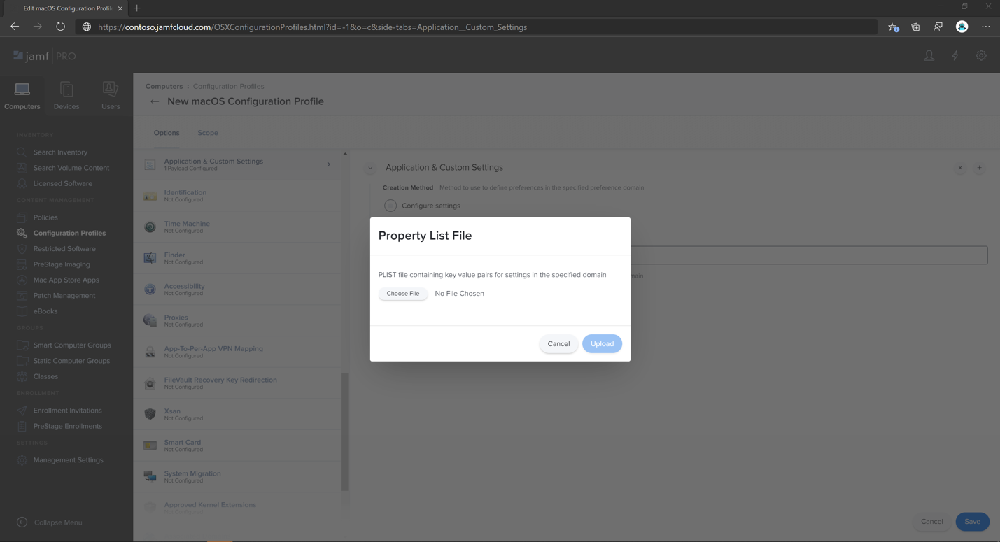
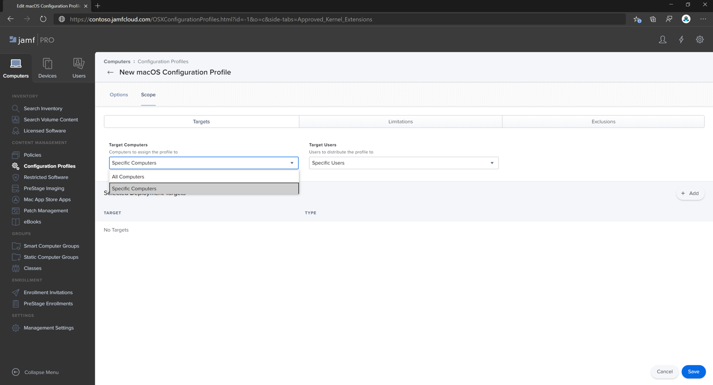
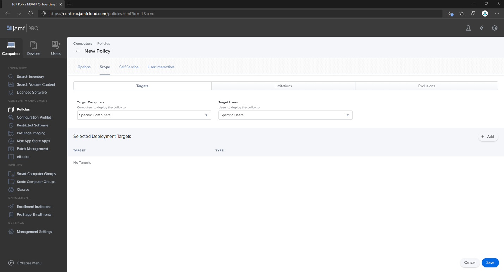

# <a name="set-up-the-microsoft-defender-for-endpoint-for-macos-policies-in-jamf-pro"></a><span data-ttu-id="786ec-104">Jamf Pro에서 macOS용 끝점용 Microsoft Defender 정책 설정</span><span class="sxs-lookup"><span data-stu-id="786ec-104">Set up the Microsoft Defender for Endpoint for macOS policies in Jamf Pro</span></span>

[!INCLUDE [Microsoft 365 Defender rebranding](../../includes/microsoft-defender.md)]


<span data-ttu-id="786ec-105">**적용 대상:**</span><span class="sxs-lookup"><span data-stu-id="786ec-105">**Applies to:**</span></span>

- [<span data-ttu-id="786ec-106">Mac용 끝점용 Defender</span><span class="sxs-lookup"><span data-stu-id="786ec-106">Defender for Endpoint for Mac</span></span>](microsoft-defender-endpoint-mac.md)

<span data-ttu-id="786ec-107">이 페이지에서는 Jamf Pro에서 macOS 정책을 설정하는 데 필요한 단계를 안내합니다.</span><span class="sxs-lookup"><span data-stu-id="786ec-107">This page will guide you through the steps you need to take to set up macOS policies in Jamf Pro.</span></span>

<span data-ttu-id="786ec-108">다음 단계를 수행해야 합니다.</span><span class="sxs-lookup"><span data-stu-id="786ec-108">You'll need to take the following steps:</span></span>

1. [<span data-ttu-id="786ec-109">끝점용 Microsoft Defender 온보딩 패키지 다운로드</span><span class="sxs-lookup"><span data-stu-id="786ec-109">Get the Microsoft Defender for Endpoint onboarding package</span></span>](#step-1-get-the-microsoft-defender-for-endpoint-onboarding-package)

2. [<span data-ttu-id="786ec-110">온보더링 패키지를 사용하여 Jamf Pro에서 구성 프로필 만들기</span><span class="sxs-lookup"><span data-stu-id="786ec-110">Create a configuration profile in Jamf Pro using the onboarding package</span></span>](#step-2-create-a-configuration-profile-in-jamf-pro-using-the-onboarding-package)

3. [<span data-ttu-id="786ec-111">끝점 설정에 맞게 Microsoft Defender 구성</span><span class="sxs-lookup"><span data-stu-id="786ec-111">Configure Microsoft Defender for Endpoint settings</span></span>](#step-3-configure-microsoft-defender-for-endpoint-settings)

4. [<span data-ttu-id="786ec-112">끝점 알림 설정에 맞게 Microsoft Defender 구성</span><span class="sxs-lookup"><span data-stu-id="786ec-112">Configure Microsoft Defender for Endpoint notification settings</span></span>](#step-4-configure-notifications-settings)

5. [<span data-ttu-id="786ec-113">MAU(Microsoft 자동 업데이트) 구성</span><span class="sxs-lookup"><span data-stu-id="786ec-113">Configure Microsoft AutoUpdate (MAU)</span></span>](#step-5-configure-microsoft-autoupdate-mau)

6. [<span data-ttu-id="786ec-114">끝점용 Microsoft Defender에 대한 전체 디스크 액세스 권한 부여</span><span class="sxs-lookup"><span data-stu-id="786ec-114">Grant full disk access to Microsoft Defender for Endpoint</span></span>](#step-6-grant-full-disk-access-to-microsoft-defender-for-endpoint)

7. [<span data-ttu-id="786ec-115">끝점용 Microsoft Defender에 대한 커널 확장 승인</span><span class="sxs-lookup"><span data-stu-id="786ec-115">Approve Kernel extension for Microsoft Defender for Endpoint</span></span>](#step-7-approve-kernel-extension-for-microsoft-defender-for-endpoint)

8. [<span data-ttu-id="786ec-116">끝점용 Microsoft Defender에 대한 시스템 확장 승인</span><span class="sxs-lookup"><span data-stu-id="786ec-116">Approve System extensions for Microsoft Defender for Endpoint</span></span>](#step-8-approve-system-extensions-for-microsoft-defender-for-endpoint)

9. [<span data-ttu-id="786ec-117">네트워크 확장 구성</span><span class="sxs-lookup"><span data-stu-id="786ec-117">Configure Network Extension</span></span>](#step-9-configure-network-extension)

10. [<span data-ttu-id="786ec-118">Mac용 끝점에 대한 Microsoft Defender 검사 예약</span><span class="sxs-lookup"><span data-stu-id="786ec-118">Schedule scans with Microsoft Defender for Endpoint for Mac</span></span>](https://docs.microsoft.com/windows/security/threat-protection/microsoft-defender-atp/mac-schedule-scan-atp)

11. [<span data-ttu-id="786ec-119">MacOS용 끝점용 Microsoft Defender 배포</span><span class="sxs-lookup"><span data-stu-id="786ec-119">Deploy Microsoft Defender for Endpoint for macOS</span></span>](#step-11-deploy-microsoft-defender-for-endpoint-for-macos)


## <a name="step-1-get-the-microsoft-defender-for-endpoint-onboarding-package"></a><span data-ttu-id="786ec-120">1단계: 끝점용 Microsoft Defender 온보딩 패키지 다운로드</span><span class="sxs-lookup"><span data-stu-id="786ec-120">Step 1: Get the Microsoft Defender for Endpoint onboarding package</span></span>

1. <span data-ttu-id="786ec-121">[Microsoft Defender 보안 센터에서](https://securitycenter.microsoft.com )설정 > **온보딩으로 이동합니다.**</span><span class="sxs-lookup"><span data-stu-id="786ec-121">In [Microsoft Defender Security Center](https://securitycenter.microsoft.com ), navigate to **Settings > Onboarding**.</span></span> 

2. <span data-ttu-id="786ec-122">운영 체제로 macOS를 선택하고 배포 방법으로 모바일 장치 관리/Microsoft Intune을 선택합니다.</span><span class="sxs-lookup"><span data-stu-id="786ec-122">Select macOS as the operating system and Mobile Device Management / Microsoft Intune as the deployment method.</span></span>

    

3. <span data-ttu-id="786ec-124">**온보더링 패키지 다운로드(WindowsDefenderATPOnboardingPackage.zip).**</span><span class="sxs-lookup"><span data-stu-id="786ec-124">Select **Download onboarding package** (WindowsDefenderATPOnboardingPackage.zip).</span></span>

4. <span data-ttu-id="786ec-125">추출 `WindowsDefenderATPOnboardingPackage.zip` .</span><span class="sxs-lookup"><span data-stu-id="786ec-125">Extract `WindowsDefenderATPOnboardingPackage.zip`.</span></span>

5. <span data-ttu-id="786ec-126">파일을 원하는 위치에 복사합니다.</span><span class="sxs-lookup"><span data-stu-id="786ec-126">Copy the file to your preferred location.</span></span> <span data-ttu-id="786ec-127">예:  `C:\Users\JaneDoe_or_JohnDoe.contoso\Downloads\WindowsDefenderATPOnboardingPackage_macOS_MDM_contoso\jamf\WindowsDefenderATPOnboarding.plist`.</span><span class="sxs-lookup"><span data-stu-id="786ec-127">For example,  `C:\Users\JaneDoe_or_JohnDoe.contoso\Downloads\WindowsDefenderATPOnboardingPackage_macOS_MDM_contoso\jamf\WindowsDefenderATPOnboarding.plist`.</span></span>


## <a name="step-2-create-a-configuration-profile-in-jamf-pro-using-the-onboarding-package"></a><span data-ttu-id="786ec-128">2단계: 온보더링 패키지를 사용하여 Jamf Pro에서 구성 프로필 만들기</span><span class="sxs-lookup"><span data-stu-id="786ec-128">Step 2: Create a configuration profile in Jamf Pro using the onboarding package</span></span>

1. <span data-ttu-id="786ec-129">이전 `WindowsDefenderATPOnboarding.plist` 섹션에서 파일을 찾습니다.</span><span class="sxs-lookup"><span data-stu-id="786ec-129">Locate the file `WindowsDefenderATPOnboarding.plist` from the previous section.</span></span>

   

 
2. <span data-ttu-id="786ec-131">Jamf Pro 대시보드에서 새로 만들 를 **선택합니다.**</span><span class="sxs-lookup"><span data-stu-id="786ec-131">In the Jamf Pro dashboard, select **New**.</span></span>

    

3. <span data-ttu-id="786ec-133">다음 세부 정보를 입력합니다.</span><span class="sxs-lookup"><span data-stu-id="786ec-133">Enter the following details:</span></span>

   <span data-ttu-id="786ec-134">**일반**</span><span class="sxs-lookup"><span data-stu-id="786ec-134">**General**</span></span>
   - <span data-ttu-id="786ec-135">이름: macOS용 MDATP 온보드</span><span class="sxs-lookup"><span data-stu-id="786ec-135">Name: MDATP onboarding for macOS</span></span>
   - <span data-ttu-id="786ec-136">설명: macOS용 MDATP EDR 온보더링</span><span class="sxs-lookup"><span data-stu-id="786ec-136">Description: MDATP EDR onboarding for macOS</span></span>
   - <span data-ttu-id="786ec-137">범주: 없음</span><span class="sxs-lookup"><span data-stu-id="786ec-137">Category: None</span></span>
   - <span data-ttu-id="786ec-138">배포 방법: 자동으로 설치</span><span class="sxs-lookup"><span data-stu-id="786ec-138">Distribution Method: Install Automatically</span></span>
   - <span data-ttu-id="786ec-139">수준: 컴퓨터 수준</span><span class="sxs-lookup"><span data-stu-id="786ec-139">Level: Computer Level</span></span>

4. <span data-ttu-id="786ec-140">응용 **프로그램 & 사용자 지정 설정 구성을** **선택합니다.**</span><span class="sxs-lookup"><span data-stu-id="786ec-140">In **Application & Custom Settings** select **Configure**.</span></span>

    

5. <span data-ttu-id="786ec-142">파일 **업로드(PLIST 파일)를** 선택한 다음 **기본 설정 도메인에서 다음을** 입력합니다. `com.microsoft.wdav.atp` .</span><span class="sxs-lookup"><span data-stu-id="786ec-142">Select **Upload File (PLIST file)** then in **Preference Domain** enter: `com.microsoft.wdav.atp`.</span></span> 

    

    

7. <span data-ttu-id="786ec-145">열기 **를** 선택하고 온보더링 파일을 선택합니다.</span><span class="sxs-lookup"><span data-stu-id="786ec-145">Select **Open** and select the onboarding file.</span></span>

    

8. <span data-ttu-id="786ec-147">업로드를 **선택합니다.**</span><span class="sxs-lookup"><span data-stu-id="786ec-147">Select **Upload**.</span></span> 

    


9. <span data-ttu-id="786ec-149">범위 **탭을** 선택합니다.</span><span class="sxs-lookup"><span data-stu-id="786ec-149">Select the **Scope** tab.</span></span>

    

10. <span data-ttu-id="786ec-151">대상 컴퓨터를 선택합니다.</span><span class="sxs-lookup"><span data-stu-id="786ec-151">Select the target computers.</span></span>

    

     

11. <span data-ttu-id="786ec-154">**저장** 을 선택합니다.</span><span class="sxs-lookup"><span data-stu-id="786ec-154">Select **Save**.</span></span>

    

    

12. <span data-ttu-id="786ec-157">**완료** 를 선택합니다.</span><span class="sxs-lookup"><span data-stu-id="786ec-157">Select **Done**.</span></span>

    

    

## <a name="step-3-configure-microsoft-defender-for-endpoint-settings"></a><span data-ttu-id="786ec-160">3단계: 끝점 설정에 맞게 Microsoft Defender 구성</span><span class="sxs-lookup"><span data-stu-id="786ec-160">Step 3: Configure Microsoft Defender for Endpoint settings</span></span>

1.  <span data-ttu-id="786ec-161">끝점 구성 설정에 대해 다음 Microsoft Defender를 사용합니다.</span><span class="sxs-lookup"><span data-stu-id="786ec-161">Use the following Microsoft Defender for Endpoint configuration settings:</span></span>

    - <span data-ttu-id="786ec-162">enableRealTimeProtection</span><span class="sxs-lookup"><span data-stu-id="786ec-162">enableRealTimeProtection</span></span>
    - <span data-ttu-id="786ec-163">passiveMode</span><span class="sxs-lookup"><span data-stu-id="786ec-163">passiveMode</span></span>
    
    >[!NOTE]
    ><span data-ttu-id="786ec-164">macOS용 타사 AV를 실행하기 위해 계획하는 경우 기본적으로 켜져 있지 않습니다. 를 로 `true` 설정</span><span class="sxs-lookup"><span data-stu-id="786ec-164">Not turned on by default, if you are planning to run a third-party AV for macOS, set it to `true`.</span></span>

    - <span data-ttu-id="786ec-165">제외</span><span class="sxs-lookup"><span data-stu-id="786ec-165">exclusions</span></span>
    - <span data-ttu-id="786ec-166">excludedPath</span><span class="sxs-lookup"><span data-stu-id="786ec-166">excludedPath</span></span>
    - <span data-ttu-id="786ec-167">excludedFileExtension</span><span class="sxs-lookup"><span data-stu-id="786ec-167">excludedFileExtension</span></span>
    - <span data-ttu-id="786ec-168">excludedFileName</span><span class="sxs-lookup"><span data-stu-id="786ec-168">excludedFileName</span></span>
    - <span data-ttu-id="786ec-169">exclusionsMergePolicy</span><span class="sxs-lookup"><span data-stu-id="786ec-169">exclusionsMergePolicy</span></span>
    - <span data-ttu-id="786ec-170">allowedThreats</span><span class="sxs-lookup"><span data-stu-id="786ec-170">allowedThreats</span></span>
    
    >[!NOTE]
    ><span data-ttu-id="786ec-171">EICAR이 샘플에 있습니다. 개념 증명을 진행하는 경우 EICAR을 테스트하는 경우 EICAR을 제거합니다.</span><span class="sxs-lookup"><span data-stu-id="786ec-171">EICAR is on the sample, if you are going through a proof-of-concept, remove it especially if you are testing EICAR.</span></span>
        
    - <span data-ttu-id="786ec-172">disallowedThreatActions</span><span class="sxs-lookup"><span data-stu-id="786ec-172">disallowedThreatActions</span></span>
    - <span data-ttu-id="786ec-173">potentially_unwanted_application</span><span class="sxs-lookup"><span data-stu-id="786ec-173">potentially_unwanted_application</span></span>
    - <span data-ttu-id="786ec-174">archive_bomb</span><span class="sxs-lookup"><span data-stu-id="786ec-174">archive_bomb</span></span>
    - <span data-ttu-id="786ec-175">cloudService</span><span class="sxs-lookup"><span data-stu-id="786ec-175">cloudService</span></span>
    - <span data-ttu-id="786ec-176">automaticSampleSubmission</span><span class="sxs-lookup"><span data-stu-id="786ec-176">automaticSampleSubmission</span></span>
    - <span data-ttu-id="786ec-177">tags</span><span class="sxs-lookup"><span data-stu-id="786ec-177">tags</span></span>
    - <span data-ttu-id="786ec-178">hideStatusMenuIcon</span><span class="sxs-lookup"><span data-stu-id="786ec-178">hideStatusMenuIcon</span></span>
    
     <span data-ttu-id="786ec-179">자세한 내용은 [Jamf 구성 프로필의 속성 목록을 참조하세요.](mac-preferences.md#property-list-for-jamf-configuration-profile)</span><span class="sxs-lookup"><span data-stu-id="786ec-179">For information, see [Property list for Jamf configuration profile](mac-preferences.md#property-list-for-jamf-configuration-profile).</span></span>

     ```XML
     <?xml version="1.0" encoding="UTF-8"?>
     <!DOCTYPE plist PUBLIC "-//Apple//DTD PLIST 1.0//EN" "http://www.apple.com/DTDs/PropertyList-1.0.dtd">
     <plist version="1.0">
     <dict>
         <key>antivirusEngine</key>
         <dict>
             <key>enableRealTimeProtection</key>
             <true/>
             <key>passiveMode</key>
             <false/>
             <key>exclusions</key>
             <array>
                 <dict>
                     <key>$type</key>
                     <string>excludedPath</string>
                     <key>isDirectory</key>
                     <false/>
                     <key>path</key>
                     <string>/var/log/system.log</string>
                 </dict>
                 <dict>
                     <key>$type</key>
                     <string>excludedPath</string>
                     <key>isDirectory</key>
                     <true/>
                     <key>path</key>
                     <string>/home</string>
                 </dict>
                 <dict>
                     <key>$type</key>
                     <string>excludedFileExtension</string>
                     <key>extension</key>
                     <string>pdf</string>
                 </dict>
                 <dict>
                     <key>$type</key>
                     <string>excludedFileName</string>
                     <key>name</key>
                     <string>cat</string>
                 </dict>
             </array>
             <key>exclusionsMergePolicy</key>
             <string>merge</string>
             <key>allowedThreats</key>
             <array>
                 <string>EICAR-Test-File (not a virus)</string>
             </array>
             <key>disallowedThreatActions</key>
             <array>
                 <string>allow</string>
                 <string>restore</string>
             </array>
             <key>threatTypeSettings</key>
             <array>
                 <dict>
                     <key>key</key>
                     <string>potentially_unwanted_application</string>
                     <key>value</key>
                     <string>block</string>
                 </dict>
                 <dict>
                     <key>key</key>
                     <string>archive_bomb</string>
                     <key>value</key>
                     <string>audit</string>
                 </dict>
             </array>
             <key>threatTypeSettingsMergePolicy</key>
             <string>merge</string>
         </dict>
         <key>cloudService</key>
         <dict>
             <key>enabled</key>
             <true/>
             <key>diagnosticLevel</key>
             <string>optional</string>
             <key>automaticSampleSubmission</key>
             <true/>
         </dict>
         <key>edr</key>
         <dict>
             <key>tags</key>
             <array>
                 <dict>
                     <key>key</key>
                     <string>GROUP</string>
                     <key>value</key>
                     <string>ExampleTag</string>
                 </dict>
             </array>
         </dict>
         <key>userInterface</key>
         <dict>
             <key>hideStatusMenuIcon</key>
             <false/>
         </dict>
     </dict>
     </plist>
     ```

2. <span data-ttu-id="786ec-180">파일을 로 `MDATP_MDAV_configuration_settings.plist` 저장합니다.</span><span class="sxs-lookup"><span data-stu-id="786ec-180">Save the file as `MDATP_MDAV_configuration_settings.plist`.</span></span>


3.  <span data-ttu-id="786ec-181">Jamf Pro 대시보드에서 일반 을 **선택합니다.**</span><span class="sxs-lookup"><span data-stu-id="786ec-181">In the Jamf Pro dashboard, select **General**.</span></span>

    

4. <span data-ttu-id="786ec-183">다음 세부 정보를 입력합니다.</span><span class="sxs-lookup"><span data-stu-id="786ec-183">Enter the following details:</span></span>

    <span data-ttu-id="786ec-184">**일반**</span><span class="sxs-lookup"><span data-stu-id="786ec-184">**General**</span></span>
    
    - <span data-ttu-id="786ec-185">이름: MDATP MDAV 구성 설정</span><span class="sxs-lookup"><span data-stu-id="786ec-185">Name: MDATP MDAV configuration settings</span></span>
    - <span data-ttu-id="786ec-186">설명:\<blank\></span><span class="sxs-lookup"><span data-stu-id="786ec-186">Description:\<blank\></span></span>
    - <span data-ttu-id="786ec-187">범주: 없음(기본값)</span><span class="sxs-lookup"><span data-stu-id="786ec-187">Category: None (default)</span></span>
    - <span data-ttu-id="786ec-188">배포 방법: 자동으로 설치(기본값)</span><span class="sxs-lookup"><span data-stu-id="786ec-188">Distribution Method: Install Automatically(default)</span></span>
    - <span data-ttu-id="786ec-189">수준: 컴퓨터 수준(기본값)</span><span class="sxs-lookup"><span data-stu-id="786ec-189">Level: Computer Level(default)</span></span>

    

5. <span data-ttu-id="786ec-191">응용 **프로그램 & 사용자 지정 설정 구성을** **선택합니다.**</span><span class="sxs-lookup"><span data-stu-id="786ec-191">In **Application & Custom Settings** select **Configure**.</span></span>

    

6. <span data-ttu-id="786ec-193">파일 **업로드(PLIST 파일)를 선택합니다.**</span><span class="sxs-lookup"><span data-stu-id="786ec-193">Select **Upload File (PLIST file)**.</span></span>

    

7. <span data-ttu-id="786ec-195">기본 **설정 도메인에서** `com.microsoft.wdav` 를 입력한 다음 **PLIST 파일 업로드를 선택합니다.**</span><span class="sxs-lookup"><span data-stu-id="786ec-195">In **Preferences Domain**, enter `com.microsoft.wdav`, then select  **Upload PLIST File**.</span></span>

    

8. <span data-ttu-id="786ec-197">파일 **선택 을 선택합니다.**</span><span class="sxs-lookup"><span data-stu-id="786ec-197">Select **Choose File**.</span></span>

    

9. <span data-ttu-id="786ec-199">**MDATP_MDAV_configuration_settings.plist를 선택한** 다음 **열기 를 선택합니다.**</span><span class="sxs-lookup"><span data-stu-id="786ec-199">Select the **MDATP_MDAV_configuration_settings.plist**, then select **Open**.</span></span>

    

10. <span data-ttu-id="786ec-201">업로드를 **선택합니다.**</span><span class="sxs-lookup"><span data-stu-id="786ec-201">Select **Upload**.</span></span>

    

    

    >[!NOTE]
    ><span data-ttu-id="786ec-204">Intune 파일을 업로드하는 경우 다음 오류가 발생합니다.</span><span class="sxs-lookup"><span data-stu-id="786ec-204">If you happen to upload the Intune file, you'll get the following error:</span></span><br>
    ><span data-ttu-id="786ec-205"></span><span class="sxs-lookup"><span data-stu-id="786ec-205"></span></span>


11. <span data-ttu-id="786ec-206">**저장** 을 선택합니다.</span><span class="sxs-lookup"><span data-stu-id="786ec-206">Select **Save**.</span></span> 

    

12. <span data-ttu-id="786ec-208">파일이 업로드됩니다.</span><span class="sxs-lookup"><span data-stu-id="786ec-208">The file is uploaded.</span></span>

    

    

13. <span data-ttu-id="786ec-211">범위 **탭을** 선택합니다.</span><span class="sxs-lookup"><span data-stu-id="786ec-211">Select the **Scope** tab.</span></span>

    

14. <span data-ttu-id="786ec-213">**Contoso의 컴퓨터 그룹을 선택합니다.**</span><span class="sxs-lookup"><span data-stu-id="786ec-213">Select **Contoso's Machine Group**.</span></span> 

15. <span data-ttu-id="786ec-214">**추가를** 선택한 다음 **저장을 선택합니다.**</span><span class="sxs-lookup"><span data-stu-id="786ec-214">Select **Add**, then select **Save**.</span></span>

    

    

16. <span data-ttu-id="786ec-217">**완료** 를 선택합니다.</span><span class="sxs-lookup"><span data-stu-id="786ec-217">Select **Done**.</span></span> <span data-ttu-id="786ec-218">새 구성 **프로필이 표시됩니다.**</span><span class="sxs-lookup"><span data-stu-id="786ec-218">You'll see the new **Configuration profile**.</span></span>

    


## <a name="step-4-configure-notifications-settings"></a><span data-ttu-id="786ec-220">4단계: 알림 설정 구성</span><span class="sxs-lookup"><span data-stu-id="786ec-220">Step 4: Configure notifications settings</span></span>

<span data-ttu-id="786ec-221">이러한 단계는 macOS 10.15(카탈로니아) 이상에서 적용할 수 있습니다.</span><span class="sxs-lookup"><span data-stu-id="786ec-221">These steps are applicable of macOS 10.15 (Catalina) or newer.</span></span>

1. <span data-ttu-id="786ec-222">Jamf Pro 대시보드에서 **컴퓨터,** 구성 **프로필을 선택합니다.**</span><span class="sxs-lookup"><span data-stu-id="786ec-222">In the Jamf Pro dashboard, select **Computers**, then **Configuration Profiles**.</span></span>

2. <span data-ttu-id="786ec-223">새로 **추가를** 클릭하고 옵션에 대해 다음 세부 정보를 **입력합니다.**</span><span class="sxs-lookup"><span data-stu-id="786ec-223">Click **New**, and enter the following details for **Options**:</span></span>
    
    - <span data-ttu-id="786ec-224">Tab **일반**:</span><span class="sxs-lookup"><span data-stu-id="786ec-224">Tab **General**:</span></span> 
        - <span data-ttu-id="786ec-225">**이름:** MDATP MDAV 알림 설정</span><span class="sxs-lookup"><span data-stu-id="786ec-225">**Name**: MDATP MDAV Notification settings</span></span>
        - <span data-ttu-id="786ec-226">**설명:** macOS 10.15(카탈로니아) 이상</span><span class="sxs-lookup"><span data-stu-id="786ec-226">**Description**: macOS 10.15 (Catalina) or newer</span></span>
        - <span data-ttu-id="786ec-227">**범주:** *없음(기본값)*</span><span class="sxs-lookup"><span data-stu-id="786ec-227">**Category**: None *(default)*</span></span>
        - <span data-ttu-id="786ec-228">**배포 방법:** 자동으로 *설치(기본값)*</span><span class="sxs-lookup"><span data-stu-id="786ec-228">**Distribution Method**: Install Automatically *(default)*</span></span>
        - <span data-ttu-id="786ec-229">**수준:** 컴퓨터 *수준(기본값)*</span><span class="sxs-lookup"><span data-stu-id="786ec-229">**Level**: Computer Level *(default)*</span></span>

        

    - <span data-ttu-id="786ec-231">탭 **알림,** **추가를 클릭하고** 다음 값을 입력합니다.</span><span class="sxs-lookup"><span data-stu-id="786ec-231">Tab **Notifications**, click **Add**, and enter the following values:</span></span>
        - <span data-ttu-id="786ec-232">**번들 ID**: `com.microsoft.wdav.tray`</span><span class="sxs-lookup"><span data-stu-id="786ec-232">**Bundle ID**: `com.microsoft.wdav.tray`</span></span>
        - <span data-ttu-id="786ec-233">**중요 경고:** 사용 안 **하게를 클릭합니다.**</span><span class="sxs-lookup"><span data-stu-id="786ec-233">**Critical Alerts**: Click **Disable**</span></span>
        - <span data-ttu-id="786ec-234">**알림:** 사용 **클릭**</span><span class="sxs-lookup"><span data-stu-id="786ec-234">**Notifications**: Click **Enable**</span></span>
        - <span data-ttu-id="786ec-235">**배너 경고 유형:** 포함 **및** 임시 *선택(기본값)* </span><span class="sxs-lookup"><span data-stu-id="786ec-235">**Banner alert type**: Select **Include** and **Temporary** *(default)*</span></span>
        - <span data-ttu-id="786ec-236">**잠금 화면의 알림:** **숨기기 클릭**</span><span class="sxs-lookup"><span data-stu-id="786ec-236">**Notifications on lock screen**: Click **Hide**</span></span>
        - <span data-ttu-id="786ec-237">**알림 센터의 알림:** 표시 **클릭**</span><span class="sxs-lookup"><span data-stu-id="786ec-237">**Notifications in Notification Center**: Click **Display**</span></span>
        - <span data-ttu-id="786ec-238">**배지 앱 아이콘:** 표시 **클릭**</span><span class="sxs-lookup"><span data-stu-id="786ec-238">**Badge app icon**: Click **Display**</span></span>

        

    - <span data-ttu-id="786ec-240">탭 **알림**, **한** 번 더 추가를 클릭하고 아래로 스크롤하여 새 **알림 설정**</span><span class="sxs-lookup"><span data-stu-id="786ec-240">Tab **Notifications**, click **Add** one more time, scroll down to **New Notifications Settings**</span></span>
        - <span data-ttu-id="786ec-241">**번들 ID**: `com.microsoft.autoupdate2`</span><span class="sxs-lookup"><span data-stu-id="786ec-241">**Bundle ID**: `com.microsoft.autoupdate2`</span></span>
        - <span data-ttu-id="786ec-242">나머지 설정은 위의 값과 동일한 값으로 구성합니다.</span><span class="sxs-lookup"><span data-stu-id="786ec-242">Configure the rest of the settings to the same values as above</span></span>

        

        <span data-ttu-id="786ec-244">이제 알림 구성이 있는 '테이블'이 두 개 있습니다. 하나는 번들 **ID인 com.microsoft.wdav.tray,** 다른 하나는 **com.microsoft.autoupdate2입니다.**</span><span class="sxs-lookup"><span data-stu-id="786ec-244">Note that now you have two 'tables' with notification configurations, one for **Bundle ID: com.microsoft.wdav.tray**, and another for **Bundle ID: com.microsoft.autoupdate2**.</span></span> <span data-ttu-id="786ec-245">요구 사항에 따라 경고 설정을 구성할 수 있는 동안 번들 ID는 앞에서 설명한 그대로 동일해야 합니다. **또한 알림의** 경우 Include 스위치가 **켜기(On)되어야 합니다.** </span><span class="sxs-lookup"><span data-stu-id="786ec-245">While you can configure alert settings per your requirements, Bundle IDs must be exactly the same as described before, and **Include** switch must be **On** for **Notifications**.</span></span>

3. <span data-ttu-id="786ec-246">범위 **탭을** 선택한 다음 추가를 **선택합니다.**</span><span class="sxs-lookup"><span data-stu-id="786ec-246">Select the **Scope** tab, then select **Add**.</span></span>

    

4. <span data-ttu-id="786ec-248">**Contoso의 컴퓨터 그룹을 선택합니다.**</span><span class="sxs-lookup"><span data-stu-id="786ec-248">Select **Contoso's Machine Group**.</span></span> 

5. <span data-ttu-id="786ec-249">**추가를** 선택한 다음 **저장을 선택합니다.**</span><span class="sxs-lookup"><span data-stu-id="786ec-249">Select **Add**, then select **Save**.</span></span>
    
    
    
    

6. <span data-ttu-id="786ec-252">**완료** 를 선택합니다.</span><span class="sxs-lookup"><span data-stu-id="786ec-252">Select **Done**.</span></span> <span data-ttu-id="786ec-253">새 구성 **프로필이 표시됩니다.**</span><span class="sxs-lookup"><span data-stu-id="786ec-253">You'll see the new **Configuration profile**.</span></span>
    <span data-ttu-id="786ec-254"></span><span class="sxs-lookup"><span data-stu-id="786ec-254"></span></span>

## <a name="step-5-configure-microsoft-autoupdate-mau"></a><span data-ttu-id="786ec-255">5단계: MAU(Microsoft 자동 업데이트) 구성</span><span class="sxs-lookup"><span data-stu-id="786ec-255">Step 5: Configure Microsoft AutoUpdate (MAU)</span></span>

1. <span data-ttu-id="786ec-256">끝점 구성 설정에 대해 다음 Microsoft Defender를 사용합니다.</span><span class="sxs-lookup"><span data-stu-id="786ec-256">Use the following Microsoft Defender for Endpoint configuration settings:</span></span>

      ```XML
   <?xml version="1.0" encoding="UTF-8"?>
   <!DOCTYPE plist PUBLIC "-//Apple//DTD PLIST 1.0//EN" "http://www.apple.com/DTDs/PropertyList-1.0.dtd">
   <plist version="1.0">
   <dict>
    <key>ChannelName</key>
    <string>Current</string>
    <key>HowToCheck</key>
    <string>AutomaticDownload</string>
    <key>EnableCheckForUpdatesButton</key>
    <true/>
    <key>DisableInsiderCheckbox</key>
    <false/>
    <key>SendAllTelemetryEnabled</key>
    <true/>
   </dict>
   </plist>
   ```

2. <span data-ttu-id="786ec-257">으로 `MDATP_MDAV_MAU_settings.plist` 저장합니다.</span><span class="sxs-lookup"><span data-stu-id="786ec-257">Save it as `MDATP_MDAV_MAU_settings.plist`.</span></span>

3. <span data-ttu-id="786ec-258">Jamf Pro 대시보드에서 일반 을 **선택합니다.**</span><span class="sxs-lookup"><span data-stu-id="786ec-258">In the Jamf Pro dashboard, select **General**.</span></span> 

    

4. <span data-ttu-id="786ec-260">다음 세부 정보를 입력합니다.</span><span class="sxs-lookup"><span data-stu-id="786ec-260">Enter the following details:</span></span>

    <span data-ttu-id="786ec-261">**일반**</span><span class="sxs-lookup"><span data-stu-id="786ec-261">**General**</span></span> 
    
    - <span data-ttu-id="786ec-262">이름: MDATP MDAV MAU 설정</span><span class="sxs-lookup"><span data-stu-id="786ec-262">Name: MDATP MDAV MAU settings</span></span>
    - <span data-ttu-id="786ec-263">설명: MacOS용 MDATP에 대한 Microsoft 자동 업데이트 설정</span><span class="sxs-lookup"><span data-stu-id="786ec-263">Description: Microsoft AutoUpdate settings for MDATP for macOS</span></span>
    - <span data-ttu-id="786ec-264">범주: 없음(기본값)</span><span class="sxs-lookup"><span data-stu-id="786ec-264">Category: None (default)</span></span>
    - <span data-ttu-id="786ec-265">배포 방법: 자동으로 설치(기본값)</span><span class="sxs-lookup"><span data-stu-id="786ec-265">Distribution Method: Install Automatically(default)</span></span>
    - <span data-ttu-id="786ec-266">수준: 컴퓨터 수준(기본값)</span><span class="sxs-lookup"><span data-stu-id="786ec-266">Level: Computer Level(default)</span></span>

5. <span data-ttu-id="786ec-267">응용 **프로그램 & 사용자 지정 설정 구성을** **선택합니다.**</span><span class="sxs-lookup"><span data-stu-id="786ec-267">In **Application & Custom Settings** select **Configure**.</span></span>

    

6. <span data-ttu-id="786ec-269">파일 **업로드(PLIST 파일)를 선택합니다.**</span><span class="sxs-lookup"><span data-stu-id="786ec-269">Select **Upload File (PLIST file)**.</span></span>

      

7. <span data-ttu-id="786ec-271">기본 **설정 도메인에** 다음을 `com.microsoft.autoupdate2` 입력한 다음 **PLIST 파일 업로드를 선택합니다.**</span><span class="sxs-lookup"><span data-stu-id="786ec-271">In **Preference Domain** enter: `com.microsoft.autoupdate2`, then select **Upload PLIST File**.</span></span>

    

8. <span data-ttu-id="786ec-273">파일 **선택 을 선택합니다.**</span><span class="sxs-lookup"><span data-stu-id="786ec-273">Select **Choose File**.</span></span>

    

9. <span data-ttu-id="786ec-275">**MDATP_MDAV_MAU_settings.plist 를 선택합니다.**</span><span class="sxs-lookup"><span data-stu-id="786ec-275">Select **MDATP_MDAV_MAU_settings.plist**.</span></span>

    

10. <span data-ttu-id="786ec-277">업로드를 **선택합니다.**</span><span class="sxs-lookup"><span data-stu-id="786ec-277">Select **Upload**.</span></span>
    <span data-ttu-id="786ec-278"></span><span class="sxs-lookup"><span data-stu-id="786ec-278"></span></span>

    

11. <span data-ttu-id="786ec-280">**저장** 을 선택합니다.</span><span class="sxs-lookup"><span data-stu-id="786ec-280">Select **Save**.</span></span>

    

12. <span data-ttu-id="786ec-282">범위 **탭을** 선택합니다.</span><span class="sxs-lookup"><span data-stu-id="786ec-282">Select the **Scope** tab.</span></span>
   
     

13. <span data-ttu-id="786ec-284">**추가** 를 선택합니다.</span><span class="sxs-lookup"><span data-stu-id="786ec-284">Select **Add**.</span></span>
    
    

    

    

14. <span data-ttu-id="786ec-288">**완료** 를 선택합니다.</span><span class="sxs-lookup"><span data-stu-id="786ec-288">Select **Done**.</span></span>
    
    

## <a name="step-6-grant-full-disk-access-to-microsoft-defender-for-endpoint"></a><span data-ttu-id="786ec-290">6단계: 끝점용 Microsoft Defender에 대한 전체 디스크 액세스 권한 부여</span><span class="sxs-lookup"><span data-stu-id="786ec-290">Step 6: Grant full disk access to Microsoft Defender for Endpoint</span></span>

1. <span data-ttu-id="786ec-291">Jamf Pro 대시보드에서 **구성 프로필 을 선택합니다.**</span><span class="sxs-lookup"><span data-stu-id="786ec-291">In the Jamf Pro dashboard, select **Configuration Profiles**.</span></span>

    

2. <span data-ttu-id="786ec-293">**+ 새로 고치기 를 선택합니다.**</span><span class="sxs-lookup"><span data-stu-id="786ec-293">Select **+ New**.</span></span> 

3. <span data-ttu-id="786ec-294">다음 세부 정보를 입력합니다.</span><span class="sxs-lookup"><span data-stu-id="786ec-294">Enter the following details:</span></span>

    <span data-ttu-id="786ec-295">**일반**</span><span class="sxs-lookup"><span data-stu-id="786ec-295">**General**</span></span> 
    - <span data-ttu-id="786ec-296">이름: MDATP MDAV - EDR 및 AV에 대한 전체 디스크 액세스 권한 부여</span><span class="sxs-lookup"><span data-stu-id="786ec-296">Name: MDATP MDAV - grant Full Disk Access to EDR and AV</span></span>
    - <span data-ttu-id="786ec-297">설명: macOS 카탈로니아 이상에서 새로운 개인 정보 기본 설정 정책 컨트롤</span><span class="sxs-lookup"><span data-stu-id="786ec-297">Description: On macOS Catalina or newer, the new Privacy Preferences Policy Control</span></span>
    - <span data-ttu-id="786ec-298">범주: 없음</span><span class="sxs-lookup"><span data-stu-id="786ec-298">Category: None</span></span>
    - <span data-ttu-id="786ec-299">배포 방법: 자동으로 설치</span><span class="sxs-lookup"><span data-stu-id="786ec-299">Distribution method: Install Automatically</span></span>
    - <span data-ttu-id="786ec-300">수준: 컴퓨터 수준</span><span class="sxs-lookup"><span data-stu-id="786ec-300">Level: Computer level</span></span>


    

4. <span data-ttu-id="786ec-302">개인 **정보 기본 설정 정책 제어 구성에서** **구성을 선택합니다.**</span><span class="sxs-lookup"><span data-stu-id="786ec-302">In **Configure Privacy Preferences Policy Control** select **Configure**.</span></span>

    

5. <span data-ttu-id="786ec-304">개인 **정보 기본 설정 정책 제어에서** 다음 세부 정보를 입력합니다.</span><span class="sxs-lookup"><span data-stu-id="786ec-304">In **Privacy Preferences Policy Control**, enter the following details:</span></span>

    - <span data-ttu-id="786ec-305">식별자: `com.microsoft.wdav`</span><span class="sxs-lookup"><span data-stu-id="786ec-305">Identifier: `com.microsoft.wdav`</span></span>
    - <span data-ttu-id="786ec-306">식별자 유형: 번들 ID</span><span class="sxs-lookup"><span data-stu-id="786ec-306">Identifier Type: Bundle ID</span></span>
    - <span data-ttu-id="786ec-307">코드 요구 사항: `identifier "com.microsoft.wdav" and anchor apple generic and certificate 1[field.1.2.840.113635.100.6.2.6] /* exists */ and certificate leaf[field.1.2.840.113635.100.6.1.13] /* exists */ and certificate leaf[subject.OU] = UBF8T346G9`</span><span class="sxs-lookup"><span data-stu-id="786ec-307">Code Requirement: `identifier "com.microsoft.wdav" and anchor apple generic and certificate 1[field.1.2.840.113635.100.6.2.6] /* exists */ and certificate leaf[field.1.2.840.113635.100.6.1.13] /* exists */ and certificate leaf[subject.OU] = UBF8T346G9`</span></span>


    

6. <span data-ttu-id="786ec-309">**+ 추가** 를 선택합니다.</span><span class="sxs-lookup"><span data-stu-id="786ec-309">Select **+ Add**.</span></span>

    

    - <span data-ttu-id="786ec-311">앱 또는 서비스에서: **SystemPolicyAllFiles로 설정**</span><span class="sxs-lookup"><span data-stu-id="786ec-311">Under App or service: Set to **SystemPolicyAllFiles**</span></span>

    - <span data-ttu-id="786ec-312">"액세스"에서: 허용으로 **설정**</span><span class="sxs-lookup"><span data-stu-id="786ec-312">Under "access": Set to **Allow**</span></span>

7. <span data-ttu-id="786ec-313">저장을 **선택합니다(오른쪽** 아래에 있는 저장 안 ).</span><span class="sxs-lookup"><span data-stu-id="786ec-313">Select **Save** (not the one at the bottom right).</span></span>

    

8. <span data-ttu-id="786ec-315">앱 `+` 액세스 옆의 **기호를 클릭하여** 새 항목을 추가합니다.</span><span class="sxs-lookup"><span data-stu-id="786ec-315">Click the `+` sign next to **App Access** to add a new entry.</span></span>

    

9. <span data-ttu-id="786ec-317">다음 세부 정보를 입력합니다.</span><span class="sxs-lookup"><span data-stu-id="786ec-317">Enter the following details:</span></span>

    - <span data-ttu-id="786ec-318">식별자: `com.microsoft.wdav.epsext`</span><span class="sxs-lookup"><span data-stu-id="786ec-318">Identifier: `com.microsoft.wdav.epsext`</span></span>
    - <span data-ttu-id="786ec-319">식별자 유형: 번들 ID</span><span class="sxs-lookup"><span data-stu-id="786ec-319">Identifier Type: Bundle ID</span></span>
    - <span data-ttu-id="786ec-320">코드 요구 사항: `identifier "com.microsoft.wdav.epsext" and anchor apple generic and certificate 1[field.1.2.840.113635.100.6.2.6] /* exists */ and certificate leaf[field.1.2.840.113635.100.6.1.13] /* exists */ and certificate leaf[subject.OU] = UBF8T346G9`</span><span class="sxs-lookup"><span data-stu-id="786ec-320">Code Requirement: `identifier "com.microsoft.wdav.epsext" and anchor apple generic and certificate 1[field.1.2.840.113635.100.6.2.6] /* exists */ and certificate leaf[field.1.2.840.113635.100.6.1.13] /* exists */ and certificate leaf[subject.OU] = UBF8T346G9`</span></span>

10. <span data-ttu-id="786ec-321">**+ 추가** 를 선택합니다.</span><span class="sxs-lookup"><span data-stu-id="786ec-321">Select **+ Add**.</span></span>

    

    - <span data-ttu-id="786ec-323">앱 또는 서비스에서: **SystemPolicyAllFiles로 설정**</span><span class="sxs-lookup"><span data-stu-id="786ec-323">Under App or service: Set to **SystemPolicyAllFiles**</span></span>

    - <span data-ttu-id="786ec-324">"액세스"에서: 허용으로 **설정**</span><span class="sxs-lookup"><span data-stu-id="786ec-324">Under "access": Set to **Allow**</span></span>

11. <span data-ttu-id="786ec-325">저장을 **선택합니다(오른쪽** 아래에 있는 저장 안 ).</span><span class="sxs-lookup"><span data-stu-id="786ec-325">Select **Save** (not the one at the bottom right).</span></span>

    

12. <span data-ttu-id="786ec-327">범위 **탭을** 선택합니다.</span><span class="sxs-lookup"><span data-stu-id="786ec-327">Select the **Scope** tab.</span></span>

    

13. <span data-ttu-id="786ec-329">**+ 추가** 를 선택합니다.</span><span class="sxs-lookup"><span data-stu-id="786ec-329">Select **+ Add**.</span></span>

    

14. <span data-ttu-id="786ec-331">그룹 **이름 >** 컴퓨터  그룹 > **Contoso의 MachineGroup을 선택합니다.**</span><span class="sxs-lookup"><span data-stu-id="786ec-331">Select **Computer Groups** > under **Group Name** > select **Contoso's MachineGroup**.</span></span> 

    

15. <span data-ttu-id="786ec-333">**추가** 를 선택합니다.</span><span class="sxs-lookup"><span data-stu-id="786ec-333">Select **Add**.</span></span> 

16. <span data-ttu-id="786ec-334">**저장** 을 선택합니다.</span><span class="sxs-lookup"><span data-stu-id="786ec-334">Select **Save**.</span></span> 
    
17. <span data-ttu-id="786ec-335">**완료** 를 선택합니다.</span><span class="sxs-lookup"><span data-stu-id="786ec-335">Select **Done**.</span></span>
    
    
    
    

<span data-ttu-id="786ec-338">또는 Jamf Pro를 사용하여 사용자 지정 구성 프로필 배포에 설명된 바와 같이 [fulldisk.mobileconfig를](https://github.com/microsoft/mdatp-xplat/blob/master/macos/mobileconfig/profiles/fulldisk.mobileconfig) 다운로드하여 JAMF 구성 프로필에 [업로드할 수 있습니다| 방법 2: Jamf Pro에 구성 프로필 업로드.](https://www.jamf.com/jamf-nation/articles/648/deploying-custom-configuration-profiles-using-jamf-pro)</span><span class="sxs-lookup"><span data-stu-id="786ec-338">Alternatively, you can download [fulldisk.mobileconfig](https://github.com/microsoft/mdatp-xplat/blob/master/macos/mobileconfig/profiles/fulldisk.mobileconfig) and upload it to JAMF Configuration Profiles as described in [Deploying Custom Configuration Profiles using Jamf Pro|Method 2: Upload a Configuration Profile to Jamf Pro](https://www.jamf.com/jamf-nation/articles/648/deploying-custom-configuration-profiles-using-jamf-pro).</span></span>

## <a name="step-7-approve-kernel-extension-for-microsoft-defender-for-endpoint"></a><span data-ttu-id="786ec-339">7단계: 끝점용 Microsoft Defender에 대한 커널 확장 승인</span><span class="sxs-lookup"><span data-stu-id="786ec-339">Step 7: Approve Kernel extension for Microsoft Defender for Endpoint</span></span>

> [!CAUTION]
> <span data-ttu-id="786ec-340">Apple 실리콘(M1) 장치는 KEXT를 지원하지 않습니다.</span><span class="sxs-lookup"><span data-stu-id="786ec-340">Apple Silicon (M1) devices do not support KEXT.</span></span> <span data-ttu-id="786ec-341">이러한 장치에서는 KEXT 정책으로 구성된 구성 프로필을 설치하지 못합니다.</span><span class="sxs-lookup"><span data-stu-id="786ec-341">Installation of a configuration profile consisting KEXT policies will fail on these devices.</span></span>

1. <span data-ttu-id="786ec-342">구성 **프로필에서**+ **새로 고치기 를 선택합니다.**</span><span class="sxs-lookup"><span data-stu-id="786ec-342">In the **Configuration Profiles**, select **+ New**.</span></span>

    

2. <span data-ttu-id="786ec-344">다음 세부 정보를 입력합니다.</span><span class="sxs-lookup"><span data-stu-id="786ec-344">Enter the following details:</span></span>

    <span data-ttu-id="786ec-345">**일반**</span><span class="sxs-lookup"><span data-stu-id="786ec-345">**General**</span></span> 
    
    - <span data-ttu-id="786ec-346">이름: MDATP MDAV 커널 확장</span><span class="sxs-lookup"><span data-stu-id="786ec-346">Name: MDATP MDAV Kernel Extension</span></span>
    - <span data-ttu-id="786ec-347">설명: MDATP 커널 확장(kext)</span><span class="sxs-lookup"><span data-stu-id="786ec-347">Description: MDATP kernel extension (kext)</span></span>
    - <span data-ttu-id="786ec-348">범주: 없음</span><span class="sxs-lookup"><span data-stu-id="786ec-348">Category: None</span></span>
    - <span data-ttu-id="786ec-349">배포 방법: 자동으로 설치</span><span class="sxs-lookup"><span data-stu-id="786ec-349">Distribution Method: Install Automatically</span></span>
    - <span data-ttu-id="786ec-350">수준: 컴퓨터 수준</span><span class="sxs-lookup"><span data-stu-id="786ec-350">Level: Computer Level</span></span>

    

3. <span data-ttu-id="786ec-352">승인된 커널 확장 **구성에서** 구성을 **선택합니다.**</span><span class="sxs-lookup"><span data-stu-id="786ec-352">In **Configure Approved Kernel Extensions** select **Configure**.</span></span>

    

   
4. <span data-ttu-id="786ec-354">승인된 **커널 확장에** 다음 세부 정보를 입력합니다.</span><span class="sxs-lookup"><span data-stu-id="786ec-354">In **Approved Kernel Extensions** Enter the following details:</span></span>

    - <span data-ttu-id="786ec-355">표시 이름: Microsoft Corp.</span><span class="sxs-lookup"><span data-stu-id="786ec-355">Display Name: Microsoft Corp.</span></span>
    - <span data-ttu-id="786ec-356">팀 ID: UBF8T346G9</span><span class="sxs-lookup"><span data-stu-id="786ec-356">Team ID: UBF8T346G9</span></span>

    

5. <span data-ttu-id="786ec-358">범위 **탭을** 선택합니다.</span><span class="sxs-lookup"><span data-stu-id="786ec-358">Select the **Scope** tab.</span></span>

    

6. <span data-ttu-id="786ec-360">**+ 추가** 를 선택합니다.</span><span class="sxs-lookup"><span data-stu-id="786ec-360">Select **+ Add**.</span></span>

7. <span data-ttu-id="786ec-361">컴퓨터 **그룹 >** 그룹  > **Contoso의 컴퓨터** 그룹을 선택합니다.</span><span class="sxs-lookup"><span data-stu-id="786ec-361">Select **Computer Groups** > under **Group Name** > select **Contoso's Machine Group**.</span></span>

8. <span data-ttu-id="786ec-362">**+ 추가** 를 선택합니다.</span><span class="sxs-lookup"><span data-stu-id="786ec-362">Select **+ Add**.</span></span>

    

9. <span data-ttu-id="786ec-364">**저장** 을 선택합니다.</span><span class="sxs-lookup"><span data-stu-id="786ec-364">Select **Save**.</span></span>

    

10. <span data-ttu-id="786ec-366">**완료** 를 선택합니다.</span><span class="sxs-lookup"><span data-stu-id="786ec-366">Select **Done**.</span></span>

    

<span data-ttu-id="786ec-368">또는 Jamf Pro를 사용하여 사용자 지정 구성 프로필 배포에 설명된 바와 같이 [kext.mobileconfig를](https://github.com/microsoft/mdatp-xplat/blob/master/macos/mobileconfig/profiles/kext.mobileconfig) 다운로드하여 JAMF 구성 프로필에 [업로드할 수 있습니다| 방법 2: Jamf Pro에 구성 프로필 업로드.](https://www.jamf.com/jamf-nation/articles/648/deploying-custom-configuration-profiles-using-jamf-pro)</span><span class="sxs-lookup"><span data-stu-id="786ec-368">Alternatively, you can download [kext.mobileconfig](https://github.com/microsoft/mdatp-xplat/blob/master/macos/mobileconfig/profiles/kext.mobileconfig) and upload it to JAMF Configuration Profiles as described in [Deploying Custom Configuration Profiles using Jamf Pro|Method 2: Upload a Configuration Profile to Jamf Pro](https://www.jamf.com/jamf-nation/articles/648/deploying-custom-configuration-profiles-using-jamf-pro).</span></span>

## <a name="step-8-approve-system-extensions-for-microsoft-defender-for-endpoint"></a><span data-ttu-id="786ec-369">8단계: 끝점용 Microsoft Defender의 시스템 확장 승인</span><span class="sxs-lookup"><span data-stu-id="786ec-369">Step 8: Approve System extensions for Microsoft Defender for Endpoint</span></span>

1. <span data-ttu-id="786ec-370">구성 **프로필에서**+ **새로 고치기 를 선택합니다.**</span><span class="sxs-lookup"><span data-stu-id="786ec-370">In the **Configuration Profiles**, select **+ New**.</span></span>

    

2. <span data-ttu-id="786ec-372">다음 세부 정보를 입력합니다.</span><span class="sxs-lookup"><span data-stu-id="786ec-372">Enter the following details:</span></span>

    <span data-ttu-id="786ec-373">**일반**</span><span class="sxs-lookup"><span data-stu-id="786ec-373">**General**</span></span>
    
    - <span data-ttu-id="786ec-374">이름: MDATP MDAV 시스템 확장</span><span class="sxs-lookup"><span data-stu-id="786ec-374">Name: MDATP MDAV System Extensions</span></span>
    - <span data-ttu-id="786ec-375">설명: MDATP 시스템 확장</span><span class="sxs-lookup"><span data-stu-id="786ec-375">Description: MDATP system extensions</span></span>
    - <span data-ttu-id="786ec-376">범주: 없음</span><span class="sxs-lookup"><span data-stu-id="786ec-376">Category: None</span></span>
    - <span data-ttu-id="786ec-377">배포 방법: 자동으로 설치</span><span class="sxs-lookup"><span data-stu-id="786ec-377">Distribution Method: Install Automatically</span></span>
    - <span data-ttu-id="786ec-378">수준: 컴퓨터 수준</span><span class="sxs-lookup"><span data-stu-id="786ec-378">Level: Computer Level</span></span>

    

3. <span data-ttu-id="786ec-380">시스템 **확장에서** **구성을 선택합니다.**</span><span class="sxs-lookup"><span data-stu-id="786ec-380">In **System Extensions** select **Configure**.</span></span>

   

4. <span data-ttu-id="786ec-382">시스템 **확장에** 다음 세부 정보를 입력합니다.</span><span class="sxs-lookup"><span data-stu-id="786ec-382">In **System Extensions** enter the following details:</span></span>

   - <span data-ttu-id="786ec-383">표시 이름: Microsoft Corp. 시스템 확장</span><span class="sxs-lookup"><span data-stu-id="786ec-383">Display Name: Microsoft Corp. System Extensions</span></span>
   - <span data-ttu-id="786ec-384">시스템 확장 유형: 허용되는 시스템 확장</span><span class="sxs-lookup"><span data-stu-id="786ec-384">System Extension Types: Allowed System Extensions</span></span>
   - <span data-ttu-id="786ec-385">팀 식별자: UBF8T346G9</span><span class="sxs-lookup"><span data-stu-id="786ec-385">Team Identifier: UBF8T346G9</span></span>
   - <span data-ttu-id="786ec-386">허용되는 시스템 확장:</span><span class="sxs-lookup"><span data-stu-id="786ec-386">Allowed System Extensions:</span></span>
     - <span data-ttu-id="786ec-387">**com.microsoft.wdav.epsext**</span><span class="sxs-lookup"><span data-stu-id="786ec-387">**com.microsoft.wdav.epsext**</span></span>
     - <span data-ttu-id="786ec-388">**com.microsoft.wdav.netext**</span><span class="sxs-lookup"><span data-stu-id="786ec-388">**com.microsoft.wdav.netext**</span></span>

    

5. <span data-ttu-id="786ec-390">범위 **탭을** 선택합니다.</span><span class="sxs-lookup"><span data-stu-id="786ec-390">Select the **Scope** tab.</span></span>

    

6. <span data-ttu-id="786ec-392">**+ 추가** 를 선택합니다.</span><span class="sxs-lookup"><span data-stu-id="786ec-392">Select **+ Add**.</span></span>

7. <span data-ttu-id="786ec-393">컴퓨터 **그룹 >** 그룹  > **Contoso의 컴퓨터** 그룹을 선택합니다.</span><span class="sxs-lookup"><span data-stu-id="786ec-393">Select **Computer Groups** > under **Group Name** > select **Contoso's Machine Group**.</span></span>

8. <span data-ttu-id="786ec-394">**+ 추가** 를 선택합니다.</span><span class="sxs-lookup"><span data-stu-id="786ec-394">Select **+ Add**.</span></span>

   

9. <span data-ttu-id="786ec-396">**저장** 을 선택합니다.</span><span class="sxs-lookup"><span data-stu-id="786ec-396">Select **Save**.</span></span>

   

10. <span data-ttu-id="786ec-398">**완료** 를 선택합니다.</span><span class="sxs-lookup"><span data-stu-id="786ec-398">Select **Done**.</span></span>

    

## <a name="step-9-configure-network-extension"></a><span data-ttu-id="786ec-400">9단계: 네트워크 확장 구성</span><span class="sxs-lookup"><span data-stu-id="786ec-400">Step 9: Configure Network Extension</span></span>

<span data-ttu-id="786ec-401">끝점 검색 및 응답 기능의 일부로, Mac용 끝점용 Microsoft Defender는 소켓 트래픽을 검사하고 이 정보를 Microsoft Defender 보안 센터 포털에 보고합니다.</span><span class="sxs-lookup"><span data-stu-id="786ec-401">As part of the Endpoint Detection and Response capabilities, Microsoft Defender for Endpoint for Mac inspects socket traffic and reports this information to the Microsoft Defender Security Center portal.</span></span> <span data-ttu-id="786ec-402">다음 정책은 네트워크 확장에서 이 기능을 수행할 수 있습니다.</span><span class="sxs-lookup"><span data-stu-id="786ec-402">The following policy allows the network extension to perform this functionality.</span></span>

<span data-ttu-id="786ec-403">이러한 단계는 macOS 10.15(카탈로니아) 이상에서 적용할 수 있습니다.</span><span class="sxs-lookup"><span data-stu-id="786ec-403">These steps are applicable of macOS 10.15 (Catalina) or newer.</span></span>

1. <span data-ttu-id="786ec-404">Jamf Pro 대시보드에서 **컴퓨터,** 구성 **프로필을 선택합니다.**</span><span class="sxs-lookup"><span data-stu-id="786ec-404">In the Jamf Pro dashboard, select **Computers**, then **Configuration Profiles**.</span></span>

2. <span data-ttu-id="786ec-405">새로 **추가를** 클릭하고 옵션에 대해 다음 세부 정보를 **입력합니다.**</span><span class="sxs-lookup"><span data-stu-id="786ec-405">Click **New**, and enter the following details for **Options**:</span></span>

    - <span data-ttu-id="786ec-406">Tab **일반**:</span><span class="sxs-lookup"><span data-stu-id="786ec-406">Tab **General**:</span></span> 
        - <span data-ttu-id="786ec-407">**이름:** Microsoft Defender ATP 네트워크 확장</span><span class="sxs-lookup"><span data-stu-id="786ec-407">**Name**: Microsoft Defender ATP Network Extension</span></span>
        - <span data-ttu-id="786ec-408">**설명:** macOS 10.15(카탈로니아) 이상</span><span class="sxs-lookup"><span data-stu-id="786ec-408">**Description**: macOS 10.15 (Catalina) or newer</span></span>
        - <span data-ttu-id="786ec-409">**범주:** *없음(기본값)*</span><span class="sxs-lookup"><span data-stu-id="786ec-409">**Category**: None *(default)*</span></span>
        - <span data-ttu-id="786ec-410">**배포 방법:** 자동으로 *설치(기본값)*</span><span class="sxs-lookup"><span data-stu-id="786ec-410">**Distribution Method**: Install Automatically *(default)*</span></span>
        - <span data-ttu-id="786ec-411">**수준:** 컴퓨터 *수준(기본값)*</span><span class="sxs-lookup"><span data-stu-id="786ec-411">**Level**: Computer Level *(default)*</span></span>

    - <span data-ttu-id="786ec-412">탭 **콘텐츠 필터**:</span><span class="sxs-lookup"><span data-stu-id="786ec-412">Tab **Content Filter**:</span></span>
        - <span data-ttu-id="786ec-413">**필터 이름:** Microsoft Defender ATP 콘텐츠 필터</span><span class="sxs-lookup"><span data-stu-id="786ec-413">**Filter Name**: Microsoft Defender ATP Content Filter</span></span>
        - <span data-ttu-id="786ec-414">**식별자**: `com.microsoft.wdav`</span><span class="sxs-lookup"><span data-stu-id="786ec-414">**Identifier**: `com.microsoft.wdav`</span></span>
        - <span data-ttu-id="786ec-415">서비스 **주소,** **조직,** **사용자 이름,** **암호,** **인증서** 비워 두기(포함이 *선택되지* 않았습니다.</span><span class="sxs-lookup"><span data-stu-id="786ec-415">Leave **Service Address**, **Organization**, **User Name**, **Password**, **Certificate** blank (**Include** is *not* selected)</span></span>
        - <span data-ttu-id="786ec-416">**필터 순서:** 검사기</span><span class="sxs-lookup"><span data-stu-id="786ec-416">**Filter Order**: Inspector</span></span>
        - <span data-ttu-id="786ec-417">**소켓 필터**: `com.microsoft.wdav.netext`</span><span class="sxs-lookup"><span data-stu-id="786ec-417">**Socket Filter**: `com.microsoft.wdav.netext`</span></span>
        - <span data-ttu-id="786ec-418">**소켓 필터 지정된 요구 사항**: `identifier "com.microsoft.wdav.netext" and anchor apple generic and certificate 1[field.1.2.840.113635.100.6.2.6] /* exists */ and certificate leaf[field.1.2.840.113635.100.6.1.13] /* exists */ and certificate leaf[subject.OU] = UBF8T346G9`</span><span class="sxs-lookup"><span data-stu-id="786ec-418">**Socket Filter Designated Requirement**: `identifier "com.microsoft.wdav.netext" and anchor apple generic and certificate 1[field.1.2.840.113635.100.6.2.6] /* exists */ and certificate leaf[field.1.2.840.113635.100.6.1.13] /* exists */ and certificate leaf[subject.OU] = UBF8T346G9`</span></span>
        - <span data-ttu-id="786ec-419">네트워크 **필터 필드를 비워** 두십시오(**포함이** *선택되어 있지* 않습니다.</span><span class="sxs-lookup"><span data-stu-id="786ec-419">Leave **Network Filter** fields blank (**Include** is *not* selected)</span></span>

        <span data-ttu-id="786ec-420">**식별자,** **소켓 필터** 및 **소켓 필터** 지정된 요구 사항의 정확한 값은 위에 지정된 값입니다.</span><span class="sxs-lookup"><span data-stu-id="786ec-420">Note that **Identifier**, **Socket Filter** and **Socket Filter Designated Requirement** exact values as specified above.</span></span>

        

3. <span data-ttu-id="786ec-422">범위 **탭을** 선택합니다.</span><span class="sxs-lookup"><span data-stu-id="786ec-422">Select the **Scope** tab.</span></span>

   

4. <span data-ttu-id="786ec-424">**+ 추가** 를 선택합니다.</span><span class="sxs-lookup"><span data-stu-id="786ec-424">Select **+ Add**.</span></span>

5. <span data-ttu-id="786ec-425">컴퓨터 **그룹 >** 그룹  > **Contoso의 컴퓨터** 그룹을 선택합니다.</span><span class="sxs-lookup"><span data-stu-id="786ec-425">Select **Computer Groups** > under **Group Name** > select **Contoso's Machine Group**.</span></span>

6. <span data-ttu-id="786ec-426">**+ 추가** 를 선택합니다.</span><span class="sxs-lookup"><span data-stu-id="786ec-426">Select **+ Add**.</span></span>

    

7. <span data-ttu-id="786ec-428">**저장** 을 선택합니다.</span><span class="sxs-lookup"><span data-stu-id="786ec-428">Select **Save**.</span></span>

    

8. <span data-ttu-id="786ec-430">**완료** 를 선택합니다.</span><span class="sxs-lookup"><span data-stu-id="786ec-430">Select **Done**.</span></span>

    

<span data-ttu-id="786ec-432">또는 Jamf Pro를 사용하여 사용자 지정 구성 프로필 배포에 설명된 바와 같이 [netfilter.mobileconfig를](https://github.com/microsoft/mdatp-xplat/blob/master/macos/mobileconfig/profiles/netfilter.mobileconfig) 다운로드하여 JAMF 구성 프로필에 [업로드할 수 있습니다| 방법 2: Jamf Pro에 구성 프로필 업로드.](https://www.jamf.com/jamf-nation/articles/648/deploying-custom-configuration-profiles-using-jamf-pro)</span><span class="sxs-lookup"><span data-stu-id="786ec-432">Alternatively, you can download [netfilter.mobileconfig](https://github.com/microsoft/mdatp-xplat/blob/master/macos/mobileconfig/profiles/netfilter.mobileconfig) and upload it to JAMF Configuration Profiles as described in [Deploying Custom Configuration Profiles using Jamf Pro|Method 2: Upload a Configuration Profile to Jamf Pro](https://www.jamf.com/jamf-nation/articles/648/deploying-custom-configuration-profiles-using-jamf-pro).</span></span>

## <a name="step-10-schedule-scans-with-microsoft-defender-for-endpoint-for-mac"></a><span data-ttu-id="786ec-433">10단계: Mac용 끝점에 대한 Microsoft Defender 검사 예약</span><span class="sxs-lookup"><span data-stu-id="786ec-433">Step 10: Schedule scans with Microsoft Defender for Endpoint for Mac</span></span>
<span data-ttu-id="786ec-434">[Mac용 끝점에 대한 Microsoft Defender 검사 예약에 대한 지침을 따릅니다.](https://docs.microsoft.com/windows/security/threat-protection/microsoft-defender-atp/mac-schedule-scan-atp)</span><span class="sxs-lookup"><span data-stu-id="786ec-434">Follow the instructions on [Schedule scans with Microsoft Defender for Endpoint for Mac](https://docs.microsoft.com/windows/security/threat-protection/microsoft-defender-atp/mac-schedule-scan-atp).</span></span>

## <a name="step-11-deploy-microsoft-defender-for-endpoint-for-macos"></a><span data-ttu-id="786ec-435">11단계: macOS용 끝점용 Microsoft Defender 배포</span><span class="sxs-lookup"><span data-stu-id="786ec-435">Step 11: Deploy Microsoft Defender for Endpoint for macOS</span></span>

1. <span data-ttu-id="786ec-436">을 저장한 위치로 `wdav.pkg` 이동합니다.</span><span class="sxs-lookup"><span data-stu-id="786ec-436">Navigate to where you saved `wdav.pkg`.</span></span>

    

2. <span data-ttu-id="786ec-438">이름을 로 다시 `wdav_MDM_Contoso_200329.pkg` 합니다.</span><span class="sxs-lookup"><span data-stu-id="786ec-438">Rename it to `wdav_MDM_Contoso_200329.pkg`.</span></span>

    

3. <span data-ttu-id="786ec-440">Jamf Pro 대시보드를 열 수 있습니다.</span><span class="sxs-lookup"><span data-stu-id="786ec-440">Open the Jamf Pro dashboard.</span></span>

    

4. <span data-ttu-id="786ec-442">컴퓨터를 선택하고 맨 위에 있는 기어 아이콘을 클릭한 다음 컴퓨터 관리를 **선택합니다.**</span><span class="sxs-lookup"><span data-stu-id="786ec-442">Select your computer and click the gear icon at the top, then select **Computer Management**.</span></span>

    

5. <span data-ttu-id="786ec-444">패키지에서 **+ 새로 고치기 를 선택합니다.** </span><span class="sxs-lookup"><span data-stu-id="786ec-444">In **Packages**, select **+ New**.</span></span> 
    <span data-ttu-id="786ec-445"></span><span class="sxs-lookup"><span data-stu-id="786ec-445"></span></span>

6. <span data-ttu-id="786ec-446">새 **패키지에** 다음 세부 정보를 입력합니다.</span><span class="sxs-lookup"><span data-stu-id="786ec-446">In **New Package** Enter the following details:</span></span>

    <span data-ttu-id="786ec-447">**일반 탭**</span><span class="sxs-lookup"><span data-stu-id="786ec-447">**General tab**</span></span>
    - <span data-ttu-id="786ec-448">표시 이름: 지금은 비워 두십시오.</span><span class="sxs-lookup"><span data-stu-id="786ec-448">Display Name: Leave it blank for now.</span></span> <span data-ttu-id="786ec-449">pkg를 선택하면 초기화됩니다.</span><span class="sxs-lookup"><span data-stu-id="786ec-449">Because it will be reset when you choose your pkg.</span></span>
    - <span data-ttu-id="786ec-450">범주: 없음(기본값)</span><span class="sxs-lookup"><span data-stu-id="786ec-450">Category: None (default)</span></span>
    - <span data-ttu-id="786ec-451">파일 이름: 파일 선택</span><span class="sxs-lookup"><span data-stu-id="786ec-451">Filename: Choose File</span></span>

    

    <span data-ttu-id="786ec-453">파일을 열고 또는 을(를) `wdav.pkg` 지점으로 `wdav_MDM_Contoso_200329.pkg` 합니다.</span><span class="sxs-lookup"><span data-stu-id="786ec-453">Open the file and point it to `wdav.pkg` or `wdav_MDM_Contoso_200329.pkg`.</span></span>
    
    

7. <span data-ttu-id="786ec-455">**열기** 를 선택합니다.</span><span class="sxs-lookup"><span data-stu-id="786ec-455">Select **Open**.</span></span> <span data-ttu-id="786ec-456">표시 **이름을** Microsoft Defender Advanced Threat Protection 및 **Microsoft Defender 바이러스 백신으로 설정**</span><span class="sxs-lookup"><span data-stu-id="786ec-456">Set the **Display Name** to **Microsoft Defender Advanced Threat Protection and Microsoft Defender Antivirus**.</span></span>

    <span data-ttu-id="786ec-457">**매니페스트 파일은** 필요하지 않습니다.</span><span class="sxs-lookup"><span data-stu-id="786ec-457">**Manifest File** is not required.</span></span> <span data-ttu-id="786ec-458">Microsoft Defender Advanced Threat Protection은 매니페스트 파일 없이 작동합니다.</span><span class="sxs-lookup"><span data-stu-id="786ec-458">Microsoft Defender Advanced Threat Protection works without Manifest File.</span></span>
    
    <span data-ttu-id="786ec-459">**옵션 탭**</span><span class="sxs-lookup"><span data-stu-id="786ec-459">**Options tab**</span></span><br> <span data-ttu-id="786ec-460">기본값을 유지 합니다.</span><span class="sxs-lookup"><span data-stu-id="786ec-460">Keep default values.</span></span>

    <span data-ttu-id="786ec-461">**제한 사항 탭**</span><span class="sxs-lookup"><span data-stu-id="786ec-461">**Limitations tab**</span></span><br> <span data-ttu-id="786ec-462">기본값을 유지 합니다.</span><span class="sxs-lookup"><span data-stu-id="786ec-462">Keep default values.</span></span>
    
     
   
8. <span data-ttu-id="786ec-464">**저장** 을 선택합니다.</span><span class="sxs-lookup"><span data-stu-id="786ec-464">Select **Save**.</span></span> <span data-ttu-id="786ec-465">패키지가 Jamf Pro에 업로드됩니다.</span><span class="sxs-lookup"><span data-stu-id="786ec-465">The package is uploaded to Jamf Pro.</span></span> 

   

   <span data-ttu-id="786ec-467">패키지를 배포하는 데 몇 분 정도 걸릴 수 있습니다.</span><span class="sxs-lookup"><span data-stu-id="786ec-467">It can take a few minutes for the package to be available for deployment.</span></span>
   
   

9. <span data-ttu-id="786ec-469">정책 **페이지로** 이동합니다.</span><span class="sxs-lookup"><span data-stu-id="786ec-469">Navigate to the **Policies** page.</span></span>

    

10. <span data-ttu-id="786ec-471">**+ 새로 만들기를 선택하여** 새 정책을 만들 수 있습니다.</span><span class="sxs-lookup"><span data-stu-id="786ec-471">Select **+ New** to create a new policy.</span></span>

    


11. <span data-ttu-id="786ec-473">**일반에서** 다음 세부 정보를 입력합니다.</span><span class="sxs-lookup"><span data-stu-id="786ec-473">In **General** Enter the following details:</span></span>

    - <span data-ttu-id="786ec-474">표시 이름: MDATP 온보드 Contoso 200329 v100.86.92 이상</span><span class="sxs-lookup"><span data-stu-id="786ec-474">Display name: MDATP Onboarding Contoso 200329 v100.86.92 or later</span></span>

    

12. <span data-ttu-id="786ec-476">재발 **체크 인 을 선택합니다.**</span><span class="sxs-lookup"><span data-stu-id="786ec-476">Select **Recurring Check-in**.</span></span> 
    
    

  
13. <span data-ttu-id="786ec-478">**저장** 을 선택합니다.</span><span class="sxs-lookup"><span data-stu-id="786ec-478">Select **Save**.</span></span> 
 
14. <span data-ttu-id="786ec-479">패키지를 **> 구성합니다.**</span><span class="sxs-lookup"><span data-stu-id="786ec-479">Select **Packages > Configure**.</span></span>
 
    

15. <span data-ttu-id="786ec-481">Microsoft  Defender Advanced Threat Protection 및 Microsoft Defender 바이러스 백신 옆에 있는 추가 **단추를 선택합니다.**</span><span class="sxs-lookup"><span data-stu-id="786ec-481">Select the **Add** button next to **Microsoft Defender Advanced Threat Protection and Microsoft Defender Antivirus**.</span></span>

    

16. <span data-ttu-id="786ec-483">**저장** 을 선택합니다.</span><span class="sxs-lookup"><span data-stu-id="786ec-483">Select **Save**.</span></span>

    

17. <span data-ttu-id="786ec-485">범위 **탭을** 선택합니다.</span><span class="sxs-lookup"><span data-stu-id="786ec-485">Select the **Scope** tab.</span></span>  

    

18. <span data-ttu-id="786ec-487">대상 컴퓨터를 선택합니다.</span><span class="sxs-lookup"><span data-stu-id="786ec-487">Select the target computers.</span></span>

    

    <span data-ttu-id="786ec-489">**범위**</span><span class="sxs-lookup"><span data-stu-id="786ec-489">**Scope**</span></span>
    
    <span data-ttu-id="786ec-490">**추가** 를 선택합니다.</span><span class="sxs-lookup"><span data-stu-id="786ec-490">Select **Add**.</span></span>
    
    

    

    <span data-ttu-id="786ec-493">**셀프 서비스**</span><span class="sxs-lookup"><span data-stu-id="786ec-493">**Self-Service**</span></span>
    
    

19. <span data-ttu-id="786ec-495">**완료** 를 선택합니다.</span><span class="sxs-lookup"><span data-stu-id="786ec-495">Select **Done**.</span></span> 

    

    


