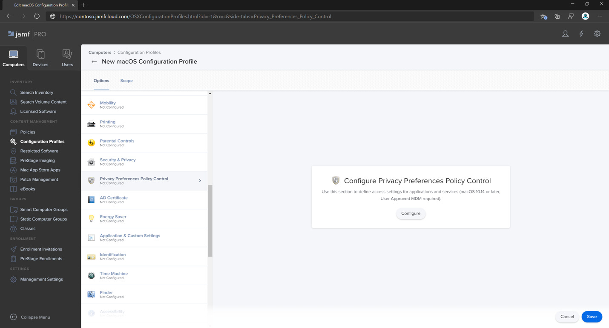
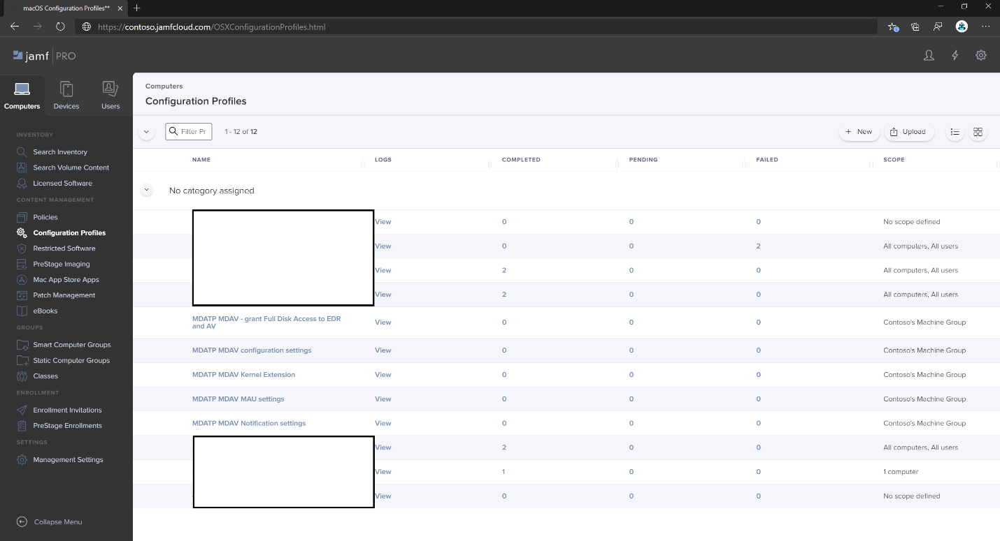
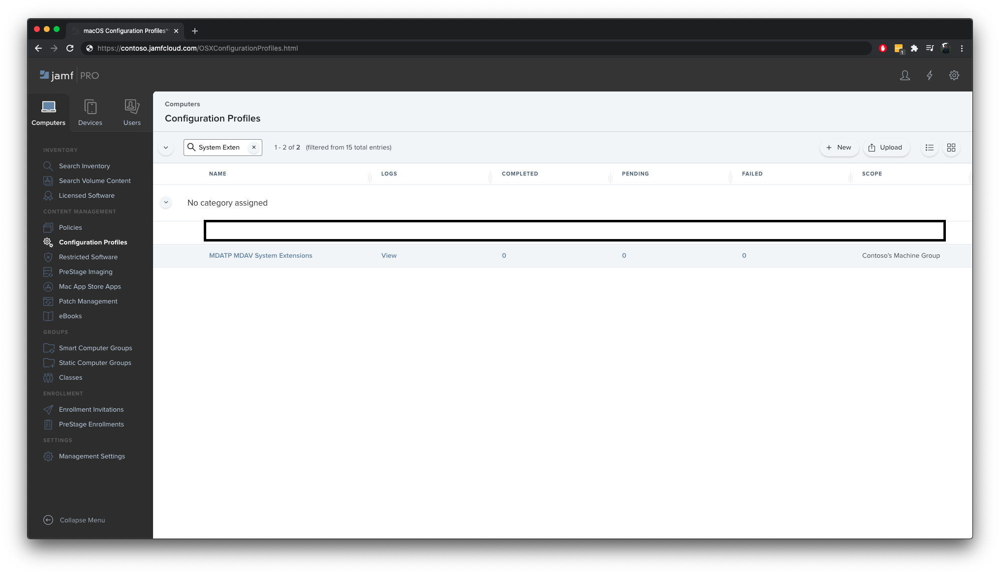
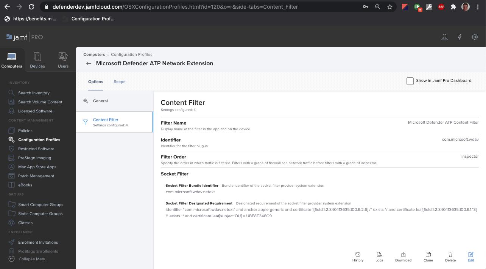

# <a name="set-up-the-microsoft-defender-for-endpoint-on-macos-policies-in-jamf-pro"></a>Jamf 2013에서 macOS에서 끝점에 대한 Microsoft Defender Pro

[!INCLUDE [Microsoft 365 Defender rebranding](../../includes/microsoft-defender.md)]


**적용 대상:**

- [Mac의 끝점용 Defender](microsoft-defender-endpoint-mac.md)

이 페이지에서는 Jamf 2013에서 macOS 정책을 설정하는 데 필요한 단계를 Pro.

다음 단계를 수행해야 합니다.

1. [끝점용 Microsoft Defender 온보딩 패키지 다운로드](#step-1-get-the-microsoft-defender-for-endpoint-onboarding-package)
2. [온보더링 패키지를 사용하여 Jamf Pro 구성 프로필 만들기](#step-2-create-a-configuration-profile-in-jamf-pro-using-the-onboarding-package)
3. [끝점 설정에 맞게 Microsoft Defender 구성](#step-3-configure-microsoft-defender-for-endpoint-settings)
4. [끝점 알림 설정에 맞게 Microsoft Defender 구성](#step-4-configure-notifications-settings)
5. [MAU(Microsoft 자동 업데이트) 구성](#step-5-configure-microsoft-autoupdate-mau)
6. [끝점용 Microsoft Defender에 대한 전체 디스크 액세스 권한 부여](#step-6-grant-full-disk-access-to-microsoft-defender-for-endpoint)
7. [끝점용 Microsoft Defender에 대한 커널 확장 승인](#step-7-approve-kernel-extension-for-microsoft-defender-for-endpoint)
8. [끝점용 Microsoft Defender에 대한 시스템 확장 승인](#step-8-approve-system-extensions-for-microsoft-defender-for-endpoint)
9. [네트워크 확장 구성](#step-9-configure-network-extension)
10. [MacOS의 끝점에 대한 Microsoft Defender 검사 예약](/windows/security/threat-protection/microsoft-defender-atp/mac-schedule-scan-atp)
11. [macOS에서 끝점용 Microsoft Defender 배포](#step-11-deploy-microsoft-defender-for-endpoint-on-macos)

## <a name="step-1-get-the-microsoft-defender-for-endpoint-onboarding-package"></a>1단계: 끝점용 Microsoft Defender 온보딩 패키지 다운로드

1. 에서 [Microsoft Defender 보안 센터](https://securitycenter.microsoft.com)에서 **온보 설정 > 로 이동합니다.**

2. 운영 체제로 macOS를 선택하고 배포 방법으로 모바일 Microsoft Intune/를 선택합니다.

    

3. **온보더링 패키지 다운로드(WindowsDefenderATPOnboardingPackage.zip).**

4. 추출 `WindowsDefenderATPOnboardingPackage.zip` .

5. 파일을 원하는 위치에 복사합니다. 예를 들면 `C:\Users\JaneDoe_or_JohnDoe.contoso\Downloads\WindowsDefenderATPOnboardingPackage_macOS_MDM_contoso\jamf\WindowsDefenderATPOnboarding.plist`와 같습니다.

## <a name="step-2-create-a-configuration-profile-in-jamf-pro-using-the-onboarding-package"></a>2단계: 온보더링 패키지를 사용하여 Jamf Pro 프로필 만들기

1. 이전 `WindowsDefenderATPOnboarding.plist` 섹션에서 파일을 찾습니다.

   

2. Jamf Pro 대시보드에서 새로 만들 를 **선택합니다.**

    

3. 다음 세부 정보를 입력합니다.

   **일반**:

   - 이름: macOS용 MDATP 온보드
   - 설명: macOS용 EDR MDATP 관리
   - 범주: 없음
   - 배포 방법: 자동으로 설치
   - 수준: 컴퓨터 수준

4. 응용 **프로그램 & 사용자 지정 설정** 구성을 **선택합니다.**

    

5. 기본 **업로드 파일(PLIST 파일)을** 선택한 다음 기본 설정 **도메인에** 다음을 입력합니다. `com.microsoft.wdav.atp` .

    

    

6. 열기 **를** 선택하고 온보더링 파일을 선택합니다.

    

7. 를 **업로드.**

    

8. 범위 **탭을** 선택합니다.

    

9. 대상 컴퓨터를 선택합니다.

    

    

10. **저장** 을 선택합니다.

    

    

11. **완료** 를 선택합니다.

    

    

## <a name="step-3-configure-microsoft-defender-for-endpoint-settings"></a>3단계: 끝점 설정에 맞게 Microsoft Defender 구성

JAMF Pro GUI를 사용하여 Microsoft Defender 구성의 개별 설정을 편집하거나 텍스트 편집기에서 구성 Plist를 만들고 JAMF 2013에 업로드하여 레거시 메서드를 Pro.

기본 설정 도메인과 정확히 일치해야 합니다. Microsoft Defender는 이 이름만 사용하며 관리되는 설정을 `com.microsoft.wdav`  `com.microsoft.wdav.ext` 로드합니다.

GUI 메서드를 사용하려면 드물게 버전이 사용될 수 있지만 아직 Schema에 추가되지 않은 설정을 구성해야 `com.microsoft.wdav.ext` 합니다.

### <a name="gui-method"></a>GUI 메서드

1. Defender schema.js저장소에서 [](https://github.com/microsoft/mdatp-xplat/tree/master/macos/schema) 파일에 GitHub 다운로드하고 로컬 파일에 저장합니다.

    ```bash
    curl -o ~/Documents/schema.json https://raw.githubusercontent.com/microsoft/mdatp-xplat/master/macos/schema/schema.json
    ```

2. 컴퓨터 -> 구성 프로필 아래에 새 구성 프로필을 만들고 일반 탭에 다음 세부 **정보를 입력합니다.**

    

    - 이름: MDATP MDAV 구성 설정
    - 설명:\<blank\>
    - 범주: 없음(기본값)
    - 수준: 컴퓨터 수준(기본값)
    - 배포 방법: 자동으로 설치(기본값)

3. **아래로 스크롤하여 Application & 사용자** 설정 탭으로 이동한 다음  외부 응용 프로그램을 선택하고 **사용자** 지정 **Schema를** 원본으로 사용하여 기본 설정 도메인에 사용합니다.

    

4. 기본 `com.microsoft.wdav` 설정 도메인으로 입력하고,  1단계에서 다운로드한 업로드 schema.js추가를 클릭합니다.  **저장** 을 클릭합니다.

    

5. 기본 설정 도메인 속성 아래에서 지원되는 모든 Microsoft Defender 구성 **설정을 볼 수 있습니다.** 속성 **추가/제거를** 클릭하여 관리하려는 설정을 선택하고 확인을  클릭하여 변경 내용을 저장합니다. (설정 선택하지 않은 왼쪽은 관리 구성에 포함되지 않을 경우 최종 사용자는 자신의 컴퓨터의 해당 설정을 구성할 수 있습니다.)

    

6. 설정 값을 원하는 값으로 변경합니다. 추가 정보를 **클릭하여** 특정 설정에 대한 설명서를 얻을 수 있습니다. Plist 미리 보기를 클릭하여 구성 **plist의** 모양을 검사할 수 있습니다. 양식 **편집기를 클릭하여** 시각적 편집기로 돌아온다.

    

7. 범위 **탭을** 선택합니다.

    

8. **Contoso의 컴퓨터 그룹을 선택합니다.**

9. **추가를** 선택한 다음 **저장을 선택합니다.**

    

    

10. **완료** 를 선택합니다. 새 구성 **프로필이 표시됩니다.**

    

Microsoft Defender는 시간이 지날 때 새 설정을 추가합니다. 이러한 새 설정은 새 버전이 Github에 게시됩니다.
업데이트하기만 하면 업데이트된 스마마를 다운로드하고, 기존 구성 프로필을 편집하고, **Application & 사용자** 지정 설정만하면 됩니다. 

### <a name="legacy-method"></a>레거시 메서드

1. 끝점 구성 설정에 대해 다음 Microsoft Defender를 사용합니다.

    - enableRealTimeProtection
    - passiveMode

    > [!NOTE]
    > macOS용 타사 AV를 실행하기 위해 계획하는 경우 기본적으로 켜져 있지 않습니다. 를 로 `true` 설정

    - 제외
    - excludedPath
    - excludedFileExtension
    - excludedFileName
    - exclusionsMergePolicy
    - allowedThreats

    > [!NOTE]
    > EICAR이 샘플에 있습니다. 개념 증명을 진행하는 경우 EICAR을 테스트하는 경우 EICAR을 제거합니다.

    - disallowedThreatActions
    - potentially_unwanted_application
    - archive_bomb
    - cloudService
    - automaticSampleSubmission
    - tags
    - hideStatusMenuIcon

     자세한 내용은 [JAMF 전체 구성 프로필에 대한 속성 목록을 참조하세요.](mac-preferences.md#property-list-for-jamf-full-configuration-profile)

     ```XML
     <?xml version="1.0" encoding="UTF-8"?>
     <!DOCTYPE plist PUBLIC "-//Apple//DTD PLIST 1.0//EN" "http://www.apple.com/DTDs/PropertyList-1.0.dtd">
     <plist version="1.0">
     <dict>
         <key>antivirusEngine</key>
         <dict>
             <key>enableRealTimeProtection</key>
             <true/>
             <key>passiveMode</key>
             <false/>
             <key>exclusions</key>
             <array>
                 <dict>
                     <key>$type</key>
                     <string>excludedPath</string>
                     <key>isDirectory</key>
                     <false/>
                     <key>path</key>
                     <string>/var/log/system.log</string>
                 </dict>
                 <dict>
                     <key>$type</key>
                     <string>excludedPath</string>
                     <key>isDirectory</key>
                     <true/>
                     <key>path</key>
                     <string>/home</string>
                 </dict>
                 <dict>
                     <key>$type</key>
                     <string>excludedFileExtension</string>
                     <key>extension</key>
                     <string>pdf</string>
                 </dict>
                 <dict>
                     <key>$type</key>
                     <string>excludedFileName</string>
                     <key>name</key>
                     <string>cat</string>
                 </dict>
             </array>
             <key>exclusionsMergePolicy</key>
             <string>merge</string>
             <key>allowedThreats</key>
             <array>
                 <string>EICAR-Test-File (not a virus)</string>
             </array>
             <key>disallowedThreatActions</key>
             <array>
                 <string>allow</string>
                 <string>restore</string>
             </array>
             <key>threatTypeSettings</key>
             <array>
                 <dict>
                     <key>key</key>
                     <string>potentially_unwanted_application</string>
                     <key>value</key>
                     <string>block</string>
                 </dict>
                 <dict>
                     <key>key</key>
                     <string>archive_bomb</string>
                     <key>value</key>
                     <string>audit</string>
                 </dict>
             </array>
             <key>threatTypeSettingsMergePolicy</key>
             <string>merge</string>
         </dict>
         <key>cloudService</key>
         <dict>
             <key>enabled</key>
             <true/>
             <key>diagnosticLevel</key>
             <string>optional</string>
             <key>automaticSampleSubmission</key>
             <true/>
         </dict>
         <key>edr</key>
         <dict>
             <key>tags</key>
             <array>
                 <dict>
                     <key>key</key>
                     <string>GROUP</string>
                     <key>value</key>
                     <string>ExampleTag</string>
                 </dict>
             </array>
         </dict>
         <key>userInterface</key>
         <dict>
             <key>hideStatusMenuIcon</key>
             <false/>
         </dict>
     </dict>
     </plist>
     ```

2. 파일을 로 `MDATP_MDAV_configuration_settings.plist` 저장합니다.

3. Jamf Pro 대시보드에서 **컴퓨터** 를 열고 구성 **프로필이 있습니다.** **New()를* 클릭하고 **일반 탭으로** 전환합니다.

    

4. 다음 세부 정보를 입력합니다.

    **일반**

    - 이름: MDATP MDAV 구성 설정
    - 설명:\<blank\>
    - 범주: 없음(기본값)
    - 배포 방법: 자동으로 설치(기본값)
    - 수준: 컴퓨터 수준(기본값)

    

5. 응용 **프로그램 & 사용자 지정 설정** 구성을 **선택합니다.**

    

6. 파일 **업로드(PLIST 파일)를 선택합니다.**

    

7. 기본 **설정 도메인에서** `com.microsoft.wdav` 를 입력한 다음 **PLIST 업로드 선택합니다.**

    

8. 파일 **선택 을 선택합니다.**

    

9. **MDATP_MDAV_configuration_settings.plist를 선택한** 다음 **열기 를 선택합니다.**

    

10. 를 **업로드.**

    

    

    > [!NOTE]
    > Intune 파일을 업로드하는 경우 다음 오류가 발생합니다.
    >
    >

11. **저장** 을 선택합니다.

    

12. 파일이 업로드됩니다.

    

    

13. 범위 **탭을** 선택합니다.

    

14. **Contoso의 컴퓨터 그룹을 선택합니다.**

15. **추가를** 선택한 다음 **저장을 선택합니다.**

    

    

16. **완료** 를 선택합니다. 새 구성 **프로필이 표시됩니다.**

    

## <a name="step-4-configure-notifications-settings"></a>4단계: 알림 설정 구성

이러한 단계는 macOS 10.15(카탈로니아) 이상에서 적용할 수 있습니다.

1. Jamf Pro 대시보드에서 **컴퓨터,** 구성 **프로필을 선택합니다.**

2. 새로 **추가를** 클릭하고 옵션에 대해 다음 세부 정보를 **입력합니다.**

    - Tab **일반**:
        - **이름:** MDATP MDAV 알림 설정
        - **설명:** macOS 10.15(카탈로니아) 이상
        - **범주:** *없음(기본값)*
        - **배포 방법:** 자동으로 *설치(기본값)*
        - **수준:** 컴퓨터 *수준(기본값)*

        

    - 탭 **알림,** **추가를 클릭하고** 다음 값을 입력합니다.
        - **번들 ID**: `com.microsoft.wdav.tray`
        - **중요 경고:** 사용 안 **하게를 클릭합니다.**
        - **알림:** 사용 **클릭**
        - **배너 경고 유형:** 포함 **및** 임시 *선택(기본값)* 
        - **잠금 화면의 알림:** **숨기기 클릭**
        - **알림 센터의 알림:** 표시 **클릭**
        - **배지 앱 아이콘:** 표시 **클릭**

        

    - 탭 **알림,** **한** 번 더 추가를 클릭하고 새 알림 페이지로 **설정**
        - **번들 ID**: `com.microsoft.autoupdate2`
        - 나머지 설정은 위의 값과 동일한 값으로 구성합니다.

        

        이제 알림 구성이 있는 '테이블'이 두 개 있습니다. 하나는 번들 **ID인 com.microsoft.wdav.tray,** 다른 하나는 **com.microsoft.autoupdate2입니다.** 요구 사항에 따라 경고 설정을 구성할 수 있는 동안 번들 ID는 앞에서 설명한 그대로 동일해야 합니다. **또한 알림의** 경우 Include 스위치가 **켜기(On)되어야 합니다.** 

3. 범위 **탭을** 선택한 다음 추가를 **선택합니다.**

    

4. **Contoso의 컴퓨터 그룹을 선택합니다.**

5. **추가를** 선택한 다음 **저장을 선택합니다.**

    

    

6. **완료** 를 선택합니다. 새 구성 **프로필이 표시됩니다.**

    

## <a name="step-5-configure-microsoft-autoupdate-mau"></a>5단계: MAU(Microsoft 자동 업데이트) 구성

1. 끝점 구성 설정에 대해 다음 Microsoft Defender를 사용합니다.

      ```XML
   <?xml version="1.0" encoding="UTF-8"?>
   <!DOCTYPE plist PUBLIC "-//Apple//DTD PLIST 1.0//EN" "http://www.apple.com/DTDs/PropertyList-1.0.dtd">
   <plist version="1.0">
   <dict>
    <key>ChannelName</key>
    <string>Current</string>
    <key>HowToCheck</key>
    <string>AutomaticDownload</string>
    <key>EnableCheckForUpdatesButton</key>
    <true/>
    <key>DisableInsiderCheckbox</key>
    <false/>
    <key>SendAllTelemetryEnabled</key>
    <true/>
   </dict>
   </plist>
   ```

2. 으로 `MDATP_MDAV_MAU_settings.plist` 저장합니다.

3. Jamf Pro 대시보드에서 일반 을 **선택합니다.**

    

4. 다음 세부 정보를 입력합니다.

    **일반**

    - 이름: MDATP MDAV MAU 설정
    - 설명: MacOS용 MDATP에 대한 Microsoft 자동 업데이트 설정
    - 범주: 없음(기본값)
    - 배포 방법: 자동으로 설치(기본값)
    - 수준: 컴퓨터 수준(기본값)

5. 응용 **프로그램 & 사용자 지정 설정** 구성을 **선택합니다.**

    

6. 파일 **업로드(PLIST 파일)를 선택합니다.**

    

7. 기본 **설정 도메인에** 다음을 입력한 다음 `com.microsoft.autoupdate2` **PLIST 업로드 선택합니다.**

    

8. 파일 **선택 을 선택합니다.**

    

9. **MDATP_MDAV_MAU_settings.plist 를 선택합니다.**

    

10. 를 **업로드.**
    

    

11. **저장** 을 선택합니다.

    

12. 범위 **탭을** 선택합니다.

     

13. **추가** 를 선택합니다.

    

    

    

14. **완료** 를 선택합니다.

    

## <a name="step-6-grant-full-disk-access-to-microsoft-defender-for-endpoint"></a>6단계: 끝점용 Microsoft Defender에 대한 전체 디스크 액세스 권한 부여

1. Jamf Pro 대시보드에서 **구성 프로필 을 선택합니다.**

    

2. **+ 새로 고치기 를 선택합니다.**

3. 다음 세부 정보를 입력합니다.

    **일반**
    - 이름: MDATP MDAV - 모든 디스크 액세스 권한을 EDR 및 AV
    - 설명: macOS 카탈로니아 이상에서 새로운 개인 정보 기본 설정 정책 컨트롤
    - 범주: 없음
    - 배포 방법: 자동으로 설치
    - 수준: 컴퓨터 수준

    

4. 개인 **정보 기본 설정 정책 제어 구성에서** **구성을 선택합니다.**

    

5. 개인 **정보 기본 설정 정책 제어에서** 다음 세부 정보를 입력합니다.

    - 식별자: `com.microsoft.wdav`
    - 식별자 유형: 번들 ID
    - 코드 요구 사항: `identifier "com.microsoft.wdav" and anchor apple generic and certificate 1[field.1.2.840.113635.100.6.2.6] /* exists */ and certificate leaf[field.1.2.840.113635.100.6.1.13] /* exists */ and certificate leaf[subject.OU] = UBF8T346G9`

    

6. **+ 추가** 를 선택합니다.

    

    - 앱 또는 서비스에서: **SystemPolicyAllFiles로 설정**

    - "액세스"에서: 허용으로 **설정**

7. 저장을 **선택합니다(오른쪽** 아래에 있는 저장 안 ).

    

8. 앱 `+` 액세스 옆의 **기호를 클릭하여** 새 항목을 추가합니다.

    

9. 다음 세부 정보를 입력합니다.

    - 식별자: `com.microsoft.wdav.epsext`
    - 식별자 유형: 번들 ID
    - 코드 요구 사항: `identifier "com.microsoft.wdav.epsext" and anchor apple generic and certificate 1[field.1.2.840.113635.100.6.2.6] /* exists */ and certificate leaf[field.1.2.840.113635.100.6.1.13] /* exists */ and certificate leaf[subject.OU] = UBF8T346G9`

10. **+ 추가** 를 선택합니다.

    

    - 앱 또는 서비스에서: **SystemPolicyAllFiles로 설정**

    - "액세스"에서: 허용으로 **설정**

11. 저장을 **선택합니다(오른쪽** 아래에 있는 저장 안 ).

    

12. 범위 **탭을** 선택합니다.

    

13. **+ 추가** 를 선택합니다.

    

14. 그룹 **이름 >** 컴퓨터  그룹 > **Contoso의 MachineGroup을 선택합니다.**

    

15. **추가** 를 선택합니다.

16. **저장** 을 선택합니다.

17. **완료** 를 선택합니다.

    

    

또는 Jamf 2013을 사용하여 사용자 지정 구성 프로필 배포에 설명된 바와 같이 [fulldisk.mobileconfig를](https://github.com/microsoft/mdatp-xplat/blob/master/macos/mobileconfig/profiles/fulldisk.mobileconfig) 다운로드하여 JAMF 구성 프로필에 [업로드할 Pro| 방법 2: 업로드 프로필을 Jamf](https://www.jamf.com/jamf-nation/articles/648/deploying-custom-configuration-profiles-using-jamf-pro)Pro.

## <a name="step-7-approve-kernel-extension-for-microsoft-defender-for-endpoint"></a>7단계: 끝점용 Microsoft Defender에 대한 커널 확장 승인

> [!CAUTION]
> Apple 실리콘(M1) 장치는 KEXT를 지원하지 않습니다. 이러한 장치에서는 KEXT 정책으로 구성된 구성 프로필을 설치하지 못합니다.

1. 구성 **프로필에서**+ **새로 고치기 를 선택합니다.**

    

2. 다음 세부 정보를 입력합니다.

    **일반**

    - 이름: MDATP MDAV 커널 확장
    - 설명: MDATP 커널 확장(kext)
    - 범주: 없음
    - 배포 방법: 자동으로 설치
    - 수준: 컴퓨터 수준

    

3. 승인된 커널 확장 **구성에서** 구성을 **선택합니다.**

    

4. 승인된 **커널 확장에** 다음 세부 정보를 입력합니다.

    - 표시 이름: Microsoft Corp.
    - 팀 ID: UBF8T346G9

    

5. 범위 **탭을** 선택합니다.

    

6. **+ 추가** 를 선택합니다.

7. 컴퓨터 **그룹 >** 그룹  > **Contoso의 컴퓨터** 그룹을 선택합니다.

8. **+ 추가** 를 선택합니다.

    

9. **저장** 을 선택합니다.

    

10. **완료** 를 선택합니다.

    

또는 Jamf 2013을 사용하여 사용자 지정 구성 프로필 배포에 설명된 바와 같이 [kext.mobileconfig를](https://github.com/microsoft/mdatp-xplat/blob/master/macos/mobileconfig/profiles/kext.mobileconfig) 다운로드하여 JAMF 구성 프로필에 [업로드할 Pro| 방법 2: 업로드 프로필을 Jamf](https://www.jamf.com/jamf-nation/articles/648/deploying-custom-configuration-profiles-using-jamf-pro)Pro.

## <a name="step-8-approve-system-extensions-for-microsoft-defender-for-endpoint"></a>8단계: 끝점용 Microsoft Defender의 시스템 확장 승인

1. 구성 **프로필에서**+ **새로 고치기 를 선택합니다.**

    

2. 다음 세부 정보를 입력합니다.

    **일반**

    - 이름: MDATP MDAV 시스템 확장
    - 설명: MDATP 시스템 확장
    - 범주: 없음
    - 배포 방법: 자동으로 설치
    - 수준: 컴퓨터 수준

    

3. 시스템 **확장에서** **구성을 선택합니다.**

   

4. 시스템 **확장에** 다음 세부 정보를 입력합니다.

   - 표시 이름: Microsoft Corp. 시스템 확장
   - 시스템 확장 유형: 허용되는 시스템 확장
   - 팀 식별자: UBF8T346G9
   - 허용되는 시스템 확장:
     - **com.microsoft.wdav.epsext**
     - **com.microsoft.wdav.netext**

    

5. 범위 **탭을** 선택합니다.

    

6. **+ 추가** 를 선택합니다.

7. 컴퓨터 **그룹 >** 그룹  > **Contoso의 컴퓨터** 그룹을 선택합니다.

8. **+ 추가** 를 선택합니다.

   

9. **저장** 을 선택합니다.

   

10. **완료** 를 선택합니다.

    

## <a name="step-9-configure-network-extension"></a>9단계: 네트워크 확장 구성

끝점 검색 및 응답 기능의 일부로 macOS의 끝점용 Microsoft Defender는 소켓 트래픽을 검사하고 이 정보를 Microsoft Defender 보안 센터 포털에 보고합니다. 다음 정책은 네트워크 확장에서 이 기능을 수행할 수 있습니다.

이러한 단계는 macOS 10.15(카탈로니아) 이상에서 적용할 수 있습니다.

1. Jamf Pro 대시보드에서 **컴퓨터,** 구성 **프로필을 선택합니다.**

2. 새로 **추가를** 클릭하고 옵션에 대해 다음 세부 정보를 **입력합니다.**

    - Tab **일반**:
        - **이름:** Microsoft Defender ATP 네트워크 확장
        - **설명:** macOS 10.15(카탈로니아) 이상
        - **범주:** *없음(기본값)*
        - **배포 방법:** 자동으로 *설치(기본값)*
        - **수준:** 컴퓨터 *수준(기본값)*

    - 탭 **콘텐츠 필터**:
        - **필터 이름:** Microsoft Defender ATP 콘텐츠 필터
        - **식별자**: `com.microsoft.wdav`
        - 서비스 **주소,** **조직,** **사용자 이름,** **암호,** **인증서** 비워 두기(포함이 *선택되지* 않았습니다.
        - **필터 순서:** 검사기
        - **소켓 필터**: `com.microsoft.wdav.netext`
        - **소켓 필터 지정된 요구 사항**: `identifier "com.microsoft.wdav.netext" and anchor apple generic and certificate 1[field.1.2.840.113635.100.6.2.6] /* exists */ and certificate leaf[field.1.2.840.113635.100.6.1.13] /* exists */ and certificate leaf[subject.OU] = UBF8T346G9`
        - 네트워크 **필터 필드를 비워** 두십시오(**포함이** *선택되어 있지* 않습니다.

        **식별자,** **소켓 필터** 및 **소켓 필터** 지정된 요구 사항의 정확한 값은 위에 지정된 값입니다.

        

3. 범위 **탭을** 선택합니다.

   

4. **+ 추가** 를 선택합니다.

5. 컴퓨터 **그룹 >** 그룹  > **Contoso의 컴퓨터** 그룹을 선택합니다.

6. **+ 추가** 를 선택합니다.

    

7. **저장** 을 선택합니다.

    

8. **완료** 를 선택합니다.

    

또는 Jamf 구성 프로필을 사용하여 사용자 지정 구성 프로필 배포에 설명된 바와 같이 [netfilter.mobileconfig를](https://github.com/microsoft/mdatp-xplat/blob/master/macos/mobileconfig/profiles/netfilter.mobileconfig) 다운로드하여 JAMF 구성 프로필에 업로드할 [Pro| 방법 2: 업로드 프로필을 Jamf](https://www.jamf.com/jamf-nation/articles/648/deploying-custom-configuration-profiles-using-jamf-pro)Pro.

## <a name="step-10-schedule-scans-with-microsoft-defender-for-endpoint-on-macos"></a>10단계: MacOS의 끝점에 대한 Microsoft Defender 검사 예약

[MacOS의 끝점에 대한 Microsoft Defender 검사 예약에 대한 지침을 따릅니다.](/windows/security/threat-protection/microsoft-defender-atp/mac-schedule-scan-atp)

## <a name="step-11-deploy-microsoft-defender-for-endpoint-on-macos"></a>11단계: macOS에서 끝점용 Microsoft Defender 배포

1. 을 저장한 위치로 `wdav.pkg` 이동합니다.

    

2. 이름을 로 다시 `wdav_MDM_Contoso_200329.pkg` 합니다.

    

3. Jamf Pro 를 열 수 있습니다.

    

4. 컴퓨터를 선택하고 맨 위에 있는 기어 아이콘을 클릭한 다음 컴퓨터 관리를 **선택합니다.**

    

5. 패키지에서 **+ 새로 고치기 를 선택합니다.** 
    

6. 새 **패키지에** 다음 세부 정보를 입력합니다.

    **일반 탭**
    - 표시 이름: 지금은 비워 두십시오. pkg를 선택하면 초기화됩니다.
    - 범주: 없음(기본값)
    - 파일 이름: 파일 선택

    

    파일을 열고 또는 을(를) `wdav.pkg` 지점으로 `wdav_MDM_Contoso_200329.pkg` 합니다.

    

7. **열기** 를 선택합니다. 표시 **이름을** **Microsoft Defender Advanced Threat Protection으로 설정하고** Microsoft Defender 바이러스 백신.

    **매니페스트 파일은** 필요하지 않습니다. 끝점용 Microsoft Defender는 매니페스트 파일 없이 작동합니다.

    **옵션 탭:** 기본값을 유지 합니다.

    **제한 탭:** 기본값을 유지 합니다.

     

8. **저장** 을 선택합니다. 패키지가 Jamf 2013에 Pro.

   

   패키지를 배포하는 데 몇 분 정도 걸릴 수 있습니다.

   

9. 정책 **페이지로** 이동합니다.

    

10. **+ 새로 만들기를 선택하여** 새 정책을 만들 수 있습니다.

    


11. **일반에서** 다음 세부 정보를 입력합니다.

    - 표시 이름: MDATP 온보드 Contoso 200329 v100.86.92 이상

    

12. 재발 **체크 인 을 선택합니다.**

    

13. **저장** 을 선택합니다.

14. 패키지를 **> 구성합니다.**

    

15. Microsoft  **Defender Advanced Threat Protection** 옆에 있는 추가 단추를 선택하고 Microsoft Defender 바이러스 백신.

    

16. **저장** 을 선택합니다.

    

17. 범위 **탭을** 선택합니다.

    

18. 대상 컴퓨터를 선택합니다.

    

    **범위**

    **추가** 를 선택합니다.

    

    

    **셀프 서비스**

    

19. **완료** 를 선택합니다.

    

    
