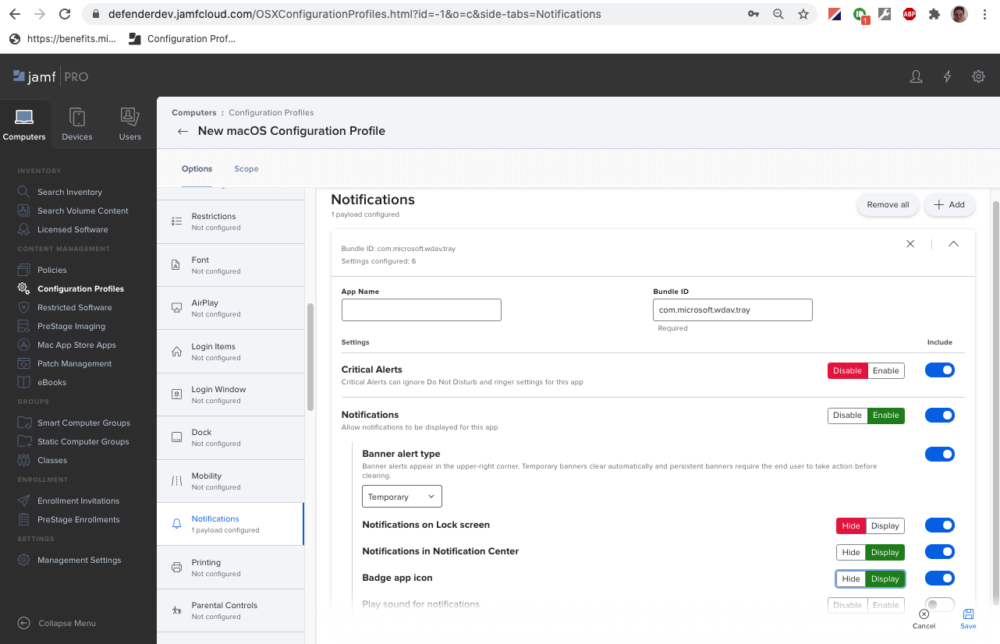
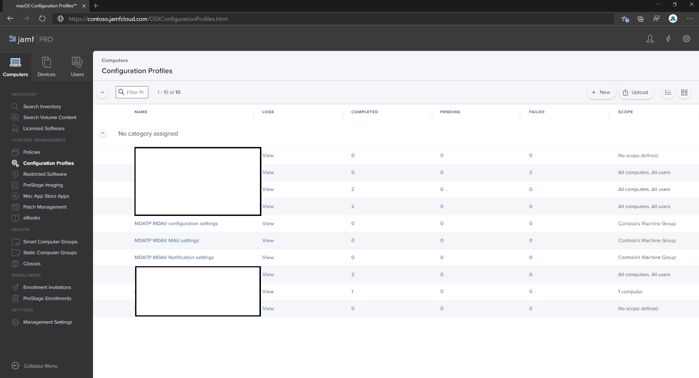
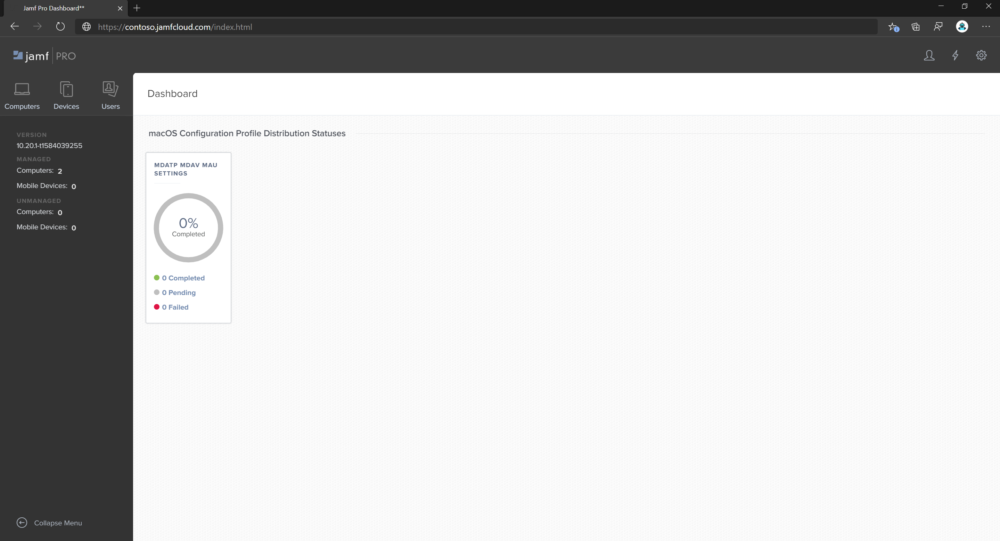

# <a name="set-up-the-microsoft-defender-for-endpoint-on-macos-policies-in-jamf-pro"></a><span data-ttu-id="3e664-104">Jamf 2013에서 macOS에서 끝점에 대한 Microsoft Defender Pro</span><span class="sxs-lookup"><span data-stu-id="3e664-104">Set up the Microsoft Defender for Endpoint on macOS policies in Jamf Pro</span></span>

[!INCLUDE [Microsoft 365 Defender rebranding](../../includes/microsoft-defender.md)]


<span data-ttu-id="3e664-105">**적용 대상:**</span><span class="sxs-lookup"><span data-stu-id="3e664-105">**Applies to:**</span></span>

- [<span data-ttu-id="3e664-106">Mac의 끝점용 Defender</span><span class="sxs-lookup"><span data-stu-id="3e664-106">Defender for Endpoint on Mac</span></span>](microsoft-defender-endpoint-mac.md)

<span data-ttu-id="3e664-107">이 페이지에서는 Jamf 2013에서 macOS 정책을 설정하는 데 필요한 단계를 Pro.</span><span class="sxs-lookup"><span data-stu-id="3e664-107">This page will guide you through the steps you need to take to set up macOS policies in Jamf Pro.</span></span>

<span data-ttu-id="3e664-108">다음 단계를 수행해야 합니다.</span><span class="sxs-lookup"><span data-stu-id="3e664-108">You'll need to take the following steps:</span></span>

1. [<span data-ttu-id="3e664-109">끝점용 Microsoft Defender 온보딩 패키지 다운로드</span><span class="sxs-lookup"><span data-stu-id="3e664-109">Get the Microsoft Defender for Endpoint onboarding package</span></span>](#step-1-get-the-microsoft-defender-for-endpoint-onboarding-package)

2. [<span data-ttu-id="3e664-110">온보더링 패키지를 사용하여 Jamf Pro 구성 프로필 만들기</span><span class="sxs-lookup"><span data-stu-id="3e664-110">Create a configuration profile in Jamf Pro using the onboarding package</span></span>](#step-2-create-a-configuration-profile-in-jamf-pro-using-the-onboarding-package)

3. [<span data-ttu-id="3e664-111">끝점 설정에 맞게 Microsoft Defender 구성</span><span class="sxs-lookup"><span data-stu-id="3e664-111">Configure Microsoft Defender for Endpoint settings</span></span>](#step-3-configure-microsoft-defender-for-endpoint-settings)

4. [<span data-ttu-id="3e664-112">끝점 알림 설정에 맞게 Microsoft Defender 구성</span><span class="sxs-lookup"><span data-stu-id="3e664-112">Configure Microsoft Defender for Endpoint notification settings</span></span>](#step-4-configure-notifications-settings)

5. [<span data-ttu-id="3e664-113">MAU(Microsoft 자동 업데이트) 구성</span><span class="sxs-lookup"><span data-stu-id="3e664-113">Configure Microsoft AutoUpdate (MAU)</span></span>](#step-5-configure-microsoft-autoupdate-mau)

6. [<span data-ttu-id="3e664-114">끝점용 Microsoft Defender에 대한 전체 디스크 액세스 권한 부여</span><span class="sxs-lookup"><span data-stu-id="3e664-114">Grant full disk access to Microsoft Defender for Endpoint</span></span>](#step-6-grant-full-disk-access-to-microsoft-defender-for-endpoint)

7. [<span data-ttu-id="3e664-115">끝점용 Microsoft Defender에 대한 커널 확장 승인</span><span class="sxs-lookup"><span data-stu-id="3e664-115">Approve Kernel extension for Microsoft Defender for Endpoint</span></span>](#step-7-approve-kernel-extension-for-microsoft-defender-for-endpoint)

8. [<span data-ttu-id="3e664-116">끝점용 Microsoft Defender에 대한 시스템 확장 승인</span><span class="sxs-lookup"><span data-stu-id="3e664-116">Approve System extensions for Microsoft Defender for Endpoint</span></span>](#step-8-approve-system-extensions-for-microsoft-defender-for-endpoint)

9. [<span data-ttu-id="3e664-117">네트워크 확장 구성</span><span class="sxs-lookup"><span data-stu-id="3e664-117">Configure Network Extension</span></span>](#step-9-configure-network-extension)

10. [<span data-ttu-id="3e664-118">MacOS의 끝점에 대한 Microsoft Defender 검사 예약</span><span class="sxs-lookup"><span data-stu-id="3e664-118">Schedule scans with Microsoft Defender for Endpoint on macOS</span></span>](/windows/security/threat-protection/microsoft-defender-atp/mac-schedule-scan-atp)

11. [<span data-ttu-id="3e664-119">macOS에서 끝점용 Microsoft Defender 배포</span><span class="sxs-lookup"><span data-stu-id="3e664-119">Deploy Microsoft Defender for Endpoint on macOS</span></span>](#step-11-deploy-microsoft-defender-for-endpoint-on-macos)


## <a name="step-1-get-the-microsoft-defender-for-endpoint-onboarding-package"></a><span data-ttu-id="3e664-120">1단계: 끝점용 Microsoft Defender 온보딩 패키지 다운로드</span><span class="sxs-lookup"><span data-stu-id="3e664-120">Step 1: Get the Microsoft Defender for Endpoint onboarding package</span></span>

1. <span data-ttu-id="3e664-121">에서 [Microsoft Defender 보안 센터](https://securitycenter.microsoft.com )에서 **온보 설정 > 로 이동합니다.**</span><span class="sxs-lookup"><span data-stu-id="3e664-121">In [Microsoft Defender Security Center](https://securitycenter.microsoft.com ), navigate to **Settings > Onboarding**.</span></span> 

2. <span data-ttu-id="3e664-122">운영 체제로 macOS를 선택하고 배포 방법으로 모바일 Microsoft Intune/를 선택합니다.</span><span class="sxs-lookup"><span data-stu-id="3e664-122">Select macOS as the operating system and Mobile Device Management / Microsoft Intune as the deployment method.</span></span>

    

3. <span data-ttu-id="3e664-124">**온보더링 패키지 다운로드(WindowsDefenderATPOnboardingPackage.zip).**</span><span class="sxs-lookup"><span data-stu-id="3e664-124">Select **Download onboarding package** (WindowsDefenderATPOnboardingPackage.zip).</span></span>

4. <span data-ttu-id="3e664-125">추출 `WindowsDefenderATPOnboardingPackage.zip` .</span><span class="sxs-lookup"><span data-stu-id="3e664-125">Extract `WindowsDefenderATPOnboardingPackage.zip`.</span></span>

5. <span data-ttu-id="3e664-126">파일을 원하는 위치에 복사합니다.</span><span class="sxs-lookup"><span data-stu-id="3e664-126">Copy the file to your preferred location.</span></span> <span data-ttu-id="3e664-127">예:  `C:\Users\JaneDoe_or_JohnDoe.contoso\Downloads\WindowsDefenderATPOnboardingPackage_macOS_MDM_contoso\jamf\WindowsDefenderATPOnboarding.plist`.</span><span class="sxs-lookup"><span data-stu-id="3e664-127">For example,  `C:\Users\JaneDoe_or_JohnDoe.contoso\Downloads\WindowsDefenderATPOnboardingPackage_macOS_MDM_contoso\jamf\WindowsDefenderATPOnboarding.plist`.</span></span>


## <a name="step-2-create-a-configuration-profile-in-jamf-pro-using-the-onboarding-package"></a><span data-ttu-id="3e664-128">2단계: 온보더링 패키지를 사용하여 Jamf Pro 프로필 만들기</span><span class="sxs-lookup"><span data-stu-id="3e664-128">Step 2: Create a configuration profile in Jamf Pro using the onboarding package</span></span>

1. <span data-ttu-id="3e664-129">이전 `WindowsDefenderATPOnboarding.plist` 섹션에서 파일을 찾습니다.</span><span class="sxs-lookup"><span data-stu-id="3e664-129">Locate the file `WindowsDefenderATPOnboarding.plist` from the previous section.</span></span>

   

 
2. <span data-ttu-id="3e664-131">Jamf Pro 대시보드에서 새로 만들 를 **선택합니다.**</span><span class="sxs-lookup"><span data-stu-id="3e664-131">In the Jamf Pro dashboard, select **New**.</span></span>

    

3. <span data-ttu-id="3e664-133">다음 세부 정보를 입력합니다.</span><span class="sxs-lookup"><span data-stu-id="3e664-133">Enter the following details:</span></span>

   <span data-ttu-id="3e664-134">**일반**</span><span class="sxs-lookup"><span data-stu-id="3e664-134">**General**</span></span>
   - <span data-ttu-id="3e664-135">이름: macOS용 MDATP 온보드</span><span class="sxs-lookup"><span data-stu-id="3e664-135">Name: MDATP onboarding for macOS</span></span>
   - <span data-ttu-id="3e664-136">설명: macOS용 EDR MDATP 관리</span><span class="sxs-lookup"><span data-stu-id="3e664-136">Description: MDATP EDR onboarding for macOS</span></span>
   - <span data-ttu-id="3e664-137">범주: 없음</span><span class="sxs-lookup"><span data-stu-id="3e664-137">Category: None</span></span>
   - <span data-ttu-id="3e664-138">배포 방법: 자동으로 설치</span><span class="sxs-lookup"><span data-stu-id="3e664-138">Distribution Method: Install Automatically</span></span>
   - <span data-ttu-id="3e664-139">수준: 컴퓨터 수준</span><span class="sxs-lookup"><span data-stu-id="3e664-139">Level: Computer Level</span></span>

4. <span data-ttu-id="3e664-140">응용 **프로그램 & 사용자 지정 설정** 구성을 **선택합니다.**</span><span class="sxs-lookup"><span data-stu-id="3e664-140">In **Application & Custom Settings** select **Configure**.</span></span>

    

5. <span data-ttu-id="3e664-142">기본 **업로드 파일(PLIST 파일)을** 선택한 다음 기본 설정 **도메인에** 다음을 입력합니다. `com.microsoft.wdav.atp` .</span><span class="sxs-lookup"><span data-stu-id="3e664-142">Select **Upload File (PLIST file)** then in **Preference Domain** enter: `com.microsoft.wdav.atp`.</span></span> 

    

    

6. <span data-ttu-id="3e664-145">열기 **를** 선택하고 온보더링 파일을 선택합니다.</span><span class="sxs-lookup"><span data-stu-id="3e664-145">Select **Open** and select the onboarding file.</span></span>

    

7. <span data-ttu-id="3e664-147">를 **업로드.**</span><span class="sxs-lookup"><span data-stu-id="3e664-147">Select **Upload**.</span></span> 

    

8. <span data-ttu-id="3e664-149">범위 **탭을** 선택합니다.</span><span class="sxs-lookup"><span data-stu-id="3e664-149">Select the **Scope** tab.</span></span>

    

9. <span data-ttu-id="3e664-151">대상 컴퓨터를 선택합니다.</span><span class="sxs-lookup"><span data-stu-id="3e664-151">Select the target computers.</span></span>

    

     

10. <span data-ttu-id="3e664-154">**저장** 을 선택합니다.</span><span class="sxs-lookup"><span data-stu-id="3e664-154">Select **Save**.</span></span>

    

    

11. <span data-ttu-id="3e664-157">**완료** 를 선택합니다.</span><span class="sxs-lookup"><span data-stu-id="3e664-157">Select **Done**.</span></span>

    

    

## <a name="step-3-configure-microsoft-defender-for-endpoint-settings"></a><span data-ttu-id="3e664-160">3단계: 끝점 설정에 맞게 Microsoft Defender 구성</span><span class="sxs-lookup"><span data-stu-id="3e664-160">Step 3: Configure Microsoft Defender for Endpoint settings</span></span>

<span data-ttu-id="3e664-161">JAMF Pro GUI를 사용하여 Microsoft Defender 구성의 개별 설정을 편집하거나 텍스트 편집기에서 구성 Plist를 만들고 JAMF 2013에 업로드하여 레거시 메서드를 Pro.</span><span class="sxs-lookup"><span data-stu-id="3e664-161">You can either use JAMF Pro GUI to edit individual settings of the Microsoft Defender configuration, or use the legacy method by creating a configuration Plist in a text editor, and uploading it to JAMF Pro.</span></span>

<span data-ttu-id="3e664-162">기본 설정 도메인과 정확히 일치해야 합니다. Microsoft Defender는 이 이름만 사용하며 관리되는 설정을 `com.microsoft.wdav`  `com.microsoft.wdav.ext` 로드합니다.</span><span class="sxs-lookup"><span data-stu-id="3e664-162">Note that you must use exact `com.microsoft.wdav` as the **Preference Domain**, Microsoft Defender uses only this name and `com.microsoft.wdav.ext` to load its managed settings!</span></span>

<span data-ttu-id="3e664-163">GUI 메서드를 사용하려면 드물게 버전이 사용될 수 있지만 아직 Schema에 추가되지 않은 설정을 구성해야 `com.microsoft.wdav.ext` 합니다.</span><span class="sxs-lookup"><span data-stu-id="3e664-163">(The `com.microsoft.wdav.ext` version may be used in rare cases when you prefer to use GUI method, but also need to configure a setting that has not been added to the schema yet.)</span></span>

### <a name="gui-method"></a><span data-ttu-id="3e664-164">GUI 메서드</span><span class="sxs-lookup"><span data-stu-id="3e664-164">GUI method</span></span>

1. <span data-ttu-id="3e664-165">Defender schema.js저장소에서 [](https://github.com/microsoft/mdatp-xplat/tree/master/macos/schema) 파일에 GitHub 다운로드하고 로컬 파일에 저장합니다.</span><span class="sxs-lookup"><span data-stu-id="3e664-165">Download schema.json file from [Defender's GitHub repository](https://github.com/microsoft/mdatp-xplat/tree/master/macos/schema) and save it to a local file:</span></span>

    ```bash
    curl -o ~/Documents/schema.json https://raw.githubusercontent.com/microsoft/mdatp-xplat/master/macos/schema/schema.json
    ```

2. <span data-ttu-id="3e664-166">컴퓨터 -> 구성 프로필 아래에 새 구성 프로필을 만들고 일반 탭에 다음 세부 **정보를 입력합니다.**</span><span class="sxs-lookup"><span data-stu-id="3e664-166">Create a new Configuration Profile under Computers -> Configuration Profiles, enter the following details on the **General** tab:</span></span>

    

    - <span data-ttu-id="3e664-168">이름: MDATP MDAV 구성 설정</span><span class="sxs-lookup"><span data-stu-id="3e664-168">Name: MDATP MDAV configuration settings</span></span>
    - <span data-ttu-id="3e664-169">설명:\<blank\></span><span class="sxs-lookup"><span data-stu-id="3e664-169">Description:\<blank\></span></span>
    - <span data-ttu-id="3e664-170">범주: 없음(기본값)</span><span class="sxs-lookup"><span data-stu-id="3e664-170">Category: None (default)</span></span>
    - <span data-ttu-id="3e664-171">수준: 컴퓨터 수준(기본값)</span><span class="sxs-lookup"><span data-stu-id="3e664-171">Level: Computer Level (default)</span></span>
    - <span data-ttu-id="3e664-172">배포 방법: 자동으로 설치(기본값)</span><span class="sxs-lookup"><span data-stu-id="3e664-172">Distribution Method: Install Automatically (default)</span></span>

3. <span data-ttu-id="3e664-173">**아래로 스크롤하여 Application & 사용자** 설정 탭으로 이동한 다음  외부 응용 프로그램을 선택하고 **사용자** 지정 **Schema를** 원본으로 사용하여 기본 설정 도메인에 사용합니다.</span><span class="sxs-lookup"><span data-stu-id="3e664-173">Scroll down to the **Application & Custom Settings** tab, select **External Applications**, click **Add** and use **Custom Schema** as Source to use for the preference domain.</span></span>

    

4. <span data-ttu-id="3e664-175">기본 `com.microsoft.wdav` 설정 도메인으로 입력하고,  1단계에서 다운로드한 업로드 schema.js추가를 클릭합니다. </span><span class="sxs-lookup"><span data-stu-id="3e664-175">Enter `com.microsoft.wdav` as the Preference Domain, click on **Add Schema** and **Upload** the schema.json file downloaded on Step 1.</span></span> <span data-ttu-id="3e664-176">**저장** 을 클릭합니다.</span><span class="sxs-lookup"><span data-stu-id="3e664-176">Click **Save**.</span></span>

    

5. <span data-ttu-id="3e664-178">기본 설정 도메인 속성 아래에서 지원되는 모든 Microsoft Defender 구성 **설정을 볼 수 있습니다.**</span><span class="sxs-lookup"><span data-stu-id="3e664-178">You can see all supported Microsoft Defender configuration settings below, under **Preference Domain Properties**.</span></span> <span data-ttu-id="3e664-179">속성 **추가/제거를** 클릭하여 관리하려는 설정을 선택하고 확인을  클릭하여 변경 내용을 저장합니다.</span><span class="sxs-lookup"><span data-stu-id="3e664-179">Click **Add/Remove properties** to select the settings that you want to be managed, and click **Ok** to save your changes.</span></span> <span data-ttu-id="3e664-180">(설정 선택하지 않은 왼쪽은 관리 구성에 포함되지 않을 경우 최종 사용자는 자신의 컴퓨터의 해당 설정을 구성할 수 있습니다.)</span><span class="sxs-lookup"><span data-stu-id="3e664-180">(Settings left unselected will not be included into the managed configuration, an end user will be able to configure those settings on their machines.)</span></span>

    

6. <span data-ttu-id="3e664-182">설정 값을 원하는 값으로 변경합니다.</span><span class="sxs-lookup"><span data-stu-id="3e664-182">Change values of the settings to desired values.</span></span> <span data-ttu-id="3e664-183">추가 정보를 **클릭하여** 특정 설정에 대한 설명서를 얻을 수 있습니다.</span><span class="sxs-lookup"><span data-stu-id="3e664-183">You can click **More information** to get documentation for a particular setting.</span></span> <span data-ttu-id="3e664-184">Plist 미리 보기를 클릭하여 구성 **plist의** 모양을 검사할 수 있습니다.</span><span class="sxs-lookup"><span data-stu-id="3e664-184">(You may click **Plist preview** to inspect what the configuration plist will look like.</span></span> <span data-ttu-id="3e664-185">양식 **편집기를 클릭하여** 시각적 편집기로 돌아온다.</span><span class="sxs-lookup"><span data-stu-id="3e664-185">Click **Form editor** to return to the visual editor.)</span></span>

    

7. <span data-ttu-id="3e664-187">범위 **탭을** 선택합니다.</span><span class="sxs-lookup"><span data-stu-id="3e664-187">Select the **Scope** tab.</span></span>

    

8. <span data-ttu-id="3e664-189">**Contoso의 컴퓨터 그룹을 선택합니다.**</span><span class="sxs-lookup"><span data-stu-id="3e664-189">Select **Contoso's Machine Group**.</span></span>

9. <span data-ttu-id="3e664-190">**추가를** 선택한 다음 **저장을 선택합니다.**</span><span class="sxs-lookup"><span data-stu-id="3e664-190">Select **Add**, then select **Save**.</span></span>

    

    

10. <span data-ttu-id="3e664-193">**완료** 를 선택합니다.</span><span class="sxs-lookup"><span data-stu-id="3e664-193">Select **Done**.</span></span> <span data-ttu-id="3e664-194">새 구성 **프로필이 표시됩니다.**</span><span class="sxs-lookup"><span data-stu-id="3e664-194">You'll see the new **Configuration profile**.</span></span>

    

<span data-ttu-id="3e664-196">Microsoft Defender는 시간이 지날 때 새 설정을 추가합니다.</span><span class="sxs-lookup"><span data-stu-id="3e664-196">Microsoft Defender adds new settings over time.</span></span> <span data-ttu-id="3e664-197">이러한 새 설정은 새 버전이 Github에 게시됩니다.</span><span class="sxs-lookup"><span data-stu-id="3e664-197">These new settings will be added to the schema, and a new version will be published to Github.</span></span>
<span data-ttu-id="3e664-198">업데이트하기만 하면 업데이트된 스마마를 다운로드하고, 기존 구성 프로필을 편집하고, **Application & 사용자** 지정 설정만하면 됩니다. </span><span class="sxs-lookup"><span data-stu-id="3e664-198">All you need to do to have updates is to download an updated schema, edit existing configuration profile, and **Edit schema** at the **Application & Custom Settings** tab.</span></span>

### <a name="legacy-method"></a><span data-ttu-id="3e664-199">레거시 메서드</span><span class="sxs-lookup"><span data-stu-id="3e664-199">Legacy method</span></span>

1. <span data-ttu-id="3e664-200">끝점 구성 설정에 대해 다음 Microsoft Defender를 사용합니다.</span><span class="sxs-lookup"><span data-stu-id="3e664-200">Use the following Microsoft Defender for Endpoint configuration settings:</span></span>

    - <span data-ttu-id="3e664-201">enableRealTimeProtection</span><span class="sxs-lookup"><span data-stu-id="3e664-201">enableRealTimeProtection</span></span>
    - <span data-ttu-id="3e664-202">passiveMode</span><span class="sxs-lookup"><span data-stu-id="3e664-202">passiveMode</span></span>

    >[!NOTE]
    ><span data-ttu-id="3e664-203">macOS용 타사 AV를 실행하기 위해 계획하는 경우 기본적으로 켜져 있지 않습니다. 를 로 `true` 설정</span><span class="sxs-lookup"><span data-stu-id="3e664-203">Not turned on by default, if you are planning to run a third-party AV for macOS, set it to `true`.</span></span>

    - <span data-ttu-id="3e664-204">제외</span><span class="sxs-lookup"><span data-stu-id="3e664-204">exclusions</span></span>
    - <span data-ttu-id="3e664-205">excludedPath</span><span class="sxs-lookup"><span data-stu-id="3e664-205">excludedPath</span></span>
    - <span data-ttu-id="3e664-206">excludedFileExtension</span><span class="sxs-lookup"><span data-stu-id="3e664-206">excludedFileExtension</span></span>
    - <span data-ttu-id="3e664-207">excludedFileName</span><span class="sxs-lookup"><span data-stu-id="3e664-207">excludedFileName</span></span>
    - <span data-ttu-id="3e664-208">exclusionsMergePolicy</span><span class="sxs-lookup"><span data-stu-id="3e664-208">exclusionsMergePolicy</span></span>
    - <span data-ttu-id="3e664-209">allowedThreats</span><span class="sxs-lookup"><span data-stu-id="3e664-209">allowedThreats</span></span>

    >[!NOTE]
    ><span data-ttu-id="3e664-210">EICAR이 샘플에 있습니다. 개념 증명을 진행하는 경우 EICAR을 테스트하는 경우 EICAR을 제거합니다.</span><span class="sxs-lookup"><span data-stu-id="3e664-210">EICAR is on the sample, if you are going through a proof-of-concept, remove it especially if you are testing EICAR.</span></span>

    - <span data-ttu-id="3e664-211">disallowedThreatActions</span><span class="sxs-lookup"><span data-stu-id="3e664-211">disallowedThreatActions</span></span>
    - <span data-ttu-id="3e664-212">potentially_unwanted_application</span><span class="sxs-lookup"><span data-stu-id="3e664-212">potentially_unwanted_application</span></span>
    - <span data-ttu-id="3e664-213">archive_bomb</span><span class="sxs-lookup"><span data-stu-id="3e664-213">archive_bomb</span></span>
    - <span data-ttu-id="3e664-214">cloudService</span><span class="sxs-lookup"><span data-stu-id="3e664-214">cloudService</span></span>
    - <span data-ttu-id="3e664-215">automaticSampleSubmission</span><span class="sxs-lookup"><span data-stu-id="3e664-215">automaticSampleSubmission</span></span>
    - <span data-ttu-id="3e664-216">tags</span><span class="sxs-lookup"><span data-stu-id="3e664-216">tags</span></span>
    - <span data-ttu-id="3e664-217">hideStatusMenuIcon</span><span class="sxs-lookup"><span data-stu-id="3e664-217">hideStatusMenuIcon</span></span>

     <span data-ttu-id="3e664-218">자세한 내용은 [Jamf 구성 프로필의 속성 목록을 참조하세요.](mac-preferences.md#property-list-for-jamf-configuration-profile)</span><span class="sxs-lookup"><span data-stu-id="3e664-218">For information, see [Property list for Jamf configuration profile](mac-preferences.md#property-list-for-jamf-configuration-profile).</span></span>

     ```XML
     <?xml version="1.0" encoding="UTF-8"?>
     <!DOCTYPE plist PUBLIC "-//Apple//DTD PLIST 1.0//EN" "http://www.apple.com/DTDs/PropertyList-1.0.dtd">
     <plist version="1.0">
     <dict>
         <key>antivirusEngine</key>
         <dict>
             <key>enableRealTimeProtection</key>
             <true/>
             <key>passiveMode</key>
             <false/>
             <key>exclusions</key>
             <array>
                 <dict>
                     <key>$type</key>
                     <string>excludedPath</string>
                     <key>isDirectory</key>
                     <false/>
                     <key>path</key>
                     <string>/var/log/system.log</string>
                 </dict>
                 <dict>
                     <key>$type</key>
                     <string>excludedPath</string>
                     <key>isDirectory</key>
                     <true/>
                     <key>path</key>
                     <string>/home</string>
                 </dict>
                 <dict>
                     <key>$type</key>
                     <string>excludedFileExtension</string>
                     <key>extension</key>
                     <string>pdf</string>
                 </dict>
                 <dict>
                     <key>$type</key>
                     <string>excludedFileName</string>
                     <key>name</key>
                     <string>cat</string>
                 </dict>
             </array>
             <key>exclusionsMergePolicy</key>
             <string>merge</string>
             <key>allowedThreats</key>
             <array>
                 <string>EICAR-Test-File (not a virus)</string>
             </array>
             <key>disallowedThreatActions</key>
             <array>
                 <string>allow</string>
                 <string>restore</string>
             </array>
             <key>threatTypeSettings</key>
             <array>
                 <dict>
                     <key>key</key>
                     <string>potentially_unwanted_application</string>
                     <key>value</key>
                     <string>block</string>
                 </dict>
                 <dict>
                     <key>key</key>
                     <string>archive_bomb</string>
                     <key>value</key>
                     <string>audit</string>
                 </dict>
             </array>
             <key>threatTypeSettingsMergePolicy</key>
             <string>merge</string>
         </dict>
         <key>cloudService</key>
         <dict>
             <key>enabled</key>
             <true/>
             <key>diagnosticLevel</key>
             <string>optional</string>
             <key>automaticSampleSubmission</key>
             <true/>
         </dict>
         <key>edr</key>
         <dict>
             <key>tags</key>
             <array>
                 <dict>
                     <key>key</key>
                     <string>GROUP</string>
                     <key>value</key>
                     <string>ExampleTag</string>
                 </dict>
             </array>
         </dict>
         <key>userInterface</key>
         <dict>
             <key>hideStatusMenuIcon</key>
             <false/>
         </dict>
     </dict>
     </plist>
     ```

2. <span data-ttu-id="3e664-219">파일을 로 `MDATP_MDAV_configuration_settings.plist` 저장합니다.</span><span class="sxs-lookup"><span data-stu-id="3e664-219">Save the file as `MDATP_MDAV_configuration_settings.plist`.</span></span>

3. <span data-ttu-id="3e664-220">Jamf Pro 대시보드에서 **컴퓨터** 를 열고 구성 **프로필이 있습니다.**</span><span class="sxs-lookup"><span data-stu-id="3e664-220">In the Jamf Pro dashboard, open **Computers**, and there **Configuration Profiles**.</span></span> <span data-ttu-id="3e664-221">\**New()를* 클릭하고 **일반 탭으로** 전환합니다.</span><span class="sxs-lookup"><span data-stu-id="3e664-221">Click \**New(* and switch to the **General** tab.</span></span>

    

4. <span data-ttu-id="3e664-223">다음 세부 정보를 입력합니다.</span><span class="sxs-lookup"><span data-stu-id="3e664-223">Enter the following details:</span></span>

    <span data-ttu-id="3e664-224">**일반**</span><span class="sxs-lookup"><span data-stu-id="3e664-224">**General**</span></span>
    
    - <span data-ttu-id="3e664-225">이름: MDATP MDAV 구성 설정</span><span class="sxs-lookup"><span data-stu-id="3e664-225">Name: MDATP MDAV configuration settings</span></span>
    - <span data-ttu-id="3e664-226">설명:\<blank\></span><span class="sxs-lookup"><span data-stu-id="3e664-226">Description:\<blank\></span></span>
    - <span data-ttu-id="3e664-227">범주: 없음(기본값)</span><span class="sxs-lookup"><span data-stu-id="3e664-227">Category: None (default)</span></span>
    - <span data-ttu-id="3e664-228">배포 방법: 자동으로 설치(기본값)</span><span class="sxs-lookup"><span data-stu-id="3e664-228">Distribution Method: Install Automatically(default)</span></span>
    - <span data-ttu-id="3e664-229">수준: 컴퓨터 수준(기본값)</span><span class="sxs-lookup"><span data-stu-id="3e664-229">Level: Computer Level(default)</span></span>

    

5. <span data-ttu-id="3e664-231">응용 **프로그램 & 사용자 지정 설정** 구성을 **선택합니다.**</span><span class="sxs-lookup"><span data-stu-id="3e664-231">In **Application & Custom Settings** select **Configure**.</span></span>

    

6. <span data-ttu-id="3e664-233">파일 **업로드(PLIST 파일)를 선택합니다.**</span><span class="sxs-lookup"><span data-stu-id="3e664-233">Select **Upload File (PLIST file)**.</span></span>

    

7. <span data-ttu-id="3e664-235">기본 **설정 도메인에서** `com.microsoft.wdav` 를 입력한 다음 **PLIST 업로드 선택합니다.**</span><span class="sxs-lookup"><span data-stu-id="3e664-235">In **Preferences Domain**, enter `com.microsoft.wdav`, then select  **Upload PLIST File**.</span></span>

    

8. <span data-ttu-id="3e664-237">파일 **선택 을 선택합니다.**</span><span class="sxs-lookup"><span data-stu-id="3e664-237">Select **Choose File**.</span></span>

    

9. <span data-ttu-id="3e664-239">**MDATP_MDAV_configuration_settings.plist를 선택한** 다음 **열기 를 선택합니다.**</span><span class="sxs-lookup"><span data-stu-id="3e664-239">Select the **MDATP_MDAV_configuration_settings.plist**, then select **Open**.</span></span>

    

10. <span data-ttu-id="3e664-241">를 **업로드.**</span><span class="sxs-lookup"><span data-stu-id="3e664-241">Select **Upload**.</span></span>

    

    

    >[!NOTE]
    ><span data-ttu-id="3e664-244">Intune 파일을 업로드하는 경우 다음 오류가 발생합니다.</span><span class="sxs-lookup"><span data-stu-id="3e664-244">If you happen to upload the Intune file, you'll get the following error:</span></span><br>
    ><span data-ttu-id="3e664-245"></span><span class="sxs-lookup"><span data-stu-id="3e664-245"></span></span>


11. <span data-ttu-id="3e664-246">**저장** 을 선택합니다.</span><span class="sxs-lookup"><span data-stu-id="3e664-246">Select **Save**.</span></span> 

    

12. <span data-ttu-id="3e664-248">파일이 업로드됩니다.</span><span class="sxs-lookup"><span data-stu-id="3e664-248">The file is uploaded.</span></span>

    

    

13. <span data-ttu-id="3e664-251">범위 **탭을** 선택합니다.</span><span class="sxs-lookup"><span data-stu-id="3e664-251">Select the **Scope** tab.</span></span>

    

14. <span data-ttu-id="3e664-253">**Contoso의 컴퓨터 그룹을 선택합니다.**</span><span class="sxs-lookup"><span data-stu-id="3e664-253">Select **Contoso's Machine Group**.</span></span> 

15. <span data-ttu-id="3e664-254">**추가를** 선택한 다음 **저장을 선택합니다.**</span><span class="sxs-lookup"><span data-stu-id="3e664-254">Select **Add**, then select **Save**.</span></span>

    

    

16. <span data-ttu-id="3e664-257">**완료** 를 선택합니다.</span><span class="sxs-lookup"><span data-stu-id="3e664-257">Select **Done**.</span></span> <span data-ttu-id="3e664-258">새 구성 **프로필이 표시됩니다.**</span><span class="sxs-lookup"><span data-stu-id="3e664-258">You'll see the new **Configuration profile**.</span></span>

    

## <a name="step-4-configure-notifications-settings"></a><span data-ttu-id="3e664-260">4단계: 알림 설정 구성</span><span class="sxs-lookup"><span data-stu-id="3e664-260">Step 4: Configure notifications settings</span></span>

<span data-ttu-id="3e664-261">이러한 단계는 macOS 10.15(카탈로니아) 이상에서 적용할 수 있습니다.</span><span class="sxs-lookup"><span data-stu-id="3e664-261">These steps are applicable of macOS 10.15 (Catalina) or newer.</span></span>

1. <span data-ttu-id="3e664-262">Jamf Pro 대시보드에서 **컴퓨터,** 구성 **프로필을 선택합니다.**</span><span class="sxs-lookup"><span data-stu-id="3e664-262">In the Jamf Pro dashboard, select **Computers**, then **Configuration Profiles**.</span></span>

2. <span data-ttu-id="3e664-263">새로 **추가를** 클릭하고 옵션에 대해 다음 세부 정보를 **입력합니다.**</span><span class="sxs-lookup"><span data-stu-id="3e664-263">Click **New**, and enter the following details for **Options**:</span></span>
    
    - <span data-ttu-id="3e664-264">Tab **일반**:</span><span class="sxs-lookup"><span data-stu-id="3e664-264">Tab **General**:</span></span> 
        - <span data-ttu-id="3e664-265">**이름:** MDATP MDAV 알림 설정</span><span class="sxs-lookup"><span data-stu-id="3e664-265">**Name**: MDATP MDAV Notification settings</span></span>
        - <span data-ttu-id="3e664-266">**설명:** macOS 10.15(카탈로니아) 이상</span><span class="sxs-lookup"><span data-stu-id="3e664-266">**Description**: macOS 10.15 (Catalina) or newer</span></span>
        - <span data-ttu-id="3e664-267">**범주:** *없음(기본값)*</span><span class="sxs-lookup"><span data-stu-id="3e664-267">**Category**: None *(default)*</span></span>
        - <span data-ttu-id="3e664-268">**배포 방법:** 자동으로 *설치(기본값)*</span><span class="sxs-lookup"><span data-stu-id="3e664-268">**Distribution Method**: Install Automatically *(default)*</span></span>
        - <span data-ttu-id="3e664-269">**수준:** 컴퓨터 *수준(기본값)*</span><span class="sxs-lookup"><span data-stu-id="3e664-269">**Level**: Computer Level *(default)*</span></span>

        

    - <span data-ttu-id="3e664-271">탭 **알림,** **추가를 클릭하고** 다음 값을 입력합니다.</span><span class="sxs-lookup"><span data-stu-id="3e664-271">Tab **Notifications**, click **Add**, and enter the following values:</span></span>
        - <span data-ttu-id="3e664-272">**번들 ID**: `com.microsoft.wdav.tray`</span><span class="sxs-lookup"><span data-stu-id="3e664-272">**Bundle ID**: `com.microsoft.wdav.tray`</span></span>
        - <span data-ttu-id="3e664-273">**중요 경고:** 사용 안 **하게를 클릭합니다.**</span><span class="sxs-lookup"><span data-stu-id="3e664-273">**Critical Alerts**: Click **Disable**</span></span>
        - <span data-ttu-id="3e664-274">**알림:** 사용 **클릭**</span><span class="sxs-lookup"><span data-stu-id="3e664-274">**Notifications**: Click **Enable**</span></span>
        - <span data-ttu-id="3e664-275">**배너 경고 유형:** 포함 **및** 임시 *선택(기본값)* </span><span class="sxs-lookup"><span data-stu-id="3e664-275">**Banner alert type**: Select **Include** and **Temporary** *(default)*</span></span>
        - <span data-ttu-id="3e664-276">**잠금 화면의 알림:** **숨기기 클릭**</span><span class="sxs-lookup"><span data-stu-id="3e664-276">**Notifications on lock screen**: Click **Hide**</span></span>
        - <span data-ttu-id="3e664-277">**알림 센터의 알림:** 표시 **클릭**</span><span class="sxs-lookup"><span data-stu-id="3e664-277">**Notifications in Notification Center**: Click **Display**</span></span>
        - <span data-ttu-id="3e664-278">**배지 앱 아이콘:** 표시 **클릭**</span><span class="sxs-lookup"><span data-stu-id="3e664-278">**Badge app icon**: Click **Display**</span></span>

        

    - <span data-ttu-id="3e664-280">탭 **알림,** **한** 번 더 추가를 클릭하고 새 알림 페이지로 **설정**</span><span class="sxs-lookup"><span data-stu-id="3e664-280">Tab **Notifications**, click **Add** one more time, scroll down to **New Notifications Settings**</span></span>
        - <span data-ttu-id="3e664-281">**번들 ID**: `com.microsoft.autoupdate2`</span><span class="sxs-lookup"><span data-stu-id="3e664-281">**Bundle ID**: `com.microsoft.autoupdate2`</span></span>
        - <span data-ttu-id="3e664-282">나머지 설정은 위의 값과 동일한 값으로 구성합니다.</span><span class="sxs-lookup"><span data-stu-id="3e664-282">Configure the rest of the settings to the same values as above</span></span>

        

        <span data-ttu-id="3e664-284">이제 알림 구성이 있는 '테이블'이 두 개 있습니다. 하나는 번들 **ID인 com.microsoft.wdav.tray,** 다른 하나는 **com.microsoft.autoupdate2입니다.**</span><span class="sxs-lookup"><span data-stu-id="3e664-284">Note that now you have two 'tables' with notification configurations, one for **Bundle ID: com.microsoft.wdav.tray**, and another for **Bundle ID: com.microsoft.autoupdate2**.</span></span> <span data-ttu-id="3e664-285">요구 사항에 따라 경고 설정을 구성할 수 있는 동안 번들 ID는 앞에서 설명한 그대로 동일해야 합니다. **또한 알림의** 경우 Include 스위치가 **켜기(On)되어야 합니다.** </span><span class="sxs-lookup"><span data-stu-id="3e664-285">While you can configure alert settings per your requirements, Bundle IDs must be exactly the same as described before, and **Include** switch must be **On** for **Notifications**.</span></span>

3. <span data-ttu-id="3e664-286">범위 **탭을** 선택한 다음 추가를 **선택합니다.**</span><span class="sxs-lookup"><span data-stu-id="3e664-286">Select the **Scope** tab, then select **Add**.</span></span>

    

4. <span data-ttu-id="3e664-288">**Contoso의 컴퓨터 그룹을 선택합니다.**</span><span class="sxs-lookup"><span data-stu-id="3e664-288">Select **Contoso's Machine Group**.</span></span> 

5. <span data-ttu-id="3e664-289">**추가를** 선택한 다음 **저장을 선택합니다.**</span><span class="sxs-lookup"><span data-stu-id="3e664-289">Select **Add**, then select **Save**.</span></span>
    
    
    
    

6. <span data-ttu-id="3e664-292">**완료** 를 선택합니다.</span><span class="sxs-lookup"><span data-stu-id="3e664-292">Select **Done**.</span></span> <span data-ttu-id="3e664-293">새 구성 **프로필이 표시됩니다.**</span><span class="sxs-lookup"><span data-stu-id="3e664-293">You'll see the new **Configuration profile**.</span></span>
    <span data-ttu-id="3e664-294"></span><span class="sxs-lookup"><span data-stu-id="3e664-294"></span></span>

## <a name="step-5-configure-microsoft-autoupdate-mau"></a><span data-ttu-id="3e664-295">5단계: MAU(Microsoft 자동 업데이트) 구성</span><span class="sxs-lookup"><span data-stu-id="3e664-295">Step 5: Configure Microsoft AutoUpdate (MAU)</span></span>

1. <span data-ttu-id="3e664-296">끝점 구성 설정에 대해 다음 Microsoft Defender를 사용합니다.</span><span class="sxs-lookup"><span data-stu-id="3e664-296">Use the following Microsoft Defender for Endpoint configuration settings:</span></span>

      ```XML
   <?xml version="1.0" encoding="UTF-8"?>
   <!DOCTYPE plist PUBLIC "-//Apple//DTD PLIST 1.0//EN" "http://www.apple.com/DTDs/PropertyList-1.0.dtd">
   <plist version="1.0">
   <dict>
    <key>ChannelName</key>
    <string>Current</string>
    <key>HowToCheck</key>
    <string>AutomaticDownload</string>
    <key>EnableCheckForUpdatesButton</key>
    <true/>
    <key>DisableInsiderCheckbox</key>
    <false/>
    <key>SendAllTelemetryEnabled</key>
    <true/>
   </dict>
   </plist>
   ```

2. <span data-ttu-id="3e664-297">으로 `MDATP_MDAV_MAU_settings.plist` 저장합니다.</span><span class="sxs-lookup"><span data-stu-id="3e664-297">Save it as `MDATP_MDAV_MAU_settings.plist`.</span></span>

3. <span data-ttu-id="3e664-298">Jamf Pro 대시보드에서 일반 을 **선택합니다.**</span><span class="sxs-lookup"><span data-stu-id="3e664-298">In the Jamf Pro dashboard, select **General**.</span></span> 

    

4. <span data-ttu-id="3e664-300">다음 세부 정보를 입력합니다.</span><span class="sxs-lookup"><span data-stu-id="3e664-300">Enter the following details:</span></span>

    <span data-ttu-id="3e664-301">**일반**</span><span class="sxs-lookup"><span data-stu-id="3e664-301">**General**</span></span> 
    
    - <span data-ttu-id="3e664-302">이름: MDATP MDAV MAU 설정</span><span class="sxs-lookup"><span data-stu-id="3e664-302">Name: MDATP MDAV MAU settings</span></span>
    - <span data-ttu-id="3e664-303">설명: MacOS용 MDATP에 대한 Microsoft 자동 업데이트 설정</span><span class="sxs-lookup"><span data-stu-id="3e664-303">Description: Microsoft AutoUpdate settings for MDATP for macOS</span></span>
    - <span data-ttu-id="3e664-304">범주: 없음(기본값)</span><span class="sxs-lookup"><span data-stu-id="3e664-304">Category: None (default)</span></span>
    - <span data-ttu-id="3e664-305">배포 방법: 자동으로 설치(기본값)</span><span class="sxs-lookup"><span data-stu-id="3e664-305">Distribution Method: Install Automatically(default)</span></span>
    - <span data-ttu-id="3e664-306">수준: 컴퓨터 수준(기본값)</span><span class="sxs-lookup"><span data-stu-id="3e664-306">Level: Computer Level(default)</span></span>

5. <span data-ttu-id="3e664-307">응용 **프로그램 & 사용자 지정 설정** 구성을 **선택합니다.**</span><span class="sxs-lookup"><span data-stu-id="3e664-307">In **Application & Custom Settings** select **Configure**.</span></span>

    

6. <span data-ttu-id="3e664-309">파일 **업로드(PLIST 파일)를 선택합니다.**</span><span class="sxs-lookup"><span data-stu-id="3e664-309">Select **Upload File (PLIST file)**.</span></span>

      

7. <span data-ttu-id="3e664-311">기본 **설정 도메인에** 다음을 입력한 다음 `com.microsoft.autoupdate2` **PLIST 업로드 선택합니다.**</span><span class="sxs-lookup"><span data-stu-id="3e664-311">In **Preference Domain** enter: `com.microsoft.autoupdate2`, then select **Upload PLIST File**.</span></span>

    

8. <span data-ttu-id="3e664-313">파일 **선택 을 선택합니다.**</span><span class="sxs-lookup"><span data-stu-id="3e664-313">Select **Choose File**.</span></span>

    

9. <span data-ttu-id="3e664-315">**MDATP_MDAV_MAU_settings.plist 를 선택합니다.**</span><span class="sxs-lookup"><span data-stu-id="3e664-315">Select **MDATP_MDAV_MAU_settings.plist**.</span></span>

    

10. <span data-ttu-id="3e664-317">를 **업로드.**</span><span class="sxs-lookup"><span data-stu-id="3e664-317">Select **Upload**.</span></span>
    <span data-ttu-id="3e664-318"></span><span class="sxs-lookup"><span data-stu-id="3e664-318"></span></span>

    

11. <span data-ttu-id="3e664-320">**저장** 을 선택합니다.</span><span class="sxs-lookup"><span data-stu-id="3e664-320">Select **Save**.</span></span>

    

12. <span data-ttu-id="3e664-322">범위 **탭을** 선택합니다.</span><span class="sxs-lookup"><span data-stu-id="3e664-322">Select the **Scope** tab.</span></span>
   
     

13. <span data-ttu-id="3e664-324">**추가** 를 선택합니다.</span><span class="sxs-lookup"><span data-stu-id="3e664-324">Select **Add**.</span></span>
    
    

    

    

14. <span data-ttu-id="3e664-328">**완료** 를 선택합니다.</span><span class="sxs-lookup"><span data-stu-id="3e664-328">Select **Done**.</span></span>
    
    

## <a name="step-6-grant-full-disk-access-to-microsoft-defender-for-endpoint"></a><span data-ttu-id="3e664-330">6단계: 끝점용 Microsoft Defender에 대한 전체 디스크 액세스 권한 부여</span><span class="sxs-lookup"><span data-stu-id="3e664-330">Step 6: Grant full disk access to Microsoft Defender for Endpoint</span></span>

1. <span data-ttu-id="3e664-331">Jamf Pro 대시보드에서 **구성 프로필 을 선택합니다.**</span><span class="sxs-lookup"><span data-stu-id="3e664-331">In the Jamf Pro dashboard, select **Configuration Profiles**.</span></span>

    

2. <span data-ttu-id="3e664-333">**+ 새로 고치기 를 선택합니다.**</span><span class="sxs-lookup"><span data-stu-id="3e664-333">Select **+ New**.</span></span> 

3. <span data-ttu-id="3e664-334">다음 세부 정보를 입력합니다.</span><span class="sxs-lookup"><span data-stu-id="3e664-334">Enter the following details:</span></span>

    <span data-ttu-id="3e664-335">**일반**</span><span class="sxs-lookup"><span data-stu-id="3e664-335">**General**</span></span> 
    - <span data-ttu-id="3e664-336">이름: MDATP MDAV - 모든 디스크 액세스 권한을 EDR 및 AV</span><span class="sxs-lookup"><span data-stu-id="3e664-336">Name: MDATP MDAV - grant Full Disk Access to EDR and AV</span></span>
    - <span data-ttu-id="3e664-337">설명: macOS 카탈로니아 이상에서 새로운 개인 정보 기본 설정 정책 컨트롤</span><span class="sxs-lookup"><span data-stu-id="3e664-337">Description: On macOS Catalina or newer, the new Privacy Preferences Policy Control</span></span>
    - <span data-ttu-id="3e664-338">범주: 없음</span><span class="sxs-lookup"><span data-stu-id="3e664-338">Category: None</span></span>
    - <span data-ttu-id="3e664-339">배포 방법: 자동으로 설치</span><span class="sxs-lookup"><span data-stu-id="3e664-339">Distribution method: Install Automatically</span></span>
    - <span data-ttu-id="3e664-340">수준: 컴퓨터 수준</span><span class="sxs-lookup"><span data-stu-id="3e664-340">Level: Computer level</span></span>


    

4. <span data-ttu-id="3e664-342">개인 **정보 기본 설정 정책 제어 구성에서** **구성을 선택합니다.**</span><span class="sxs-lookup"><span data-stu-id="3e664-342">In **Configure Privacy Preferences Policy Control** select **Configure**.</span></span>

    

5. <span data-ttu-id="3e664-344">개인 **정보 기본 설정 정책 제어에서** 다음 세부 정보를 입력합니다.</span><span class="sxs-lookup"><span data-stu-id="3e664-344">In **Privacy Preferences Policy Control**, enter the following details:</span></span>

    - <span data-ttu-id="3e664-345">식별자: `com.microsoft.wdav`</span><span class="sxs-lookup"><span data-stu-id="3e664-345">Identifier: `com.microsoft.wdav`</span></span>
    - <span data-ttu-id="3e664-346">식별자 유형: 번들 ID</span><span class="sxs-lookup"><span data-stu-id="3e664-346">Identifier Type: Bundle ID</span></span>
    - <span data-ttu-id="3e664-347">코드 요구 사항: `identifier "com.microsoft.wdav" and anchor apple generic and certificate 1[field.1.2.840.113635.100.6.2.6] /* exists */ and certificate leaf[field.1.2.840.113635.100.6.1.13] /* exists */ and certificate leaf[subject.OU] = UBF8T346G9`</span><span class="sxs-lookup"><span data-stu-id="3e664-347">Code Requirement: `identifier "com.microsoft.wdav" and anchor apple generic and certificate 1[field.1.2.840.113635.100.6.2.6] /* exists */ and certificate leaf[field.1.2.840.113635.100.6.1.13] /* exists */ and certificate leaf[subject.OU] = UBF8T346G9`</span></span>


    

6. <span data-ttu-id="3e664-349">**+ 추가** 를 선택합니다.</span><span class="sxs-lookup"><span data-stu-id="3e664-349">Select **+ Add**.</span></span>

    

    - <span data-ttu-id="3e664-351">앱 또는 서비스에서: **SystemPolicyAllFiles로 설정**</span><span class="sxs-lookup"><span data-stu-id="3e664-351">Under App or service: Set to **SystemPolicyAllFiles**</span></span>

    - <span data-ttu-id="3e664-352">"액세스"에서: 허용으로 **설정**</span><span class="sxs-lookup"><span data-stu-id="3e664-352">Under "access": Set to **Allow**</span></span>

7. <span data-ttu-id="3e664-353">저장을 **선택합니다(오른쪽** 아래에 있는 저장 안 ).</span><span class="sxs-lookup"><span data-stu-id="3e664-353">Select **Save** (not the one at the bottom right).</span></span>

    

8. <span data-ttu-id="3e664-355">앱 `+` 액세스 옆의 **기호를 클릭하여** 새 항목을 추가합니다.</span><span class="sxs-lookup"><span data-stu-id="3e664-355">Click the `+` sign next to **App Access** to add a new entry.</span></span>

    

9. <span data-ttu-id="3e664-357">다음 세부 정보를 입력합니다.</span><span class="sxs-lookup"><span data-stu-id="3e664-357">Enter the following details:</span></span>

    - <span data-ttu-id="3e664-358">식별자: `com.microsoft.wdav.epsext`</span><span class="sxs-lookup"><span data-stu-id="3e664-358">Identifier: `com.microsoft.wdav.epsext`</span></span>
    - <span data-ttu-id="3e664-359">식별자 유형: 번들 ID</span><span class="sxs-lookup"><span data-stu-id="3e664-359">Identifier Type: Bundle ID</span></span>
    - <span data-ttu-id="3e664-360">코드 요구 사항: `identifier "com.microsoft.wdav.epsext" and anchor apple generic and certificate 1[field.1.2.840.113635.100.6.2.6] /* exists */ and certificate leaf[field.1.2.840.113635.100.6.1.13] /* exists */ and certificate leaf[subject.OU] = UBF8T346G9`</span><span class="sxs-lookup"><span data-stu-id="3e664-360">Code Requirement: `identifier "com.microsoft.wdav.epsext" and anchor apple generic and certificate 1[field.1.2.840.113635.100.6.2.6] /* exists */ and certificate leaf[field.1.2.840.113635.100.6.1.13] /* exists */ and certificate leaf[subject.OU] = UBF8T346G9`</span></span>

10. <span data-ttu-id="3e664-361">**+ 추가** 를 선택합니다.</span><span class="sxs-lookup"><span data-stu-id="3e664-361">Select **+ Add**.</span></span>

    

    - <span data-ttu-id="3e664-363">앱 또는 서비스에서: **SystemPolicyAllFiles로 설정**</span><span class="sxs-lookup"><span data-stu-id="3e664-363">Under App or service: Set to **SystemPolicyAllFiles**</span></span>

    - <span data-ttu-id="3e664-364">"액세스"에서: 허용으로 **설정**</span><span class="sxs-lookup"><span data-stu-id="3e664-364">Under "access": Set to **Allow**</span></span>

11. <span data-ttu-id="3e664-365">저장을 **선택합니다(오른쪽** 아래에 있는 저장 안 ).</span><span class="sxs-lookup"><span data-stu-id="3e664-365">Select **Save** (not the one at the bottom right).</span></span>

    

12. <span data-ttu-id="3e664-367">범위 **탭을** 선택합니다.</span><span class="sxs-lookup"><span data-stu-id="3e664-367">Select the **Scope** tab.</span></span>

    

13. <span data-ttu-id="3e664-369">**+ 추가** 를 선택합니다.</span><span class="sxs-lookup"><span data-stu-id="3e664-369">Select **+ Add**.</span></span>

    

14. <span data-ttu-id="3e664-371">그룹 **이름 >** 컴퓨터  그룹 > **Contoso의 MachineGroup을 선택합니다.**</span><span class="sxs-lookup"><span data-stu-id="3e664-371">Select **Computer Groups** > under **Group Name** > select **Contoso's MachineGroup**.</span></span> 

    

15. <span data-ttu-id="3e664-373">**추가** 를 선택합니다.</span><span class="sxs-lookup"><span data-stu-id="3e664-373">Select **Add**.</span></span> 

16. <span data-ttu-id="3e664-374">**저장** 을 선택합니다.</span><span class="sxs-lookup"><span data-stu-id="3e664-374">Select **Save**.</span></span> 
    
17. <span data-ttu-id="3e664-375">**완료** 를 선택합니다.</span><span class="sxs-lookup"><span data-stu-id="3e664-375">Select **Done**.</span></span>
    
    
    
    

<span data-ttu-id="3e664-378">또는 Jamf 2013을 사용하여 사용자 지정 구성 프로필 배포에 설명된 바와 같이 [fulldisk.mobileconfig를](https://github.com/microsoft/mdatp-xplat/blob/master/macos/mobileconfig/profiles/fulldisk.mobileconfig) 다운로드하여 JAMF 구성 프로필에 [업로드할 Pro| 방법 2: 업로드 프로필을 Jamf](https://www.jamf.com/jamf-nation/articles/648/deploying-custom-configuration-profiles-using-jamf-pro)Pro.</span><span class="sxs-lookup"><span data-stu-id="3e664-378">Alternatively, you can download [fulldisk.mobileconfig](https://github.com/microsoft/mdatp-xplat/blob/master/macos/mobileconfig/profiles/fulldisk.mobileconfig) and upload it to JAMF Configuration Profiles as described in [Deploying Custom Configuration Profiles using Jamf Pro|Method 2: Upload a Configuration Profile to Jamf Pro](https://www.jamf.com/jamf-nation/articles/648/deploying-custom-configuration-profiles-using-jamf-pro).</span></span>

## <a name="step-7-approve-kernel-extension-for-microsoft-defender-for-endpoint"></a><span data-ttu-id="3e664-379">7단계: 끝점용 Microsoft Defender에 대한 커널 확장 승인</span><span class="sxs-lookup"><span data-stu-id="3e664-379">Step 7: Approve Kernel extension for Microsoft Defender for Endpoint</span></span>

> [!CAUTION]
> <span data-ttu-id="3e664-380">Apple 실리콘(M1) 장치는 KEXT를 지원하지 않습니다.</span><span class="sxs-lookup"><span data-stu-id="3e664-380">Apple Silicon (M1) devices do not support KEXT.</span></span> <span data-ttu-id="3e664-381">이러한 장치에서는 KEXT 정책으로 구성된 구성 프로필을 설치하지 못합니다.</span><span class="sxs-lookup"><span data-stu-id="3e664-381">Installation of a configuration profile consisting KEXT policies will fail on these devices.</span></span>

1. <span data-ttu-id="3e664-382">구성 **프로필에서**+ **새로 고치기 를 선택합니다.**</span><span class="sxs-lookup"><span data-stu-id="3e664-382">In the **Configuration Profiles**, select **+ New**.</span></span>

    

2. <span data-ttu-id="3e664-384">다음 세부 정보를 입력합니다.</span><span class="sxs-lookup"><span data-stu-id="3e664-384">Enter the following details:</span></span>

    <span data-ttu-id="3e664-385">**일반**</span><span class="sxs-lookup"><span data-stu-id="3e664-385">**General**</span></span> 
    
    - <span data-ttu-id="3e664-386">이름: MDATP MDAV 커널 확장</span><span class="sxs-lookup"><span data-stu-id="3e664-386">Name: MDATP MDAV Kernel Extension</span></span>
    - <span data-ttu-id="3e664-387">설명: MDATP 커널 확장(kext)</span><span class="sxs-lookup"><span data-stu-id="3e664-387">Description: MDATP kernel extension (kext)</span></span>
    - <span data-ttu-id="3e664-388">범주: 없음</span><span class="sxs-lookup"><span data-stu-id="3e664-388">Category: None</span></span>
    - <span data-ttu-id="3e664-389">배포 방법: 자동으로 설치</span><span class="sxs-lookup"><span data-stu-id="3e664-389">Distribution Method: Install Automatically</span></span>
    - <span data-ttu-id="3e664-390">수준: 컴퓨터 수준</span><span class="sxs-lookup"><span data-stu-id="3e664-390">Level: Computer Level</span></span>

    

3. <span data-ttu-id="3e664-392">승인된 커널 확장 **구성에서** 구성을 **선택합니다.**</span><span class="sxs-lookup"><span data-stu-id="3e664-392">In **Configure Approved Kernel Extensions** select **Configure**.</span></span>

    

   
4. <span data-ttu-id="3e664-394">승인된 **커널 확장에** 다음 세부 정보를 입력합니다.</span><span class="sxs-lookup"><span data-stu-id="3e664-394">In **Approved Kernel Extensions** Enter the following details:</span></span>

    - <span data-ttu-id="3e664-395">표시 이름: Microsoft Corp.</span><span class="sxs-lookup"><span data-stu-id="3e664-395">Display Name: Microsoft Corp.</span></span>
    - <span data-ttu-id="3e664-396">팀 ID: UBF8T346G9</span><span class="sxs-lookup"><span data-stu-id="3e664-396">Team ID: UBF8T346G9</span></span>

    

5. <span data-ttu-id="3e664-398">범위 **탭을** 선택합니다.</span><span class="sxs-lookup"><span data-stu-id="3e664-398">Select the **Scope** tab.</span></span>

    

6. <span data-ttu-id="3e664-400">**+ 추가** 를 선택합니다.</span><span class="sxs-lookup"><span data-stu-id="3e664-400">Select **+ Add**.</span></span>

7. <span data-ttu-id="3e664-401">컴퓨터 **그룹 >** 그룹  > **Contoso의 컴퓨터** 그룹을 선택합니다.</span><span class="sxs-lookup"><span data-stu-id="3e664-401">Select **Computer Groups** > under **Group Name** > select **Contoso's Machine Group**.</span></span>

8. <span data-ttu-id="3e664-402">**+ 추가** 를 선택합니다.</span><span class="sxs-lookup"><span data-stu-id="3e664-402">Select **+ Add**.</span></span>

    

9. <span data-ttu-id="3e664-404">**저장** 을 선택합니다.</span><span class="sxs-lookup"><span data-stu-id="3e664-404">Select **Save**.</span></span>

    

10. <span data-ttu-id="3e664-406">**완료** 를 선택합니다.</span><span class="sxs-lookup"><span data-stu-id="3e664-406">Select **Done**.</span></span>

    

<span data-ttu-id="3e664-408">또는 Jamf 2013을 사용하여 사용자 지정 구성 프로필 배포에 설명된 바와 같이 [kext.mobileconfig를](https://github.com/microsoft/mdatp-xplat/blob/master/macos/mobileconfig/profiles/kext.mobileconfig) 다운로드하여 JAMF 구성 프로필에 [업로드할 Pro| 방법 2: 업로드 프로필을 Jamf](https://www.jamf.com/jamf-nation/articles/648/deploying-custom-configuration-profiles-using-jamf-pro)Pro.</span><span class="sxs-lookup"><span data-stu-id="3e664-408">Alternatively, you can download [kext.mobileconfig](https://github.com/microsoft/mdatp-xplat/blob/master/macos/mobileconfig/profiles/kext.mobileconfig) and upload it to JAMF Configuration Profiles as described in [Deploying Custom Configuration Profiles using Jamf Pro|Method 2: Upload a Configuration Profile to Jamf Pro](https://www.jamf.com/jamf-nation/articles/648/deploying-custom-configuration-profiles-using-jamf-pro).</span></span>

## <a name="step-8-approve-system-extensions-for-microsoft-defender-for-endpoint"></a><span data-ttu-id="3e664-409">8단계: 끝점용 Microsoft Defender의 시스템 확장 승인</span><span class="sxs-lookup"><span data-stu-id="3e664-409">Step 8: Approve System extensions for Microsoft Defender for Endpoint</span></span>

1. <span data-ttu-id="3e664-410">구성 **프로필에서**+ **새로 고치기 를 선택합니다.**</span><span class="sxs-lookup"><span data-stu-id="3e664-410">In the **Configuration Profiles**, select **+ New**.</span></span>

    

2. <span data-ttu-id="3e664-412">다음 세부 정보를 입력합니다.</span><span class="sxs-lookup"><span data-stu-id="3e664-412">Enter the following details:</span></span>

    <span data-ttu-id="3e664-413">**일반**</span><span class="sxs-lookup"><span data-stu-id="3e664-413">**General**</span></span>
    
    - <span data-ttu-id="3e664-414">이름: MDATP MDAV 시스템 확장</span><span class="sxs-lookup"><span data-stu-id="3e664-414">Name: MDATP MDAV System Extensions</span></span>
    - <span data-ttu-id="3e664-415">설명: MDATP 시스템 확장</span><span class="sxs-lookup"><span data-stu-id="3e664-415">Description: MDATP system extensions</span></span>
    - <span data-ttu-id="3e664-416">범주: 없음</span><span class="sxs-lookup"><span data-stu-id="3e664-416">Category: None</span></span>
    - <span data-ttu-id="3e664-417">배포 방법: 자동으로 설치</span><span class="sxs-lookup"><span data-stu-id="3e664-417">Distribution Method: Install Automatically</span></span>
    - <span data-ttu-id="3e664-418">수준: 컴퓨터 수준</span><span class="sxs-lookup"><span data-stu-id="3e664-418">Level: Computer Level</span></span>

    

3. <span data-ttu-id="3e664-420">시스템 **확장에서** **구성을 선택합니다.**</span><span class="sxs-lookup"><span data-stu-id="3e664-420">In **System Extensions** select **Configure**.</span></span>

   

4. <span data-ttu-id="3e664-422">시스템 **확장에** 다음 세부 정보를 입력합니다.</span><span class="sxs-lookup"><span data-stu-id="3e664-422">In **System Extensions** enter the following details:</span></span>

   - <span data-ttu-id="3e664-423">표시 이름: Microsoft Corp. 시스템 확장</span><span class="sxs-lookup"><span data-stu-id="3e664-423">Display Name: Microsoft Corp. System Extensions</span></span>
   - <span data-ttu-id="3e664-424">시스템 확장 유형: 허용되는 시스템 확장</span><span class="sxs-lookup"><span data-stu-id="3e664-424">System Extension Types: Allowed System Extensions</span></span>
   - <span data-ttu-id="3e664-425">팀 식별자: UBF8T346G9</span><span class="sxs-lookup"><span data-stu-id="3e664-425">Team Identifier: UBF8T346G9</span></span>
   - <span data-ttu-id="3e664-426">허용되는 시스템 확장:</span><span class="sxs-lookup"><span data-stu-id="3e664-426">Allowed System Extensions:</span></span>
     - <span data-ttu-id="3e664-427">**com.microsoft.wdav.epsext**</span><span class="sxs-lookup"><span data-stu-id="3e664-427">**com.microsoft.wdav.epsext**</span></span>
     - <span data-ttu-id="3e664-428">**com.microsoft.wdav.netext**</span><span class="sxs-lookup"><span data-stu-id="3e664-428">**com.microsoft.wdav.netext**</span></span>

    

5. <span data-ttu-id="3e664-430">범위 **탭을** 선택합니다.</span><span class="sxs-lookup"><span data-stu-id="3e664-430">Select the **Scope** tab.</span></span>

    

6. <span data-ttu-id="3e664-432">**+ 추가** 를 선택합니다.</span><span class="sxs-lookup"><span data-stu-id="3e664-432">Select **+ Add**.</span></span>

7. <span data-ttu-id="3e664-433">컴퓨터 **그룹 >** 그룹  > **Contoso의 컴퓨터** 그룹을 선택합니다.</span><span class="sxs-lookup"><span data-stu-id="3e664-433">Select **Computer Groups** > under **Group Name** > select **Contoso's Machine Group**.</span></span>

8. <span data-ttu-id="3e664-434">**+ 추가** 를 선택합니다.</span><span class="sxs-lookup"><span data-stu-id="3e664-434">Select **+ Add**.</span></span>

   

9. <span data-ttu-id="3e664-436">**저장** 을 선택합니다.</span><span class="sxs-lookup"><span data-stu-id="3e664-436">Select **Save**.</span></span>

   

10. <span data-ttu-id="3e664-438">**완료** 를 선택합니다.</span><span class="sxs-lookup"><span data-stu-id="3e664-438">Select **Done**.</span></span>

    

## <a name="step-9-configure-network-extension"></a><span data-ttu-id="3e664-440">9단계: 네트워크 확장 구성</span><span class="sxs-lookup"><span data-stu-id="3e664-440">Step 9: Configure Network Extension</span></span>

<span data-ttu-id="3e664-441">끝점 검색 및 응답 기능의 일부로 macOS의 끝점용 Microsoft Defender는 소켓 트래픽을 검사하고 이 정보를 Microsoft Defender 보안 센터 포털에 보고합니다.</span><span class="sxs-lookup"><span data-stu-id="3e664-441">As part of the Endpoint Detection and Response capabilities, Microsoft Defender for Endpoint on macOS inspects socket traffic and reports this information to the Microsoft Defender Security Center portal.</span></span> <span data-ttu-id="3e664-442">다음 정책은 네트워크 확장에서 이 기능을 수행할 수 있습니다.</span><span class="sxs-lookup"><span data-stu-id="3e664-442">The following policy allows the network extension to perform this functionality.</span></span>

<span data-ttu-id="3e664-443">이러한 단계는 macOS 10.15(카탈로니아) 이상에서 적용할 수 있습니다.</span><span class="sxs-lookup"><span data-stu-id="3e664-443">These steps are applicable of macOS 10.15 (Catalina) or newer.</span></span>

1. <span data-ttu-id="3e664-444">Jamf Pro 대시보드에서 **컴퓨터,** 구성 **프로필을 선택합니다.**</span><span class="sxs-lookup"><span data-stu-id="3e664-444">In the Jamf Pro dashboard, select **Computers**, then **Configuration Profiles**.</span></span>

2. <span data-ttu-id="3e664-445">새로 **추가를** 클릭하고 옵션에 대해 다음 세부 정보를 **입력합니다.**</span><span class="sxs-lookup"><span data-stu-id="3e664-445">Click **New**, and enter the following details for **Options**:</span></span>

    - <span data-ttu-id="3e664-446">Tab **일반**:</span><span class="sxs-lookup"><span data-stu-id="3e664-446">Tab **General**:</span></span> 
        - <span data-ttu-id="3e664-447">**이름:** Microsoft Defender ATP 네트워크 확장</span><span class="sxs-lookup"><span data-stu-id="3e664-447">**Name**: Microsoft Defender ATP Network Extension</span></span>
        - <span data-ttu-id="3e664-448">**설명:** macOS 10.15(카탈로니아) 이상</span><span class="sxs-lookup"><span data-stu-id="3e664-448">**Description**: macOS 10.15 (Catalina) or newer</span></span>
        - <span data-ttu-id="3e664-449">**범주:** *없음(기본값)*</span><span class="sxs-lookup"><span data-stu-id="3e664-449">**Category**: None *(default)*</span></span>
        - <span data-ttu-id="3e664-450">**배포 방법:** 자동으로 *설치(기본값)*</span><span class="sxs-lookup"><span data-stu-id="3e664-450">**Distribution Method**: Install Automatically *(default)*</span></span>
        - <span data-ttu-id="3e664-451">**수준:** 컴퓨터 *수준(기본값)*</span><span class="sxs-lookup"><span data-stu-id="3e664-451">**Level**: Computer Level *(default)*</span></span>

    - <span data-ttu-id="3e664-452">탭 **콘텐츠 필터**:</span><span class="sxs-lookup"><span data-stu-id="3e664-452">Tab **Content Filter**:</span></span>
        - <span data-ttu-id="3e664-453">**필터 이름:** Microsoft Defender ATP 콘텐츠 필터</span><span class="sxs-lookup"><span data-stu-id="3e664-453">**Filter Name**: Microsoft Defender ATP Content Filter</span></span>
        - <span data-ttu-id="3e664-454">**식별자**: `com.microsoft.wdav`</span><span class="sxs-lookup"><span data-stu-id="3e664-454">**Identifier**: `com.microsoft.wdav`</span></span>
        - <span data-ttu-id="3e664-455">서비스 **주소,** **조직,** **사용자 이름,** **암호,** **인증서** 비워 두기(포함이 *선택되지* 않았습니다.</span><span class="sxs-lookup"><span data-stu-id="3e664-455">Leave **Service Address**, **Organization**, **User Name**, **Password**, **Certificate** blank (**Include** is *not* selected)</span></span>
        - <span data-ttu-id="3e664-456">**필터 순서:** 검사기</span><span class="sxs-lookup"><span data-stu-id="3e664-456">**Filter Order**: Inspector</span></span>
        - <span data-ttu-id="3e664-457">**소켓 필터**: `com.microsoft.wdav.netext`</span><span class="sxs-lookup"><span data-stu-id="3e664-457">**Socket Filter**: `com.microsoft.wdav.netext`</span></span>
        - <span data-ttu-id="3e664-458">**소켓 필터 지정된 요구 사항**: `identifier "com.microsoft.wdav.netext" and anchor apple generic and certificate 1[field.1.2.840.113635.100.6.2.6] /* exists */ and certificate leaf[field.1.2.840.113635.100.6.1.13] /* exists */ and certificate leaf[subject.OU] = UBF8T346G9`</span><span class="sxs-lookup"><span data-stu-id="3e664-458">**Socket Filter Designated Requirement**: `identifier "com.microsoft.wdav.netext" and anchor apple generic and certificate 1[field.1.2.840.113635.100.6.2.6] /* exists */ and certificate leaf[field.1.2.840.113635.100.6.1.13] /* exists */ and certificate leaf[subject.OU] = UBF8T346G9`</span></span>
        - <span data-ttu-id="3e664-459">네트워크 **필터 필드를 비워** 두십시오(**포함이** *선택되어 있지* 않습니다.</span><span class="sxs-lookup"><span data-stu-id="3e664-459">Leave **Network Filter** fields blank (**Include** is *not* selected)</span></span>

        <span data-ttu-id="3e664-460">**식별자,** **소켓 필터** 및 **소켓 필터** 지정된 요구 사항의 정확한 값은 위에 지정된 값입니다.</span><span class="sxs-lookup"><span data-stu-id="3e664-460">Note that **Identifier**, **Socket Filter** and **Socket Filter Designated Requirement** exact values as specified above.</span></span>

        

3. <span data-ttu-id="3e664-462">범위 **탭을** 선택합니다.</span><span class="sxs-lookup"><span data-stu-id="3e664-462">Select the **Scope** tab.</span></span>

   

4. <span data-ttu-id="3e664-464">**+ 추가** 를 선택합니다.</span><span class="sxs-lookup"><span data-stu-id="3e664-464">Select **+ Add**.</span></span>

5. <span data-ttu-id="3e664-465">컴퓨터 **그룹 >** 그룹  > **Contoso의 컴퓨터** 그룹을 선택합니다.</span><span class="sxs-lookup"><span data-stu-id="3e664-465">Select **Computer Groups** > under **Group Name** > select **Contoso's Machine Group**.</span></span>

6. <span data-ttu-id="3e664-466">**+ 추가** 를 선택합니다.</span><span class="sxs-lookup"><span data-stu-id="3e664-466">Select **+ Add**.</span></span>

    

7. <span data-ttu-id="3e664-468">**저장** 을 선택합니다.</span><span class="sxs-lookup"><span data-stu-id="3e664-468">Select **Save**.</span></span>

    

8. <span data-ttu-id="3e664-470">**완료** 를 선택합니다.</span><span class="sxs-lookup"><span data-stu-id="3e664-470">Select **Done**.</span></span>

    

<span data-ttu-id="3e664-472">또는 Jamf 구성 프로필을 사용하여 사용자 지정 구성 프로필 배포에 설명된 바와 같이 [netfilter.mobileconfig를](https://github.com/microsoft/mdatp-xplat/blob/master/macos/mobileconfig/profiles/netfilter.mobileconfig) 다운로드하여 JAMF 구성 프로필에 업로드할 [Pro| 방법 2: 업로드 프로필을 Jamf](https://www.jamf.com/jamf-nation/articles/648/deploying-custom-configuration-profiles-using-jamf-pro)Pro.</span><span class="sxs-lookup"><span data-stu-id="3e664-472">Alternatively, you can download [netfilter.mobileconfig](https://github.com/microsoft/mdatp-xplat/blob/master/macos/mobileconfig/profiles/netfilter.mobileconfig) and upload it to JAMF Configuration Profiles as described in [Deploying Custom Configuration Profiles using Jamf Pro|Method 2: Upload a Configuration Profile to Jamf Pro](https://www.jamf.com/jamf-nation/articles/648/deploying-custom-configuration-profiles-using-jamf-pro).</span></span>


## <a name="step-10-schedule-scans-with-microsoft-defender-for-endpoint-on-macos"></a><span data-ttu-id="3e664-473">10단계: MacOS의 끝점에 대한 Microsoft Defender 검사 예약</span><span class="sxs-lookup"><span data-stu-id="3e664-473">Step 10: Schedule scans with Microsoft Defender for Endpoint on macOS</span></span>
<span data-ttu-id="3e664-474">[MacOS의 끝점에 대한 Microsoft Defender 검사 예약에 대한 지침을 따릅니다.](/windows/security/threat-protection/microsoft-defender-atp/mac-schedule-scan-atp)</span><span class="sxs-lookup"><span data-stu-id="3e664-474">Follow the instructions on [Schedule scans with Microsoft Defender for Endpoint on macOS](/windows/security/threat-protection/microsoft-defender-atp/mac-schedule-scan-atp).</span></span>


## <a name="step-11-deploy-microsoft-defender-for-endpoint-on-macos"></a><span data-ttu-id="3e664-475">11단계: macOS에서 끝점용 Microsoft Defender 배포</span><span class="sxs-lookup"><span data-stu-id="3e664-475">Step 11: Deploy Microsoft Defender for Endpoint on macOS</span></span>

1. <span data-ttu-id="3e664-476">을 저장한 위치로 `wdav.pkg` 이동합니다.</span><span class="sxs-lookup"><span data-stu-id="3e664-476">Navigate to where you saved `wdav.pkg`.</span></span>

    

2. <span data-ttu-id="3e664-478">이름을 로 다시 `wdav_MDM_Contoso_200329.pkg` 합니다.</span><span class="sxs-lookup"><span data-stu-id="3e664-478">Rename it to `wdav_MDM_Contoso_200329.pkg`.</span></span>

    

3. <span data-ttu-id="3e664-480">Jamf Pro 를 열 수 있습니다.</span><span class="sxs-lookup"><span data-stu-id="3e664-480">Open the Jamf Pro dashboard.</span></span>

    

4. <span data-ttu-id="3e664-482">컴퓨터를 선택하고 맨 위에 있는 기어 아이콘을 클릭한 다음 컴퓨터 관리를 **선택합니다.**</span><span class="sxs-lookup"><span data-stu-id="3e664-482">Select your computer and click the gear icon at the top, then select **Computer Management**.</span></span>

    

5. <span data-ttu-id="3e664-484">패키지에서 **+ 새로 고치기 를 선택합니다.** </span><span class="sxs-lookup"><span data-stu-id="3e664-484">In **Packages**, select **+ New**.</span></span> 
    <span data-ttu-id="3e664-485"></span><span class="sxs-lookup"><span data-stu-id="3e664-485"></span></span>

6. <span data-ttu-id="3e664-486">새 **패키지에** 다음 세부 정보를 입력합니다.</span><span class="sxs-lookup"><span data-stu-id="3e664-486">In **New Package** Enter the following details:</span></span>

    <span data-ttu-id="3e664-487">**일반 탭**</span><span class="sxs-lookup"><span data-stu-id="3e664-487">**General tab**</span></span>
    - <span data-ttu-id="3e664-488">표시 이름: 지금은 비워 두십시오.</span><span class="sxs-lookup"><span data-stu-id="3e664-488">Display Name: Leave it blank for now.</span></span> <span data-ttu-id="3e664-489">pkg를 선택하면 초기화됩니다.</span><span class="sxs-lookup"><span data-stu-id="3e664-489">Because it will be reset when you choose your pkg.</span></span>
    - <span data-ttu-id="3e664-490">범주: 없음(기본값)</span><span class="sxs-lookup"><span data-stu-id="3e664-490">Category: None (default)</span></span>
    - <span data-ttu-id="3e664-491">파일 이름: 파일 선택</span><span class="sxs-lookup"><span data-stu-id="3e664-491">Filename: Choose File</span></span>

    

    <span data-ttu-id="3e664-493">파일을 열고 또는 을(를) `wdav.pkg` 지점으로 `wdav_MDM_Contoso_200329.pkg` 합니다.</span><span class="sxs-lookup"><span data-stu-id="3e664-493">Open the file and point it to `wdav.pkg` or `wdav_MDM_Contoso_200329.pkg`.</span></span>
    
    

7. <span data-ttu-id="3e664-495">**열기** 를 선택합니다.</span><span class="sxs-lookup"><span data-stu-id="3e664-495">Select **Open**.</span></span> <span data-ttu-id="3e664-496">표시 **이름을** **Microsoft Defender Advanced Threat Protection으로 설정하고** Microsoft Defender 바이러스 백신.</span><span class="sxs-lookup"><span data-stu-id="3e664-496">Set the **Display Name** to **Microsoft Defender Advanced Threat Protection and Microsoft Defender Antivirus**.</span></span>

    <span data-ttu-id="3e664-497">**매니페스트 파일은** 필요하지 않습니다.</span><span class="sxs-lookup"><span data-stu-id="3e664-497">**Manifest File** is not required.</span></span> <span data-ttu-id="3e664-498">끝점용 Microsoft Defender는 매니페스트 파일 없이 작동합니다.</span><span class="sxs-lookup"><span data-stu-id="3e664-498">Microsoft Defender for Endpoint works without Manifest File.</span></span>
    
    <span data-ttu-id="3e664-499">**옵션 탭**</span><span class="sxs-lookup"><span data-stu-id="3e664-499">**Options tab**</span></span><br> <span data-ttu-id="3e664-500">기본값을 유지 합니다.</span><span class="sxs-lookup"><span data-stu-id="3e664-500">Keep default values.</span></span>

    <span data-ttu-id="3e664-501">**제한 사항 탭**</span><span class="sxs-lookup"><span data-stu-id="3e664-501">**Limitations tab**</span></span><br> <span data-ttu-id="3e664-502">기본값을 유지 합니다.</span><span class="sxs-lookup"><span data-stu-id="3e664-502">Keep default values.</span></span>
    
     
   
8. <span data-ttu-id="3e664-504">**저장** 을 선택합니다.</span><span class="sxs-lookup"><span data-stu-id="3e664-504">Select **Save**.</span></span> <span data-ttu-id="3e664-505">패키지가 Jamf 2013에 Pro.</span><span class="sxs-lookup"><span data-stu-id="3e664-505">The package is uploaded to Jamf Pro.</span></span> 

   

   <span data-ttu-id="3e664-507">패키지를 배포하는 데 몇 분 정도 걸릴 수 있습니다.</span><span class="sxs-lookup"><span data-stu-id="3e664-507">It can take a few minutes for the package to be available for deployment.</span></span>
   
   

9. <span data-ttu-id="3e664-509">정책 **페이지로** 이동합니다.</span><span class="sxs-lookup"><span data-stu-id="3e664-509">Navigate to the **Policies** page.</span></span>

    

10. <span data-ttu-id="3e664-511">**+ 새로 만들기를 선택하여** 새 정책을 만들 수 있습니다.</span><span class="sxs-lookup"><span data-stu-id="3e664-511">Select **+ New** to create a new policy.</span></span>

    


11. <span data-ttu-id="3e664-513">**일반에서** 다음 세부 정보를 입력합니다.</span><span class="sxs-lookup"><span data-stu-id="3e664-513">In **General** Enter the following details:</span></span>

    - <span data-ttu-id="3e664-514">표시 이름: MDATP 온보드 Contoso 200329 v100.86.92 이상</span><span class="sxs-lookup"><span data-stu-id="3e664-514">Display name: MDATP Onboarding Contoso 200329 v100.86.92 or later</span></span>

    

12. <span data-ttu-id="3e664-516">재발 **체크 인 을 선택합니다.**</span><span class="sxs-lookup"><span data-stu-id="3e664-516">Select **Recurring Check-in**.</span></span> 
    
    

  
13. <span data-ttu-id="3e664-518">**저장** 을 선택합니다.</span><span class="sxs-lookup"><span data-stu-id="3e664-518">Select **Save**.</span></span> 
 
14. <span data-ttu-id="3e664-519">패키지를 **> 구성합니다.**</span><span class="sxs-lookup"><span data-stu-id="3e664-519">Select **Packages > Configure**.</span></span>
 
    

15. <span data-ttu-id="3e664-521">Microsoft  **Defender Advanced Threat Protection** 옆에 있는 추가 단추를 선택하고 Microsoft Defender 바이러스 백신.</span><span class="sxs-lookup"><span data-stu-id="3e664-521">Select the **Add** button next to **Microsoft Defender Advanced Threat Protection and Microsoft Defender Antivirus**.</span></span>

    

16. <span data-ttu-id="3e664-523">**저장** 을 선택합니다.</span><span class="sxs-lookup"><span data-stu-id="3e664-523">Select **Save**.</span></span>

    

17. <span data-ttu-id="3e664-525">범위 **탭을** 선택합니다.</span><span class="sxs-lookup"><span data-stu-id="3e664-525">Select the **Scope** tab.</span></span>  

    

18. <span data-ttu-id="3e664-527">대상 컴퓨터를 선택합니다.</span><span class="sxs-lookup"><span data-stu-id="3e664-527">Select the target computers.</span></span>

    

    <span data-ttu-id="3e664-529">**범위**</span><span class="sxs-lookup"><span data-stu-id="3e664-529">**Scope**</span></span>
    
    <span data-ttu-id="3e664-530">**추가** 를 선택합니다.</span><span class="sxs-lookup"><span data-stu-id="3e664-530">Select **Add**.</span></span>
    
    

    

    <span data-ttu-id="3e664-533">**셀프 서비스**</span><span class="sxs-lookup"><span data-stu-id="3e664-533">**Self-Service**</span></span>
    
    

19. <span data-ttu-id="3e664-535">**완료** 를 선택합니다.</span><span class="sxs-lookup"><span data-stu-id="3e664-535">Select **Done**.</span></span> 

    

    


