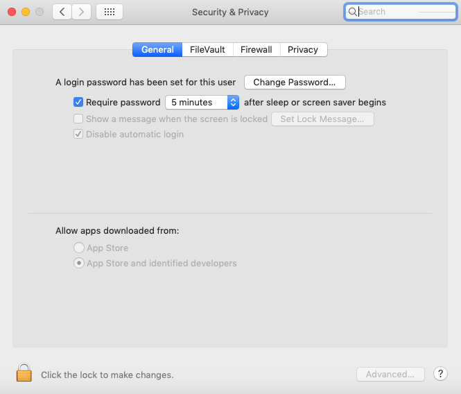

# <a name="troubleshoot-kernel-extension-issues-in-microsoft-defender-for-endpoint-on-macos"></a>MacOS의 끝점용 Microsoft Defender에서 커널 확장 문제 해결

[!INCLUDE [Microsoft 365 Defender rebranding](../../includes/microsoft-defender.md)]


**적용 대상:**

- [Microsoft Defender for Endpoint(macOS용)](microsoft-defender-endpoint-mac.md)
- [엔드포인트용 Microsoft Defender](https://go.microsoft.com/fwlink/p/?linkid=2154037)
- [Microsoft 365 Defender](https://go.microsoft.com/fwlink/?linkid=2118804)

> 엔드포인트용 Microsoft Defender를 경험하고 싶으신가요? [무료 평가판을 신청하세요.](https://signup.microsoft.com/create-account/signup?products=7f379fee-c4f9-4278-b0a1-e4c8c2fcdf7e&ru=https://aka.ms/MDEp2OpenTrial?ocid=docs-wdatp-exposedapis-abovefoldlink)

이 문서에서는 macOS에서 끝점용 Microsoft Defender의 일부로 설치된 커널 확장 문제를 해결하는 방법에 대한 정보를 제공합니다.

macOS High Sierra(10.13)부터 macOS는 장치에서 실행이 허용되기 전에 모든 커널 확장을 명시적으로 승인해야 합니다.

macOS에서 끝점용 Microsoft Defender를 배포/설치하는 동안 커널 확장을 승인하지 않은 경우 응용 프로그램에 사용하도록 설정할지 묻는 배너가 표시됩니다.

   

를 실행할 수 ```mdatp health``` 있습니다. 실시간 보호를 사용할 수 있지만 사용할 수 없는 경우 보고합니다. 이는 커널 확장이 장치에서 실행이 승인되지 않았다는 것을 나타냅니다.

```bash
mdatp health
```
```Output
...
real_time_protection_enabled                : false
real_time_protection_available              : true
...
```

다음 섹션에서는 macOS에서 끝점용 Microsoft Defender를 배포하는 데 사용한 방법에 따라 이 문제를 해결 하는 방법에 대한 지침을 제공합니다.

## <a name="managed-deployment"></a>관리되는 배포

제품을 배포하는 데 사용한 관리 도구에 해당하는 지침을 참조하세요.

- [JAMF 기반 배포](mac-install-with-jamf.md)
- [Microsoft Intune 기반 배포](mac-install-with-intune.md#create-system-configuration-profiles)

## <a name="manual-deployment"></a>수동 배포

제품이 설치된 후 30분 미만이 경과한  경우 시스템 기본 설정 보안 & 개인 정보로 이동합니다. 여기서 \> 개발자 "Microsoft Corporation"의 시스템 소프트웨어를 허용해야 합니다. 

이 프롬프트가 표시되지 않는 경우 30분 이상이 지났지만 커널 확장이 장치에서 실행이 승인되지 않은 것입니다.



이 경우 다음 단계를 수행하여 승인 흐름을 다시 트리거해야 합니다.

1. 터미널에서 드라이버를 설치합니다. 커널 확장이 디바이스에서 실행이 승인되지 않은 경우 다음 작업이 실패합니다. 그러나 승인 흐름이 다시 트리거됩니다.

    ```bash
    sudo kextutil /Library/Extensions/wdavkext.kext
    ```

    ```Output
    Kext rejected due to system policy: <OSKext 0x7fc34d528390 [0x7fffa74aa8e0]> { URL = "file:///Library/StagedExtensions/Library/Extensions/wdavkext.kext/", ID = "com.microsoft.wdavkext" }
    Kext rejected due to system policy: <OSKext 0x7fc34d528390 [0x7fffa74aa8e0]> { URL = "file:///Library/StagedExtensions/Library/Extensions/wdavkext.kext/", ID = "com.microsoft.wdavkext" }
    Diagnostics for /Library/Extensions/wdavkext.kext:
    ```

2. 메뉴에서 **시스템** 기본 설정 \> **& 개인 정보** 보호를 여세요. (열면 먼저 닫습니다.)

3. **개발자** "Microsoft Corporation"의 시스템 소프트웨어 허용

4. 터미널에서 드라이버를 다시 설치합니다. 이번에는 작업이 성공합니다.

    ```bash
    sudo kextutil /Library/Extensions/wdavkext.kext
    ```

    배너는 Defender 응용 프로그램에서 사라져야 하며, 이제 실시간 보호가 사용 가능하고 사용하도록 설정되어 있는 ```mdatp health``` 것으로 보고해야 합니다.

    ```bash
    mdatp health
    ```

    ```Output
    ...
    real_time_protection_enabled                : true
    real_time_protection_available              : true
    ...
    ```
