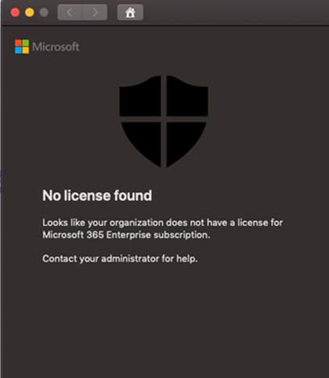

# macOS에서 끝점용 Microsoft Defender의 라이선스 문제 해결

[!INCLUDE [Microsoft 365 Defender rebranding](../../includes/microsoft-defender.md)]

**적용 대상:**

- [Microsoft Defender for Endpoint(macOS용)](microsoft-defender-endpoint-mac.md)
- [엔드포인트용 Microsoft Defender](https://go.microsoft.com/fwlink/p/?linkid=2154037)
- [Microsoft 365 Defender](https://go.microsoft.com/fwlink/?linkid=2118804)

> 엔드포인트용 Microsoft Defender를 경험하고 싶으신가요? [무료 평가판을 신청하세요.](https://signup.microsoft.com/create-account/signup?products=7f379fee-c4f9-4278-b0a1-e4c8c2fcdf7e&ru=https://aka.ms/MDEp2OpenTrial?ocid=docs-wdatp-exposedapis-abovefoldlink)

[macOS의 끝점용 Microsoft Defender](microsoft-defender-endpoint-mac.md) 및  수동 배포 테스트 또는 PoC(개념 증명)를 진행하는 동안 다음 오류가 발생할 수 있습니다.

**메시지:** 

라이선스를 찾을 수 없음

조직에 구독에 대한 라이선스가 Microsoft 365 Enterprise 것 같아야 합니다.

관리자에게 문의하십시오.

**원인:** 

MacOS용 끝점용 Microsoft Defender 패키지("설치 패키지 다운로드")를 배포 및 설치했으나 구성 스크립트("온보딩 패키지 다운로드")를 실행하지 못했거나 사용자에게 라이선스를 할당하지 않은 것일 수 있습니다.

**해결 방법:**

클라이언트 구성에 MicrosoftDefenderATPOnboardingMacOs.py [지침에 따릅니다.](mac-install-manually.md#client-configuration)
