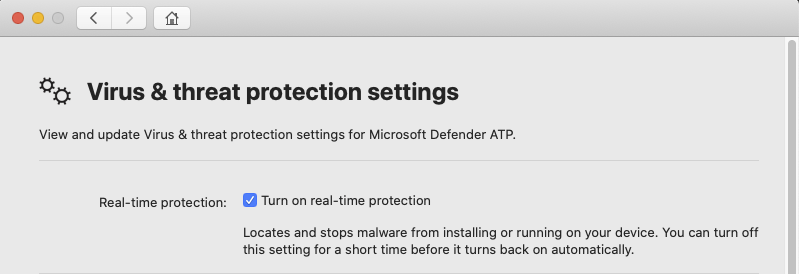

# <a name="troubleshoot-performance-issues-for-microsoft-defender-for-endpoint-for-mac"></a>Mac용 끝점용 Microsoft Defender의 성능 문제 해결

[!INCLUDE [Microsoft 365 Defender rebranding](../../includes/microsoft-defender.md)]


**적용 대상:**

- [엔드포인트용 Microsoft Defender(Mac용)](microsoft-defender-endpoint-mac.md)
- [엔드포인트용 Microsoft Defender](https://go.microsoft.com/fwlink/p/?linkid=2154037)
- [Microsoft 365 Defender](https://go.microsoft.com/fwlink/?linkid=2118804)

> 끝점용 Microsoft Defender를 경험하고 싶나요? [무료 평가판에 등록합니다.](https://www.microsoft.com/microsoft-365/windows/microsoft-defender-atp?ocid=docs-wdatp-exposedapis-abovefoldlink)

이 항목에서는 Mac용 끝점용 Microsoft Defender와 관련된 성능 문제를 좁히는 데 사용할 수 있는 몇 가지 일반적인 단계를 제공합니다.

RTP(실시간 보호)는 지속적으로 위협으로부터 장치를 모니터링하고 보호하는 Mac용 끝점용 Microsoft Defender의 기능입니다. 이 구성은 파일 및 프로세스 모니터링 및 기타추론으로 구성됩니다.

실행 중인 응용 프로그램 및 장치 특성에 따라 Mac용 끝점용 Microsoft Defender를 실행하면 성능이 멀어질 수 있습니다. 특히 짧은 시간 동안 많은 리소스에 액세스하는 응용 프로그램 또는 시스템 프로세스는 Mac용 끝점용 Microsoft Defender의 성능 문제를 발생할 수 있습니다.

다음 단계를 사용하여 이러한 문제를 해결하고 완화할 수 있습니다.

1. 다음 방법 중 하나를 사용하여 실시간 보호를 사용하지 않도록 설정하고 성능이 향상될지 여부를 관찰합니다. 이 방법은 Mac용 끝점용 Microsoft Defender가 성능 문제에 기여하는지 여부를 좁히는 데 도움이 됩니다.

    조직에서 장치를 관리하지 않는 경우 다음 옵션 중 하나를 사용하여 실시간 보호를 사용하지 않도록 설정할 수 있습니다.

    - 사용자 인터페이스에서 Mac용 끝점용 Microsoft Defender를 열고 설정 **관리로 이동합니다.**

      

    - 터미널에서 보안을 위해 이 작업을 수행하려면 권한 상승이 필요합니다.

      ```bash
      mdatp config real-time-protection --value disabled
      ```

    조직에서 디바이스를 관리하는 경우 관리자가 [Mac용 Microsoft Defender에](mac-preferences.md)대한 기본 설정의 지침에 따라 실시간 보호를 사용하지 않도록 설정할 수 있습니다.

2. 찾기를 열고 응용 **프로그램**  >  **유틸리티로 이동합니다.** 작업 **모니터를** 열고 시스템에서 리소스를 사용하는 응용 프로그램을 분석합니다. 일반적인 예로는 소프트웨어 업데이트 프로그램 및 컴파일러가 있습니다.

3. 성능 문제에 기여하는 프로세스 또는 디스크 위치에 대한 제외를 사용하여 Mac용 끝점에 대한 Microsoft Defender를 구성하고 실시간 보호를 다시 활성화합니다.

    자세한 [내용은 Mac용 끝점에](mac-exclusions.md) 대한 Microsoft Defender 제외 구성 및 유효성 검사를 참조합니다.
