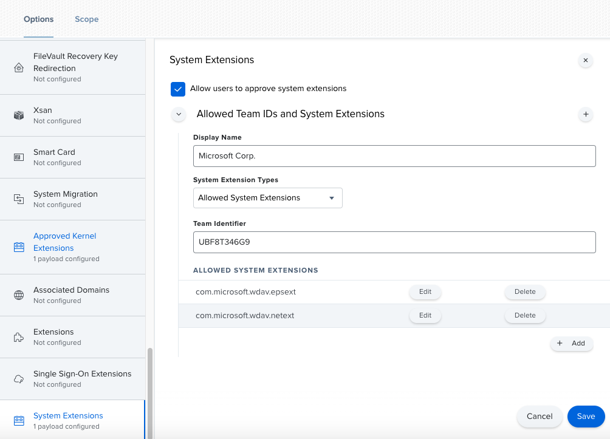

# <a name="new-configuration-profiles-for-macos-catalina-and-newer-versions-of-macos"></a><span data-ttu-id="8c05c-104">macOS 카탈로니아 및 최신 버전의 macOS용 새 구성 프로필</span><span class="sxs-lookup"><span data-stu-id="8c05c-104">New configuration profiles for macOS Catalina and newer versions of macOS</span></span>

[!INCLUDE [Microsoft 365 Defender rebranding](../../includes/microsoft-defender.md)]

<span data-ttu-id="8c05c-105">**적용 대상:**</span><span class="sxs-lookup"><span data-stu-id="8c05c-105">**Applies to:**</span></span>
- [<span data-ttu-id="8c05c-106">엔드포인트용 Microsoft Defender</span><span class="sxs-lookup"><span data-stu-id="8c05c-106">Microsoft Defender for Endpoint</span></span>](https://go.microsoft.com/fwlink/p/?linkid=2146631)
- [<span data-ttu-id="8c05c-107">Microsoft 365 Defender</span><span class="sxs-lookup"><span data-stu-id="8c05c-107">Microsoft 365 Defender</span></span>](https://go.microsoft.com/fwlink/?linkid=2118804)

> <span data-ttu-id="8c05c-108">끝점용 Microsoft Defender를 경험하고 싶나요?</span><span class="sxs-lookup"><span data-stu-id="8c05c-108">Want to experience Microsoft Defender for Endpoint?</span></span> [<span data-ttu-id="8c05c-109">무료 평가판에 등록합니다.</span><span class="sxs-lookup"><span data-stu-id="8c05c-109">Sign up for a free trial.</span></span>](https://www.microsoft.com/microsoft-365/windows/microsoft-defender-atp?ocid=docs-wdatp-exposedapis-abovefoldlink)

<span data-ttu-id="8c05c-110">MacOS의 발전에 맞춰 커널 확장 대신 시스템 확장을 활용하는 Mac용 끝점용 Microsoft Defender 업데이트를 준비하고 있습니다.</span><span class="sxs-lookup"><span data-stu-id="8c05c-110">In alignment with macOS evolution, we are preparing a Microsoft Defender for Endpoint for Mac update that leverages system extensions instead of kernel extensions.</span></span> <span data-ttu-id="8c05c-111">이 업데이트는 macOS 카탈로니아어(10.15.4) 및 최신 버전의 macOS에만 적용할 수 있습니다.</span><span class="sxs-lookup"><span data-stu-id="8c05c-111">This update will only be applicable to macOS Catalina (10.15.4) and newer versions of macOS.</span></span>

<span data-ttu-id="8c05c-112">JAMF, Intune 또는 다른 MDM 솔루션을 통해 관리되는 환경에서 Mac용 끝점용 Microsoft Defender를 배포한 경우 새 구성 프로필을 배포해야 합니다.</span><span class="sxs-lookup"><span data-stu-id="8c05c-112">If you have deployed Microsoft Defender for Endpoint for Mac in a managed environment (through JAMF, Intune, or another MDM solution), you must deploy new configuration profiles.</span></span> <span data-ttu-id="8c05c-113">이러한 단계를 수행하지 못하면 사용자가 이러한 새 구성 요소를 실행하라는 승인 메시지가 사용자에게 표시될 수 있습니다.</span><span class="sxs-lookup"><span data-stu-id="8c05c-113">Failure to do these steps will result in users getting approval prompts to run these new components.</span></span>

## <a name="jamf"></a><span data-ttu-id="8c05c-114">JAMF</span><span class="sxs-lookup"><span data-stu-id="8c05c-114">JAMF</span></span>

### <a name="system-extensions-policy"></a><span data-ttu-id="8c05c-115">시스템 확장 정책</span><span class="sxs-lookup"><span data-stu-id="8c05c-115">System Extensions Policy</span></span>

<span data-ttu-id="8c05c-116">시스템 확장을 승인하기 위해 다음 페이로드를 생성합니다.</span><span class="sxs-lookup"><span data-stu-id="8c05c-116">To approve the system extensions, create the following payload:</span></span>

1. <span data-ttu-id="8c05c-117">컴퓨터 **> 구성 프로필에서** 시스템 > **옵션을 선택합니다.**</span><span class="sxs-lookup"><span data-stu-id="8c05c-117">In **Computers > Configuration Profiles** select **Options > System Extensions**.</span></span>
2. <span data-ttu-id="8c05c-118">시스템 **확장 유형 드롭다운** 목록에서 허용되는 시스템 확장을 선택합니다. </span><span class="sxs-lookup"><span data-stu-id="8c05c-118">Select **Allowed System Extensions** from the **System Extension Types** drop-down list.</span></span>
3. <span data-ttu-id="8c05c-119">팀 **ID에 UBF8T346G9를** 사용 합니다.</span><span class="sxs-lookup"><span data-stu-id="8c05c-119">Use **UBF8T346G9** for Team Id.</span></span>
4. <span data-ttu-id="8c05c-120">허용되는 시스템 확장 목록에 다음 **번들 식별자를 추가합니다.**</span><span class="sxs-lookup"><span data-stu-id="8c05c-120">Add the following bundle identifiers to the **Allowed System Extensions** list:</span></span>

    - <span data-ttu-id="8c05c-121">**com.microsoft.wdav.epsext**</span><span class="sxs-lookup"><span data-stu-id="8c05c-121">**com.microsoft.wdav.epsext**</span></span>
    - <span data-ttu-id="8c05c-122">**com.microsoft.wdav.netext**</span><span class="sxs-lookup"><span data-stu-id="8c05c-122">**com.microsoft.wdav.netext**</span></span>

    

### <a name="privacy-preferences-policy-control"></a><span data-ttu-id="8c05c-124">개인 정보 기본 설정 정책 제어</span><span class="sxs-lookup"><span data-stu-id="8c05c-124">Privacy Preferences Policy Control</span></span>

<span data-ttu-id="8c05c-125">다음 JAMF 페이로드를 추가하여 끝점 끝점용 Microsoft Defender 보안 확장에 대한 전체 디스크 액세스 권한을 부여합니다.</span><span class="sxs-lookup"><span data-stu-id="8c05c-125">Add the following JAMF payload to grant Full Disk Access to the Microsoft Defender for Endpoint Endpoint Security Extension.</span></span> <span data-ttu-id="8c05c-126">이 정책은 디바이스에서 확장을 실행하기 위한 선행 필요합니다.</span><span class="sxs-lookup"><span data-stu-id="8c05c-126">This policy is a pre-requisite for running the extension on your device.</span></span>

1. <span data-ttu-id="8c05c-127">옵션 **개인**  >  **정보 기본 설정 정책 제어 를 선택합니다.**</span><span class="sxs-lookup"><span data-stu-id="8c05c-127">Select **Options** > **Privacy Preferences Policy Control**.</span></span>
2. <span data-ttu-id="8c05c-128">`com.microsoft.wdav.epsext`식별자 **및** `Bundle ID` 번들 **유형으로 사용**</span><span class="sxs-lookup"><span data-stu-id="8c05c-128">Use `com.microsoft.wdav.epsext` as the **Identifier** and `Bundle ID` as **Bundle type**.</span></span>
3. <span data-ttu-id="8c05c-129">코드 요구 사항을 다음으로 설정 `identifier "com.microsoft.wdav.epsext" and anchor apple generic and certificate 1[field.1.2.840.113635.100.6.2.6] /* exists */ and certificate leaf[field.1.2.840.113635.100.6.1.13] /* exists */ and certificate leaf[subject.OU] = UBF8T346G9`</span><span class="sxs-lookup"><span data-stu-id="8c05c-129">Set Code Requirement to `identifier "com.microsoft.wdav.epsext" and anchor apple generic and certificate 1[field.1.2.840.113635.100.6.2.6] /* exists */ and certificate leaf[field.1.2.840.113635.100.6.1.13] /* exists */ and certificate leaf[subject.OU] = UBF8T346G9`</span></span>
4. <span data-ttu-id="8c05c-130">앱 **또는 서비스를** **SystemPolicyAllFiles로 설정하고** 허용에 **액세스합니다.**</span><span class="sxs-lookup"><span data-stu-id="8c05c-130">Set **App or service** to **SystemPolicyAllFiles** and access to **Allow**.</span></span>

    

### <a name="network-extension-policy"></a><span data-ttu-id="8c05c-132">네트워크 확장 정책</span><span class="sxs-lookup"><span data-stu-id="8c05c-132">Network Extension Policy</span></span>

<span data-ttu-id="8c05c-133">끝점 검색 및 응답 기능의 일부로, Mac용 끝점용 Microsoft Defender는 소켓 트래픽을 검사하고 이 정보를 Microsoft Defender 보안 센터 포털에 보고합니다.</span><span class="sxs-lookup"><span data-stu-id="8c05c-133">As part of the Endpoint Detection and Response capabilities, Microsoft Defender for Endpoint for Mac inspects socket traffic and reports this information to the Microsoft Defender Security Center portal.</span></span> <span data-ttu-id="8c05c-134">다음 정책은 네트워크 확장에서 이 기능을 수행할 수 있습니다.</span><span class="sxs-lookup"><span data-stu-id="8c05c-134">The following policy allows the network extension to perform this functionality.</span></span>

>[!NOTE]
><span data-ttu-id="8c05c-135">JAMF에는 콘텐츠 필터링 정책에 대한 기본 제공 지원이 없습니다. 이는 Mac용 끝점용 Microsoft Defender가 장치에 설치하는 네트워크 확장을 사용하도록 설정하기 위한 전제입니다.</span><span class="sxs-lookup"><span data-stu-id="8c05c-135">JAMF doesn’t have built-in support for content filtering policies, which are a pre-requisite for enabling the network extensions that Microsoft Defender for Endpoint for Mac installs on the device.</span></span> <span data-ttu-id="8c05c-136">또한 JAMF는 배포되는 정책의 콘텐츠를 변경하는 경우도 있습니다.</span><span class="sxs-lookup"><span data-stu-id="8c05c-136">Furthermore, JAMF sometimes changes the content of the policies being deployed.</span></span>
><span data-ttu-id="8c05c-137">따라서 다음 단계에서는 구성 프로필에 서명하는 작업을 수행합니다.</span><span class="sxs-lookup"><span data-stu-id="8c05c-137">As such, the following steps provide a workaround that involve signing the configuration profile.</span></span>

1. <span data-ttu-id="8c05c-138">텍스트 편집기를 사용하여 장치에 다음 `com.microsoft.network-extension.mobileconfig` 콘텐츠를 저장합니다.</span><span class="sxs-lookup"><span data-stu-id="8c05c-138">Save the following content to your device as `com.microsoft.network-extension.mobileconfig` using a text editor:</span></span>

    ```xml
    <?xml version="1.0" encoding="UTF-8"?><!DOCTYPE plist PUBLIC "-//Apple//DTD PLIST 1.0//EN" "http://www.apple.com/DTDs/PropertyList-1.0.dtd">
    <plist version="1">
        <dict>
            <key>PayloadUUID</key>
            <string>DA2CC794-488B-4AFF-89F7-6686A7E7B8AB</string>
            <key>PayloadType</key>
            <string>Configuration</string>
            <key>PayloadOrganization</key>
            <string>Microsoft Corporation</string>
            <key>PayloadIdentifier</key>
            <string>DA2CC794-488B-4AFF-89F7-6686A7E7B8AB</string>
            <key>PayloadDisplayName</key>
            <string>Microsoft Defender ATP Network Extension</string>
            <key>PayloadDescription</key>
            <string/>
            <key>PayloadVersion</key>
            <integer>1</integer>
            <key>PayloadEnabled</key>
            <true/>
            <key>PayloadRemovalDisallowed</key>
            <true/>
            <key>PayloadScope</key>
            <string>System</string>
            <key>PayloadContent</key>
            <array>
                <dict>
                    <key>PayloadUUID</key>
                    <string>2BA070D9-2233-4827-AFC1-1F44C8C8E527</string>
                    <key>PayloadType</key>
                    <string>com.apple.webcontent-filter</string>
                    <key>PayloadOrganization</key>
                    <string>Microsoft Corporation</string>
                    <key>PayloadIdentifier</key>
                    <string>CEBF7A71-D9A1-48BD-8CCF-BD9D18EC155A</string>
                    <key>PayloadDisplayName</key>
                    <string>Approved Network Extension</string>
                    <key>PayloadDescription</key>
                    <string/>
                    <key>PayloadVersion</key>
                    <integer>1</integer>
                    <key>PayloadEnabled</key>
                    <true/>
                    <key>FilterType</key>
                    <string>Plugin</string>
                    <key>UserDefinedName</key>
                    <string>Microsoft Defender ATP Network Extension</string>
                    <key>PluginBundleID</key>
                    <string>com.microsoft.wdav</string>
                    <key>FilterSockets</key>
                    <true/>
                    <key>FilterDataProviderBundleIdentifier</key>
                    <string>com.microsoft.wdav.netext</string>
                    <key>FilterDataProviderDesignatedRequirement</key>
                    <string>identifier "com.microsoft.wdav.netext" and anchor apple generic and certificate 1[field.1.2.840.113635.100.6.2.6] /* exists */ and certificate leaf[field.1.2.840.113635.100.6.1.13] /* exists */ and certificate leaf[subject.OU] = UBF8T346G9</string>
                </dict>
            </array>
        </dict>
    </plist>
    ```

2. <span data-ttu-id="8c05c-139">터미널에서 유틸리티를 실행하여 위의 파일이 올바르게 `plutil` 복사된지 확인합니다.</span><span class="sxs-lookup"><span data-stu-id="8c05c-139">Verify that the above file was copied correctly by running the `plutil` utility in the Terminal:</span></span>

    ```bash
    $ plutil -lint <PathToFile>/com.microsoft.network-extension.mobileconfig
    ```

    <span data-ttu-id="8c05c-140">예를 들어 파일이 문서에 저장된 경우:</span><span class="sxs-lookup"><span data-stu-id="8c05c-140">For example, if the file was stored in Documents:</span></span>

    ```bash
    $ plutil -lint ~/Documents/com.microsoft.network-extension.mobileconfig
    ```
    
    <span data-ttu-id="8c05c-141">명령이 을 출력하는지 `OK` 확인</span><span class="sxs-lookup"><span data-stu-id="8c05c-141">Verify that the command outputs `OK`.</span></span>
        
    ```bash
    <PathToFile>/com.microsoft.network-extension.mobileconfig: OK
    ```
    
3. <span data-ttu-id="8c05c-142">이 페이지의 지침에 [따라](https://www.jamf.com/jamf-nation/articles/649/creating-a-signing-certificate-using-jamf-pro-s-built-in-certificate-authority) JAMF의 기본 제공 인증 기관을 사용하여 서명 인증서를 만들 수 있습니다.</span><span class="sxs-lookup"><span data-stu-id="8c05c-142">Follow the instructions on [this page](https://www.jamf.com/jamf-nation/articles/649/creating-a-signing-certificate-using-jamf-pro-s-built-in-certificate-authority) to create a signing certificate using JAMF’s built-in certificate authority.</span></span>

4. <span data-ttu-id="8c05c-143">인증서를 만들어 장치에 설치한 후 터미널에서 다음 명령을 실행하여 파일에 서명합니다.</span><span class="sxs-lookup"><span data-stu-id="8c05c-143">After the certificate is created and installed to your device, run the following command from the Terminal to sign the file:</span></span>

    ```bash
    $ security cms -S -N "<CertificateName>" -i <PathToFile>/com.microsoft.network-extension.mobileconfig -o <PathToSignedFile>/com.microsoft.network-extension.signed.mobileconfig
    ```
    
    <span data-ttu-id="8c05c-144">예를 들어 인증서 이름이 **SigningCertificate인** 경우 서명된 파일이 문서에 저장됩니다.</span><span class="sxs-lookup"><span data-stu-id="8c05c-144">For example, if the certificate name is **SigningCertificate** and the signed file is going to be stored in Documents:</span></span>
    
    ```bash
    $ security cms -S -N "SigningCertificate" -i ~/Documents/com.microsoft.network-extension.mobileconfig -o ~/Documents/com.microsoft.network-extension.signed.mobileconfig
    ```
    
5. <span data-ttu-id="8c05c-145">JAMF 포털에서 구성 프로필로 **이동하여** 업로드 **단추를** 클릭합니다.</span><span class="sxs-lookup"><span data-stu-id="8c05c-145">From the JAMF portal, navigate to **Configuration Profiles** and click the **Upload** button.</span></span> <span data-ttu-id="8c05c-146">파일을 `com.microsoft.network-extension.signed.mobileconfig` 입력하라는 메시지가 표시될 때 선택합니다.</span><span class="sxs-lookup"><span data-stu-id="8c05c-146">Select `com.microsoft.network-extension.signed.mobileconfig` when prompted for the file.</span></span>

## <a name="intune"></a><span data-ttu-id="8c05c-147">Intune</span><span class="sxs-lookup"><span data-stu-id="8c05c-147">Intune</span></span>

### <a name="system-extensions-policy"></a><span data-ttu-id="8c05c-148">시스템 확장 정책</span><span class="sxs-lookup"><span data-stu-id="8c05c-148">System Extensions Policy</span></span>

<span data-ttu-id="8c05c-149">시스템 확장을 승인합니다.</span><span class="sxs-lookup"><span data-stu-id="8c05c-149">To approve the system extensions:</span></span>

1. <span data-ttu-id="8c05c-150">Intune에서 장치 구성  >  **관리를 열고**</span><span class="sxs-lookup"><span data-stu-id="8c05c-150">In Intune, open **Manage** > **Device configuration**.</span></span> <span data-ttu-id="8c05c-151">프로필 **만들기**  >  **를**  >  **선택합니다.**</span><span class="sxs-lookup"><span data-stu-id="8c05c-151">Select **Manage** > **Profiles** > **Create Profile**.</span></span>
2. <span data-ttu-id="8c05c-152">프로필 이름을 선택하세요.</span><span class="sxs-lookup"><span data-stu-id="8c05c-152">Choose a name for the profile.</span></span> <span data-ttu-id="8c05c-153">**Platform=macOS를** **프로필 유형=확장으로 변경합니다.**</span><span class="sxs-lookup"><span data-stu-id="8c05c-153">Change **Platform=macOS** to **Profile type=Extensions**.</span></span> <span data-ttu-id="8c05c-154">**만들기** 를 선택합니다.</span><span class="sxs-lookup"><span data-stu-id="8c05c-154">Select **Create**.</span></span>
3. <span data-ttu-id="8c05c-155">탭에서 `Basics` 이 새 프로필에 이름을 지정합니다.</span><span class="sxs-lookup"><span data-stu-id="8c05c-155">In the `Basics` tab, give a name to this new profile.</span></span>
4. <span data-ttu-id="8c05c-156">탭에서 `Configuration settings` 섹션에 다음 항목을 `Allowed system extensions` 추가합니다.</span><span class="sxs-lookup"><span data-stu-id="8c05c-156">In the `Configuration settings` tab, add the following entries in the `Allowed system extensions` section:</span></span>

    <span data-ttu-id="8c05c-157">번들 식별자</span><span class="sxs-lookup"><span data-stu-id="8c05c-157">Bundle identifier</span></span>         | <span data-ttu-id="8c05c-158">팀 식별자</span><span class="sxs-lookup"><span data-stu-id="8c05c-158">Team identifier</span></span>
    --------------------------|----------------
    <span data-ttu-id="8c05c-159">com.microsoft.wdav.epsext</span><span class="sxs-lookup"><span data-stu-id="8c05c-159">com.microsoft.wdav.epsext</span></span> | <span data-ttu-id="8c05c-160">UBF8T346G9</span><span class="sxs-lookup"><span data-stu-id="8c05c-160">UBF8T346G9</span></span>
    <span data-ttu-id="8c05c-161">com.microsoft.wdav.netext</span><span class="sxs-lookup"><span data-stu-id="8c05c-161">com.microsoft.wdav.netext</span></span> | <span data-ttu-id="8c05c-162">UBF8T346G9</span><span class="sxs-lookup"><span data-stu-id="8c05c-162">UBF8T346G9</span></span>

    

5. <span data-ttu-id="8c05c-164">탭에서 이 프로필을 모든 사용자 및 모든 & `Assignments` **할당합니다.**</span><span class="sxs-lookup"><span data-stu-id="8c05c-164">In the `Assignments` tab, assign this profile to **All Users & All devices**.</span></span>
6. <span data-ttu-id="8c05c-165">이 구성 프로필을 검토하고 만들 수 있습니다.</span><span class="sxs-lookup"><span data-stu-id="8c05c-165">Review and create this configuration profile.</span></span>

### <a name="create-and-deploy-the-custom-configuration-profile"></a><span data-ttu-id="8c05c-166">사용자 지정 구성 프로필 만들기 및 배포</span><span class="sxs-lookup"><span data-stu-id="8c05c-166">Create and deploy the Custom Configuration Profile</span></span>

<span data-ttu-id="8c05c-167">다음 구성 프로필은 네트워크 확장을 사용할 수 있도록 설정하고 끝점 보안 시스템 확장에 대한 전체 디스크 액세스 권한을 부여합니다.</span><span class="sxs-lookup"><span data-stu-id="8c05c-167">The following configuration profile enables the network extension and grants Full Disk Access to the Endpoint Security system extension.</span></span> 

<span data-ttu-id="8c05c-168">다음 콘텐츠를 다음 **sysext.xml.**</span><span class="sxs-lookup"><span data-stu-id="8c05c-168">Save the following content to a file named **sysext.xml**:</span></span>

```xml
<?xml version="1.0" encoding="UTF-8"?><!DOCTYPE plist PUBLIC "-//Apple//DTD PLIST 1.0//EN" "http://www.apple.com/DTDs/PropertyList-1.0.dtd">
<plist version="1">
    <dict>
        <key>PayloadUUID</key>
        <string>7E53AC50-B88D-4132-99B6-29F7974EAA3C</string>
        <key>PayloadType</key>
        <string>Configuration</string>
        <key>PayloadOrganization</key>
        <string>Microsoft Corporation</string>
        <key>PayloadIdentifier</key>
        <string>7E53AC50-B88D-4132-99B6-29F7974EAA3C</string>
        <key>PayloadDisplayName</key>
        <string>Microsoft Defender ATP System Extensions</string>
        <key>PayloadDescription</key>
        <string/>
        <key>PayloadVersion</key>
        <integer>1</integer>
        <key>PayloadEnabled</key>
        <true/>
        <key>PayloadRemovalDisallowed</key>
        <true/>
        <key>PayloadScope</key>
        <string>System</string>
        <key>PayloadContent</key>
        <array>
            <dict>
                <key>PayloadUUID</key>
                <string>2BA070D9-2233-4827-AFC1-1F44C8C8E527</string>
                <key>PayloadType</key>
                <string>com.apple.webcontent-filter</string>
                <key>PayloadOrganization</key>
                <string>Microsoft Corporation</string>
                <key>PayloadIdentifier</key>
                <string>CEBF7A71-D9A1-48BD-8CCF-BD9D18EC155A</string>
                <key>PayloadDisplayName</key>
                <string>Approved Network Extension</string>
                <key>PayloadDescription</key>
                <string/>
                <key>PayloadVersion</key>
                <integer>1</integer>
                <key>PayloadEnabled</key>
                <true/>
                <key>FilterType</key>
                <string>Plugin</string>
                <key>UserDefinedName</key>
                <string>Microsoft Defender ATP Network Extension</string>
                <key>PluginBundleID</key>
                <string>com.microsoft.wdav</string>
                <key>FilterSockets</key>
                <true/>
                <key>FilterDataProviderBundleIdentifier</key>
                <string>com.microsoft.wdav.netext</string>
                <key>FilterDataProviderDesignatedRequirement</key>
                <string>identifier &quot;com.microsoft.wdav.netext&quot; and anchor apple generic and certificate 1[field.1.2.840.113635.100.6.2.6] /* exists */ and certificate leaf[field.1.2.840.113635.100.6.1.13] /* exists */ and certificate leaf[subject.OU] = UBF8T346G9</string>
            </dict>
            <dict>
                <key>PayloadUUID</key>
                <string>56105E89-C7C8-4A95-AEE6-E11B8BEA0366</string>
                <key>PayloadType</key>
                <string>com.apple.TCC.configuration-profile-policy</string>
                <key>PayloadOrganization</key>
                <string>Microsoft Corporation</string>
                <key>PayloadIdentifier</key>
                <string>56105E89-C7C8-4A95-AEE6-E11B8BEA0366</string>
                <key>PayloadDisplayName</key>
                <string>Privacy Preferences Policy Control</string>
                <key>PayloadDescription</key>
                <string/>
                <key>PayloadVersion</key>
                <integer>1</integer>
                <key>PayloadEnabled</key>
                <true/>
                <key>Services</key>
                <dict>
                    <key>SystemPolicyAllFiles</key>
                    <array>
                        <dict>
                            <key>Identifier</key>
                            <string>com.microsoft.wdav.epsext</string>
                            <key>CodeRequirement</key>
                            <string>identifier "com.microsoft.wdav.epsext" and anchor apple generic and certificate 1[field.1.2.840.113635.100.6.2.6] /* exists */ and certificate leaf[field.1.2.840.113635.100.6.1.13] /* exists */ and certificate leaf[subject.OU] = UBF8T346G9</string>
                            <key>IdentifierType</key>
                            <string>bundleID</string>
                            <key>StaticCode</key>
                            <integer>0</integer>
                            <key>Allowed</key>
                            <integer>1</integer>
                        </dict>
                    </array>
                </dict>
            </dict>
        </array>
    </dict>
</plist>
```

<span data-ttu-id="8c05c-169">위의 파일이 올바르게 복사 지 않은지 확인합니다.</span><span class="sxs-lookup"><span data-stu-id="8c05c-169">Verify that the above file was copied correctly.</span></span> <span data-ttu-id="8c05c-170">터미널에서 다음 명령을 실행하고 다음 명령을 출력하는지 `OK` 확인</span><span class="sxs-lookup"><span data-stu-id="8c05c-170">From the Terminal, run the following command and verify that it outputs `OK`:</span></span>

```bash
$ plutil -lint sysext.xml
sysext.xml: OK
```

<span data-ttu-id="8c05c-171">이 사용자 지정 구성 프로필을 배포하려면</span><span class="sxs-lookup"><span data-stu-id="8c05c-171">To deploy this custom configuration profile:</span></span>

1.  <span data-ttu-id="8c05c-172">Intune에서 장치 구성  >  **관리를 열고**</span><span class="sxs-lookup"><span data-stu-id="8c05c-172">In Intune, open **Manage** > **Device configuration**.</span></span> <span data-ttu-id="8c05c-173">프로필 **관리**  >  **프로필**  >  **만들기 를 선택합니다.**</span><span class="sxs-lookup"><span data-stu-id="8c05c-173">Select **Manage** > **Profiles** > **Create profile**.</span></span>
2. <span data-ttu-id="8c05c-174">프로필 이름을 선택하세요.</span><span class="sxs-lookup"><span data-stu-id="8c05c-174">Choose a name for the profile.</span></span> <span data-ttu-id="8c05c-175">**Platform=macOS** 및 **Profile type=Custom을 변경합니다.**</span><span class="sxs-lookup"><span data-stu-id="8c05c-175">Change **Platform=macOS** and **Profile type=Custom**.</span></span> <span data-ttu-id="8c05c-176">구성을 **선택합니다.**</span><span class="sxs-lookup"><span data-stu-id="8c05c-176">Select **Configure**.</span></span>
3.  <span data-ttu-id="8c05c-177">구성 프로필을 열고 **sysext.xml.**</span><span class="sxs-lookup"><span data-stu-id="8c05c-177">Open the configuration profile and upload **sysext.xml**.</span></span> <span data-ttu-id="8c05c-178">이 파일은 이전 단계에서 만들어졌습니다.</span><span class="sxs-lookup"><span data-stu-id="8c05c-178">This file was created in the preceding step.</span></span>
4.  <span data-ttu-id="8c05c-179">**확인** 을 선택합니다.</span><span class="sxs-lookup"><span data-stu-id="8c05c-179">Select **OK**.</span></span>

    

5. <span data-ttu-id="8c05c-181">탭에서 이 프로필을 모든 사용자 및 모든 & `Assignments` **할당합니다.**</span><span class="sxs-lookup"><span data-stu-id="8c05c-181">In the `Assignments` tab, assign this profile to **All Users & All devices**.</span></span>
6. <span data-ttu-id="8c05c-182">이 구성 프로필을 검토하고 만들 수 있습니다.</span><span class="sxs-lookup"><span data-stu-id="8c05c-182">Review and create this configuration profile.</span></span>
