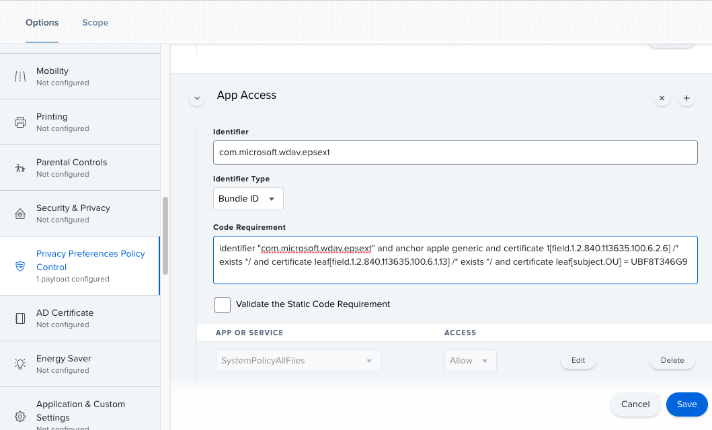

# <a name="new-configuration-profiles-for-macos-catalina-and-newer-versions-of-macos"></a>macOS 카탈로니아 및 최신 버전의 macOS용 새 구성 프로필

[!INCLUDE [Microsoft 365 Defender rebranding](../../includes/microsoft-defender.md)]

**적용 대상:**
- [엔드포인트용 Microsoft Defender](https://go.microsoft.com/fwlink/p/?linkid=2154037)
- [Microsoft 365 Defender](https://go.microsoft.com/fwlink/?linkid=2118804)

> 엔드포인트용 Microsoft Defender를 경험하고 싶으신가요? [무료 평가판을 신청하세요.](https://signup.microsoft.com/create-account/signup?products=7f379fee-c4f9-4278-b0a1-e4c8c2fcdf7e&ru=https://aka.ms/MDEp2OpenTrial?ocid=docs-wdatp-exposedapis-abovefoldlink)

macOS의 발전에 맞춰 커널 확장 대신 시스템 확장을 활용하는 macOS 업데이트에서 끝점용 Microsoft Defender를 준비하고 있습니다. 이 업데이트는 macOS 카탈로니아어(10.15.4) 및 최신 버전의 macOS에만 적용할 수 있습니다.

관리되는 환경(JAMF, Intune 또는 다른 MDM 솔루션을 통해)에서 macOS에 끝점용 Microsoft Defender를 배포한 경우 새 구성 프로필을 배포해야 합니다. 이러한 단계를 수행하지 못하면 사용자가 이러한 새 구성 요소를 실행하라는 승인 메시지가 사용자에게 표시될 수 있습니다.

## <a name="jamf"></a>JAMF

### <a name="jamf-system-extensions-policy"></a>JAMF 시스템 확장 정책

시스템 확장을 승인하기 위해 다음 페이로드를 생성합니다.

1. 컴퓨터 **> 구성 프로필에서** 시스템 > **옵션을 선택합니다.**
2. 시스템 **확장 유형 드롭다운** 목록에서 허용되는 시스템 확장을 선택합니다. 
3. 팀 **ID에 UBF8T346G9를** 사용 합니다.
4. 허용되는 시스템 확장 목록에 다음 **번들 식별자를 추가합니다.**

    - **com.microsoft.wdav.epsext**
    - **com.microsoft.wdav.netext**

    

### <a name="privacy-preferences-policy-control"></a>개인 정보 기본 설정 정책 제어

다음 JAMF 페이로드를 추가하여 끝점 끝점용 Microsoft Defender 보안 확장에 대한 전체 디스크 액세스 권한을 부여합니다. 이 정책은 디바이스에서 확장을 실행하기 위한 선행 필요합니다.

1. 옵션 **개인** \> **정보 기본 설정 정책 제어 를 선택합니다.**
2. `com.microsoft.wdav.epsext`식별자 **및** `Bundle ID` 번들 **유형으로 사용**
3. 코드 요구 사항을 다음으로 설정 `identifier "com.microsoft.wdav.epsext" and anchor apple generic and certificate 1[field.1.2.840.113635.100.6.2.6] /* exists */ and certificate leaf[field.1.2.840.113635.100.6.1.13] /* exists */ and certificate leaf[subject.OU] = UBF8T346G9`
4. 앱 **또는 서비스를** **SystemPolicyAllFiles로 설정하고** 허용에 **액세스합니다.**

    

### <a name="network-extension-policy"></a>네트워크 확장 정책

끝점 검색 및 응답 기능의 일부로 macOS의 끝점용 Microsoft Defender는 소켓 트래픽을 검사하고 이 정보를 Microsoft 365 Defender 포털에 보고합니다. 다음 정책은 네트워크 확장에서 이 기능을 수행할 수 있습니다.

> [!NOTE]
> JAMF에는 콘텐츠 필터링 정책에 대한 기본 제공 지원이 없습니다. 이는 macOS의 끝점용 Microsoft Defender가 장치에 설치하는 네트워크 확장을 사용하도록 설정하기 위한 전제입니다. 또한 JAMF는 배포되는 정책의 콘텐츠를 변경하는 경우도 있습니다.
> 따라서 다음 단계에서는 구성 프로필에 서명하는 작업을 수행합니다.

1. 텍스트 편집기를 사용하여 장치에 다음 `com.microsoft.network-extension.mobileconfig` 콘텐츠를 저장합니다.

    ```xml
    <?xml version="1.0" encoding="UTF-8"?><!DOCTYPE plist PUBLIC "-//Apple//DTD PLIST 1.0//EN" "http://www.apple.com/DTDs/PropertyList-1.0.dtd">
    <plist version="1">
        <dict>
            <key>PayloadUUID</key>
            <string>DA2CC794-488B-4AFF-89F7-6686A7E7B8AB</string>
            <key>PayloadType</key>
            <string>Configuration</string>
            <key>PayloadOrganization</key>
            <string>Microsoft Corporation</string>
            <key>PayloadIdentifier</key>
            <string>DA2CC794-488B-4AFF-89F7-6686A7E7B8AB</string>
            <key>PayloadDisplayName</key>
            <string>Microsoft Defender ATP Network Extension</string>
            <key>PayloadDescription</key>
            <string/>
            <key>PayloadVersion</key>
            <integer>1</integer>
            <key>PayloadEnabled</key>
            <true/>
            <key>PayloadRemovalDisallowed</key>
            <true/>
            <key>PayloadScope</key>
            <string>System</string>
            <key>PayloadContent</key>
            <array>
                <dict>
                    <key>PayloadUUID</key>
                    <string>2BA070D9-2233-4827-AFC1-1F44C8C8E527</string>
                    <key>PayloadType</key>
                    <string>com.apple.webcontent-filter</string>
                    <key>PayloadOrganization</key>
                    <string>Microsoft Corporation</string>
                    <key>PayloadIdentifier</key>
                    <string>CEBF7A71-D9A1-48BD-8CCF-BD9D18EC155A</string>
                    <key>PayloadDisplayName</key>
                    <string>Approved Network Extension</string>
                    <key>PayloadDescription</key>
                    <string/>
                    <key>PayloadVersion</key>
                    <integer>1</integer>
                    <key>PayloadEnabled</key>
                    <true/>
                    <key>FilterType</key>
                    <string>Plugin</string>
                    <key>UserDefinedName</key>
                    <string>Microsoft Defender ATP Network Extension</string>
                    <key>PluginBundleID</key>
                    <string>com.microsoft.wdav</string>
                    <key>FilterSockets</key>
                    <true/>
                    <key>FilterDataProviderBundleIdentifier</key>
                    <string>com.microsoft.wdav.netext</string>
                    <key>FilterDataProviderDesignatedRequirement</key>
                    <string>identifier "com.microsoft.wdav.netext" and anchor apple generic and certificate 1[field.1.2.840.113635.100.6.2.6] /* exists */ and certificate leaf[field.1.2.840.113635.100.6.1.13] /* exists */ and certificate leaf[subject.OU] = UBF8T346G9</string>
                </dict>
            </array>
        </dict>
    </plist>
    ```

2. 터미널에서 유틸리티를 실행하여 위의 파일이 올바르게 `plutil` 복사된지 확인합니다.

    ```bash
    $ plutil -lint <PathToFile>/com.microsoft.network-extension.mobileconfig
    ```

    예를 들어 파일이 문서에 저장된 경우:

    ```bash
    $ plutil -lint ~/Documents/com.microsoft.network-extension.mobileconfig
    ```

    명령이 을 출력하는지 `OK` 확인

    ```bash
    <PathToFile>/com.microsoft.network-extension.mobileconfig: OK
    ```

3. 이 페이지의 지침에 [따라](https://www.jamf.com/jamf-nation/articles/649/creating-a-signing-certificate-using-jamf-pro-s-built-in-certificate-authority) JAMF의 기본 제공 인증 기관을 사용하여 서명 인증서를 만들 수 있습니다.

4. 인증서를 만들어 장치에 설치한 후 터미널에서 다음 명령을 실행하여 파일에 서명합니다.

    ```bash
    $ security cms -S -N "<CertificateName>" -i <PathToFile>/com.microsoft.network-extension.mobileconfig -o <PathToSignedFile>/com.microsoft.network-extension.signed.mobileconfig
    ```

    예를 들어 인증서 이름이 **SigningCertificate인** 경우 서명된 파일이 문서에 저장됩니다.

    ```bash
    $ security cms -S -N "SigningCertificate" -i ~/Documents/com.microsoft.network-extension.mobileconfig -o ~/Documents/com.microsoft.network-extension.signed.mobileconfig
    ```

5. JAMF 포털에서 구성 프로필로 **이동한** 후 업로드 **클릭합니다.** 파일을 `com.microsoft.network-extension.signed.mobileconfig` 입력하라는 메시지가 표시될 때 선택합니다.

## <a name="intune"></a>Intune

### <a name="intune-system-extensions-policy"></a>Intune 시스템 확장 정책

시스템 확장을 승인합니다.

1. Intune에서 장치  구성 \> **관리를 열고** 프로필 **만들기** \> **를** \> **선택합니다.**
2. 프로필 이름을 선택하세요. **Platform=macOS를** **프로필 유형=확장으로 변경합니다.** **만들기** 를 선택합니다.
3. 탭에서 `Basics` 이 새 프로필에 이름을 지정합니다.
4. 탭에서 `Configuration settings` 섹션에 다음 항목을 `Allowed system extensions` 추가합니다.

   <br>

   ****

   |번들 식별자|팀 식별자|
   |---|---|
   |com.microsoft.wdav.epsext|UBF8T346G9|
   |com.microsoft.wdav.netext|UBF8T346G9|
   |||

   

5. 탭에서 이 프로필을 모든 사용자 및 모든 & `Assignments` **할당합니다.**
6. 이 구성 프로필을 검토하고 만들 수 있습니다.

### <a name="create-and-deploy-the-custom-configuration-profile"></a>사용자 지정 구성 프로필 만들기 및 배포

다음 구성 프로필은 네트워크 확장을 사용할 수 있도록 설정하고 끝점 보안 시스템 확장에 대한 전체 디스크 액세스 권한을 부여합니다.

다음 콘텐츠를 다음 **sysext.xml.**

```xml
<?xml version="1.0" encoding="UTF-8"?><!DOCTYPE plist PUBLIC "-//Apple//DTD PLIST 1.0//EN" "http://www.apple.com/DTDs/PropertyList-1.0.dtd">
<plist version="1">
    <dict>
        <key>PayloadUUID</key>
        <string>7E53AC50-B88D-4132-99B6-29F7974EAA3C</string>
        <key>PayloadType</key>
        <string>Configuration</string>
        <key>PayloadOrganization</key>
        <string>Microsoft Corporation</string>
        <key>PayloadIdentifier</key>
        <string>7E53AC50-B88D-4132-99B6-29F7974EAA3C</string>
        <key>PayloadDisplayName</key>
        <string>Microsoft Defender ATP System Extensions</string>
        <key>PayloadDescription</key>
        <string/>
        <key>PayloadVersion</key>
        <integer>1</integer>
        <key>PayloadEnabled</key>
        <true/>
        <key>PayloadRemovalDisallowed</key>
        <true/>
        <key>PayloadScope</key>
        <string>System</string>
        <key>PayloadContent</key>
        <array>
            <dict>
                <key>PayloadUUID</key>
                <string>2BA070D9-2233-4827-AFC1-1F44C8C8E527</string>
                <key>PayloadType</key>
                <string>com.apple.webcontent-filter</string>
                <key>PayloadOrganization</key>
                <string>Microsoft Corporation</string>
                <key>PayloadIdentifier</key>
                <string>CEBF7A71-D9A1-48BD-8CCF-BD9D18EC155A</string>
                <key>PayloadDisplayName</key>
                <string>Approved Network Extension</string>
                <key>PayloadDescription</key>
                <string/>
                <key>PayloadVersion</key>
                <integer>1</integer>
                <key>PayloadEnabled</key>
                <true/>
                <key>FilterType</key>
                <string>Plugin</string>
                <key>UserDefinedName</key>
                <string>Microsoft Defender ATP Network Extension</string>
                <key>PluginBundleID</key>
                <string>com.microsoft.wdav</string>
                <key>FilterSockets</key>
                <true/>
                <key>FilterDataProviderBundleIdentifier</key>
                <string>com.microsoft.wdav.netext</string>
                <key>FilterDataProviderDesignatedRequirement</key>
                <string>identifier &quot;com.microsoft.wdav.netext&quot; and anchor apple generic and certificate 1[field.1.2.840.113635.100.6.2.6] /* exists */ and certificate leaf[field.1.2.840.113635.100.6.1.13] /* exists */ and certificate leaf[subject.OU] = UBF8T346G9</string>
            </dict>
            <dict>
                <key>PayloadUUID</key>
                <string>56105E89-C7C8-4A95-AEE6-E11B8BEA0366</string>
                <key>PayloadType</key>
                <string>com.apple.TCC.configuration-profile-policy</string>
                <key>PayloadOrganization</key>
                <string>Microsoft Corporation</string>
                <key>PayloadIdentifier</key>
                <string>56105E89-C7C8-4A95-AEE6-E11B8BEA0366</string>
                <key>PayloadDisplayName</key>
                <string>Privacy Preferences Policy Control</string>
                <key>PayloadDescription</key>
                <string/>
                <key>PayloadVersion</key>
                <integer>1</integer>
                <key>PayloadEnabled</key>
                <true/>
                <key>Services</key>
                <dict>
                    <key>SystemPolicyAllFiles</key>
                    <array>
                        <dict>
                            <key>Identifier</key>
                            <string>com.microsoft.wdav.epsext</string>
                            <key>CodeRequirement</key>
                            <string>identifier "com.microsoft.wdav.epsext" and anchor apple generic and certificate 1[field.1.2.840.113635.100.6.2.6] /* exists */ and certificate leaf[field.1.2.840.113635.100.6.1.13] /* exists */ and certificate leaf[subject.OU] = UBF8T346G9</string>
                            <key>IdentifierType</key>
                            <string>bundleID</string>
                            <key>StaticCode</key>
                            <integer>0</integer>
                            <key>Allowed</key>
                            <integer>1</integer>
                        </dict>
                    </array>
                </dict>
            </dict>
        </array>
    </dict>
</plist>
```

위의 파일이 올바르게 복사 지 않은지 확인합니다. 터미널에서 다음 명령을 실행하고 다음 명령을 출력하는지 `OK` 확인

```bash
$ plutil -lint sysext.xml
sysext.xml: OK
```

이 사용자 지정 구성 프로필을 배포하려면

1. Intune에서 장치  구성 \> **관리를 열고** 프로필 **관리** \> **프로필** \> **만들기 를 선택합니다.**
2. 프로필 이름을 선택하세요. **Platform=macOS** 및 **Profile type=Custom을 변경합니다.** 구성을 **선택합니다.**
3. 구성 프로필을 열고 **sysext.xml.** 이 파일은 이전 단계에서 만들어졌습니다.
4. **확인** 을 선택합니다.

    

5. 탭에서 이 프로필을 모든 사용자 및 모든 & `Assignments` **할당합니다.**
6. 이 구성 프로필을 검토하고 만들 수 있습니다.
