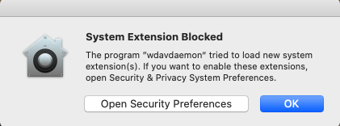
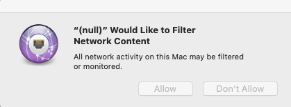

# <a name="microsoft-defender-for-endpoint-on-macos---system-extensions-public-preview"></a><span data-ttu-id="898ea-105">MacOS의 끝점용 Microsoft Defender - 시스템 확장 공개 미리 보기)</span><span class="sxs-lookup"><span data-stu-id="898ea-105">Microsoft Defender for Endpoint on macOS - system extensions public preview)</span></span>

<span data-ttu-id="898ea-106">**적용 대상:**</span><span class="sxs-lookup"><span data-stu-id="898ea-106">**Applies to:**</span></span>
- [<span data-ttu-id="898ea-107">엔드포인트용 Microsoft Defender</span><span class="sxs-lookup"><span data-stu-id="898ea-107">Microsoft Defender for Endpoint</span></span>](https://go.microsoft.com/fwlink/p/?linkid=2154037)
- [<span data-ttu-id="898ea-108">Microsoft 365 Defender</span><span class="sxs-lookup"><span data-stu-id="898ea-108">Microsoft 365 Defender</span></span>](https://go.microsoft.com/fwlink/?linkid=2118804)

> <span data-ttu-id="898ea-109">끝점용 Microsoft Defender를 경험하고 싶나요?</span><span class="sxs-lookup"><span data-stu-id="898ea-109">Want to experience Microsoft Defender for Endpoint?</span></span> [<span data-ttu-id="898ea-110">무료 평가판에 등록합니다.</span><span class="sxs-lookup"><span data-stu-id="898ea-110">Sign up for a free trial.</span></span>](https://www.microsoft.com/microsoft-365/windows/microsoft-defender-atp?ocid=docs-wdatp-exposedapis-abovefoldlink)

<span data-ttu-id="898ea-111">MacOS의 진화에 맞춰 커널 확장 대신 시스템 확장을 활용하는 Mac용 끝점용 Defender 업데이트를 준비하고 있습니다.</span><span class="sxs-lookup"><span data-stu-id="898ea-111">In alignment with macOS evolution, we are preparing a Defender for Endpoint for Mac update that leverages system extensions instead of kernel extensions.</span></span> <span data-ttu-id="898ea-112">이 업데이트는 macOS 카탈로니아어(10.15.4) 이상 버전의 macOS에만 적용됩니다.</span><span class="sxs-lookup"><span data-stu-id="898ea-112">This update will only apply to macOS Catalina (10.15.4) and later versions of macOS.</span></span>

<span data-ttu-id="898ea-113">이 기능은 현재 공개 미리 보기로 제공됩니다.</span><span class="sxs-lookup"><span data-stu-id="898ea-113">This functionality is currently in public preview.</span></span> <span data-ttu-id="898ea-114">이 문서에서는 장치에서 이 기능을 사용하도록 설정하는 방법을 설명합니다.</span><span class="sxs-lookup"><span data-stu-id="898ea-114">This article describes how to enable this functionality on your device.</span></span> <span data-ttu-id="898ea-115">자신의 장치에서 로컬로 이 기능을 사용해 보거나 관리 도구를 통해 원격으로 구성할 수 있습니다.</span><span class="sxs-lookup"><span data-stu-id="898ea-115">You can try out this feature locally on your own device or configure it remotely through a management tool.</span></span>

<span data-ttu-id="898ea-116">이 단계에서는 디바이스에서 끝점용 Defender가 이미 실행되고 있는 것으로 가정합니다.</span><span class="sxs-lookup"><span data-stu-id="898ea-116">These steps assume you already have Defender for Endpoint running on your device.</span></span> <span data-ttu-id="898ea-117">자세한 내용은 [이 페이지](microsoft-defender-endpoint-mac.md)를 참조하세요.</span><span class="sxs-lookup"><span data-stu-id="898ea-117">For more information, see [this page](microsoft-defender-endpoint-mac.md).</span></span>

## <a name="known-issues"></a><span data-ttu-id="898ea-118">알려진 문제</span><span class="sxs-lookup"><span data-stu-id="898ea-118">Known issues</span></span>

- <span data-ttu-id="898ea-119">Apple SSO Kerberos 확장을 개입하는 네트워크 확장에 대한 보고서를 수신했습니다.</span><span class="sxs-lookup"><span data-stu-id="898ea-119">We’ve received reports of the network extension interfering with the Apple SSO Kerberos extension.</span></span>
- <span data-ttu-id="898ea-120">현재 버전의 제품에서는 여전히 커널 확장이 설치됩니다.</span><span class="sxs-lookup"><span data-stu-id="898ea-120">The current version of the product still installs a kernel extension.</span></span> <span data-ttu-id="898ea-121">커널 확장은 콜백 메커니즘으로만 사용되어 이 기능이 공개 미리 보기에 도달하기 전에 제거됩니다.</span><span class="sxs-lookup"><span data-stu-id="898ea-121">The kernel extension is only used as a fallback mechanism and will be removed before this feature reaches public preview.</span></span>
- <span data-ttu-id="898ea-122">MacOS 11 Big Sur에서 제대로 배포 및 작동되는 제품 버전에 대한 작업을 계속 진행하고 있습니다.</span><span class="sxs-lookup"><span data-stu-id="898ea-122">We're still working on a product version that deploys and functions properly on macOS 11 Big Sur.</span></span>

## <a name="deployment-prerequisites"></a><span data-ttu-id="898ea-123">배포 선행 구성</span><span class="sxs-lookup"><span data-stu-id="898ea-123">Deployment prerequisites</span></span>

- <span data-ttu-id="898ea-124">최소 macOS 운영 체제 버전: **10.15.4**</span><span class="sxs-lookup"><span data-stu-id="898ea-124">Minimum macOS operating system version: **10.15.4**</span></span>
- <span data-ttu-id="898ea-125">최소 제품 버전: **101.03.73**</span><span class="sxs-lookup"><span data-stu-id="898ea-125">Minimum product version: **101.03.73**</span></span>
- <span data-ttu-id="898ea-126">장치가 Insider Fast 업데이트 **채널에 있어야 합니다.**</span><span class="sxs-lookup"><span data-stu-id="898ea-126">Your device must be in the **Insider Fast update channel**.</span></span> <span data-ttu-id="898ea-127">다음 명령을 사용하여 업데이트 채널을 확인할 수 있습니다.</span><span class="sxs-lookup"><span data-stu-id="898ea-127">You can check the update channel by using the following command:</span></span>

  ```bash
  mdatp health --field release_ring
  ```

  <span data-ttu-id="898ea-128">장치가 Insider Fast 업데이트 채널에 아직 없는 경우 터미널에서 다음 명령을 실행합니다.</span><span class="sxs-lookup"><span data-stu-id="898ea-128">If your device isn't already in the Insider Fast update channel, execute the following command from the Terminal.</span></span> <span data-ttu-id="898ea-129">채널 업데이트는 다음에 제품이 시작될 때(다음 제품 업데이트가 설치되거나 장치가 다시 시작될 때) 적용됩니다.</span><span class="sxs-lookup"><span data-stu-id="898ea-129">The channel update takes effect the next time the product starts (when the next product update is installed, or when the device is rebooted).</span></span>

  ```bash
  defaults write com.microsoft.autoupdate2 ChannelName -string Beta
  ```

  <span data-ttu-id="898ea-130">또는 관리되는 환경(JAMF 또는 Intune)에 있는 경우 원격으로 업데이트 채널을 구성할 수 있습니다.</span><span class="sxs-lookup"><span data-stu-id="898ea-130">Alternatively, if you're in a managed environment (JAMF or Intune), you can configure the update channel remotely.</span></span> <span data-ttu-id="898ea-131">자세한 내용은 Mac용 [끝점용 Microsoft Defender 업데이트 배포: 채널 이름 설정 을 참조하세요.](mac-updates.md#set-the-channel-name)</span><span class="sxs-lookup"><span data-stu-id="898ea-131">For more information, see [Deploy updates for Microsoft Defender for Endpoint for Mac: Set the channel name](mac-updates.md#set-the-channel-name).</span></span>

## <a name="deployment-steps"></a><span data-ttu-id="898ea-132">배포 단계</span><span class="sxs-lookup"><span data-stu-id="898ea-132">Deployment steps</span></span>

<span data-ttu-id="898ea-133">해당 환경에 해당하는 배포 단계 및 이 기능을 사용하는 기본 방법을 따릅니다.</span><span class="sxs-lookup"><span data-stu-id="898ea-133">Follow the deployment steps that correspond to your environment and your preferred method of trying out this feature.</span></span>

### <a name="manual-deployment"></a><span data-ttu-id="898ea-134">수동 배포</span><span class="sxs-lookup"><span data-stu-id="898ea-134">Manual deployment</span></span>

#### <a name="approve-the-system-extensions-and-enable-the-network-extension"></a><span data-ttu-id="898ea-135">시스템 확장 승인 및 네트워크 확장 사용</span><span class="sxs-lookup"><span data-stu-id="898ea-135">Approve the system extensions and enable the network extension</span></span>

1. <span data-ttu-id="898ea-136">모든 배포 선행 요구가 충족된 후 장치를 다시 시작하여 시스템 확장 승인 및 정품 인증 프로세스를 시작합니다.</span><span class="sxs-lookup"><span data-stu-id="898ea-136">After all deployment prerequisites are met, restart your device to launch the system extension approval and activation process.</span></span>

   <span data-ttu-id="898ea-137">Endpoint 시스템 확장에 대한 Defender를 승인하라는 시스템 메시지가 일련의 표시될 수 있습니다.</span><span class="sxs-lookup"><span data-stu-id="898ea-137">You'll see a series of system prompts to approve the Defender for Endpoint system extensions.</span></span> <span data-ttu-id="898ea-138">MacOS는  Mac용 Endpoint용 Defender가 장치에 설치하는 각 확장에 대해 명시적 승인이 필요하기 때문에 시리즈의 모든 프롬프트를 승인해야 합니다.</span><span class="sxs-lookup"><span data-stu-id="898ea-138">You must approve **all** prompts from the series, because macOS requires an explicit approval for each extension that Defender for Endpoint for Mac installs on the device.</span></span>
   
   <span data-ttu-id="898ea-139">각 승인에 대해 **보안** 기본 설정  열기 를 선택한 다음 시스템 확장 실행 허용을 선택합니다.</span><span class="sxs-lookup"><span data-stu-id="898ea-139">For each approval, select **Open Security Preferences** and then select **Allow** to allow the system extension to run.</span></span>

   > [!IMPORTANT]
   > <span data-ttu-id="898ea-140">후속 승인 사이에 개인 정보 보호 창의 시스템 기본 설정 &  >   닫았다가 다시 열 수 있어야 합니다.</span><span class="sxs-lookup"><span data-stu-id="898ea-140">You must close and reopen the **System Preferences** > **Security & Privacy** window between subsequent approvals.</span></span> <span data-ttu-id="898ea-141">그렇지 않으면 macOS에서 다음 승인을 표시하지 않습니다.</span><span class="sxs-lookup"><span data-stu-id="898ea-141">Otherwise, macOS will not display the next approval.</span></span>

   > [!IMPORTANT]
   > <span data-ttu-id="898ea-142">제품이 커널 확장으로 돌아오기 전에 1분의 시간 제한이 있습니다.</span><span class="sxs-lookup"><span data-stu-id="898ea-142">There is a one-minute timeout before the product falls back to the kernel extension.</span></span> <span data-ttu-id="898ea-143">이렇게 하면 디바이스가 보호됩니다.</span><span class="sxs-lookup"><span data-stu-id="898ea-143">This ensures that the device is protected.</span></span>
   >
   > <span data-ttu-id="898ea-144">1분 이상 경과하면 장치를 다시 시작하거나 를 사용하여 승인 흐름을 다시 트리거하여 `sudo killall -9 wdavdaemon` 데몬을 다시 시작합니다.</span><span class="sxs-lookup"><span data-stu-id="898ea-144">If more than one minute elapses, restart the daemon by rebooting the device or by using `sudo killall -9 wdavdaemon` to trigger the approval flow again.</span></span>

   

   

1. <span data-ttu-id="898ea-147">시스템 확장이 승인되면 macOS에서 네트워크 트래픽을 필터링할 수 있도록 승인을 요청합니다.</span><span class="sxs-lookup"><span data-stu-id="898ea-147">After the system extensions are approved, macOS prompts for an approval to allow network traffic to be filtered.</span></span> <span data-ttu-id="898ea-148">허용을 **클릭합니다.**</span><span class="sxs-lookup"><span data-stu-id="898ea-148">Click **Allow**.</span></span>

   

#### <a name="grant-full-disk-access-to-the-endpoint-security-system-extension"></a><span data-ttu-id="898ea-150">끝점 보안 시스템 확장에 대한 전체 디스크 액세스 권한 부여</span><span class="sxs-lookup"><span data-stu-id="898ea-150">Grant Full Disk Access to the Endpoint Security system extension</span></span>

<span data-ttu-id="898ea-151">시스템 기본 **설정** 보안 & 개인 정보 보호 탭을  >    >   열고 Microsoft Defender  끝점 보안 확장에 대한 전체 디스크 액세스 권한을 **부여합니다.**</span><span class="sxs-lookup"><span data-stu-id="898ea-151">Open the **System Preferences** > **Security & Privacy** > **Privacy** tab and grant **Full Disk Access** to the **Microsoft Defender Endpoint Security Extension**.</span></span>


#### <a name="reboot-your-device"></a><span data-ttu-id="898ea-153">디바이스 다시부팅</span><span class="sxs-lookup"><span data-stu-id="898ea-153">Reboot your device</span></span>

<span data-ttu-id="898ea-154">변경 내용을 적용하려면 장치를 다시부팅해야 합니다.</span><span class="sxs-lookup"><span data-stu-id="898ea-154">In order for the changes to take effect, you must reboot your device.</span></span>

#### <a name="verify-that-the-system-extensions-are-running"></a><span data-ttu-id="898ea-155">시스템 확장이 실행 중인지 확인</span><span class="sxs-lookup"><span data-stu-id="898ea-155">Verify that the system extensions are running</span></span>

<span data-ttu-id="898ea-156">터미널에서 다음 명령을 실행합니다.</span><span class="sxs-lookup"><span data-stu-id="898ea-156">From the Terminal, run the following command:</span></span>

```bash
mdatp health --field real_time_protection_subsystem
```

<span data-ttu-id="898ea-157">터미널 출력은 제품이 시스템 확장 기능을 사용하고 있는 `endpoint_security_extension` 것으로 나타냅니다.</span><span class="sxs-lookup"><span data-stu-id="898ea-157">Terminal output `endpoint_security_extension` indicates the product is using the system extensions functionality.</span></span>

### <a name="managed-deployment"></a><span data-ttu-id="898ea-158">관리되는 배포</span><span class="sxs-lookup"><span data-stu-id="898ea-158">Managed deployment</span></span>

<span data-ttu-id="898ea-159">이 새 기능에 대해 배포해야 하는 새 구성 프로필에 대한 MACOS 카탈로리나 및 최신 버전의 macOS용 새 구성 [프로필: JAMF를](mac-sysext-policies.md#jamf) 참조하세요.</span><span class="sxs-lookup"><span data-stu-id="898ea-159">Refer to [New configuration profiles for macOS Catalina and newer versions of macOS: JAMF](mac-sysext-policies.md#jamf) for the new configuration profiles you must deploy for this new feature.</span></span>

<span data-ttu-id="898ea-160">이러한 프로필 외에도 배포 사전 구성 에 설명된 바와 같이 대상 장치가 Insider Fast 업데이트 채널에 있도록 [구성해야 합니다.](#deployment-prerequisites)</span><span class="sxs-lookup"><span data-stu-id="898ea-160">In addition to those profiles, make sure to configure the target devices to be in the Insider Fast update channel, as described in [Deployment prerequisites](#deployment-prerequisites).</span></span>

<span data-ttu-id="898ea-161">모든 선행 구성이 충족되고 새 구성 프로필이 배포된 장치에서 다음 명령을 실행합니다.</span><span class="sxs-lookup"><span data-stu-id="898ea-161">On a device where all prerequisites are met and the new configuration profiles have been deployed, run the following command:</span></span>

```bash
$ mdatp health --field real_time_protection_subsystem
```

<span data-ttu-id="898ea-162">이 명령이 인쇄될 경우 `endpoint_security_extension` 제품이 시스템 확장 기능을 사용 중입니다.</span><span class="sxs-lookup"><span data-stu-id="898ea-162">If this command prints `endpoint_security_extension`, the product is using the system extensions functionality.</span></span>

## <a name="validate-basic-scenarios"></a><span data-ttu-id="898ea-163">기본 시나리오 유효성 검사</span><span class="sxs-lookup"><span data-stu-id="898ea-163">Validate basic scenarios</span></span>

1. <span data-ttu-id="898ea-164">EICAR(European Institute for Computer Antivirus Research) 검색을 테스트합니다.</span><span class="sxs-lookup"><span data-stu-id="898ea-164">Test European Institute for Computer Antivirus Research (EICAR) detection.</span></span> <span data-ttu-id="898ea-165">터미널 창에서 다음 명령을 실행합니다.</span><span class="sxs-lookup"><span data-stu-id="898ea-165">From a Terminal window, run the following command:</span></span>

   ```bash
   curl -o eicar.txt https://secure.eicar.org/eicar.com.txt
   ```

   <span data-ttu-id="898ea-166">EICAR 파일이 대리된지 확인</span><span class="sxs-lookup"><span data-stu-id="898ea-166">Verify that the EICAR file is quarantined.</span></span> <span data-ttu-id="898ea-167">다음 명령을 사용하여 사용자 인터페이스의 보호 기록 페이지 또는 명령줄에서 파일의 상태를 확인할 수 있습니다.</span><span class="sxs-lookup"><span data-stu-id="898ea-167">You can verify the file's status on the Protection History page in the user interface, or from a command line by using the following command:</span></span>

    ```bash
    mdatp threat list
    ```

2. <span data-ttu-id="898ea-168">EDR(Endpoint Detection and Response) DIY 시나리오를 테스트합니다.</span><span class="sxs-lookup"><span data-stu-id="898ea-168">Test the Endpoint Detection and Response (EDR) DIY scenario.</span></span> <span data-ttu-id="898ea-169">터미널 창에서 다음 명령을 실행합니다.</span><span class="sxs-lookup"><span data-stu-id="898ea-169">From a terminal window, run the following command:</span></span>

   ```bash
   curl -o "MDATP MacOS DIY.zip" https://aka.ms/mdatpmacosdiy
   ```

   <span data-ttu-id="898ea-170">EICAR 및 EDR DIY 시나리오에 대한 컴퓨터 페이지의 포털에 두 개의 경고가 떠오르는지 확인하십시오.</span><span class="sxs-lookup"><span data-stu-id="898ea-170">Validate that two alerts popped up in the portal on the machine page for EICAR and EDR DIY scenarios.</span></span>

## <a name="frequently-asked-questions"></a><span data-ttu-id="898ea-171">자주 묻는 질문</span><span class="sxs-lookup"><span data-stu-id="898ea-171">Frequently asked questions</span></span>

- <span data-ttu-id="898ea-172">Q: 실행 시 여전히 `kernel_extension` 표시하는 이유는 `mdatp health --field real_time_protection_subsystem` 무엇입니까?</span><span class="sxs-lookup"><span data-stu-id="898ea-172">Q: Why am I still seeing `kernel_extension` when I run `mdatp health --field real_time_protection_subsystem`?</span></span>

    <span data-ttu-id="898ea-173">A: 배포 선행 사항 섹션을 다시 참조하고 모든 선행 구성이 충족하는지 다시 한 번 확인하십시오. [](#deployment-prerequisites)</span><span class="sxs-lookup"><span data-stu-id="898ea-173">A: Refer back to the [Deployment prerequisites](#deployment-prerequisites) section and double-check that all prerequisites are met.</span></span> <span data-ttu-id="898ea-174">모든 선행 요구가 충족되는 경우 장치를 다시 시작하고 다시 확인합니다.</span><span class="sxs-lookup"><span data-stu-id="898ea-174">If all prerequisites are met, restart your device and check again.</span></span>

- <span data-ttu-id="898ea-175">Q: macOS 11 Big Sur는 언제 지원될까요?</span><span class="sxs-lookup"><span data-stu-id="898ea-175">Q: When will macOS 11 Big Sur be supported?</span></span>

    <span data-ttu-id="898ea-176">A: MacOS 11에 대한 지원을 추가하기 위해 적극적으로 작업 중입니다.</span><span class="sxs-lookup"><span data-stu-id="898ea-176">A: We are actively working on adding support for macOS 11.</span></span> <span data-ttu-id="898ea-177">새로운 정보 페이지에 추가 [정보를 게시할 것입니다.](mac-whatsnew.md)</span><span class="sxs-lookup"><span data-stu-id="898ea-177">We will post more information to the [What's new](mac-whatsnew.md) page.</span></span>
