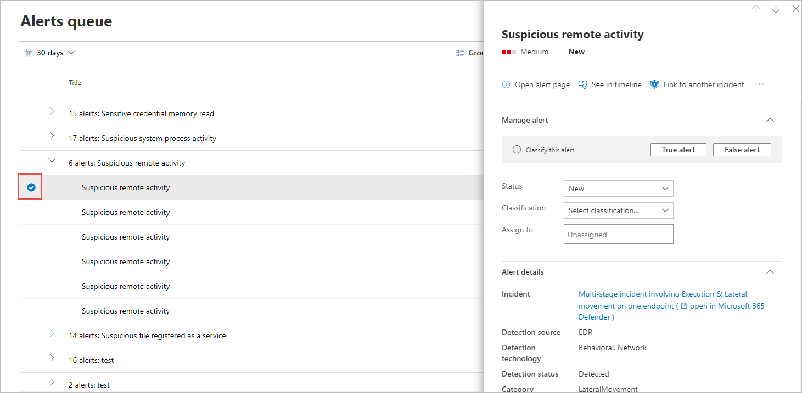

# 끝점 경고에 대한 Microsoft Defender 관리

[!INCLUDE [Microsoft 365 Defender rebranding](../../includes/microsoft-defender.md)]

**적용 대상:**
- [엔드포인트용 Microsoft Defender](https://go.microsoft.com/fwlink/p/?linkid=2154037)
- [Microsoft 365 Defender](https://go.microsoft.com/fwlink/?linkid=2118804)

> Endpoint용 Defender를 경험하고 싶나요? [무료 평가판을 신청하세요.](https://signup.microsoft.com/create-account/signup?products=7f379fee-c4f9-4278-b0a1-e4c8c2fcdf7e&ru=https://aka.ms/MDEp2OpenTrial?ocid=docs-wdatp-managealerts-abovefoldlink)

Endpoint용 Defender는 경고를 통해 가능한 악성 이벤트, 특성 및 상황 정보를 알리고 있습니다. 보안 작업 대시보드에는 새 경고에 대한 요약이 표시되고 경고 큐의 모든 경고에 액세스할 **수 있습니다.**

경고 큐 또는 개별 장치에 대한 장치 페이지의 경고  탭에서 경고를 선택하여 경고를 관리할 수 있습니다.

이러한 위치 중 하나에서 경고를 선택하면 경고 관리 **창이 표시됩니다.**

## 다른 인시던트에 연결

경고에서 새 인시던트 또는 기존 인시던트에 대한 링크를 만들 수 있습니다.

## 경고 할당

알림이 아직 할당되지 않은 경우  사용자에게 할당을 선택하여 사용자에게 알림을 할당할 수 있습니다.

## 경고 표시 안

경고가 경고에 나타나지 않을 수 있는 시나리오가 있을 Microsoft Defender 보안 센터. Endpoint용 Defender를 사용하면 조직의 알려진 도구 또는 프로세스와 같이 무해한 것으로 알려진 특정 경고에 대한 제거 규칙을 만들 수 있습니다.

제거 규칙은 기존 경고에서 만들 수 있습니다. 필요한 경우 사용하지 않도록 설정하고 다시 사용할 수 있습니다.

제거 규칙을 만들면 규칙이 만들어진 시점부터 적용됩니다. 이 규칙은 규칙을 만들기 전에 큐에 이미 있는 기존 경고에 영향을 주지 않습니다. 규칙은 규칙을 만든 후 설정된 조건을 충족하는 경고에만 적용됩니다.

제거 규칙에 대한 두 가지 컨텍스트 중 선택할 수 있습니다.

- **이 장치에서 경고 표시 안 하세요.**
- **조직에서 경고 표시 안 하게**

규칙의 컨텍스트를 통해 포털에 표시될 수 있는 정보를 조정하고 포털에 실제 보안 알림만 표시되도록 할 수 있습니다.

다음 표의 예제를 사용하여 제거 규칙에 대한 컨텍스트를 선택할 수 있습니다.

|컨텍스트|정의|예제 시나리오|
|---|---|---|
|**이 장치에서 경고 표시 안 하세요.**|경고 제목이 같고 해당 특정 디바이스에서만 경고가 표시되지 않습니다. 
 해당 장치의 다른 모든 경고는 억제되지 않습니다.|<ul><li>보안 연구원이 조직의 다른 장치를 공격하는 데 사용된 악성 스크립트를 조사하고 있습니다.</li><li>개발자는 정기적으로 팀을 위한 PowerShell 스크립트를 만듭니다.</li></ul>|
|**조직에서 경고 표시 안 하게**|모든 장치에서 동일한 경고 제목이 있는 경고는 표시되지 않습니다.|<ul><li>조직의 모든 사람이 무해한 관리 도구를 사용합니다.</li></ul>|

### 경고 표시 안 하여 새 제거 규칙 만들기

경고가 제거되거나 해결된 경우를 제어하는 사용자 지정 규칙을 만들 수 있습니다. 경고 제목, 손상 표시기 및 조건을 지정하여 경고가 억제되는 경우의 컨텍스트를 제어할 수 있습니다. 컨텍스트를 지정한 후 경고에 대한 작업 및 범위를 구성할 수 있습니다.

1. 표시하지 말아야 할 경고를 선택합니다. 그러면 경고 관리 **창이** 표시됩니다.

2. 제거 **규칙 만들기 를 선택합니다.**

    이러한 특성을 사용하여 제거 조건을 만들 수 있습니다. 각 조건 사이에 AND 연산자가 적용되어 모든 조건이 충족될 때만 제거가 발생합니다.

    - 파일 SHA1
    - 파일 이름 - 와일드카드 지원
    - 폴더 경로 - 와일드카드 지원
    - IP 주소
    - URL - 와일드카드 지원
    - 명령줄 - 와일드카드 지원

3. **IOC 트리거 를 선택합니다.**

4. 경고에 대한 작업 및 범위를 지정합니다.

   경고를 자동으로 해결하거나 포털에서 숨길 수 있습니다. 자동으로 해결되는 경고는 경고 큐, 경고 페이지 및 장치 타임라인의 해결된 섹션에 표시되며 Endpoint API용 Defender에서 해결된 것으로 표시됩니다.

   숨김으로 표시된 경고는 장치의 연결된 경고와 대시보드에서 모두 전체 시스템에서 제거되지 않습니다. 끝점 API용 Defender에서 스트리밍되지 않습니다.

5. 규칙 이름과 설명을 입력합니다.

6. **저장** 을 클릭합니다.

#### 제거 규칙 목록 보기

1. 탐색 창에서 경고 **설정** \> **선택합니다.**

2. 제거 규칙 목록에는 조직의 사용자가 만든 모든 규칙이 표시됩니다.

제거 규칙 관리에 대한 자세한 내용은 제거 규칙 [관리를 참조하세요.](manage-suppression-rules.md)

## 경고 상태 변경

조사가 진행될 때 상태를 변경하여 경고(신규, 진행 중 또는 해결된 경고)를 분류할 수 있습니다.  이렇게 하면 팀이 경고에 대응하는 방법을 구성하고 관리하는 데 도움이 됩니다.

예를 들어 팀 리더는  모든 새 알림을 검토하고 추가  분석을 위해 진행 중인 경고 큐에 할당할 수 있습니다.

또는 경고가 무관한 장치(예: 보안 관리자에 속한 장치)에서 발생하거나 이전 경고를 통해 처리되고 있는 경우 해결된 경고를 해결된 큐에 할당할 수 있습니다. 

## 경고 분류

분류를 설정하지 못하게 선택하거나 경고가 실제 경고인지 또는 거짓 경고인지를 지정할 수 있습니다. 참 긍정/가성의 분류를 제공하는 것이 중요합니다. 이 분류는 경고 품질을 모니터링하고 경고의 정확도를 향상하는 데 사용됩니다. "결정" 필드는 "참 긍정" 분류에 대한 추가 고화성을 정의합니다.

## 설명 추가 및 경고 기록 보기

경고에 대한 설명을 추가하고 기록 이벤트를 보고 경고에 대한 이전 변경 내용을 볼 수 있습니다.

경고가 변경될 때마다 해당 경고가 설명 및 기록 섹션에 **기록됩니다.**

추가된 메모는 창에 바로 표시됩니다.

## 관련 항목

- [제거 규칙 관리](manage-suppression-rules.md)
- [엔드포인트용 Microsoft Defender 경고 큐 보기 및 구성](alerts-queue.md)
- [끝점 경고에 대한 Microsoft Defender 조사](investigate-alerts.md)
- [끝점 경고에 대한 Microsoft Defender와 관련된 파일 조사](investigate-files.md)
- [Microsoft Defender for Endpoint Devices 목록에서 장치 조사](investigate-machines.md)
- [끝점 경고에 대한 Microsoft Defender와 연결된 IP 주소 조사](investigate-ip.md)
- [끝점 경고에 대한 Microsoft Defender와 연결된 도메인 조사](investigate-domain.md)
- [끝점용 Microsoft Defender에서 사용자 계정 조사](investigate-user.md)
