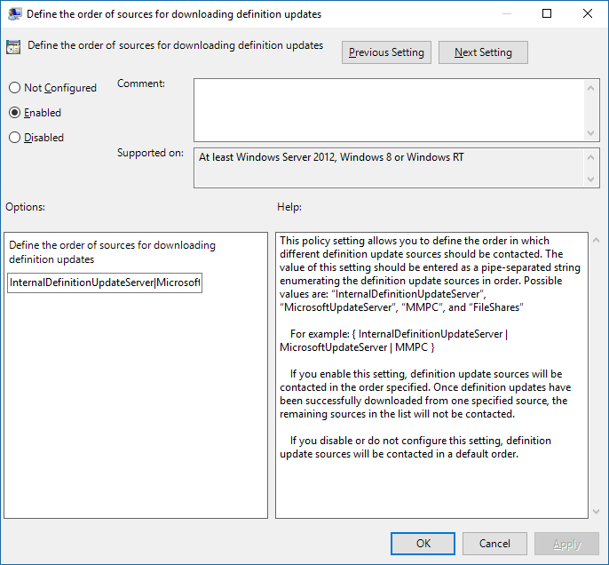

# <a name="manage-the-sources-for-microsoft-defender-antivirus-protection-updates"></a><span data-ttu-id="70eb7-104">Microsoft Defender 바이러스 백신 보호 업데이트 원본 관리</span><span class="sxs-lookup"><span data-stu-id="70eb7-104">Manage the sources for Microsoft Defender Antivirus protection updates</span></span>

[!INCLUDE [Microsoft 365 Defender rebranding](../../includes/microsoft-defender.md)]


<span data-ttu-id="70eb7-105">**적용 대상:**</span><span class="sxs-lookup"><span data-stu-id="70eb7-105">**Applies to:**</span></span>

- <span data-ttu-id="70eb7-106">[엔드포인트용 Microsoft Defender](https://go.microsoft.com/fwlink/p/?linkid=22154037) </span><span class="sxs-lookup"><span data-stu-id="70eb7-106">[Microsoft Defender for Endpoint](https://go.microsoft.com/fwlink/p/?linkid=22154037)</span></span>

<a id="protection-updates"></a>
<!-- this has been used as anchor in VDI content -->

<span data-ttu-id="70eb7-107">바이러스 백신 보호를 최신 상태로 유지하는 것이 중요합니다.</span><span class="sxs-lookup"><span data-stu-id="70eb7-107">Keeping your antivirus protection up to date is critical.</span></span> <span data-ttu-id="70eb7-108">Microsoft Defender 바이러스 백신에 대한 보호 업데이트를 관리하기 위한 두 가지 구성 요소가 있습니다.</span><span class="sxs-lookup"><span data-stu-id="70eb7-108">There are two components to managing protection updates for Microsoft Defender Antivirus:</span></span> 
- <span data-ttu-id="70eb7-109">*업데이트가* 다운로드되는 위치 및</span><span class="sxs-lookup"><span data-stu-id="70eb7-109">*Where* the updates are downloaded from; and</span></span> 
- <span data-ttu-id="70eb7-110">*업데이트가* 다운로드되고 적용될 때</span><span class="sxs-lookup"><span data-stu-id="70eb7-110">*When* updates are downloaded and applied.</span></span> 

<span data-ttu-id="70eb7-111">이 문서에서는 업데이트를 다운로드할 위치를 지정하는 방법에 대해 설명하고 있습니다(이를 변경 순서라고도 합니다).</span><span class="sxs-lookup"><span data-stu-id="70eb7-111">This article describes how to specify from where updates should be downloaded (this is also known as the fallback order).</span></span> <span data-ttu-id="70eb7-112">업데이트 작동 방식 및 업데이트의 다른 측면(예: 업데이트 계획)을 구성하는 방법에 대한 개요는 [Microsoft Defender 바이러스](manage-updates-baselines-microsoft-defender-antivirus.md) 백신 업데이트 관리 및 기준 적용 항목을 참조하세요.</span><span class="sxs-lookup"><span data-stu-id="70eb7-112">See [Manage Microsoft Defender Antivirus updates and apply baselines](manage-updates-baselines-microsoft-defender-antivirus.md) topic for an overview on how updates work, and how to configure other aspects of updates (such as scheduling updates).</span></span>

> [!IMPORTANT]
> <span data-ttu-id="70eb7-113">Microsoft Defender 바이러스 백신 보안 인텔리전스 업데이트는 Windows 업데이트를 통해 전달됩니다. 2019년 10월 21일 월요일부터 모든 보안 인텔리전스 업데이트는 SHA-2로 단독 서명됩니다.</span><span class="sxs-lookup"><span data-stu-id="70eb7-113">Microsoft Defender Antivirus Security intelligence updates are delivered through Windows Update and starting Monday, October 21, 2019, all security intelligence updates will be SHA-2 signed exclusively.</span></span> <span data-ttu-id="70eb7-114">보안 인텔리전스를 업데이트하려면 SHA-2를 지원하기 위해 장치를 업데이트해야 합니다.</span><span class="sxs-lookup"><span data-stu-id="70eb7-114">Your devices must be updated to support SHA-2 in order to update your security intelligence.</span></span> <span data-ttu-id="70eb7-115">자세한 내용은 Windows 및 [WSUS에 대한 2019 SHA-2 코드 서명 지원 요구 사항을 참조합니다.](https://support.microsoft.com/help/4472027/2019-sha-2-code-signing-support-requirement-for-windows-and-wsus)</span><span class="sxs-lookup"><span data-stu-id="70eb7-115">To learn more, see [2019 SHA-2 Code Signing Support requirement for Windows and WSUS](https://support.microsoft.com/help/4472027/2019-sha-2-code-signing-support-requirement-for-windows-and-wsus).</span></span>  


<a id="fallback-order"></a>

## <a name="fallback-order"></a><span data-ttu-id="70eb7-116">Fallback order</span><span class="sxs-lookup"><span data-stu-id="70eb7-116">Fallback order</span></span>

<span data-ttu-id="70eb7-117">일반적으로 네트워크 구성에 따라 기본 원본에서 업데이트를 개별적으로 다운로드하고 그 다음에 다른 원본을 우선 순위대로 다운로드하도록 끝점을 구성합니다.</span><span class="sxs-lookup"><span data-stu-id="70eb7-117">Typically, you configure endpoints to individually download updates from a primary source followed by other sources in order of priority, based on your network configuration.</span></span> <span data-ttu-id="70eb7-118">업데이트는 사용자가 지정한 순서대로 원본에서 얻습니다.</span><span class="sxs-lookup"><span data-stu-id="70eb7-118">Updates are obtained from sources in the order you specify.</span></span> <span data-ttu-id="70eb7-119">원본을 사용할 수 없는 경우 목록의 다음 원본이 즉시 사용됩니다.</span><span class="sxs-lookup"><span data-stu-id="70eb7-119">If a source is not available, the next source in the list is used immediately.</span></span>

<span data-ttu-id="70eb7-120">업데이트가 게시될 때 업데이트 크기를 최소화하기 위해 일부 논리가 적용됩니다.</span><span class="sxs-lookup"><span data-stu-id="70eb7-120">When updates are published, some logic is applied to minimize the size of the update.</span></span> <span data-ttu-id="70eb7-121">대부분의 경우 장치에서 최신 업데이트와 현재 설치된 업데이트(델타라고도 지칭)의 차이점만 다운로드되고 적용됩니다.</span><span class="sxs-lookup"><span data-stu-id="70eb7-121">In most cases, only the differences between the latest update and the update that is currently installed (this is referred to as the delta) on the device is downloaded and applied.</span></span> <span data-ttu-id="70eb7-122">그러나 델타 크기는 다음 두 가지 주요 요인에 따라 결정됩니다.</span><span class="sxs-lookup"><span data-stu-id="70eb7-122">However, the size of the delta depends on two main factors:</span></span>
- <span data-ttu-id="70eb7-123">장치에서 마지막 업데이트의 사용 기한입니다. 및</span><span class="sxs-lookup"><span data-stu-id="70eb7-123">The age of the last update on the device; and</span></span> 
- <span data-ttu-id="70eb7-124">업데이트를 다운로드하고 적용하는 데 사용되는 원본입니다.</span><span class="sxs-lookup"><span data-stu-id="70eb7-124">The source used to download and apply updates.</span></span> 

<span data-ttu-id="70eb7-125">끝점의 업데이트가 오래될수록 다운로드가 커집니다.</span><span class="sxs-lookup"><span data-stu-id="70eb7-125">The older the updates on an endpoint, the larger the download will be.</span></span> <span data-ttu-id="70eb7-126">그러나 다운로드 빈도도 고려해야 합니다.</span><span class="sxs-lookup"><span data-stu-id="70eb7-126">However, you must also consider download frequency as well.</span></span> <span data-ttu-id="70eb7-127">업데이트 일정이 잦을수록 네트워크 사용량이 증가할 수 있는 반면 일정이 적을수록 다운로드당 파일 크기가 커집니다.</span><span class="sxs-lookup"><span data-stu-id="70eb7-127">A more frequent update schedule can result in more network usage, whereas a less-frequent schedule can result in larger file sizes per download.</span></span> 

<span data-ttu-id="70eb7-128">끝점에서 업데이트를 받을 위치를 지정할 수 있는 위치는 5개입니다.</span><span class="sxs-lookup"><span data-stu-id="70eb7-128">There are five locations where you can specify where an endpoint should obtain updates:</span></span> 

- [<span data-ttu-id="70eb7-129">Microsoft 업데이트</span><span class="sxs-lookup"><span data-stu-id="70eb7-129">Microsoft Update</span></span>](https://support.microsoft.com/help/12373/windows-update-faq)
- [<span data-ttu-id="70eb7-130">Windows Server Update Service</span><span class="sxs-lookup"><span data-stu-id="70eb7-130">Windows Server Update Service</span></span>](/windows-server/administration/windows-server-update-services/get-started/windows-server-update-services-wsus)
- [<span data-ttu-id="70eb7-131">Microsoft Endpoint Configuration Manager</span><span class="sxs-lookup"><span data-stu-id="70eb7-131">Microsoft Endpoint Configuration Manager</span></span>](/configmgr/core/servers/manage/updates)
- [<span data-ttu-id="70eb7-132">네트워크 파일 공유</span><span class="sxs-lookup"><span data-stu-id="70eb7-132">Network file share</span></span>](#unc-share)
- <span data-ttu-id="70eb7-133">[Microsoft Defender 바이러스](https://www.microsoft.com/en-us/wdsi/defenderupdates) 백신 및 기타 Microsoft 맬웨어 방지에 대한 보안 인텔리전스 업데이트(정책 및 레지스트리에 MMPC(Microsoft 맬웨어 보호 센터) 보안 인텔리전스, 이전 이름으로 나열될 수 있습니다.</span><span class="sxs-lookup"><span data-stu-id="70eb7-133">[Security intelligence updates for Microsoft Defender Antivirus and other Microsoft antimalware](https://www.microsoft.com/en-us/wdsi/defenderupdates) (Your policy and registry might have this listed as Microsoft Malware Protection Center (MMPC) security intelligence, its former name.)</span></span>

<span data-ttu-id="70eb7-134">Microsoft 업데이트는 최상의 보호 수준을 보장하기 위해 빠른 릴리스를 허용합니다. 즉, 자주 더 작은 다운로드가 가능합니다.</span><span class="sxs-lookup"><span data-stu-id="70eb7-134">To ensure the best level of protection, Microsoft Update allows for rapid releases, which means smaller downloads on a frequent basis.</span></span> <span data-ttu-id="70eb7-135">Windows Server Update Service, Microsoft Endpoint Configuration Manager 및 Microsoft 보안 인텔리전스 업데이트 원본은 덜 자주 업데이트를 제공합니다.</span><span class="sxs-lookup"><span data-stu-id="70eb7-135">The Windows Server Update Service, Microsoft Endpoint Configuration Manager, and Microsoft security intelligence updates sources deliver less frequent updates.</span></span> <span data-ttu-id="70eb7-136">따라서 델타가 커서 더 큰 다운로드가 생성될 수 있습니다.</span><span class="sxs-lookup"><span data-stu-id="70eb7-136">Thus, the delta can be larger, resulting in larger downloads.</span></span> 

> [!IMPORTANT]
> <span data-ttu-id="70eb7-137">Windows Server Update Service 또는 Microsoft Update 이후에 [Microsoft](https://www.microsoft.com/security/portal/definitions/adl.aspx) 보안 인텔리전스 페이지 업데이트를 폴백 원본으로 설정한 경우 현재 업데이트가 최신 버전이 아니면 보안 인텔리전스 업데이트에서만 업데이트가 다운로드됩니다.</span><span class="sxs-lookup"><span data-stu-id="70eb7-137">If you have set [Microsoft Security intelligence page](https://www.microsoft.com/security/portal/definitions/adl.aspx) updates as a fallback source after Windows Server Update Service or Microsoft Update, updates are only downloaded from security intelligence updates when the current update is considered out-of-date.</span></span> <span data-ttu-id="70eb7-138">기본적으로 이 날짜는 7일 연속으로 Windows Server Update Service 또는 Microsoft Update Services에서 업데이트를 적용할 수 없습니다.</span><span class="sxs-lookup"><span data-stu-id="70eb7-138">(By default, this is seven consecutive days of not being able to apply updates from the Windows Server Update Service or Microsoft Update services).</span></span>
> <span data-ttu-id="70eb7-139">그러나 보호가 기한이 지난 것으로 보고되기 전까지의 일 수를 설정할 [수 있습니다.](/windows/threat-protection/microsoft-defender-antivirus/manage-outdated-endpoints-microsoft-defender-antivirus#set-the-number-of-days-before-protection-is-reported-as-out-of-date)</span><span class="sxs-lookup"><span data-stu-id="70eb7-139">You can, however, [set the number of days before protection is reported as out-of-date](/windows/threat-protection/microsoft-defender-antivirus/manage-outdated-endpoints-microsoft-defender-antivirus#set-the-number-of-days-before-protection-is-reported-as-out-of-date).</span></span><p>
> <span data-ttu-id="70eb7-140">2019년 10월 21일 월요일부터 보안 인텔리전스 업데이트는 SHA-2 전용으로 서명됩니다.</span><span class="sxs-lookup"><span data-stu-id="70eb7-140">Starting Monday, October 21, 2019, security intelligence updates will be SHA-2 signed exclusively.</span></span> <span data-ttu-id="70eb7-141">최신 보안 인텔리전스 업데이트를 다운로드하려면 SHA-2를 지원하기 위해 장치를 업데이트해야 합니다.</span><span class="sxs-lookup"><span data-stu-id="70eb7-141">Devices must be updated to support SHA-2 in order to get the latest security intelligence updates.</span></span> <span data-ttu-id="70eb7-142">자세한 내용은 Windows 및 [WSUS에 대한 2019 SHA-2 코드 서명 지원 요구 사항을 참조합니다.](https://support.microsoft.com/help/4472027/2019-sha-2-code-signing-support-requirement-for-windows-and-wsus)</span><span class="sxs-lookup"><span data-stu-id="70eb7-142">To learn more, see [2019 SHA-2 Code Signing Support requirement for Windows and WSUS](https://support.microsoft.com/help/4472027/2019-sha-2-code-signing-support-requirement-for-windows-and-wsus).</span></span>

<span data-ttu-id="70eb7-143">각 원본에는 다음 표에 설명된 바와 같이 네트워크 구성 방식과 업데이트를 게시하는 정도에 따라 달라지는 일반적인 시나리오가 있습니다.</span><span class="sxs-lookup"><span data-stu-id="70eb7-143">Each source has typical scenarios that depend on how your network is configured, in addition to how often they publish updates, as described in the following table:</span></span>

|<span data-ttu-id="70eb7-144">위치</span><span class="sxs-lookup"><span data-stu-id="70eb7-144">Location</span></span> | <span data-ttu-id="70eb7-145">예제 시나리오</span><span class="sxs-lookup"><span data-stu-id="70eb7-145">Sample scenario</span></span> |
|---|---|
|<span data-ttu-id="70eb7-146">Windows Server Update Service</span><span class="sxs-lookup"><span data-stu-id="70eb7-146">Windows Server Update Service</span></span> | <span data-ttu-id="70eb7-147">Windows Server Update Service를 사용하여 네트워크에 대한 업데이트를 관리하고 있습니다.</span><span class="sxs-lookup"><span data-stu-id="70eb7-147">You are using Windows Server Update Service to manage updates for your network.</span></span>|
|<span data-ttu-id="70eb7-148">Microsoft 업데이트</span><span class="sxs-lookup"><span data-stu-id="70eb7-148">Microsoft Update</span></span> | <span data-ttu-id="70eb7-149">끝점이 Microsoft 업데이트에 직접 연결하게 하려는 경우</span><span class="sxs-lookup"><span data-stu-id="70eb7-149">You want your endpoints to connect directly to Microsoft Update.</span></span> <span data-ttu-id="70eb7-150">이 기능은 엔터프라이즈 네트워크에 불규칙하게 연결되는 끝점이나 Windows Server Update Service를 사용하여 업데이트를 관리하지 않는 경우 유용할 수 있습니다.</span><span class="sxs-lookup"><span data-stu-id="70eb7-150">This can be useful for endpoints that irregularly connect to your enterprise network, or if you do not use Windows Server Update Service to manage your updates.</span></span>|
|<span data-ttu-id="70eb7-151">파일 공유</span><span class="sxs-lookup"><span data-stu-id="70eb7-151">File share</span></span> | <span data-ttu-id="70eb7-152">인터넷에 연결되지 않은 장치(예: VM)가 있습니다.</span><span class="sxs-lookup"><span data-stu-id="70eb7-152">You have non-Internet-connected devices (such as VMs).</span></span> <span data-ttu-id="70eb7-153">인터넷에 연결된 VM 호스트를 사용하여 VM이 업데이트를 받을 수 있는 네트워크 공유에 대한 업데이트를 다운로드할 수 있습니다.</span><span class="sxs-lookup"><span data-stu-id="70eb7-153">You can use your Internet-connected VM host to download the updates to a network share, from which the VMs can obtain the updates.</span></span> <span data-ttu-id="70eb7-154">[VDI(가상](deployment-vdi-microsoft-defender-antivirus.md) 데스크톱 인프라) 환경에서 파일 공유를 사용하는 방법에 대한 자세한 내용은 VDI 배포 가이드를 참조하세요.</span><span class="sxs-lookup"><span data-stu-id="70eb7-154">See the [VDI deployment guide](deployment-vdi-microsoft-defender-antivirus.md) for how file shares can be used in virtual desktop infrastructure (VDI) environments.</span></span>|
|<span data-ttu-id="70eb7-155">Microsoft Endpoint Manager</span><span class="sxs-lookup"><span data-stu-id="70eb7-155">Microsoft Endpoint Manager</span></span> | <span data-ttu-id="70eb7-156">Microsoft Endpoint Manager를 사용하여 끝점을 업데이트하고 있습니다.</span><span class="sxs-lookup"><span data-stu-id="70eb7-156">You are using Microsoft Endpoint Manager to update your endpoints.</span></span>|
|<span data-ttu-id="70eb7-157">Microsoft Defender 바이러스 백신 및 기타 Microsoft 맬웨어 방지(이전의 MMPC)에 대한 보안 인텔리전스 업데이트</span><span class="sxs-lookup"><span data-stu-id="70eb7-157">Security intelligence updates for Microsoft Defender Antivirus and other Microsoft antimalware (formerly referred to as MMPC)</span></span> |<span data-ttu-id="70eb7-158">[SHA-2를 지원하기 위해](https://support.microsoft.com/help/4472027/2019-sha-2-code-signing-support-requirement-for-windows-and-wsus)장치가 업데이트되어 있는지 확인</span><span class="sxs-lookup"><span data-stu-id="70eb7-158">[Make sure your devices are updated to support SHA-2](https://support.microsoft.com/help/4472027/2019-sha-2-code-signing-support-requirement-for-windows-and-wsus).</span></span> <span data-ttu-id="70eb7-159">Microsoft Defender 바이러스 백신 보안 인텔리전스 업데이트는 Windows 업데이트를 통해 전달됩니다. 2019년 10월 21일 월요일부터 보안 인텔리전스 업데이트는 SHA-2 전용으로 서명됩니다.</span><span class="sxs-lookup"><span data-stu-id="70eb7-159">Microsoft Defender Antivirus Security intelligence updates are delivered through Windows Update, and starting Monday October 21, 2019 security intelligence updates will be SHA-2 signed exclusively.</span></span> <br/><span data-ttu-id="70eb7-160">최근 감염으로 인하여 최신 보호 업데이트를 다운로드하거나 VDI 배포에 대한 강력한 기본 이미지를 [프로비전하는 데 도움이 됩니다.](deployment-vdi-microsoft-defender-antivirus.md)</span><span class="sxs-lookup"><span data-stu-id="70eb7-160">Download the latest protection updates because of a recent infection or to help provision a strong, base image for [VDI deployment](deployment-vdi-microsoft-defender-antivirus.md).</span></span> <span data-ttu-id="70eb7-161">이 옵션은 일반적으로 기본 원본이 아닌 최종 대체 원본으로만 사용해야 합니다.</span><span class="sxs-lookup"><span data-stu-id="70eb7-161">This option should generally be used only as a final fallback source, and not the primary source.</span></span> <span data-ttu-id="70eb7-162">지정된 일 수 동안 Windows Server Update Service 또는 Microsoft 업데이트에서 업데이트를 다운로드할 수 없는 경우만 [사용됩니다.](/windows/threat-protection/microsoft-defender-antivirus/manage-outdated-endpoints-microsoft-defender-antivirus#set-the-number-of-days-before-protection-is-reported-as-out-of-date)</span><span class="sxs-lookup"><span data-stu-id="70eb7-162">It will only be used if updates cannot be downloaded from Windows Server Update Service or Microsoft Update for [a specified number of days](/windows/threat-protection/microsoft-defender-antivirus/manage-outdated-endpoints-microsoft-defender-antivirus#set-the-number-of-days-before-protection-is-reported-as-out-of-date).</span></span>|

<span data-ttu-id="70eb7-163">그룹 정책, Microsoft Endpoint Configuration Manager, PowerShell cmdlet 및 WMI에서 업데이트 원본이 사용되는 순서를 관리할 수 있습니다.</span><span class="sxs-lookup"><span data-stu-id="70eb7-163">You can manage the order in which update sources are used with Group Policy, Microsoft Endpoint Configuration Manager, PowerShell cmdlets, and WMI.</span></span>

> [!IMPORTANT]
> <span data-ttu-id="70eb7-164">Windows Server Update Service를 다운로드 위치로 설정하는 경우 위치를 지정하는 데 사용하는 관리 도구에 관계없이 업데이트를 승인해야 합니다.</span><span class="sxs-lookup"><span data-stu-id="70eb7-164">If you set Windows Server Update Service as a download location, you must approve the updates, regardless of the management tool you use to specify the location.</span></span> <span data-ttu-id="70eb7-165">Windows Server Update Service를 사용하여 자동 승인 규칙을 설정할 수 있습니다. 이 규칙은 업데이트가 적어도 하루 한 번 도착할 때 유용할 수 있습니다.</span><span class="sxs-lookup"><span data-stu-id="70eb7-165">You can set up an automatic approval rule with Windows Server Update Service, which might be useful as updates arrive at least once a day.</span></span> <span data-ttu-id="70eb7-166">자세한 내용은 독립 실행형 [Windows Server Update Service에서 끝점 보호 업데이트 동기화를 참조하세요.](/configmgr/protect/deploy-use/endpoint-definitions-wsus#to-synchronize-endpoint-protection-definition-updates-in-standalone-wsus)</span><span class="sxs-lookup"><span data-stu-id="70eb7-166">To learn more, see [synchronize endpoint protection updates in standalone Windows Server Update Service](/configmgr/protect/deploy-use/endpoint-definitions-wsus#to-synchronize-endpoint-protection-definition-updates-in-standalone-wsus).</span></span>

<span data-ttu-id="70eb7-167">이 문서의 절차에서는 먼저 주문을 설정하는 방법을 설명한  다음 파일 공유 옵션을 사용하도록 설정한 경우 설정하는 방법을 설명합니다.</span><span class="sxs-lookup"><span data-stu-id="70eb7-167">The procedures in this article first describe how to set the order, and then how to set up the **File share** option if you have enabled it.</span></span>

## <a name="use-group-policy-to-manage-the-update-location"></a><span data-ttu-id="70eb7-168">그룹 정책을 사용하여 업데이트 위치 관리</span><span class="sxs-lookup"><span data-stu-id="70eb7-168">Use Group Policy to manage the update location</span></span>

1. <span data-ttu-id="70eb7-169">그룹 정책 관리 컴퓨터의 [](/previous-versions/windows/it-pro/windows-server-2008-R2-and-2008/cc731212(v=ws.11))그룹 정책 관리 콘솔을 열고 구성할 그룹 정책 개체를 마우스 오른쪽 단추로 클릭하고 편집을 **클릭합니다.**</span><span class="sxs-lookup"><span data-stu-id="70eb7-169">On your Group Policy management machine, open the [Group Policy Management Console](/previous-versions/windows/it-pro/windows-server-2008-R2-and-2008/cc731212(v=ws.11)), right-click the Group Policy Object you want to configure and click **Edit**.</span></span>

2. <span data-ttu-id="70eb7-170">그룹 정책 **관리 편집기에서** 컴퓨터 **구성으로 이동하십시오.**</span><span class="sxs-lookup"><span data-stu-id="70eb7-170">In the **Group Policy Management Editor** go to **Computer configuration**.</span></span>

3. <span data-ttu-id="70eb7-171">정책을 **클릭한** 다음 **관리 템플릿을 클릭합니다.**</span><span class="sxs-lookup"><span data-stu-id="70eb7-171">Click **Policies** then **Administrative templates**.</span></span>

4. <span data-ttu-id="70eb7-172">Windows 구성 요소로 트리를 확장하고 **> Windows Defender > 업데이트하고** 다음 설정을 구성합니다.</span><span class="sxs-lookup"><span data-stu-id="70eb7-172">Expand the tree to **Windows components > Windows Defender > Signature updates** and configure the following settings:</span></span>

   1.  <span data-ttu-id="70eb7-173">보안 인텔리전스 업데이트 다운로드를 위한 원본 순서 정의 설정을 두 번 클릭하고 옵션을 사용으로 **설정합니다.** </span><span class="sxs-lookup"><span data-stu-id="70eb7-173">Double-click the **Define the order of sources for downloading security intelligence updates** setting and set the option to **Enabled**.</span></span>

   2.  <span data-ttu-id="70eb7-174">다음 스크린샷과 같이 소스 순서를 단일 파이프로 구분하여 입력합니다( 예: `InternalDefinitionUpdateServer|MicrosoftUpdateServer|MMPC` ).</span><span class="sxs-lookup"><span data-stu-id="70eb7-174">Enter the order of sources, separated by a single pipe, for example: `InternalDefinitionUpdateServer|MicrosoftUpdateServer|MMPC`, as shown in the following screenshot.</span></span>

   

   3. <span data-ttu-id="70eb7-176">**확인** 을 클릭합니다.</span><span class="sxs-lookup"><span data-stu-id="70eb7-176">Click **OK**.</span></span> <span data-ttu-id="70eb7-177">이렇게 하면 보호 업데이트 원본의 순서가 설정됩니다.</span><span class="sxs-lookup"><span data-stu-id="70eb7-177">This will set the order of protection update sources.</span></span>

   4. <span data-ttu-id="70eb7-178">보안 인텔리전스 업데이트 다운로드를 위한 파일 **공유** 정의 설정을 두 번 클릭하고 옵션을 사용으로 **설정합니다.**</span><span class="sxs-lookup"><span data-stu-id="70eb7-178">Double-click the **Define file shares for downloading security intelligence updates** setting and set the option to **Enabled**.</span></span>

   5. <span data-ttu-id="70eb7-179">파일 공유 원본을 입력합니다.</span><span class="sxs-lookup"><span data-stu-id="70eb7-179">Enter the file share source.</span></span> <span data-ttu-id="70eb7-180">원본이 여러 개 있는 경우 각 원본을 사용할 순서대로 단일 파이프로 구분하여 입력합니다.</span><span class="sxs-lookup"><span data-stu-id="70eb7-180">If you have multiple sources, enter each source in the order they should be used, separated by a single pipe.</span></span> <span data-ttu-id="70eb7-181">경로를 [나타 내는](/openspecs/windows_protocols/ms-dtyp/62e862f4-2a51-452e-8eeb-dc4ff5ee33cc) 데 표준 UNC 주석을 사용 합니다( 예: `\\host-name1\share-name\object-name|\\host-name2\share-name\object-name` ).</span><span class="sxs-lookup"><span data-stu-id="70eb7-181">Use [standard UNC notation](/openspecs/windows_protocols/ms-dtyp/62e862f4-2a51-452e-8eeb-dc4ff5ee33cc) for denoting the path, for example: `\\host-name1\share-name\object-name|\\host-name2\share-name\object-name`.</span></span>  <span data-ttu-id="70eb7-182">경로를 입력하지 않는 경우 VM에서 업데이트를 다운로드할 때 이 원본을 건너뜁니다.</span><span class="sxs-lookup"><span data-stu-id="70eb7-182">If you do not enter any paths, then this source will be skipped when the VM downloads updates.</span></span>

   6. <span data-ttu-id="70eb7-183">**확인** 을 클릭합니다.</span><span class="sxs-lookup"><span data-stu-id="70eb7-183">Click **OK**.</span></span> <span data-ttu-id="70eb7-184">이렇게 하면 원본이 원본 순서 **정의...** 그룹 정책 설정에서 참조될 때 파일 공유의 순서가 설정됩니다.</span><span class="sxs-lookup"><span data-stu-id="70eb7-184">This will set the order of file shares when that source is referenced in the **Define the order of sources...** group policy setting.</span></span>

> [!NOTE]
> <span data-ttu-id="70eb7-185">Windows 10 버전 1703에서 1809까지의 정책 경로는 **Windows 10,** 버전 1903용 Microsoft Defender 바이러스 백신 > 서명 업데이트에 대한 Windows 구성 요소 > Microsoft Defender 바이러스 백신 > Microsoft Defender 바이러스 백신 > 보안 인텔리전스 **업데이트입니다.**</span><span class="sxs-lookup"><span data-stu-id="70eb7-185">For Windows 10, versions 1703 up to and including 1809, the policy path is **Windows Components > Microsoft Defender Antivirus > Signature Updates** For Windows 10, version 1903, the policy path is **Windows Components > Microsoft Defender Antivirus > Security Intelligence Updates**</span></span>

## <a name="use-configuration-manager-to-manage-the-update-location"></a><span data-ttu-id="70eb7-186">Configuration Manager를 사용하여 업데이트 위치 관리</span><span class="sxs-lookup"><span data-stu-id="70eb7-186">Use Configuration Manager to manage the update location</span></span>

<span data-ttu-id="70eb7-187">Microsoft Endpoint Manager(현재 분기) 구성에 대한 자세한 [내용은 Configure Security intelligence Updates for Endpoint Protection을](/configmgr/protect/deploy-use/endpoint-definition-updates) 참조하세요.</span><span class="sxs-lookup"><span data-stu-id="70eb7-187">See [Configure Security intelligence Updates for Endpoint Protection](/configmgr/protect/deploy-use/endpoint-definition-updates) for details on configuring Microsoft Endpoint Manager (current branch).</span></span>


## <a name="use-powershell-cmdlets-to-manage-the-update-location"></a><span data-ttu-id="70eb7-188">PowerShell cmdlet을 사용하여 업데이트 위치 관리</span><span class="sxs-lookup"><span data-stu-id="70eb7-188">Use PowerShell cmdlets to manage the update location</span></span>

<span data-ttu-id="70eb7-189">다음 PowerShell cmdlet을 사용하여 업데이트 순서를 설정할 수 있습니다.</span><span class="sxs-lookup"><span data-stu-id="70eb7-189">Use the following PowerShell cmdlets to set the update order.</span></span>

```PowerShell
Set-MpPreference -SignatureFallbackOrder {LOCATION|LOCATION|LOCATION|LOCATION}
Set-MpPreference -SignatureDefinitionUpdateFileSharesSource {\\UNC SHARE PATH|\\UNC SHARE PATH}
```
<span data-ttu-id="70eb7-190">자세한 내용은 다음 문서를 참조하세요.</span><span class="sxs-lookup"><span data-stu-id="70eb7-190">See the following articles for more information:</span></span>
- [<span data-ttu-id="70eb7-191">Set-MpPreference -SignatureFallbackOrder</span><span class="sxs-lookup"><span data-stu-id="70eb7-191">Set-MpPreference -SignatureFallbackOrder</span></span>](/powershell/module/defender/set-mppreference)
- [<span data-ttu-id="70eb7-192">Set-MpPreference -SignatureDefinitionUpdateFileSharesSource</span><span class="sxs-lookup"><span data-stu-id="70eb7-192">Set-MpPreference -SignatureDefinitionUpdateFileSharesSource</span></span>](/powershell/module/defender/set-mppreference#-signaturedefinitionupdatefilesharessources)
- [<span data-ttu-id="70eb7-193">PowerShell cmdlet을 사용하여 Microsoft Defender 바이러스 백신 구성 및 실행</span><span class="sxs-lookup"><span data-stu-id="70eb7-193">Use PowerShell cmdlets to configure and run Microsoft Defender Antivirus</span></span>](use-powershell-cmdlets-microsoft-defender-antivirus.md)
- [<span data-ttu-id="70eb7-194">Defender cmdlet</span><span class="sxs-lookup"><span data-stu-id="70eb7-194">Defender cmdlets</span></span>](/powershell/module/defender/index)

## <a name="use-windows-management-instruction-wmi-to-manage-the-update-location"></a><span data-ttu-id="70eb7-195">WMI(Windows Management Instruction)를 사용하여 업데이트 위치 관리</span><span class="sxs-lookup"><span data-stu-id="70eb7-195">Use Windows Management Instruction (WMI) to manage the update location</span></span>

<span data-ttu-id="70eb7-196">다음 [  속성에 MSFT_MpPreference  ](/previous-versions/windows/desktop/legacy/dn455323(v=vs.85)) 클래스의 Set 메서드를 사용합니다.</span><span class="sxs-lookup"><span data-stu-id="70eb7-196">Use the [**Set** method of the **MSFT_MpPreference**](/previous-versions/windows/desktop/legacy/dn455323(v=vs.85)) class for the following properties:</span></span>

```WMI
SignatureFallbackOrder
SignatureDefinitionUpdateFileSharesSource
```

<span data-ttu-id="70eb7-197">자세한 내용은 다음 문서를 참조하세요.</span><span class="sxs-lookup"><span data-stu-id="70eb7-197">See the following articles for more information:</span></span>
- [<span data-ttu-id="70eb7-198">Windows Defender WMIv2 API</span><span class="sxs-lookup"><span data-stu-id="70eb7-198">Windows Defender WMIv2 APIs</span></span>](/previous-versions/windows/desktop/defender/windows-defender-wmiv2-apis-portal)

## <a name="use-mobile-device-management-mdm-to-manage-the-update-location"></a><span data-ttu-id="70eb7-199">MDM(모바일 장치 관리)을 사용하여 업데이트 위치 관리</span><span class="sxs-lookup"><span data-stu-id="70eb7-199">Use Mobile Device Management (MDM) to manage the update location</span></span>

<span data-ttu-id="70eb7-200">MDM 구성에 대한 자세한 내용은 정책 [CSP - Defender/SignatureUpdateFallbackOrder를](/windows/client-management/mdm/policy-csp-defender#defender-signatureupdatefallbackorder) 참조합니다.</span><span class="sxs-lookup"><span data-stu-id="70eb7-200">See [Policy CSP - Defender/SignatureUpdateFallbackOrder](/windows/client-management/mdm/policy-csp-defender#defender-signatureupdatefallbackorder) for details on configuring MDM.</span></span>

## <a name="what-if-were-using-a-third-party-vendor"></a><span data-ttu-id="70eb7-201">타사 공급업체를 사용 중이면 어떻게 하나요?</span><span class="sxs-lookup"><span data-stu-id="70eb7-201">What if we're using a third-party vendor?</span></span>

<span data-ttu-id="70eb7-202">이 문서에서는 Microsoft Defender 바이러스 백신에 대한 업데이트를 구성하고 관리하는 방법을 설명합니다.</span><span class="sxs-lookup"><span data-stu-id="70eb7-202">This article describes how to configure and manage updates for Microsoft Defender Antivirus.</span></span> <span data-ttu-id="70eb7-203">그러나 타사 공급업체를 사용하여 이러한 작업을 수행할 수 있습니다.</span><span class="sxs-lookup"><span data-stu-id="70eb7-203">However, third-party vendors can be used to perform these tasks.</span></span> 

<span data-ttu-id="70eb7-204">예를 들어 Contoso가 Microsoft Defender 바이러스 백신을 포함하는 보안 솔루션을 관리하기 위해 Fabrikam을 고용했다고 가정해 보겠습니다.</span><span class="sxs-lookup"><span data-stu-id="70eb7-204">For example, suppose that Contoso has hired Fabrikam to manage their security solution, which includes Microsoft Defender Antivirus.</span></span> <span data-ttu-id="70eb7-205">Fabrikam은 일반적으로 [Windows Management Instrumentation,](./use-wmi-microsoft-defender-antivirus.md) [PowerShell cmdlet](./use-powershell-cmdlets-microsoft-defender-antivirus.md)또는 [Windows](./command-line-arguments-microsoft-defender-antivirus.md) 명령줄을 사용하여 패치 및 업데이트를 배포합니다.</span><span class="sxs-lookup"><span data-stu-id="70eb7-205">Fabrikam typically uses [Windows Management Instrumentation](./use-wmi-microsoft-defender-antivirus.md), [PowerShell cmdlets](./use-powershell-cmdlets-microsoft-defender-antivirus.md), or [Windows command-line](./command-line-arguments-microsoft-defender-antivirus.md) to deploy patches and updates.</span></span> 

> [!NOTE]
> <span data-ttu-id="70eb7-206">Microsoft는 Microsoft Defender 바이러스 백신 관리를 위한 타사 솔루션을 테스트하지 않습니다.</span><span class="sxs-lookup"><span data-stu-id="70eb7-206">Microsoft does not test third-party solutions for managing Microsoft Defender Antivirus.</span></span>

<a id="unc-share"></a>
## <a name="create-a-unc-share-for-security-intelligence-updates"></a><span data-ttu-id="70eb7-207">보안 인텔리전스 업데이트용 UNC 공유 만들기</span><span class="sxs-lookup"><span data-stu-id="70eb7-207">Create a UNC share for security intelligence updates</span></span>

<span data-ttu-id="70eb7-208">네트워크 파일 공유(UNC/매핑된 드라이브)를 설정하여 예약된 작업을 사용하여 MMPC 사이트에서 보안 인텔리전스 업데이트를 다운로드합니다.</span><span class="sxs-lookup"><span data-stu-id="70eb7-208">Set up a network file share (UNC/mapped drive) to download security intelligence updates from the MMPC site by using a scheduled task.</span></span>

1. <span data-ttu-id="70eb7-209">공유를 프로비전하고 업데이트를 다운로드할 시스템에서 스크립트를 저장할 폴더를 생성합니다.</span><span class="sxs-lookup"><span data-stu-id="70eb7-209">On the system on which you want to provision the share and download the updates, create a folder to which you will save the script.</span></span>
    ```DOS
    Start, CMD (Run as admin)
    MD C:\Tool\PS-Scripts\
    ```

2. <span data-ttu-id="70eb7-210">서명 업데이트를 저장할 폴더를 생성합니다.</span><span class="sxs-lookup"><span data-stu-id="70eb7-210">Create the folder to which you will save the signature updates.</span></span>
    ```DOS
    MD C:\Temp\TempSigs\x64
    MD C:\Temp\TempSigs\x86
    ```

3. <span data-ttu-id="70eb7-211">에서 PowerShell 스크립트를 [www.powershellgallery.com/packages/SignatureDownloadCustomTask/1.4.](https://www.powershellgallery.com/packages/SignatureDownloadCustomTask/1.4)</span><span class="sxs-lookup"><span data-stu-id="70eb7-211">Download the PowerShell script from [www.powershellgallery.com/packages/SignatureDownloadCustomTask/1.4](https://www.powershellgallery.com/packages/SignatureDownloadCustomTask/1.4).</span></span>

4. <span data-ttu-id="70eb7-212">수동 **다운로드를 클릭합니다.**</span><span class="sxs-lookup"><span data-stu-id="70eb7-212">Click **Manual Download**.</span></span>

5. <span data-ttu-id="70eb7-213">원시 **nupkg 파일 다운로드를 클릭합니다.**</span><span class="sxs-lookup"><span data-stu-id="70eb7-213">Click **Download the raw nupkg file**.</span></span>

6. <span data-ttu-id="70eb7-214">파일을 추출합니다.</span><span class="sxs-lookup"><span data-stu-id="70eb7-214">Extract the file.</span></span>

7. <span data-ttu-id="70eb7-215">파일을 SignatureDownloadCustomTask.ps1 C:\Tool\PS-Scripts\ 폴더에 복사합니다.</span><span class="sxs-lookup"><span data-stu-id="70eb7-215">Copy the file SignatureDownloadCustomTask.ps1 to the folder you previously created, C:\Tool\PS-Scripts\ .</span></span>

8. <span data-ttu-id="70eb7-216">명령줄을 사용하여 예약된 작업을 설정할 수 있습니다.</span><span class="sxs-lookup"><span data-stu-id="70eb7-216">Use the command line to set up the scheduled task.</span></span>
    > [!NOTE]
    > <span data-ttu-id="70eb7-217">업데이트 유형에는 전체 업데이트와 델타의 두 가지 유형이 있습니다.</span><span class="sxs-lookup"><span data-stu-id="70eb7-217">There are two types of updates: full and delta.</span></span>
   - <span data-ttu-id="70eb7-218">x64 델타의 경우:</span><span class="sxs-lookup"><span data-stu-id="70eb7-218">For x64 delta:</span></span>

       ```DOS
       Powershell (Run as admin)
    
       C:\Tool\PS-Scripts\
    
       “.\SignatureDownloadCustomTask.ps1 -action create -arch x64 -isDelta $true -destDir C:\Temp\TempSigs\x64 -scriptPath C:\Tool\PS-Scripts\SignatureDownloadCustomTask.ps1 -daysInterval 1”
       ```

   - <span data-ttu-id="70eb7-219">x64 전체:</span><span class="sxs-lookup"><span data-stu-id="70eb7-219">For x64 full:</span></span>

       ```DOS
       Powershell (Run as admin)
    
       C:\Tool\PS-Scripts\
    
       “.\SignatureDownloadCustomTask.ps1 -action create -arch x64 -isDelta $false -destDir C:\Temp\TempSigs\x64 -scriptPath C:\Tool\PS-Scripts\SignatureDownloadCustomTask.ps1 -daysInterval 1”
       ```

   - <span data-ttu-id="70eb7-220">x86 델타의 경우:</span><span class="sxs-lookup"><span data-stu-id="70eb7-220">For x86 delta:</span></span>

       ```DOS
       Powershell (Run as admin)
    
       C:\Tool\PS-Scripts\
    
       “.\SignatureDownloadCustomTask.ps1 -action create -arch x86 -isDelta $true -destDir C:\Temp\TempSigs\x86 -scriptPath C:\Tool\PS-Scripts\SignatureDownloadCustomTask.ps1 -daysInterval 1”
       ```

   - <span data-ttu-id="70eb7-221">x86 전체:</span><span class="sxs-lookup"><span data-stu-id="70eb7-221">For x86 full:</span></span>

       ```DOS
       Powershell (Run as admin)
    
       C:\Tool\PS-Scripts\
    
       “.\SignatureDownloadCustomTask.ps1 -action create -arch x86 -isDelta $false -destDir C:\Temp\TempSigs\x86 -scriptPath C:\Tool\PS-Scripts\SignatureDownloadCustomTask.ps1 -daysInterval 1”
       ```

    > [!NOTE]
    > <span data-ttu-id="70eb7-222">예약된 작업이 만들어지면 작업 스케줄러의 Microsoft\Windows\2013에서 이러한 작업을 Windows Defender</span><span class="sxs-lookup"><span data-stu-id="70eb7-222">When the scheduled tasks are created, you can find these in the Task Scheduler under Microsoft\Windows\Windows Defender</span></span>
9. <span data-ttu-id="70eb7-223">각 작업을 수동으로 실행하고 다음 폴더에 데이터(mpam-d.exe, mpam-fe.exe 및 nis_full.exe)가 있는지 확인합니다(다른 위치를 선택했습니다).</span><span class="sxs-lookup"><span data-stu-id="70eb7-223">Run each task manually and verify that you have data (mpam-d.exe, mpam-fe.exe, and nis_full.exe) in the following folders (you might have chosen different locations):</span></span>

   - <span data-ttu-id="70eb7-224">C:\Temp\TempSigs\x86</span><span class="sxs-lookup"><span data-stu-id="70eb7-224">C:\Temp\TempSigs\x86</span></span>
   - <span data-ttu-id="70eb7-225">C:\Temp\TempSigs\x64</span><span class="sxs-lookup"><span data-stu-id="70eb7-225">C:\Temp\TempSigs\x64</span></span>

   <span data-ttu-id="70eb7-226">예약된 작업이 실패하면 다음 명령을 실행합니다.</span><span class="sxs-lookup"><span data-stu-id="70eb7-226">If the scheduled task fails, run the following commands:</span></span>

    ```DOS
    C:\windows\system32\windowspowershell\v1.0\powershell.exe -NoProfile -executionpolicy allsigned -command “&\”C:\Tool\PS-Scripts\SignatureDownloadCustomTask.ps1\” -action run -arch x64 -isDelta $False -destDir C:\Temp\TempSigs\x64″
    
    C:\windows\system32\windowspowershell\v1.0\powershell.exe -NoProfile -executionpolicy allsigned -command “&\”C:\Tool\PS-Scripts\SignatureDownloadCustomTask.ps1\” -action run -arch x64 -isDelta $True -destDir C:\Temp\TempSigs\x64″
    
    C:\windows\system32\windowspowershell\v1.0\powershell.exe -NoProfile -executionpolicy allsigned -command “&\”C:\Tool\PS-Scripts\SignatureDownloadCustomTask.ps1\” -action run -arch x86 -isDelta $False -destDir C:\Temp\TempSigs\x86″
    
    C:\windows\system32\windowspowershell\v1.0\powershell.exe -NoProfile -executionpolicy allsigned -command “&\”C:\Tool\PS-Scripts\SignatureDownloadCustomTask.ps1\” -action run -arch x86 -isDelta $True -destDir C:\Temp\TempSigs\x86″
    ```
    > [!NOTE]
    > <span data-ttu-id="70eb7-227">실행 정책으로 인해 문제가 될 수도 있습니다.</span><span class="sxs-lookup"><span data-stu-id="70eb7-227">Issues could also be due to execution policy.</span></span>
    
10. <span data-ttu-id="70eb7-228">C:\Temp\TempSigs(예: server\updates)를 지점으로 하는 \\ 공유를 만드시다.</span><span class="sxs-lookup"><span data-stu-id="70eb7-228">Create a share pointing to C:\Temp\TempSigs (e.g. \\server\updates).</span></span>
    > [!NOTE]
    > <span data-ttu-id="70eb7-229">인증된 사용자는 최소한 "읽기" 액세스 권한이 있어야 합니다.</span><span class="sxs-lookup"><span data-stu-id="70eb7-229">At a minimum, authenticated users must have “Read” access.</span></span>
11. <span data-ttu-id="70eb7-230">정책의 공유 위치를 공유로 설정</span><span class="sxs-lookup"><span data-stu-id="70eb7-230">Set the share location in the policy to the share.</span></span>

    > [!NOTE]
    > <span data-ttu-id="70eb7-231">경로에 x64(또는 x86) 폴더를 추가하지 않습니다.</span><span class="sxs-lookup"><span data-stu-id="70eb7-231">Do not add the x64 (or x86) folder in the path.</span></span> <span data-ttu-id="70eb7-232">이 mpcmdrun.exe 자동으로 추가됩니다.</span><span class="sxs-lookup"><span data-stu-id="70eb7-232">The mpcmdrun.exe process adds it automatically.</span></span>

## <a name="related-articles"></a><span data-ttu-id="70eb7-233">관련 문서</span><span class="sxs-lookup"><span data-stu-id="70eb7-233">Related articles</span></span>

- [<span data-ttu-id="70eb7-234">Microsoft Defender 바이러스 백신 배포</span><span class="sxs-lookup"><span data-stu-id="70eb7-234">Deploy Microsoft Defender Antivirus</span></span>](deploy-manage-report-microsoft-defender-antivirus.md)
- [<span data-ttu-id="70eb7-235">Microsoft Defender 바이러스 백신 업데이트 관리 및 기준 적용</span><span class="sxs-lookup"><span data-stu-id="70eb7-235">Manage Microsoft Defender Antivirus updates and apply baselines</span></span>](manage-updates-baselines-microsoft-defender-antivirus.md)
- [<span data-ttu-id="70eb7-236">최신이 지난 끝점에 대한 업데이트 관리</span><span class="sxs-lookup"><span data-stu-id="70eb7-236">Manage updates for endpoints that are out of date</span></span>](manage-outdated-endpoints-microsoft-defender-antivirus.md)
- [<span data-ttu-id="70eb7-237">이벤트 기반 강제 업데이트 관리</span><span class="sxs-lookup"><span data-stu-id="70eb7-237">Manage event-based forced updates</span></span>](manage-event-based-updates-microsoft-defender-antivirus.md)
- [<span data-ttu-id="70eb7-238">모바일 장치 및 VM에 대한 업데이트 관리</span><span class="sxs-lookup"><span data-stu-id="70eb7-238">Manage updates for mobile devices and VMs</span></span>](manage-updates-mobile-devices-vms-microsoft-defender-antivirus.md)
- [<span data-ttu-id="70eb7-239">Windows 10의 Microsoft Defender 바이러스 백신</span><span class="sxs-lookup"><span data-stu-id="70eb7-239">Microsoft Defender Antivirus in Windows 10</span></span>](microsoft-defender-antivirus-in-windows-10.md)