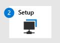

# McAfee에서 마이그레이션 - 2단계: 끝점용 Microsoft Defender 설정

**적용 대상:**
- [엔드포인트용 Microsoft Defender](https://go.microsoft.com/fwlink/p/?linkid=2154037)
- [Microsoft 365 Defender](https://go.microsoft.com/fwlink/?linkid=2118804)

| [1 단계: 준비](mcafee-to-microsoft-defender-prepare.md) | 2 단계: 설정 | [3 단계: 온보딩](mcafee-to-microsoft-defender-onboard.md) |
|--|--|--|
||*여기 있습니다!* | |

**[McAfee 끝점 보안(McAfee)에서 Endpoint용 Defender로](mcafee-to-microsoft-defender-migration.md#the-migration-process)** 마이그레이션하는 설치 단계에 오신 것을 환영합니다. 이 단계에는 다음 단계가 포함됩니다.

1. [끝점에서](#reinstall-or-enable-microsoft-defender-antivirus-on-your-endpoints)Microsoft Defender 바이러스 백신 다시 설치하거나 사용하도록 설정

2. [끝점에 대한 Defender를 구성합니다.](#configure-defender-for-endpoint)

3. [McAfee의 제외 목록에 끝점용 Microsoft Defender를 추가합니다.](#add-microsoft-defender-for-endpoint-to-the-exclusion-list-for-mcafee)

4. 에 대한 제외 목록에 [McAfee를 Microsoft Defender 바이러스 백신.](#add-mcafee-to-the-exclusion-list-for-microsoft-defender-antivirus)

5. 장치 그룹, 장치 컬렉션 및 조직 [구성 단위를 설치합니다.](#set-up-your-device-groups-device-collections-and-organizational-units)

6. [맬웨어 방지 정책 및 실시간 보호를 구성합니다.](#configure-antimalware-policies-and-real-time-protection)

## 끝점에서 Microsoft Defender 바이러스 백신 다시 설치하거나 사용하도록 설정

특정 버전의 Windows, Microsoft Defender 바이러스 백신 Microsoft가 아닌 바이러스 백신/맬웨어 방지 솔루션이 설치될 때 제거되거나 비활성화될 수 있습니다. 자세한 내용은 호환성 [Microsoft Defender 바이러스 백신 참조하세요.](microsoft-defender-antivirus-compatibility.md)

Windows 클라이언트에서 Microsoft가 아닌 바이러스 백신/맬웨어 방지 솔루션이 설치되면 해당 Microsoft Defender 바이러스 백신 끝점용 Defender에 온보딩될 때까지 자동으로 사용하지 않도록 설정됩니다. 클라이언트 끝점이 Endpoint용 Defender에 Microsoft Defender 바이러스 백신 Microsoft가 아닌 바이러스 백신 솔루션이 제거될 때까지 수동 모드로 전환됩니다. Microsoft Defender 바이러스 백신 설치해야 하지만 마이그레이션 프로세스의 이 시점에서는 사용하지 않도록 설정되어 있을 수 있습니다. 제거된 Microsoft Defender 바이러스 백신 않은 경우 클라이언트에 대해 작업을 수행하지 Windows 없습니다.

설치 Windows Microsoft가 아닌 바이러스 백신/맬웨어 방지가 설치되어 있는 경우 Microsoft Defender 바이러스 백신 사용하지 않도록 설정됩니다(제거되지 않은 경우). 다음 작업을 수행하면 서버의 Microsoft Defender 바이러스 백신 설치 및 수동 모드로 Windows 있습니다.

마이그레이션 프로세스의 이 단계에서는 다음과 같은 작업을 수행합니다.
- [Windows 서버에서 DisableAntiSpyware를 false로 설정(필요한](#set-disableantispyware-to-false-on-windows-server) 경우만 해당)
- [Microsoft Defender 바이러스 백신 서버에서 Windows 다시 설치합니다.](#reinstall-microsoft-defender-antivirus-on-windows-server)
- [Microsoft Defender 바이러스 백신 서버에서 수동 모드로 Windows 설정](#set-microsoft-defender-antivirus-to-passive-mode-on-windows-server)

### Windows Server에서 DisableAntiSpyware를 false로 설정

[DisableAntiSpyware](/windows-hardware/customize/desktop/unattend/security-malware-windows-defender-disableantispyware) 레지스트리 키는 과거에 사용되지 않도록 설정하고 Microsoft Defender 바이러스 백신 McAfee와 같은 다른 바이러스 백신 제품을 배포하는 데 사용했습니다. 일반적으로 장치 및 끝점에서 이 레지스트리 Windows 안 됩니다. 그러나 구성한 경우 값을 `DisableAntiSpyware` false로 설정하는 방법에는 다음이 있습니다.

1. Windows 서버에서 레지스트리 편집기를 여는 방법을 확인합니다.

2. `HKEY_LOCAL_MACHINE\SOFTWARE\Policies\Microsoft\Windows Defender`(으)로 이동합니다.

3. 해당 폴더에서 **DisableAntiSpyware라는** DWORD 항목을 찾아야 합니다.

   - 해당 항목이 없는 경우 모두 설정되어 있습니다.

   - **DisableAntiSpyware가** 표시되어 있는 경우 4단계로 진행합니다.

4. DisableAntiSpyware DWORD를 마우스 오른쪽 단추로 클릭한 다음 수정을 **클릭합니다.**

5. 값을 로 `0` 설정 이 경우 레지스트리 키의 값이 *false로 설정됩니다.*

> [!TIP]
> 이 레지스트리 키에 대한 자세한 내용은 [DisableAntiSpyware를 참조하세요.](/windows-hardware/customize/desktop/unattend/security-malware-windows-defender-disableantispyware)

### Microsoft Defender 바이러스 백신 서버에서 Windows 다시 설치

> [!NOTE]
> 다음 절차는 다음 버전의 런타임 버전을 실행하는 끝점 또는 장치에만 Windows.
> - Windows Server 2019
> - Windows 서버, 버전 1803(핵심 전용 모드)
> - Windows Server 2016

1. 끝점 또는 디바이스의 로컬 관리자로서 관리자 권한으로 Windows PowerShell.

2. 다음 PowerShell cmdlet을 실행합니다.  
   
   `Dism /online /Get-FeatureInfo /FeatureName:Windows-Defender-Features`  
   
   `Dism /online /Get-FeatureInfo /FeatureName:Windows-Defender`  

   > [!NOTE]
   > PS를 실행하는 작업 순서 내에서 DISM 명령을 사용하는 경우 다음 경로에 cmd.exe 필요합니다.
   > 예제:
   >
   > `c:\windows\sysnative\cmd.exe /c Dism /online /Get-FeatureInfo /FeatureName:Windows-Defender-Features` 
   >
   > `c:\windows\sysnative\cmd.exe /c Dism /online /Get-FeatureInfo /FeatureName:Windows-Defender` 

3. 실행 중인 Microsoft Defender 바이러스 백신 확인을 위해 다음 PowerShell cmdlet을 사용 합니다.  
   
   `Get-Service -Name windefend`

   실행 중 상태를 *찾아 봐야 합니다.*

### Microsoft Defender 바이러스 백신 서버에서 수동 모드로 Windows 설정

1. 레지스트리 편집기를 열고 로 `Computer\HKEY_LOCAL_MACHINE\SOFTWARE\Policies\Microsoft\Windows Advanced Threat Protection` 이동합니다.

2. **ForcePassiveMode라는** DWORD 항목을 편집하거나 만들고 다음 설정을 지정합니다.

   - DWORD 값을 로 `1` 설정

   - 기본에서 **16진수 를 선택합니다.**

> [!NOTE]
> Endpoint용 Defender에 온보딩한 후 Microsoft Defender 바이러스 백신 서버에서 수동 모드로 Windows 있습니다.

### 사용 중이 Windows Server 2016?

끝점을 실행 중인 Windows Server 2016 Microsoft가 아닌 다른 Microsoft Defender 바이러스 백신 맬웨어 방지 솔루션과 함께 실행할 수 없습니다. Microsoft Defender 바이러스 백신 수동 모드에서 실행할 수 Windows Server 2016. 이 경우 Microsoft가 아닌 바이러스 백신/맬웨어 방지 솔루션을 제거하고 대신 맬웨어 방지 솔루션을 설치/Microsoft Defender 바이러스 백신 합니다. 자세한 내용은 [Endpoint용 Defender와의 바이러스 백신 솔루션 호환성을 참조합니다.](/microsoft-365/security/defender-endpoint/microsoft-defender-antivirus-compatibility)

사용자 Windows Server 2016 사용하도록 설정하는 데 문제가 Microsoft Defender 바이러스 백신 다음 PowerShell cmdlet을 사용 합니다.

`mpcmdrun -wdenable`

자세한 내용은 Microsoft Defender 바이러스 백신 [Server의 Windows 참조하세요.](microsoft-defender-antivirus-on-windows-server.md)

### Microsoft Defender 바이러스 백신 서버에서 수동 모드로 Windows 설정

조직에서 여전히 McAfee를 사용 중이기 때문에 수동 Microsoft Defender 바이러스 백신 설정해야 합니다. 이렇게 하면 McAfee와 Microsoft Defender 바이러스 백신 끝점용 Defender에 대한 온보딩을 완료할 때까지 함께 실행할 수 있습니다.

1. 레지스트리 편집기를 열고 다음으로 이동합니다.  
   `Computer\HKEY_LOCAL_MACHINE\SOFTWARE\Policies\Microsoft\Windows Advanced Threat Protection`.

2. **ForcePassiveMode라는** DWORD 항목을 편집하거나 만들고 다음 설정을 지정합니다.
   
   - DWORD 값을 **1로 설정**
   
   - **기본에서** 16진수 **를 선택합니다.**

> [!NOTE]
> 다음과 같은 다른 메서드를 사용하여 레지스트리 키를 설정할 수 있습니다.
>- [그룹 정책 기본 설정](/previous-versions/windows/it-pro/windows-server-2012-R2-and-2012/dn581922(v=ws.11))
>- [Configuration Manager의 패키지](/mem/configmgr/apps/deploy-use/packages-and-programs)

## 끝점에 대한 Defender 구성

마이그레이션 프로세스의 이 단계에서는 끝점에 대해 Defender를 구성합니다. Intune을 사용하는 것이 좋습니다. 그러나 다음 표에 나열된 모든 메서드를 사용할 수 있습니다.

|메서드  |수행할 작업  |
|---------|---------|
|[Intune](/mem/intune/fundamentals/tutorial-walkthrough-endpoint-manager) 
**참고:** Intune이 현재 Microsoft Endpoint Manager. |1. Microsoft Endpoint Manager [관리 센터로 이동하여](https://go.microsoft.com/fwlink/?linkid=2109431) 로그인합니다.
2. **장치 구성**  >  **프로필을 선택한** 다음 구성할 프로필 유형을 선택합니다.  아직 장치 제한 프로필 유형을  만들지 않았거나 새 장치 제한 프로필 유형을 만들하려는 경우 Configure [device restriction settings in Microsoft Intune.](/intune/device-restrictions-configure)
3. 속성을 **선택하고** 구성 설정 **편집을 선택합니다.**
4. 를 **Microsoft Defender 바이러스 백신** 확장합니다. 
5. 클라우드 제공 **보호를 사용하도록 설정**
6. 샘플 제출 전에 사용자에게 확인 **드롭다운에서** 자동으로 모든 샘플 **보내기 를 선택합니다.**
7. 잠재적으로 원치 않는 응용 **프로그램 검색 드롭다운에서** 사용 또는 **감사를** **선택합니다.**
8. **검토 + 저장을 선택한** 다음 저장을 **선택합니다.**
설정을 만들고 구성하는 방법을 포함하여 Intune 장치 프로필에 대한 자세한 내용은 Microsoft Intune 프로필을 [참조하세요.](/intune/device-profiles)|
|제어판의 Windows     |에서 지침을 따르세요. [를 Microsoft Defender 바이러스 백신.](/mem/intune/user-help/turn-on-defender-windows) 
**참고:** 일부  버전의 Windows Defender 바이러스 백신 대신  Microsoft Defender 바이러스 백신 표시될 수 Windows.        |
|[고급 그룹 정책 관리](/microsoft-desktop-optimization-pack/agpm/)  또는 [그룹 정책 관리 콘솔](use-group-policy-microsoft-defender-antivirus.md)  |1. 로 이동 `Computer configuration > Administrative templates > Windows components > Microsoft Defender Antivirus` 
2. 끄기 이라는 정책을 **Microsoft Defender 바이러스 백신.**
3. 정책 **설정 편집 을 선택하고** 정책이 사용하지 않도록 설정되어 있는지 확인 합니다. 이렇게 하면 Microsoft Defender 바이러스 백신. 
**참고:** 일부  버전의 Windows Defender 바이러스 백신 대신  Microsoft Defender 바이러스 백신 표시될 수 Windows. |

## McAfee의 제외 목록에 끝점용 Microsoft Defender 추가

설치 프로세스의 이 단계에서는 McAfee 및 조직에서 사용하는 기타 보안 제품에 대한 제외 목록에 끝점용 Defender를 추가합니다. 

> [!TIP]
> 제외를 구성하는 데 도움이 필요한 경우 [McAfee 설명서(예: McAfee Endpoint Security 10.5.0 - Threat Prevention Module Product Guide (McAfee ePolicy Orchestrator) - Windows: Configuring exclusions을](https://docs.mcafee.com/bundle/endpoint-security-10.5.0-threat-prevention-product-guide-epolicy-orchestrator-windows/page/GUID-71C5FB4B-A143-43E6-8BF0-8B2C16ABE6DA.html)참조하십시오.

구성할 특정 제외는 끝점 또는 Windows 실행 중인 장치 버전에 따라 달라지며 다음 표에 나열되어 있습니다.

|OS |제외 |
|--|--|
| Windows 10 버전 [1803](/windows/release-health/status-windows-10-1803) 이상(릴리스 정보 Windows 10 [참조)](/windows/release-health/release-information)
Windows 10 버전 1703 또는 1709(KB4493441 설치)   
[Windows Server 2019](/windows/release-health/status-windows-10-1809-and-windows-server-2019)
[Windows 서버, 버전 1803](/windows-server/get-started/whats-new-in-windows-server-1803) |`C:\Program Files\Windows Defender Advanced Threat Protection\MsSense.exe`
`C:\Program Files\Windows Defender Advanced Threat Protection\SenseCncProxy.exe`
`C:\Program Files\Windows Defender Advanced Threat Protection\SenseSampleUploader.exe`
`C:\Program Files\Windows Defender Advanced Threat Protection\SenseIR.exe`   |
| [Windows 8.1](/windows/release-health/status-windows-8.1-and-windows-server-2012-r2) 
[Windows 7](/windows/release-health/status-windows-7-and-windows-server-2008-r2-sp1)
[Windows Server 2016](/windows/release-health/status-windows-10-1607-and-windows-server-2016)
[Windows Server 2012 R2](/windows/release-health/status-windows-8.1-and-windows-server-2012-r2)
[Windows Server 2008 R2 SP1](/windows/release-health/status-windows-7-and-windows-server-2008-r2-sp1) |`C:\Program Files\Microsoft Monitoring Agent\Agent\Health Service State\Monitoring Host Temporary Files 6\45\MsSenseS.exe`
**참고:** 모니터링 호스트 임시 파일 6\45가 번호 매기기 하위 폴더가 다를 수 있습니다.
`C:\Program Files\Microsoft Monitoring Agent\Agent\AgentControlPanel.exe`
`C:\Program Files\Microsoft Monitoring Agent\Agent\HealthService.exe`
`C:\Program Files\Microsoft Monitoring Agent\Agent\HSLockdown.exe`
`C:\Program Files\Microsoft Monitoring Agent\Agent\MOMPerfSnapshotHelper.exe`
`C:\Program Files\Microsoft Monitoring Agent\Agent\MonitoringHost.exe`
`C:\Program Files\Microsoft Monitoring Agent\Agent\TestCloudConnection.exe` |

## 추가 McAfee를 제외 목록에 Microsoft Defender 바이러스 백신

설치 프로세스의 이 단계에서는 McAfee 및 기타 보안 솔루션을 제외 목록에 Microsoft Defender 바이러스 백신 합니다. 

검사에 제외를 [Microsoft Defender 바이러스 백신](configure-exclusions-microsoft-defender-antivirus.md)경로 및 프로세스 제외를 추가해야 합니다. 

다음 표에 나열된 여러 가지 방법에서 제외를 Microsoft Defender 바이러스 백신 수 있습니다.

|메서드 | 수행할 작업|
|--|--|
|[Intune](/mem/intune/fundamentals/tutorial-walkthrough-endpoint-manager) 
**참고:** Intune이 현재 Microsoft Endpoint Manager. |1. Microsoft Endpoint Manager [관리 센터로 이동하여](https://go.microsoft.com/fwlink/?linkid=2109431) 로그인합니다.
2. **장치 구성** 프로필을 선택한 다음 구성할  >  프로필을 선택합니다.
3. **관리에서** 속성을 **선택합니다.** 
4. 구성 **설정: 편집 을 선택합니다.**
5. **를 Microsoft Defender 바이러스 백신** 확장한 다음 제외 **Microsoft Defender 바이러스 백신 확장합니다.**
6. 검색에서 제외할 파일 및 폴더, 확장명 및 Microsoft Defender 바이러스 백신 지정합니다. 참조는 Microsoft Defender 바이러스 백신 [제외를 참조합니다.](/mem/intune/configuration/device-restrictions-windows-10#microsoft-defender-antivirus-exclusions)
7. **검토 + 저장 을 선택한** 다음 저장 을 **선택 합니다.**  |
|[Microsoft Endpoint Configuration Manager](/mem/configmgr/) |1. [Configuration Manager 콘솔을](/mem/configmgr/core/servers/manage/admin-console) 사용하여 자산 및 준수 Endpoint Protection 맬웨어 방지 정책으로 이동한 다음 수정할 정책을  >    >  선택합니다. 
2. 파일 및 폴더, 확장명 및 프로세스에서 제외할 파일 및 폴더에 대한 제외 Microsoft Defender 바이러스 백신 지정합니다. |
|[그룹 정책 개체](/previous-versions/windows/desktop/Policy/group-policy-objects) | 1. 그룹 정책 관리 컴퓨터에서 그룹 정책 관리 콘솔을 열고 구성할 그룹 정책 개체를 마우스 오른쪽 단추로 클릭하고 편집을 **클릭합니다.**
2. 그룹 정책 관리 **편집기에서** 컴퓨터 구성으로 **이동하여** 관리 템플릿 **을 클릭합니다.**
3. 트리를 확장하여 Windows **구성 > Microsoft Defender 바이러스 백신 > 확장합니다.** **참고:** 일부  버전의 Windows Defender 바이러스 백신 대신  Microsoft Defender 바이러스 백신 표시될 수 Windows.
4. 경로 제외  설정을 두 번 클릭하고 제외를 추가합니다. - 옵션을 사용으로 **설정합니다.** - 옵션 **섹션에서** **표시...를 클릭합니다.** - 값 이름 열 아래에 각 폴더를 자체 **줄에 지정합니다.** - 파일을 지정하는 경우 드라이브 문자, 폴더 경로, 파일 이름 및 확장명을 포함하여 파일의 정식 경로를 입력해야 합니다. 값 **열에 0을** **입력합니다.**
5. 확인을 **클릭합니다.**
6. 확장 제외  설정을 두 번 클릭하고 제외를 추가합니다. - 옵션을 사용으로 **설정합니다.** - 옵션 **섹션에서** **표시...를 클릭합니다.** - 값 이름 열 아래에 각 파일 확장명을 자체 **줄에 입력합니다.**  값 **열에 0을** **입력합니다.**
7. **확인을 클릭합니다.** |
|로컬 그룹 정책 개체 |1. 끝점 또는 디바이스에서 로컬 그룹 정책 편집기를 열 수 있습니다. 
2. 컴퓨터 **구성** 관리 템플릿 Windows  >    >  **구성 요소 Microsoft Defender 바이러스 백신** 로  >    >  **이동하십시오.** 
**참고:** 일부  버전의 Windows Defender 바이러스 백신 대신  Microsoft Defender 바이러스 백신 표시될 수 Windows.
3. 경로 및 프로세스 제외를 지정합니다. |
|레지스트리 키 |1. 다음 레지스트리 키를 내보낼 수 `HKEY_LOCAL_MACHINE\SOFTWARE\Policies\Microsoft\Windows Defender\exclusions` 있습니다. .
2. 레지스트리 키를 가져올 수 있습니다. 다음은 이와 관련된 두 가지 예입니다. - 로컬 경로: `regedit.exe /s c:\temp\ MDAV_Exclusion.reg`  - 네트워크 공유: `regedit.exe /s \\FileServer\ShareName\MDAV_Exclusion.reg` |

다음 점에 유의하십시오.

- 경로 제외는 특정 파일과 해당 파일이 액세스하는 모든 파일을 제외합니다.

- 프로세스 제외는 프로세스 터치를 제외하지만 프로세스 자체는 제외하지 않습니다.

- 각 실행(.exe)을 경로 제외 및 프로세스 제외로 나열하면 프로세스와 터치하는 항목은 모두 제외됩니다.

- 이름만 사용하지 말고 전체 경로를 사용하여 프로세스 제외를 나열합니다. 이름 전용 메서드는 안전하지 않습니다.

## 장치 그룹, 장치 모음 및 조직 구성 단위 설정

| 컬렉션 유형 | 수행할 작업 |
|--|--|
|[장치](machine-groups.md) 그룹(이전의 컴퓨터 그룹)을 사용하면 보안 운영 팀이 자동화된 조사 및 수정과 같은 보안 기능을 구성할 수 있습니다.
 장치 그룹은 보안 운영 팀이 필요한 경우 수정 작업을 수행할 수 있도록 해당 장치에 대한 액세스를 할당하는 데도 유용합니다. 
디바이스 그룹은 디바이스 그룹에서 Microsoft Defender 보안 센터. |1. 을(를) [https://aka.ms/MDATPportal](https://aka.ms/MDATPportal) Microsoft Defender 보안 센터.
2. 왼쪽의 탐색 창에서 사용 **설정**  >  **장치 그룹을**  >  **선택하십시오.**  
3. **+ 장치 그룹 추가를 선택 합니다.**
4. 디바이스 그룹의 이름과 설명을 지정합니다.
5. 자동화 **수준 목록에서** 옵션을 선택합니다. (전체 - **위협을 자동으로 수정하는 것이** 좋습니다.) 다양한 자동화 수준에 대한 자세한 내용은 위협 수정 방법을 [참조합니다.](automated-investigations.md#how-threats-are-remediated)
6. 일치하는 규칙에 대한 조건을 지정하여 장치 그룹에 속하는 장치를 확인합니다. 예를 들어 도메인, OS 버전을 선택하거나 장치 [태그를 사용할 수도 있습니다.](machine-tags.md) 
7. 사용자 액세스 **탭에서** 장치 그룹에 포함된 장치에 액세스할 수 있는 역할을 지정합니다. 
8. 완료 **를 선택 합니다.** |
|[장치 모음을](/mem/configmgr/core/clients/manage/collections/introduction-to-collections) 사용하면 보안 운영 팀에서 응용 프로그램을 관리하거나, 규정 준수 설정을 배포하거나, 조직의 장치에 소프트웨어 업데이트를 설치할 수 있습니다. 
장치 컬렉션은 Configuration [Manager 를 사용하여 만들어집니다.](/mem/configmgr/) |컬렉션 만들기의 [단계를 따릅니다.](/mem/configmgr/core/clients/manage/collections/create-collections#bkmk_create) |
|[조직 구성 단위를](/azure/active-directory-domain-services/create-ou) 사용하면 사용자 계정, 서비스 계정 또는 컴퓨터 계정과 같은 개체를 논리적으로 그룹화할 수 있습니다. 그런 다음 관리자를 특정 조직 구성 단위에 할당하고 그룹 정책을 적용하여 대상 구성 설정을 적용할 수 있습니다.
 조직 구성 단위는 도메인 서비스에 [Azure Active Directory 정의됩니다.](/azure/active-directory-domain-services) | Create an [Organizational Unit in an Azure Active Directory Domain Services managed domain의 단계를 따릅니다.](/azure/active-directory-domain-services/create-ou) |

## 맬웨어 방지 정책 및 실시간 보호 구성

Configuration Manager 및 장치 컬렉션을 사용하여 맬웨어 방지 정책을 구성합니다.

- Configuration Manager에서 맬웨어 방지 정책 [만들기 및 Endpoint Protection 배포를 참조하세요.](/mem/configmgr/protect/deploy-use/endpoint-antimalware-policies)

- 맬웨어 방지 정책을 만들고 구성하는 동안 실시간  보호 설정을 검토하고 차단을 사용하면 [됩니다.](configure-block-at-first-sight-microsoft-defender-antivirus.md)

> [!TIP]
> 조직의 장치가 온보드되기 전에 정책을 배포할 수 있습니다.

## 다음 단계

**축하합니다!** [McAfee에서 끝점용 Defender로](mcafee-to-microsoft-defender-migration.md#the-migration-process)마이그레이션하는 설치 단계를 완료했습니다!

- [3단계: 끝점용 Defender 온보딩으로 진행](mcafee-to-microsoft-defender-onboard.md)
