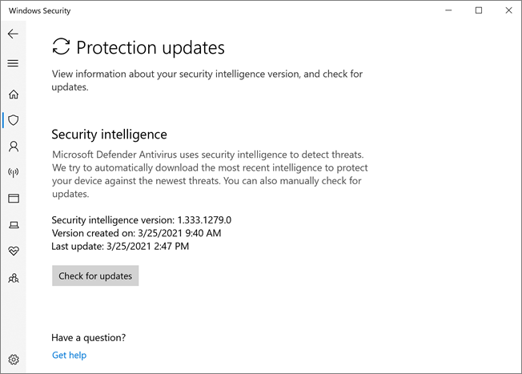

# Microsoft Defender 바이러스 백신 앱의 Windows 보안Microsoft Defender Antivirus in the Windows Security app

[!INCLUDE [Microsoft 365 Defender rebranding](../../includes/microsoft-defender.md)]

**적용 대상:****Applies to:**

- [엔드포인트용 Microsoft DefenderMicrosoft Defender for Endpoint](/microsoft-365/security/defender-endpoint/)

Windows 10 버전 1703 이상에서 Windows Defender 앱은 Windows 보안.In Windows 10, version 1703 and later, the Windows Defender app is part of the Windows Security.

설정 클라이언트 및 Windows Defender 주 Windows 설정 통합되어 기본적으로 Windows 10 버전 1703의 일부로 설치되는 새 앱으로 이동되었습니다.Settings that were previously part of the Windows Defender client and main Windows Settings have been combined and moved to the new app, which is installed by default as part of Windows 10, version 1703.

> [!IMPORTANT]
> Windows 보안 센터 서비스를 사용하지 않도록 설정하면 Microsoft Defender 바이러스 백신 [Windows Defender 방화벽.](/windows/security/threat-protection/windows-firewall/windows-firewall-with-advanced-security)Disabling the Windows Security Center service does not disable Microsoft Defender Antivirus or [Windows Defender Firewall](/windows/security/threat-protection/windows-firewall/windows-firewall-with-advanced-security). 타사 바이러스 백신 또는 방화벽 제품을 설치하고 최신 상태로 유지하면 이러한 기능이 자동으로 사용하지 않도록 설정됩니다.These are disabled automatically when a third-party antivirus or firewall product is installed and kept up to date.
>
> Windows 보안 Center 서비스를 사용하지 않도록 설정하거나 연결된 그룹 정책 설정을 구성하여 시작하거나 실행하지 못하도록 하는 경우 Windows 보안 앱은 장치에 설치한 바이러스 백신 또는 방화벽 제품에 대한 부실하거나 부정확한 정보를 표시할 수 있습니다.If you do disable the Windows Security Center service, or configure its associated Group Policy settings to prevent it from starting or running, the Windows Security app might display stale or inaccurate information about any antivirus or firewall products you have installed on the device.
> 또한 이전 또는 Microsoft Defender 바이러스 백신 바이러스 백신이 있는 경우 또는 이전에 설치한 타사 바이러스 백신 제품을 제거한 경우 해당 제품을 사용하지 못하게 할 수도 있습니다.It might also prevent Microsoft Defender Antivirus from enabling itself if you have an old or outdated third-party antivirus, or if you uninstall any third-party antivirus products you might have previously installed.
> 이렇게 하면 장치의 보호가 현저히 낮아지며 맬웨어 감염으로 이어질 수 있습니다.This will significantly lower the protection of your device and could lead to malware infection.

앱에서 [모니터링할 Windows 보안](/windows/threat-protection/windows-defender-security-center/windows-defender-security-center) 다른 보안 기능에 대한 자세한 내용은 Windows 문서를 참조하세요.See the [Windows Security article](/windows/threat-protection/windows-defender-security-center/windows-defender-security-center) for more information on other Windows security features that can be monitored in the app.

Windows 보안 앱은 Windows 10 버전 1703 이상의 클라이언트 인터페이스입니다.The Windows Security app is a client interface on Windows 10, version 1703 and later. 이 웹 Microsoft Defender 보안 센터 끝점용 Microsoft Defender를 검토하고 관리하는 [데 사용되는 웹 포털이 아니며,](/microsoft-365/security/defender-endpoint/microsoft-defender-endpoint)It is not the Microsoft Defender Security Center web portal that is used to review and manage [Microsoft Defender for Endpoint](/microsoft-365/security/defender-endpoint/microsoft-defender-endpoint).

## 앱의 바이러스 및 위협 방지 Windows 보안 검토Review virus and threat protection settings in the Windows Security app

1. 작업 표시줄에서 방패 아이콘을 클릭하거나 **Defender의** 시작 메뉴를 검색하여 Windows 보안 앱을 열 수 있습니다.Open the Windows Security app by clicking the shield icon in the task bar or searching the start menu for **Defender**.

2. 바이러스 & **보호** 타일(또는 왼쪽 메뉴 표시줄의 방패 아이콘)을 선택합니다.Select the **Virus & threat protection** tile (or the shield icon on the left menu bar).
   
다음 섹션에서는 Microsoft Defender 바이러스 백신 앱에서 제공하는 위협 방지를 검토하거나 상호 작용할 때 가장 일반적인 몇 가지 작업을 Windows 보안 설명합니다.The following sections describe how to perform some of the most common tasks when reviewing or interacting with the threat protection provided by Microsoft Defender Antivirus in the Windows Security app.

> [!NOTE]
> 그룹 정책을 사용하여 이러한 설정을 구성하고 배포하는 경우 이 섹션에 설명된 설정은 회색으로 표시됩니다. 개별 끝점에서 사용할 수 없습니다.If these settings are configured and deployed using Group Policy, the settings described in this section will be greyed-out and unavailable for use on individual endpoints. 설정이 Windows 설정에서 업데이트되기 전에 먼저 그룹 정책 개체를 통해 수행한 변경을 개별 엔드포인트에 배포해야 합니다.Changes made through a Group Policy Object must first be deployed to individual endpoints before the setting will be updated in Windows Settings. Configure [end-user interaction with Microsoft Defender 바이러스 백신](configure-end-user-interaction-microsoft-defender-antivirus.md) 항목에서는 로컬 정책 Microsoft Defender 바이러스 백신 구성할 수 있는 방법에 대해 설명합니다.The [Configure end-user interaction with Microsoft Defender Antivirus](configure-end-user-interaction-microsoft-defender-antivirus.md) topic describes how local policy override settings can be configured.

## 앱과 함께 Windows 보안 실행Run a scan with the Windows Security app

1. 시작 메뉴에서 보안 Windows 보안 를 검색한 다음 을 선택하여 앱 앱을 **Windows 보안.**Open the Windows Security app by searching the start menu for **Security**, and then selecting **Windows Security**.

2. 바이러스 & **보호** 타일(또는 왼쪽 메뉴 표시줄의 방패 아이콘)을 선택합니다.Select the **Virus & threat protection** tile (or the shield icon on the left menu bar).

3. 빠른 **검사 를 선택합니다.**Select **Quick scan**. 또는 전체 검색을 실행하려면 검사 옵션 을 선택한 다음 전체 검사와 같은 **옵션을 선택합니다.**Or, to run a full scan, select **Scan options**, and then select an option, such as **Full scan**.

## 보안 인텔리전스 업데이트 버전을 검토하고 Windows 보안 업데이트 다운로드Review the security intelligence update version and download the latest updates in the Windows Security app

1. 시작 메뉴에서 보안 Windows 보안 를 검색한 다음 을 선택하여 앱 앱을 **Windows 보안.**Open the Windows Security app by searching the start menu for *Security*, and then selecting **Windows Security**.

2. 바이러스 & **보호** 타일(또는 왼쪽 메뉴 표시줄의 방패 아이콘)을 선택합니다.Select the **Virus & threat protection** tile (or the shield icon on the left menu bar).

3. 바이러스 **보호 & 업데이트를 선택합니다.**Select **Virus & threat protection updates**. 현재 설치된 버전이 다운로드된 경우에 대한 몇 가지 정보와 함께 표시됩니다.The currently installed version is displayed along with some information about when it was downloaded. 현재 버전을 수동으로 다운로드할 수 있는 최신 버전을 확인하거나 해당 버전에 대한 변경 로그를 검토할 수 있습니다.You can check your current against the latest version available for manual download, or review the change log for that version. 보안 [인텔리전스 업데이트 및 Microsoft Defender 바이러스 백신 Microsoft 맬웨어 방지 업데이트를 참조하세요.](https://www.microsoft.com/en-us/wdsi/defenderupdates)See [Security intelligence updates for Microsoft Defender Antivirus and other Microsoft antimalware](https://www.microsoft.com/en-us/wdsi/defenderupdates).

4. 업데이트 **확인을 선택하여** 새 보호 업데이트를 다운로드합니다(있는 경우).Select **Check for updates** to download new protection updates (if there are any).

## 앱 Microsoft Defender 바이러스 백신 사용하도록 설정되어 Windows 보안 확인Ensure Microsoft Defender Antivirus is enabled in the Windows Security app

1. 시작 메뉴에서 보안 Windows 보안 를 검색한 다음 을 선택하여 앱 앱을 **Windows 보안.**Open the Windows Security app by searching the start menu for *Security*, and then selecting **Windows Security**.

2. 바이러스 & **보호** 타일(또는 왼쪽 메뉴 표시줄의 방패 아이콘)을 선택합니다.Select the **Virus & threat protection** tile (or the shield icon on the left menu bar).

3. 바이러스 **보호 & 보호 설정을 선택합니다.**Select **Virus & threat protection settings**.

4. 실시간 보호 **스위치를** 켜기 로 **전환합니다.**Toggle the **Real-time protection** switch to **On**.

    > [!NOTE]
    > 실시간 **보호를** 끄면 짧은 지연 후 자동으로 다시 켜집니다.If you switch **Real-time protection** off, it will automatically turn back on after a short delay. 이는 맬웨어 및 위협으로부터 보호하기 위한 것입니다.This is to ensure you are protected from malware and threats.
    > 다른 바이러스 백신 제품을 설치하는 경우 Microsoft Defender 바이러스 백신 자동으로 사용하지 않도록 설정되며 Windows 보안 앱에 표시되어 있습니다.If you install another antivirus product, Microsoft Defender Antivirus automatically disables itself and is indicated as such in the Windows Security app. 제한된 주기적 검색을 사용하도록 설정할 수 있는 [설정이 나타납니다.](limited-periodic-scanning-microsoft-defender-antivirus.md)A setting will appear that will allow you to enable [limited periodic scanning](limited-periodic-scanning-microsoft-defender-antivirus.md).

## 앱의 Microsoft Defender 바이러스 백신 제외 Windows 보안 추가Add exclusions for Microsoft Defender Antivirus in the Windows Security app

1. 시작 메뉴에서 보안 Windows 보안 를 검색한 다음 을 선택하여 앱 앱을 **Windows 보안.**Open the Windows Security app by searching the start menu for *Security*, and then selecting **Windows Security**.

2. 바이러스 & **보호** 타일(또는 왼쪽 메뉴 표시줄의 방패 아이콘)을 선택합니다.Select the **Virus & threat protection** tile (or the shield icon on the left menu bar).

3. 설정 **관리에서** 바이러스 및 **위협 방지 & 를 선택합니다.**Under the **Manage settings**, select **Virus & threat protection settings**.

4. 제외 **설정에서** 제외 추가 **또는 제거를 선택합니다.**Under the **Exclusions** setting, select **Add or remove exclusions**. 

5. 더하기 아이콘( )을 선택하여 유형을 선택하고 각 제외에 대한 옵션을 **+** 설정할 수 있습니다.Select the plus icon (**+**) to choose the type and set the options for each exclusion. 

다음 표에서는 제외 유형과 발생하는 결과를 요약하여 제공합니다.The following table summarizes exclusion types and what happens:

|제외 유형Exclusion type  |정의한 사용자Defined by  |진행 작업What happens  |
|---------|---------|---------|
|**파일****File** |위치Location  예: `c:\sample\sample.test`Example: `c:\sample\sample.test` |특정 파일은 특정 파일에서 건너 Microsoft Defender 바이러스 백신.The specific file is skipped by Microsoft Defender Antivirus. |
|**폴더****Folder**    |위치Location  예: `c:\test\sample`Example: `c:\test\sample`       |지정한 폴더의 모든 항목은 폴더에서 건너 Microsoft Defender 바이러스 백신.All items in the specified folder are skipped by Microsoft Defender Antivirus.         |
|**파일 형식****File type**   |파일 확장명File extension  예: `.test`Example: `.test` |디바이스의 아무 곳에서나 확장명을 사용하여 모든 파일을 `.test` Microsoft Defender 바이러스 백신.All files with the `.test` extension anywhere on your device are skipped by Microsoft Defender Antivirus.         |
|**프로세스****Process**     |실행 파일 경로Executable file path  예: `c:\test\process.exe`Example: `c:\test\process.exe`         |특정 프로세스 및 해당 프로세스에서 연 모든 파일은 특정 프로세스에서 Microsoft Defender 바이러스 백신.The specific process and any files that are opened by that process are skipped by Microsoft Defender Antivirus.         |

자세한 내용은 다음 리소스를 참조하세요.To learn more, see the following resources:
- [파일 확장명 및 폴더 위치에 따라 제외 구성 및 유효성 검사Configure and validate exclusions based on file extension and folder location](./configure-extension-file-exclusions-microsoft-defender-antivirus.md) 
- [프로세스에서 연 파일에 대한 제외 구성Configure exclusions for files opened by processes](./configure-process-opened-file-exclusions-microsoft-defender-antivirus.md)

## 보안 센터 앱의 Windows Defender 검색 기록 검토Review threat detection history in the Windows Defender Security Center app

1. 시작 메뉴에서 보안 Windows 보안 를 검색한 다음 을 선택하여 앱 앱을 **Windows 보안.**Open the Windows Security app by searching the start menu for *Security*, and then selecting **Windows Security**.

2. 바이러스 & **보호** 타일(또는 왼쪽 메뉴 표시줄의 방패 아이콘)을 선택합니다.Select the **Virus & threat protection** tile (or the shield icon on the left menu bar).

3. 보호 **기록 을 선택합니다.**Select **Protection history**. 모든 최근 항목이 나열됩니다.Any recent items are listed.

## 랜섬웨어 보호 및 복구 옵션 설정Set ransomware protection and recovery options

1. 시작 메뉴에서 보안 Windows 보안 를 검색한 다음 을 선택하여 앱 앱을 **Windows 보안.**Open the Windows Security app by searching the start menu for *Security*, and then selecting **Windows Security**.

2. 바이러스 & **보호** 타일(또는 왼쪽 메뉴 표시줄의 방패 아이콘)을 선택합니다.Select the **Virus & threat protection** tile (or the shield icon on the left menu bar).

3. **랜섬웨어 보호에서** **랜섬웨어** 보호 관리를 선택합니다.Under **Ransomware protection**, select **Manage ransomware protection**.

4. 제어된 폴더 **액세스 설정을 변경하려면** 제어된 폴더 액세스로 중요한 [폴더 보호를 참조하세요.](/microsoft-365/security/defender-endpoint/controlled-folders)To change **Controlled folder access** settings, see [Protect important folders with Controlled folder access](/microsoft-365/security/defender-endpoint/controlled-folders).

5. 랜섬웨어 복구 옵션을 설정하려면  **랜섬웨어** 데이터 복구에서 설정을 선택하고 랜섬웨어 공격으로부터 쉽게 복구할 수 있도록 OneDrive 계정을 연결하거나 설정하기 위한 지침을 따릅니다.To set up ransomware recovery options, select **Set up** under **Ransomware data recovery** and follow the instructions for linking or setting up your OneDrive account so you can easily recover from a ransomware attack.

## 참고 항목See also
- [Windows Defender 바이러스 백신Microsoft Defender Antivirus](microsoft-defender-antivirus-in-windows-10.md)