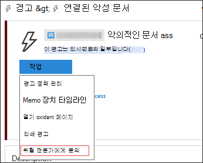
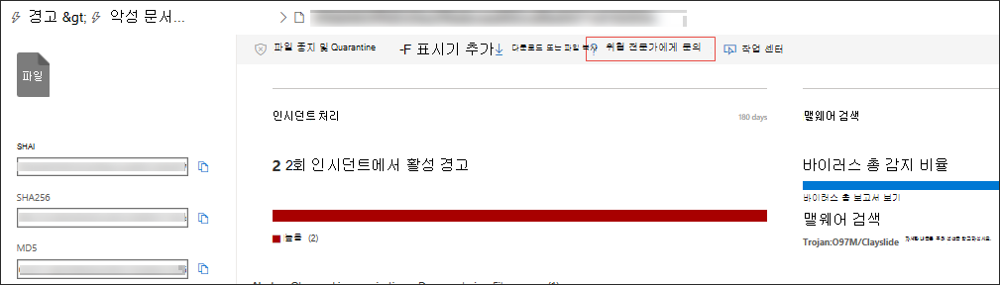

# Microsoft 위협 전문가

[!INCLUDE [Microsoft 365 Defender rebranding](../../includes/microsoft-defender.md)]

**적용 대상:**
- [엔드포인트용 Microsoft Defender](https://go.microsoft.com/fwlink/p/?linkid=2154037)
- [Microsoft 365 Defender](https://go.microsoft.com/fwlink/?linkid=2118804)

> 엔드포인트용 Microsoft Defender를 경험하고 싶으신가요? [무료 평가판을 신청하세요.](https://signup.microsoft.com/create-account/signup?products=7f379fee-c4f9-4278-b0a1-e4c8c2fcdf7e&ru=https://aka.ms/MDEp2OpenTrial?ocid=docs-wdatp-exposedapis-abovefoldlink)

Microsoft 위협 전문가 SOC(보안 운영 센터)에 전문가 수준의 모니터링 및 분석을 제공하는 관리되는 위협 헌팅 서비스로, 고유한 환경의 중요한 위협이 누락되지 않도록 합니다.

이 관리되는 위협 헌팅 서비스는 대상 공격 알림 및 요구 시 전문가 액세스의 두 가지 기능을 통해 전문가 중심의 인사이트 및 데이터를 제공합니다.

## 시작하기 전에

> [!NOTE]
> 관리되는 위협 헌팅 서비스에 적용하기 전에 Microsoft 기술 서비스 공급자 및 계정 팀과 자격 요구 사항을 논의합니다.

Endpoint용 Microsoft Defender 고객인 경우 사용자 환경에서 가장 **중요한 위협을** 식별하여 신속하게 대응할 수 있도록 Microsoft 위협 전문가 - 대상 지정 공격 알림을 신청해야 합니다.

대상이 Microsoft 위협 전문가 - 대상 공격 알림 혜택에 등록하기 위해 설정 끝점 일반 고급 Microsoft 위협 전문가 - 적용할 대상 공격  \>  \>  \>  \> **알림으로** 이동 합니다. 일단 수락되면 대상 공격 알림의 이점을 얻을 수 있습니다.

계정 팀 또는 Microsoft 담당자에게 문의하여 Microsoft 위협 전문가 **-** 요구 전문가에게 문의하여 위협 전문가에게 조직이 직면하고 있는 관련 탐지 및 가해자에 대한 자문을 구하세요.

자세한 [Microsoft 위협 전문가 기능 구성을](/microsoft-365/security/defender-endpoint/configure-microsoft-threat-experts#before-you-begin) 참조합니다.

## Microsoft 위협 전문가 - 대상 공격 알림

Microsoft 위협 전문가 - 대상이 지정 된 공격 알림은 악의적인 공격, 실습 키보드 공격 또는 사이버-에스피니지와 같은 고급 공격을 포함하여 네트워크에 대한 가장 중요한 위협에 대한 사전 헌팅을 제공합니다. 이러한 알림은 새 경고로 표시됩니다. 관리되는 헌팅 서비스에는 다음이 포함됩니다.

- 위협 모니터링 및 분석, 비즈니스에 대한 DWELL 시간 및 위험 감소
- 알려진 공격과 알 수 없는 공격을 모두 검색하고 우선 순위를 지정하기 위해 헌터가 학습한 인공 지능
- 가장 중요한 위험을 식별하여 SOC가 시간 및 에너지 최대화
- 손상 범위 및 빠른 SOC 응답을 위해 빠르게 전달될 수 있는 컨텍스트를 제공합니다.

## Microsoft 위협 전문가 - 전문가

고객은 적시에 정확한 대응을 위해 보안 전문가와 직접 Microsoft Defender 보안 센터 수 있습니다. 전문가는 경고 문의, 잠재적으로 손상된 장치, 의심스러운 네트워크 연결의 근본 원인, 지속적인 고급 영구 위협 캠페인과 관련한 추가 위협 인텔리전스까지 조직에 영향을 주는 복잡한 위협을 더 잘 이해하는 데 필요한 인사이트를 제공합니다. 이 기능을 사용하여 다음을 할 수 있습니다.

- 인시던트의 근본 원인 또는 범위를 포함하여 경고에 대한 추가 설명을 얻습니다.
- 고급 공격자가 직면한 경우 의심스러운 장치 동작 및 다음 단계에 대한 명확성 확보
- 위협 공격자, 캠페인 또는 새로운 공격자 기술에 관한 위험 및 보호 결정

위협 **전문가에게 문의하는** 옵션은 포털의 여러 장소에서 사용할 수 있으므로 조사 컨텍스트에서 전문가와 함께 할 수 있습니다.

- ***도움말 및 지원 메뉴***

  

- ***장치 페이지 작업 메뉴***

  

- ***경고 페이지 작업 메뉴***

  

- ***파일 페이지 작업 메뉴***

  

> [!NOTE]
> Microsoft 서비스 허브를 통해 전문가 관련 사례의 상태를 추적하려면 기술 계정 관리자에게 문의하세요.

이 비디오를 시청하여 Microsoft 서비스 허브에 대한 간략한 개요를 확인할 수 있습니다.

> [!VIDEO https://www.microsoft.com/videoplayer/embed/RE4pk9f]

## 관련 항목

- [Microsoft 위협 전문가 기능 구성](configure-microsoft-threat-experts.md)
