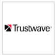

# 관리되는 보안 서비스 공급자 지원

**적용 대상:**
- [엔드포인트용 Microsoft Defender](https://go.microsoft.com/fwlink/p/?linkid=2154037)
- [Microsoft 365 Defender](https://go.microsoft.com/fwlink/?linkid=2118804)

> 엔드포인트용 Microsoft Defender를 경험하고 싶으신가요? [무료 평가판을 신청하세요.](https://signup.microsoft.com/create-account/signup?products=7f379fee-c4f9-4278-b0a1-e4c8c2fcdf7e&ru=https://aka.ms/MDEp2OpenTrial?ocid=docs-wdatp-exposedapis-abovefoldlink)

포털을 통해 다음 관리되는 보안 서비스 공급자에 액세스할 수 있습니다. 

로고 |파트너 이름   | 설명 
:---|:---|:---
|[Accenture 관리 검색 & 응답(MDR)](https://go.microsoft.com/fwlink/?linkid=2164353) | 클라우드 및 프레미스에 있는 IT 및 OT 환경에서 고급 사이버 공격을 감지하고 사전 대응하는 확장된 기능을 사용하여 전역 사이버 보안 작업을 관리, 유지 관리 및 향상합니다.
 | [Aujas 관리 MDE 서비스](https://go.microsoft.com/fwlink/?linkid=2162429) | Aujas 사이버 보안은 사이버 방어 센터를 통해 끝점에 대해 Microsoft Defender를 사용하여 전체 엔터프라이즈 스펙트럼에서 24*7 관리되는 보안 서비스를 제공합니다.
| [BDO 디지털](https://go.microsoft.com/fwlink/?linkid=2090394) | BDO Digital의 관리 방어는 24/7/365 ID 보호를 위해 모범 사례 도구, AI 및 사 내 보안 전문가를 사용합니다.
| [BlueVoyant](https://go.microsoft.com/fwlink/?linkid=2121401) | 끝점용 Microsoft Defender의 MDR은 끝점에 대한 고급 공격 모니터링, 조사 및 완화 지원을 제공합니다.
| [클라우드 보안 센터](https://go.microsoft.com/fwlink/?linkid=2099315) | InSpark의 클라우드 보안 센터는 24x7 관리 서비스로, 보안 및 응답 기능을 보호하고 & 서비스입니다.
| [클라우드 SOC](https://go.microsoft.com/fwlink/?linkid=2104265) | 클라우드 SOC는 Microsoft 클라우드를 기반으로 24/7 보안 모니터링 서비스를 제공하며, 보안 자세를 지속적으로 개선하는 데 도움이 됩니다.
| [CSIS 관리 검색 & 응답](https://go.microsoft.com/fwlink/?linkid=2091005) | 24/7 보안 경고의 모니터링 및 분석으로 회사에서 보안 인시던트가 발생된 정의, 언제 및 방법에 대한 실행 가능한 인사이트를 제공합니다.
 |[CyberProof 관리 감지 & 대응(MDR)](https://go.microsoft.com/fwlink/?linkid=2163964) | 24x7 관리 위협 감지 및 응답 서비스가 Azure Sentinel 및 Endpoint용 Defender와 완전히 통합되어 있습니다.
| [Dell Technologies Advanced Threat Protection](https://go.microsoft.com/fwlink/?linkid=2091004) | Professional 24/7 기능을 통해 악의적인 동작 및 이의에 대한 모니터링 서비스
| [DXC 관리 끝점 위협 감지 및 응답](https://go.microsoft.com/fwlink/?linkid=2090395) | 기존 보안 방어를 제거하고 며칠이 아닌 몇 시간 또는 분으로 포함하는 끝점 위협 식별
 | [eSentire 관리 검색 및 응답](https://go.microsoft.com/fwlink/?linkid=2154970) | 24x7 위협 조사 및 끝점용 Microsoft Defender를 통한 대응.
| [Microsoft Defender 끝점에 대한 관리 검색 및 응답 Expel](https://go.microsoft.com/fwlink/?linkid=2162430) | Expel은 Microsoft Defender 끝점에서 보안 위험을 감지하여 보안을 유지하는 데 도움이 됩니다.
 | [끝점용 Microsoft Defender에 대한 MDR(Mandiant Managed Defense)](https://go.microsoft.com/fwlink/?linkid=2164352) | Mandiant의 24/7 프런트라인 MDR 인텔리전스 및 전문 지식을 통해 끝점에 대한 Defender를 강화합니다.
| [NTT 보안](https://go.microsoft.com/fwlink/?linkid=2095320) | NTT의 EDR 서비스는 끝점 및 네트워크 전반에 걸쳐 & 24/7 보안 모니터링을 제공합니다.
 | [Onevinn MDR](https://go.microsoft.com/fwlink/?linkid=2155203)| 24/7 Microsoft Defender 및 Azure Sentinel을 기본으로 구축된 24/7 관리 검색 및 응답으로 Onevinn의 위협 인텔리전스를 강화했습니다.
 | [쿼럼 사이버](https://go.microsoft.com/fwlink/?linkid=2155202)| 보안 엔지니어링 서비스에 대한 최신 & 위협 헌팅
| [빨간색 Canary](https://go.microsoft.com/fwlink/?linkid=2103852) | Red Canary는 최신 팀을 위한 보안 운영 파트너로, 몇 분 만에 배포되는 MDR
| [Red Cloak로 전원을 공급하는 SecureWorks 관리 검색 및 응답](https://go.microsoft.com/fwlink/?linkid=2133634) | Secureworks는 위협 인텔리전스 및 20년 이상의 경험을 SaaS 및 관리되는 보안 솔루션에 결합합니다.
| [sepagoSOC](https://go.microsoft.com/fwlink/?linkid=2090491) | 제로 트러스트 환경에서 정교한 자동화된 워크플로를 통해 전체 보안 보장
| [Trustwave Threat Detection & 응답 서비스](https://go.microsoft.com/fwlink/?linkid=2127542) | Endpoint용 Sentinel 및 Defender와의 통합을 사용하는 Azure용 위협 감지 및 응답 서비스
| [White Shark Managed Security Services](https://go.microsoft.com/fwlink/?linkid=2154210) |포함된 모든 플랫폼, 모바일에서 투명한 가격을 통해 사이버 보안에 대한 진정한 전문 접근 방식입니다.
| [Wortell의 클라우드 SOC](https://go.microsoft.com/fwlink/?linkid=2108415) | 24x7 Managed Defender for Endpoint service for monitoring &
| [ZTAP(Zero Trust Analytics Platform)](https://go.microsoft.com/fwlink/?linkid=2090971) | 알림을 99% 줄이고 모바일 장치에서 모든 보안 기능에 액세스

## 관련 항목
- [관리 서비스 보안 공급자 통합 구성](configure-mssp-support.md)