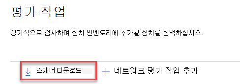
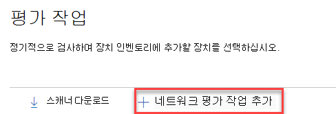
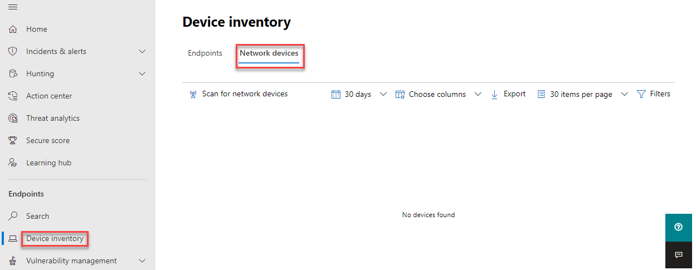

# 네트워크 장치 검색 및 취약성 관리

[!INCLUDE [Microsoft 365 Defender rebranding](../../includes/microsoft-defender.md)]

**적용 대상:**

- [엔드포인트용 Microsoft Defender](https://go.microsoft.com/fwlink/?linkid=2154037)
- [위협 및 취약성 관리](next-gen-threat-and-vuln-mgt.md)
- [Microsoft 365 Defender](https://go.microsoft.com/fwlink/?linkid=2118804)

> 엔드포인트용 Microsoft Defender를 경험하고 싶으신가요? [무료 평가판을 신청하세요.](https://signup.microsoft.com/create-account/signup?products=7f379fee-c4f9-4278-b0a1-e4c8c2fcdf7e&ru=https://aka.ms/MDEp2OpenTrial?ocid=docs-wdatp-portaloverview-abovefoldlink)

> [!NOTE]
> 네트워크 [장치](https://techcommunity.microsoft.com/t5/microsoft-defender-for-endpoint/network-device-discovery-and-vulnerability-assessments/ba-p/2267548) 검색 및 취약점 평가 블로그 \( 04-13-2021에 게시된 블로그는 \) 끝점용 Defender의  새로운 네트워크 장치 검색 기능에 대한 정보를 제공합니다. 이 문서에서는 네트워크 장치  검색이 해결하도록 디자인된 과제에 대해 간략하게 설명하고 이러한 새로운 기능을 사용하여 시작하는 방법에 대한 자세한 정보를 제공합니다.

네트워크 검색 기능은 보안  센터 및 Microsoft 365 콘솔의 장치 인벤토리 섹션에서 Microsoft 365 Defender 있습니다.

지정된 끝점 디바이스용 Microsoft Defender가 각 네트워크 세그먼트에서 미리 구성한 네트워크 장치에 대해 정기적으로 인증된 스캔을 수행하는 데 사용됩니다. 검색된 끝점용 Defender의 위협 및 취약성 관리 기능은 검색된 스위치, 라우터, WLAN 컨트롤러, 방화벽 및 VPN 게이트웨이를 보호하는 통합 워크플로를 제공합니다.

네트워크 장치가 검색 및 분류되면 보안 관리자는 최신 보안 권장 사항을 받고 조직 전체에 배포된 네트워크 장치에서 최근에 발견된 취약점을 검토할 수 있습니다.

## 방법

끝점용 Defender에는 네트워크 장치 자체에 내장된 센서가 아니기 때문에 네트워크 장치는 표준 끝점으로 관리되지 않습니다. 이러한 유형의 디바이스에는 원격 검사가 장치에서 필요한 정보를 얻는 에이전트 없는 접근 방식이 필요합니다. 네트워크 토폴로지 및 특성에 따라 단일 장치 또는 끝점용 Microsoft Defender에 온보딩된 몇 대의 장치가 SNMP를 사용하여 인증된 네트워크 장치 검색을 수행하며 읽기 전용입니다.

유의해야 할 두 가지 유형의 장치가 있습니다.

- **평가 장치:** 네트워크 장치를 검색하는 데 사용할 이미 온보드된 장치입니다.
- **네트워크 장치:** 스캔하고 온보드할 네트워크 장치입니다.

### 네트워크 장치에 대한 취약성 관리

네트워크 장치가 검색 및 분류되면 보안 관리자는 최신 보안 권장 사항을 받고 조직 전체에 배포된 네트워크 장치에서 최근에 발견된 취약점을 검토할 수 있습니다.

## 지원되는 운영 체제

다음 운영 체제가 현재 지원됩니다.

- Cisco IOS, IOS-XE, NX-OS
- Juniper JUNOS
- HPE ArubaOS, Procurve 스위치 소프트웨어
- Palo Alto Networks PAN-OS

고객 사용에서 수집한 데이터를 기반으로 시간이 지날수록 더 많은 네트워킹 공급업체 및 OS가 추가됩니다. 따라서 이 목록에 지정되지 않은 경우에도 모든 네트워크 장치를 구성하는 것이 권장됩니다.

## 시작하는 방법

첫 번째 단계는 인증된 네트워크 검색을 수행할 장치를 선택하는 것입니다.

1. 검사할 네트워크 장치의 관리 포트에 대한 네트워크 연결이 있는 끝점 온보딩 장치(클라이언트 또는 서버)에 대한 Defender를 결정하십시오.

2. Endpoint용 Defender 평가 장치와 대상 네트워크 장치 간의 SNMP 트래픽(예: 방화벽)을 허용해야 합니다.

3. 취약점에 대해 평가할 네트워크 장치(예: Cisco 스위치 또는 Palo Alto Networks 방화벽)를 확인합니다.

4. 끝점 평가 장치가 구성된 네트워크 장치를 쿼리할 수 있도록 구성된 모든 네트워크 장치에서 SNMP 읽기 전용이 사용하도록 설정되어 있는지 확인합니다. 'SNMP 쓰기'는 이 기능의 적절한 기능에 필요하지 않습니다.

5. 검색할 네트워크 장치의 IP 주소(또는 이러한 장치가 배포된 서브넷)를 얻습니다.

6. 네트워크 장치의 SNMP 자격 증명(예: Community String, noAuthNoPriv, authNoPriv, authPriv)을 얻습니다. 새 평가 작업을 구성할 때 자격 증명을 제공해야 합니다.

7. 프록시 클라이언트 구성: Endpoint 장치 프록시 요구 사항에 대한 Defender 외의 추가 구성은 필요하지 않습니다.

8. 네트워크 스캐너를 인증하고 제대로 작동하도록 허용하려면 다음 도메인/URL을 추가해야 합니다.

    - login.windows.net
    - \*.security.microsoft.com
    - login.microsoftonline.com
    - \*.blob.core.windows.net/networkscannerstable/\*

    > [!NOTE]
    > 모든 URL이 허용된 데이터 수집의 끝점용 Defender 문서화 목록에 지정되지는 않습니다.

## 권한

평가 작업을 구성하려면 보안 센터에서 보안 설정 관리와 같은 사용자 **권한 옵션이 필요합니다.** 역할 에서 **역할로** 설정 \> **있습니다.** 자세한 내용은 역할 기반 액세스 제어에 대한 역할 만들기 [및 관리를 참조하세요.](user-roles.md)

## 네트워크 스캐너 설치

1. 끝점 **Microsoft 365 보안** 설정(네트워크 평가 아래)로 \>  \>  \>  **이동하십시오.**
    1. Microsoft 365 Defender 포털에서 평가 설정 > 페이지로 이동합니다.

2. 네트워크 스캐너를 다운로드하여 지정된 Endpoint 평가 장치에 설치합니다.

    > [!div class="mx-imgBorder"]
    > 

## 네트워크 스캐너 설치 & 등록

로그인 프로세스는 지정된 평가 장치 자체 또는 다른 장치(예: 개인 클라이언트 장치)에서 완료할 수 있습니다.

네트워크 스캐너 등록 프로세스를 완료합니다.

1. 명령줄에 나타나는 URL을 복사하고 따르고 제공된 설치 코드를 사용하여 등록 프로세스를 완료합니다.

    > [!NOTE]
    > URL을 복사할 수 있게 명령 프롬프트 설정을 변경해야 할 수 있습니다.

2. 코드를 입력하고 "보안 센터에서 보안 설정 관리"라는 끝점용 Defender 권한이 있는 Microsoft 계정을 사용하여 로그인합니다.

3. 완료되면 로그인을 확인한 메시지가 표시됩니다.

## 새 평가 작업 구성

의 평가 작업 **페이지에서 설정** 작업 **추가를 선택합니다.** 설정 프로세스에 따라 정기적으로 검사하고 장치 인벤토리에 추가할 네트워크 장치를 선택하세요.

네트워크 장치 인벤토리에서 장치 중복을 방지하려면 각 IP 주소가 여러 평가 장치에서 한 번만 구성되어 있는지 확인합니다.

> [!div class="mx-imgBorder"]
> 

네트워크 평가 작업 단계 추가:

1. 네트워크 스캐너가 설치된 '평가 작업' 이름 및 '평가 장치'를 선택하십시오. 이 장치는 주기적인 인증된 스캔을 수행하게 됩니다.

2. 검사할 대상 네트워크 장치의 IP 주소(또는 이러한 장치가 배포된 서브넷)를 추가합니다.

3. 대상 네트워크 장치의 필수 SNMP 자격 증명을 추가합니다.

4. 새로 구성된 네트워크 평가 작업을 저장하여 주기적인 네트워크 검색을 시작할 수 있습니다.

### 네트워크 장치 검색 및 추가

설정 프로세스 중에 한 번의 테스트 검색을 수행하여 다음을 확인할 수 있습니다.

- Endpoint용 Defender 평가 장치와 구성된 대상 네트워크 장치 간에 연결이 있습니다.
- 구성된 SNMP 자격 증명이 올바른지 확인합니다.

각 평가 장치는 최대 1,500회의 성공적인 IP 주소 검색을 지원할 수 있습니다. 예를 들어 IP 주소가 100개만 성공한 결과를 반환하는 10개 다른 서브넷을 검색하는 경우 동일한 평가 장치에 있는 다른 서브넷에서 1,400개 IP 추가 주소를 검색할 수 있습니다.

검색할 IP 주소 범위/서브넷이 여러 개 있는 경우 테스트 검사 결과를 표시하는 데 몇 분 정도 걸립니다. 테스트 검사는 최대 1,024개 주소에 사용할 수 있습니다.

결과가 표시될 때 주기적 검사에 포함될 장치를 선택할 수 있습니다. 검사 결과 보기를 건너뛰면 구성된 모든 IP 주소가 장치의 응답에 관계없이 네트워크 평가 작업으로 추가됩니다. 검색 결과를 내보낼 수도 있습니다.

## 장치 인벤토리

새로 검색된 장치는 장치 인벤토리 페이지의 새 **네트워크** 장치 **탭에** 표시됩니다. 장치가 업데이트될 때까지 평가 작업을 추가한 후 최대 2시간이 걸릴 수 있습니다.

> [!div class="mx-imgBorder"]
> 

## 문제 해결

### 네트워크 스캐너 설치 실패

필요한 URL이 방화벽 설정의 허용 도메인에 추가되는지 확인합니다. 또한 프록시 설정이 장치 프록시 및 인터넷 연결 설정 구성에 설명된 [바와 같이 구성되어 있는지 확인합니다.](configure-proxy-internet.md)

### Microsoft.com/devicelogin 웹 페이지가 표시되지 않습니다.

필요한 URL이 방화벽의 허용 도메인에 추가되는지 확인 또한 프록시 설정이 장치 프록시 및 인터넷 연결 설정 구성에 설명된 [바와 같이 구성되어 있는지 확인합니다.](configure-proxy-internet.md)

### 네트워크 장치가 몇 시간 후에 장치 인벤토리에 표시되지 않습니다.

검사 결과는 평가 작업 구성을 완료한 후 수행된 초기 검사 후 몇 시간 후에 업데이트해야 합니다.

장치가 아직 표시되어 있지 않은 경우 네트워크 스캐너를 설치한 평가 장치에서 'MdatpNetworkScanService' 서비스가 실행되고 있는지 확인하고 관련 평가 작업 구성에서 "검사 실행"을 수행하십시오.

5분 후에도 여전히 결과를 얻지 못하면 서비스를 다시 시작합니다.

### 마지막으로 본 디바이스가 24시간보다 길습니다.

스캐너가 제대로 실행되고 있는지 확인합니다. 그런 다음 검사 정의로 이동하여 "테스트 실행"을 선택합니다. 관련 IP 주소에서 반환되는 오류 메시지를 검사합니다.

### 필수 위협 및 취약성 관리 사용자 권한

등록이 완료되고 "새 에이전트를 추가할 수 있는 권한이 없는 것 같습니다. 필요한 사용 권한은 '보안 센터에서 보안 설정 관리'입니다."

아무 키나 눌러 종료합니다.

시스템 관리자에게 필요한 사용 권한을 할당해달고 요청합니다. 또는 다른 관련 구성원에게 로그인 코드 및 링크를 제공하여 로그인 프로세스에 도움을 줄 수 있도록 요청합니다.

### 등록 프로세스에서 명령줄에 제공된 링크를 사용하여 등록 프로세스가 실패합니다.

다른 브라우저를 사용해 보거나 로그인 링크 및 코드를 다른 장치에 복사합니다.

### 텍스트가 너무 작거나 명령줄에서 텍스트를 복사할 수 없습니다.

복사 및 텍스트 크기를 변경할 수 있도록 장치의 명령줄 설정을 변경합니다.

## 관련 문서

- [장치 인벤토리](machines-view-overview.md)
- [고급 기능 구성](advanced-features.md)
