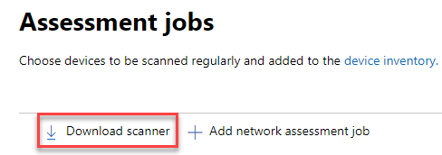

# 네트워크 장치 검색 및 취약성 관리Network device discovery and vulnerability management

[!INCLUDE [Microsoft 365 Defender rebranding](../../includes/microsoft-defender.md)]

**적용 대상:****Applies to:**

- [엔드포인트용 Microsoft Defender](https://go.microsoft.com/fwlink/?linkid=2154037) [Microsoft Defender for Endpoint](https://go.microsoft.com/fwlink/?linkid=2154037)
- [위협 및 취약점 관리Threat and vulnerability management](next-gen-threat-and-vuln-mgt.md)
- [Microsoft 365 DefenderMicrosoft 365 Defender](https://go.microsoft.com/fwlink/?linkid=2118804)

> [!IMPORTANT]
> **네트워크 장치 검사 및 관리는 현재 공개 미리 보기에 있습니다.****Scanning and managing network devices is currently in public preview** 
> 이 미리 보기 버전은 서비스 수준 계약 없이 제공하며 프로덕션 워크로드에는 권장되지 않습니다.This preview version is provided without a service level agreement, and it's not recommended for production workloads. 일부 기능은 지원되지 않을 수도, 기능이 제한될 수도 있습니다.Certain features might not be supported or might have constrained capabilities.
> 자세한 내용은 끝점 미리 보기 [기능용 Microsoft Defender를 참조하세요.](preview.md)For more information, see [Microsoft Defender for Endpoint preview features](preview.md).

>끝점용 Microsoft Defender를 경험하고 싶나요?Want to experience Microsoft Defender for Endpoint? [무료 평가판에 등록합니다.Sign up for a free trial.](https://www.microsoft.com/microsoft-365/windows/microsoft-defender-atp?ocid=docs-wdatp-portaloverview-abovefoldlink)

네트워크 검색 기능은 Microsoft  365 보안 센터 및 Microsoft Defender 보안 센터 콘솔의 장치 인벤토리 섹션에서 사용할 수 있습니다.Network discovery capabilities are available in the **Device inventory** section of the Microsoft 365 security center and Microsoft Defender Security Center consoles.  

지정된 끝점 디바이스용 Microsoft Defender가 각 네트워크 세그먼트에서 미리 구성한 네트워크 장치에 대해 정기적으로 인증된 스캔을 수행하는 데 사용됩니다.A designated Microsoft Defender for Endpoint device will be used on each network segment to perform periodic authenticated scans of preconfigured network devices. 검색된 끝점의 위협 및 취약성 관리 기능에 대한 Defender는 검색된 스위치, 라우터, WLAN 컨트롤러, 방화벽 및 VPN 게이트웨이를 보호하는 통합 워크플로를 제공합니다.Once discovered, Defender for Endpoint’s threat and vulnerability management capabilities provide integrated workflows to secure discovered switches, routers, WLAN controllers, firewalls, and VPN gateways.  

네트워크 장치가 검색 및 분류되면 보안 관리자는 최신 보안 권장 사항을 받고 조직 전체에 배포된 네트워크 장치에 대해 최근에 발견된 취약점을 검토할 수 있습니다.Once the network devices are discovered and classified, security administrators will be able to receive the latest security recommendations and review recently discovered vulnerabilities foron network devices deployed across their organizations.

## 방법Approach

끝점용 Defender에는 네트워크 장치 자체에 내장된 센서가 아니기 때문에 네트워크 장치는 표준 끝점으로 관리되지 않습니다.Network devices are not managed as standard endpoints since Defender for Endpoint doesn’t have a sensor built into the network devices themselves. 이러한 유형의 디바이스에는 원격 검사가 장치에서 필요한 정보를 얻는 에이전트 없는 접근 방식이 필요합니다.These types of devices require an agentless approach where a remote scan will obtain the necessary information from the devices. 네트워크 토폴로지 및 특성에 따라 단일 장치 또는 끝점용 Microsoft Defender에 온보딩된 몇 대의 장치가 SNMP를 사용하여 인증된 네트워크 장치 검색을 수행하며 읽기 전용입니다.Depending on the network topology and characteristics, a single device or a few devices onboarded to Microsoft Defender for Endpoint will perform authenticated scans of network devices using SNMP (read-only).

유의해야 할 두 가지 유형의 장치가 있습니다.There will be two types of devices to keep in mind:

- **평가 장치:** 네트워크 장치를 검색하는 데 사용할 이미 온보드된 장치입니다.**Assessment device**: A device that's already onboarded that you'll use to scan the network devices.
- **네트워크 장치:** 스캔하고 온보드할 네트워크 장치입니다.**Network devices**: The network devices you plan to scan and onboard.

### 네트워크 장치에 대한 취약성 관리Vulnerability management for network devices 

네트워크 장치가 검색 및 분류되면 보안 관리자는 최신 보안 권장 사항을 받고 조직 전체에 배포된 네트워크 장치에서 최근에 발견된 취약점을 검토할 수 있습니다.Once the network devices are discovered and classified, security administrators will be able to receive the latest security recommendations and review recently discovered vulnerabilities on network devices deployed across their organizations.  

## 지원되는 운영 체제Operating systems that are supported

다음 운영 체제가 현재 지원됩니다.The following operating systems are currently supported:

- Cisco IOS, IOS-XE, NX-OSCisco IOS, IOS-XE, NX-OS
- Juniper JUNOSJuniper JUNOS
- HPE ArubaOS, Procurve 스위치 소프트웨어HPE ArubaOS, Procurve Switch Software
- Palo Alto Networks PAN-OSPalo Alto Networks PAN-OS

고객 사용에서 수집한 데이터를 기반으로 시간이 지날수록 더 많은 네트워킹 공급업체 및 OS가 추가됩니다.More networking vendors and OS will be added over time, based on data gathered from customer usage. 따라서 이 목록에 지정되지 않은 경우에도 모든 네트워크 장치를 구성하는 것이 권장됩니다.Therefore, you are encouraged to configure all your network devices, even if they’re not specified in this list.

## 시작하는 방법How to get started

첫 번째 단계는 인증된 네트워크 검색을 수행할 장치를 선택하는 것입니다.Your first step is to select a device that will perform the authenticated network scans.

1. 검사할 네트워크 장치의 관리 포트에 대한 네트워크 연결이 있는 끝점 온보딩 장치(클라이언트 또는 서버)에 대한 Defender를 결정하십시오.Decide on a Defender for Endpoint onboarded device (client or server) that has a network connection to the management port for the network devices you plan on scanning. 

2. Endpoint용 Defender 평가 장치와 대상 네트워크 장치 간의 SNMP 트래픽(예: 방화벽)을 허용해야 합니다.SNMP traffic between the Defender for Endpoint assessment device and the targeted network devices must be allowed (for example, by the Firewall).

3. 취약점에 대해 평가할 네트워크 장치(예: Cisco 스위치 또는 Palo Alto Networks 방화벽)를 확인합니다.Decide which network devices will be assessed for vulnerabilities (for example: a Cisco switch or a Palo Alto Networks firewall).  

4. 끝점 평가 장치가 구성된 네트워크 장치를 쿼리할 수 있도록 구성된 모든 네트워크 장치에서 SNMP 읽기 전용이 사용하도록 설정되어 있는지 확인합니다.Make sure SNMP read-only is enabled on all configured network devices to allow the Defender for Endpoint assessment device to query the configured network devices. 'SNMP 쓰기'는 이 기능의 적절한 기능에 필요하지 않습니다.‘SNMP write’ isn't needed for the proper functionality of this feature.

5. 검색할 네트워크 장치의 IP 주소(또는 이러한 장치가 배포된 서브넷)를 얻습니다.Obtain the IP addresses of the network devices to be scanned (or the subnets where these devices are deployed).

6. 네트워크 장치의 SNMP 자격 증명(예: 커뮤니티 문자열, noAuthNoPriv, authNoPriv, authPriv)을 얻습니다.Obtain the SNMP credentials of the network devices (for example: Community String, noAuthNoPriv, authNoPriv, authPriv). 새 평가 작업을 구성할 때 자격 증명을 제공해야 합니다.You’ll be required to provide the credentials when configuring a new assessment job.  

7. 프록시 클라이언트 구성: Endpoint 장치 프록시 요구 사항에 대한 Defender 외의 추가 구성은 필요하지 않습니다.Proxy client configuration: No extra configuration is required other than the Defender for Endpoint device proxy requirements.

8. 네트워크 스캐너를 인증하고 제대로 작동하도록 허용하려면 다음 도메인/URL을 추가해야 합니다.To allow the network scanner to be authenticated and work properly, it's essential that you add the following domains/URLs:

    - login.windows.netlogin.windows.net  
    - \*.securitycenter.windows.com\*.securitycenter.windows.com
    - login.microsoftonline.comlogin.microsoftonline.com
    - *.blob.core.windows.net/networkscannerstable/**.blob.core.windows.net/networkscannerstable/*

    참고: 이러한 URL은 허용되는 데이터 수집의 끝점에 대해 문서화된 Defender 목록에 지정되지 않습니다.Note: These URLs are not specified in the Defender for Endpoint documented list of allowed data collection.

## 사용 권한Permissions

평가 작업을 구성하려면 보안 센터에서 보안 설정 관리와 같은 사용자 **권한 옵션이 필요합니다.**To configure assessment jobs, the following user permission option is required: **Manage security settings in Security Center**. 설정 역할로 이동하여 권한을  >  **찾을 수 있습니다.**You can find the permission by going to **Settings** > **Roles**. 자세한 내용은 역할 기반 액세스 제어에 대한 역할 만들기 [및 관리를 참조하세요.](user-roles.md)For more information, see [Create and manage roles for role-based access control](user-roles.md)

## 네트워크 스캐너 설치Install the network scanner

1. Microsoft **365 보안** 설정  >    >  **끝점**  >  **평가 작업('네트워크** 평가' 아래)으로 이동합니다.Go to **Microsoft 365 security** > **Settings** > **Endpoints** > **Assessment jobs** (under 'Network assessments').
    1. Microsoft Defender 보안 센터에서 설정 > 작업 페이지로 이동합니다.In the Microsoft Defender Security Center, go to Settings > Assessment jobs page.

2. 네트워크 스캐너를 다운로드하여 지정된 Endpoint 평가 장치에 설치합니다.Download the network scanner and install it on the designated Defender for Endpoint assessment device.

## 네트워크 스캐너 설치 & 등록Network scanner installation & registration

로그인 프로세스는 지정된 평가 장치 자체 또는 다른 장치(예: 개인 클라이언트 장치)에서 완료할 수 있습니다.The signing-in process can be completed on the designated assessment device itself or any other device (for example, your personal client device).

네트워크 스캐너 등록 프로세스를 완료합니다.To complete the network scanner registration process:

1. 명령줄에 나타나는 URL을 복사하고 따르고 제공된 설치 코드를 사용하여 등록 프로세스를 완료합니다.Copy and follow the URL that appears on the command line and use the provided installation code to complete the registration process.
    - 참고: URL을 복사할 수 있게 명령 프롬프트 설정을 변경해야 할 수 있습니다.Note: You may need to change Command Prompt settings to be able to copy the URL.

2. 코드를 입력하고 "보안 센터에서 보안 설정 관리"라는 끝점용 Defender 권한이 있는 Microsoft 계정을 사용하여 로그인합니다.Enter the code and sign in using a Microsoft account that has the Defender for Endpoint permission called "Manage security settings in Security Center."

3. 완료되면 로그인을 확인한 메시지가 표시됩니다.When finished, you should see a message confirming you have signed in.

## 새 평가 작업 구성Configure a new assessment job  

설정의 평가 작업 페이지에서 **네트워크** 평가 작업 **추가를 선택합니다.**In the Assessment jobs page in **Settings**, select **Add network assessment job**. 설정 프로세스에 따라 정기적으로 검사하고 장치 인벤토리에 추가할 네트워크 장치를 선택하세요.Follow the set-up process to choose network devices to be scanned regularly and added to the device inventory.

네트워크 장치 인벤토리에서 장치 중복을 방지하려면 각 IP 주소가 여러 평가 장치에서 한 번만 구성되어 있는지 확인합니다.To prevent device duplication in the network device inventory, make sure each IP address is configured only once across multiple assessment devices.

네트워크 평가 작업 단계 추가:Adding a network assessment job steps:

1. 네트워크 스캐너가 설치된 '평가 작업' 이름 및 '평가 장치'를 선택하십시오.Choose an ‘Assessment job’ name and the ‘Assessment device’ on which the network scanner was installed. 이 장치는 주기적인 인증된 스캔을 수행하게 됩니다.This device will perform the periodic authenticated scans. 
2. 검사할 대상 네트워크 장치의 IP 주소(또는 이러한 장치가 배포된 서브넷)를 추가합니다.Add IP addresses of target network devices to be scanned (or the subnets where these devices are deployed). 
3. 대상 네트워크 장치의 필수 SNMP 자격 증명을 추가합니다.Add required SNMP credentials of the target network devices. 
4. 새로 구성된 네트워크 평가 작업을 저장하여 주기적인 네트워크 검색을 시작할 수 있습니다.Save the newly configured network assessment job to start the periodic network scan. 

### 네트워크 장치 검색 및 추가Scan and add network devices

설정 프로세스 중에 한 번의 테스트 검색을 수행하여 다음을 확인할 수 있습니다.During the set-up process, you can perform a one time test scan to verify that:

- Endpoint용 Defender 평가 장치와 구성된 대상 네트워크 장치 간에 연결이 있습니다.There is connectivity between the Defender for Endpoint assessment device and the configured target network devices.
- 구성된 SNMP 자격 증명이 올바른지 확인합니다.The configured SNMP credentials are correct.

각 평가 장치는 최대 1,500회의 성공적인 IP 주소 검색을 지원할 수 있습니다.Each assessment device can support up to 1,500 successful IP addresses scan. 예를 들어 IP 주소가 100개만 성공한 결과를 반환하는 10개 다른 서브넷을 검색하는 경우 동일한 평가 장치에 있는 다른 서브넷에서 1,400개 IP 추가 주소를 검색할 수 있습니다.For example, if you scan 10 different subnets where only 100 IP addresses return successful results, you will be able to scan 1,400 IP additional addresses from other subnets on the same assessment device.  

검색할 IP 주소 범위/서브넷이 여러 개 있는 경우 테스트 검사 결과를 표시하는 데 몇 분 정도 걸립니다.If there are multiple IP address ranges/subnets to scan, the test scan results will take several minutes to show up. 테스트 검사는 최대 1,024개 주소에 사용할 수 있습니다.A test scan will be available for up to 1,024 addresses.

결과가 표시될 때 주기적 검사에 포함될 장치를 선택할 수 있습니다.Once the results show up, you can choose which devices will be included in the periodic scan. 검사 결과 보기를 건너뛰면 구성된 모든 IP 주소가 장치의 응답에 관계없이 네트워크 평가 작업으로 추가됩니다.If you skip viewing the scan results, all configured IP addresses will be added to the network assessment job (regardless of the device’s response). 검색 결과를 내보낼 수도 있습니다.The scan results can also be exported.

## 장치 인벤토리Device inventory

새로 검색된 장치는 장치 인벤토리 페이지의 새 **네트워크** 장치 **탭에** 표시됩니다.Newly discovered devices will be shown under the new **Network devices** tab in the **Device inventory** page. 장치가 업데이트될 때까지 평가 작업을 추가한 후 최대 2시간이 걸릴 수 있습니다.It may take up to two hours after adding an assessment job until the devices are updated.

## 문제 해결Troubleshooting

### 네트워크 스캐너 설치 실패Network scanner installation has failed

필요한 URL이 방화벽 설정의 허용 도메인에 추가되는지 확인합니다.Verify that the required URLs are added to the allowed domains in your firewall settings. 또한 장치 프록시 및 인터넷 연결 설정 구성에 설명된 바와 같이 프록시 [설정이 구성되어 있는지 확인합니다.](configure-proxy-internet.md)Also, make sure proxy settings are configured as described in [Configure device proxy and Internet connectivity settings](configure-proxy-internet.md)

### Microsoft.com/devicelogin 웹 페이지가 표시되지 않습니다.The Microsoft.com/devicelogin web page did not show up

필요한 URL이 방화벽의 허용 도메인에 추가되는지 확인Verify that the required URLs are added to the allowed domains in your firewall. 또한 프록시 설정이 장치 프록시 및 인터넷 연결 설정 구성에 설명된 [바와 같이 구성되어 있는지 확인합니다.](configure-proxy-internet.md)Also, make sure proxy settings are configured as described in [Configure device proxy and Internet connectivity settings](configure-proxy-internet.md).

### 네트워크 장치가 몇 시간 후에 장치 인벤토리에 표시되지 않습니다.Network devices are not shown in the device inventory after several hours

검사 결과는 평가 작업 구성을 완료한 후 수행된 초기 검사 후 몇 시간 후에 업데이트해야 합니다.The scan results should be updated a few hours after the initial scan that took place after completing the assessment job configuration.

장치가 아직 표시되어 있지 않은 경우 네트워크 스캐너를 설치한 평가 장치에서 'MdatpNetworkScanService' 서비스가 실행되고 있는지 확인하고 관련 평가 작업 구성에서 "검사 실행"을 수행하십시오.If devices are still not shown, verify that the service ‘MdatpNetworkScanService’ is running on your assessment devices, on which you installed the network scanner, and perform a “Run scan” in the relevant assessment job configuration.  

5분 후에도 여전히 결과를 얻지 못하면 서비스를 다시 시작합니다.If you still don’t get results after 5 minutes, restart the service.  

### 마지막으로 본 디바이스가 24시간보다 길습니다.Devices last seen time is longer than 24 hours

스캐너가 제대로 실행되고 있는지 확인합니다.Validate that the scanner is running properly. 그런 다음 검사 정의로 이동하여 "테스트 실행"을 선택합니다.Then go to the scan definition and select “Run test.” 관련 IP 주소에서 반환되는 오류 메시지를 검사합니다.Check what error messages are returning from the relevant IP addresses.

### 필수 위협 및 취약성 관리 사용자 권한Required threat and vulnerability management user permission

등록이 완료되고 "새 에이전트를 추가할 수 있는 권한이 없는 것 같습니다.Registration finished with an error: "It looks like you don't have sufficient permissions for adding a new agent. 필요한 사용 권한은 '보안 센터에서 보안 설정 관리'입니다."The required permission is 'Manage security settings in Security Center'."

아무 키나 눌러 종료합니다.Press any key to exit.

시스템 관리자에게 필요한 사용 권한을 할당해달고 요청합니다.Ask your system administrator to assign you the required permissions. 또는 다른 관련 구성원에게 로그인 코드 및 링크를 제공하여 로그인 프로세스에 도움을 줄 수 있도록 요청합니다.Alternately, ask another relevant member to help you with the sign-in process by providing them with the sign-in code and link.

### 등록 프로세스에서 명령줄에 제공된 링크를 사용하여 등록 프로세스가 실패합니다.Registration process fails using provided link in the command line in registration process

다른 브라우저를 사용해 보거나 로그인 링크 및 코드를 다른 장치에 복사합니다.Try a different browser or copy the sign-in link and code to a different device.

### 텍스트가 너무 작거나 명령줄에서 텍스트를 복사할 수 없습니다.Text too small or can’t copy text from command line

복사 및 텍스트 크기를 변경할 수 있도록 장치의 명령줄 설정을 변경합니다.Change command-line settings on your device to allow copying and change text size.

## 관련 문서Related articles

- [장치 인벤토리Device inventory](machines-view-overview.md)
- [고급 기능 구성Configure advanced features](advanced-features.md)
