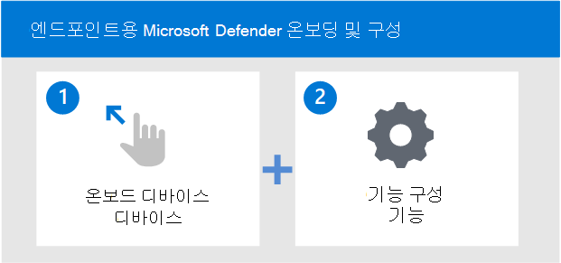

# 장치 온보딩 및 끝점용 Microsoft Defender 기능 구성

[!INCLUDE [Microsoft 365 Defender rebranding](../../includes/microsoft-defender.md)]

**적용 대상:**
- [엔드포인트용 Microsoft Defender](https://go.microsoft.com/fwlink/p/?linkid=2154037)
- [Microsoft 365 Defender](https://go.microsoft.com/fwlink/?linkid=2118804)

[!include[Prerelease information](../../includes/prerelease.md)]

> Endpoint용 Defender를 경험하고 싶나요? [무료 평가판을 신청하세요.](https://signup.microsoft.com/create-account/signup?products=7f379fee-c4f9-4278-b0a1-e4c8c2fcdf7e&ru=https://aka.ms/MDEp2OpenTrial?ocid=docs-wdatp-onboardconfigure-abovefoldlink)

끝점용 Microsoft Defender 배포는 두 단계 프로세스입니다.

- 서비스에 장치 온보딩
- 서비스의 기능 구성

## 서비스에 장치 온보딩
지원되는 디바이스를 온보딩하려면 Endpoint 포털의 온보딩 섹션으로 이동해야 합니다. 장치에 따라 적절한 단계를 안내하고 장치에 적합한 관리 및 배포 도구 옵션을 제공합니다. 

일반적으로 디바이스를 서비스에 온보드합니다.

- 장치가 최소 요구 사항을 [충족하는지 확인](minimum-requirements.md)
- 장치에 따라 끝점 포털용 Defender의 온보딩 섹션에 제공된 구성 단계를 따릅니다.
- 장치에 적합한 관리 도구 및 배포 방법 사용
- 검색 테스트를 실행하여 장치가 제대로 온보드 및 서비스에 보고되었는지 확인합니다.

> [!VIDEO https://www.microsoft.com/videoplayer/embed/RE4bGqr]

## 온보더링 및 구성 도구 옵션
다음 표에는 온보드해야 하는 끝점에 따라 사용 가능한 도구가 나열됩니다.

| 끝점     | 도구 옵션                       |
|--------------|------------------------------------------|
| **Windows**  |  [로컬 스크립트(최대 10대의 장치)](configure-endpoints-script.md)    [그룹 정책](configure-endpoints-gp.md)    [Microsoft Endpoint Manager/ 모바일 장치 관리자](configure-endpoints-mdm.md)     [Microsoft Endpoint Configuration Manager](configure-endpoints-sccm.md)   [VDI 스크립트](configure-endpoints-vdi.md)   [Azure Defender와 통합](configure-server-endpoints.md#integration-with-azure-defender)  |
| **macOS**    | [로컬 스크립트](mac-install-manually.md)   [Microsoft Endpoint Manager ](mac-install-with-intune.md)   [JAMF Pro](mac-install-with-jamf.md)   [모바일 장치 관리](mac-install-with-other-mdm.md) |
| **Linux Server** | [로컬 스크립트](linux-install-manually.md)   [Puppet](linux-install-with-puppet.md)   [Ansible](linux-install-with-ansible.md)|
| **iOS**      | [Microsoft Endpoint Manager ](ios-install.md)               |
| **Android**  | [Microsoft Endpoint Manager ](android-intune.md)            | 

다음 표에는 온보드해야 하는 끝점에 따라 사용 가능한 도구가 나열됩니다.

## 서비스의 기능 구성
온보딩 장치를 사용하면 끝점용 Micorosft Defender의 끝점 감지 및 응답 기능을 효과적으로 사용할 수 있습니다.

장치를 온보드한 후 서비스의 다른 기능을 구성해야 합니다. 다음 표에는 환경에 가장 적합한 보호를 제공하도록 구성할 수 있는 기능이 나열되어 있습니다.

| 기능 | 설명 |
|-|-|
| [위협 & 취약성 관리(TVM) 구성](tvm-prerequisites.md) | 위협 & 취약성 관리는 끝점용 Microsoft Defender의 구성 요소로, 다음을 비롯한 고유한 가치를 보안 관리자 및 보안 운영 팀에 제공합니다.    - 끝점 취약성과 상호 상관된 EDR 실시간 끝점 감지 및 대응(EDR) 인사이트.    - 인시던트 조사 중에 평가할 수 있는 장치 취약성 컨텍스트.    - Microsoft Intune Microsoft 2013을 통한 기본 System Center Configuration Manager.  |
| [NGP(차세대 보호) 구성](configure-microsoft-defender-antivirus-features.md) | Microsoft Defender 바이러스 백신 맬웨어 방지 솔루션으로, 데스크톱, 휴대용 컴퓨터 및 서버에 대한 차세대 보호 기능을 제공합니다. Windows Defender 바이러스 백신은 다음을 포함합니다.   -신규 및 새로운 위협의 거의 즉각적인 감지 및 차단을 위한 클라우드 제공 보호. 기계 학습 및 Intelligent Security Graph와 함께 클라우드 전달 보호 기능은 Microsoft Defender 바이러스 백신을 지원하는 차세대 기술의 일부입니다.    - 고급 파일 및 프로세스 동작 모니터링 및 기타 기억("실시간 보호"라고도 알려지기)를 사용하여 항상 검색합니다.   - 기계 학습, 인간 및 자동화된 빅 데이터 분석 및 심층 위협 저항 연구를 기반으로 하는 전용 보호 업데이트. |
| [ASR(공격 표면 축소) 구성](overview-attack-surface-reduction.md) | Microsoft Defender for Endpoint의 공격 표면 감소 기능은 새로운 위협으로부터 조직의 장치 및 응용 프로그램을 보호하는 데 도움이 됩니다. |
| [자동 조사 & 재구성(AIR) 기능 구성](configure-automated-investigations-remediation.md) | Microsoft Defender for Endpoint는 자동화된 조사를 사용하여 개별적으로 조사해야 하는 경고의 양을 크게 줄입니다. 자동화된 조사 기능은 다양한 검사 알고리즘과 분석가가 사용하는 프로세스(예: 플레이북)를 활용하여 경고를 검사하고 위반을 해결하기 위해 즉시 수정 조치를 취합니다. 이렇게 하면 경고 수량이 많이 줄어들기 때문에 보안 운영 전문가가 더 복잡한 위협과 기타 높은 가치의 이니셔티브에 집중할 수 있습니다. |
| [MTE(Microsoft 위협 전문가) 기능 구성](configure-microsoft-threat-experts.md) | Microsoft 위협 전문가 센터는 SOC(보안 운영 센터)에 전문가 수준의 모니터링 및 분석을 제공하는 관리되는 헌팅 서비스로, 고유한 환경에서 중요한 위협이 누락되지 않도록 합니다.      |

## 디바이스에 대해 Windows 지원되는 기능

|운영 체제  |Windows 10 & 11  |Windows Server 2012 R2  [[1]](#fn1)  |Windows Server 2016 [[1](#fn1)]   |Windows Server 2019 & 2022|Windows 서버 1803+|
|---------|---------|---------|---------|---------|---------|
|**방지**    |         |         |         |         |         |
|공격 표면 감소 규칙     |    Y     |   Y      |    Y     |    Y     |    Y     |
|장치 제어     |     Y    |    N     |    N     |    N     |    N     |  
|방화벽     |      Y   |    Y     |     Y    |    Y    |    Y   |
|네트워크 보호     |      Y   |    Y     |     Y    |    Y    |    Y   |
|차세대 보호     |      Y   |    Y     |     Y    |    Y    |    Y   |
|변조 방지     |        Y   |    Y     |     Y    |    Y    |    Y   |
|웹 보호     |       Y   |    Y     |     Y    |    Y    |    Y   |
|||||||
|**탐지**     |         |         |         |||
|고급 헌팅     |      Y   |    Y     |     Y    |    Y    |    Y   |
|사용자 지정 파일 표시기     |      Y   |    Y     |     Y    |    Y    |    Y   |
|사용자 지정 네트워크 표시기     |      Y   |    Y     |     Y    |    Y    |    Y   |
|EDR 수동 & 차단     |      Y   |    Y     |     Y    |    Y    |    Y   |
|센스 감지 센서     |      Y   |    Y     |     Y    |    Y    |    Y   |
|끝점 & 네트워크 장치 검색     |      Y   |    N     |     N    |    N    |    N   |
|||||||
|**응답**     |         |         |         |||
|자동화된 조사 & 대응(AIR)    |      Y   |    Y     |     Y    |    Y    |    Y   |
|장치 응답 기능: 고지, 조사 패키지 수집, AV 검사 실행     |      Y   |    Y     |     Y    |    Y    |    Y   |
|파일 응답 기능: 파일 수집, 심층 분석, 파일 차단, 중지 및 검사     |      Y   |    Y     |     Y    |    Y    |    Y   |
|라이브 응답    |      Y   |    Y     |     Y    |    Y    |    Y   |

(<a id="fn1">1) 2016</a>및 2016에 대한 최신 통합 Windows Server 2012 참조합니다. 자세한 내용은 [Onboard Windows Servers to the Defender for Endpoint Service를 참조하세요.](configure-server-endpoints.md)

>[!NOTE]
>Windows 7, 8.1, Windows Server 2008 R2에는 SCEP(System Center Endpoint Protection)를 사용하는 AV 및 EDR 센서에 대한 지원이 포함되어 있습니다.