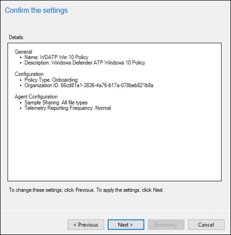
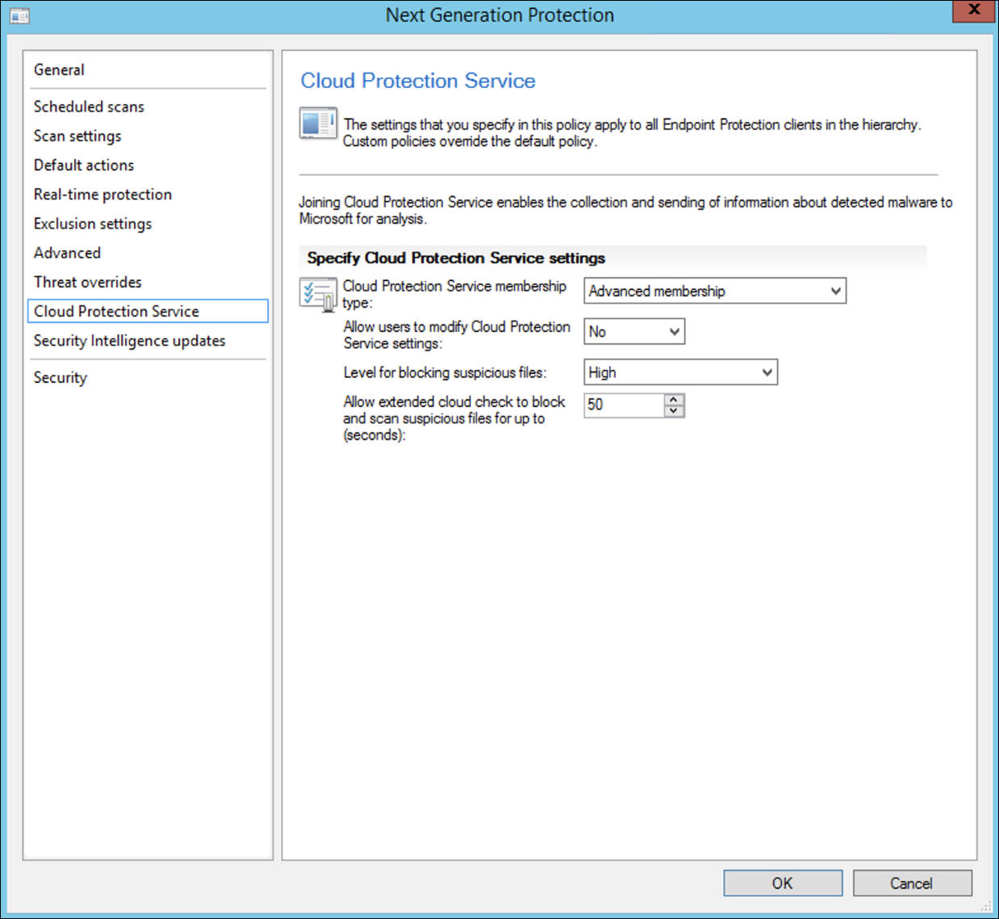

# Microsoft Endpoint Configuration Manager를 사용하여 온보딩

[!INCLUDE [Microsoft 365 Defender rebranding](../../includes/microsoft-defender.md)]

**적용 대상:**
- [엔드포인트용 Microsoft Defender](https://go.microsoft.com/fwlink/p/?linkid=2154037)
- [Microsoft 365 Defender](https://go.microsoft.com/fwlink/?linkid=2118804)

> 엔드포인트용 Microsoft Defender를 경험하고 싶으신가요? [무료 평가판을 신청하세요.](https://signup.microsoft.com/create-account/signup?products=7f379fee-c4f9-4278-b0a1-e4c8c2fcdf7e&ru=https://aka.ms/MDEp2OpenTrial?ocid=docs-wdatp-exposedapis-abovefoldlink)

이 문서는 배포 가이드의 일부로, 온보더링 방법의 예로 사용할 수 있습니다.

계획 [항목에서는](deployment-strategy.md) 디바이스를 서비스에 온보드하는 여러 가지 방법이 제공되었습니다. 이 항목에서는 공동 관리 아키텍처에 대해 다산합니다.

 *환경 아키텍처 다이어그램*

Endpoint용 Defender는 다양한 끝점 및 도구의 온보딩을 지원하기는 하지만 이 문서에서는 이를 다루지 않습니다. 지원되는 다른 배포 도구 및 방법을 사용하는 일반적인 온보드에 대한 자세한 내용은 [Onboarding overview 를 참조하세요.](onboarding.md)

이 항목에서는 사용자에게 다음을 안내합니다.

- 1단계: Windows 장치 온보드
- 2단계: 끝점 기능에 대한 Defender 구성

이 온보더링 지침은 다음 기본 단계를 안내합니다. 이 가이드를 사용할 때 Microsoft Endpoint Configuration Manager.

- **컬렉션에서 컬렉션 Microsoft Endpoint Configuration Manager**
- **Microsoft Defender를 사용하여 끝점 기능을 Microsoft Endpoint Configuration Manager**

> [!NOTE]
> 이 Windows 배포에서는 모든 디바이스에 대해 설명합니다.

## 1단계: Windows 사용하여 Microsoft Endpoint Configuration Manager

### 컬렉션 만들기

디바이스를 Windows Microsoft Endpoint Configuration Manager 배포는 기존 컬렉션을 대상으로 지정하거나 테스트하기 위해 새 컬렉션을 만들 수 있습니다.

그룹 정책 또는 수동 방법과 같은 도구를 사용하여 온보더링하면 시스템에 에이전트가 설치되지 않습니다.

Microsoft Endpoint Configuration Manager 콘솔 내에서 온보더링 프로세스는 콘솔 내의 규정 준수 설정의 일부로 구성됩니다.

이 필수 구성을 받는 모든 시스템은 Configuration Manager 클라이언트가 관리 지점에서 이 정책을 계속 받는 한 해당 구성을 유지 관리합니다.

다음 단계에 따라 온보더를 사용하여 끝점을 Microsoft Endpoint Configuration Manager.

1. Microsoft Endpoint Configuration Manager 콘솔에서 자산 및 준수 **\> 개요 장치 \> 컬렉션으로 이동합니다.**

    

2. 장치 **컬렉션을 마우스 오른쪽 단추로 클릭하고** **장치 컬렉션 만들기를 선택합니다.**

    

3. 이름 **및** **제한 컬렉션을 제공한** 후 다음 을 **선택합니다.**

    

4. 규칙 **추가를** 선택하고 쿼리 **규칙 을 선택합니다.**

    

5. 직접 **구성원 마법사에서** **다음을 클릭하고** 쿼리 문 **편집 을 클릭합니다.**

     

6. 조건을 **선택한** 다음 별 아이콘을 선택합니다.

     

7. 기준 유형을 **단순** 값으로 유지  , 운영 체제 **-** 빌드 번호, 연산자가 14393보다 크거나 같고 값 **14393으로** 선택한 후 확인을 **클릭합니다.**

    

8. 다음을 **선택하고** **닫습니다.**

    

9. **다음** 을 선택합니다.

    

이 작업을 완료한 후 이제 환경의 모든 Windows 장치 컬렉션이 있습니다.

## 2단계: 끝점용 Microsoft Defender 기능 구성

이 섹션에서는 Microsoft Endpoint Configuration Manager 디바이스에서 다음 기능을 Windows 안내합니다.

- [**엔드포인트 감지 및 대응**](#endpoint-detection-and-response)
- [**차세대 보호**](#next-generation-protection)
- [**공격 표면 감소**](#attack-surface-reduction)

### 엔드포인트 감지 및 응답

#### Windows 10 Windows 11

Microsoft 365 Defender 포털 내에서 정책을 만드는 데 사용할 수 있는 정책을 다운로드하여 System Center Configuration Manager 정책을 Windows 10 Windows 11 `.onboarding` 있습니다.

1. Microsoft 365 Defender 포털에서 설정 [를 선택한 다음 온보더링을 선택합니다.](https://security.microsoft.com/preferences2/onboarding)

2. 배포 방법에서 지원되는 버전의 **Microsoft Endpoint Configuration Manager.**

    

3. 패키지 **다운로드를 선택합니다.**

    

4. 접근성 있는 위치에 패키지를 저장합니다.
5. Microsoft Endpoint Configuration Manager Microsoft Defender ATP 정책에 대한 자산 > 준수 > Endpoint Protection > **개요로 이동합니다.**

6. **Microsoft Defender ATP 정책을** 마우스 오른쪽 단추로 클릭하고 Microsoft **Defender ATP 정책 만들기를 선택합니다.**

    

7. 이름과 설명을 입력하고 **온보더링이** 선택되어 있는지 확인한 후 다음 을 **선택합니다.**

    

8. **찾아보기** 를 클릭합니다.

9. 위의 4단계에서 다운로드한 파일의 위치로 이동합니다.

10. **다음** 을 클릭합니다.
11. 적절한 **샘플(없음** 또는 모든 파일 형식)으로 **에이전트를 구성합니다.**

    

12. 적절한 원격 분석(**Normal** 또는 **Expedited)을** 선택하고 다음 을 **클릭합니다.**

    

13. 구성을 확인한 후 다음 을 **클릭합니다.**

     

14. **마법사가** 완료되면 닫기 를 클릭합니다.

15. Microsoft Endpoint Configuration Manager 콘솔에서 방금 만든 끝점용 Defender 정책을 마우스 오른쪽 단추로 클릭하고 배포를 **선택합니다.**

     

16. 오른쪽 패널에서 이전에 만든 컬렉션을 선택하고 확인 을 **클릭합니다.**

    

#### 이전 버전의 Windows 클라이언트(Windows 7 및 Windows 8.1)

이전 버전의 작업 영역의 온보딩에 필요한 끝점 작업 영역 ID 및 작업 영역 키에 대한 Defender를 식별하려면 Windows.

1. Microsoft 365 Defender 포털에서 **끝점** 설정(장치 관리 아래)를 \>  \>  **선택합니다.**

2. 운영 체제에서 Windows **7 SP1 및 8.1 을 선택하십시오.**

3. 작업 영역 **ID 및** 작업 영역 키를 **복사하여** 저장합니다. 프로세스의 후반부에 사용됩니다.

    

4. MMA(Microsoft Monitoring Agent 설치합니다.

   MMA는 현재(2019년 1월 현재) 다음 운영 체제에서 Windows 지원됩니다.

   - 서버 SKUS: Windows Server 2008 SP1 이상
   - 클라이언트 SKUS: Windows 7 SP1 이상

   MMA 에이전트는 디바이스에 Windows 합니다. 에이전트를 설치하려면 일부 시스템에서 MMA를 사용하여 데이터를 수집하기 위해 고객 환경 및 진단 원격 분석용 업데이트를 다운로드해야 합니다.  이러한 시스템 버전은 다음과 같습니다.

   - Windows 8.1
   - Windows 7
   - Windows Server 2016
   - Windows Server 2012 R2
   - Windows Server 2008 R2

   특히, Windows SP1의 경우 다음 패치를 설치해야 합니다.

   - [KB4074598 설치](https://support.microsoft.com/help/4074598/windows-7-update-kb4074598)
   - [4..NET Framework 이상](https://www.microsoft.com/download/details.aspx?id=30653) 또는  [KB3154518](https://support.microsoft.com/help/3154518/support-for-tls-system-default-versions-included-in-the-net-framework)중 하나를 설치합니다. 동일한 시스템에 두 가지를 모두 설치하지 않습니다.

5. 프록시를 사용하여 인터넷에 연결하는 경우 프록시 설정 구성 섹션을 참조하세요.

완료되면 1시간 이내에 포털에 온보드 엔드포인트가 표시될 것입니다.

### 차세대 보호

Microsoft Defender 바이러스 백신은 데스크톱, 휴대용 컴퓨터 및 서버에 대한 차세대 보호를 제공하는 기본 제공 맬웨어 방지 솔루션입니다.

1. Microsoft Endpoint Configuration Manager 콘솔에서 자산 및 준수 개요 Endpoint Protection 맬웨어 방지 정책 만들기 **를 선택 합니다.** **\> \> \>**

    

2. 예약된 **검사,** 검사 **설정,** 기본 **작업,** 실시간 **보호,** 제외 **설정,** **고급,** **위협** 다시 지정, **클라우드 보호** 서비스 **및** 보안 인텔리전스 업데이트를 선택하고 확인 을 **선택합니다.**

    

    특정 산업이나 일부 엔터프라이즈 고객은 바이러스 백신 구성 방법에 대한 특정 요구가 있을 수 있습니다.

    [빠른 검사와 전체 검사 및 사용자 지정 검사](/windows/security/threat-protection/microsoft-defender-antivirus/scheduled-catch-up-scans-microsoft-defender-antivirus#quick-scan-versus-full-scan-and-custom-scan)

    자세한 내용은 구성 프레임워크 [Windows 보안 참조합니다.](/windows/security/threat-protection/windows-security-configuration-framework/windows-security-configuration-framework)
  
    

    

    

    

    

    

    

    

3. 새로 만든 맬웨어 방지 정책을 마우스 오른쪽 단추로 클릭하고 배포를 **선택합니다.**

    

4. 새 맬웨어 방지 정책을 Windows 확인을 **클릭합니다.**

     

이 작업을 완료한 후 이제 작업을 성공적으로 구성했습니다Windows Defender 바이러스 백신.

### 공격 표면 감소

Endpoint용 Defender의 공격 표면 감소 기조에는 Exploit Guard에서 사용할 수 있는 기능 집합이 포함되어 있습니다. ASR(공격 표면 축소) 규칙, 제어된 폴더 액세스, 네트워크 보호 및 Exploit Protection

이러한 모든 기능은 감사 모드와 차단 모드를 제공합니다. 감사 모드에서는 최종 사용자에게 영향을 미치지 않습니다. 추가 원격 분석만 수집하고 검색 포털에서 사용할 Microsoft 365 Defender 있습니다. 배포의 목표는 단계별 보안 컨트롤을 차단 모드로 이동하는 것입니다.

감사 모드에서 ASR 규칙을 설정하는 경우:

1. Microsoft Endpoint Configuration Manager 콘솔에서 Exploit Guard를 사용하여 자산 및 준수 Endpoint Protection **\> Windows Defender \> \> 탐색하고** Exploit Guard 정책 **만들기 를 선택하세요.**

   

2. 공격 **표면 감소를 선택합니다.**

3. 규칙을 **감사로 설정하고** 다음 을 **클릭합니다.**

    

4. 다음 을 클릭하여 새 Exploit Guard 정책을 **확인 합니다.**

    

5. 정책을 만든 후 닫기 **를 클릭합니다.**

    

6. 새로 만든 정책을 마우스 오른쪽 단추로 클릭하고 배포 를 **클릭합니다.**

    

7. 새로 만든 Windows 정책을 대상으로 지정하고 확인을 **클릭합니다.**

    

이 작업을 완료한 후 감사 모드에서 ASR 규칙을 성공적으로 구성했습니다.

다음은 ASR 규칙이 끝점에 올바르게 적용되는지 확인하기 위한 추가 단계입니다. (이 경우 몇 분 정도 걸릴 수 있습니다.)

1. 웹 브라우저에서 로 <https://security.microsoft.com> 이동합니다.

2. 왼쪽 **메뉴에서** 구성 관리를 선택합니다.

3. 공격 **표면 관리 패널에서** 공격 표면 관리로 이동을 클릭합니다.

    

4. 공격 **표면** 감소 규칙 보고서에서 구성 탭을 클릭합니다. 각 디바이스에서 ASR 규칙 구성 개요 및 ASR 규칙 상태를 보여줍니다.

    

5. 각 장치를 클릭하면 ASR 규칙의 구성 세부 정보가 표시됩니다.

    

자세한 [내용은 ASR 규칙 배포 및](/microsoft-365/security/defender-endpoint/configure-machines-asr) 검색 최적화를 참조합니다.

#### 감사 모드에서 네트워크 보호 규칙 설정

1. Microsoft Endpoint Configuration Manager 콘솔에서 Exploit Guard를 사용하여 자산 및 준수 Endpoint Protection **\> Windows Defender \> \> 탐색하고** Exploit Guard 정책 **만들기 를 선택하세요.**

    

2. 네트워크 **보호 를 선택합니다.**

3. 설정을 감사로 **설정하고** 다음을 **클릭합니다.**

    

4. 다음 을 클릭하여 새 Exploit Guard 정책을 **확인 합니다.**

    

5. 정책이 만들어지면 닫기 를 **클릭합니다.**

    

6. 새로 만든 정책을 마우스 오른쪽 단추로 클릭하고 배포 를 **클릭합니다.**

    

7. 새로 만든 Windows 정책을 선택하고 확인 을 **선택합니다.**

    

이 작업을 완료한 후 감사 모드에서 네트워크 보호를 성공적으로 구성했습니다.

#### 감사 모드에서 제어된 폴더 액세스 규칙을 설정

1. Microsoft Endpoint Configuration Manager 콘솔에서 Exploit Guard의 자산 및 준수 개요 Endpoint Protection Windows Defender Exploit Guard 정책  >    >    >   **만들기를 선택하세요.**

    

2. 제어된 **폴더 액세스 를 선택합니다.**

3. 구성을 **감사로 설정하고** 다음 을 **클릭합니다.**

    

4. 다음 을 클릭하여 새 Exploit Guard 정책을 **확인 합니다.**

    

5. 정책이 만들어지면 닫기 를 **클릭합니다.**

    

6. 새로 만든 정책을 마우스 오른쪽 단추로 클릭하고 배포 를 **클릭합니다.**

    

7. 새로 만든 Windows 정책을 대상으로 지정하고 확인을 **클릭합니다.**

    

이제 감사 모드에서 제어된 폴더 액세스를 구성했습니다.

## 관련 항목

- [Microsoft Endpoint Manager를 사용하여 온보딩](onboarding-endpoint-manager.md)
