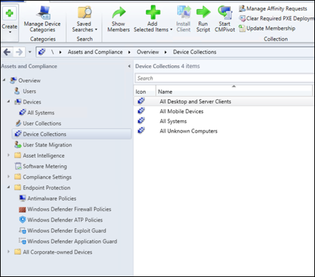
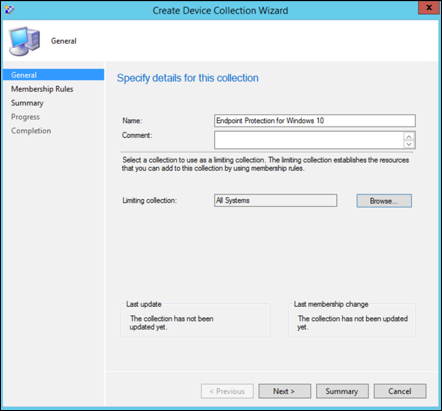
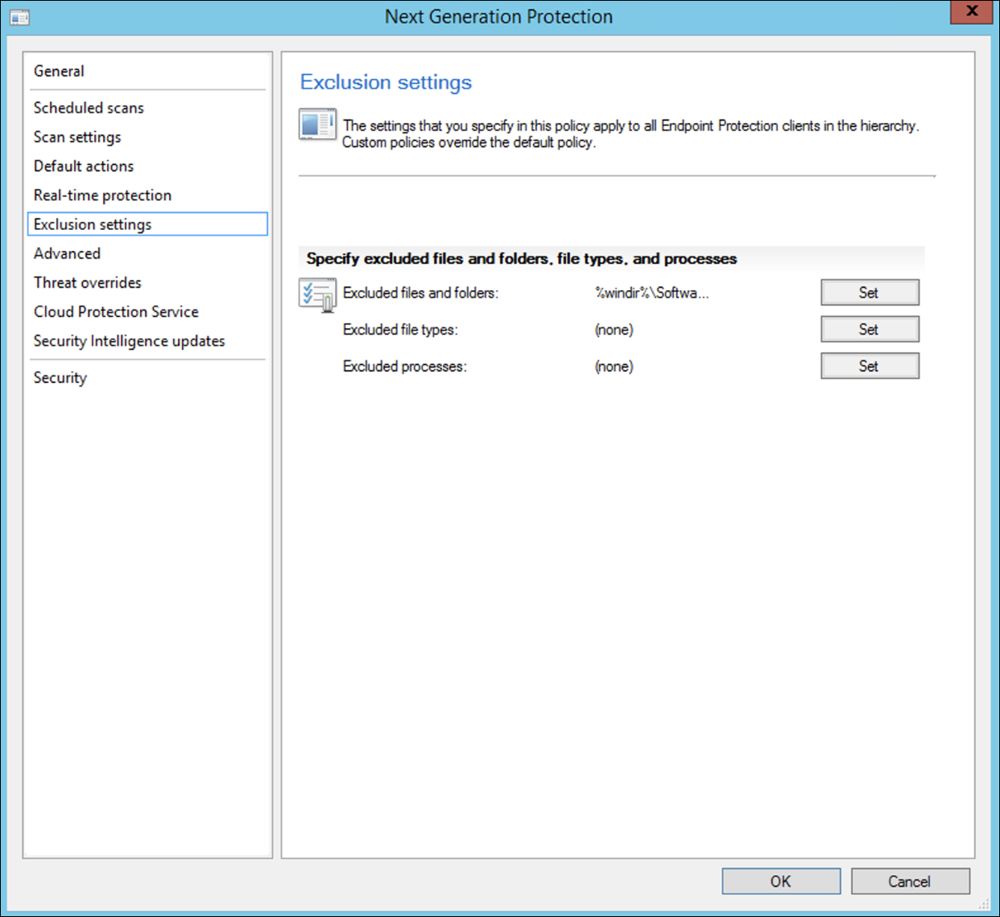
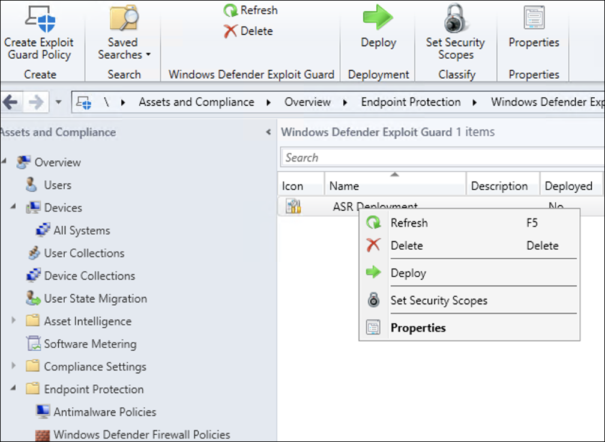

# Microsoft Endpoint Configuration Manager를 사용하여 온보딩Onboarding using Microsoft Endpoint Configuration Manager

[!INCLUDE [Microsoft 365 Defender rebranding](../../includes/microsoft-defender.md)]

**적용 대상:****Applies to:**
- [엔드포인트용 Microsoft DefenderMicrosoft Defender for Endpoint](https://go.microsoft.com/fwlink/p/?linkid=2154037)
- [Microsoft 365 DefenderMicrosoft 365 Defender](https://go.microsoft.com/fwlink/?linkid=2118804)

> 끝점용 Microsoft Defender를 경험하고 싶나요?Want to experience Microsoft Defender for Endpoint? [무료 평가판에 등록합니다.Sign up for a free trial.](https://www.microsoft.com/microsoft-365/windows/microsoft-defender-atp?ocid=docs-wdatp-exposedapis-abovefoldlink)

이 문서는 배포 가이드의 일부로, 온보더링 방법의 예로 사용할 수 있습니다.This article is part of the Deployment guide and acts as an example onboarding method. 

계획 [항목에서는](deployment-strategy.md) 디바이스를 서비스에 온보드하는 여러 가지 방법이 제공되었습니다.In the [Planning](deployment-strategy.md) topic, there were several methods provided to onboard devices to the service. 이 항목에서는 공동 관리 아키텍처에 대해 다산합니다.This topic covers the co-management architecture. 

 *환경 아키텍처 다이어그램*
*Diagram of environment architectures*

Endpoint용 Defender는 다양한 끝점 및 도구의 온보딩을 지원하기는 하지만 이 문서에서는 이를 다루지 않습니다.While Defender for Endpoint supports onboarding of various endpoints and tools, this article does not cover them. 지원되는 다른 배포 도구 및 방법을 사용하는 일반적인 온보드에 대한 자세한 내용은 [Onboarding overview 를 참조하세요.](onboarding.md)For information on general onboarding using other supported deployment tools and methods, see [Onboarding overview](onboarding.md).

이 항목에서는 사용자에게 다음을 안내합니다.This topic guides users in:
- 1단계: Windows 장치 온보드Step 1: Onboarding Windows devices to the service 
- 2단계: 끝점 기능에 대한 Defender 구성Step 2: Configuring Defender for Endpoint capabilities

이 온보더링 지침은 다음 기본 단계를 안내합니다. 이 가이드를 사용할 때 Microsoft Endpoint Configuration Manager.This onboarding guidance will walk you through the following basic steps that you need to take when using Microsoft Endpoint Configuration Manager:
- **컬렉션에서 컬렉션 Microsoft Endpoint Configuration Manager****Creating a collection in Microsoft Endpoint Configuration Manager**
- **Microsoft Defender를 사용하여 끝점 기능을 Microsoft Endpoint Configuration Manager****Configuring Microsoft Defender for Endpoint capabilities using Microsoft Endpoint Configuration Manager**

>[!NOTE]
>이 Windows 배포에서는 모든 디바이스에 대해 설명합니다.Only Windows devices are covered in this example deployment. 

## 1단계: Windows 사용하여 Microsoft Endpoint Configuration ManagerStep 1: Onboard Windows devices using Microsoft Endpoint Configuration Manager

### 컬렉션 만들기Collection creation
장치를 Windows 10 온보 Microsoft Endpoint Configuration Manager 배포는 기존 컬렉션을 대상으로 지정하거나 테스트하기 위해 새 컬렉션을 만들 수 있습니다.To onboard Windows 10 devices with Microsoft Endpoint Configuration Manager, the deployment can target an existing collection or a new collection can be created for testing. 

그룹 정책 또는 수동 방법과 같은 도구를 사용하여 온보더링하면 시스템에 에이전트가 설치되지 않습니다.Onboarding using tools such as Group policy or manual method does not install any agent on the system. 

Microsoft Endpoint Configuration Manager 콘솔 내에서 온보더링 프로세스는 콘솔 내의 규정 준수 설정의 일부로 구성됩니다.Within the Microsoft Endpoint Configuration Manager console the onboarding process will be configured as part of the compliance settings within the console.

이 필수 구성을 받는 모든 시스템은 Configuration Manager 클라이언트가 관리 지점에서 이 정책을 계속 받는 한 해당 구성을 유지 관리합니다.Any system that receives this required configuration will maintain that configuration for as long as the Configuration Manager client continues to receive this policy from the management point. 

다음 단계에 따라 온보더를 사용하여 끝점을 Microsoft Endpoint Configuration Manager.Follow the steps below to onboard endpoints using Microsoft Endpoint Configuration Manager.

1. Microsoft Endpoint Configuration Manager 콘솔에서 자산 및 준수 **\> 개요 장치 \> 컬렉션으로 이동합니다.**In Microsoft Endpoint Configuration Manager console, navigate to **Assets and Compliance \> Overview \> Device Collections**.            

    

2. 장치 **컬렉션을 마우스 오른쪽 단추로 클릭하고** **장치 컬렉션 만들기를 선택합니다.**Right Click **Device Collection** and select **Create Device Collection**.

    

3. 이름 **및** **제한 컬렉션을 제공한** 후 다음 을 **선택합니다.**Provide a **Name** and **Limiting Collection**, then select **Next**.

    

4. 규칙 **추가를** 선택하고 쿼리 **규칙 을 선택합니다.**Select **Add Rule** and choose **Query Rule**.

    

5.  직접 **구성원 마법사에서** **다음을 클릭하고** 쿼리 문 **편집 을 클릭합니다.**Click **Next** on the **Direct Membership Wizard** and click on **Edit Query Statement**.

     

6. 조건을 **선택한** 다음 별 아이콘을 선택합니다.Select **Criteria** and then choose the star icon.

     

7. 기준 유형을 **단순** 값으로 유지  , 운영 체제 **-** 빌드 번호, 연산자가 14393보다 크거나 같고 값 **14393으로** 선택한 후 확인을 **클릭합니다.**Keep criterion type as **simple value**, choose where as **Operating System - build number**, operator as **is greater than or equal to** and value **14393** and click on **OK**.

    

8. 다음을 **선택하고** **닫습니다.**Select **Next** and **Close**.

    

9. **다음** 을 선택합니다.Select **Next**.

    

이 작업을 완료한 후 이제 환경의 모든 Windows 10 장치 컬렉션이 있습니다.After completing this task, you now have a device collection with all the Windows 10 endpoints in the environment. 

## 2단계: 끝점용 Microsoft Defender 기능 구성Step 2: Configure Microsoft Defender for Endpoint capabilities 
이 섹션에서는 Microsoft Endpoint Configuration Manager 디바이스에서 다음 기능을 Windows 안내합니다.This section guides you in configuring the following capabilities using Microsoft Endpoint Configuration Manager on Windows devices:

- [**엔드포인트 검색 및 대응****Endpoint detection and response**](#endpoint-detection-and-response)
- [**차세대 보호****Next-generation protection**](#next-generation-protection)
- [**공격 표면 감소****Attack surface reduction**](#attack-surface-reduction)

### 엔드포인트 감지 및 응답Endpoint detection and response
#### Windows 10Windows 10
정책 내에서 Microsoft Defender 보안 센터 '.onboarding' 정책을 다운로드하여 System Center Configuration Manager 정책을 Windows 10 배포할 수 있습니다.From within the Microsoft Defender Security Center it is possible to download the '.onboarding' policy that can be used to create the policy in System Center Configuration Manager and deploy that policy to Windows 10 devices.

1. Microsoft Defender 보안 센터 포털에서 설정 [를 선택한 다음 온보더링을 선택합니다.](https://securitycenter.windows.com/preferences2/onboarding)From a Microsoft Defender Security Center Portal, select [Settings and then Onboarding](https://securitycenter.windows.com/preferences2/onboarding).

2. 배포 방법에서 지원되는 버전의 **Microsoft Endpoint Configuration Manager.**Under Deployment method select the supported version of **Microsoft Endpoint Configuration Manager**.

    

3. 패키지 **다운로드를 선택합니다.**Select **Download package**.

    

4. 접근성 있는 위치에 패키지를 저장합니다.Save the package to an accessible location.
5. 다음 Microsoft Endpoint Configuration Manager: 자산 및 준수 정책 개요 > **정책 > Endpoint Protection > Microsoft Defender ATP 이동합니다.**In  Microsoft Endpoint Configuration Manager, navigate to: **Assets and Compliance > Overview > Endpoint Protection > Microsoft Defender ATP Policies**.

6. 정책 Microsoft Defender ATP 마우스 오른쪽 **단추로 클릭하고** **정책 Microsoft Defender ATP 선택합니다.**Right-click **Microsoft Defender ATP Policies** and select **Create Microsoft Defender ATP Policy**.

    

7. 이름과 설명을 입력하고 **온보더링이** 선택되어 있는지 확인한 후 다음 을 **선택합니다.**Enter the name and description, verify **Onboarding** is selected, then select **Next**.

    

8. **찾아보기** 를 클릭합니다.Click **Browse**.

9. 위의 4단계에서 다운로드한 파일의 위치로 이동합니다.Navigate to the location of the downloaded file from step 4 above.

10. **다음** 을 클릭합니다.Click **Next**.
11. 적절한 **샘플(없음** 또는 모든 파일 형식)으로 **에이전트를 구성합니다.**Configure the Agent with the appropriate samples (**None** or **All file types**).

    

12. 적절한 원격 분석(**Normal** 또는 **Expedited)을** 선택하고 다음 을 **클릭합니다.**Select the appropriate telemetry (**Normal** or **Expedited**) then click **Next**.

    

14. 구성을 확인한 후 다음 을 **클릭합니다.**Verify the configuration, then click **Next**.

     

15. **마법사가** 완료되면 닫기 를 클릭합니다.Click **Close** when the Wizard completes.

16.  Microsoft Endpoint Configuration Manager 콘솔에서 방금 만든 끝점용 Defender 정책을 마우스 오른쪽 단추로 클릭하고 배포를 **선택합니다.**In the Microsoft Endpoint Configuration Manager console, right-click the Defender for Endpoint policy you just created and select **Deploy**.

     

17. 오른쪽 패널에서 이전에 만든 컬렉션을 선택하고 확인 을 **클릭합니다.**On the right panel, select the previously created collection and click **OK**.

    

#### 이전 버전의 Windows 클라이언트(Windows 7 및 Windows 8.1)Previous versions of Windows Client (Windows 7 and Windows 8.1)
이전 버전의 작업 영역의 온보딩에 필요한 끝점 작업 영역 ID 및 작업 영역 키에 대한 Defender를 식별하려면 Windows.Follow the steps below to identify the Defender for Endpoint Workspace ID and Workspace Key, that will be required for the onboarding of previous versions of Windows.

1. Microsoft Defender 보안 센터 포털에서 온보 설정 > **선택합니다.**From a Microsoft Defender Security Center Portal, select **Settings > Onboarding**.

2. 운영 체제에서 Windows **7 SP1 및 8.1 을 선택하십시오.**Under operating system choose **Windows 7 SP1 and 8.1**.

3. 작업 영역 **ID 및** 작업 영역 키를 **복사하여** 저장합니다.Copy the **Workspace ID** and **Workspace Key** and save them. 프로세스의 후반부에 사용됩니다.They will be used later in the process.

    

4. MMA(Microsoft Monitoring Agent 설치합니다.Install the Microsoft Monitoring Agent (MMA).  
    MMA는 현재(2019년 1월 현재) 다음 운영 체제에서 Windows 지원됩니다.MMA is currently (as of January 2019) supported on the following Windows Operating Systems:

    -   서버 SKUS: Windows Server 2008 SP1 이상Server SKUs: Windows Server 2008 SP1 or Newer

    -   클라이언트 SKUS: Windows 7 SP1 이상Client SKUs: Windows 7 SP1 and later

    MMA 에이전트는 디바이스에 Windows 합니다.The MMA agent will need to be installed on Windows devices. 에이전트를 설치하려면 일부 시스템에서 MMA를 사용하여 데이터를 수집하기 위해 고객 환경 및 진단 원격 분석용 업데이트를 다운로드해야 합니다. To install the agent, some systems will need to download the [Update for customer experience and diagnostic telemetry](https://support.microsoft.com/help/3080149/update-for-customer-experience-and-diagnostic-telemetry) in order to collect the data with MMA. 이러한 시스템 버전은 다음과 같습니다.These system versions include but may not be limited to:

    -   Windows 8.1Windows 8.1

    -   Windows 7Windows 7

    -   Windows Server 2016Windows Server 2016

    -   Windows Server 2012 R2Windows Server 2012 R2

    -   Windows Server 2008 R2Windows Server 2008 R2

    특히, Windows SP1의 경우 다음 패치를 설치해야 합니다.Specifically, for Windows 7 SP1, the following patches must be installed:

    -   [KB4074598 설치](https://support.microsoft.com/help/4074598/windows-7-update-kb4074598)Install [KB4074598](https://support.microsoft.com/help/4074598/windows-7-update-kb4074598)

    -   4..NET Framework 이상 또는 KB3154518 중 하나를  
         [설치합니다.](https://support.microsoft.com/help/3154518/support-for-tls-system-default-versions-included-in-the-net-framework)Install either [.NET Framework 4.5](https://www.microsoft.com/download/details.aspx?id=30653) (or later) **or**
        [KB3154518](https://support.microsoft.com/help/3154518/support-for-tls-system-default-versions-included-in-the-net-framework).
        동일한 시스템에 두 가지를 모두 설치하지 않습니다.Do not install both on the same system.

5. 프록시를 사용하여 인터넷에 연결하는 경우 프록시 설정 구성 섹션을 참조하세요.If you're using a proxy to connect to the Internet see the Configure proxy settings section.

완료되면 1시간 이내에 포털에 온보드 엔드포인트가 표시될 것입니다.Once completed, you should see onboarded endpoints in the portal within an hour.

### 차세대 보호Next generation protection 
Microsoft Defender 바이러스 백신은 데스크톱, 휴대용 컴퓨터 및 서버에 대한 차세대 보호를 제공하는 기본 제공 맬웨어 방지 솔루션입니다.Microsoft Defender Antivirus is a built-in antimalware solution that provides next generation protection for desktops, portable computers, and servers.

1. Microsoft Endpoint Configuration Manager 콘솔에서 자산 및 준수 개요 Endpoint Protection 맬웨어 방지 정책 만들기 **를 선택 합니다.** **\> \> \>**In the Microsoft Endpoint Configuration Manager console, navigate to **Assets and Compliance \> Overview \> Endpoint Protection \> Antimalware Polices** and choose **Create Antimalware Policy**.

    

2. 예약된 **검사,** 검사 **설정,** 기본 **작업,** 실시간 **보호,** 제외 **설정,** **고급,** **위협** 다시 지정, **클라우드 보호** 서비스 **및** 보안 인텔리전스 업데이트를 선택하고 확인 을 **선택합니다.**Select **Scheduled scans**, **Scan settings**, **Default actions**, **Real-time protection**, **Exclusion settings**, **Advanced**, **Threat overrides**, **Cloud Protection Service** and **Security intelligence   updates** and choose **OK**.

    

    특정 산업이나 일부 엔터프라이즈 고객은 바이러스 백신 구성 방법에 대한 특정 요구가 있을 수 있습니다.In certain industries or some select enterprise customers might have specific needs on how Antivirus is configured.

  
    [빠른 검사와 전체 검사 및 사용자 지정 검사Quick scan versus full scan and custom scan](/windows/security/threat-protection/microsoft-defender-antivirus/scheduled-catch-up-scans-microsoft-defender-antivirus#quick-scan-versus-full-scan-and-custom-scan)

    자세한 내용은 구성 프레임워크 Windows 보안 [참조](/windows/security/threat-protection/windows-security-configuration-framework/windows-security-configuration-framework)For more details, see [Windows Security configuration framework](/windows/security/threat-protection/windows-security-configuration-framework/windows-security-configuration-framework)
  
    

    

    

    

    

    

    

    

3. 새로 만든 맬웨어 방지 정책을 마우스 오른쪽 단추로 클릭하고 배포를 **선택합니다.**Right-click on the newly created antimalware policy and select **Deploy**.

    

4. 새 맬웨어 방지 정책을 Windows 10 확인을 **클릭합니다.**Target the new antimalware policy to your Windows 10 collection and click **OK**.

     

이 작업을 완료한 후 이제 작업을 성공적으로 구성했습니다Windows Defender 바이러스 백신.After completing this task, you now have successfully configured Windows Defender Antivirus.

### 공격 표면 감소Attack surface reduction
Endpoint용 Defender의 공격 표면 감소 기조에는 Exploit Guard에서 사용할 수 있는 기능 집합이 포함되어 있습니다.The attack surface reduction pillar of Defender for Endpoint includes the feature set that is available under Exploit Guard. ASR(공격 표면 축소) 규칙, 제어된 폴더 액세스, 네트워크 보호 및 Exploit ProtectionAttack surface reduction (ASR) rules, Controlled Folder Access, Network Protection and Exploit Protection. 

이러한 모든 기능은 감사 모드와 차단 모드를 제공합니다.All these features provide an audit mode and a block mode. 감사 모드에서는 최종 사용자에게 영향을 미치지 않습니다.In audit mode there is no end-user impact. 추가 원격 분석만 수집하고 원격 분석에서 사용할 수 Microsoft Defender 보안 센터.All it does is collect additional telemetry and make it available in the Microsoft Defender Security Center. 배포의 목표는 단계별 보안 컨트롤을 차단 모드로 이동하는 것입니다.The goal with a deployment is to step-by-step move security controls into block mode.

감사 모드에서 ASR 규칙을 설정하는 경우:To set ASR rules in Audit mode:

1. Microsoft Endpoint Configuration Manager 콘솔에서 Exploit Guard를 사용하여 자산 및 준수 Endpoint Protection **\> Windows Defender \> \> 탐색하고** Exploit Guard 정책 **만들기 를 선택하세요.**In the Microsoft Endpoint Configuration Manager console, navigate to **Assets and Compliance \> Overview \> Endpoint Protection \> Windows Defender Exploit Guard** and choose **Create Exploit Guard Policy**.

   

2.  공격 **표면 감소를 선택합니다.**Select **Attack Surface Reduction**.
   

3. 규칙을 **감사로 설정하고** 다음 을 **클릭합니다.**Set rules to **Audit** and click **Next**.

    

4. 다음 을 클릭하여 새 Exploit Guard 정책을 **확인 합니다.**Confirm the new Exploit Guard policy by clicking on **Next**.

    

    
5. 정책을 만든 후 닫기 **를 클릭합니다.**Once the policy is created click **Close**.

    

    
   

6.  새로 만든 정책을 마우스 오른쪽 단추로 클릭하고 배포 를 **클릭합니다.**Right-click on the newly created policy and choose **Deploy**.
    
    

7. 새로 만든 Windows 10 정책을 대상으로 지정하고 확인을 **클릭합니다.**Target the policy to the newly created Windows 10 collection and click **OK**.

    

이 작업을 완료한 후 감사 모드에서 ASR 규칙을 성공적으로 구성했습니다.After completing this task, you now have successfully configured ASR rules in audit mode.  
  
다음은 ASR 규칙이 끝점에 올바르게 적용되는지 확인하기 위한 추가 단계입니다.Below are additional steps to verify whether ASR rules are correctly applied to endpoints. (이 경우 몇 분 정도 걸릴 수 있습니다.)(This may take few minutes)

1. 웹 브라우저에서 로 <https://securitycenter.windows.com> 이동합니다.From a web browser, navigate to <https://securitycenter.windows.com>.

2.  왼쪽 **메뉴에서** 구성 관리를 선택합니다.Select **Configuration management** from left side menu.

3. 공격 **표면 관리 패널에서** 공격 표면 관리로 이동을 클릭합니다.Click **Go to attack surface management** in the Attack surface management panel. 
    
    

4. 공격 **표면** 감소 규칙 보고서에서 구성 탭을 클릭합니다.Click **Configuration** tab in Attack surface reduction rules reports. 각 디바이스에서 ASR 규칙 구성 개요 및 ASR 규칙 상태를 보여줍니다.It shows ASR rules configuration overview and ASR rules status on each devices.

    

5. 각 장치를 클릭하면 ASR 규칙의 구성 세부 정보가 표시됩니다.Click each device shows configuration details of ASR rules.

    

자세한 [내용은 ASR 규칙 배포 및](/microsoft-365/security/defender-endpoint/configure-machines-asr)   검색 최적화를 참조합니다.See [Optimize ASR rule deployment and detections](/microsoft-365/security/defender-endpoint/configure-machines-asr)   for more details.  

#### 감사 모드에서 네트워크 보호 규칙을 설정:Set Network Protection rules in Audit mode:
1. Microsoft Endpoint Configuration Manager 콘솔에서 Exploit Guard를 사용하여 자산 및 준수 Endpoint Protection **\> Windows Defender \> \> 탐색하고** Exploit Guard 정책 **만들기 를 선택하세요.**In the Microsoft Endpoint Configuration Manager console, navigate to **Assets and  Compliance \> Overview \> Endpoint Protection \> Windows Defender Exploit Guard** and choose **Create Exploit Guard Policy**.

    

2. 네트워크 **보호 를 선택합니다.**Select **Network protection**.

3. 설정을 감사로 **설정하고** 다음을 **클릭합니다.**Set the setting to **Audit** and click **Next**. 

    

4. 다음 을 클릭하여 새 Exploit Guard 정책을 **확인 합니다.**Confirm the new Exploit Guard Policy by clicking **Next**.
    
    

5. 정책이 만들어지면 닫기 를 **클릭합니다.**Once the policy is created click on **Close**.

    

6. 새로 만든 정책을 마우스 오른쪽 단추로 클릭하고 배포 를 **클릭합니다.**Right-click on the newly created policy and choose **Deploy**.

    

7. 새로 만든 Windows 10 정책을 선택하고 확인 을 **선택합니다.**Select the policy to the newly created Windows 10 collection and choose **OK**.

    

이 작업을 완료한 후 감사 모드에서 네트워크 보호를 성공적으로 구성했습니다.After completing this task, you now have successfully configured Network Protection in audit mode.

#### 감사 모드에서 제어된 폴더 액세스 규칙을 설정하는 경우:To set Controlled Folder Access rules in Audit mode:

1. Microsoft Endpoint Configuration Manager 콘솔에서 Exploit Guard를 사용하여 자산 및 준수 Endpoint Protection **\> Windows Defender \> \> 탐색하고** Exploit Guard 정책 **만들기 를 선택하세요.**In the Microsoft Endpoint Configuration Manager console, navigate to **Assets and Compliance \> Overview \> Endpoint Protection \> Windows Defender Exploit Guard** and choose **Create Exploit Guard Policy**.

    

2. 제어된 **폴더 액세스 를 선택합니다.**Select **Controlled folder access**.
    
3. 구성을 **감사로 설정하고** 다음 을 **클릭합니다.**Set the configuration to **Audit** and click **Next**.

        
    
4. 다음 을 클릭하여 새 Exploit Guard 정책을 **확인 합니다.**Confirm the new Exploit Guard Policy by clicking on **Next**.

    

5. 정책이 만들어지면 닫기 를 **클릭합니다.**Once the policy is created click on **Close**.

    

6. 새로 만든 정책을 마우스 오른쪽 단추로 클릭하고 배포 를 **클릭합니다.**Right-click on the newly created policy and choose **Deploy**.

    

7.  새로 만든 Windows 10 정책을 대상으로 지정하고 확인을 **클릭합니다.**Target the policy to the newly created Windows 10 collection and click **OK**.

    

이제 감사 모드에서 제어된 폴더 액세스를 구성했습니다.You have now successfully configured Controlled folder access in audit mode.

## 관련 항목Related topic
- [Microsoft Endpoint Manager를 사용하여 온보딩Onboarding using Microsoft Endpoint Manager](onboarding-endpoint-manager.md)
