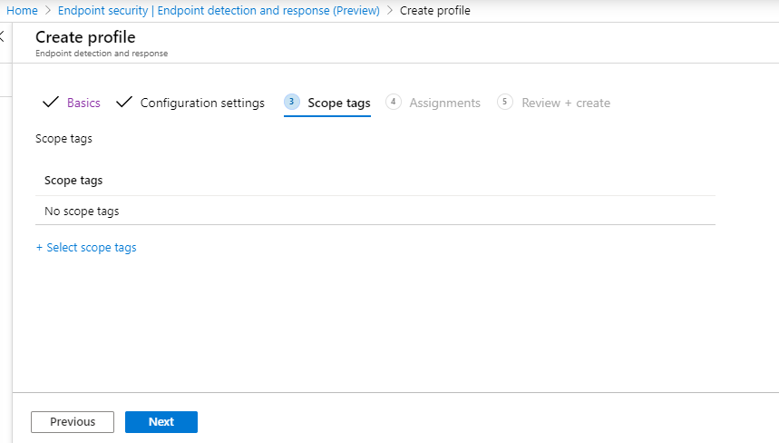
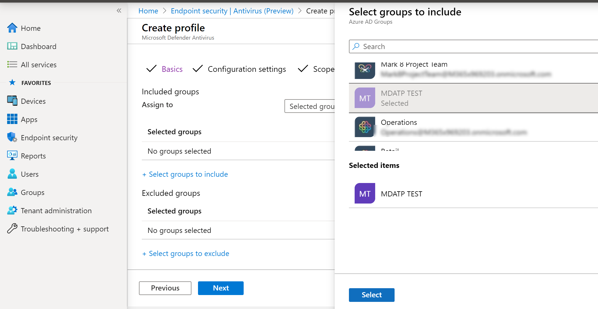
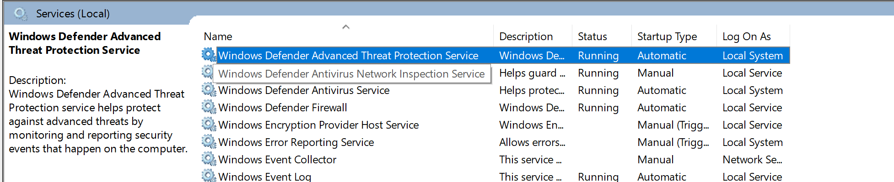
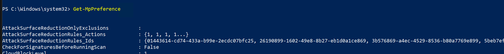

# Microsoft Endpoint Manager를 사용하여 온보딩

[!INCLUDE [Microsoft 365 Defender rebranding](../../includes/microsoft-defender.md)]

**적용 대상:**
- [엔드포인트용 Microsoft Defender](https://go.microsoft.com/fwlink/p/?linkid=2154037)
- [Microsoft 365 Defender](https://go.microsoft.com/fwlink/?linkid=2118804)

> 엔드포인트용 Microsoft Defender를 경험하고 싶으신가요? [무료 평가판을 신청하세요.](https://signup.microsoft.com/create-account/signup?products=7f379fee-c4f9-4278-b0a1-e4c8c2fcdf7e&ru=https://aka.ms/MDEp2OpenTrial?ocid=docs-wdatp-exposedapis-abovefoldlink)

이 문서는 배포 가이드의 일부로, 온보더링 방법의 예로 사용할 수 있습니다.

계획 [항목에서는](deployment-strategy.md) 디바이스를 서비스에 온보드하는 여러 가지 방법이 제공되었습니다. 이 항목에서는 클라우드 네이티브 아키텍처에 대해 다산합니다.

 *환경 아키텍처 다이어그램*

Endpoint용 Defender는 다양한 끝점 및 도구의 온보딩을 지원하기는 하지만 이 문서에서는 이를 다루지 않습니다. 지원되는 다른 배포 도구 및 방법을 사용하는 일반적인 온보드에 대한 자세한 내용은 [Onboarding overview 를 참조하세요.](onboarding.md)

[Microsoft Endpoint Manager](/mem/endpoint-manager-overview) 여러 서비스를 통합하는 솔루션 플랫폼입니다. 클라우드 기반 [Microsoft Intune](/mem/intune/fundamentals/what-is-intune) 관리에 대한 자세한 정보도 포함되어 있습니다.

이 항목에서는 사용자에게 다음을 안내합니다.

- 1단계: MEM(Microsoft Endpoint Manager)에서 구성을 할당하여 서비스에 장치 온보드
- 2단계: 추가 기능을 사용하여 끝점에 대한 Defender Microsoft Endpoint Manager

이 온보더링 지침은 다음 기본 단계를 안내합니다. 이 가이드를 사용할 때 Microsoft Endpoint Manager.

- [대상 장치 또는 사용자 식별](#identify-target-devices-or-users)
  - Azure Active Directory 그룹 만들기(사용자 또는 장치)
- [구성 프로필 만들기](#step-2-create-configuration-policies-to-configure-microsoft-defender-for-endpoint-capabilities)
  - 이 Microsoft Endpoint Manager 각 기능에 대해 별도의 정책을 만드는 데 대해 안내합니다.

## 리소스

나머지 프로세스에 필요한 링크는 다음과 같습니다.

- [MEM 포털](https://aka.ms/memac)
- [보안 센터](https://securitycenter.windows.com/)
- [Intune 보안 기준](/mem/intune/protect/security-baseline-settings-defender-atp#microsoft-defender)

자세한 내용은 Microsoft Endpoint Manager 리소스를 참조하십시오.

- [Microsoft Endpoint Manager 페이지](/mem/)
- [Intune 및 ConfigMgr의 수렴에 대한 블로그 게시물](https://www.microsoft.com/microsoft-365/blog/2019/11/04/use-the-power-of-cloud-intelligence-to-simplify-and-accelerate-it-and-the-move-to-a-modern-workplace/)
- [MEM의 소개 비디오](https://www.microsoft.com/microsoft-365/blog/2019/11/04/use-the-power-of-cloud-intelligence-to-simplify-and-accelerate-it-and-the-move-to-a-modern-workplace)

## 1단계: MEM에서 구성을 할당할 그룹을 만들어 장치 온보드

### 대상 장치 또는 사용자 식별

이 섹션에서는 구성을 할당하는 테스트 그룹을 만들 것입니다.

> [!NOTE]
> Intune은 Azure Active Directory(Azure AD) 그룹을 사용하여 장치 및 사용자를 관리합니다. Intune 관리자는 조직의 요구 사항에 맞게 그룹을 설정할 수 있습니다.
>
> 자세한 내용은 [그룹을 추가하여 사용자 및 디바이스 구성](/mem/intune/fundamentals/groups-add)을 참조하세요.

### 그룹 만들기

1. MEM 포털을 열 수 있습니다.

2. 새 **> 그룹 열기**

    > [!div class="mx-imgBorder"]
    > 

3. 세부 정보를 입력하고 새 그룹을 만들 수 있습니다.

    > [!div class="mx-imgBorder"]
    > 

4. 테스트 사용자 또는 장치를 추가합니다.

5. 모든 그룹 **> 그룹 창에서** 새 그룹을 열 수 있습니다.

6. 구성원을 **선택하여 > 추가합니다.**

7. 테스트 사용자 또는 장치를 찾아 선택합니다.

    > [!div class="mx-imgBorder"]
    > 

8. 이제 테스트 그룹에 테스트할 구성원이 있습니다.

## 2단계: 끝점 기능을 위한 Microsoft Defender를 구성하는 구성 정책 만들기

다음 섹션에서는 다양한 구성 정책을 만들 것입니다.

첫 번째는 끝점용 Defender에 온보딩할 사용자 또는 장치 그룹을 선택하는 구성 정책입니다.

- [엔드포인트 검색 및 대응](#endpoint-detection-and-response)

그런 다음 여러 가지 유형의 끝점 보안 정책을 계속 만들게 됩니다.

- [차세대 보호](#next-generation-protection)
- [공격 표면 감소](#attack-surface-reduction---attack-surface-reduction-rules)

### 엔드포인트 감지 및 응답

1. MEM 포털을 열 수 있습니다.

2. 끝점 검색 및 **> 끝점 보안 으로 이동합니다.** 프로필 **만들기를 클릭합니다.**

    > [!div class="mx-imgBorder"]
    > 

3. 플랫폼에서 **Windows 10 이상, 프로필 - 끝점** 검색 및 응답 만들기를 > 선택합니다.

4. 이름과 설명을 입력하고 다음 을 **선택합니다.**

    > [!div class="mx-imgBorder"]
    > 

5. 필요한 설정을 선택하고 다음 을 **선택합니다.**

    > [!div class="mx-imgBorder"]
    > 

    > [!NOTE]
    > 이 경우 이는 Endpoint용 Defender가 이미 Intune에 통합되어 있는 것으로 자동 채워진 것입니다. 통합에 대한 자세한 내용은 [Intune에서 끝점에 대해 Microsoft Defender 사용 을 참조하세요.](/mem/intune/protect/advanced-threat-protection-configure#to-enable-microsoft-defender-atp)
    >
    > 다음 이미지는 끝점용 Microsoft Defender가 Intune과 통합되지 않은 경우 볼 수 있는 예제입니다.
    >
    > 

6. 필요한 경우 범위 태그를 추가하고 다음 을 **선택합니다.**

    > [!div class="mx-imgBorder"]
    > 

7. 포함할 그룹 선택을  클릭하여 테스트 그룹을 추가하고 그룹을 선택한 후 다음 을 **선택합니다.**

    > [!div class="mx-imgBorder"]
    > 

8. 검토하고 수락한 다음 만들기를 **선택합니다.**

    > [!div class="mx-imgBorder"]
    > 

9. 완료된 정책을 볼 수 있습니다.

    > [!div class="mx-imgBorder"]
    > 

### 차세대 보호

1. MEM 포털을 열 수 있습니다.

2. 정책 **만들기 에서 끝점**> 바이러스 > 로 이동합니다.

    > [!div class="mx-imgBorder"]
    > 

3. 플랫폼 - Windows 10 이상 - Windows **및 프로필 - Microsoft Defender 바이러스 백신 > 선택합니다.**

4. 이름 및 설명을 입력하고 다음 을 **선택합니다.**

    > [!div class="mx-imgBorder"]
    > 

5. 구성 **설정 페이지에서**: 클라우드 보호, Microsoft Defender 바이러스 백신, Real-Time 보호 및 수정에 필요한 구성을 설정합니다.

    > [!div class="mx-imgBorder"]
    > 

6. 필요한 경우 범위 태그를 추가하고 다음 을 **선택합니다.**

    > [!div class="mx-imgBorder"]
    > 

7. 포함할 그룹을 선택하고 테스트 그룹에 할당한 후 다음 을 **선택합니다.**

    > [!div class="mx-imgBorder"]
    > 

8. 검토하고 만든 다음 만들기를 **선택합니다.**

    > [!div class="mx-imgBorder"]
    > 

9. 만든 구성 정책이 볼 수 있습니다.

    > [!div class="mx-imgBorder"]
    > 

### 공격 표면 감소 - 공격 표면 감소 규칙

1. MEM 포털을 열 수 있습니다.

2. 끝점 **보안 및 공격 > 축소로 이동합니다.**

3. 정책 **만들기 를 선택합니다.**

4. 플랫폼 - Windows 10 이상 - 프로필 - 만들기에서 공격 **표면 > 선택합니다.**

    > [!div class="mx-imgBorder"]
    > 

5. 이름과 설명을 입력하고 다음 을 **선택합니다.**

    > [!div class="mx-imgBorder"]
    > 

6. 구성 **설정 페이지에서**: 공격 표면 감소 규칙에 필요한 구성을 설정하고 다음 을 **선택합니다.**

    > [!NOTE]
    > 모든 공격 표면 감소 규칙을 감사로 구성할 것입니다.
    >
    > 자세한 내용은 공격 표면 [감소 규칙을 참조하세요.](attack-surface-reduction.md)

    > [!div class="mx-imgBorder"]
    > 

7. 필요한 경우 범위 태그를 추가하고 다음 을 **선택합니다.**

    > [!div class="mx-imgBorder"]
    > 

8. 포함할 그룹을 선택하고 테스트 그룹에 할당한 후 다음 을 **선택합니다.**

    > [!div class="mx-imgBorder"]
    > 

9. 세부 정보를 검토한 다음 만들기 를 **선택합니다.**

    > [!div class="mx-imgBorder"]
    > 

10. 정책을 시청합니다.

    > [!div class="mx-imgBorder"]
    > 

### 공격 표면 감소 - 웹 보호

1. MEM 포털을 열 수 있습니다.

2. 끝점 **보안 및 공격 > 축소로 이동합니다.**

3. 정책 **만들기 를 선택합니다.**

4. 만들기 Windows 10 이상 - 웹 보호 **> 선택합니다.**

    > [!div class="mx-imgBorder"]
    > 

5. 이름과 설명을 입력하고 다음 을 **선택합니다.**

    > [!div class="mx-imgBorder"]
    > 

6. 구성 **설정 페이지:** 웹 보호에 필요한 구성을 설정하고 다음 을 **선택합니다.**

    > [!NOTE]
    > 웹 보호를 차단으로 구성하고 있습니다.
    >
    > 자세한 내용은 Web [Protection 을 참조하세요.](web-protection-overview.md)

    > [!div class="mx-imgBorder"]
    > 

7. 다음에 필요한 범위 **> 추가합니다.**

    > [!div class="mx-imgBorder"]
    > 

8. 다음에서 테스트 그룹에 **할당을 > 선택합니다.**

    > [!div class="mx-imgBorder"]
    > 

9. 검토 **및 만들기를 > 를 선택합니다.**

    > [!div class="mx-imgBorder"]
    > 

10. 정책을 시청합니다.

    > [!div class="mx-imgBorder"]
    > 

## 구성 설정 유효성 검사

### 정책이 적용된지 확인

구성 정책이 할당된 후 적용하는 데 시간이 다소 걸릴 수 있습니다.

타이밍에 대한 자세한 내용은 [Intune 구성 정보를 참조하세요.](/mem/intune/configuration/device-profile-troubleshoot#how-long-does-it-take-for-devices-to-get-a-policy-profile-or-app-after-they-are-assigned)

구성 정책이 테스트 장치에 적용되어 있는지 확인하려면 각 구성 정책에 대해 다음 프로세스를 따르하세요.

1. MEM 포털을 열고 위의 단계에 표시된 대로 관련 정책으로 이동합니다. 다음 예에서는 차세대 보호 설정을 보여줍니다.

    > [!div class="mx-imgBorder"]
    > 

2. 정책 **상태를 확인하려면** 구성 정책을 선택합니다.

    > [!div class="mx-imgBorder"]
    > 

3. 장치  **상태를 선택하여** 상태를 확인합니다.

    > [!div class="mx-imgBorder"]
    > 

4. 상태를  **확인하려면** 사용자 상태를 선택합니다.

    > [!div class="mx-imgBorder"]
    > 

5. 상태를  **확인하려면** 설정당 상태를 선택합니다.

    > [!TIP]
    > 이 보기는 다른 정책과 충돌하는 설정을 식별하는 데 매우 유용합니다.

    > [!div class="mx-imgBorder"]
    > 

### 끝점 검색 및 응답 확인

1. 구성을 적용하기 전에 Endpoint Protection Defender for Endpoint Protection 시작하면 안 됩니다.

    > [!div class="mx-imgBorder"]
    > 

2. 구성이 적용된 후 Endpoint Protection 서비스를 시작해야 합니다.

    > [!div class="mx-imgBorder"]
    > 

3. 장치에서 서비스가 실행되고 나면 디바이스가 디바이스에 Microsoft Defender 보안 센터.

    > [!div class="mx-imgBorder"]
    > 

### 차세대 보호 확인

1. 테스트 장치에 정책을 적용하기 전에 아래 표시된 설정을 수동으로 관리할 수 있습니다.

    > [!div class="mx-imgBorder"]
    > 

2. 정책이 적용된 후 설정을 수동으로 관리할 수 없습니다.

    > [!NOTE]
    > 다음 이미지에서 **클라우드 제공** 보호 켜기 및 실시간 보호 켜기가 관리되는 것으로 표시됩니다. 

    > [!div class="mx-imgBorder"]
    > 

### 공격 표면 감소 확인 - 공격 표면 감소 규칙

1. 테스트 장치에 정책을 적용하기 전에 PowerShell 창을 펜으로 처리하고 를 `Get-MpPreference` 입력합니다.

2. 콘텐츠가 없는 다음 줄로 응답해야 합니다.

    > AttackSurfaceReductionOnlyExclusions:
    >
    > AttackSurfaceReductionRules_Actions:
    >
    > AttackSurfaceReductionRules_Ids:

    

3. 테스트 장치에 정책을 적용한 후 PowerShell Windows 를 `Get-MpPreference` 입력합니다.

4. 아래와 같이 콘텐츠가 있는 다음 줄로 응답해야 합니다.

    

### 공격 표면 감소 확인 - 웹 보호

1. 테스트 장치에서 PowerShell 을 열고 Windows `(Get-MpPreference).EnableNetworkProtection` 를 입력합니다.

2. 아래와 같이 0으로 응답해야 합니다.

    

3. 정책을 적용한 후 PowerShell Windows 를 `(Get-MpPreference).EnableNetworkProtection` 입력합니다.

4. 아래와 같이 1로 응답해야 합니다.

    
