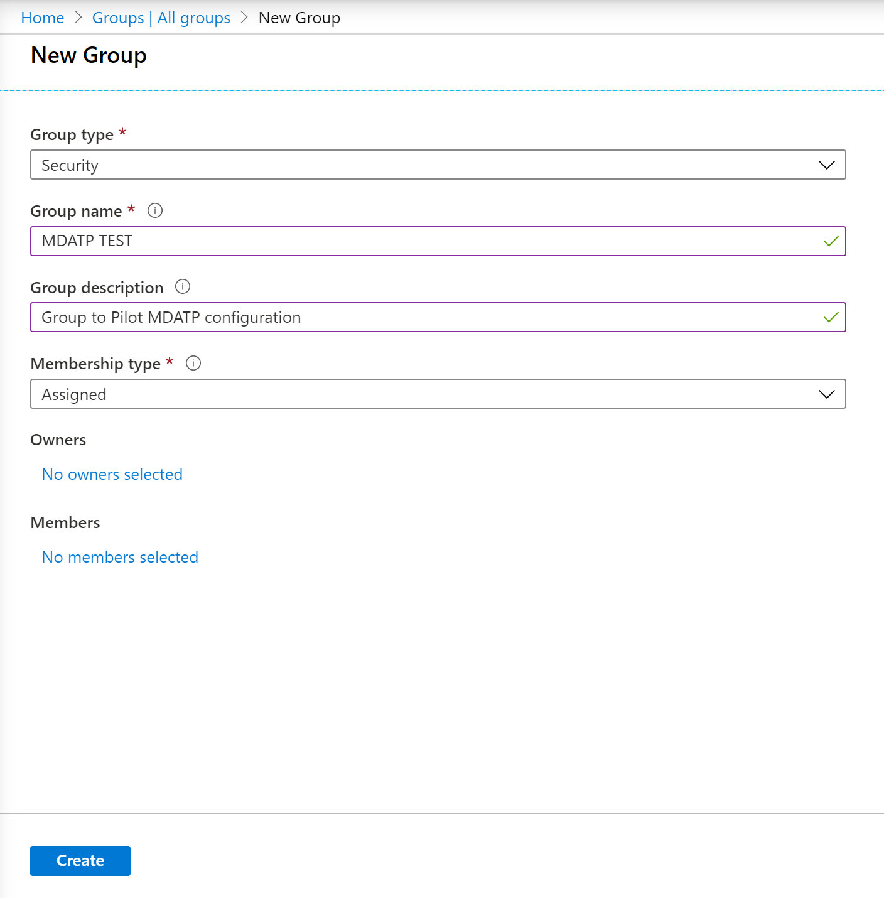
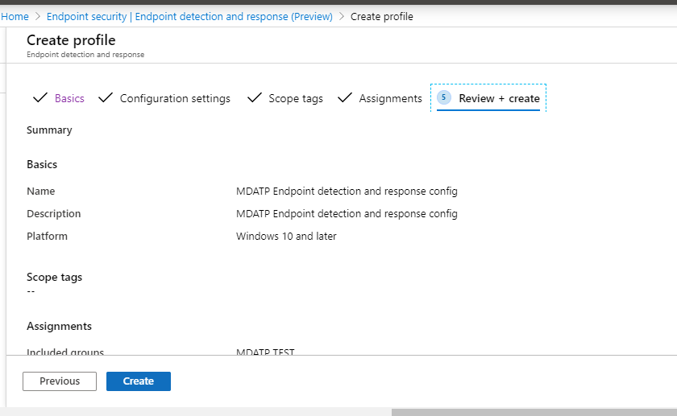
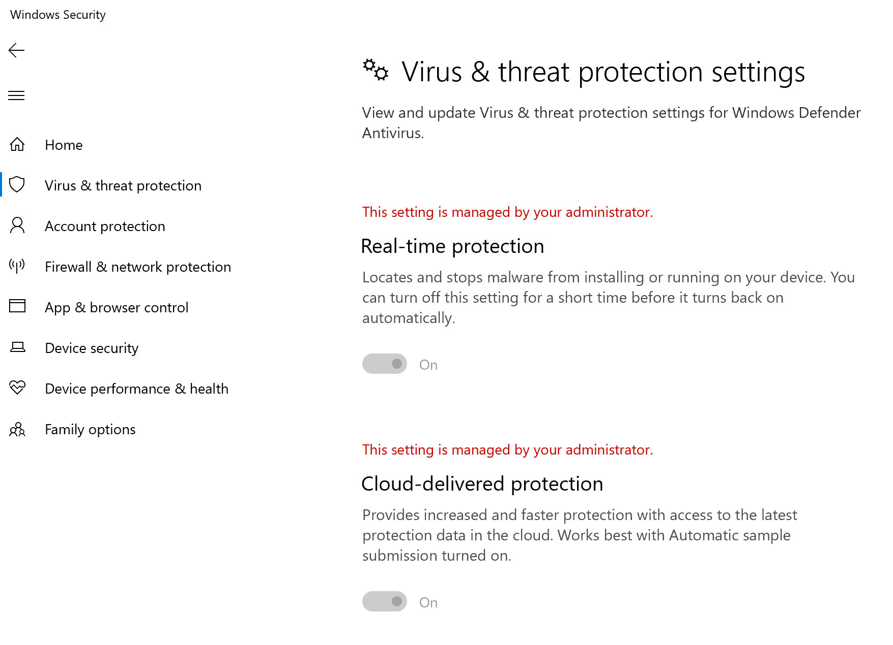
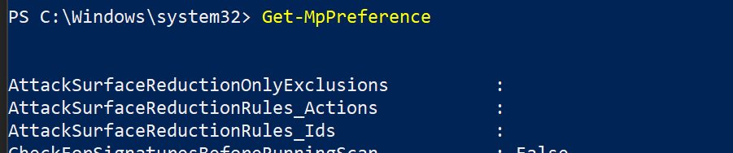

# Microsoft Endpoint Manager를 사용하여 온보딩Onboarding using Microsoft Endpoint Manager

[!INCLUDE [Microsoft 365 Defender rebranding](../../includes/microsoft-defender.md)]

**적용 대상:****Applies to:**
- [엔드포인트용 Microsoft DefenderMicrosoft Defender for Endpoint](https://go.microsoft.com/fwlink/p/?linkid=2154037)
- [Microsoft 365 DefenderMicrosoft 365 Defender](https://go.microsoft.com/fwlink/?linkid=2118804)

> 끝점용 Microsoft Defender를 경험하고 싶나요?Want to experience Microsoft Defender for Endpoint? [무료 평가판에 등록합니다.Sign up for a free trial.](https://www.microsoft.com/microsoft-365/windows/microsoft-defender-atp?ocid=docs-wdatp-exposedapis-abovefoldlink)

이 문서는 배포 가이드의 일부로, 온보더링 방법의 예로 사용할 수 있습니다.This article is part of the Deployment guide and acts as an example onboarding method.

계획 [항목에서는](deployment-strategy.md) 디바이스를 서비스에 온보드하는 여러 가지 방법이 제공되었습니다.In the [Planning](deployment-strategy.md) topic, there were several methods provided to onboard devices to the service. 이 항목에서는 클라우드 네이티브 아키텍처에 대해 다산합니다.This topic covers the cloud-native architecture.

 *환경 아키텍처 다이어그램*
*Diagram of environment architectures*

Endpoint용 Defender는 다양한 끝점 및 도구의 온보딩을 지원하기는 하지만 이 문서에서는 이를 다루지 않습니다.While Defender for Endpoint supports onboarding of various endpoints and tools, this article does not cover them. 지원되는 다른 배포 도구 및 방법을 사용하는 일반적인 온보드에 대한 자세한 내용은 [Onboarding overview 를 참조하세요.](onboarding.md)For information on general onboarding using other supported deployment tools and methods, see [Onboarding overview](onboarding.md).

[Microsoft Endpoint Manager](/mem/endpoint-manager-overview) 여러 서비스를 통합하는 솔루션 플랫폼입니다.[Microsoft Endpoint Manager](/mem/endpoint-manager-overview) is a solution platform that unifies several services. 클라우드 기반 [Microsoft Intune](/mem/intune/fundamentals/what-is-intune) 관리에 대한 자세한 정보도 포함되어 있습니다.It includes [Microsoft Intune](/mem/intune/fundamentals/what-is-intune) for cloud-based device management.

이 항목에서는 사용자에게 다음을 안내합니다.This topic guides users in:

- 1단계: MEM(Microsoft Endpoint Manager)에서 구성을 할당하여 서비스에 장치 온보드Step 1: Onboarding devices to the service by creating a group in Microsoft Endpoint Manager (MEM) to assign configurations on
- 2단계: 추가 기능을 사용하여 끝점에 대한 Defender Microsoft Endpoint ManagerStep 2: Configuring Defender for Endpoint capabilities using Microsoft Endpoint Manager

이 온보더링 지침은 다음 기본 단계를 안내합니다. 이 가이드를 사용할 때 Microsoft Endpoint Manager.This onboarding guidance will walk you through the following basic steps that you need to take when using Microsoft Endpoint Manager:

- [대상 장치 또는 사용자 식별Identifying target devices or users](#identify-target-devices-or-users)
  - Azure Active Directory 그룹 만들기(사용자 또는 장치)Creating an Azure Active Directory group (User or Device)
- [구성 프로필 만들기Creating a Configuration Profile](#step-2-create-configuration-policies-to-configure-microsoft-defender-for-endpoint-capabilities)
  - 이 Microsoft Endpoint Manager 각 기능에 대해 별도의 정책을 만드는 데 대해 안내합니다.In Microsoft Endpoint Manager, we'll guide you in creating a separate policy for each capability.

## 리소스Resources

나머지 프로세스에 필요한 링크는 다음과 같습니다.Here are the links you'll need for the rest of the process:

- [MEM 포털MEM portal](https://aka.ms/memac)
- [보안 센터Security Center](https://securitycenter.windows.com/)
- [Intune 보안 기준Intune Security baselines](/mem/intune/protect/security-baseline-settings-defender-atp#microsoft-defender)

자세한 내용은 Microsoft Endpoint Manager 리소스를 참조하십시오.For more information about Microsoft Endpoint Manager, check out these resources:

- [Microsoft Endpoint Manager 페이지Microsoft Endpoint Manager page](/mem/)
- [Intune 및 ConfigMgr의 수렴에 대한 블로그 게시물Blog post on convergence of Intune and ConfigMgr](https://www.microsoft.com/microsoft-365/blog/2019/11/04/use-the-power-of-cloud-intelligence-to-simplify-and-accelerate-it-and-the-move-to-a-modern-workplace/)
- [MEM의 소개 비디오Introduction video on MEM](https://www.microsoft.com/microsoft-365/blog/2019/11/04/use-the-power-of-cloud-intelligence-to-simplify-and-accelerate-it-and-the-move-to-a-modern-workplace)

## 1단계: MEM에서 구성을 할당할 그룹을 만들어 장치 온보드Step 1: Onboard devices by creating a group in MEM to assign configurations on

### 대상 장치 또는 사용자 식별Identify target devices or users

이 섹션에서는 구성을 할당하는 테스트 그룹을 만들 것입니다.In this section, we will create a test group to assign your configurations on.

> [!NOTE]
> Intune은 Azure Active Directory(Azure AD) 그룹을 사용하여 장치 및 사용자를 관리합니다.Intune uses Azure Active Directory (Azure AD) groups to manage devices and users. Intune 관리자는 조직의 요구 사항에 맞게 그룹을 설정할 수 있습니다.As an Intune admin, you can set up groups to suit your organizational needs.
>
> 자세한 내용은 사용자 및 장치를 구성하는 그룹 [추가를 참조하세요.](/mem/intune/fundamentals/groups-add)For more information, see [Add groups to organize users and devices](/mem/intune/fundamentals/groups-add).

### 그룹 만들기Create a group

1. MEM 포털을 열 수 있습니다.Open the MEM portal.

2. 새 **> 그룹 열기**Open **Groups > New Group**.

    > [!div class="mx-imgBorder"]
    > 

3. 세부 정보를 입력하고 새 그룹을 만들 수 있습니다.Enter details and create a new group.

    > [!div class="mx-imgBorder"]
    > 

4. 테스트 사용자 또는 장치를 추가합니다.Add your test user or device.

5. 모든 그룹 **> 그룹 창에서** 새 그룹을 열 수 있습니다.From the **Groups > All groups** pane, open your new group.

6. 구성원을 **선택하여 > 추가합니다.**Select  **Members > Add members**.

7. 테스트 사용자 또는 장치를 찾아 선택합니다.Find your test user or device and select it.

    > [!div class="mx-imgBorder"]
    > 

8. 이제 테스트 그룹에 테스트할 구성원이 있습니다.Your testing group now has a member to test.

## 2단계: 끝점 기능을 위한 Microsoft Defender를 구성하는 구성 정책 만들기Step 2: Create configuration policies to configure Microsoft Defender for Endpoint capabilities

다음 섹션에서는 다양한 구성 정책을 만들 것입니다.In the following section, you'll create a number of configuration policies.

첫 번째는 끝점용 Defender에 온보딩할 사용자 또는 장치 그룹을 선택하는 구성 정책입니다.First is a configuration policy to select which groups of users or devices will be onboarded to Defender for Endpoint:

- [엔드포인트 검색 및 대응Endpoint detection and response](#endpoint-detection-and-response)

그런 다음 여러 가지 유형의 끝점 보안 정책을 계속 만들게 됩니다.Then you will continue by creating several different types of endpoint security policies:

- [차세대 보호Next-generation protection](#next-generation-protection)
- [공격 표면 감소Attack surface reduction](#attack-surface-reduction--attack-surface-reduction-rules)

### 엔드포인트 감지 및 응답Endpoint detection and response

1. MEM 포털을 열 수 있습니다.Open the MEM portal.

2. 끝점 검색 및 **> 끝점 보안 으로 이동합니다.**Navigate to **Endpoint security > Endpoint detection and response**. 프로필 **만들기를 클릭합니다.**Click on **Create Profile**.

    > [!div class="mx-imgBorder"]
    > 

3. 플랫폼에서 **Windows 10 이상, 프로필 - 끝점** 검색 및 응답 만들기를 > 선택합니다.Under **Platform, select Windows 10 and Later, Profile - Endpoint detection  and response > Create**.

4. 이름과 설명을 입력하고 다음 을 **선택합니다.**Enter a name and description, then select  **Next**.

    > [!div class="mx-imgBorder"]
    > 

5. 필요한 설정을 선택하고 다음 을 **선택합니다.**Select settings as required, then select  **Next**.

    > [!div class="mx-imgBorder"]
    > 

    > [!NOTE]
    > 이 경우 이는 Endpoint용 Defender가 이미 Intune에 통합되어 있는 것으로 자동 채워진 것입니다.In this instance, this has been auto populated as Defender for Endpoint has already been integrated with Intune. 통합에 대한 자세한 내용은 [Intune에서 끝점에 대해 Microsoft Defender 사용 을 참조하세요.](/mem/intune/protect/advanced-threat-protection-configure#to-enable-microsoft-defender-atp)For more information on the integration, see [Enable Microsoft Defender for Endpoint in Intune](/mem/intune/protect/advanced-threat-protection-configure#to-enable-microsoft-defender-atp).
    >
    > 다음 이미지는 끝점용 Microsoft Defender가 Intune과 통합되지 않은 경우 볼 수 있는 예제입니다.The following image is an example of what you'll see when Microsoft Defender for Endpoint is NOT integrated with Intune:
    >
    > 

6. 필요한 경우 범위 태그를 추가하고 다음 을 **선택합니다.**Add scope tags if necessary, then select  **Next**.

    > [!div class="mx-imgBorder"]
    > 

7. 포함할 그룹 선택을  클릭하여 테스트 그룹을 추가하고 그룹을 선택한 후 다음 을 **선택합니다.**Add test group by clicking on **Select groups to include** and choose your group, then select  **Next**.

    > [!div class="mx-imgBorder"]
    > 

8. 검토하고 수락한 다음 만들기를 **선택합니다.**Review and accept, then select  **Create**.

    > [!div class="mx-imgBorder"]
    > 

9. 완료된 정책을 볼 수 있습니다.You can view your completed policy.

    > [!div class="mx-imgBorder"]
    > 

### 차세대 보호Next-generation protection

1. MEM 포털을 열 수 있습니다.Open the MEM portal.

2. 정책 **만들기 에서 끝점**> 바이러스 > 로 이동합니다.Navigate to **Endpoint security > Antivirus > Create Policy**.

    > [!div class="mx-imgBorder"]
    > 

3. 플랫폼 - Windows 10 이상 - Windows 및 프로필 - Microsoft Defender 바이러스 백신 > **만들기를 선택합니다.**Select **Platform - Windows 10 and Later - Windows and Profile – Microsoft  Defender Antivirus > Create**.

4. 이름 및 설명을 입력하고 다음 을 **선택합니다.**Enter name and description, then select  **Next**.

    > [!div class="mx-imgBorder"]
    > 

5. 구성 **설정 페이지에서**: 클라우드 보호, Microsoft Defender 바이러스 백신, Real-Time 보호 및 수정에 필요한 구성을 설정합니다.In the **Configuration settings page**: Set the configurations you require for  Microsoft Defender Antivirus (Cloud Protection, Exclusions, Real-Time  Protection, and Remediation).

    > [!div class="mx-imgBorder"]
    > 

6. 필요한 경우 범위 태그를 추가하고 다음 을 **선택합니다.**Add scope tags if necessary, then select  **Next**.

    > [!div class="mx-imgBorder"]
    > 

7. 포함할 그룹을 선택하고 테스트 그룹에 할당한 후 다음 을 **선택합니다.**Select groups to include, assign to your test group, then select  **Next**.

    > [!div class="mx-imgBorder"]
    > 

8. 검토하고 만든 다음 만들기를 **선택합니다.**Review and create, then select  **Create**.

    > [!div class="mx-imgBorder"]
    > 

9. 만든 구성 정책이 볼 수 있습니다.You'll see the configuration policy you created.

    > [!div class="mx-imgBorder"]
    > 

### 공격 표면 감소 – 공격 표면 감소 규칙Attack Surface Reduction – Attack surface reduction rules

1. MEM 포털을 열 수 있습니다.Open the MEM portal.

2. 끝점 **보안 및 공격 > 축소로 이동합니다.**Navigate to **Endpoint security > Attack surface reduction**.

3. 정책 **만들기 를 선택합니다.**Select  **Create Policy**.

4. 플랫폼 **- Windows 10 이상 – 프로필 - 만들기에서** 공격 표면 > 선택합니다.Select **Platform - Windows 10 and Later – Profile - Attack surface reduction  rules > Create**.

    > [!div class="mx-imgBorder"]
    > 

5. 이름과 설명을 입력하고 다음 을 **선택합니다.**Enter a name and description, then select  **Next**.

    > [!div class="mx-imgBorder"]
    > 

6. 구성 **설정 페이지에서**: 공격 표면 감소 규칙에 필요한 구성을 설정하고 다음 을 **선택합니다.**In the **Configuration settings page**: Set the configurations you require for  Attack surface reduction rules, then select  **Next**.

    > [!NOTE]
    > 모든 공격 표면 감소 규칙을 감사로 구성할 것입니다.We will be configuring all of the Attack surface reduction rules to Audit.
    >
    > 자세한 내용은 공격 표면 [감소 규칙을 참조하세요.](attack-surface-reduction.md)For more information, see [Attack surface reduction rules](attack-surface-reduction.md).

    > [!div class="mx-imgBorder"]
    > 

7. 필요한 경우 범위 태그를 추가하고 다음 을 **선택합니다.**Add Scope Tags as required, then select  **Next**.

    > [!div class="mx-imgBorder"]
    > 

8. 포함할 그룹을 선택하고 테스트 그룹에 할당한 후 다음 을 **선택합니다.**Select groups to include and assign to test group, then select  **Next**.

    > [!div class="mx-imgBorder"]
    > 

9. 세부 정보를 검토한 다음 만들기 를 **선택합니다.**Review the details, then select  **Create**.

    > [!div class="mx-imgBorder"]
    > 

10. 정책을 시청합니다.View the policy.

    > [!div class="mx-imgBorder"]
    > 

### 공격 표면 감소 – 웹 보호Attack Surface Reduction – Web Protection

1. MEM 포털을 열 수 있습니다.Open the MEM portal.

2. 끝점 **보안 및 공격 > 축소로 이동합니다.**Navigate to **Endpoint security > Attack surface reduction**.

3. 정책 **만들기 를 선택합니다.**Select  **Create Policy**.

4. 만들기 Windows 10 이상 – 웹 **보호 > 선택합니다.**Select **Windows 10 and Later – Web protection > Create**.

    > [!div class="mx-imgBorder"]
    > 

5. 이름과 설명을 입력하고 다음 을 **선택합니다.**Enter a name and description, then select  **Next**.

    > [!div class="mx-imgBorder"]
    > 

6. 구성 **설정 페이지:** 웹 보호에 필요한 구성을 설정하고 다음 을 **선택합니다.**In the **Configuration settings page**: Set the configurations you require for Web Protection, then select  **Next**.

    > [!NOTE]
    > 웹 보호를 차단으로 구성하고 있습니다.We are configuring Web Protection to Block.
    >
    > 자세한 내용은 Web [Protection 을 참조하세요.](web-protection-overview.md)For more information, see [Web Protection](web-protection-overview.md).

    > [!div class="mx-imgBorder"]
    > 

7. 다음에 필요한 범위 **> 추가합니다.**Add **Scope Tags as required > Next**.

    > [!div class="mx-imgBorder"]
    > 

8. 다음에서 테스트 그룹에 **할당을 > 선택합니다.**Select **Assign to test group > Next**.

    > [!div class="mx-imgBorder"]
    > 

9. 검토 **및 만들기를 > 를 선택합니다.**Select **Review and Create > Create**.

    > [!div class="mx-imgBorder"]
    > 

10. 정책을 시청합니다.View the policy.

    > [!div class="mx-imgBorder"]
    > 

## 구성 설정 유효성 검사Validate configuration settings

### 정책이 적용된지 확인Confirm Policies have been applied

구성 정책이 할당된 후 적용하는 데 시간이 다소 걸릴 수 있습니다.Once the Configuration policy has been assigned, it will take some time to apply.

타이밍에 대한 자세한 내용은 [Intune 구성 정보를 참조하세요.](/mem/intune/configuration/device-profile-troubleshoot#how-long-does-it-take-for-devices-to-get-a-policy-profile-or-app-after-they-are-assigned)For information on timing, see [Intune configuration information](/mem/intune/configuration/device-profile-troubleshoot#how-long-does-it-take-for-devices-to-get-a-policy-profile-or-app-after-they-are-assigned).

구성 정책이 테스트 장치에 적용되어 있는지 확인하려면 각 구성 정책에 대해 다음 프로세스를 따르하세요.To confirm that the configuration policy has been applied to your test device, follow the following process for each configuration policy.

1. MEM 포털을 열고 위의 단계에 표시된 대로 관련 정책으로 이동합니다.Open the MEM portal and navigate to the relevant policy as shown in the steps above. 다음 예에서는 차세대 보호 설정을 보여줍니다.The following example shows the next generation protection settings.

    > [!div class="mx-imgBorder"]
    > [ Microsoft Endpoint Manager 이미지](images/43ab6aa74471ee2977e154a4a5ef2d39.png#lightbox)

2. 정책 **상태를 확인하려면** 구성 정책을 선택합니다.Select  the **Configuration Policy** to view the policy status.

    > [!div class="mx-imgBorder"]
    > [ Microsoft Endpoint Manager 이미지](images/55ecaca0e4a022f0e29d45aeed724e6c.png#lightbox)

3. 장치  **상태를 선택하여** 상태를 확인합니다.Select  **Device Status** to see the status.

    > [!div class="mx-imgBorder"]
    > [ Microsoft Endpoint Manager 이미지](images/18a50df62cc38749000dbfb48e9a4c9b.png#lightbox)

4. 상태를  **확인하려면** 사용자 상태를 선택합니다.Select  **User Status** to see the status.

    > [!div class="mx-imgBorder"]
    > [ Microsoft Endpoint Manager 이미지](images/4e965749ff71178af8873bc91f9fe525.png#lightbox)

5. 상태를  **확인하려면** 설정당 상태를 선택합니다.Select  **Per-setting status** to see the status.

    > [!TIP]
    > 이 보기는 다른 정책과 충돌하는 설정을 식별하는 데 매우 유용합니다.This view is very useful to identify any settings that conflict with another policy.

    > [!div class="mx-imgBorder"]
    > 

### 엔드포인트 감지 및 응답Endpoint detection and response

1. 구성을 적용하기 전에 Endpoint Protection용 Defender 서비스를 시작하지 말아야 합니다.Before applying the configuration, the Defender for Endpoint  Protection service should not be started.

    > [!div class="mx-imgBorder"]
    > 

2. 구성이 적용된 후 Endpoint Protection Service용 Defender를 시작해야 합니다.After the configuration has been applied, the Defender for Endpoint  Protection Service should be started.

    > [!div class="mx-imgBorder"]
    > 

3. 장치에서 서비스가 실행되고 나면 장치가 Microsoft Defender 보안 센터에 표시됩니다.After the services are running on the device, the device appears in Microsoft  Defender Security Center.

    > [!div class="mx-imgBorder"]
    > 

### 차세대 보호Next-generation protection

1. 테스트 장치에 정책을 적용하기 전에 아래 표시된 설정을 수동으로 관리할 수 있습니다.Before applying the policy on a test device, you should be able to manually  manage the settings as shown below.

    > [!div class="mx-imgBorder"]
    > 

2. 정책이 적용된 후 설정을 수동으로 관리할 수 없습니다.After the policy has been applied, you should not be able to manually manage  the settings.

    > [!NOTE]
    > 다음 이미지에서 **클라우드 제공** 보호 켜기 및 실시간 보호 켜기가 관리되는 것으로 표시됩니다. In the following image **Turn on cloud-delivered protection** and **Turn on real-time protection** are being shown as managed.

    > [!div class="mx-imgBorder"]
    > 

### 공격 표면 감소 – 공격 표면 감소 규칙Attack Surface Reduction – Attack surface reduction rules

1. 테스트 장치에 정책을 적용하기 전에 PowerShell 창을 펜으로 처리하고 를 `Get-MpPreference` 입력합니다.Before applying the policy on a test device, pen a PowerShell Window and type `Get-MpPreference`.

2. 콘텐츠가 없는 다음 줄로 응답해야 합니다.This should respond with the following lines with no content:

    > AttackSurfaceReductionOnlyExclusions:AttackSurfaceReductionOnlyExclusions:
    >
    > AttackSurfaceReductionRules_Actions:AttackSurfaceReductionRules_Actions:
    >
    > AttackSurfaceReductionRules_Ids:AttackSurfaceReductionRules_Ids:

    

3. 테스트 장치에 정책을 적용한 후 PowerShell Windows 를 `Get-MpPreference` 입력합니다.After applying the policy on a test device, open a PowerShell Windows and type `Get-MpPreference`.

4. 아래와 같이 콘텐츠가 있는 다음 줄로 응답해야 합니다.This should respond with the following lines with content as shown below:

    

### 공격 표면 감소 – 웹 보호Attack Surface Reduction – Web Protection

1. 테스트 장치에서 PowerShell 을 열고 Windows `(Get-MpPreference).EnableNetworkProtection` 를 입력합니다.On the test device, open a PowerShell Windows and type  `(Get-MpPreference).EnableNetworkProtection`.

2. 아래와 같이 0으로 응답해야 합니다.This should respond with a 0 as shown below.

    

3. 정책을 적용한 후 PowerShell Windows 를 `(Get-MpPreference).EnableNetworkProtection` 입력합니다.After applying the policy, open a PowerShell Windows and type  `(Get-MpPreference).EnableNetworkProtection`.

4. 아래와 같이 1로 응답해야 합니다.This should respond with a 1 as shown below.

    
