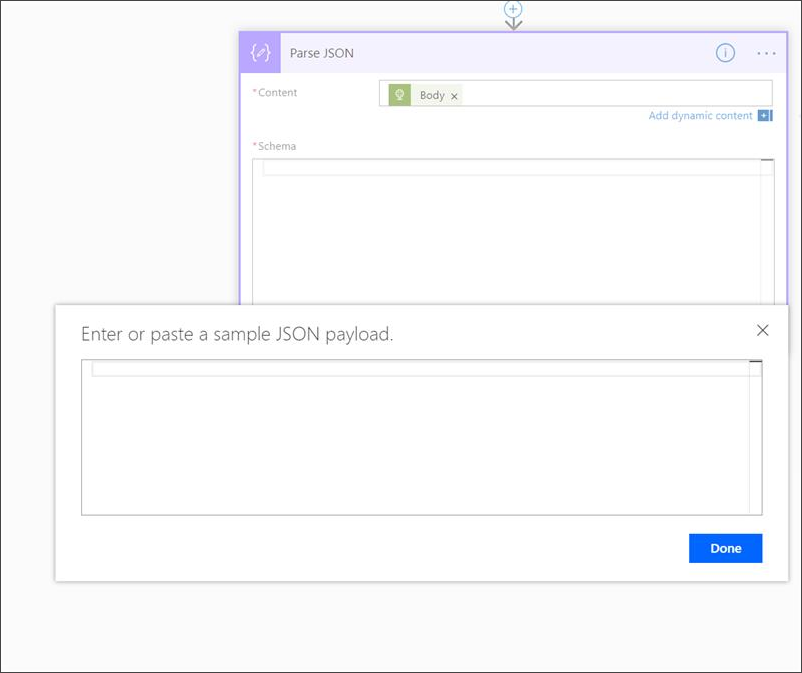
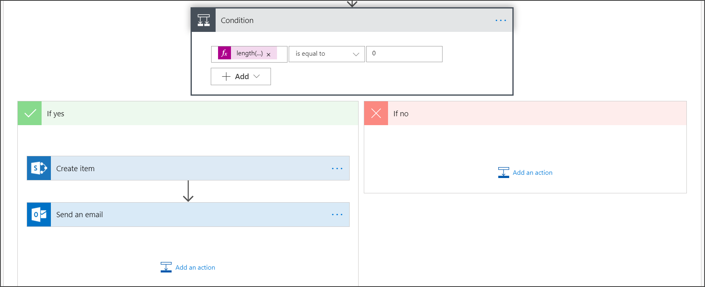

# <a name="create-a-notification-rule-when-a-local-onboarding-or-offboarding-script-is-used"></a><span data-ttu-id="fbeb9-104">로컬 온보딩 또는 등록 해제 스크립트를 사용하는 경우 알림 규칙 만들기</span><span class="sxs-lookup"><span data-stu-id="fbeb9-104">Create a notification rule when a local onboarding or offboarding script is used</span></span>

[!INCLUDE [Microsoft 365 Defender rebranding](../../includes/microsoft-defender.md)]


<span data-ttu-id="fbeb9-105">**적용 대상:**</span><span class="sxs-lookup"><span data-stu-id="fbeb9-105">**Applies to:**</span></span>
- [<span data-ttu-id="fbeb9-106">엔드포인트용 Microsoft Defender</span><span class="sxs-lookup"><span data-stu-id="fbeb9-106">Microsoft Defender for Endpoint</span></span>](https://go.microsoft.com/fwlink/p/?linkid=2154037)
- [<span data-ttu-id="fbeb9-107">Microsoft 365 Defender</span><span class="sxs-lookup"><span data-stu-id="fbeb9-107">Microsoft 365 Defender</span></span>](https://go.microsoft.com/fwlink/?linkid=2118804)


> <span data-ttu-id="fbeb9-108">끝점용 Microsoft Defender를 경험하고 싶나요?</span><span class="sxs-lookup"><span data-stu-id="fbeb9-108">Want to experience Microsoft Defender for Endpoint?</span></span> [<span data-ttu-id="fbeb9-109">무료 평가판에 등록합니다.</span><span class="sxs-lookup"><span data-stu-id="fbeb9-109">Sign up for a free trial.</span></span>](https://www.microsoft.com/microsoft-365/windows/microsoft-defender-atp?ocid=docs-wdatp-exposedapis-abovefoldlink)

[!include[Microsoft Defender for Endpoint API URIs for US Government](../../includes/microsoft-defender-api-usgov.md)]

[!include[Improve request performance](../../includes/improve-request-performance.md)]


<span data-ttu-id="fbeb9-110">로컬 온보딩 또는 등록 해제 스크립트를 사용할 때 알림을 하게 하는 알림 규칙을 생성합니다.</span><span class="sxs-lookup"><span data-stu-id="fbeb9-110">Create a notification rule so that when a local onboarding or offboarding script is used, you'll be notified.</span></span> 

## <a name="before-you-begin"></a><span data-ttu-id="fbeb9-111">시작하기 전에</span><span class="sxs-lookup"><span data-stu-id="fbeb9-111">Before you begin</span></span>
<span data-ttu-id="fbeb9-112">다음에 대한 액세스 권한이 필요합니다.</span><span class="sxs-lookup"><span data-stu-id="fbeb9-112">You'll need to have access to:</span></span>
 - <span data-ttu-id="fbeb9-113">Microsoft Flow(최소한 흐름 계획 1)</span><span class="sxs-lookup"><span data-stu-id="fbeb9-113">Microsoft Flow (Flow Plan 1 at a minimum).</span></span> <span data-ttu-id="fbeb9-114">자세한 내용은 흐름 가격 [페이지를 참조하세요.](https://flow.microsoft.com/pricing/)</span><span class="sxs-lookup"><span data-stu-id="fbeb9-114">For more information, see [Flow pricing page](https://flow.microsoft.com/pricing/).</span></span>
 - <span data-ttu-id="fbeb9-115">Azure 테이블 또는 SharePoint 목록 또는 라이브러리/SQL DB</span><span class="sxs-lookup"><span data-stu-id="fbeb9-115">Azure Table or SharePoint List or Library / SQL DB</span></span>

## <a name="create-the-notification-flow"></a><span data-ttu-id="fbeb9-116">알림 흐름 만들기</span><span class="sxs-lookup"><span data-stu-id="fbeb9-116">Create the notification flow</span></span>

1. <span data-ttu-id="fbeb9-117">에서 [flow.microsoft.com.](https://flow.microsoft.com/)</span><span class="sxs-lookup"><span data-stu-id="fbeb9-117">In [flow.microsoft.com](https://flow.microsoft.com/).</span></span>

2. <span data-ttu-id="fbeb9-118">내 흐름 > 새 > **- 비어 있는 에서 로 이동합니다.**</span><span class="sxs-lookup"><span data-stu-id="fbeb9-118">Navigate to **My flows > New > Scheduled - from blank**.</span></span> 

    


3. <span data-ttu-id="fbeb9-120">예약된 흐름을 작성합니다.</span><span class="sxs-lookup"><span data-stu-id="fbeb9-120">Build a scheduled flow.</span></span>
   1. <span data-ttu-id="fbeb9-121">흐름 이름을 입력합니다.</span><span class="sxs-lookup"><span data-stu-id="fbeb9-121">Enter a flow name.</span></span>
   2. <span data-ttu-id="fbeb9-122">시작 및 시간을 지정합니다.</span><span class="sxs-lookup"><span data-stu-id="fbeb9-122">Specify the start and time.</span></span>
   3. <span data-ttu-id="fbeb9-123">빈도를 지정합니다.</span><span class="sxs-lookup"><span data-stu-id="fbeb9-123">Specify the frequency.</span></span> <span data-ttu-id="fbeb9-124">예를 들어 5분마다.</span><span class="sxs-lookup"><span data-stu-id="fbeb9-124">For example, every 5 minutes.</span></span>

    

4. <span data-ttu-id="fbeb9-126">+ 단추를 선택하여 새 작업을 추가합니다.</span><span class="sxs-lookup"><span data-stu-id="fbeb9-126">Select the + button to add a new action.</span></span> <span data-ttu-id="fbeb9-127">새 작업은 끝점 보안 센터 장치용 Defender API에 대한 HTTP 요청입니다.</span><span class="sxs-lookup"><span data-stu-id="fbeb9-127">The new action will be an HTTP request to the Defender for Endpoint security center device(s) API.</span></span> <span data-ttu-id="fbeb9-128">"WDATP 커넥터"(작업: "컴퓨터 - 컴퓨터 목록 확인")로 바꿀 수도 있습니다.</span><span class="sxs-lookup"><span data-stu-id="fbeb9-128">You can also replace it with the out-of-the-box "WDATP Connector" (action: "Machines - Get list of machines").</span></span> 

    


5. <span data-ttu-id="fbeb9-130">다음 HTTP 필드를 입력합니다.</span><span class="sxs-lookup"><span data-stu-id="fbeb9-130">Enter the following HTTP fields:</span></span>

   - <span data-ttu-id="fbeb9-131">메서드: 디바이스 목록을 얻을 수 있는 값으로 "GET"입니다.</span><span class="sxs-lookup"><span data-stu-id="fbeb9-131">Method: "GET" as a value to get the list of devices.</span></span>
   - <span data-ttu-id="fbeb9-132">URI: 를 `https://api.securitycenter.microsoft.com/api/machines` 입력합니다.</span><span class="sxs-lookup"><span data-stu-id="fbeb9-132">URI: Enter `https://api.securitycenter.microsoft.com/api/machines`.</span></span>
   - <span data-ttu-id="fbeb9-133">인증: "Active Directory OAuth"를 선택합니다.</span><span class="sxs-lookup"><span data-stu-id="fbeb9-133">Authentication: Select "Active Directory OAuth".</span></span>
   - <span data-ttu-id="fbeb9-134">테넌트: Azure Active Directory에 로그인하여 앱 등록을 > 테넌트 ID 값을 https://portal.azure.com 얻습니다. </span><span class="sxs-lookup"><span data-stu-id="fbeb9-134">Tenant: Sign-in to https://portal.azure.com and navigate to **Azure Active Directory > App Registrations** and get the Tenant ID value.</span></span>
   - <span data-ttu-id="fbeb9-135">대상: `https://securitycenter.onmicrosoft.com/windowsatpservice\`</span><span class="sxs-lookup"><span data-stu-id="fbeb9-135">Audience: `https://securitycenter.onmicrosoft.com/windowsatpservice\`</span></span>
   - <span data-ttu-id="fbeb9-136">클라이언트 ID: Azure Active Directory에 로그인하여 앱 등록을 > 클라이언트 https://portal.azure.com ID 값을  얻습니다.</span><span class="sxs-lookup"><span data-stu-id="fbeb9-136">Client ID: Sign-in to https://portal.azure.com and navigate to **Azure Active Directory > App Registrations** and  get the Client ID value.</span></span>
   - <span data-ttu-id="fbeb9-137">자격 증명 유형: "비밀"을 선택합니다.</span><span class="sxs-lookup"><span data-stu-id="fbeb9-137">Credential Type: Select "Secret".</span></span>
   - <span data-ttu-id="fbeb9-138">비밀: https://portal.azure.com Azure Active **Directory에** 로그인하여 앱 등록을 > 테넌트 ID 값을 얻습니다.</span><span class="sxs-lookup"><span data-stu-id="fbeb9-138">Secret: Sign-in to https://portal.azure.com and navigate to **Azure Active Directory > App Registrations** and get the Tenant ID value.</span></span>

    


6. <span data-ttu-id="fbeb9-140">새 작업 추가를  선택한 다음 데이터  작업을 검색하고 JSON 구문 분석 을 선택하여 새 **단계를 추가합니다.**</span><span class="sxs-lookup"><span data-stu-id="fbeb9-140">Add a new step by selecting **Add new action** then search for **Data Operations** and select **Parse JSON**.</span></span>

    

7. <span data-ttu-id="fbeb9-142">콘텐츠 필드에 **본문을 추가합니다.**</span><span class="sxs-lookup"><span data-stu-id="fbeb9-142">Add Body in the **Content** field.</span></span>

    

8. <span data-ttu-id="fbeb9-144">예제 **페이로드를 사용하여 Schema 링크를 생성합니다.를** 선택합니다.</span><span class="sxs-lookup"><span data-stu-id="fbeb9-144">Select the **Use sample payload to generate schema** link.</span></span>

    

9. <span data-ttu-id="fbeb9-146">다음 JSON 코드의 복사 및 붙여넣기:</span><span class="sxs-lookup"><span data-stu-id="fbeb9-146">Copy and paste the following JSON snippet:</span></span>

    ```
    {
        "type": "object",
        "properties": {
            "@@odata.context": {
                "type": "string"
            },
            "value": {
                "type": "array",
                "items": {
                    "type": "object",
                    "properties": {
                        "id": {
                            "type": "string"
                        },
                        "computerDnsName": {
                            "type": "string"
                        },
                        "firstSeen": {
                            "type": "string"
                        },
                        "lastSeen": {
                            "type": "string"
                        },
                        "osPlatform": {
                            "type": "string"
                        },
                        "osVersion": {},
                        "lastIpAddress": {
                            "type": "string"
                        },
                        "lastExternalIpAddress": {
                            "type": "string"
                        },
                        "agentVersion": {
                            "type": "string"
                        },
                        "osBuild": {
                            "type": "integer"
                        },
                        "healthStatus": {
                            "type": "string"
                        },
                        "riskScore": {
                            "type": "string"
                        },
                        "exposureScore": {
                            "type": "string"
                        },
                        "aadDeviceId": {},
                        "machineTags": {
                            "type": "array"
                        }
                    },
                    "required": [
                        "id",
                        "computerDnsName",
                        "firstSeen",
                        "lastSeen",
                        "osPlatform",
                        "osVersion",
                        "lastIpAddress",
                        "lastExternalIpAddress",
                        "agentVersion",
                        "osBuild",
                        "healthStatus",
                        "rbacGroupId",
                        "rbacGroupName",
                        "riskScore",
                        "exposureScore",
                        "aadDeviceId",
                        "machineTags"
                    ]
                }
            }
        }
    }

    ```

10.  <span data-ttu-id="fbeb9-147">JSON 호출에서 값을 추출하고 등록된 장치가 SharePoint 목록에 이미 등록되어 있는지 확인합니다. 예를 들면 다음과 같습니다.</span><span class="sxs-lookup"><span data-stu-id="fbeb9-147">Extract the values from the JSON call and check if the onboarded device(s) is / are already registered at the SharePoint list as an example:</span></span>
- <span data-ttu-id="fbeb9-148">예인 경우 알림이 트리거되지 않습니다.</span><span class="sxs-lookup"><span data-stu-id="fbeb9-148">If yes, no notification will be triggered</span></span>
- <span data-ttu-id="fbeb9-149">아니요인 경우 SharePoint 목록에 새 등록된 장치를 등록하고 끝점용 Defender 관리자에게 알림이 전송됩니다.</span><span class="sxs-lookup"><span data-stu-id="fbeb9-149">If no, will register the new onboarded device(s) in the SharePoint list and a notification will be sent to the Defender for Endpoint admin</span></span>

    

    

11. <span data-ttu-id="fbeb9-152">조건 **아래에서**"length(body('Get_items')?[' 식을 추가합니다. value'])"를 설정하고 조건을 0으로 설정합니다.</span><span class="sxs-lookup"><span data-stu-id="fbeb9-152">Under **Condition**, add the following expression: "length(body('Get_items')?['value'])" and set the condition to equal to 0.</span></span>

    <span data-ttu-id="fbeb9-153"></span><span class="sxs-lookup"><span data-stu-id="fbeb9-153"></span></span>  
    <span data-ttu-id="fbeb9-154"> 
     </span><span class="sxs-lookup"><span data-stu-id="fbeb9-154"> 
    </span></span>  
<span data-ttu-id="fbeb9-155"></span><span class="sxs-lookup"><span data-stu-id="fbeb9-155"></span></span>

## <a name="alert-notification"></a><span data-ttu-id="fbeb9-156">경고 알림</span><span class="sxs-lookup"><span data-stu-id="fbeb9-156">Alert notification</span></span>
<span data-ttu-id="fbeb9-157">다음 이미지는 전자 메일 알림의 예입니다.</span><span class="sxs-lookup"><span data-stu-id="fbeb9-157">The following image is an example of an email notification.</span></span>


## <a name="tips"></a><span data-ttu-id="fbeb9-159">팁</span><span class="sxs-lookup"><span data-stu-id="fbeb9-159">Tips</span></span>

- <span data-ttu-id="fbeb9-160">lastSeen만 사용하여 여기에서 필터링할 수 있습니다.</span><span class="sxs-lookup"><span data-stu-id="fbeb9-160">You can filter here using lastSeen only:</span></span>
    - <span data-ttu-id="fbeb9-161">60분마다:</span><span class="sxs-lookup"><span data-stu-id="fbeb9-161">Every 60 min:</span></span>
      - <span data-ttu-id="fbeb9-162">지난 7일 동안의 모든 장치를 마지막으로 봤습니다.</span><span class="sxs-lookup"><span data-stu-id="fbeb9-162">Take all devices last seen in the past 7 days.</span></span> 

- <span data-ttu-id="fbeb9-163">각 디바이스에 대해:</span><span class="sxs-lookup"><span data-stu-id="fbeb9-163">For each device:</span></span> 
    - <span data-ttu-id="fbeb9-164">마지막으로 본 속성이 [-7일, -7일 + 60분] -> 간격에 있는 경우 등록 해제 경고입니다.</span><span class="sxs-lookup"><span data-stu-id="fbeb9-164">If last seen property is on the one hour interval of [-7 days, -7days + 60 minutes ] -> Alert for offboarding possibility.</span></span>
    - <span data-ttu-id="fbeb9-165">처음 봤을 경우 지난 시간 -> 경고입니다.</span><span class="sxs-lookup"><span data-stu-id="fbeb9-165">If first seen is on the past hour -> Alert for onboarding.</span></span>

<span data-ttu-id="fbeb9-166">이 솔루션에서는 중복된 알림이 없습니다. 많은 장치가 있는 테넌트가 있습니다.</span><span class="sxs-lookup"><span data-stu-id="fbeb9-166">In this solution you will not have duplicate alerts: There are tenants that have numerous devices.</span></span> <span data-ttu-id="fbeb9-167">이러한 장치를 모두 사용하려면 비용이 많이 들고 포징이 필요할 수 있습니다.</span><span class="sxs-lookup"><span data-stu-id="fbeb9-167">Getting all those devices might be very expensive and might require paging.</span></span>

<span data-ttu-id="fbeb9-168">쿼리를 두 개의 쿼리로 분할할 수 있습니다.</span><span class="sxs-lookup"><span data-stu-id="fbeb9-168">You can split it to two queries:</span></span> 
1.  <span data-ttu-id="fbeb9-169">등록 해제의 경우 OData 365를 사용하여 이 $filter 조건이 충족되는지만 알릴 수 있습니다.</span><span class="sxs-lookup"><span data-stu-id="fbeb9-169">For offboarding take only this interval using the OData $filter and only notify if the conditions are met.</span></span>
2.  <span data-ttu-id="fbeb9-170">지난 한 시간 동안의 모든 디바이스를 마지막으로 확인한 후 처음 본 속성을 검사합니다(처음 본 속성이 지난 시간인 경우 마지막으로 본 속성도 있어야 합니다).</span><span class="sxs-lookup"><span data-stu-id="fbeb9-170">Take all devices last seen in the past hour and check first seen property for them (if the first seen property is on the past hour, the last seen must be there too).</span></span> 

