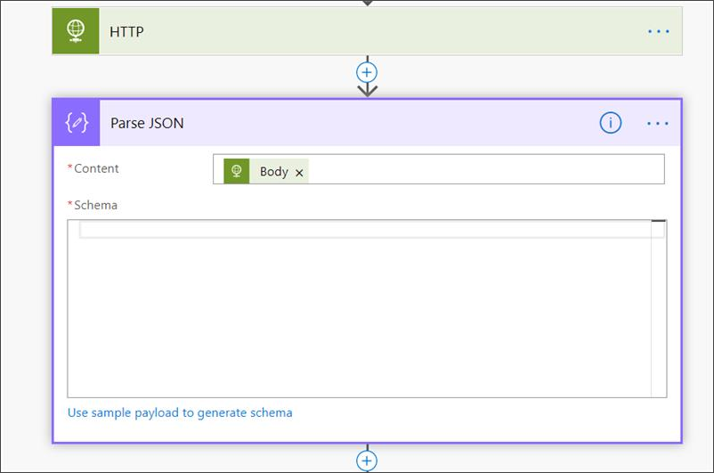
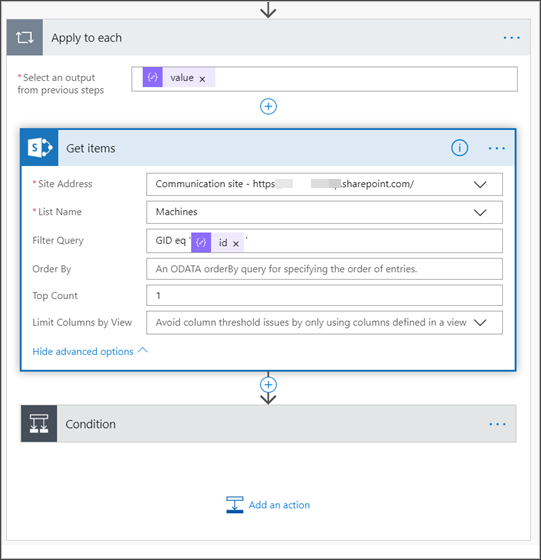

# <a name="create-a-notification-rule-when-a-local-onboarding-or-offboarding-script-is-used"></a>로컬 온보딩 또는 등록 해제 스크립트를 사용하는 경우 알림 규칙 만들기

[!INCLUDE [Microsoft 365 Defender rebranding](../../includes/microsoft-defender.md)]


**적용 대상:**
- [엔드포인트용 Microsoft Defender](https://go.microsoft.com/fwlink/p/?linkid=2154037)
- [Microsoft 365 Defender](https://go.microsoft.com/fwlink/?linkid=2118804)

> 엔드포인트용 Microsoft Defender를 경험하고 싶으신가요? [무료 평가판을 신청하세요.](https://signup.microsoft.com/create-account/signup?products=7f379fee-c4f9-4278-b0a1-e4c8c2fcdf7e&ru=https://aka.ms/MDEp2OpenTrial?ocid=docs-wdatp-exposedapis-abovefoldlink)

[!include[Microsoft Defender for Endpoint API URIs for US Government](../../includes/microsoft-defender-api-usgov.md)]

[!include[Improve request performance](../../includes/improve-request-performance.md)]


로컬 온보딩 또는 등록 해제 스크립트를 사용할 때 알림을 하게 하는 알림 규칙을 생성합니다.

## <a name="before-you-begin"></a>시작하기 전에

다음에 대한 액세스 권한이 필요합니다.

- Power Automate(사용자당 요금제 이상). 자세한 내용은 가격 Power Automate [페이지를 참조하세요.](https://flow.microsoft.com/pricing/)
- Azure 테이블 또는 SharePoint 또는 라이브러리/SQL DB입니다.

## <a name="create-the-notification-flow"></a>알림 흐름 만들기

1. 에서 [flow.microsoft.com.](https://flow.microsoft.com/)

2. 내 흐름 > 새 > **- 비어 있는 에서 로 이동합니다.**

    

3. 예약된 흐름을 작성합니다.
   1. 흐름 이름을 입력합니다.
   2. 시작 및 시간을 지정합니다.
   3. 빈도를 지정합니다. 예를 들어 5분마다.

    

4. + 단추를 선택하여 새 작업을 추가합니다. 새 작업은 끝점 보안 센터 장치용 Defender API에 대한 HTTP 요청입니다. "WDATP 커넥터&quot;(작업: &quot;컴퓨터 - 컴퓨터 목록 확인")로 바꿀 수도 있습니다.

    

5. 다음 HTTP 필드를 입력합니다.

   - 메서드: 디바이스 목록을 얻을 수 있는 값으로 "GET"입니다.
   - URI: 를 `https://api.securitycenter.microsoft.com/api/machines` 입력합니다.
   - 인증: "Active Directory OAuth"를 선택합니다.
   - 테넌트: 앱 등록에 로그인하고 Azure Active Directory > 테넌트 ID 값을 https://portal.azure.com 얻습니다. 
   - 대상: `https://securitycenter.onmicrosoft.com/windowsatpservice\`
   - 클라이언트 ID: 로그인하여 Azure Active Directory > 앱 등록으로 이동하고 https://portal.azure.com 클라이언트 ID 값을 얻습니다. 
   - 자격 증명 유형: "비밀"을 선택합니다.
   - 비밀: 로그인하여 앱 등록을 Azure Active Directory > 테넌트 https://portal.azure.com ID 값을  얻습니다.

    

6. 새 작업 추가를  선택한 다음 데이터  작업을 검색하고 JSON 구문 분석 을 선택하여 새 **단계를 추가합니다.**

    

7. 콘텐츠 필드에 **본문을 추가합니다.**

    

8. 예제 **페이로드를 사용하여 Schema 링크를 생성합니다.를** 선택합니다.

    

9. 다음 JSON 코드의 복사 및 붙여넣기:

    ```json
    {
        "type": "object",
        "properties": {
            "@@odata.context": {
                "type": "string"
            },
            "value": {
                "type": "array",
                "items": {
                    "type": "object",
                    "properties": {
                        "id": {
                            "type": "string"
                        },
                        "computerDnsName": {
                            "type": "string"
                        },
                        "firstSeen": {
                            "type": "string"
                        },
                        "lastSeen": {
                            "type": "string"
                        },
                        "osPlatform": {
                            "type": "string"
                        },
                        "osVersion": {},
                        "lastIpAddress": {
                            "type": "string"
                        },
                        "lastExternalIpAddress": {
                            "type": "string"
                        },
                        "agentVersion": {
                            "type": "string"
                        },
                        "osBuild": {
                            "type": "integer"
                        },
                        "healthStatus": {
                            "type": "string"
                        },
                        "riskScore": {
                            "type": "string"
                        },
                        "exposureScore": {
                            "type": "string"
                        },
                        "aadDeviceId": {},
                        "machineTags": {
                            "type": "array"
                        }
                    },
                    "required": [
                        "id",
                        "computerDnsName",
                        "firstSeen",
                        "lastSeen",
                        "osPlatform",
                        "osVersion",
                        "lastIpAddress",
                        "lastExternalIpAddress",
                        "agentVersion",
                        "osBuild",
                        "healthStatus",
                        "rbacGroupId",
                        "rbacGroupName",
                        "riskScore",
                        "exposureScore",
                        "aadDeviceId",
                        "machineTags"
                    ]
                }
            }
        }
    }

    ```

10. JSON 호출에서 값을 추출하고 등록된 장치가 이미 SharePoint 등록되어 있는지 확인합니다.

    - 예인 경우 알림이 트리거되지 않습니다.
    - 아니요인 경우 새 등록된 장치를 SharePoint 등록하고 끝점용 Defender 관리자에게 알림이 전송됩니다.

    

    

11. 조건 **아래에서**"length(body('Get_items')?[' 식을 추가합니다. value'])"를 설정하고 조건을 0으로 설정합니다.

    
     
     
     

## <a name="alert-notification"></a>경고 알림

다음 이미지는 전자 메일 알림의 예입니다.


## <a name="tips"></a>팁

- lastSeen만 사용하여 여기에서 필터링할 수 있습니다.
  - 60분마다:
    - 지난 7일 동안의 모든 장치를 마지막으로 봤습니다.

- 각 디바이스에 대해:
  - 마지막으로 본 속성이 [-7일, -7일 + 60분] -> 간격에 있는 경우 등록 해제 경고입니다.
  - 처음 봤을 경우 지난 시간 -> 경고입니다.

이 솔루션에서는 중복된 알림이 없습니다. 많은 장치가 있는 테넌트가 있습니다. 이러한 장치를 모두 사용하려면 비용이 많이 들고 포징이 필요할 수 있습니다.

쿼리를 두 개의 쿼리로 분할할 수 있습니다.

1. 등록 해제의 경우 OData 365를 사용하여 이 $filter 조건이 충족되는지만 알릴 수 있습니다.
2. 지난 한 시간 동안의 모든 디바이스를 마지막으로 확인한 후 처음 본 속성을 검사합니다(처음 본 속성이 지난 시간인 경우 마지막으로 본 속성도 있어야 합니다).
