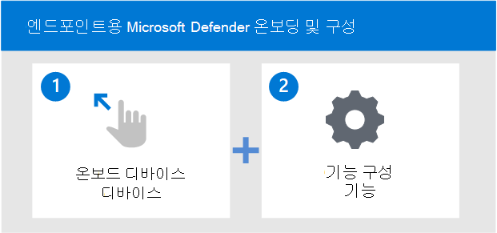

# 엔드포인트용 Microsoft Defender 서비스에 온보딩

[!INCLUDE [Microsoft 365 Defender rebranding](../../includes/microsoft-defender.md)]

**적용 대상:**
- [엔드포인트용 Microsoft Defender](https://go.microsoft.com/fwlink/p/?linkid=2154037)
- [Microsoft 365 Defender](https://go.microsoft.com/fwlink/?linkid=2118804)

> 엔드포인트용 Microsoft Defender를 경험하고 싶으신가요? [무료 평가판을 신청하세요.](https://signup.microsoft.com/create-account/signup?products=7f379fee-c4f9-4278-b0a1-e4c8c2fcdf7e&ru=https://aka.ms/MDEp2OpenTrial?ocid=docs-wdatp-exposedapis-abovefoldlink)

끝점용 Microsoft Defender 배포의 다양한 단계와 솔루션 내에서 기능을 구성하는 방법에 대해 자세히 알아보십시오.

끝점용 Defender를 배포하는 데 필요한 단계는 다음 단계입니다.

- 1단계: 서비스에 끝점 온보드
- 2단계: 기능 구성

## 1단계: 지원되는 관리 도구를 사용하여 끝점 온보드

배포 [계획 항목에서는](deployment-strategy.md) 끝점용 Defender를 배포하는 데 필요한 일반적인 단계를 간략하게 설명합니다.

이 비디오를 시청하여 온보더링 프로세스에 대한 간략한 개요를 알아보고 사용 가능한 도구 및 방법에 대해 자세히 알아보습니다.

> [!VIDEO https://www.microsoft.com/videoplayer/embed/RE4bGqr]

아키텍처를 식별한 후 사용할 배포 방법을 결정해야 합니다. 선택한 배포 도구는 끝점을 서비스에 온보드하는 방법에 영향을 미치게 됩니다.

### 온보더링 도구 옵션

다음 표에는 온보드해야 하는 끝점에 따라 사용 가능한 도구가 나열됩니다.

| 끝점     | 도구 옵션                       |
|--------------|------------------------------------------|
| **Windows**  |  [로컬 스크립트(최대 10대의 장치)](configure-endpoints-script.md)    [그룹 정책](configure-endpoints-gp.md)    [Microsoft Endpoint Manager/ 모바일 장치 관리자](configure-endpoints-mdm.md)   [Microsoft Endpoint Configuration Manager](configure-endpoints-sccm.md)   [VDI 스크립트](configure-endpoints-vdi.md)   [Azure Defender와 통합](azure-server-integration.md) |
| **macOS**    | [로컬 스크립트](mac-install-manually.md)   [Microsoft Endpoint Manager ](mac-install-with-intune.md)   [JAMF Pro](mac-install-with-jamf.md)   [모바일 장치 관리](mac-install-with-other-mdm.md) |
| **Linux Server** | [로컬 스크립트](linux-install-manually.md)   [Puppet](linux-install-with-puppet.md)   [Ansible](linux-install-with-ansible.md)|
| **iOS**      | [Microsoft Endpoint Manager ](ios-install.md)                                |
| **Android**  | [Microsoft Endpoint Manager ](android-intune.md)               | 

## 2단계: 기능 구성
끝점을 온보드한 후 기능을 구성합니다. 다음 표에는 구성할 수 있는 구성 요소가 나열됩니다. 사용할 구성 요소를 선택하고 적용되지 않는 구성 요소를 제거합니다.

| 기능 | 설명 |
|-|-|
| [끝점 검색 & 응답(EDR)](overview-endpoint-detection-response.md) | Endpoint 끝점 감지 및 응답 기능에 대한 Defender는 거의 실시간으로 실행 가능한 고급 공격 감지를 제공합니다. 보안 분석가는 알림에 효과적으로 우선 순위를 지정하고, 침해의 전체 범위에 대한 가시성을 확보하고 위협을 수정하기 위한 응답 조치를 취할 수 있습니다. |
| [위협 & 취약성 관리(TVM)](next-gen-threat-and-vuln-mgt.md) | 위협 & 취약성 관리는 끝점용 Microsoft Defender의 구성 요소로, 보안 관리자와 보안 운영 팀 모두에게 고유한 가치를 제공합니다. - 끝점 취약성과 상호 관련된 실시간 끝점 감지 및 대응(EDR) 인사이트 - 인시던트 조사 중에 중요한 장치 취약성 컨텍스트 - Microsoft Intune 및 Micr을 통한 기본 제공 수정 프로세스 osoft System Center Configuration Manager.  |
| [NGP(차세대 보호)](microsoft-defender-antivirus-windows.md) | Microsoft Defender 바이러스 백신 맬웨어 방지 솔루션으로, 데스크톱, 휴대용 컴퓨터 및 서버에 대한 차세대 보호 기능을 제공합니다. Windows Defender 바이러스 백신은 다음을 포함합니다.   -신규 및 새로운 위협의 거의 즉각적인 감지 및 차단을 위한 클라우드 제공 보호. 기계 학습 및 Intelligent Security Graph와 함께 클라우드 전달 보호 기능은 Microsoft Defender 바이러스 백신을 지원하는 차세대 기술의 일부입니다.    - 고급 파일 및 프로세스 동작 모니터링 및 기타 기억("실시간 보호"라고도 알려지기)를 사용하여 항상 검색합니다.   - 기계 학습, 인간 및 자동화된 빅 데이터 분석 및 심층 위협 저항 연구를 기반으로 하는 전용 보호 업데이트. |
| [ASR(공격 표면 축소)](overview-attack-surface-reduction.md) | Microsoft Defender for Endpoint의 공격 표면 감소 기능은 새로운 위협으로부터 조직의 장치 및 응용 프로그램을 보호하는 데 도움이 됩니다. |
| [자동 조사 & 재구성(AIR)](automated-investigations.md) | Microsoft Defender for Endpoint는 자동화된 조사를 사용하여 개별적으로 조사해야 하는 경고의 양을 크게 줄입니다. 자동화된 조사 기능은 다양한 검사 알고리즘과 분석가가 사용하는 프로세스(예: 플레이북)를 활용하여 경고를 검사하고 위반을 해결하기 위해 즉시 수정 조치를 취합니다. 이렇게 하면 경고 수량이 많이 줄어들기 때문에 보안 운영 전문가가 더 복잡한 위협과 기타 높은 가치의 이니셔티브에 집중할 수 있습니다. |
| [Microsoft 위협 전문가(MTE)](microsoft-threat-experts.md) | Microsoft 위협 전문가 센터는 SOC(보안 운영 센터)에 전문가 수준의 모니터링 및 분석을 제공하는 관리되는 헌팅 서비스로, 고유한 환경에서 중요한 위협이 누락되지 않도록 합니다.      |

끝점을 온보드한 후 끝점 감지 및 응답, 차세대 보호, 공격 표면 감소와 같은 다양한 기능을 구성합니다.

## 배포 예

이 배포 가이드에서는 두 배포 도구를 사용하여 끝점을 온보드하고 기능을 구성하는 방법을 안내합니다.

예제 배포의 도구는 다음과 같습니다.

- [Microsoft Endpoint Configuration Manager를 사용하여 온보딩](onboarding-endpoint-configuration-manager.md)
- [Microsoft Endpoint Manager를 사용하여 온보딩](onboarding-endpoint-manager.md)

위에서 언급한 배포 도구를 사용하여 끝점에 대해 다음 Defender 기능을 구성하는 방법을 안내합니다.

- 끝점 검색 및 응답 구성
- 차세대 보호 구성
- 공격 표면 감소 구성

## 관련 항목

- [Microsoft Endpoint Configuration Manager를 사용하여 온보딩](onboarding-endpoint-configuration-manager.md)
- [Microsoft Endpoint Manager를 사용하여 온보딩](onboarding-endpoint-manager.md)
- [Microsoft 365 E5에서 안전한 문서](../office-365-security/safe-docs.md)
