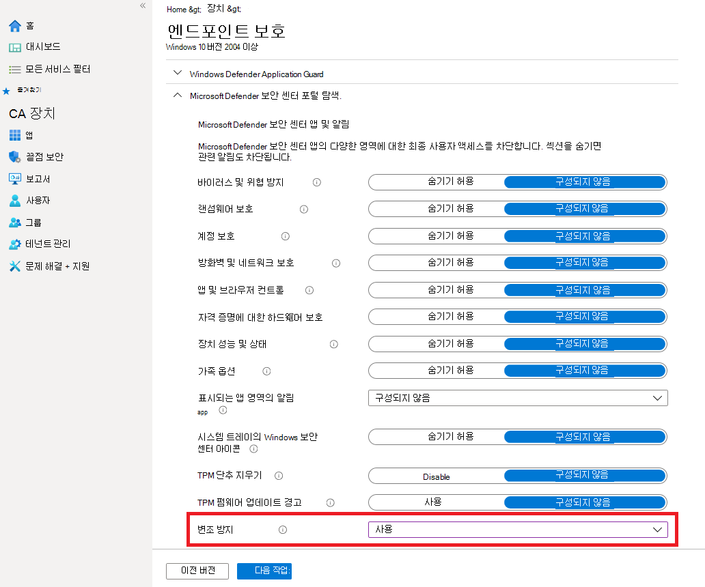

# 무단 보호를 사용하여 보안 설정 보호

**적용 대상:**

- [엔드포인트용 Microsoft Defender](/microsoft-365/security/defender-endpoint/)

변조 보호는 다음 버전 중 하나를 실행하는 장치에서 사용할 수 Windows.

- Windows 10
- Windows 11
- Windows Server 2019
- Windows Server 2022
- Windows 서버, 버전 1803 이상
- Windows Server 2016
- Windows Server 2012 R2

> [!NOTE]
> R2의 변조 Windows Server 2012 최신 통합 솔루션 패키지를 사용하여 온보드된 디바이스에 사용할 수 있습니다. 자세한 내용은 R2 및 [2016](/microsoft-365/security/defender-endpoint/configure-server-endpoints?view=o365-worldwide#new-functionality-in-the-modern-unified-solution-for-windows-server-2012-r2-and-2016-preview)Preview에 대한 최신 통합 솔루션의 Windows Server 2012 기능을 참조하세요.

## 개요

일부 종류의 사이버 공격 중에 악의적인 공격자는 컴퓨터의 바이러스 백신 보호와 같은 보안 기능을 사용하지 않도록 설정하려고 합니다. 악의적인 공격자들은 데이터에 더 쉽게 액세스하거나, 맬웨어를 설치하거나, 데이터, ID 및 장치를 악용하기 위해 보안 기능을 사용하지 않도록 설정하는 것을 좋아합니다. 변조 방지는 이러한 종류의 발생을 방지하는 데 도움이 됩니다.

변조 방지를 통해 악성 앱은 다음 작업을 수행할 수 없습니다.

- 바이러스 및 위협 방지를 사용 안 하게
- 실시간 보호를하지 않습니다.
- 동작 모니터링 끄기
- 바이러스 백신 비활성화(예: IOfficeAntivirus(IOAV))
- 클라우드 제공 보호를 사용 안 하게
- 보안 인텔리전스 업데이트 제거

### 작동 방법

변조 방지는 기본적으로 Microsoft Defender 바이러스 백신 기본값으로 잠그고, 다음과 같은 앱과 방법을 통해 보안 설정이 변경되지 않도록 합니다.

- 디바이스의 레지스트리 편집기에서 Windows 구성
- PowerShell cmdlet을 통해 설정 변경
- 그룹 정책을 통해 보안 설정 편집 또는 제거

변조 방지는 보안 설정을 볼 수 있도록 방지하지 않습니다. 또한 변조 방지는 비 Microsoft 바이러스 백신 앱이 앱에 등록되는 Windows 보안 않습니다. 조직에서 E5를 Windows 10 Enterprise 경우 개별 사용자는 변조 보호 설정을 변경할 수 없습니다. 이러한 경우 변조 보호는 보안 팀에서 관리합니다.

### 무슨 작업을 하고 싶으십니까?

 

****

|이 작업을 수행하기 위해...|이 섹션을 참조하세요.|
|---|---|
|테넌트 전체에서 변조 보호 관리 
 Microsoft 365 Defender 포털을 사용하여 변조 방지 설정 또는 해제|[조직에 대한 변조 방지를 Microsoft 365 Defender](#manage-tamper-protection-for-your-organization-using-the-microsoft-365-defender-portal)|
|조직의 변조 방지 설정 미세 조정 
 Intune(Microsoft Endpoint Manager)을 사용하여 변조 방지를 설정하거나 해제합니다. 이 방법을 사용하여 일부 또는 모든 사용자에 대해 변조 방지를 구성할 수 있습니다.|[Intune을 사용하여 조직의 변조 방지 관리](#manage-tamper-protection-for-your-organization-using-intune)|
|Configuration Manager를 통해 조직에 대한 변조 보호 설정(또는 해제)을 끄기|[Configuration Manager 버전 2006에서 테넌트 첨부를 사용하여 조직의 변조 방지 관리](#manage-tamper-protection-for-your-organization-with-configuration-manager-version-2006)|
|개별 장치에 대한 변조 보호 켜기(또는 끄기)|[개별 장치에서 변조 보호 관리](#manage-tamper-protection-on-an-individual-device)|
|장치에서의 변조 시도에 대한 세부 정보 보기|[변조 시도에 대한 정보 보기](#view-information-about-tampering-attempts)|
|보안 권장 사항 검토|[보안 권장 사항 검토](#review-your-security-recommendations)|
|FAQ(질문과 대답) 목록 검토|[FAQ 찾아보기](#view-information-about-tampering-attempts)|
|

변조 방지를 사용하도록 설정하는 데 사용하는 방법 또는 관리 도구에 따라 클라우드 제공 보호에 종속될 수 있습니다.

다음 표에서는 메서드, 도구 및 종속성에 대해 자세히 제공합니다.

 

****

|변조 방지를 사용하는 방법|MAPS(클라우드 제공 보호)에 대한 종속성|
|---|---|
|Microsoft Intune|아니오|
|Microsoft Endpoint Configuration Manager + 테넌트 첨부|아니요|
|Microsoft 365 Defender 포털( [https://security.microsoft.com](https://security.microsoft.com) )|예|
|

## 사이트 포털을 사용하여 조직의 변조 Microsoft 365 Defender 관리

테넌트 포털()을 사용하여 테넌트에 대해 변조 보호를 켜거나 Microsoft 365 Defender [https://security.microsoft.com](https://security.microsoft.com) 있습니다. 다음은 유의해야 할 몇 가지 사항입니다.

- 현재 새 배포의 경우 Microsoft 365 Defender 포털에서 변조 방지를 관리하는 옵션이 기본적으로 설정되어 있습니다. 기존 배포의 경우 옵트인(opt in)으로 변조 보호를 사용할 수 있습니다. 옵트인(opt in)을  Microsoft 365 Defender 끝점 고급 설정 변조 \>  \>  \> **보호를 선택 합니다.**

- Microsoft 365 Defender 포털을 사용하여 변조 방지를 관리할 때 Intune 또는 테넌트 연결 방법을 사용할 필요가 없습니다.

- Microsoft Defender 보안 센터 변조 보호를 관리하는 경우 이 설정은 테넌트 전체에 적용되어 Windows 10, Windows 11, R2, Windows Server 2012 실행 중인 모든 장치에 영향을 Windows Server 2016. Windows Server 2019 또는 Windows Server 2022. 변조 방지를 미세 조정하려면(예: 일부 장치에 대해 변조 보호를 설정하고 다른 장치에는 사용하지 않는 경우) 테넌트 연결과 함께 [Intune](#manage-tamper-protection-for-your-organization-using-intune) 또는 [Configuration Manager를 사용 합니다.](#manage-tamper-protection-for-your-organization-with-configuration-manager-version-2006)

- 하이브리드 환경이 있는 경우 Intune에서 구성된 변조 보호 설정이 Microsoft 365 Defender 구성한 설정보다 우선합니다.

### Microsoft 365 Defender 포털에서 변조 방지를 관리하기 위한 요구 사항

- 전역 관리자,  보안 관리자 또는 보안 작업과 같은 적절한 권한이 할당되어 있어야 합니다.

- 사용자 Windows 다음 버전 중 하나를 실행해야 Windows.
  - Windows 10
  - Windows 11
  - [Windows Server 2019](/windows-server/get-started-19/whats-new-19)
  - Windows Server 2022
  - Windows 서버, 버전 [1803](/windows/release-health/status-windows-10-1803) 이상
  - [Windows Server 2016](/windows-server/get-started/whats-new-in-windows-server-2016)
  - [Windows Server 2012 R2](/win32/srvnodes/what-s-new-for-windows-server-2012-r2)

릴리스에 대한 자세한 내용은 릴리스 [Windows 10 참조하세요.](/windows/release-health/release-information)

- 디바이스를 [끝점용 Microsoft Defender에 온보딩해야 합니다.](/microsoft-365/security/defender-endpoint/onboarding)

- 장치에서 맬웨어 방지 플랫폼 버전 4.18.2010.7 이상 및 맬웨어 방지 엔진 버전 1.1.17600.5 이상을 사용하고 있어야 합니다. (Microsoft Defender 바이러스 백신[관리하고 기준을](manage-updates-baselines-microsoft-defender-antivirus.md)적용합니다.)

- [클라우드 제공 보호를](enable-cloud-protection-microsoft-defender-antivirus.md) 켜야 합니다.

### 웹 사이트 포털에서 변조 보호 Microsoft 365 Defender 켜기

:::image type="content" source="../../media/mde-turn-tamperprotectionon.png" alt-text="웹 사이트 포털에서 변조 Microsoft 365 Defender 끄기":::

1. Microsoft 365 Defender 포털()로 [https://security.microsoft.com](https://security.microsoft.com) 이동하여 로그인합니다.

2. 끝점 **설정** \> **를 선택 합니다.**

3. 일반 **고급** \> **기능으로 이동한** 다음 변조 방지를 켜야 합니다.

## Intune을 사용하여 조직의 변조 방지 관리

조직의 보안 팀에 포함되는 구독에 [Intune이](/intune/fundamentals/what-is-intune)포함되어 있는 경우 Microsoft Endpoint Manager 관리 센터에서 조직에 대한 변조 보호를 켜거나 끄면 됩니다( [https://endpoint.microsoft.com](https://endpoint.microsoft.com) ). 변조 방지 설정을 미세 조정하려면 Intune을 사용합니다. 예를 들어 일부 장치에서 변조 방지를 사용하도록 설정하려는 경우 Intune을 사용 합니다.

### Intune에서 변조 방지를 관리하기 위한 요구 사항

- 전역 관리자,  보안 관리자 또는 보안 작업과 같은 적절한 권한이 할당되어 있어야 합니다.

- 조직에서 [Intune을 사용하여 장치를 관리합니다.](/intune/fundamentals/what-is-device-management) ([Intune 라이선스가](/intune/fundamentals/licenses) 필요합니다. Intune은 Microsoft 365 E5.)

- 사용자 Windows OS [1709, Windows 11 1809](/windows/release-health/status-windows-10-1709)Windows 11 또는 Windows 10 [실행되고](/windows/release-health/status-windows-10-1809-and-windows-server-2019) 있어야 합니다. 릴리스에 대한 자세한 내용은 릴리스 [Windows 10 참조하세요.](/windows/release-health/release-information)

- 보안 인텔리전스가 버전  1.287.60.0 이상으로 Windows 보안 기능을 사용하고 있어야 합니다.

- 장치는 맬웨어 방지 플랫폼 버전 4.18.1906.3 이상 및 맬웨어 방지 엔진 버전 1.1.15500.X 이상을 사용하고 있어야 합니다. (Microsoft Defender 바이러스 백신[관리하고 기준을](manage-updates-baselines-microsoft-defender-antivirus.md)적용합니다.)

### Intune에서 변조 보호 켜기(또는 끄기)

1. [Microsoft Endpoint Manager 관리 센터](https://endpoint.microsoft.com)로 이동하여 로그인합니다.

2. 장치 **구성** \> **프로필을 선택합니다.**

3. 다음 설정을 포함하는 프로필을 만들 수 있습니다.

    - **플랫폼: Windows 10 이상**
    - **프로필 유형: 끝점 보호**
    - **범주: Microsoft 365 Defender**
    - **변조 방지: 사용**

4. 프로필을 하나 이상의 그룹에 할당합니다.

### 1709, Windows Server 2016, Windows 또는 1809 버전을 사용하나요?

Windows Server 2016, Windows 10 버전 1709, 1803 또는 [1809를](/windows/release-health/status-windows-10-1809-and-windows-server-2019)사용하는 경우 앱 앱에  변조 보호가 Windows 보안 않습니다. 대신 PowerShell을 사용하여 변조 방지를 사용할지 여부를 결정할 수 있습니다.

이 Windows Server 2016 경우 설정 변조 방지를 사용하는 경우 앱 앱이 실시간 보호 상태를 정확하게 반영하지 않습니다.

#### PowerShell을 사용하여 변조 방지 및 실시간 보호가 켜져 있는지 확인

1. 앱 Windows PowerShell 열기

2. [Get-MpComputerStatus](/powershell/module/defender/get-mpcomputerstatus?preserve-view=true&view=win10-ps) PowerShell cmdlet을 사용 합니다.

3. 결과 목록에서 또는 을 `IsTamperProtected` `RealTimeProtectionEnabled` 검색합니다. true 값은  변조 방지를 사용할 수 있는 것입니다.

## Configuration Manager 버전 2006을 사용하여 조직의 변조 보호 관리

[Configuration Manager 버전 2006을](/mem/configmgr/core/plan-design/changes/whats-new-in-version-2006)사용하는 경우 방법을 사용하여 Windows 10, Windows 11, Windows Server 2012 R2, Windows Server 2016, Windows Server 2019 및 Windows Server 2022에서 변조 보호 설정을 관리할 수 있습니다. *테넌트 연결이라고 부를 수 있습니다.* 테넌트 연결 기능을 사용하면 프레미스 전용 Configuration Manager 장치를 Microsoft Endpoint Manager 관리 센터에 동기화한 다음 끝점 보안 구성 정책을 장치용 & 있습니다.

> [!NOTE]
> 이 절차를 사용하여 Windows 10, Windows 11, Windows Server 2022를 실행하는 장치로 변조 Windows 확장할 수 있습니다. 이 절차에 언급된 리소스의 선행 절차 및 기타 정보를 검토해야 합니다.

1. 테넌트 연결 설정 자세한 내용은 테넌트 연결 Microsoft Endpoint Manager 장치 동기화 및 장치 작업을 [참조하세요.](/mem/configmgr/tenant-attach/device-sync-actions)

2. In the [Microsoft Endpoint Manager admin center](https://go.microsoft.com/fwlink/?linkid=2109431), go to **Endpoint security** \> **Antivirus**, and then choose + **Create Policy**.

   - 플랫폼 **목록에서** Windows 10 및 **Windows Server(ConfigMgr)** 또는 Windows 11 Windows **서버(ConfigMgr)를 선택합니다.**
   - 프로필 **목록에서** 환경 **Windows 보안(미리 보기)를 선택합니다.**

3. 디바이스 컬렉션에 정책을 배포합니다.

### 이 메서드에 대한 도움이 필요하세요?

다음 리소스를 참조하십시오.

- [설정 환경 Windows 보안 프로필에 대한 Microsoft Intune](/mem/intune/protect/antivirus-security-experience-windows-settings)
- [Tech Community 블로그: Configuration Manager 테넌트 연결 클라이언트에 대한 변조 방지 발표](https://techcommunity.microsoft.com/t5/microsoft-endpoint-manager-blog/announcing-tamper-protection-for-configuration-manager-tenant/ba-p/1700246#.X3QLR5Ziqq8.linkedin)

## 개별 장치에서 변조 보호 관리

> [!NOTE]
> 변조 방지 블록은 레지스트리를 통해 Microsoft Defender 바이러스 백신 수정하려고 합니다.
>
> 변조 방지가 이러한 설정을 수정하는 Microsoft가 아닌 다른 보안 제품 또는 엔터프라이즈 설치 스크립트를 방해하지  않도록 보장하려면 Windows 보안 버전 1.287.60.0 이상으로 보안 **인텔리전스를** 업데이트합니다. (보안 [인텔리전스 업데이트 참조)](https://www.microsoft.com/wdsi/definitions)
>
> 이 업데이트를 만든 후 변조 보호는 레지스트리 설정을 계속 보호하며 로그는 오류를 반환하지 않고 수정을 시도합니다.

가정용 사용자 또는 보안 팀에서 관리하는 설정이 없는 경우 Windows 보안 앱을 사용하여 변조 방지를 관리할 수 있습니다. 변조 방지와 같은 보안 설정을 변경하려면 장치에 적절한 관리자 권한이 있어야 합니다.

앱 앱에 다음과 같은 Windows 보안 있습니다.

1. 시작 **을** 선택하고 보안 입력을 *시작합니다.* 검색 결과에서 를 **Windows 보안.**

2. 바이러스 **& 위협 방지 바이러스** & 설정을 \> **선택합니다.**

3. 변조 **보호를 설정** 또는 **해제로** **설정**

## 변조 시도에 대한 정보 보기

변조 시도는 일반적으로 더 큰 사이버 공격을 나타냅니다. 악의적인 악의적인 악의적인 는 보안 설정을 변하지 않고 유지하려는 시도입니다. 조직의 보안 팀의 일부인 경우 이러한 시도에 대한 정보를 확인한 다음 적절한 조치를 취하여 위협을 완화할 수 있습니다.

변조 시도가 감지되면 Microsoft 365 Defender [포털()에서 경고가 Microsoft 365 Defender](/microsoft-365/security/defender-endpoint/portal-overview) [https://security.microsoft.com](https://security.microsoft.com) 합니다.

[끝점용](/microsoft-365/security/defender-endpoint/overview-endpoint-detection-response) Microsoft Defender의 엔드포인트 감지 및 응답 및 고급 헌팅 기능을 사용하여 보안 운영 팀은 이러한 시도를 조사하고 해결할 수 있습니다. 

## 보안 권장 사항 검토

변조 방지는 위협 및 [& 관리 기능과 통합됩니다.](/microsoft-365/security/defender-endpoint/next-gen-threat-and-vuln-mgt) [보안 권장 사항에는](/microsoft-365/security/defender-endpoint/tvm-security-recommendation) 변조 방지가 설정되어 있는지 확인이 포함됩니다. 예를 들어 변조에서 *검색할 수 있습니다.* 결과에서 변조 보호  켜기 를 선택하여 자세한 내용을 알아보고 켜면 됩니다.

위협 및 취약성 관리에 & 자세한 내용은 & 위협 및 취약성 [관리를 Microsoft 365 Defender.](/microsoft-365/security/defender-endpoint/tvm-dashboard-insights#threat--vulnerability-management-in-microsoft-defender-security-center)

## 질문과 대답

### 어떤 버전의 변조 Windows 구성할 수 있나요?

Windows 10 OS [1709](/windows/release-health/status-windows-10-1709), [1803](/windows/release-health/status-windows-10-1803), [1809](/windows/release-health/status-windows-10-1809-and-windows-server-2019)이상과 [끝점용 Microsoft Defender](/microsoft-365/security/defender-endpoint).

Windows 11

Configuration Manager 버전 2006을 테넌트 연결과 함께 사용하는 경우 변조 방지를 Windows Server 2012 R2, Windows Server 2016, Windows Server 2019 및 Windows Server 2022로 확장할 수 있습니다. 테넌트 연결: 관리 센터에서 끝점 보안 바이러스 백신 정책 만들기 및 배포(미리 [보기)를 참조하세요.](/mem/configmgr/tenant-attach/deploy-antivirus-policy)

### 변조 방지는 앱의 비 Microsoft 바이러스 백신 등록에 Windows 보안 영향을 미치나요?

아니요. Microsoft가 아닌 다른 바이러스 백신 제품은 계속 응용 프로그램에 Windows 보안 합니다.

### 장치에서 Microsoft Defender 바이러스 백신 활성화되지 않은 경우 어떻게 하나요?

끝점용 Microsoft Defender에 온보딩된 디바이스는 수동 Microsoft Defender 바이러스 백신 실행됩니다. 이러한 경우 변조 보호는 서비스 및 해당 기능을 계속 보호합니다.

### 변조 보호를 켜거나 끄는 방법

가정용 사용자인 경우 개별 장치에서 변조 보호 [관리를 참조하세요.](#manage-tamper-protection-on-an-individual-device)

끝점용 Microsoft [Defender를](/microsoft-365/security/defender-endpoint)사용하는 조직인 경우 다른 끝점 보호 기능을 관리하는 방법과 유사한 Intune에서 변조 보호를 관리할 수 있습니다. 이 문서의 다음 섹션을 참조하세요.

- [Intune을 사용하여 변조 방지 관리](#manage-tamper-protection-for-your-organization-using-intune)
- [Configuration Manager, 버전 2006을 사용하여 변조 보호 관리](#manage-tamper-protection-for-your-organization-with-configuration-manager-version-2006)
- [사이트 포털을 사용하여 변조 Microsoft 365 Defender 관리](#manage-tamper-protection-for-your-organization-using-the-microsoft-365-defender-portal)

### Intune에서 변조 보호를 구성하는 것은 그룹 정책을 사용하여 Microsoft Defender 바이러스 백신 어떻게 영향을 미치나요?

변조 방지에는 그룹 정책이 적용되지 않습니다. 변조 방지가 Microsoft Defender 바이러스 백신 설정에 대한 변경 내용은 무시됩니다.

### 변조 Microsoft Intune 구성하는 경우 전체 조직에만 적용합니까?

Intune을 통해 변조 보호를 유연하게 구성할 수 있습니다. 전체 조직을 대상으로 지정하거나 특정 장치 및 사용자 그룹을 선택할 수 있습니다.

### 변조 방지를 구성할 수 Microsoft Endpoint Configuration Manager?

테넌트 첨부를 사용하는 경우 테넌트 첨부 파일을 Microsoft Endpoint Configuration Manager. 다음 리소스를 참조하십시오.

- [Configuration Manager 버전 2006을 사용하여 조직의 변조 보호 관리](#manage-tamper-protection-for-your-organization-with-configuration-manager-version-2006)
- [Tech Community 블로그: Configuration Manager 테넌트 연결 클라이언트에 대한 변조 방지 발표](https://techcommunity.microsoft.com/t5/microsoft-endpoint-manager-blog/announcing-tamper-protection-for-configuration-manager-tenant/ba-p/1700246#.X3QLR5Ziqq8.linkedin)

### I have the Windows E3 enrollment. Intune에서 변조 보호 구성을 사용할 수 있나요?

현재 Intune에서 변조 보호를 구성하는 것은 [끝점용 Microsoft Defender가 있는 고객만 사용할 수 있습니다.](/microsoft-365/security/defender-endpoint)

### 장치에서 변조 방지를 사용하도록 설정한 경우 Intune, Microsoft Endpoint Configuration Manager 및 Windows Management Instrumentation에서 끝점용 Microsoft Defender 설정을 변경하려고 할 경우 어떻게 하나요?

변조 방지로 보호되는 기능은 변경할 수 없습니다. 이러한 변경 요청은 무시됩니다.

### 엔터프라이즈 고객입니다. 로컬 관리자가 장치에서 변조 보호를 변경할 수 있나요?

아니요. 로컬 관리자는 변조 방지 설정을 변경하거나 수정할 수 없습니다.

### 장치가 끝점용 Microsoft Defender를 사용하여 온보딩된 후 오프보드 상태로 넘어가면 어떻게 하나요?

장치가 끝점용 Microsoft Defender에서 오프보딩된 경우 변조 방지가 켜져 있습니다. 이는 관리되지 않는 장치의 기본 상태입니다.

### 변조 방지 상태가 변경되는 경우 알림이 Microsoft 365 Defender 표시합니까?

예. 경고는 경고 [https://security.microsoft.com](https://security.microsoft.com) **에 표시됩니다.**

보안 운영 팀은 다음 예와 같은 헌팅 쿼리를 사용할 수도 있습니다.

`AlertInfo|where Title == "Tamper Protection bypass"`

[변조 시도에 대한 정보를 을 를 으로 본다.](#view-information-about-tampering-attempts)

## 참고 항목

[보안 기능을 Windows PC의 보안 Endpoint Protection Microsoft Intune](/intune/help-secure-windows-pcs-with-endpoint-protection-for-microsoft-intune)

[Microsoft Defender for Endpoint 개요 알아보기](/microsoft-365/security/defender-endpoint)

[함께 활용: Microsoft Defender 바이러스 백신 및 Microsoft Defender for Endpoint](why-use-microsoft-defender-antivirus.md)
