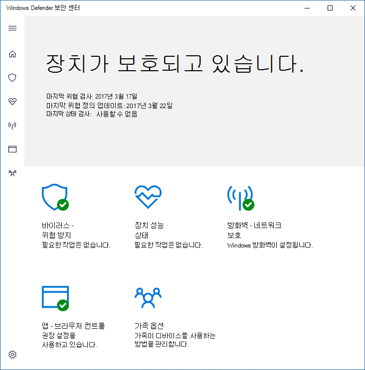
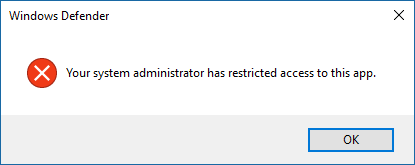

# 사용자가 사용자 인터페이스를 보거나 상호 작용하지 Microsoft Defender 바이러스 백신 방지Prevent users from seeing or interacting with the Microsoft Defender Antivirus user interface

[!INCLUDE [Microsoft 365 Defender rebranding](../../includes/microsoft-defender.md)]

**적용 대상:****Applies to:**

- [엔드포인트용 Microsoft DefenderMicrosoft Defender for Endpoint](/microsoft-365/security/defender-endpoint/)

그룹 정책을 사용하여 끝점의 사용자가 그룹 인터페이스를 볼 수 Microsoft Defender 바이러스 백신 있습니다.You can use Group Policy to prevent users on endpoints from seeing the Microsoft Defender Antivirus interface. 또한 검사가 더이상 실행되지 않도록 차단할 수 있습니다.You can also prevent them from pausing scans.

## 인터페이스 Microsoft Defender 바이러스 백신 숨기기Hide the Microsoft Defender Antivirus interface

Windows 10 버전 1703에서는 인터페이스를 숨기면 Microsoft Defender 바이러스 백신 알림이 숨겨지며 바이러스 & 위협 방지 타일이 Windows 보안 앱에 나타나지 않습니다.In Windows 10, versions 1703, hiding the interface will hide Microsoft Defender Antivirus notifications and prevent the Virus & threat protection tile from appearing in the Windows Security app.

설정이 **사용으로** 설정된 경우 :With the setting set to **Enabled**:

설정이 사용 안 하도록 **설정되거나** 구성되지 않은 경우:With the setting set to **Disabled** or not configured:

>[!NOTE]
>또한 인터페이스를 숨기면 Microsoft Defender 바이러스 백신 끝점에 알림이 나타나지 않습니다.Hiding the interface will also prevent Microsoft Defender Antivirus notifications from appearing on the endpoint. 끝점용 Microsoft Defender 알림이 계속 표시됩니다.Microsoft Defender for Endpoint notifications will still appear. 끝점에 나타나는 알림을 개별적으로 [구성할 수도 있습니다.](configure-notifications-microsoft-defender-antivirus.md)You can also individually [configure the notifications that appear on endpoints](configure-notifications-microsoft-defender-antivirus.md)

이전 버전의 Windows 10 클라이언트 인터페이스가 Windows Defender 숨겨지게 됩니다.In earlier versions of Windows 10, the setting will hide the Windows Defender client interface. 사용자가 앱을 열려고 하면 "시스템 관리자가 이 앱에 대한 액세스를 제한했습니다."라는 경고가 표시됩니다.If the user attempts to open it, they will receive a warning that says, "Your system administrator has restricted access to this app."

## 그룹 정책을 사용하여 사용자로부터 Microsoft Defender AV 인터페이스 숨기기Use Group Policy to hide the Microsoft Defender AV interface from users

1. 그룹 정책 관리 컴퓨터의 그룹 정책 관리 콘솔을 열고 구성할 그룹 정책 개체를 마우스 오른쪽 단추로 클릭하고 편집을 **클릭합니다.**On your Group Policy management machine, open the [Group Policy Management Console](/previous-versions/windows/desktop/gpmc/group-policy-management-console-portal), right-click the Group Policy Object you want to configure and click **Edit**.

2. 그룹 정책 **관리 편집기를 사용하여 컴퓨터** **구성으로 이동하십시오.**Using the **Group Policy Management Editor** go to **Computer configuration**.

3. 관리 **템플릿 을 클릭합니다.**Click **Administrative templates**.

4. 클라이언트 인터페이스에서 **구성 Windows 트리를 > Microsoft Defender 바이러스 백신 > 확장합니다.**Expand the tree to **Windows components > Microsoft Defender Antivirus > Client interface**.

5. 헤드리스 UI 모드 사용 설정을 **두 번 클릭하고** 옵션을 사용으로 **설정합니다.**Double-click the **Enable headless UI mode** setting and set the option to **Enabled**. **확인** 을 클릭합니다.Click **OK**. 

사용자가 [PC에서](configure-local-policy-overrides-microsoft-defender-antivirus.md) 보호를 수정하지 못하도록 하는 데 대한 자세한 옵션은 사용자가 로컬에서 정책 설정을 수정하지 못하도록 방지를 참조하세요.See [Prevent users from locally modifying policy settings](configure-local-policy-overrides-microsoft-defender-antivirus.md) for more options on preventing users form modifying protection on their PCs.

## 사용자가 검색을 시작하지 못하게 방지Prevent users from pausing a scan

사용자가 스캔을 중단하지 못하게 할 수 있습니다. 이렇게 하면 예약된 검사나 필요한 경우 검사가 중단되지 않도록 할 수 있습니다.You can prevent users from pausing scans, which can be helpful to ensure scheduled or on-demand scans are not interrupted by users.

> [!NOTE]
> 이 설정은 이 설정에서 지원되지 Windows 10.This setting is not supported on Windows 10.

### 그룹 정책을 사용하여 사용자가 스캔을 시작하지 못하게 차단Use Group Policy to prevent users from pausing a scan

1. 그룹 정책 관리 컴퓨터의 그룹 정책 관리 콘솔을 열고 구성할 그룹 정책 개체를 마우스 오른쪽 단추로 클릭하고 편집을 **클릭합니다.**On your Group Policy management machine, open the [Group Policy Management Console](/previous-versions/windows/desktop/gpmc/group-policy-management-console-portal), right-click the Group Policy Object you want to configure and click **Edit**.

2. 그룹 정책 **관리 편집기를 사용하여 컴퓨터** **구성으로 이동하십시오.**Using the **Group Policy Management Editor** go to **Computer configuration**.

3. 관리 **템플릿 을 클릭합니다.**Click **Administrative templates**.

4. 검색에서 구성 **Windows**  >  **트리를 Microsoft Defender 바이러스 백신**  >  **확장합니다.**Expand the tree to **Windows components** > **Microsoft Defender Antivirus** > **Scan**.

5. 사용자가 스캔을 일시 **중지할** 수 있도록 허용 설정을 두 번 클릭하고 옵션을 사용 안 **하도록 설정하십시오.**Double-click the **Allow users to pause scan** setting and set the option to **Disabled**. **확인** 을 클릭합니다.Click **OK**. 

## 관련 문서Related articles

- [엔드포인트에 표시되는 알림 구성Configure the notifications that appear on endpoints](configure-notifications-microsoft-defender-antivirus.md)

- [사용자와의 최종 사용자 상호 작용 Microsoft Defender 바이러스 백신Configure end-user interaction with Microsoft Defender Antivirus](configure-end-user-interaction-microsoft-defender-antivirus.md)

- [Windows 10의 Microsoft Defender 바이러스 백신Microsoft Defender Antivirus in Windows 10](microsoft-defender-antivirus-in-windows-10.md)