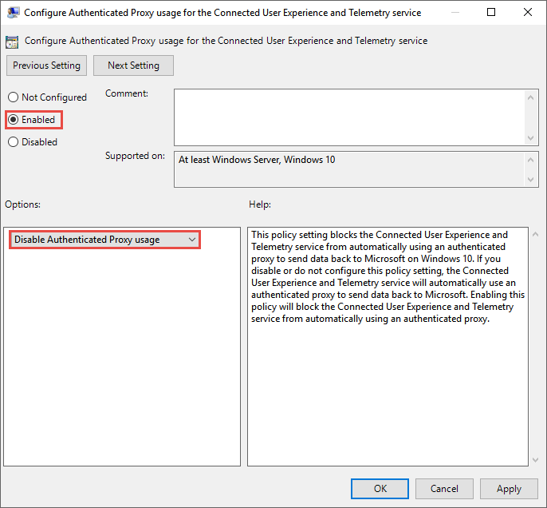

# <a name="set-up-microsoft-defender-for-endpoint-deployment"></a>끝점 배포를 위한 Microsoft Defender 설정

[!INCLUDE [Microsoft 365 Defender rebranding](../../includes/microsoft-defender.md)]


**적용 대상:**
- [엔드포인트용 Microsoft Defender](https://go.microsoft.com/fwlink/p/?linkid=2154037)
- [Microsoft 365 Defender](https://go.microsoft.com/fwlink/?linkid=2118804)

> 엔드포인트용 Microsoft Defender를 경험하고 싶으신가요? [무료 평가판을 신청하세요.](https://signup.microsoft.com/create-account/signup?products=7f379fee-c4f9-4278-b0a1-e4c8c2fcdf7e&ru=https://aka.ms/MDEp2OpenTrial?ocid=docs-wdatp-exposedapis-abovefoldlink)

끝점용 Defender 배포는 3단계 프로세스입니다.

|[](prepare-deployment.md)<br>[1 단계: 준비](prepare-deployment.md) | <br>2 단계: 설정 | [](onboarding.md)<br>[3 단계: 온보딩](onboarding.md)|
|---|---|---|
||*여기 있습니다!*||

현재 설정 단계에 있습니다.

이 배포 시나리오에서는 다음 단계를 안내합니다.

- 라이선스 유효성 검사
- 테넌트 구성
- 네트워크 구성

> [!NOTE]
> 일반적인 배포를 안내하기 위해 이 시나리오는 일반적인 배포를 안내하는 용도로만 Microsoft Endpoint Configuration Manager. Endpoint용 Defender는 다른 온보딩 도구를 사용할 수 있지만 배포 가이드에서 이러한 시나리오를 다루지 않습니다. 자세한 내용은 [끝점용 Microsoft Defender에 장치 온보딩을 참조하세요.](onboard-configure.md)

## <a name="check-license-state"></a>라이선스 상태 확인

라이선스 상태를 확인하고 적절히 프로비전되었는지 여부는 관리 센터 또는 라이선스 **포털을 통해** Microsoft Azure 있습니다.

1. 라이선스를 확인하기 위해 Microsoft Azure **포털로** 이동하여 Microsoft Azure 포털 라이선스 섹션으로 [이동합니다.](https://portal.azure.com/#blade/Microsoft_AAD_IAM/LicensesMenuBlade/Products)

   

1. 또는 관리 센터에서 청구 **구독으로** \> **이동합니다.**

    화면에 프로비전된 모든 라이선스 및 해당 현재 상태가 **표시됩니다.**

    

## <a name="cloud-service-provider-validation"></a>클라우드 서비스 공급자 유효성 검사

회사에 프로비전된 라이선스에 액세스하고 라이선스 상태를 확인하려면 관리 센터로 이동하세요.

1. 파트너 **포털에서** 서비스 관리 **를 > Office 365.**

2. 파트너 포털 **링크를** 클릭하면 관리자  대신 관리 옵션이 열리며 고객 관리 센터에 액세스할 수 있습니다.

   

## <a name="tenant-configuration"></a>테넌트 구성

끝점용 Microsoft Defender에 쉽게 온보딩할 수 있습니다. 탐색 메뉴에서 끝점 섹션 아래에 있는 항목을 선택하거나 인시던트, 헌팅Microsoft 365 Defender 센터 또는 위협 분석과 같은 모든 Microsoft 365 Defender 기능을 선택하여 온보더링 프로세스를 시작할 수 있습니다.

웹 브라우저에서 보안 센터 [Microsoft 365 이동합니다.](https://security.microsoft.com)

## <a name="network-configuration"></a>네트워크 구성

조직에서 끝점이 인터넷에 액세스하기 위해 프록시를 사용할 필요가 없는 경우 이 섹션을 건너뜁니다.

엔드포인트용 Microsoft Defender 센서를 사용하려면 센서 데이터를 보고하고 엔드포인트용 Microsoft Defender 서비스와 통신하기 위해 WinHTTP(Microsoft Windows HTTP)가 필요합니다. 포함된 Microsoft Defender for Endpoint 센서는 LocalSystem 계정을 사용하여 시스템 컨텍스트에서 실행됩니다. 센서는 WinHTTP(Microsoft Defender HTTP Services)를 사용하여 엔드포인트용 Microsoft Defender 클라우드 서비스와 통신할 수 있습니다. WinHTTP 구성 설정은 WinINet(Windows Internet) 인터넷 검색 프록시 설정과는 독립적이며 다음 검색 방법을 사용하여 프록시 서버를 검색할 수만 있습니다.

- **Autodiscovery 메서드**:
  - 투명한 프록시
  - WPAD(웹 프록시 자동 검색 프로토콜)

  네트워크 토폴로지에서 투명 프록시 또는 WPAD를 구현한 경우 특수 구성 설정이 필요하지 않습니다. 프록시의 끝점 URL 제외에 대한 Microsoft Defender에 대한 자세한 [](production-deployment.md#proxy-service-urls) 내용은 URL 허용 목록 또는 장치 프록시 및 인터넷 연결 설정 구성에서 이 문서의 프록시 서비스 URL 섹션을 [참조하세요.](configure-proxy-internet.md#enable-access-to-microsoft-defender-for-endpoint-service-urls-in-the-proxy-server)

- **수동 정적 프록시 구성**:
  - 레지스트리 기반 구성
  - netsh 명령을 사용하여 구성된 WinHTTP

    안정적인 토폴로지의 데스크톱(예: 동일한 프록시 뒤에 있는 회사 네트워크의 데스크톱)에만 적합합니다.

### <a name="configure-the-proxy-server-manually-using-a-registry-based-static-proxy"></a>레지스트리 기반 정적 프록시를 사용하여 프록시 서버를 수동으로 구성합니다.

컴퓨터가 인터넷에 연결할 수 없는 경우 Endpoint용 Microsoft Defender 센서만 진단 데이터를 보고하고 끝점 서비스용 Microsoft Defender와 통신할 수 있도록 레지스트리 기반 정적 프록시를 구성합니다. 정적 프록시는 GP(그룹 정책)를 통해 구성할 수 있습니다. 그룹 정책은 다음에서 확인할 수 있습니다.

- 관리 템플릿 Windows 구성 요소 데이터 수집 및 Preview 빌드 연결된 사용자 환경 및 원격 분석 서비스에 대해 인증된 프록시 사용 \> \> \> 구성
- 이 설정을 **사용으로 설정하고** 인증된 프록시 사용 안 **를 선택합니다.**

1. 그룹 정책 관리 콘솔을 엽니다.
2. 조직 관행에 따라 정책을 만들거나 기존 정책을 편집합니다.
3. 그룹 정책을 편집하고 관리 템플릿 Windows 데이터 수집 및 Preview 빌드 연결된 사용자 환경 및 원격 분석 서비스에 대해 인증된 프록시 사용 구성 으로 **\> \> \> 이동합니다.**

   

4. **사용하도록 설정** 을 선택합니다.
5. 인증된 **프록시 사용 안 을 선택합니다.**
6. 관리 템플릿 구성 요소 Windows 및 Preview 빌드 연결된 사용자 환경 및 원격 분석 구성으로 **\> \> \> 이동합니다.**

    

7. **사용하도록 설정** 을 선택합니다.
8. 프록시 서버 **이름을 입력합니다.**

정책은 레지스트리 키 `HKLM\Software\Policies\Microsoft\Windows\DataCollection`에서 레지스트리 값 `TelemetryProxyServer`을(를) REG_SZ로, `DisableEnterpriseAuthProxy`을(를) REG_DWORD로 설정합니다.

레지스트리 값은 `TelemetryProxyServer` 다음 문자열 형식을 가합니다.

```text
<server name or ip>:<port>
```

예: 10.0.0.6:8080

레지스트리 값 `DisableEnterpriseAuthProxy`을(를) 1로 설정해야 합니다.

### <a name="configure-the-proxy-server-manually-using-netsh-command"></a>netsh 명령을 사용하여 수동으로 프록시 서버 구성

netsh를 사용하여 시스템 전체의 정적 프록시를 구성합니다.

> [!NOTE]
>
> - 이는 Windows 서비스를 포함하여 기본 프록시로 WinHTTP를 사용하는 모든 응용 프로그램에 영향을 미칩니다.
> - 토폴로지(예: 사무실에서 집으로)를 변경하는 랩톱이 netsh로 오작동합니다. 레지스트리 기반 정적 프록시 구성을 사용합니다.

1. 승격된 명령줄을 열기:
    1. **시작**(으)로 이동하고 **cmd** 를 입력하십시오.
    1. **명령 프롬프트** 을(를) 마우스 오른쪽 버튼으로 클릭하고 **관리자**(으)로 실행을 선택합니다.

2. 다음 명령을 입력하고 **Enter** 를 누릅니다.

   ```PowerShell
   netsh winhttp set proxy <proxy>:<port>
   ```

   예: netsh winhttp 설정 프록시 10.0.0.6:8080

### <a name="proxy-configuration-for-down-level-devices"></a>다운 수준 장치에 대한 프록시 구성

Down-Level 장치에는 Windows 7 SP1 및 Windows 8.1 Workstation과 Windows Server 2008 R2, Windows Server 2012, Windows Server 2012 R2 및 Windows Server 2016 Windows Server CB 1803 이전의 Windows Server 2016 버전이 포함됩니다. 이러한 운영 체제는 끝점에서 Azure로의 통신을 처리하도록 Microsoft 관리 에이전트의 일부로 구성됩니다. 이러한 장치에서 프록시를 구성하는 방법에 대한 자세한 내용은 Microsoft Management Agent Fast Deployment Guide를 참조하십시오.

### <a name="proxy-service-urls"></a>프록시 서비스 URL

v20이 포함된 URL은 버전 1803 이상을 Windows 10 있는 경우 필요합니다. 예를 들어 디바이스가 버전 1803 이상에 있는 Windows 10만 `us-v20.events.data.microsoft.com` 필요합니다.

프록시 또는 방화벽이 익명 트래픽을 차단하는 경우, Endpoint용 Microsoft Defender 센서가 시스템 컨텍스트에서 연결하고 있는 경우 나열된 URL에서 익명 트래픽이 허용되어 있는지 확인하십시오.

다음 다운로드 가능한 스프레드시트에는 네트워크에서 연결할 수 있어야 하는 서비스 및 관련 URL이 나열됩니다. 이러한 URL에 대한 액세스를 거부하는 방화벽 또는 네트워크 필터링 규칙이 없는지 확인하거나  해당 URL에 대한 허용 규칙을 만들어야 할 수 있습니다.

<br>

****

|도메인 목록의 스프레드시트|설명|
|---|---|
||서비스 위치, 지리적 위치 및 OS에 대한 특정 DNS 레코드의 스프레드시트입니다. <p> [여기에서 스프레드시트를 다운로드합니다.](https://download.microsoft.com/download/8/a/5/8a51eee5-cd02-431c-9d78-a58b7f77c070/mde-urls.xlsx)|
|

## <a name="next-step"></a>다음 단계

 <br> [3단계: 끝점용](onboarding.md)Microsoft Defender 서비스가 센서 데이터를 얻을 수 있도록 장치에 서비스를 온보딩합니다.
