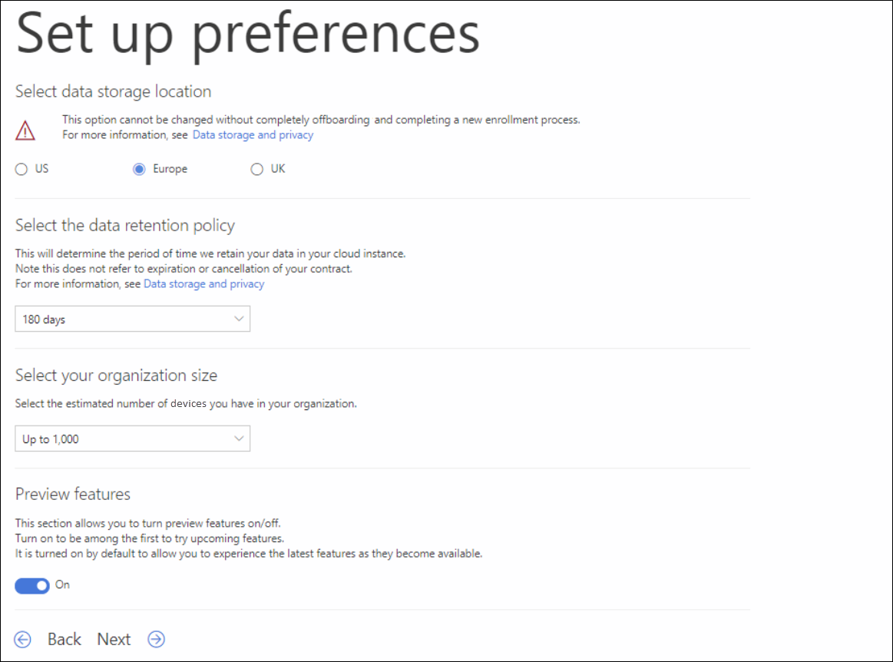

# <a name="set-up-microsoft-defender-for-endpoint-deployment"></a><span data-ttu-id="24f3a-104">끝점 배포를 위한 Microsoft Defender 설정</span><span class="sxs-lookup"><span data-stu-id="24f3a-104">Set up Microsoft Defender for Endpoint deployment</span></span>

[!INCLUDE [Microsoft 365 Defender rebranding](../../includes/microsoft-defender.md)]


<span data-ttu-id="24f3a-105">**적용 대상:**</span><span class="sxs-lookup"><span data-stu-id="24f3a-105">**Applies to:**</span></span>
- [<span data-ttu-id="24f3a-106">엔드포인트용 Microsoft Defender</span><span class="sxs-lookup"><span data-stu-id="24f3a-106">Microsoft Defender for Endpoint</span></span>](https://go.microsoft.com/fwlink/p/?linkid=2154037)
- [<span data-ttu-id="24f3a-107">Microsoft 365 Defender</span><span class="sxs-lookup"><span data-stu-id="24f3a-107">Microsoft 365 Defender</span></span>](https://go.microsoft.com/fwlink/?linkid=2118804)

> <span data-ttu-id="24f3a-108">끝점용 Microsoft Defender를 경험하고 싶나요?</span><span class="sxs-lookup"><span data-stu-id="24f3a-108">Want to experience Microsoft Defender for Endpoint?</span></span> [<span data-ttu-id="24f3a-109">무료 평가판에 등록합니다.</span><span class="sxs-lookup"><span data-stu-id="24f3a-109">Sign up for a free trial.</span></span>](https://www.microsoft.com/microsoft-365/windows/microsoft-defender-atp?ocid=docs-wdatp-exposedapis-abovefoldlink)

<span data-ttu-id="24f3a-110">끝점용 Defender 배포는 3단계 프로세스입니다.</span><span class="sxs-lookup"><span data-stu-id="24f3a-110">Deploying Defender for Endpoint is a three-phase process:</span></span>

| <span data-ttu-id="24f3a-111">[](prepare-deployment.md)</span><span class="sxs-lookup"><span data-stu-id="24f3a-111">[](prepare-deployment.md)</span></span><br>[<span data-ttu-id="24f3a-112">1단계: 준비</span><span class="sxs-lookup"><span data-stu-id="24f3a-112">Phase 1: Prepare</span></span>](prepare-deployment.md) | <br><span data-ttu-id="24f3a-114">2단계: 설치</span><span class="sxs-lookup"><span data-stu-id="24f3a-114">Phase 2: Setup</span></span> | <span data-ttu-id="24f3a-115">[](onboarding.md)</span><span class="sxs-lookup"><span data-stu-id="24f3a-115">[](onboarding.md)</span></span><br>[<span data-ttu-id="24f3a-116">3단계: 온보더</span><span class="sxs-lookup"><span data-stu-id="24f3a-116">Phase 3: Onboard</span></span>](onboarding.md) |
| ----- | ----- | ----- |
| | <span data-ttu-id="24f3a-117">*여기 있습니다!*</span><span class="sxs-lookup"><span data-stu-id="24f3a-117">*You are here!*</span></span>||

<span data-ttu-id="24f3a-118">현재 설정 단계에 있습니다.</span><span class="sxs-lookup"><span data-stu-id="24f3a-118">You are currently in the set-up phase.</span></span>

<span data-ttu-id="24f3a-119">이 배포 시나리오에서는 다음 단계를 안내합니다.</span><span class="sxs-lookup"><span data-stu-id="24f3a-119">In this deployment scenario, you'll be guided through the steps on:</span></span>
- <span data-ttu-id="24f3a-120">라이선스 유효성 검사</span><span class="sxs-lookup"><span data-stu-id="24f3a-120">Licensing validation</span></span>
- <span data-ttu-id="24f3a-121">테넌트 구성</span><span class="sxs-lookup"><span data-stu-id="24f3a-121">Tenant configuration</span></span>
- <span data-ttu-id="24f3a-122">네트워크 구성</span><span class="sxs-lookup"><span data-stu-id="24f3a-122">Network configuration</span></span>


>[!NOTE]
><span data-ttu-id="24f3a-123">일반적인 배포를 안내하기 위해 이 시나리오에서는 Microsoft Endpoint Configuration Manager만 사용할 수 있습니다.</span><span class="sxs-lookup"><span data-stu-id="24f3a-123">For the purpose of guiding you through a typical deployment, this scenario will only cover the use of Microsoft Endpoint Configuration Manager.</span></span> <span data-ttu-id="24f3a-124">Endpoint용 Defender는 다른 온보딩 도구를 사용할 수 있지만 배포 가이드에서 이러한 시나리오를 다루지 않습니다.</span><span class="sxs-lookup"><span data-stu-id="24f3a-124">Defender for Endpoint supports the use of other onboarding tools but will not cover those scenarios in the deployment guide.</span></span> <span data-ttu-id="24f3a-125">자세한 내용은 [끝점용 Microsoft Defender에 장치 온보딩을 참조하세요.](onboard-configure.md)</span><span class="sxs-lookup"><span data-stu-id="24f3a-125">For more information, see [Onboard devices to Microsoft Defender for Endpoint](onboard-configure.md).</span></span>

## <a name="check-license-state"></a><span data-ttu-id="24f3a-126">라이선스 상태 확인</span><span class="sxs-lookup"><span data-stu-id="24f3a-126">Check license state</span></span>

<span data-ttu-id="24f3a-127">라이선스 상태를 확인하고 적절히 프로비전되었는지 여부는 관리 센터 또는 Microsoft **Azure Portal을 통해 완료할 수 있습니다.**</span><span class="sxs-lookup"><span data-stu-id="24f3a-127">Checking for the license state and whether it got properly provisioned, can be done through the admin center or through the **Microsoft Azure portal**.</span></span>

1. <span data-ttu-id="24f3a-128">라이선스를 확인한 후 **Microsoft Azure Portal로** 이동하여 [Microsoft Azure Portal 라이선스 섹션으로 이동합니다.](https://portal.azure.com/#blade/Microsoft_AAD_IAM/LicensesMenuBlade/Products)</span><span class="sxs-lookup"><span data-stu-id="24f3a-128">To view your licenses, go to the **Microsoft Azure portal** and navigate to the [Microsoft Azure portal license section](https://portal.azure.com/#blade/Microsoft_AAD_IAM/LicensesMenuBlade/Products).</span></span>

   

1. <span data-ttu-id="24f3a-130">또는 관리 센터에서 청구 **구독으로**  >  **이동합니다.**</span><span class="sxs-lookup"><span data-stu-id="24f3a-130">Alternately, in the admin center, navigate to **Billing** > **Subscriptions**.</span></span>

    <span data-ttu-id="24f3a-131">화면에 프로비전된 모든 라이선스 및 해당 현재 상태가 **표시됩니다.**</span><span class="sxs-lookup"><span data-stu-id="24f3a-131">On the screen, you will see all the provisioned licenses and their current **Status**.</span></span>

    


## <a name="cloud-service-provider-validation"></a><span data-ttu-id="24f3a-133">클라우드 서비스 공급자 유효성 검사</span><span class="sxs-lookup"><span data-stu-id="24f3a-133">Cloud Service Provider validation</span></span>

<span data-ttu-id="24f3a-134">회사에 프로비전된 라이선스에 액세스하고 라이선스 상태를 확인하려면 관리 센터로 이동하세요.</span><span class="sxs-lookup"><span data-stu-id="24f3a-134">To gain access into which licenses are provisioned to your company, and to check the state of the licenses, go to the admin center.</span></span>

1. <span data-ttu-id="24f3a-135">파트너 **포털에서** **Office 365에서 > 를 선택합니다.**</span><span class="sxs-lookup"><span data-stu-id="24f3a-135">From the **Partner portal**, select **Administer services > Office 365**.</span></span>

2. <span data-ttu-id="24f3a-136">파트너 포털 **링크를** 클릭하면 관리자  대신 관리 옵션이 열리며 고객 관리 센터에 액세스할 수 있습니다.</span><span class="sxs-lookup"><span data-stu-id="24f3a-136">Clicking on the **Partner portal** link will open the **Admin on behalf** option and will give you access to the customer admin center.</span></span>

   


## <a name="tenant-configuration"></a><span data-ttu-id="24f3a-138">테넌트 구성</span><span class="sxs-lookup"><span data-stu-id="24f3a-138">Tenant Configuration</span></span>

<span data-ttu-id="24f3a-139">처음으로 Microsoft Defender 보안 센터에 액세스할 때 몇 가지 초기 단계를 안내하는 마법사입니다.</span><span class="sxs-lookup"><span data-stu-id="24f3a-139">When accessing Microsoft Defender Security Center for the first time, a wizard that will guide you through some initial steps.</span></span> <span data-ttu-id="24f3a-140">설치 마법사가 끝나면 끝점용 Defender의 전용 클라우드 인스턴스가 만들어집니다.</span><span class="sxs-lookup"><span data-stu-id="24f3a-140">At the end of the setup wizard, there will be a dedicated cloud instance of Defender for Endpoint created.</span></span> <span data-ttu-id="24f3a-141">가장 쉬운 방법은 Windows 10 클라이언트 장치에서 이러한 단계를 수행하는 것입니다.</span><span class="sxs-lookup"><span data-stu-id="24f3a-141">The easiest method is to perform these steps from a Windows 10 client device.</span></span>

1. <span data-ttu-id="24f3a-142">웹 브라우저에서 로 <https://securitycenter.windows.com> 이동합니다.</span><span class="sxs-lookup"><span data-stu-id="24f3a-142">From a web browser, navigate to <https://securitycenter.windows.com>.</span></span>

    

2. <span data-ttu-id="24f3a-144">평가판 라이선스를 진행하는 경우 <https://signup.microsoft.com/Signup?OfferId=6033e4b5-c320-4008-a936-909c2825d83c&dl=WIN_DEF_ATP&pc=xxxxxxx-xxxxxx-xxx-x> 링크()로 이동하세요.</span><span class="sxs-lookup"><span data-stu-id="24f3a-144">If going through a TRIAL license, go to the link (<https://signup.microsoft.com/Signup?OfferId=6033e4b5-c320-4008-a936-909c2825d83c&dl=WIN_DEF_ATP&pc=xxxxxxx-xxxxxx-xxx-x>)</span></span>

    <span data-ttu-id="24f3a-145">인증 단계가 완료되면 시작 **화면이** 표시됩니다.</span><span class="sxs-lookup"><span data-stu-id="24f3a-145">Once the authorization step is completed, the **Welcome** screen will be displayed.</span></span>
3. <span data-ttu-id="24f3a-146">권한 부여 단계를 진행합니다.</span><span class="sxs-lookup"><span data-stu-id="24f3a-146">Go through the authorization steps.</span></span>

    

4. <span data-ttu-id="24f3a-148">기본 설정을 설치합니다.</span><span class="sxs-lookup"><span data-stu-id="24f3a-148">Set up preferences.</span></span>

   <span data-ttu-id="24f3a-149">**데이터 저장소 위치** - 이를 올바르게 설정하는 것이 중요합니다.</span><span class="sxs-lookup"><span data-stu-id="24f3a-149">**Data storage location** - It's important to set this up correctly.</span></span> <span data-ttu-id="24f3a-150">고객이 주로 호스팅할 위치(미국, EU 또는 영국)를 결정해야 합니다.</span><span class="sxs-lookup"><span data-stu-id="24f3a-150">Determine where the customer wants to be primarily hosted: US, EU, or UK.</span></span> <span data-ttu-id="24f3a-151">이 설정 후 위치를 변경할 수 없습니다. Microsoft는 지정된 지리적 위치에서 데이터를 전송하지 않습니다.</span><span class="sxs-lookup"><span data-stu-id="24f3a-151">You cannot change the location after this set up and Microsoft will not transfer the data from the specified geolocation.</span></span> 

    <span data-ttu-id="24f3a-152">**데이터 보존** - 기본값은 6개월입니다.</span><span class="sxs-lookup"><span data-stu-id="24f3a-152">**Data retention** - The default is six months.</span></span>

    <span data-ttu-id="24f3a-153">**미리 보기 기능 사용** - 기본값이 설정되어 있습니다. 나중에 변경할 수 있습니다.</span><span class="sxs-lookup"><span data-stu-id="24f3a-153">**Enable preview features** - The default is on, can be changed later.</span></span>

    

5. <span data-ttu-id="24f3a-155">**다음** 을 선택합니다.</span><span class="sxs-lookup"><span data-stu-id="24f3a-155">Select **Next**.</span></span>

     

6. <span data-ttu-id="24f3a-157">계속을 **선택합니다.**</span><span class="sxs-lookup"><span data-stu-id="24f3a-157">Select **Continue**.</span></span>


## <a name="network-configuration"></a><span data-ttu-id="24f3a-158">네트워크 구성</span><span class="sxs-lookup"><span data-stu-id="24f3a-158">Network configuration</span></span>
<span data-ttu-id="24f3a-159">조직에서 끝점이 인터넷에 액세스하기 위해 프록시를 사용할 필요가 없는 경우 이 섹션을 건너뜁니다.</span><span class="sxs-lookup"><span data-stu-id="24f3a-159">If the organization does not require the endpoints to use a Proxy to access the Internet, skip this section.</span></span>

<span data-ttu-id="24f3a-160">엔드포인트용 Microsoft Defender 센서를 사용하려면 센서 데이터를 보고하고 엔드포인트용 Microsoft Defender 서비스와 통신하기 위해 WinHTTP(Microsoft Windows HTTP)가 필요합니다.</span><span class="sxs-lookup"><span data-stu-id="24f3a-160">The Microsoft Defender for Endpoint sensor requires Microsoft Windows HTTP (WinHTTP) to report sensor data and communicate with the Microsoft Defender for Endpoint service.</span></span> <span data-ttu-id="24f3a-161">포함된 Microsoft Defender for Endpoint 센서는 LocalSystem 계정을 사용하여 시스템 컨텍스트에서 실행됩니다.</span><span class="sxs-lookup"><span data-stu-id="24f3a-161">The embedded Microsoft Defender for Endpoint sensor runs in the system context using the LocalSystem account.</span></span> <span data-ttu-id="24f3a-162">센서는 WinHTTP(Microsoft Defender HTTP Services)를 사용하여 엔드포인트용 Microsoft Defender 클라우드 서비스와 통신할 수 있습니다.</span><span class="sxs-lookup"><span data-stu-id="24f3a-162">The sensor uses Microsoft Windows HTTP Services (WinHTTP) to enable communication with the Microsoft Defender for Endpoint cloud service.</span></span> <span data-ttu-id="24f3a-163">WinHTTP 구성 설정은 WinINet(Windows Internet) 인터넷 검색 프록시 설정과는 독립적이며 다음 검색 방법을 사용하여 프록시 서버를 검색할 수만 있습니다.</span><span class="sxs-lookup"><span data-stu-id="24f3a-163">The WinHTTP configuration setting is independent of the Windows Internet (WinINet) internet browsing proxy settings and can only discover a proxy server by using the following discovery methods:</span></span>

<span data-ttu-id="24f3a-164">**Autodiscovery 메서드:**</span><span class="sxs-lookup"><span data-stu-id="24f3a-164">**Autodiscovery methods:**</span></span>

-   <span data-ttu-id="24f3a-165">투명한 프록시</span><span class="sxs-lookup"><span data-stu-id="24f3a-165">Transparent proxy</span></span>

-   <span data-ttu-id="24f3a-166">WPAD(웹 프록시 자동 검색 프로토콜)</span><span class="sxs-lookup"><span data-stu-id="24f3a-166">Web Proxy Autodiscovery Protocol (WPAD)</span></span>

<span data-ttu-id="24f3a-167">네트워크 토폴로지에서 투명 프록시 또는 WPAD를 구현한 경우 특수 구성 설정이 필요하지 않습니다.</span><span class="sxs-lookup"><span data-stu-id="24f3a-167">If a Transparent proxy or WPAD has been implemented in the network topology, there is no need for special configuration settings.</span></span> <span data-ttu-id="24f3a-168">프록시의 끝점 URL 제외에 대한 Microsoft Defender에 대한 자세한 내용은 이 문서의 부록 섹션에서 URL 허용 목록 또는 [Microsoft Docs](https://docs.microsoft.com/windows/security/threat-protection/windows-defender-atp/configure-proxy-internet-windows-defender-advanced-threat-protection#enable-access-to-windows-defender-atp-service-urls-in-the-proxy-server)를 참조하세요.</span><span class="sxs-lookup"><span data-stu-id="24f3a-168">For more information on Microsoft Defender for Endpoint URL exclusions in the proxy, see the Appendix section in this document for the URLs allow list or on [Microsoft Docs](https://docs.microsoft.com/windows/security/threat-protection/windows-defender-atp/configure-proxy-internet-windows-defender-advanced-threat-protection#enable-access-to-windows-defender-atp-service-urls-in-the-proxy-server).</span></span>

> [!NOTE]
> <span data-ttu-id="24f3a-169">허용해야 하는 URL의 자세한 목록은 이 문서를 [참조하세요.](https://docs.microsoft.com/windows/security/threat-protection/microsoft-defender-antivirus/configure-network-connections-microsoft-defender-antivirus)</span><span class="sxs-lookup"><span data-stu-id="24f3a-169">For a detailed list of URLs that need to be allowed, please see [this article](https://docs.microsoft.com/windows/security/threat-protection/microsoft-defender-antivirus/configure-network-connections-microsoft-defender-antivirus).</span></span>

<span data-ttu-id="24f3a-170">**수동 정적 프록시 구성:**</span><span class="sxs-lookup"><span data-stu-id="24f3a-170">**Manual static proxy configuration:**</span></span>

-   <span data-ttu-id="24f3a-171">레지스트리 기반 구성</span><span class="sxs-lookup"><span data-stu-id="24f3a-171">Registry-based configuration</span></span>

-   <span data-ttu-id="24f3a-172">netsh 명령을 사용하여 구성된 WinHTTP</span><span class="sxs-lookup"><span data-stu-id="24f3a-172">WinHTTP configured using netsh command</span></span> <br> <span data-ttu-id="24f3a-173">안정적인 토폴로지의 데스크톱에만 적합(예: 같은 프록시 뒤에 있는 회사 네트워크의 데스크톱)</span><span class="sxs-lookup"><span data-stu-id="24f3a-173">Suitable only for desktops in a stable topology (for example: a desktop in a corporate network behind the same proxy)</span></span>

### <a name="configure-the-proxy-server-manually-using-a-registry-based-static-proxy"></a><span data-ttu-id="24f3a-174">레지스트리 기반 정적 프록시를 사용하여 프록시 서버를 수동으로 구성합니다.</span><span class="sxs-lookup"><span data-stu-id="24f3a-174">Configure the proxy server manually using a registry-based static proxy</span></span>

<span data-ttu-id="24f3a-175">컴퓨터가 인터넷에 연결할 수 없는 경우 Endpoint용 Microsoft Defender 센서만 진단 데이터를 보고하고 끝점 서비스용 Microsoft Defender와 통신할 수 있도록 레지스트리 기반 정적 프록시를 구성합니다.</span><span class="sxs-lookup"><span data-stu-id="24f3a-175">Configure a registry-based static proxy to allow only Microsoft Defender for Endpoint sensor to report diagnostic data and communicate with Microsoft Defender for Endpoint services if a computer is not permitted to connect to the Internet.</span></span> <span data-ttu-id="24f3a-176">정적 프록시는 GP(그룹 정책)를 통해 구성할 수 있습니다.</span><span class="sxs-lookup"><span data-stu-id="24f3a-176">The static proxy is configurable through Group Policy (GP).</span></span> <span data-ttu-id="24f3a-177">그룹 정책은 다음에서 확인할 수 있습니다.</span><span class="sxs-lookup"><span data-stu-id="24f3a-177">The group policy can be found under:</span></span>

 - <span data-ttu-id="24f3a-178">관리 템플릿 Windows 구성 요소 데이터 수집 및 Preview 빌드 연결된 사용자 환경 및 원격 분석 서비스에 대해 인증된 프록시 사용 \> \> \> 구성</span><span class="sxs-lookup"><span data-stu-id="24f3a-178">Administrative Templates \> Windows Components \> Data Collection and Preview Builds \> Configure Authenticated Proxy usage for the Connected User Experience and Telemetry Service</span></span>
     - <span data-ttu-id="24f3a-179">이 설정을 **사용으로 설정하고** 인증된 프록시 사용 안 **를 선택합니다.**</span><span class="sxs-lookup"><span data-stu-id="24f3a-179">Set it to **Enabled** and select **Disable Authenticated Proxy usage**</span></span>

1. <span data-ttu-id="24f3a-180">그룹 정책 관리 콘솔을 니다.</span><span class="sxs-lookup"><span data-stu-id="24f3a-180">Open the Group Policy Management Console.</span></span>
2. <span data-ttu-id="24f3a-181">조직 관행에 따라 정책을 만들거나 기존 정책을 편집합니다.</span><span class="sxs-lookup"><span data-stu-id="24f3a-181">Create a policy or edit an existing policy based off the organizational practices.</span></span>
3. <span data-ttu-id="24f3a-182">그룹 정책을 편집하고 관리 템플릿 Windows 구성 요소 데이터 수집 및 Preview 빌드 연결된 사용자 환경 및 원격 분석 서비스에 대해 인증된 프록시 사용 구성으로 **\> \> \> 이동합니다.**</span><span class="sxs-lookup"><span data-stu-id="24f3a-182">Edit the Group Policy and navigate to **Administrative Templates \> Windows Components \> Data Collection and Preview Builds \> Configure Authenticated Proxy usage for the Connected User Experience and Telemetry Service**.</span></span> 
    <span data-ttu-id="24f3a-183"></span><span class="sxs-lookup"><span data-stu-id="24f3a-183"></span></span>

4. <span data-ttu-id="24f3a-184">**사용하도록 설정** 을 선택합니다.</span><span class="sxs-lookup"><span data-stu-id="24f3a-184">Select **Enabled**.</span></span>
5. <span data-ttu-id="24f3a-185">인증된 **프록시 사용 안 을 선택합니다.**</span><span class="sxs-lookup"><span data-stu-id="24f3a-185">Select **Disable Authenticated Proxy usage**.</span></span>
   
6. <span data-ttu-id="24f3a-186">관리 템플릿 Windows 구성 요소 데이터 수집 및 Preview 빌드 연결된 사용자 환경 및 원격 분석 구성으로 **\> \> \> 이동합니다.**</span><span class="sxs-lookup"><span data-stu-id="24f3a-186">Navigate to **Administrative Templates \> Windows Components \> Data Collection and Preview Builds \> Configure connected user experiences and telemetry**.</span></span>
    <span data-ttu-id="24f3a-187"></span><span class="sxs-lookup"><span data-stu-id="24f3a-187"></span></span>
7. <span data-ttu-id="24f3a-188">**사용하도록 설정** 을 선택합니다.</span><span class="sxs-lookup"><span data-stu-id="24f3a-188">Select **Enabled**.</span></span>
8. <span data-ttu-id="24f3a-189">프록시 서버 **이름을 입력합니다.**</span><span class="sxs-lookup"><span data-stu-id="24f3a-189">Enter the **Proxy Server Name**.</span></span>

<span data-ttu-id="24f3a-190">정책은 레지스트리 키 `HKLM\Software\Policies\Microsoft\Windows\DataCollection`에서 레지스트리 값 `TelemetryProxyServer`을(를) REG_SZ로, `DisableEnterpriseAuthProxy`을(를) REG_DWORD로 설정합니다.</span><span class="sxs-lookup"><span data-stu-id="24f3a-190">The policy sets two registry values `TelemetryProxyServer` as REG_SZ and `DisableEnterpriseAuthProxy` as REG_DWORD under the registry key `HKLM\Software\Policies\Microsoft\Windows\DataCollection`.</span></span>

<span data-ttu-id="24f3a-191">레지스트리 값은 `TelemetryProxyServer` 다음 문자열 형식을 가합니다.</span><span class="sxs-lookup"><span data-stu-id="24f3a-191">The registry value `TelemetryProxyServer` takes the following string format:</span></span>

```text
<server name or ip>:<port>
```

<span data-ttu-id="24f3a-192">예: 10.0.0.6:8080</span><span class="sxs-lookup"><span data-stu-id="24f3a-192">For example: 10.0.0.6:8080</span></span>

<span data-ttu-id="24f3a-193">레지스트리 값 `DisableEnterpriseAuthProxy`을(를) 1로 설정해야 합니다.</span><span class="sxs-lookup"><span data-stu-id="24f3a-193">The registry value `DisableEnterpriseAuthProxy` should be set to 1.</span></span>

###  <a name="configure-the-proxy-server-manually-using-netsh-command"></a><span data-ttu-id="24f3a-194">netsh 명령을 사용하여 수동으로 프록시 서버 구성</span><span class="sxs-lookup"><span data-stu-id="24f3a-194">Configure the proxy server manually using netsh command</span></span>

<span data-ttu-id="24f3a-195">netsh를 사용하여 시스템 전체의 정적 프록시를 구성합니다.</span><span class="sxs-lookup"><span data-stu-id="24f3a-195">Use netsh to configure a system-wide static proxy.</span></span>

> [!NOTE]
> - <span data-ttu-id="24f3a-196">이는 Windows 서비스를 포함하여 기본 프록시로 WinHTTP를 사용하는 모든 응용 프로그램에 영향을 미칩니다.</span><span class="sxs-lookup"><span data-stu-id="24f3a-196">This will affect all applications including Windows services which use WinHTTP with default proxy.</span></span></br>
> - <span data-ttu-id="24f3a-197">토폴로지(예: 사무실에서 집으로)를 변경하는 랩톱이 netsh로 오작동합니다.</span><span class="sxs-lookup"><span data-stu-id="24f3a-197">Laptops that are changing topology (for example: from office to home) will malfunction with netsh.</span></span> <span data-ttu-id="24f3a-198">레지스트리 기반 정적 프록시 구성을 사용합니다.</span><span class="sxs-lookup"><span data-stu-id="24f3a-198">Use the registry-based static proxy configuration.</span></span>

1. <span data-ttu-id="24f3a-199">상승된 명령줄을 여는 경우:</span><span class="sxs-lookup"><span data-stu-id="24f3a-199">Open an elevated command line:</span></span>

    1. <span data-ttu-id="24f3a-200">**시작**(으)로 이동하고 **cmd** 를 입력하십시오.</span><span class="sxs-lookup"><span data-stu-id="24f3a-200">Go to **Start** and type **cmd**.</span></span>

    1. <span data-ttu-id="24f3a-201">**명령 프롬프트** 을(를) 마우스 오른쪽 버튼으로 클릭하고 **관리자**(으)로 실행을 선택합니다.</span><span class="sxs-lookup"><span data-stu-id="24f3a-201">Right-click **Command prompt** and select **Run as administrator**.</span></span>

2. <span data-ttu-id="24f3a-202">다음 명령을 입력하고 **Enter** 를 누릅니다.</span><span class="sxs-lookup"><span data-stu-id="24f3a-202">Enter the following command and press **Enter**:</span></span>

   ```PowerShell
   netsh winhttp set proxy <proxy>:<port>
   ```

   <span data-ttu-id="24f3a-203">예: netsh winhttp 설정 프록시 10.0.0.6:8080</span><span class="sxs-lookup"><span data-stu-id="24f3a-203">For example: netsh winhttp set proxy 10.0.0.6:8080</span></span>


###  <a name="proxy-configuration-for-down-level-devices"></a><span data-ttu-id="24f3a-204">다운 수준 장치에 대한 프록시 구성</span><span class="sxs-lookup"><span data-stu-id="24f3a-204">Proxy Configuration for down-level devices</span></span>

<span data-ttu-id="24f3a-205">Down-Level 디바이스에는 Windows Server CB 1803 이전의 Windows Server 2008 R2, Windows Server 2012, Windows Server 2012 R2 및 Windows Server 2016 버전뿐만 아니라 Windows 7 SP1 및 Windows 8.1 workstation이 포함됩니다.</span><span class="sxs-lookup"><span data-stu-id="24f3a-205">Down-Level devices include Windows 7 SP1 and Windows 8.1 workstations as well as Windows Server 2008 R2, Windows Server 2012, Windows Server 2012 R2, and versions of Windows Server 2016 prior to Windows Server CB 1803.</span></span> <span data-ttu-id="24f3a-206">이러한 운영 체제는 끝점에서 Azure로의 통신을 처리하도록 Microsoft 관리 에이전트의 일부로 구성됩니다.</span><span class="sxs-lookup"><span data-stu-id="24f3a-206">These operating systems will have the proxy configured as part of the Microsoft Management Agent to handle communication from the endpoint to Azure.</span></span> <span data-ttu-id="24f3a-207">이러한 장치에서 프록시를 구성하는 방법에 대한 자세한 내용은 Microsoft Management Agent Fast Deployment Guide를 참조하십시오.</span><span class="sxs-lookup"><span data-stu-id="24f3a-207">Refer to the Microsoft Management Agent Fast Deployment Guide for information on how a proxy is configured on these devices.</span></span>

### <a name="proxy-service-urls"></a><span data-ttu-id="24f3a-208">프록시 서비스 URL</span><span class="sxs-lookup"><span data-stu-id="24f3a-208">Proxy Service URLs</span></span>
<span data-ttu-id="24f3a-209">v20이 포함된 URL은 Windows 10 버전 1803 이상 디바이스가 있는 경우만 필요합니다.</span><span class="sxs-lookup"><span data-stu-id="24f3a-209">URLs that include v20 in them are only needed if you have Windows 10, version 1803 or later devices.</span></span> <span data-ttu-id="24f3a-210">예를 들어 ```us-v20.events.data.microsoft.com``` 디바이스가 Windows 10 버전 1803 이상에 있는 경우만 필요합니다.</span><span class="sxs-lookup"><span data-stu-id="24f3a-210">For example, ```us-v20.events.data.microsoft.com``` is only needed if the device is on Windows 10, version 1803 or later.</span></span>
 

<span data-ttu-id="24f3a-211">프록시 또는 방화벽이 익명 트래픽을 차단하는 경우, Endpoint용 Microsoft Defender 센서가 시스템 컨텍스트에서 연결하고 있는 경우 나열된 URL에서 익명 트래픽이 허용되어 있는지 확인하십시오.</span><span class="sxs-lookup"><span data-stu-id="24f3a-211">If a proxy or firewall is blocking anonymous traffic, as Microsoft Defender for Endpoint sensor is connecting from system context, make sure anonymous traffic is permitted in the listed URLs.</span></span>

<span data-ttu-id="24f3a-212">다음 다운로드 가능한 스프레드시트에는 네트워크에서 연결할 수 있어야 하는 서비스 및 관련 URL이 나열됩니다.</span><span class="sxs-lookup"><span data-stu-id="24f3a-212">The following downloadable spreadsheet lists the services and their associated URLs that your network must be able to connect to.</span></span> <span data-ttu-id="24f3a-213">이러한 URL에 대한 액세스를 거부하는 방화벽 또는 네트워크 필터링 규칙이 없는지 확인하거나  해당 URL에 대한 허용 규칙을 만들어야 할 수 있습니다.</span><span class="sxs-lookup"><span data-stu-id="24f3a-213">Ensure that there are no firewall or network filtering rules that would deny access to these URLs, or you may need to create an *allow* rule specifically for them.</span></span>

|<span data-ttu-id="24f3a-214">**도메인 목록의 스프레드시트**</span><span class="sxs-lookup"><span data-stu-id="24f3a-214">**Spreadsheet of domains list**</span></span>|<span data-ttu-id="24f3a-215">**설명**</span><span class="sxs-lookup"><span data-stu-id="24f3a-215">**Description**</span></span>|
|:-----|:-----|
|<br/>  | <span data-ttu-id="24f3a-217">서비스 위치, 지리적 위치 및 OS에 대한 특정 DNS 레코드의 스프레드시트입니다.</span><span class="sxs-lookup"><span data-stu-id="24f3a-217">Spreadsheet of specific DNS records for service locations, geographic locations, and OS.</span></span> <br><br>[<span data-ttu-id="24f3a-218">여기에서 스프레드시트를 다운로드합니다.</span><span class="sxs-lookup"><span data-stu-id="24f3a-218">Download the spreadsheet here.</span></span>](https://download.microsoft.com/download/8/a/5/8a51eee5-cd02-431c-9d78-a58b7f77c070/mde-urls.xlsx) 


###  <a name="microsoft-defender-for-endpoint-service-backend-ip-range"></a><span data-ttu-id="24f3a-219">끝점용 Microsoft Defender 서비스 백 엔드 IP 범위</span><span class="sxs-lookup"><span data-stu-id="24f3a-219">Microsoft Defender for Endpoint service backend IP range</span></span>

<span data-ttu-id="24f3a-220">네트워크 장치가 이전 섹션에 나열된 URL을 지원하지 않는 경우 다음 정보를 사용할 수 있습니다.</span><span class="sxs-lookup"><span data-stu-id="24f3a-220">If you network devices don't support the URLs listed in the prior section, you can use the following information.</span></span>

<span data-ttu-id="24f3a-221">Endpoint용 Defender는 다음 지역에 배포된 Azure 클라우드를 통해 구축됩니다.</span><span class="sxs-lookup"><span data-stu-id="24f3a-221">Defender for Endpoint is built on Azure cloud, deployed in the following regions:</span></span>

- \+\<Region Name="uswestcentral">
- \+\<Region Name="useast2">
- \+\<Region Name="useast">
- \+\<Region Name="europenorth">
- \+\<Region Name="europewest">
- \+\<Region Name="uksouth">
- \+\<Region Name="ukwest">

<span data-ttu-id="24f3a-222">[Microsoft Azure Datacenter](https://www.microsoft.com/en-us/download/details.aspx?id=41653)IP 범위에서 Azure IP 범위를 찾을 수 있습니다.</span><span class="sxs-lookup"><span data-stu-id="24f3a-222">You can find the Azure IP range on [Microsoft Azure Datacenter IP Ranges](https://www.microsoft.com/en-us/download/details.aspx?id=41653).</span></span>

> [!NOTE]
> <span data-ttu-id="24f3a-223">클라우드 기반 솔루션으로 IP 주소 범위는 변경될 수 있습니다.</span><span class="sxs-lookup"><span data-stu-id="24f3a-223">As a cloud-based solution, the IP address range can change.</span></span> <span data-ttu-id="24f3a-224">DNS 확인할 수 있는 설정으로 이동하는 것이 좋습니다.</span><span class="sxs-lookup"><span data-stu-id="24f3a-224">It's recommended you move to DNS resolving setting.</span></span>

## <a name="next-step"></a><span data-ttu-id="24f3a-225">다음 단계</span><span class="sxs-lookup"><span data-stu-id="24f3a-225">Next step</span></span>

<span data-ttu-id="24f3a-226"></span><span class="sxs-lookup"><span data-stu-id="24f3a-226"></span></span> <br><span data-ttu-id="24f3a-227">[3단계: 끝점용](onboarding.md)Microsoft Defender 서비스가 센서 데이터를 얻을 수 있도록 장치에 서비스를 온보딩합니다.</span><span class="sxs-lookup"><span data-stu-id="24f3a-227">[Phase 3: Onboard](onboarding.md): Onboard devices to the service so that the Microsoft Defender for Endpoint service can get sensor data from them.</span></span> 
