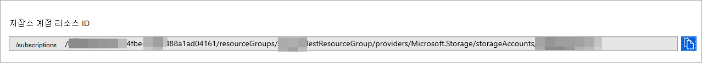
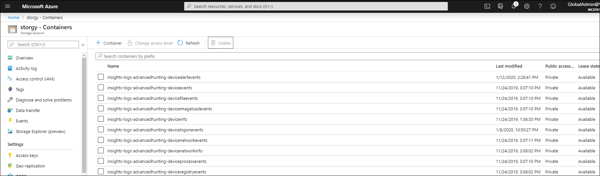

# <a name="configure-microsoft-defender-for-endpoint-to-stream-advanced-hunting-events-to-your-storage-account"></a>고급 헌팅 이벤트를 사용자 계정으로 스트리밍하도록 끝점에 대한 Microsoft Defender Storage 구성

[!INCLUDE [Microsoft 365 Defender rebranding](../../includes/microsoft-defender.md)]


**적용 대상:**
- [엔드포인트용 Microsoft Defender](https://go.microsoft.com/fwlink/?linkid=2154037)

> Endpoint용 Defender를 경험하고 싶나요? [무료 평가판을 신청하세요.](https://signup.microsoft.com/create-account/signup?products=7f379fee-c4f9-4278-b0a1-e4c8c2fcdf7e&ru=https://aka.ms/MDEp2OpenTrial?ocid=docs-wdatp-configuresiem-abovefoldlink)

## <a name="before-you-begin"></a>시작하기 전에

1. [테넌트에서 Storage 계정을](/azure/storage/common/storage-account-overview) 만들 수 있습니다.

2. [Azure](https://ms.portal.azure.com/)테넌트에 로그인하고, **Microsoft.insights에 등록할 >** 구독 > 리소스 공급자로 > 로 이동하세요.

## <a name="enable-raw-data-streaming"></a>원시 데이터 스트리밍 사용

1. * 전역 관리자 **_** 또는 _* 보안 관리자 **로 끝점 포털용 [Microsoft Defender에](https://securitycenter.windows.com) _로그인합니다._

2. 에서 [데이터 내보내기 설정](https://securitycenter.windows.com/interoperability/dataexport) 페이지로 Microsoft Defender 보안 센터.

3. 데이터 **내보내기 설정 추가를 클릭합니다.**

4. 새 설정의 이름을 선택합니다.

5. 에 **전달 이벤트를 Azure Storage.**

6. 계정 Storage **ID를 입력합니다.** 계정 리소스 **ID를 Storage** Azure [Portal](https://ms.portal.azure.com/) 속성 탭의 Storage 계정 페이지로 이동하여 계정 리소스 ID의 Storage \> \> **복사합니다.**

   

7. 스트리밍할 이벤트를 선택하고 저장을 **클릭합니다.**

## <a name="the-schema-of-the-events-in-the-storage-account"></a>이벤트 계정의 이벤트 Storage

- 각 이벤트 유형에 대해 Blob 컨테이너가 만들어집니다.

  

- Blob에 있는 각 행의 Schema는 다음과 같은 JSON입니다.

  ```json
  {
          "time": "<The time WDATP received the event>"
          "tenantId": "<Your tenant ID>"
          "category": "<The Advanced Hunting table name with 'AdvancedHunting-' prefix>"
          "properties": { <WDATP Advanced Hunting event as Json> }
  }
  ```

- 각 Blob에는 여러 행이 포함되어 있습니다.

- 각 행에는 이벤트 이름, Endpoint용 Defender가 이벤트를 수신한 시간, 해당 이벤트가 속한 테넌트(테넌트에서 이벤트만 수신) 및 JSON 형식의 이벤트가 "properties"라는 속성으로 포함되어 있습니다.

- 끝점 이벤트용 Microsoft Defender 이벤트의 schema에 대한 자세한 내용은 고급 헌팅 [개요를 참조하세요.](advanced-hunting-overview.md)

- 고급 헌팅에서 **DeviceInfo** 테이블에는 장치 그룹이 포함된 **MachineGroup이라는** 열이 있습니다. 여기에서 모든 이벤트도 이 열로 장식됩니다. 자세한 [내용은 장치 그룹을](machine-groups.md) 참조하세요.

## <a name="data-types-mapping"></a>데이터 형식 매핑

이벤트 속성에 대한 데이터 형식을 얻기 위해 다음을 합니다.

1. 로그인하여 [](https://securitycenter.windows.com) Microsoft Defender 보안 센터 [헌팅 페이지로 이동합니다.](https://securitycenter.windows.com/hunting-package)

2. 다음 쿼리를 실행하여 각 이벤트에 대한 데이터 형식 매핑을 구합니다.

   ```kusto
   {EventType}
   | getschema
   | project ColumnName, ColumnType
   ```

- 장치 정보 이벤트의 예는 다음과 같습니다.

  

## <a name="related-topics"></a>관련 항목

- [고급 헌팅 개요](advanced-hunting-overview.md)
- [끝점 스트리밍 API용 Microsoft Defender](raw-data-export.md)
- [Azure 저장소 계정으로 Endpoint용 Microsoft Defender 이벤트 스트림](raw-data-export-storage.md)
- [Azure Storage 계정 설명서](/azure/storage/common/storage-account-overview)