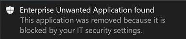

# <a name="take-response-actions-on-a-file"></a>파일에 대해 대응 조치 실행

[!INCLUDE [Microsoft 365 Defender rebranding](../../includes/microsoft-defender.md)]


**적용 대상:**
- [엔드포인트용 Microsoft Defender](https://go.microsoft.com/fwlink/?linkid=2154037)

[!include[Prerelease information](../../includes/prerelease.md)]

> Endpoint용 Defender를 경험하고 싶나요? [무료 평가판을 신청하세요.](https://signup.microsoft.com/create-account/signup?products=7f379fee-c4f9-4278-b0a1-e4c8c2fcdf7e&ru=https://aka.ms/MDEp2OpenTrial?ocid=docs-wdatp-responddile-abovefoldlink)

파일을 중지 및 차단하거나 파일을 차단하여 감지된 공격에 신속하게 대응합니다. 파일에 대한 작업을 수행한 후 작업 센터에서 활동 세부 정보를 확인할 수 있습니다.

응답 작업은 파일의 자세한 프로필 페이지에서 사용할 수 있습니다. 이 페이지에서는 새 파일 페이지를 전환하여 새 페이지 레이아웃과 이전 페이지 레이아웃 간에 **전환할 수 있습니다.** 이 문서의 나머지에서는 새로운 페이지 레이아웃에 대해 설명합니다.

응답 작업은 파일 페이지 위쪽을 따라 실행하고 다음을 포함합니다.

- 파일 중지 및 Quarantine
- 표시기 추가
- 파일 다운로드
- 위협 전문가에게 문의
- 알림 센터 

또한 심층 분석을 위해 파일을 제출하여 안전한 클라우드 샌드박스에서 파일을 실행할 수 있습니다. 분석이 완료되면 파일의 동작에 대한 정보를 제공하는 자세한 보고서가 표시됩니다. 심층 분석을 위해 파일을 제출하고 심층 분석 탭을 선택하여 지난 보고서를 읽을 **수** 있습니다. 파일 정보 카드 아래에 있습니다.

일부 작업을 수행하려면 특정 사용 권한이 필요합니다. 다음 표에서는 PE(이식 가능한 실행 파일) 및 PE가 아닌 파일에 대해 특정 사용 권한이 취할 수 있는 작업을 설명하고 있습니다.

<br>

****

|사용 권한|PE 파일|PE가 아닌 파일|
|---|:---:|:---:|
|데이터 보기|X|X 키|
|경고 조사|&#x2611;|X 키|
|실시간 응답 기본|X|X 키|
|실시간 응답 고급|&#x2611;|&#x2611;|
|

역할에 대한 자세한 내용은 역할 기반 액세스 제어에 대한 역할 [만들기 및 관리를 참조하세요.](user-roles.md)

## <a name="stop-and-quarantine-files-in-your-network"></a>네트워크에서 파일 중지 및 격리

악의적인 프로세스를 중지하고 파일이 관찰된 파일을 대리하여 조직에서 공격을 포함할 수 있습니다.

> [!IMPORTANT]
> 이 작업은 다음의 경우만 취할 수 있습니다.
>
> - 작업을 수행 중인 장치가 버전 1703 이상에서 Windows 10 실행 중입니다.
> - 파일이 신뢰할 수 있는 타사 게시자에 속하지 않는 경우 또는 Microsoft에서 서명하지 않은 경우
> - Microsoft Defender 바이러스 백신 수동 모드에서 실행해야 합니다. 자세한 내용은 호환성 [Microsoft Defender 바이러스 백신 참조하세요.](/windows/security/threat-protection/microsoft-defender-antivirus/microsoft-defender-antivirus-compatibility)

파일 중지 및 **Quarantine 작업으로는** 실행 중인 프로세스를 중지하고, 파일을 검지하고, 레지스트리 키와 같은 영구 데이터를 삭제하는 작업이 포함됩니다.

이 작업은 지난 30일 동안 Windows 10 버전 1703 이상이 있는 장치에 적용됩니다.

> [!NOTE]
> 파일을 무단으로 복원할 수 있습니다.

### <a name="stop-and-quarantine-files"></a>파일 중지 및 검지

1. 중지하고 검사할 파일을 선택합니다. 다음 보기에서 파일을 선택하거나 검색 상자를 사용할 수 있습니다.

   - **경고** - 경고 스토리 타임라인의 설명 또는 세부 정보에서 해당 링크를 클릭합니다.
   - **검색 상자** - **드롭다운** 메뉴에서 파일을 선택하고 파일 이름을 입력합니다.

   > [!NOTE]
   > 파일 중지 및 검지 작업은 최대 1,000개 장치로 제한됩니다. 더 많은 수의 장치에서 파일을 중지하기 위해 표시기 추가를 참조하여 파일을 [차단하거나 허용합니다.](#add-indicator-to-block-or-allow-a-file)

2. 위쪽 표시줄로 이동하여 파일 중지 **및 Quarantine 을 선택합니다.**

   

3. 이유를 지정한 다음 확인 을 **선택합니다.**

   

   Action Center에는 제출 정보가 표시됩니다.

   

   - **제출 시간** - 작업이 제출된 시간을 보여줍니다.
   - **Success** - 파일이 중지 및 대리된 장치 수를 보여 주며,
   - **Failed** - 작업이 실패한 장치 수와 실패에 대한 세부 정보를 보여줍니다.
   - **보류** 중 - 파일이 아직 중지 및 중단되지 않은 장치 수를 보여줍니다. 디바이스가 오프라인 상태이거나 네트워크에 연결되지 않은 경우 시간이 걸릴 수 있습니다.

4. 상태에 대한 자세한 정보를 확인하려면 상태 표시기를 선택합니다. 예를 들어 **실패를** 선택하여 작업이 실패한 위치를 볼 수 있습니다.

#### <a name="notification-on-device-user"></a>장치 사용자에 대한 알림

장치에서 파일을 제거하면 다음 알림이 표시됩니다.



장치 타임라인에서 파일이 중지 및 중단된 각 장치에 대해 새 이벤트가 추가됩니다.

조직 전체에서 널리 사용되는 파일에 대한 작업을 구현하기 전에 경고가 표시됩니다. 작업이 의도된지 유효성을 검사하는 것입니다.

## <a name="restore-file-from-quarantine"></a>격리로부터 파일 복원

조사 후에 파일이 정리된 것으로 판단되면 파일을 롤백하고 검지에서 제거할 수 있습니다. 파일이 중단된 각 디바이스에서 다음 명령을 실행합니다.

1. 디바이스에서 상승된 명령줄 프롬프트를 니다.

   1. **시작**(으)로 이동하고 _cmd_ 를 입력하십시오.

   1. **명령 프롬프트** 을(를) 마우스 오른쪽 버튼으로 클릭하고 **관리자**(으)로 실행을 선택합니다.

2. 다음 명령을 입력하고 **Enter를 누를 수 있습니다.**

   ```dos
   "%ProgramFiles%\Windows Defender\MpCmdRun.exe" -Restore -Name EUS:Win32/CustomEnterpriseBlock -All
   ```

   > [!NOTE]
   > 일부 시나리오에서는 **ThreatName이** EUS:Win32/CustomEnterpriseBlock!cl과 같은 것으로 나타날 수 있습니다.
   >
   > Endpoint용 Defender는 지난 30일 동안 이 장치에서 차단된 모든 사용자 지정 차단 파일을 복원합니다.

> [!IMPORTANT]
> 잠재적인 네트워크 위협으로 고지된 파일은 복구할 수 없습니다. 사용자가 파일을 검지 후에 복원하려고 시도하면 해당 파일에 액세스할 수 없습니다. 시스템에 파일에 액세스하기 위한 네트워크 자격 증명이 더 이상 필요하기 때문일 수 있습니다. 일반적으로 시스템 또는 공유 폴더에 일시적으로 로그온하고 액세스 토큰이 만료된 결과입니다.

## <a name="download-or-collect-file"></a>파일 다운로드 또는 수집

응답 **작업에서** 파일 다운로드를 선택하면 파일이 포함된 로컬 암호로 보호된 .zip 다운로드할 수 있습니다. 파일을 다운로드하는 이유를 기록하고 암호를 설정할 수 있는 플라이아웃이 나타납니다.

기본적으로는 검지된 파일을 다운로드할 수 있습니다.


### <a name="download-quarantined-files"></a>quarantined files 다운로드

사용자 또는 보안 팀에서 Microsoft Defender 바이러스 백신 샘플 제출 구성에 따라 규격 방식으로 [저장되는](enable-cloud-protection-microsoft-defender-antivirus.md)파일입니다. 보안 팀은 "파일 다운로드" 단추를 통해 파일의 세부 정보 페이지에서 직접 파일을 다운로드할 수 있습니다. **이 미리 보기 기능은 기본적으로 '켜기'로 설정되어 있습니다.**

위치는 조직의 지리적 설정(EU, 영국 또는 미국)에 따라 다를 수 있습니다. 분리된 파일은 조직당 한 번만 수집됩니다. Service Trust Portal에서 Microsoft의 데이터 보호에 대한 자세한 내용은 을(를) 통해 자세히 알아보아야 https://aka.ms/STP 합니다.

이 설정을 설정하면 보안 팀이 잠재적으로 잘못된 파일을 검사하고 인시던트의 위험을 덜 위험하게 빠르게 조사하는 데 도움이 될 수 있습니다. 그러나 이 설정을 해제해야 하는 경우  끝점 고급 기능 설정 파일 다운로드로 이동하여 설정을 \>  \>  \>  조정합니다. [고급 기능에 대해 자세히 알아보시다](advanced-features.md)

#### <a name="backing-up-quarantined-files"></a>고지된 파일 백업

샘플 제출 구성에 따라 사용자에게 검사된 파일을 백업하기 전에 명시적 동의를 제공하라는 메시지가 표시될 [수 있습니다.](enable-cloud-protection-microsoft-defender-antivirus.md#use-group-policy-to-turn-on-cloud-protection)

샘플 제출이 꺼져 있는 경우 이 기능이 작동하지 않습니다. 자동 샘플 제출이 사용자의 사용 권한을 요청하도록 설정되어 있는 경우 사용자가 보내기에 동의한 샘플만 수집됩니다.

> [!IMPORTANT]
> 다음을 통해 quarantined file requirements을 다운로드합니다.
>
> - 조직에서 활성 Microsoft Defender 바이러스 백신 사용
> - 바이러스 백신 엔진 버전은 1.1.17300.4 이상입니다. 월별 [플랫폼 및 엔진 버전 참조](manage-updates-baselines-microsoft-defender-antivirus.md#monthly-platform-and-engine-versions)
> - 클라우드 기반 보호를 사용할 수 있습니다. 클라우드 [제공 보호 켜기 참조](enable-cloud-protection-microsoft-defender-antivirus.md)
> - 샘플 제출이 켜져 있습니다.
> - 장치에 Windows 10 버전 1703 이상 또는 Windows server 2016 또는 2019 또는 Windows Server 2022가 있습니다.

### <a name="collect-files"></a>파일 수집

파일이 끝점용 Microsoft Defender에 아직 저장되어 있지 않은 경우 다운로드할 수 없습니다. 대신 동일한 위치에 파일  수집 단추가 표시됩니다. 지난 30일 동안 조직에 파일이 없는 경우 파일  수집을 사용할 수 없습니다.
> [!Important]
> 잠재적인 네트워크 위협으로 고지된 파일은 복구할 수 없습니다. 사용자가 파일을 검지 후에 복원하려고 시도하면 해당 파일에 액세스할 수 없습니다. 시스템에 파일에 액세스하기 위한 네트워크 자격 증명이 더 이상 필요하기 때문일 수 있습니다. 일반적으로 시스템 또는 공유 폴더에 일시적으로 로그온하고 액세스 토큰이 만료된 결과입니다.

## <a name="add-indicator-to-block-or-allow-a-file"></a>파일을 차단하거나 허용하는 표시기 추가

잠재적으로 악의적인 파일 또는 의심되는 맬웨어를 금지하여 조직에서 공격이 추가로 전파되는 것을 방지합니다. 잠재적으로 악의적인 PE(이식 가능한 실행 파일) 파일을 알고 있는 경우 해당 파일을 차단할 수 있습니다. 이 작업을 수행하면 조직의 장치에서 읽고 쓰거나 실행할 수 없습니다.

> [!IMPORTANT]
>
> - 이 기능은 조직에서 클라우드 제공 보호를 사용하도록 Microsoft Defender 바이러스 백신 경우 사용할 수 있습니다. 자세한 내용은 클라우드 제공 보호 [관리를 참조하세요.](/windows/security/threat-protection/microsoft-defender-antivirus/deploy-manage-report-microsoft-defender-antivirus)
>
> - 맬웨어 방지 클라이언트 버전은 4.18.1901.x 이상입니다.
> - 이 기능은 의심되는 맬웨어(또는 악성 파일)가 웹에서 다운로드되지 않도록 디자인되었습니다. 현재 이식 가능한 PE(이식 가능한 실행 파일) 파일을.exe _.dll_ _있습니다._ 적용 범위는 시간이 지날 때 연장됩니다.
> - 이 응답 작업은 버전 1703 Windows 10 장치에 사용할 수 있습니다.
> - 허용 또는 차단 작업 전에 파일의 분류가 디바이스 캐시에 있는 경우 파일에서 허용 또는 차단 기능을 사용할 수 없습니다.

> [!NOTE]
> 이 작업을 수행하려면 PE 파일이 장치 타임라인에 있습니다.
>
> 작업을 수행한 시간과 차단되는 실제 파일 사이에 몇 분의 대기 시간이 있을 수 있습니다.

### <a name="enable-the-block-file-feature"></a>파일 차단 기능 사용

파일 차단을 시작하려면 먼저 [  ](advanced-features.md) 차단 또는 허용 기능을 설정해야 설정.

### <a name="allow-or-block-file"></a>파일 허용 또는 차단

파일에 대한 표시기 해시를 추가할 때 조직의 장치가 파일을 실행하려고 할 때마다 경고를 발생하고 파일을 차단할 수 있습니다.

표시기에서 자동으로 차단되는 파일은 파일의 알림 센터에 표시되지 않지만 경고 큐에 계속 표시됩니다.

파일에 [대한](manage-indicators.md) 경고 차단 및 발생에 대한 자세한 내용은 표시기 관리를 참조합니다.

파일 차단을 중지하려면 표시기를 제거합니다. 파일의 프로필 페이지에서  표시기 편집 작업을 통해 이 작업을 할 수 있습니다. 이 작업은 표시기를 추가하기 전에  지표 추가 작업과 동일한 위치에 표시됩니다.

규칙 표시기 **의** 설정 **표시기를** \> **편집할 수도 있습니다.** 표시기는 파일의 해시에 의해 이 영역에 나열됩니다.

## <a name="consult-a-threat-expert"></a>위협 전문가에게 문의

잠재적으로 손상된 장치 또는 이미 손상된 장치에 대한 자세한 내용은 Microsoft 위협 전문가에게 문의하세요. Microsoft 위협 전문가 정확한 응답을 위해 Microsoft 365 Defender 포털 내에서 직접 연결됩니다. 전문가는 잠재적으로 손상된 장치에 대한 인사이트를 제공하고 복잡한 위협 및 대상 공격 알림을 이해하는 데 도움이 됩니다. 또한 포털 대시보드에서 경고 또는 위협 인텔리전스 컨텍스트에 대한 정보를 제공할 수 있습니다.

자세한 [내용은 Microsoft Threat Expert를](/microsoft-365/security/defender-endpoint/configure-microsoft-threat-experts#consult-a-microsoft-threat-expert-about-suspicious-cybersecurity-activities-in-your-organization) 참조합니다.

## <a name="check-activity-details-in-action-center"></a>알림 센터에서 활동 세부 정보 확인

관리 **센터는** 장치 또는 파일에서 수행된 작업에 대한 정보를 제공합니다. 다음 세부 정보를 볼 수 있습니다.

- 조사 패키지 컬렉션
- 바이러스 백신 검사
- 앱 제한
- 장치 고리

제출 날짜/시간, 사용자 제출, 작업 성공 또는 실패와 같은 기타 모든 관련 세부 정보도 표시됩니다.


## <a name="deep-analysis"></a>심층 분석

사이버 보안 조사는 일반적으로 경고에 의해 트리거됩니다. 경고는 종종 신규 또는 알 수 없는 관찰된 하나 이상의 파일과 관련이 있습니다. 파일을 선택하면 파일의 메타데이터를 볼 수 있는 파일 보기로 연결됩니다. 파일과 관련된 데이터를 보강하기 위해 심층 분석을 위해 파일을 제출할 수 있습니다.

심층 분석 기능은 완전하게 계측된 안전한 클라우드 환경에서 파일을 실행합니다. 심층 분석 결과에는 파일의 활동, 관찰된 동작 및 연결된 아티팩트(예: 삭제된 파일, 레지스트리 수정, IP와의 통신)가 표시됩니다.
현재 심층 분석은 PE(이식 가능한 실행 파일) 파일(파일 및 파일 _포함)에_ 대한 광범위한.exe _.dll_ 지원됩니다.

파일을 심층 분석하는 데 몇 분 정도 걸립니다. 파일 분석이 완료되면 심층 분석 탭이 업데이트되어 사용 가능한 최신 결과의 요약과 날짜 및 시간이 표시됩니다.

심층 분석 요약에는 관찰된 동작 목록이 포함되어 있으며, 그 중 일부는 악의적인 활동 및 관찰 가능 항목(디스크에 만들어진 연락처된 IP 및 파일 포함)을 나타낼 수 있습니다. 아무 것도 발견하지 못하면 이러한 섹션에 간단한 메시지가 표시됩니다.

심층 분석 결과는 위협 인텔리전스와 일치하며 일치하면 적절한 경고가 생성됩니다.

심층 분석 기능을 사용하여 일반적으로 경고 조사 중에 또는 악의적인 동작이 의심되는 다른 이유로 파일의 세부 정보를 조사합니다. 이 기능은 파일의  프로필 페이지에서 심층 분석 탭에서 사용할 수 있습니다.

> [!VIDEO https://www.microsoft.com/videoplayer/embed/RE4aAYy?rel=0]

 파일을 Endpoint 백 엔드용 Defender 샘플 컬렉션에서 사용할 수 있는 경우 또는 심층 분석 제출을 지원하는 Windows 10 장치에서 파일을 관찰한 경우 심층 분석을 위한 제출을 사용할 수 있습니다.

> [!NOTE]
> 모든 파일의 Windows 10 자동으로 수집할 수 있습니다.

파일에서 파일이 관찰되지 않은 경우 [Microsoft](https://www.microsoft.com/security/portal/submission/submit.aspx) 보안 센터 포털을 통해 샘플을 제출할 Windows 10  심층 분석 단추가 제공될 때까지 기다릴 수 있습니다.

> [!NOTE]
> Microsoft 보안 센터 포털의 백 엔드 처리 흐름으로 인해 파일 전송과 Endpoint용 Defender의 심층 분석 기능 가용성 사이에 최대 10분이 지연될 수 있습니다.

### <a name="submit-files-for-deep-analysis"></a>심층 분석을 위한 파일 제출

1. 심층 분석을 위해 제출할 파일을 선택합니다. 다음 보기에서 파일을 선택하거나 검색할 수 있습니다.

    - **경고** - 경고 스토리 타임라인의 **설명** 또는 **세부 정보에서** 파일 링크를 선택합니다.
    - **장치 목록** - 조직 내  장치 섹션의 설명 또는 세부 정보 섹션에서 **파일** 링크 **선택**
    - **검색 상자** - **드롭다운** 메뉴에서 파일을 선택하고 파일 이름을 입력합니다.

2. 파일 **보기의** 심층 분석 탭에서 제출을 **선택합니다.**

   

   > [!NOTE]
   > PE 파일만 _지원됩니다(파일_ 및.exe _.dll_ 포함).

   진행률 표시줄이 표시되고 다양한 분석 단계에 대한 정보를 제공합니다. 그런 다음 분석이 완료되면 보고서를 볼 수 있습니다.

> [!NOTE]
> 디바이스 가용성에 따라 샘플 수집 시간이 다를 수 있습니다. 샘플 수집에는 3시간의 시간 제한이 있습니다. 이때 장치 보고를 위해 온라인 Windows 10 컬렉션이 실패하고 작업이 다시 표시됩니다. 심층 분석을 위해 파일을 다시 제출하여 파일에 대한 새 데이터를 얻을 수 있습니다.

### <a name="view-deep-analysis-reports"></a>심층 분석 보고서 보기

제공된 심층 분석 보고서를 보고 제출한 파일에 대한 자세한 정보를 볼 수 있습니다. 이 기능은 파일 보기 컨텍스트에서 사용할 수 있습니다.

다음 섹션에 대한 세부 정보를 제공하는 포괄적인 보고서를 볼 수 있습니다.

- 동작
- 관찰용

제공된 세부 정보는 잠재적인 공격의 표시가 있는 경우 조사하는 데 도움이 될 수 있습니다.

1. 심층 분석을 위해 제출한 파일을 선택합니다.
2. 심층 **분석 탭을** 선택합니다. 이전 보고서가 있는 경우 보고서 요약이 이 탭에 표시됩니다.

    

#### <a name="troubleshoot-deep-analysis"></a>심층 분석 문제 해결

파일을 제출할 때 문제가 발생하면 다음 문제 해결 단계를 각각 시도해 하세요.

1. 해당 파일이 PE 파일인지 확인 PE 파일에는 일반적으로 _.exe_ 또는.dll확장명(실행 프로그램 또는 응용 프로그램)이 있습니다. 

2. 서비스에 파일에 대한 액세스 권한이 있으며, 파일이 여전히 존재하며, 손상되거나 수정되지 않은지 확인

3. 잠시 기다렸다가 파일을 다시 제출합니다. 큐가 가득 차거나 일시적인 연결 또는 통신 오류가 발생했습니다.

4. 샘플 수집 정책이 구성되지 않은 경우 기본 동작은 샘플 수집을 허용하는 것입니다. 구성된 경우 파일을 다시 제출하기 전에 정책 설정에서 샘플 수집을 허용하는지 확인해야 합니다. 샘플 컬렉션이 구성되면 다음 레지스트리 값을 검사합니다.

    ```text
    Path: HKLM\SOFTWARE\Policies\Microsoft\Windows Advanced Threat Protection
    Name: AllowSampleCollection
    Type: DWORD
    Hexadecimal value :
      Value = 0 - block sample collection
      Value = 1 - allow sample collection
    ```

5. 그룹 정책을 통해 조직 구성 단위를 변경합니다. 자세한 내용은 [그룹 정책으로 구성을 참조하세요.](configure-endpoints-gp.md)

6. 이러한 단계로 문제가 해결되지 않으면 에 [winatp@microsoft.com.](mailto:winatp@microsoft.com)

## <a name="related-topics"></a>관련 항목

- [장치에 대해 대응 조치 실행](respond-machine-alerts.md)
- [파일 조사](investigate-files.md)
- [끝점 계획 1용 Microsoft Defender의 수동 응답 작업(미리 보기)](defender-endpoint-plan-1.md#manual-response-actions)
