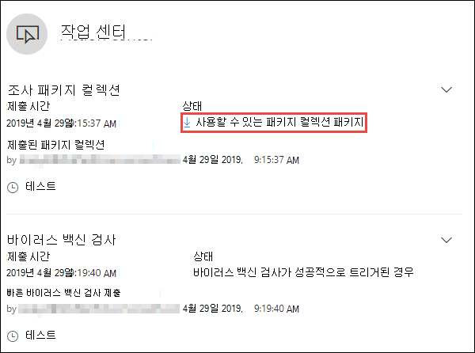
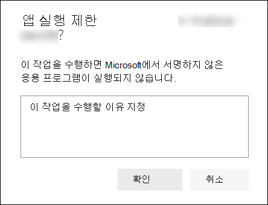
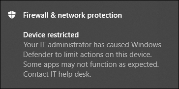
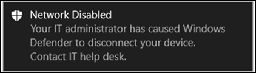

# 장치에 대해 대응 조치 실행

[!INCLUDE [Microsoft 365 Defender rebranding](../../includes/microsoft-defender.md)]

**적용 대상:**
- [엔드포인트용 Microsoft Defender](https://go.microsoft.com/fwlink/?linkid=2154037)

> Endpoint용 Defender를 경험하고 싶나요? [무료 평가판을 신청하세요.](https://signup.microsoft.com/create-account/signup?products=7f379fee-c4f9-4278-b0a1-e4c8c2fcdf7e&ru=https://aka.ms/MDEp2OpenTrial?ocid=docs-wdatp-respondmachine-abovefoldlink)

장치를 고르거나 조사 패키지를 수집하여 감지된 공격에 신속하게 대응합니다. 장치에 대한 작업을 수행한 후, 작업 센터에서 활동 세부 정보를 확인할 수 있습니다.

응답 작업은 특정 장치 페이지의 위쪽을 따라 실행하고 다음을 포함합니다.

- 태그 관리
- 자동화된 조사 시작
- 실시간 응답 세션 시작
- 조사 패키지 수집
- 바이러스 백신 검사 실행
- 앱 실행 제한
- 디바이스 격리
- 위협 전문가에게 문의
- 알림 센터 

 다음 보기에서 장치 페이지를 찾을 수 있습니다.

- **보안 작업 대시보드** - 위험 카드의 장치에서 장치 이름을 선택합니다.
- **경고 큐** - 경고 큐에서 디바이스 아이콘 옆에 있는 디바이스 이름을 선택하세요.
- **장치 목록** - 장치 목록에서 장치 이름의 제목을 선택합니다.
- **검색 상자** - 드롭다운 메뉴에서 디바이스를 선택하고 디바이스 이름을 입력하세요.

> [!IMPORTANT]
>
> - 이러한 응답 작업은 Windows 10, 버전 1703 이상, Windows 11, Windows Server 2019 및 Windows Server 2022의 장치에만 사용할 수 있습니다.
> - 비영리 Windows 플랫폼의 경우 응답 기능(예: 장치 고리)은 타사 기능에 따라 달라집니다.
> - Microsoft 자사 에이전트의 경우 최소 OS 요구 사항에 대한 각 기능 아래의 "추가 정보" 링크를 참조하세요.

## 태그 관리

태그를 추가하거나 관리하여 논리 그룹 소속을 만들 수 있습니다. 디바이스 태그는 네트워크의 적절한 매핑을 지원하므로 다양한 태그를 연결하여 컨텍스트를 캡처하고 인시던트 일부로 동적 목록 만들기를 사용하도록 설정할 수 있습니다.

장치 태그 지정에 대한 자세한 내용은 장치 태그 [만들기 및 관리를 참조하세요.](machine-tags.md)

## 자동화된 조사 시작

필요한 경우 디바이스에서 새로운 일반 목적의 자동화된 조사를 시작할 수 있습니다. 조사가 실행되는 동안 장치에서 생성된 다른 모든 경고는 해당 조사가 완료될 때까지 진행 중인 자동화된 조사에 추가됩니다. 또한 다른 장치에서 동일한 위협이 있는 경우 해당 장치가 조사에 추가됩니다.

자동화된 조사에 대한 자세한 내용은 [Overview of Automated investigations를 참조하십시오.](automated-investigations.md)

## 라이브 응답 세션 시작

실시간 응답은 원격 셸 연결을 사용하여 장치에 즉시 액세스할 수 있는 기능입니다. 이를 통해 심층 조사 작업을 수행하고 즉각적인 대응 조치를 취하여 식별된 위협을 실시간으로 즉시 포함할 수 있습니다.

실시간 대응은 사용자가 법의적 데이터를 수집하고, 스크립트를 실행하고, 분석을 위해 의심스러운 엔터티를 보내고, 위협을 수정하고, 새로운 위협에 대한 사전 대응적 헌팅을 할 수 있도록 하여 조사를 강화하도록 고안된 것입니다.

라이브 응답에 대한 자세한 내용은 라이브 응답을 사용하여 디바이스에서 [엔터티 조사를 참조하세요.](live-response.md)

## 장치에서 조사 패키지 수집

조사 또는 응답 프로세스의 일부로 장치에서 조사 패키지를 수집할 수 있습니다. 조사 패키지를 수집하면 장치의 현재 상태를 식별하고 공격자가 사용하는 도구와 기술을 추가로 이해할 수 있습니다.

> [!IMPORTANT]
>
>이러한 작업은 현재 macOS 및 Linux에서 지원되지 않습니다. 라이브 응답을 사용하여 작업을 실행합니다. 라이브 응답에 대한 자세한 내용은 라이브 응답을 사용하여 디바이스에서 [엔터티 조사를 참조하세요.](live-response.md)

패키지(Zip 파일)를 다운로드하고 장치에서 발생한 이벤트를 조사하려면

1. 디바이스 **페이지 맨** 위에 있는 응답 작업 행에서 조사 패키지 수집을 선택합니다.
2. 텍스트 상자에서 이 작업을 수행할 이유를 지정합니다. **확인** 을 선택합니다.
3. zip 파일이 다운로드됩니다.

대체 방법:

1. 디바이스 **페이지의 응답** 작업 섹션에서 동작 센터를 선택합니다.

    

2. Action Center 플라이아웃에서 zip 파일을 **다운로드할** 수 있는 패키지 컬렉션 패키지를 선택합니다.

    

패키지에는 다음 폴더가 포함되어 있습니다.

 

****

|폴더|설명|
|---|---|
|자동 런|각각 디바이스에서 공격자 지속성을 식별하는 데 도움이 되는 알려진 ASEP(자동 시작 진입점)의 레지스트리 콘텐츠를 나타내는 파일 집합이 포함되어 있습니다. 
 
<b>참고:</b> 레지스트리 키를 찾을 수 없는 경우 파일에 "오류: 시스템에서 지정된 레지스트리 키 또는 값을 찾을 수 없습니다."라는 메시지가 표시됩니다.
|
|설치된 프로그램|이 .CSV 파일에는 장치에 현재 설치된 프로그램을 식별하는 데 도움이 되는 설치된 프로그램 목록이 포함되어 있습니다. 자세한 내용은 클래스 [Win32_Product 참조하세요.](https://go.microsoft.com/fwlink/?linkid=841509)|
|네트워크 연결|이 폴더에는 의심스러운 URL, 공격자 명령 및 제어(C&C) 인프라, 측면 이동 또는 원격 연결에 대한 연결을 식별하는 데 도움이 되는 연결 정보와 관련된 데이터 포인트 집합이 포함되어 있습니다. <ul><li>ActiveNetConnections.txt: 프로토콜 통계 및 현재 TCP/IP 네트워크 연결을 표시됩니다. 프로세스에서 만들어지는 의심스러운 연결을 찾아 볼 수 있는 기능을 제공합니다.</li><li>Arp.txt: 모든 인터페이스에 대한 현재 ARP(주소 확인 프로토콜) 캐시 테이블을 표시됩니다. ARP 캐시는 네트워크의 손상되거나 의심스러운 네트워크의 다른 호스트가 내부 공격을 실행하기 위해 사용될 수 있는 것으로 의심스러워할 수 있습니다.</il><li>DnsCache.txt: 로컬 Hosts 파일에서 미리 로드된 항목과 컴퓨터에서 확인된 이름 쿼리에 대해 최근에 획득한 리소스 레코드를 모두 포함하는 DNS 클라이언트 확인자 캐시의 내용을 표시됩니다. 이는 의심스러운 연결을 식별하는 데 도움이 될 수 있습니다.</li><li>IpConfig.txt: 모든 어댑터에 대한 전체 TCP/IP 구성을 표시됩니다. 어댑터는 설치된 네트워크 어댑터와 같은 물리적 인터페이스나 전화 접속 연결과 같은 논리적 인터페이스를 표현할 수 있습니다.</li><li>FirewallExecutionLog.txt 및 pfirewall.log</li></ul>

<b>참고:</b> pfirewall.log 파일은 %windir%\system32\logfiles\firewall\pfirewall.log에 있어야 조사 패키지에 포함됩니다. 방화벽 로그 파일을 만드는 데 대한 자세한 내용은 [Configure the Windows Defender Firewall with Advanced Security Log을 참조하십시오.](/windows/security/threat-protection/windows-firewall/configure-the-windows-firewall-log)
|
|프리포치 파일|Windows 프리포치 파일은 응용 프로그램 시작 프로세스의 속도를 향상하도록 디자인됩니다. 이 파일을 사용하여 최근에 시스템에서 사용된 모든 파일을 추적하고 삭제된 응용 프로그램에 대한 추적을 찾을 수 있지만 프리포치 파일 목록에서 계속 찾을 수 있습니다. <ul><li>프리피치 폴더: 의 프리포치 파일의 복사본을 `%SystemRoot%\Prefetch` 포함 참고: 프리포치 파일을 보기 위해 프리포치 파일 뷰어를 다운로드하는 것이 좋습니다.</li><li>PrefetchFilesList.txt: 프리피치 폴더에 대한 복사 오류가 발생했다는 기록을 추적하는 데 사용할 수 있는 복사된 모든 파일 목록이 포함되어 있습니다.</li></ul>|
|프로세스|실행 중인 .CSV 나열하는 파일과 디바이스에서 실행 중인 현재 프로세스를 식별하는 기능을 제공합니다. 이는 의심스러운 프로세스 및 상태를 식별할 때 유용할 수 있습니다.|
|예약된 작업|예약된 .CSV 목록이 들어 있습니다. 이 파일은 선택한 장치에서 자동으로 수행되는 루틴을 식별하여 자동으로 실행으로 설정된 의심스러운 코드를 확인하는 데 사용할 수 있습니다.|
|보안 이벤트 로그|로그인 또는 로그아웃 활동의 레코드 또는 시스템의 감사 정책에 지정된 기타 보안 관련 이벤트를 포함하는 보안 이벤트 로그가 들어 있습니다. 

<b>참고:</b> 이벤트 뷰어를 사용하여 이벤트 로그 파일을 열 수 있습니다.
|
|서비스|서비스 및 .CSV 나열하는 파일 포함|
|Windows SMB(서버 메시지 블록) 세션|파일, 프린터 및 직렬 포트에 대한 공유 액세스와 네트워크의 노드 간 기타 통신을 나열합니다. 이는 데이터 유출 또는 측면 이동을 식별하는 데 도움이 될 수 있습니다. 
 SMBInboundSessions 및 SMBOutboundSession용 파일이 들어 있습니다. 
 
<b>참고:</b> 세션(인바운드 또는 아웃바운드)이 없는 경우 SMB 세션을 찾을 수 없음을 설명하는 텍스트 파일이 표시됩니다.
|
|시스템 정보|OS SystemInformation.txt 네트워크 카드와 같은 시스템 정보를 나열하는 파일 형식이 들어 있습니다.|
|Temp Directories|시스템의 모든 사용자에 대해 %Temp%에 있는 파일을 나열하는 텍스트 파일 집합이 들어 있습니다. 
 이는 공격자가 시스템에 떨어뜨린 의심스러운 파일을 추적하는 데 도움이 될 수 있습니다. 
 
<b>참고:</b> 파일에 "시스템에서 지정된 경로를 찾을 수 없습니다."라는 메시지가 포함된 경우 이 사용자의 임시 디렉터리가 없음을 의미하며 사용자가 시스템에 로그인하지 않았기 때문에일 수 있습니다.
|
|사용자 및 그룹|각 그룹 및 해당 구성원을 나타내는 파일 목록을 제공합니다.|
|WdSupportLogs|다음 MpCmdRunLog.txt 및 MPSupportFiles.cab  
 
<b>참고:</b> 이 폴더는 2020년 2월 업데이트 롤업 이상이 설치된 Windows 10 버전 1709 이상에서만 만들어집니다. <ul><li>Win10 1709(RS3) 빌드 16299.1717: [KB4537816](https://support.microsoft.com/help/4537816/windows-10-update-kb4537816)</li><li>Win10 1803(RS4) 빌드 17134.1345: [KB4537795](https://support.microsoft.com/help/4537795/windows-10-update-kb4537795)</li><li>Win10 1809(RS5) 빌드 17763.1075: [KB4537818](https://support.microsoft.com/help/4537818/windows-10-update-kb4537818)</li><li>Win10 1903/1909(19h1/19h2) 빌드 18362.693 및 18363.693: [KB4535996](https://support.microsoft.com/help/4535996/windows-10-update-kb4535996)</li></ul> 
|
|CollectionSummaryReport.xls|이 파일은 조사 패키지 컬렉션의 요약으로, 데이터 포인트 목록, 데이터를 추출하는 데 사용되는 명령, 실행 상태, 오류가 있는 경우 오류 코드가 포함되어 있습니다. 이 보고서를 사용하여 패키지에 예상된 데이터가 모두 포함되어 있는지 추적하고 오류가 발생했습니다.를 확인할 수 있습니다.|
|

## 장치에서 Microsoft Defender 바이러스 백신 실행

조사 또는 응답 프로세스의 일부로 원격으로 바이러스 백신 검색을 시작하여 손상된 장치에 있을 수 있는 맬웨어를 식별하고 수정하는 데 도움을 줄 수 있습니다.

>[!IMPORTANT]
>- 이 작업은 현재 macOS 및 Linux에서 지원되지 않습니다. 라이브 응답을 사용하여 작업을 실행합니다. 라이브 응답에 대한 자세한 내용은 라이브 응답을 사용하여 디바이스에서 [엔터티 조사를 참조하세요.](live-response.md)
>- A Microsoft Defender 바이러스 백신(Microsoft Defender AV) 검사는 Microsoft Defender AV가 활성 바이러스 백신 솔루션인지 여부에 따라 다른 바이러스 백신 솔루션과 함께 실행할 수 있습니다. Microsoft Defender AV는 수동 모드일 수 있습니다. 자세한 내용은 호환성 [Microsoft Defender 바이러스 백신 참조하세요.](/windows/security/threat-protection/microsoft-defender-antivirus/microsoft-defender-antivirus-compatibility.md)

바이러스 백신 검사 실행을 선택한 경우 실행할 검사 유형(빠른 또는 전체)을 선택하고 스캔을 확인하기 전에 설명을 추가합니다.

작업 센터는 검사 정보를 표시하고 장치 타임라인에는 디바이스에 검사 작업이 제출된 경우를 반영하는 새 이벤트가 포함됩니다. Microsoft Defender AV 경고는 검사 중에 발견된 모든 검색을 반영합니다.

> [!NOTE]
> Endpoint 응답 작업을 위해 Defender를 사용하여 검색을 트리거할 때 Microsoft Defender 바이러스 백신 'ScanAvgCPULoadFactor' 값은 계속 적용하고 검사의 CPU 영향을 제한합니다.
>
> ScanAvgCPULoadFactor가 구성되지 않은 경우 기본값은 검사 중에 최대 CPU 부하의 50% 제한입니다.
>
> 자세한 내용은 [configure-advanced-scan-types-microsoft-defender-antivirus 을 참조하세요.](/windows/security/threat-protection/microsoft-defender-antivirus/configure-advanced-scan-types-microsoft-defender-antivirus)

## 앱 실행 제한

악의적인 프로세스를 중지하여 공격을 포함하는 것 외에도 장치를 잠그고 잠재적인 악성 프로그램이 실행되지 않도록 할 수도 있습니다.

>[!IMPORTANT]
> - 이 작업은 버전 1709 이상, Windows 10 버전 및 Windows 11 디바이스에서 사용할 수 Windows Server 2016. 
> - 이 기능은 조직에서 이 기능을 사용하는 Microsoft Defender 바이러스 백신.
> - 이 작업은 응용 프로그램 제어 Windows Defender 정책 형식 및 서명 요구 사항을 충족해야 합니다. 자세한 내용은 코드 무결성 정책 형식 및 [서명을 참조하세요.](/windows/security/threat-protection/windows-defender-application-control/use-code-signing-to-simplify-application-control-for-classic-windows-applications)

응용 프로그램의 실행을 제한하기 위해 Microsoft에서 발급한 인증서로 서명한 파일만 실행할 수 있는 코드 무결성 정책이 적용됩니다. 이 제한 방법은 공격자가 손상된 장치를 제어하고 추가 악의적인 활동을 수행하지 못하게 방지하는 데 도움이 될 수 있습니다.

> [!NOTE]
> 응용 프로그램 제한을 다시 실행하지 못하게 할 수 있습니다. 디바이스 페이지의 단추가 앱 제한 제거로 변경된 다음 앱 실행을 제한하는 단계와 동일한 단계를 수행합니다.

디바이스 페이지에서  앱 실행 제한을 선택한 후 설명을 입력하고 확인 을 **선택합니다.** 작업 센터에 검사 정보가 표시될 것입니다. 장치 타임라인에는 새 이벤트가 포함됩니다.

### 장치 사용자에 대한 알림

앱이 제한되면 사용자에게 앱이 실행되지 못하도록 제한되고 있는 것을 알리기 위해 다음 알림이 표시됩니다.

>[!NOTE]
>알림은 R2 및 Windows Server 2016 사용할 Windows Server 2012 없습니다.

## 네트워크에서 장치 격리

공격의 심각도 및 장치의 민감도에 따라 네트워크에서 장치를 격리할 수 있습니다. 이 작업은 공격자가 손상된 장치를 제어하고 데이터 유출 및 측면 이동과 같은 추가 작업을 수행하지 못하게 방지하는 데 도움이 될 수 있습니다.

>[!IMPORTANT]
>- 이 작업은 현재 macOS 및 Linux에서 지원되지 않습니다. 라이브 응답을 사용하여 작업을 실행합니다. 라이브 응답에 대한 자세한 내용은 라이브 응답을 사용하여 디바이스에서 [엔터티 조사를 참조하세요.](live-response.md)
>- Windows 10, 버전 1703, Windows 11, Windows Server 2019, Windows Server 2016, Windows Server 2012 R2 및 Windows Server 2022의 장치에서 전체 Windows 사용할 수 있습니다.
>- 선택적 사용은 버전 1709 이상에서 Windows 10 디바이스에 사용할 수 Windows 11.
>- 장치를 고지할 때 특정 프로세스 및 대상만 허용됩니다. 따라서 장치가 격리된 후 전체 VPN 터널 뒤에 있는 장치는 끝점용 Microsoft Defender 클라우드 서비스에 도달할 수 없습니다. Microsoft Defender for Endpoint 및 클라우드 기반 보호 관련 트래픽에 Microsoft Defender 바이러스 백신 분할 터널링 VPN을 사용하는 것이 좋습니다.

이 장치 분리 기능은 손상된 디바이스를 네트워크에서 분리하는 동시에 디바이스를 계속 모니터링하는 Endpoint용 Defender 서비스에 대한 연결을 유지 관리합니다.

버전 Windows 10 버전 1709 이상에서 네트워크 고리 수준을 더 많이 제어할 수 있습니다. 또한 연결, Outlook, Microsoft Teams 및 비즈니스용 Skype('선택적 고리')를 사용하도록 선택할 수도 있습니다.

> [!NOTE]
> 디바이스를 네트워크에 다시 연결할 수 있습니다. 디바이스 페이지의 단추가 해제 해제로 변경된 후 장치를 해제하는 단계와 동일한 단계를 수행합니다. 

장치 페이지에서 **장치** 격리를 선택한 후 설명을 입력하고 확인 을 **선택합니다.** 작업 센터에 검사 정보가 표시될 것입니다. 장치 타임라인에는 새 이벤트가 포함됩니다.

> [!NOTE]
> 디바이스가 네트워크에서 격리된 경우에도 끝점용 Defender 서비스에 계속 연결됩니다. Outlook 및 비즈니스용 Skype 통신을 사용하도록 선택한 경우 장치가 격리된 동안 사용자에게 통신할 수 있습니다.

### 장치 사용자에 대한 알림

장치가 격리 중이면 디바이스가 네트워크에서 격리되고 있는 것을 사용자에게 알리기 위해 다음 알림이 표시됩니다.

## 위협 전문가에게 문의

잠재적으로 손상된 장치 또는 이미 손상된 장치와 관련한 자세한 정보를 Microsoft 위협 전문가에게 문의할 수 있습니다. Microsoft 위협 전문가 정확한 응답을 위해 Microsoft Defender 보안 센터 내에서 직접 사용할 수 있습니다. 전문가는 잠재적으로 손상된 장치에 대한 정보 뿐만 아니라 복잡한 위협, 사용자가 수신하는 대상이 지정한 공격 알림 또는 알림에 대한 추가 정보가 필요한 경우 또는 포털 대시보드에서 볼 수 있는 위협 인텔리전스 컨텍스트를 보다 잘 이해하기 위해 정보를 제공합니다.

자세한 [내용은 Microsoft Threat Expert를](/microsoft-365/security/defender-endpoint/configure-microsoft-threat-experts#consult-a-microsoft-threat-expert-about-suspicious-cybersecurity-activities-in-your-organization) 참조합니다.

## 알림 센터에서 활동 세부 정보 확인

관리 **센터는** 장치 또는 파일에서 수행된 작업에 대한 정보를 제공합니다. 다음 세부 정보를 볼 수 있습니다.

- 조사 패키지 컬렉션
- 바이러스 백신 검사
- 앱 제한
- 장치 고리

제출 날짜/시간, 제출 사용자 및 작업이 성공 또는 실패한 경우와 같은 기타 모든 관련 세부 정보도 표시됩니다.

## 참고 항목

- [파일에 대해 대응 조치 실행](respond-file-alerts.md)
- [끝점 계획 1용 Microsoft Defender의 수동 응답 작업(미리 보기)](defender-endpoint-plan-1.md#manual-response-actions)
- [부정확성 보고](/microsoft-365/security/defender-endpoint/tvm-security-recommendation#report-inaccuracy)
