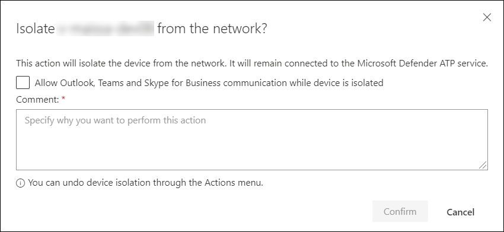

# 장치에 대해 대응 조치 실행

[!INCLUDE [Microsoft 365 Defender rebranding](../../includes/microsoft-defender.md)]

**적용 대상:**
- [엔드포인트용 Microsoft Defender](https://go.microsoft.com/fwlink/?linkid=2154037)

>엔드포인트에 대한 수비수를 경험하고 싶으십니까? [무료 평가판에 가입하십시오.](https://www.microsoft.com/microsoft-365/windows/microsoft-defender-atp?ocid=docs-wdatp-respondmachine-abovefoldlink) 

장치를 격리하거나 조사 패키지를 수집하여 탐지된 공격에 신속하게 대응합니다. 장치에서 조치를 취한 후 Action 센터에서 활동 세부 정보를 확인할 수 있습니다.

응답 작업은 특정 장치 페이지 상단을 따라 실행되며 다음을 포함합니다.

- 태그 관리
- 자동 조사 시작
- 실시간 응답 세션 시작
- 조사 패키지 수집
- 바이러스 백신 검사 실행
- 앱 실행 제한
- 장치 격리
- 위협 전문가에게 문의
- 작업 센터

[ 이미지](images/response-actions.png#lightbox)

 다음 보기 중 하나에서 장치 페이지를 찾을 수 있습니다.

- **보안 작업 대시보드** - 위험 카드의 장치에서 장치 이름을 선택합니다.
- **경고 대기열** - 경고 큐에서 장치 아이콘 옆에 있는 장치 이름을 선택합니다.
- **장치 목록** - 장치 목록에서 장치 이름의 제목을 선택합니다.
- **검색 상자** - 드롭다운 메뉴에서 장치를 선택하고 장치 이름을 입력합니다.

>[!IMPORTANT]
> - 이러한 응답 작업은 Windows 10 버전 1703 이상의 장치에서만 사용할 수 있습니다. 
> - Windows 아닌 플랫폼의 경우 응답 기능(예: 장치 격리)은 타사 기능에 따라 달라집니다.

## 태그 관리

태그를 추가하거나 관리하여 논리 그룹 소속을 만듭니다. 장치 태그는 네트워크의 적절한 매핑을 지원하므로 컨텍스트를 캡처하고 인시던트의 일부로 동적 목록 생성을 사용하도록 다양한 태그를 첨부할 수 있습니다.

장치 태그 지정에 대한 자세한 내용은 [장치 태그 만들기 및 관리를](machine-tags.md)참조하십시오.

## 자동 조사 시작

필요한 경우 장치에서 새로운 범용 자동 조사를 시작할 수 있습니다. 조사가 진행되는 동안 장치에서 생성된 다른 경고는 조사가 완료될 때까지 진행 중인 자동 조사에 추가됩니다. 또한 다른 장치에서 동일한 위협이 보이는 경우 해당 장치가 조사에 추가됩니다.

자동화된 조사에 대한 자세한 내용은 [자동화된 조사 개요를](automated-investigations.md)참조하십시오.

## 실시간 응답 세션 시작

라이브 응답은 원격 쉘 연결을 사용하여 장치에 즉시 액세스할 수 있는 기능입니다. 이를 통해 심층적인 조사 작업을 수행하고 즉시 대응 조치를 취하여 식별된 위협을 신속하게 포함할 수 있습니다.

라이브 응답은 포렌식 데이터를 수집하고, 스크립트를 실행하고, 분석을 위해 의심스러운 엔터티를 보내고, 위협을 해결하며, 새로운 위협에 대한 사전 사냥을 가능하게 함으로써 조사를 강화하기 위해 고안되었습니다.

실시간 응답에 대한 자세한 내용은 [실시간 응답을 사용하여 장치의 엔터티 조사를](live-response.md)참조하십시오.

## 장치에서 조사 패키지 수집

조사 또는 응답 프로세스의 일부로 장치에서 조사 패키지를 수집할 수 있습니다. 조사 패키지를 수집하여 장치의 현재 상태를 식별하고 공격자가 사용하는 도구와 기술을 더 이해할 수 있습니다.

패키지(Zip 파일)를 다운로드하고 장치에서 발생한 이벤트를 조사하려면

1. 장치 페이지 상단의 응답 작업 행에서 **조사 패키지 수집을** 선택합니다.
2. 이 작업을 수행하려는 이유를 텍스트 상자에 지정합니다. **확인** 을 선택합니다.
3. zip 파일이 다운로드됩니다.

다른 방법:

1. 장치 페이지의 응답 작업 섹션에서 **작업 센터를** 선택합니다.

    

3. Action Center 플라이아웃에서 zip 파일을 다운로드할 **수 있는 패키지 컬렉션 패키지를** 선택합니다.
  
    

패키지에는 다음 폴더가 포함되어 있습니다.

| 폴더 | 설명 |
|:---|:---------|
|자동 실행 | 각각 장치에서 공격자의 지속성을 식별하는 데 도움이 되는 알려진 자동 시작 진입점(ASEP)의 레지스트리 의 내용을 나타내는 파일 집합이 포함되어 있습니다.    
<b>참고:</b> 레지스트리 키를 찾을 수 없는 경우 파일에는 "ERROR: 시스템이 지정된 레지스트리 키 또는 값을 찾을 수 없습니다."라는 메시지가 표시됩니다.
                                                                                                                                |
|설치된 프로그램 | 이 .CSV 파일에는 현재 장치에 설치된 프로그램을 식별하는 데 도움이 되는 설치된 프로그램 목록이 포함되어 있습니다. 자세한 내용은 [Win32_Product 클래스를](https://go.microsoft.com/fwlink/?linkid=841509)참조하십시오.                                                                                  |
|네트워크 연결 | 이 폴더에는 의심스러운 URL, 공격자의 명령 및 제어(C&C) 인프라, 측면 이동 또는 원격 연결에 대한 연결을 식별하는 데 도움이 되는 연결 정보와 관련된 데이터 요소가 포함되어 있습니다.   - ActiveNetConnections.txt – 프로토콜 통계 및 현재 TCP / IP 네트워크 연결을 표시합니다. 프로세스에서 의심스러운 연결을 찾을 수 있는 기능을 제공합니다.    - Arp.txt – 모든 인터페이스에 대한 현재 주소 해상도 프로토콜(ARP) 캐시 테이블을 표시합니다.    ARP 캐시는 네트워크의 손상되었거나 의심스러운 시스템이 내부 공격을 실행하는 데 사용되었을 수 있는 추가 호스트를 표시할 수 있습니다.   - DnsCache.txt - 로컬 호스트 파일에서 미리 로드된 항목과 컴퓨터에서 해결한 이름 쿼리에 대해 최근에 얻은 리소스 레코드를 모두 포함하는 DNS 클라이언트 해결사 캐시의 내용을 표시합니다. 이렇게 하면 의심스러운 연결을 식별하는 데 도움이 될 수 있습니다.    - IpConfig.txt - 모든 어댑터에 대한 전체 TCP / IP 구성을 표시합니다. 어댑터는 설치된 네트워크 어댑터 또는 전화 접속 연결과 같은 논리 인터페이스와 같은 물리적 인터페이스를 나타낼 수 있습니다.    - FirewallExecutionLog.txt 및 방화벽.log                                                                                  |
| 프리페치 파일| Windows Prefetch 파일은 응용 프로그램 시작 프로세스의 속도를 높이도록 설계되었습니다. 최근에 시스템에서 사용되는 모든 파일을 추적하고 삭제되었지만 prefetch 파일 목록에서 찾을 수 있는 응용 프로그램의 흔적을 찾는 데 사용할 수 있습니다.    - 프리페치 폴더 - 에서 프리페치 파일의 복사본을 포함 `%SystemRoot%\Prefetch` . 참고: 프리페치 파일 뷰어를 다운로드하여 프리페치 파일을 보는 것이 좋습니다.    - PrefetchFilesList.txt - 프리페치 폴더에 복사 오류가 있는지 추적하는 데 사용할 수있는 모든 복사 된 파일목록을 포함합니다.                                                                                                      |
| 프로세스| 장치에서 실행되는 현재 프로세스를 식별할 수 있는 실행 중인 프로세스를 나열하는 .CSV 파일이 포함되어 있습니다. 이 기능은 의심스러운 프로세스와 해당 상태를 식별할 때 유용할 수 있습니다.                                                                                                                                                                                                       |
| 예약된 작업| 선택한 장치에서 자동으로 수행되는 루틴을 식별하는 데 사용할 수 있는 예약된 작업을 나열하는 .CSV 파일이 포함되어 있어 자동으로 실행되도록 설정된 의심스러운 코드를 찾습니다.                                                                                                                                                                                                      |
| 보안 이벤트 로그| 로그인 또는 로그아웃 활동의 레코드또는 시스템의 감사 정책에 지정된 기타 보안 관련 이벤트가 포함된 보안 이벤트 로그를 포함합니다.   
<b>참고:</b> 이벤트 뷰어를 사용하여 이벤트 로그 파일을 엽니다.
                                                                                    |
| 서비스| 서비스 및 해당 상태를 나열하는 .CSV 파일이 포함되어 있습니다.                                                                                      |
| Windows 서버 메시지 블록(SMB) 세션 | 파일, 프린터 및 직렬 포트에 대한 공유 액세스 및 네트워크의 노드 간의 기타 통신을 나열합니다. 이렇게 하면 데이터 유출 또는 측면 이동을 식별하는 데 도움이 될 수 있습니다.    SMBInboundSessions 및 SMBOutboundSession에 대한 파일이 포함되어 있습니다.    
<b>참고:</b> 세션(인바운드 또는 아웃바운드)이 없는 경우 SMB 세션을 찾을 수 없음을 알리는 텍스트 파일을 받게 됩니다.
                                                                                                                          |
| 시스템 정보| OS 버전 및 네트워크 카드와 같은 시스템 정보를 나열하는 SystemInformation.txt 파일이 포함되어 있습니다.                                                                                     |
| 임시 디렉토리| 시스템의 모든 사용자에 대해 %Temp%에 있는 파일을 나열하는 텍스트 파일 집합이 포함되어 있습니다.    이렇게 하면 공격자가 시스템에서 삭제했을 수 있는 의심스러운 파일을 추적하는 데 도움이 될 수 있습니다.    
<b>참고:</b> 파일에 "지정된 경로를 찾을 수 없습니다"라는 메시지가 포함된 경우 이 사용자에 대한 임시 디렉터가 없으며 사용자가 시스템에 로그인하지 않았기 때문일 수 있습니다.
                                                                                                                                         |
| 사용자 및 그룹| 각 그룹이 그룹과 해당 구성원을 나타내는 파일 목록을 제공합니다.                                                                                                                   |
|WdSupportLogs| MpCmdRunLog.txt 제공 및 MPSupportFiles.cab     
<b>참고:</b> 이 폴더는 2020년 2월 업데이트 롤업 또는 최신 설치와 함께 Windows 10 버전 1709 이상에서만 만들어집니다.  Win10 1709 (RS3) 빌드 16299.1717 : [KB4537816](https://support.microsoft.com/en-us/help/4537816/windows-10-update-kb4537816)   Win10 1803 (RS4) 빌드 17134.1345 : [KB4537795](https://support.microsoft.com/en-us/help/4537795/windows-10-update-kb4537795)   Win10 1809 (RS5) 빌드 17763.1075 : [KB4537818](https://support.microsoft.com/en-us/help/4537818/windows-10-update-kb4537818)   Win10 1903/1909 (19h1/19h2) 빌드 18362.693 및 18363.693 : [KB4535996](https://support.microsoft.com/en-us/help/4535996/windows-10-update-kb4535996) 
                                                                                                                    |
| CollectionSummaryReport.xls| 이 파일은 조사 패키지 컬렉션의 요약이며 데이터 데이터 데이터 목록, 데이터를 추출하는 데 사용되는 명령, 실행 상태 및 오류가 발생할 경우 오류 코드가 포함되어 있습니다. 이 보고서를 사용하여 패키지에 예상되는 모든 데이터가 포함되어 있는지 추적하고 오류가 있는지 식별할 수 있습니다. |

## 장치에서 Microsoft Defender 바이러스 백신 스캔 실행

조사 또는 응답 프로세스의 일부로 바이러스 백신 검사를 원격으로 시작하여 손상된 장치에 있을 수 있는 맬웨어를 식별하고 수정할 수 있습니다.

>[!IMPORTANT]
>- 이 작업은 Windows 10, 버전 1709 이상에서 장치에서 사용할 수 있습니다.
>- microsoft Defender AV가 활성 바이러스 백신 솔루션인지 아닌지 Microsoft Defender 바이러스 백신(Microsoft Defender AV) 검사는 다른 바이러스 백신 솔루션과 함께 실행할 수 있습니다. 마이크로소프트 수비수 AV 수동 모드에 있을 수 있습니다. 자세한 내용은 [호환성을 Microsoft Defender 바이러스 백신](https://docs.microsoft.com/windows/security/threat-protection/microsoft-defender-antivirus/microsoft-defender-antivirus-compatibility.md)참조하십시오.

바이러스 백신 **실행 검사를** 선택한 검사 중 하나를 선택하고 실행하려는 스캔 유형을 선택하고(빠르거나 가득) 검사를 확인하기 전에 주석을 추가합니다.

Action 센터에는 스캔 정보가 표시되고 장치 타임라인에는 장치에 검사 작업이 제출된 것을 반영하는 새 이벤트가 포함됩니다. Microsoft Defender AV 경고는 스캔 중에 표시되는 모든 검색을 반영합니다.

>[!NOTE]
>엔드포인트 응답 액션에 대한 Defender를 사용하여 스캔을 트리거할 때 Microsoft Defender 바이러스 백신 'ScanAvgCPULoadFactor' 값이 여전히 적용되어 스캔의 CPU 영향을 제한합니다.  ScanAvgCPULoadFactor가 구성되지 않은 경우 검색 중에 기본 값은 최대 CPU 부하가 50%의 제한입니다. 
>자세한 내용은 [고급 스캔 유형-마이크로 소프트-디펜더-바이러스 백신을](https://docs.microsoft.com/windows/security/threat-protection/microsoft-defender-antivirus/configure-advanced-scan-types-microsoft-defender-antivirus)참조하십시오.

## 앱 실행 제한

악의적인 프로세스를 중지하여 공격을 억제하는 것 외에도 장치를 잠그고 잠재적으로 악의적인 프로그램의 후속 시도가 실행되지 않도록 할 수도 있습니다.

>[!IMPORTANT]
> - 이 작업은 Windows 10, 버전 1709 이상에서 장치에서 사용할 수 있습니다.
> - 조직에서 Microsoft Defender 바이러스 백신 사용하는 경우 이 기능을 사용할 수 있습니다.
> - 이 작업은 Windows Defender 응용 프로그램 제어 코드 무결성 정책 형식 및 서명 요구 사항을 충족해야 합니다. 자세한 내용은 [코드 무결성 정책 형식 및 서명을](https://docs.microsoft.com/windows/device-security/device-guard/requirements-and-deployment-planning-guidelines-for-device-guard#code-integrity-policy-formats-and-signing)참조하십시오.

응용 프로그램이 실행되지 않도록 하려면 Microsoft 발급 인증서로 서명된 경우에만 파일을 실행할 수 있는 코드 무결성 정책이 적용됩니다. 이 제한 방법은 공격자가 손상된 장치를 제어하고 추가 악의적인 활동을 수행하지 못하도록 하는 데 도움이 될 수 있습니다.

>[!NOTE]
>언제든지 응용 프로그램 실행 제한을 되돌릴 수 있습니다. 장치 페이지의 단추는 **앱 제거 제한이라고** 변경된 다음 앱 실행을 제한하는 것과 동일한 단계를 수행합니다.

기기 페이지에서 **앱 실행 제한 을** 선택한 후 주석을 입력하고 **확인을 선택합니다.** 작업 센터에는 스캔 정보가 표시되고 장치 타임라인에는 새 이벤트가 포함됩니다.

**장치 사용자에 대한 알림**: 
앱이 제한되면 앱이 실행되지 않도록 사용자에게 알리기 위해 다음 알림이 표시됩니다.

## 네트워크에서 장치 격리

공격의 심각도와 장치의 감도에 따라 네트워크에서 장치를 격리할 수 있습니다. 이 작업을 수행하면 공격자가 손상된 장치를 제어하고 데이터 유출 및 측면 이동과 같은 추가 활동을 수행하지 못하도록 할 수 있습니다.

>[!IMPORTANT]
>- 전체 격리는 Windows 10 버전 1703의 장치에 사용할 수 있습니다.
>- 선택적 격리는 Windows 10, 버전 1709 이상의 장치에서 사용할 수 있습니다.
>- 장치를 격리할 때특정 프로세스와 목적지만 허용됩니다. 따라서 전체 VPN 터널 뒤에 있는 장치는 장치가 격리된 후 엔드포인트 클라우드 서비스에 대한 Microsoft Defender에 연결할 수 없습니다. 엔드포인트및 Microsoft Defender 바이러스 백신 클라우드 기반 보호 관련 트래픽에 대해 Microsoft Defender용 분할 터널링 VPN을 사용하는 것이 좋습니다.

이 장치 격리 기능은 손상된 장치를 네트워크에서 분리하는 동시에 장치를 계속 모니터링하는 Endpoint 서비스에 대한 Defender 서비스에 대한 연결을 유지합니다.

Windows 10 버전 1709 이상에서는 네트워크 격리 수준을 추가로 제어할 수 있습니다. 또한 Outlook, Microsoft Teams 및 비즈니스용 Skype 연결(일명 '선택적 격리')을 사용하도록 선택할 수도 있습니다.

>[!NOTE]
>언제든지 장치를 네트워크에 다시 연결할 수 있습니다. 장치 페이지의 단추는 **격리에서 해제를** 말하는 것으로 변경된 다음 장치를 격리하는 것과 동일한 단계를 수행합니다.

장치 페이지에서 **격리 장치를** 선택한 후 주석을 입력하고 **확인을 선택합니다.** 작업 센터에는 스캔 정보가 표시되고 장치 타임라인에는 새 이벤트가 포함됩니다.

>[!NOTE]
>장치가 네트워크에서 격리된 경우에도 엔드포인트 서비스의 Defender에 연결된 상태로 유지됩니다. 비즈니스용 Skype Outlook 통신을 사용하도록 선택한 경우 장치가 격리된 상태에서 사용자에게 통신할 수 있습니다.

**장치 사용자에 대한 알림**: 
장치가 격리되면 다음 알림이 표시되어 사용자에게 장치가 네트워크에서 격리되고 있음을 알립니다.

## 위협 전문가에게 문의

잠재적으로 손상된 장치 또는 이미 손상된 장치에 대한 자세한 통찰력을 보려면 Microsoft 위협 전문가에게 문의할 수 있습니다. Microsoft 위협 전문가 적시에 정확한 응답을 위해 Microsoft Defender 보안 센터 내에서 직접 참여할 수 있습니다. 전문가들은 잠재적으로 손상된 장치에 대한 통찰력뿐만 아니라 복잡한 위협, 사용자가 얻는 표적 공격 알림 또는 경고에 대한 자세한 정보가 필요한 경우 또는 포털 대시보드에 표시되는 위협 인텔리전스 컨텍스트를 더 잘 이해할 수 있습니다.

자세한 내용은 [Microsoft 위협 전문가에게 문의하십시오.](https://docs.microsoft.com/microsoft-365/security/defender-endpoint/configure-microsoft-threat-experts#consult-a-microsoft-threat-expert-about-suspicious-cybersecurity-activities-in-your-organization)

## 알림 센터에서 활동 세부 정보 확인

**작업 센터는** 장치 또는 파일에서 수행된 작업에 대한 정보를 제공합니다. 다음 세부 정보를 볼 수 있습니다.

- 조사 패키지 컬렉션
- 바이러스 백신 검사
- 앱 제한
- 장치 격리

다른 모든 관련 세부 정보(예: 제출 날짜/시간, 제출) 및 작업이 성공했거나 실패한 경우에도 표시됩니다.

## 관련 항목
- [파일에 대해 대응 조치 실행](respond-file-alerts.md)
- [부정확한 신고](https://docs.microsoft.com/microsoft-365/security/defender-endpoint/tvm-security-recommendation#report-inaccuracy)
