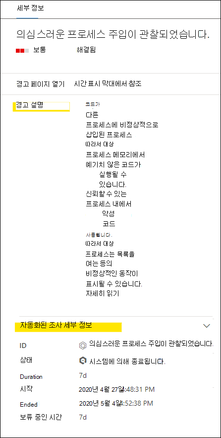

# 끝점용 Microsoft Defender의 경고 검토

[!INCLUDE [Microsoft 365 Defender rebranding](../../includes/microsoft-defender.md)]

**적용 대상:**
- [엔드포인트용 Microsoft Defender](https://go.microsoft.com/fwlink/?linkid=2154037)

> Endpoint용 Defender를 경험하고 싶나요? [무료 평가판을 신청하세요.](https://signup.microsoft.com/create-account/signup?products=7f379fee-c4f9-4278-b0a1-e4c8c2fcdf7e&ru=https://aka.ms/MDEp2OpenTrial?ocid=docs-wdatp-managealerts-abovefoldlink)

Microsoft Defender for Endpoint의 경고 페이지는 선택한 경고와 관련된 공격 신호 및 경고를 결합하여 자세한 경고 스토리를 생성하여 경고에 대한 전체 컨텍스트를 제공합니다.

조직에 영향을 주는 경고를 신속하게 조사하고 효과적인 조치를 취합니다. 트리거된 이유와 한 위치에서의 영향에 대해 이해합니다. 자세한 내용은 이 개요를 참조하세요.

> [!VIDEO https://www.microsoft.com/videoplayer/embed/RE4yiO5]

## 경고 시작

끝점용 Defender에서 경고 이름을 선택하면 경고 페이지로 이동됩니다. 경고 페이지에서 모든 정보가 선택한 경고의 컨텍스트로 표시됩니다. 각 경고 페이지는 다음 4개 섹션으로 구성됩니다.

1. **경고 제목은** 경고의 이름을 표시하며 페이지에서 선택한 경고에 관계없이 현재 조사를 시작한 경고를 알려 주게 됩니다.
2. [**영향을 받는 자산에는**](#review-affected-assets) 추가 정보 및 작업에 대해 클릭할 수 있는 이 경고의 영향을 받는 장치 및 사용자의 카드가 나열됩니다.
3. 경고 **스토리에는** 경고와 관련된 모든 엔터티가 트리 보기로 상호 연결됩니다. 제목의 경고는 선택한 경고 페이지에 처음 방문할 때 포커스가 됩니다. 경고 스토리의 엔터티는 확장 및 클릭 가능하여 경고 페이지의 컨텍스트에서 바로 작업을 수행할 수 있도록 하여 추가 정보와 응답을 제공합니다. 경고 스토리를 사용하여 조사를 시작할 수 있습니다. Microsoft Defender for [Endpoint에서 경고 조사에서 방법을 알아보습니다.](/microsoft-365/security/defender-endpoint/investigate-alerts)
4. 세부 **정보 창에는** 처음에 선택한 경고의 세부 정보 및 이 경고와 관련된 세부 정보 및 작업이 표시됩니다. 경고 스토리에서 영향을 받는 자산 또는 엔터티를 선택하면 세부 정보 창이 변경되어 선택한 개체에 대한 상황에 맞는 정보 및 작업을 제공합니다.

경고의 검색 상태를 메모합니다.

- 금지: 의심스러운 작업을 피했습니다. 예를 들어 파일이 디스크에 기록되지 않은 경우나 실행되지 않았습니다.

  

- 차단: 의심스러운 동작이 실행된 다음 차단됩니다. 예를 들어 프로세스가 실행된 후 의심스러운 동작이 나타냈기 때문에 프로세스가 종료되었습니다.

  

- 검색된: 공격이 감지되고 활성 상태일 수 있습니다.

  

그런 다음 경고의  세부 정보 창에서 자동화된 조사 세부 정보를 검토하여 이미 수행된 작업을 보고 권장 작업에 대한 경고 설명을 읽을 수 있습니다.

경고가 열리면 세부 정보 창에서 사용할 수 있는 기타 정보로는 MITRE 기술, 원본 및 추가 상황 세부 정보가 포함됩니다.

## 영향을 받는 자산 검토

영향을 받는 자산 섹션에서 장치 또는 사용자 카드를 선택하면 세부 정보 창에서 장치 또는 사용자의 세부 정보로 전환됩니다.

- **디바이스의** 경우 세부 정보 창에 도메인, 운영 체제 및 IP와 같은 장치 자체에 대한 정보가 표시됩니다. 활성 경고 및 해당 장치에서 로그온한 사용자도 사용할 수 있습니다. 장치를 차단하거나, 앱 실행을 제한하거나, 바이러스 백신 검색을 실행하여 즉각적인 조치를 취할 수 있습니다. 또는 조사 패키지를 수집하거나 자동화된 조사를 시작하거나 장치 페이지로 이동하여 디바이스의 시점에서 조사할 수 있습니다.

   

- **사용자의** 경우 세부 정보 창에는 사용자의 SAM 이름 및 SID와 같은 자세한 사용자 정보와 이 사용자가 수행한 로그온 유형 및 이와 관련된 모든 알림 및 인시던트가 표시됩니다. 사용자 페이지 *열기 를* 선택하여 해당 사용자의 시점에서 조사를 계속할 수 있습니다.

   

## 관련 항목

- [인시던트 큐 보기 및 구성](view-incidents-queue.md)
- [인시던트 조사](investigate-incidents.md)
- [인시던트 관리](manage-incidents.md)
