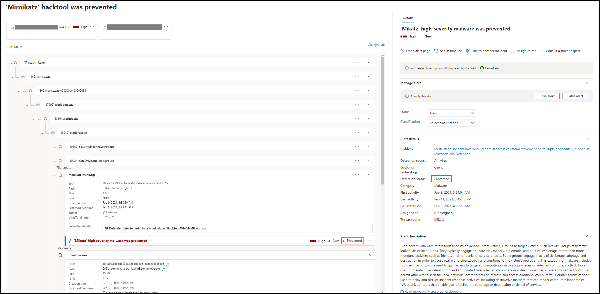
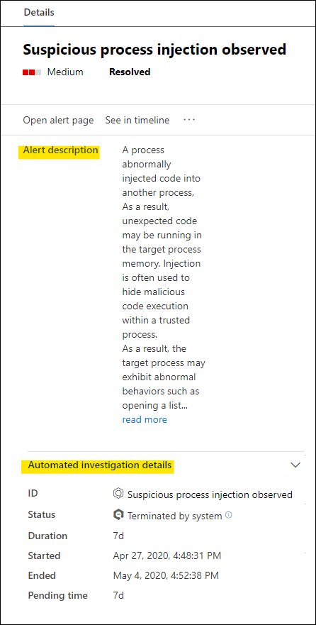

# 끝점용 Microsoft Defender의 경고 검토Review alerts in Microsoft Defender for Endpoint

[!INCLUDE [Microsoft 365 Defender rebranding](../../includes/microsoft-defender.md)]

**적용 대상:****Applies to:**
- [엔드포인트용 Microsoft DefenderMicrosoft Defender for Endpoint](https://go.microsoft.com/fwlink/?linkid=2154037)

>Endpoint용 Defender를 경험하고 싶나요?Want to experience Defender for Endpoint? [무료 평가판에 등록합니다.Sign up for a free trial.](https://www.microsoft.com/microsoft-365/windows/microsoft-defender-atp?ocid=docs-wdatp-managealerts-abovefoldlink)

Microsoft Defender for Endpoint의 경고 페이지는 선택한 경고와 관련된 공격 신호 및 경고를 결합하여 자세한 경고 스토리를 생성하여 경고에 대한 전체 컨텍스트를 제공합니다.The alert page in Microsoft Defender for Endpoint provides full context to the alert, by combining attack signals and alerts related to the selected alert, to construct a detailed alert story.

조직에 영향을 주는 경고를 신속하게 조사하고 효과적인 조치를 취합니다.Quickly triage, investigate, and take effective action on alerts that affect your organization. 트리거된 이유와 한 위치에서의 영향에 대해 이해합니다.Understand why they were triggered, and their impact from one location. 자세한 내용은 이 개요를 참조하세요.Learn more in this overview.

> [!VIDEO https://www.microsoft.com/videoplayer/embed/RE4yiO5]

## 경고 시작Getting started with an alert

끝점용 Defender에서 경고 이름을 선택하면 경고 페이지로 이동됩니다.Selecting an alert's name in Defender for Endpoint will land you on its alert page. 경고 페이지에서 모든 정보가 선택한 경고의 컨텍스트로 표시됩니다.On the alert page, all the information will be shown in context of the selected alert. 각 경고 페이지는 다음 4개 섹션으로 구성됩니다.Each alert page consists of 4 sections:

1. **경고 제목은** 경고의 이름을 표시하며 페이지에서 선택한 경고에 관계없이 현재 조사를 시작한 경고를 알려 주게 됩니다.**The alert title** shows the alert's name and is there to remind you which alert started your current investigation regardless of what you have selected on the page.
2. [**영향을 받는 자산에는**](#review-affected-assets) 추가 정보 및 작업에 대해 클릭할 수 있는 이 경고의 영향을 받는 장치 및 사용자의 카드가 나열됩니다.[**Affected assets**](#review-affected-assets) lists cards of devices and users affected by this alert that are clickable for further information and actions.
3. 경고 **스토리에는** 경고와 관련된 모든 엔터티가 트리 보기로 상호 연결됩니다.The **alert story** displays all entities related to the alert, interconnected by a tree view. 제목의 경고는 선택한 경고 페이지에 처음 방문할 때 포커스가 됩니다.The alert in the title will be the one in focus when you first land on your selected alert's page. 경고 스토리의 엔터티는 확장 및 클릭 가능하여 경고 페이지의 컨텍스트에서 바로 작업을 수행할 수 있도록 하여 추가 정보와 응답을 제공합니다.Entities in the alert story are expandable and clickable, to provide additional information and expedite response by allowing you to take actions right in the context of the alert page. 경고 스토리를 사용하여 조사를 시작할 수 있습니다.Use the alert story to start your investigation. Microsoft Defender for [Endpoint에서 경고 조사에서 방법을 알아보습니다.](/microsoft-365/security/defender-endpoint/investigate-alerts)Learn how in [Investigate alerts in Microsoft Defender for Endpoint](/microsoft-365/security/defender-endpoint/investigate-alerts).
4. 세부 **정보 창에는** 처음에 선택한 경고의 세부 정보 및 이 경고와 관련된 세부 정보 및 작업이 표시됩니다.The **details pane** will show the details of the selected alert at first, with details and actions related to this alert. 경고 스토리에서 영향을 받는 자산 또는 엔터티를 선택하면 세부 정보 창이 변경되어 선택한 개체에 대한 상황에 맞는 정보 및 작업을 제공합니다.If you select any of the affected assets or entities in the alert story, the details pane will change to provide contextual information and actions for the selected object.

경고의 검색 상태를 메모합니다.Note the detection status for your alert. 
- 금지 - 의심스러운 작업을 피했습니다.Prevented – The attempted suspicious action was avoided. 예를 들어 파일이 디스크에 기록되지 않은 경우나 실행되지 않았습니다.For example, a file either wasn’t written to disk or executed.

- 차단 - 의심스러운 동작이 실행된 다음 차단됩니다.Blocked – Suspicious behavior was executed and then blocked. 예를 들어 프로세스가 실행된 후 의심스러운 동작이 나타냈기 때문에 프로세스가 종료되었습니다.For example, a process was executed but because it subsequently exhibited suspicious behaviors, the process was terminated.

- 감지된 – 공격이 감지되고 활성 상태일 수 있습니다.Detected – An attack was detected and is possibly still active.

그런 다음 경고의  세부 정보 창에서 자동화된 조사 세부 정보를 검토하여 이미 수행된 작업을 보고 권장 작업에 대한 경고 설명을 읽을 수 있습니다.You can then also review the *automated investigation details* in your alert's details pane, to see which actions were already taken, as well as reading the alert's description for recommended actions.

경고가 열리면 세부 정보 창에서 사용할 수 있는 기타 정보로는 MITRE 기술, 원본 및 추가 상황 세부 정보가 포함됩니다.Other information available in the details pane when the alert opens includes MITRE techniques, source, and additional contextual details.

## 영향을 받는 자산 검토Review affected assets

영향을 받는 자산 섹션에서 장치 또는 사용자 카드를 선택하면 세부 정보 창에서 장치 또는 사용자의 세부 정보로 전환됩니다.Selecting a device or a user card in the affected assets sections will switch to the details of the device or user in the details pane.

- **디바이스의** 경우 세부 정보 창에 도메인, 운영 체제 및 IP와 같은 장치 자체에 대한 정보가 표시됩니다.**For devices**, the details pane will display information about the device itself, like Domain, Operating System, and IP. 활성 경고 및 해당 장치에서 로그온한 사용자도 사용할 수 있습니다.Active alerts and the logged on users on that device are also available. 장치를 차단하거나, 앱 실행을 제한하거나, 바이러스 백신 검색을 실행하여 즉각적인 조치를 취할 수 있습니다.You can take immediate action by isolating the device, restricting app execution, or running an antivirus scan. 또는 조사 패키지를 수집하거나 자동화된 조사를 시작하거나 장치 페이지로 이동하여 디바이스의 시점에서 조사할 수 있습니다.Alternatively, you could collect an investigation package, initiate an automated investigation, or go to the device page to investigate from the device's point of view.

   

- **사용자의** 경우 세부 정보 창에는 사용자의 SAM 이름 및 SID와 같은 자세한 사용자 정보와 이 사용자가 수행한 로그온 유형 및 이와 관련된 모든 알림 및 인시던트가 표시됩니다.**For users**, the details pane will display detailed user information, such as the user's SAM name and SID, as well as logon types performed by this user and any alerts and incidents related to it. 사용자 페이지 *열기 를* 선택하여 해당 사용자의 시점에서 조사를 계속할 수 있습니다.You can select *Open user page* to continue the investigation from that user's point of view.

   

## 관련 항목Related topics

- [인시던트 큐 보기 및 구성View and organize the incidents queue](view-incidents-queue.md)
- [인시던트 조사Investigate incidents](investigate-incidents.md)
- [인시던트 관리Manage incidents](manage-incidents.md)
